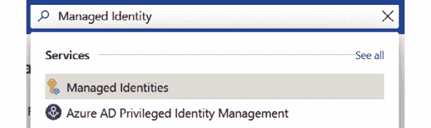
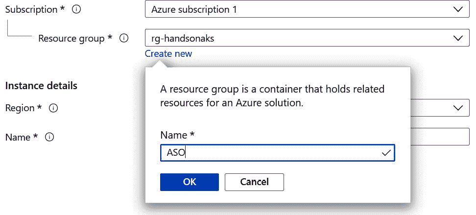
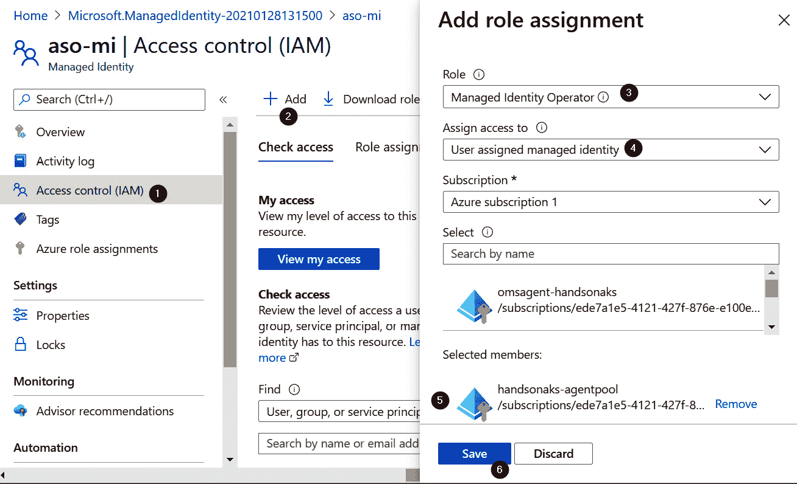
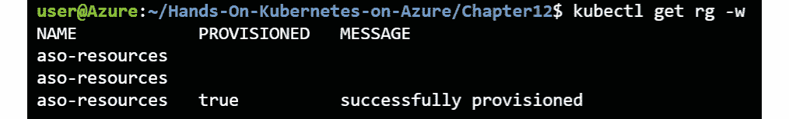
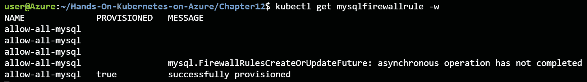
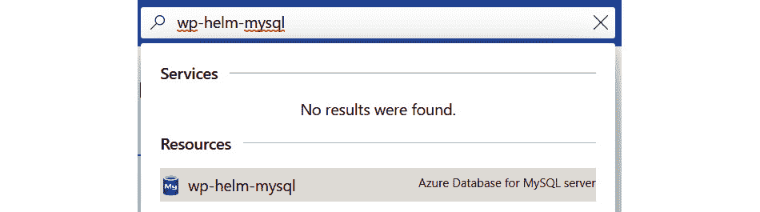
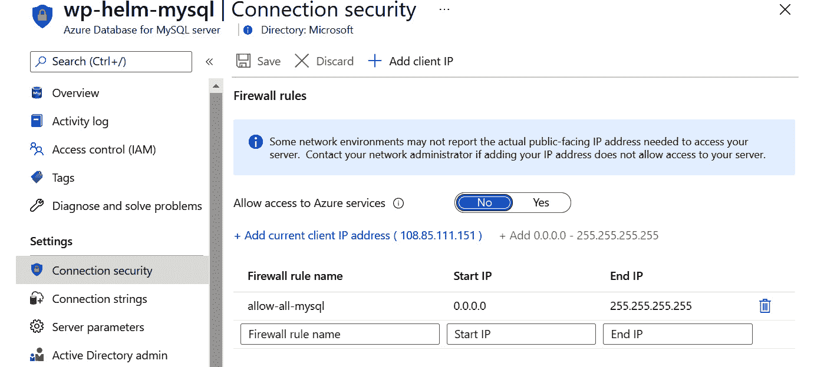
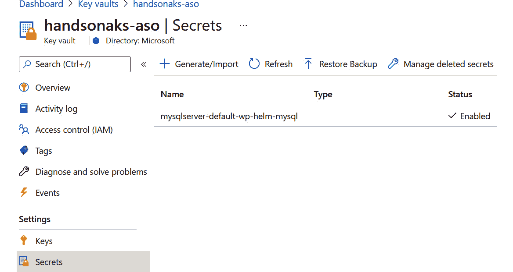
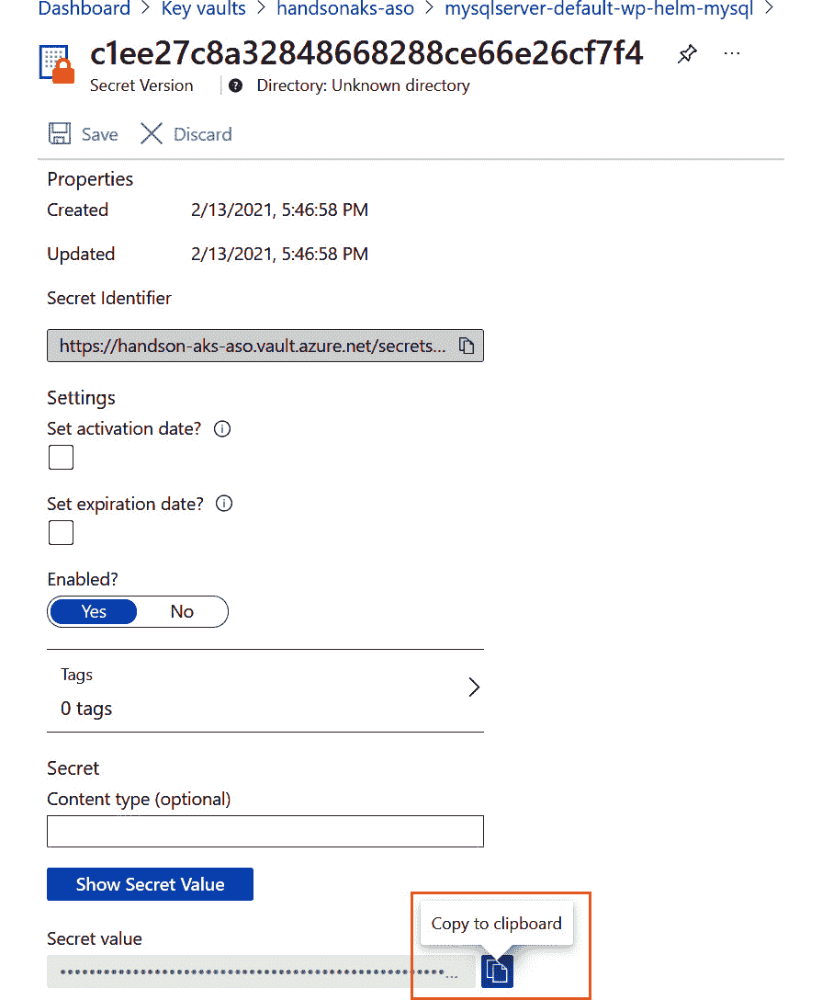
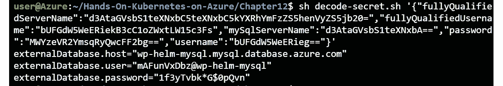

# 12.将应用程序连接到 Azure 数据库

在前几章中，您将应用程序的状态存储在集群中，或者存储在 Redis 集群中，或者存储在 MariaDB 上。您可能还记得，在高可用性方面，两者都有一些问题。本章将带您了解连接到由 Azure 管理的 MySQL 数据库的过程。

我们将讨论使用托管数据库而不是在 Kubernetes 上运行**状态集**的好处。要创建这个托管和管理的数据库，您将使用 **Azure 服务运营商** ( **ASO** )。ASO 是一种从 Kubernetes 集群中创建 Azure 资源的方法，例如托管的 MySQL 数据库。在本章中，您将了解有关 ASO 项目的更多详细信息，并将在集群上设置和配置 ASO。

然后，您将使用 ASO 在 Azure 中创建一个 MySQL 数据库。您将使用这个托管数据库作为 WordPress 应用程序的一部分。这将向您展示如何将应用程序连接到托管数据库。本章分为以下主题:

*   蔚蓝服务运营商
*   在集群上安装 ASO
*   使用 ASO 创建 MySQL 数据库
*   使用 MySQL 数据库创建应用程序

让我们从探索 ASO 开始。

## 蔚蓝服务运营商

在本节中，您将了解更多关于 ASO 的信息。我们将从探索使用托管数据库相对于在 Kubernetes 本身上运行 StatefulSets 的好处开始，然后了解关于 ASO 的更多细节。

到目前为止，你所经历的所有例子都是自成一体的；也就是说，所有的东西都在 Kubernetes 集群内部运行。几乎任何生产应用程序都有一个状态，通常存储在数据库中。虽然与云无关有很大的优势，但在管理有状态工作负载(如数据库)时，这有很大的劣势。

当您在 Kubernetes 集群上运行自己的数据库时，您需要注意可扩展性、安全性、高可用性、灾难恢复和备份。云提供商提供的托管数据库服务可以减轻您或您的团队执行这些任务的负担。例如，MySQL 的 Azure 数据库具有企业级安全性和合规性、内置高可用性和自动备份。该服务可在几秒钟内扩展。最后，您还可以选择将灾难恢复配置到辅助区域。

使用 Azure 中的生产级数据库要比在 Kubernetes 上建立和管理自己的数据库简单得多。在下一节中，您将探索一种可以使用 Kubernetes 在 Azure 上创建这些数据库的方法。

### 什么是 ASO？

与目前大多数应用程序一样，开源社区(包括那些为微软工作的人)已经为我们做了很多艰苦的工作。微软已经意识到，许多用户希望使用 Kubernetes 提供的托管服务，他们需要一种更简单的方法来使用 Kubernetes 部署中使用的相同方法。ASO 项目就是为了解决这个问题而创建的。

ASO 是继**Azure**(**OSBA**项目后，于 2020 年启动的一个新项目。OSBA 是微软最初的实现，它允许您从 Kubernetes 内部创建 Azure 资源，但是这个项目不再被维护，并且已经被弃用。ASO 服务于同样的目的，并得到积极维护和发展。

ASO 由两部分组成:一组**自定义资源定义** ( **CRDs** )和一个管理这些 CRDs 的控制器。CRDs 是 Kubernetes 的一组 API 扩展，允许您指定要创建哪些 Azure 资源。资源组、虚拟机、MySQL 数据库等都有 CRD。

ASO 中的大多数 API 仍然处于 alpha 或 beta 阶段，这意味着它们在未来可能会发生变化。有关最新的资源定义，请参考[https://github.com/Azure/azure-service-operator](https://github.com/Azure/azure-service-operator)的文档，因为本章中使用的定义可能已经更改。

控制器是一个在集群上运行的 pod，它监控库本内斯应用编程接口，以查找使用这些 CRD 创建的任何对象。正是这个控制器将与 Azure 应用编程接口连接，并创建您使用 ASO 创建的资源。

ASO 依赖于您在本书中已经了解的另外两个项目，即**Azure Active Directory**(**Azure AD**)pod 管理的身份和证书管理器。ASO 使用 Azure AD pod 管理的身份将管理的身份链接到 ASO pod。这也意味着该托管身份需要拥有创建这些资源的权限。ASO 使用证书管理器来获取一个证书供 ASO pod 使用。

默认情况下，ASO 会将连接字符串等机密存储在 Kubernetes 机密中。正如您在前面几章中所了解到的，最好将秘密存储在密钥库中，而不是存储在 Kubernetes 中。ASO 也可以选择在密钥库中存储机密，在设置过程中，您将配置 ASO 在密钥库中存储机密。

对于使用 ASO 的用户视角，图 12.1 描述了创建资源时发生的情况:

1.  作为用户，您向 Kubernetes API 提交 Azure 资源的 YAML 定义。蔚蓝色资源是在 CRD 定义的。
2.  ASO 吊舱正在监视 Kubernetes 应用编程接口对 Azure CRD 对象的更改。
3.  当检测到更改时，ASO 将在 Azure 中创建资源。
4.  如果连接字符串是作为资源创建的一部分创建的，则该连接字符串将存储为 Kubernetes 机密(默认)或密钥库中(如果已配置)。

图 12.1:使用 ASO 创建资源的高级流程图

在本节中，您已经学习了 ASO 项目的基础知识。在下一节中，您将继续在集群上安装 ASO。

## 在集群上安装 ASO

要在集群上安装 ASO，您需要一个集群。在前一章的末尾，您删除了集群，因此您将在这里创建一个新集群。之后，您需要创建一个托管身份和密钥库。两者都是设置 ASO 时的最佳实践，这就是本章将解释如何以这种方式设置 ASO 的原因。创建这些资源后，您需要确保在集群中设置了 cert-manager。一旦确认，您可以使用 Helm 图表安装 ASO。

让我们从第一步开始，创建一个新的 AKS 集群。

### 创建新的 AKS 集群

由于您在上一章结束时删除了集群，让我们从创建新集群开始。您可以使用 Cloud Shell 完成所有这些步骤。让我们开始吧:

1.  First, you will create a new cluster. Since you will be making use of pod identities for the authorization of ASO, you will also enable the pod identity add-on on this new cluster. At the time of this writing, the pod identity add-on is in preview.

    如果您尚未按照第 9 章、 *Azure 活动目录窗格管理的身份在 AKS* 中的说明注册订阅此预览，请使用以下命令进行注册:

    az 功能寄存器-名称 EnablePodIdentityPreview \

    -命名空间微软。集装箱服务

    您还需要 Azure 命令行界面的预览扩展，可以使用以下命令安装:

    az 扩展插件-名称 aks-预览

    您必须等到 pod 身份预览在您的订阅上注册。您可以使用以下命令来验证此状态:

    az 功能显示名称 EnablePodIdentityPreview \

    -命名空间微软。ContainerService -o 表

    等到状态显示为已注册，如图*图 12.2* :

    

    图 12.2:等待功能注册

    注册该功能后，您需要在创建新集群之前刷新命名空间的注册。让我们首先刷新名称空间的注册:

    az 提供者注册-命名空间微软。集装箱服务

2.  Once you registered the preview provider, or if you had already done so as part of *Chapter 9*, *Azure Active Directory pod-managed identities in AKS*, you can create a new cluster using the following command:

    az aks create-g rg-handsonaks-n handsonaks \

    -启用-管理-身份-启用-pod-身份\

    -网络插件 azure -节点-虚拟机大小标准 _DS2_v2 \

    -节点数 2 -生成 ssh 密钥

3.  Once the command is finished, get the credentials to get access to your cluster using the following command:

    az aks get-credentials-g rg-handsonaks \

    -n 个手动操作-覆盖-现有

现在，您有了一个启用了 pod 身份的新 Kubernetes 集群。为了继续 ASO 的设置，现在让我们创建一个托管身份。

### 创建托管身份

在本节中，您将使用 Azure 门户创建托管身份。然后，您将授予您的 AKS 集群管理该托管身份的权限，并授予该托管身份访问您的订阅以创建资源的权限。让我们开始吧:

1.  In the Azure search bar, look for *Managed Identities*, as shown in *Figure 12.3*:

    

    图 12.3:搜索托管身份

2.  In the resulting screen, click on + New to create a new managed identity, as shown in *Figure 12.4*:

    

    图 12.4:创建新的托管身份

3.  To organize the resources for this chapter together, create a new resource group called ASO, as shown in *Figure 12.5*:

    

    图 12.5:创建新的资源组

4.  Provide the location and a name for your managed identity; use the name **aso-mi** as shown in *Figure 12.6* if you wish to follow the example here. Make sure to select the same region as the region of your cluster:

    

    图 12.6:为创建托管身份提供项目和实例细节

5.  单击屏幕底部的查看+创建，并创建托管身份。
6.  Once the managed identity is created, you need to capture the client ID and resource ID for later use. Copy and paste this information in a location where you can access it later. You can get the client ID in the Overview pane, as shown in *Figure 12.7*:

    

    图 12.7:从托管身份获取客户端标识

    可以在属性窗格中获取资源 ID，如图*图 12.8* :

    

    图 12.8:获取托管身份的资源标识

7.  The next thing to do on the managed identity is to give our AKS cluster permissions to it. To do this, click on Access control (IAM) in the left pane, click on the + Add button at the top of the screen, click Add role assignment from the dropdown menu, select the Managed Identity Operator role, select User assigned managed identity from the Assign access to dropdown menu, and select the handsonaks-agentpool identity and save. This process is shown in *Figure 12.9*:

    

    图 12.9:授予 AKS 对托管身份的访问权限

8.  You will now give Managed Identities permission to create resources on your subscription. To do this, look for Subscriptions in the Azure search bar, as shown in *Figure 12.10*, and then select your subscription:

    

    图 12.10:在 Azure 搜索栏中查找订阅

9.  在订阅窗格中，单击访问控制(IAM)，单击屏幕顶部的+添加按钮，单击添加角色分配，选择参与者角色，从分配访问权限下拉菜单中选择用户分配的托管身份，然后选择 aso-mi 身份并保存。该过程见*图 12.11* :

图 12.11:将 aso-mi 权限授予您的订阅

这就完成了托管身份的设置。在下一节中，您将创建一个密钥库，并允许刚刚创建的托管身份创建和读取机密。

### 创建密钥库

在本节中，您将创建密钥库，ASO 将使用它来存储连接字符串和机密。这在 ASO 设置过程中是可选的，但建议使用。

1.  To start, look for key vaults in the Azure search bar, as shown in *Figure 12.12*:

    

    图 12.12:在 Azure 搜索栏中查找密钥库

2.  Click the + New button at the top of the screen to create a new key vault. Select the ASO resource group you created earlier and give your key vault a name. Please note that your key vault name has to be unique, so consider adding extra characters to the name if it is not unique. Also, make sure to create the key vault in the same region as your AKS cluster. The resulting configuration is shown in *Figure 12.13*:

    

    图 12.13:密钥库配置

3.  Now select Next: Access policy > to configure a new access policy. Here you will give the aso-mi managed identity you created in the previous section permission to do secret management in this key vault. To do this, start by clicking the + Add Access Policy button, as shown in *Figure 12.14*:

    

    图 12.14:单击+添加访问策略按钮

4.  In the resulting popup, select the Secret Management template, then click on None selected to select your managed identity. In the resulting popup, look for the aso-mi managed identity, select it, and then click Select followed by clicking on Add, as shown in *Figure 12.15*:

    

    图 12.15:向被管理身份添加秘密管理权限

5.  这已在密钥库中配置了访问策略。现在单击“查看+创建”按钮，并在最后一个窗口中点击“创建”以创建密钥库。这应该需要几分钟才能完成。

一旦您的密钥库已经部署，您就可以开始安装 ASO 了，这将在下一节中解释。

### 在集群上设置 ASO

既然您已经拥有了所需的托管身份和密钥库，就可以开始在集群上部署 ASO 了。您可以使用 Cloud Shell 完成所有这些步骤。让我们开始吧:

1.  You created a new cluster in the *Creating a new AKS cluster* section. You will need to link the managed identity you created earlier to the cluster. The ASO components will be created in their own namespace, so you will also create a new namespace for this:

    kubectl 创建命名空间 azureoperator-system

    az aks pod-身份添加-资源-组 rg-handsonaks \

    -cluster-name handsonaks-namespace azure operator-system \

    -名称 aso-身份-绑定\

    -身份-资源-id

2.  Now you can install cert-manager on your cluster. You've done this once before in *Chapter 6*, *Securing your application with HTTPS*, but at the end of the chapter you were asked to remove this component. You can install it again using the following command:

    kube CTL apply-f[https://github . com/jet stack/cert-manager/releases/download/v 1 . 1 . 0/cert-manager . YAML](https://github.com/jetstack/cert-manager/releases/download/v1.1.0/cert-manager.yaml )

3.  Track the deployment status of cert-manager using the following command:

    立方“状态”卷展栏\

    -n 证书管理器部署证书管理器 webhook

    等到铺展显示成功铺开，如图*图 12.16* :

    

    图 12.16:检查证书管理器的部署状态

4.  Once cert-manager has fully rolled out, you can start the ASO installation. Start by adding the Helm repo for ASO using the following command:

    helm repo add azure serviceoperator \

    [https://raw . githubuser content . com/Azure/Azure-service-operator/master/charts](https://raw.githubusercontent.com/Azure/azure-service-operator/master/charts )

5.  Next, you need to provide configuration values for your ASO installation. Open the **values.yaml** file that is part of the code sample that comes with this chapter using the following command:

    code values.yaml

    在该文件中填写所有必需的值，如下所示:

    1 抗忧郁剂:“<tenant id=""></tenant>

    2 azerublicid:“<subscription id="">”</subscription>

    3 AzureOperatorkeyVault:“<key vault="" name="">”</key>

    4 蓝线:

    5 云环境:AzurePublicCloud

    6 蓝宝石:真

    7 图像:

    8 存放处:mcr.microsoft.com/k8s/azureserviceoperator:0.1.16800

    9 installAadPodIdentity: true

    10 aad-pod-标识:

    11 azureIdentityBinding:

    12 名称:aso-身份绑定

    13 选择器:aso_manager_binding

    14 azureIdentity:

    15 启用:真

    16 姓名:aso-身份

    17 类型:0

    18 resource id:“<resource id="">”</resource>

    19 client id:“<client id="">”</client>

    如前面的代码示例所示，您需要提供租户标识、订阅标识、密钥库名称、托管身份的客户端标识(两次)和托管身份的资源标识。您可以使用以下命令找到租户标识和订阅标识:

    az 帐户显示

    这将返回类似于图 12.17 的输出，其中突出显示了租户标识和订阅标识:

    

    图 12.17:获取订阅标识和租户标识

6.  Once you have the values filled in, you can install ASO using the following command:

    helm 升级-安装 aso \

    azureserviceoperator/azure-service-operator \

    -n azure operator-system-create-namespace \

    -f 值. yaml

7.  The installation process takes a couple of minutes. Wait until the following command returns a successful rollout:

    kubectl 部署状态部署\

    -n azure operator-system azure operator-controller-manager

    输出应该类似于*图 12.18* :

    

    图 12.18:检查 ASO 的部署状态

8.  At the time of writing, there was an issue with the **aadpodidbinding** label on the deployment of **azureoperator-controller-manager**. This can, however, be fixed by applying a patch, to apply a new label to that deployment. The patch has been provided in the files for the chapter, specifically in the **patch.yaml** file:

    规格:

    模板:

    元数据:

    标签:

    aadpodidbinding:aso-身份绑定

    如您所见，补丁本身为部署中的 pods 应用了一个新标签。您可以使用以下命令应用修补程序:

    kubectl 补丁部署\

    azure operator-控制器-管理器\

    -n azureoperator-system \

    - patch "$(cat patch.yaml)"

    这将确保您可以在下一节中使用 ASO。

现在 ASO 已经部署在您的集群上，您可以开始使用 Kubernetes 和 ASO 部署 Azure 资源了。您将在下一节中这样做。

## 使用 ASO 为 MySQL 部署 Azure 数据库

在前一节中，您在 Kubernetes 集群上部署了 ASO。这意味着现在您可以使用 Kubernetes API 来部署 Azure 资源。在本节中，您将使用 YAML 文件创建一个在 MySQL 服务的 Azure 数据库上运行的 MySQL 数据库，您将使用**Kubernetes**提交这些文件。让我们开始吧:

1.  First, you need to create a resource group. The code for the resource group definition is also available in the code samples with this chapter. Create this file and save it as **rg.yaml**:

    apiVersion:蓝色。microsoft.com/v1alpha1

    种类:资源组

    元数据:

    名称:aso-resources

    规格:

    地点:

    从资源的代码中可以看到， **apiVersion** 指的是**azure.microsoft.com**而 **kind** 是 **ResourceGroup** 。此外，您还提供了资源组的详细信息，包括名称和位置。确保将**位置**更改为集群的位置。

    您可以使用以下命令创建此资源组:

    库布特雷 create -f rg.yaml

    要监视资源组的创建过程，可以使用以下命令:

    kubectl get resourcegroup -w

    这将返回类似于图 12.19 的输出:

    

    图 12.19:监控新资源组的创建

2.  Let's also verify that the resource group was created in Azure. To do so, look for the resource group name (**aso-resources**, in this example) in the Azure search bar, as shown in *Figure 12.20*:

    

    图 12.20:在 Azure 门户中搜索资源组

    如您所见，资源组在搜索结果中返回，这意味着资源组已成功创建。

3.  Now you can create the MySQL server. You won't create a virtual machine to run MySQL, but rather create a managed MySQL server on Azure. To create this, you can use the **mysql-server.yaml** file that is provided for you:

    1 apiVersion:蓝色。microsoft.com/v1alpha1

    2 类:MySQLServer

    3 元数据:

    4 名称:<mysql-server-name></mysql-server-name>

    5 规格:

    6 位置:

    7 资源组:aso-资源

    8 服务器版本:“8.0”

    9 安全强制:禁用

    10 创建模式:默认

    11 个 sku:

    12 名称:B_Gen5_1

    13 层:基本

    14 家族:第 5 代

    15 尺寸:“5120”

    16 容量:1

    该文件包含 MySQL 服务器的特定配置。一些因素值得指出:

    *   **第 2 行**:这里定义创建一个 **MySQLServer** 实例。
    *   **第 4 行**:这里给服务器一个名字。该名称必须是全局唯一的，因此请考虑将您的首字母附加到服务器名称上。
    *   **第 6 行**:你将要创建的 MySQL 服务器的位置。确保将**位置**更改为集群的位置。
    *   **第 9 行** : **强制**在本演示中被禁用。这样做是为了让演示更容易理解。如果创建生产集群，强烈建议启用**安全强制**。
    *   **第 11-16 行**:这里定义一下 MySQL 服务器的大小。在这种情况下，您正在创建一台容量为 5 GB 的基本服务器。如果您计划将此用于生产用例，您可能需要更大的服务器。

    您可以使用以下命令创建 MySQL 服务器:

    kubi KL create-f MySQL 伺服器. yaml

    这将需要几分钟来完成。您可以使用以下命令跟踪进度:

    忽必烈得到 mysqlserver -w

    这将返回类似于图 12.21 的输出:

    

    图 12.21:监控 MySQL 服务器的创建

    如果您在创建 MySQL 服务器时遇到错误，请参考位于[https://github . com/Azure/Azure-service-operator/blob/master/docs/疑难解答. md](https://github.com/Azure/azure-service-operator/blob/master/docs/troubleshooting.md) 的 ASO 文档。

    一旦您收到服务器已成功配置的消息，您可以通过按下 *Ctrl + C* 退出该命令。

4.  After the MySQL server, you can create the MySQL database. The definition of the MySQL database has been provided in the **mysql-database.yaml** file:

    1 apiVersion:蓝色。microsoft.com/v1alpha1

    2 种:MySQL 数据库

    3 元数据:

    4 名称:wordpress-db

    5 规格:

    6 资源组:aso-资源

    7 服务器:<mysql-server-name></mysql-server-name>

    数据库的定义是提供一个名称并引用您之前创建的服务器。要创建数据库，可以使用以下命令:

    kube CTL create-f MySQL-database . YAML

    这将需要几秒钟来完成。您可以使用以下命令跟踪进度:

    忽必烈得到 mysqldatabase -w

    这将返回类似于图 12.22 的输出:

    

    图 12.22:监控 MySQL 数据库的创建

    一旦您收到数据库已成功设置的消息，您可以通过按下 *Ctrl + C* 退出该命令。

5.  You can create a firewall rule that will allow traffic to your database. In this example, you will create a rule that will allow traffic from all sources. In a production environment, this is not recommended. For the recommended networking configurations for Azure Database for MySQL, please refer to the documentation: [https://docs.microsoft.com/azure/mysql/flexible-server/concepts-networking](https://docs.microsoft.com/azure/mysql/flexible-server/concepts-networking).The configuration for the firewall rule has been provided in the **mysql-firewall.yaml** file:

    1 apiVersion:蓝色。microsoft.com/v1alpha1

    2 个孩子:MySQLFirewallRule

    3 元数据:

    4 名称:允许所有 mysql

    5 规格:

    6 资源组:aso-资源

    7 服务器:<mysql-server-name></mysql-server-name>

    8 startIpAddress: 0.0.0.0

    9 endIpAddress: 255.255.255.255

    如您所见，我们指的是之前创建的 MySQL 服务器，允许来自所有 IP 地址的流量(意思是从 **0.0.0.0** 到 **255.255.255.255** )。

    要创建防火墙规则，您可以使用以下命令:

    kubi KL create-f MySQL 防火墙. yaml

    这将需要几秒钟来完成。您可以使用以下命令跟踪进度:

    多维数据集获取 mysqlfirewallrule -w

    这将返回类似于图 12.23 的输出:

    

    图 12.23:监控 MySQL 防火墙规则的创建

    一旦您收到防火墙规则已成功设置的消息，您可以通过按下 *Ctrl + C* 退出该命令。

6.  Let's verify that all of this was successfully created in the Azure portal. To do so, start by searching for the MySQL server name (**wp-helm-mysql** in this example) in the Azure search bar as shown in *Figure 12.24*. Click on the server to go to the details:

    

    图 12.24:在 Azure 门户中搜索 MySQL 服务器

7.  This will take you to the Overview pane of the MySQL server. Scroll down in this pane and expand the Available resources section. Here you should see that wordpress-db was created, as shown in *Figure 12.25*:

    

    图 12.25:通过 ASO 创建的数据库显示在 Azure 门户中

8.  在 MySQL 服务器窗格中，单击左侧导航中的连接安全性以验证防火墙规则。您应该会在该窗格中看到您通过 ASO 创建的防火墙规则，如图*图 12.26* :

图 12.26:通过 ASO 创建的防火墙规则设置在 MySQL 服务器上

这验证了您能够在 Azure 中使用数据库创建 MySQL 服务器并配置其防火墙设置。

在本节中，您已经使用 ASO 创建了一个 MySQL 服务器，以及该服务器上的一个数据库，然后最终配置了它的防火墙。你可以用库本内斯·YAML 的文件来完成所有这些。ASO 将这些 YAML 文件翻译成 Azure 并为您创建了资源。最后，您可以确认所有内容都是在 Azure 门户中创建和配置的。

在下一部分，也是最后一部分，您将使用这个数据库来支持 WordPress 应用程序。

## 使用 MySQL 数据库创建应用程序

现在你有了一个 MySQL 数据库。为了展示您可以使用这个数据库来配置应用程序，您将使用 WordPress 应用程序。您可以使用 Helm 安装它，并在 Helm 配置中向数据库提供连接信息:

1.  To start, you will need the connection information to your database server. When you installed ASO on your cluster, you configured it to use Key Vault as a secret store rather than Kubernetes secrets. You will need this connection information to connect WordPress to your Azure MySQL database.Search for **Key Vaults** in the Azure search bar, as shown in *Figure 12.27*, click on Key vaults, and then select the key vault you created earlier in the chapter:

    

    图 12.27:在 Azure 门户中搜索关键存储库

2.  In the resulting pane, click on Secrets in the left-hand navigation and then click on the secret, as shown in *Figure 12.28*. The name of this secret follows the naming convention **<object type>-<Kubernetes namesapce>-<object name>**.

    

    图 12.28:Azure 门户中的 MySQL 秘密

3.  You will then get a view with multiple versions of your secret; click the current version as shown in *Figure 12.29*:

    

    图 12.29:密钥库中不同的秘密版本

    现在，复制秘密的值，如图*图 12.30* :

    

    图 12.30:将秘密的值复制到剪贴板

4.  The secret contains several pieces of information related to your database connection that you will need for the Helm installation. It contains the fully qualified server name, the username, and the password. The values in the secret are Base64 encoded. To make working with this secret easier, a shell script has been provided that will give you the required decoded values. To run this script, use the following command:

    sh decode-secret.sh

    *图 12.31* 举例说明:

    

    图 12.31:解码秘密

5.  You can use the values outputted by the previous step to configure Helm to use your Azure MySQL database. The following Helm command will set up WordPress on your cluster, but use an external database:

    helm repo add bitnami https://charts . bitnami . com/bitnami

    头盔安装 wp bitnami/wordpress \

    -设置 mariadb.enabled=false \

    -设置 externalddatabase . host = '<decoded host="" value="">' \</decoded>

    -设置外部数据库。用户=' <decoded user="" value="">' \</decoded>

    -设置外部数据库。密码=' <decoded password="" value="">' \</decoded>

    -设置 externalddatabase . database = ' WordPress-db ' \

    -设置 externalDatabase.port = ' 3306 '

    如您所见，使用此命令，您通过将 **mariadb.enabled** 值设置为 **false** 来禁用 MariaDB 安装，然后将连接信息提供给外部数据库。

    要监控 WordPress 的设置，可以使用以下命令:

    忽必烈得到 pods -w

    这将需要几分钟来完全设置，最后，您应该会看到 WordPress pod 处于运行状态并准备就绪，如图 12.32 所示:

    

    图 12.32:运行状态下的 WordPress pod

    一旦吊舱运行并准备好，您可以通过按下 *Ctrl + C* 来停止该命令。如果你还记得在第 3 章**中的 WordPress 部署，在 AKS* 上的应用程序部署，在 WordPress 安装中有第二个 pod，托管一个 MariaDB 数据库。自从我们用 Azure MySQL 数据库替换它后，这个 pod 就不再存在了。*

**   Let's now finally connect to this WordPress application. You can get the public IP address of the WordPress website using the following command:

    忽必烈得到服务

    这将向您显示公共 IP，如图*图 12.33* :

    

    图 12.33:获取 WordPress 网站的公共 IP

    在你的网络浏览器地址栏中输入这个 IP 地址，点击*进入*。你应该可以看到带有默认演示帖子的 WordPress 登陆页面，如图*图 12.34* :

    

    图 12.34:浏览 WordPress 网站

    你现在有了一个在 Kubernetes 上托管的功能齐全的 WordPress 网站，数据库由 MySQL 的 Azure 数据库支持。

    *   This concluded the examples from this chapter. You created a number of resources and installed a number of cluster components. Let's also clean them up from the cluster using the following commands:

    helm 卸载 wp

    忽必烈删除-f mysql 防火墙. yaml

    忽必烈 delete -f mysql 数据库. yaml

    忽必烈 delete -f mysql 服务器. yaml

    忽必烈 delete -f rg.yaml

    helm 卸载 aso-n azure operator-系统

    az aks pod-标识删除-资源-组 rg-handsonaks \

    -cluster-name handsonaks-namespace azure operator-system \

    -名称 aso-身份绑定

    kubectl delete 命名空间 azureoperator-system

    kube CTL delete-f[https://github . com/jet stack/cert-manager/releases/download/v 1 . 1 . 0/cert-manager . YAML](https://github.com/jetstack/cert-manager/releases/download/v1.1.0/cert-manager.yaml )

    az 组删除-n aso -是* 

 *您已经能够将 Kubernetes 上的应用程序连接到 Azure 管理的 MySQL 数据库。您使用了 WordPress Helm 图表，并提供了自定义值来配置该 Helm 图表，使其连接到托管数据库。

## 总结

本章介绍**蔚蓝服务运营商** ( **ASO** )。ASO 是一个开源项目，它使得使用 Kubernetes 创建 Azure 服务成为可能。这允许您作为用户不必在 Azure 门户或命令行界面与 Kubernetes 资源定义之间切换。

在本章中，您创建了一个新的 AKS 集群，然后在该集群上安装了 ASO。然后，您使用 ASO 在 Azure 上创建了一个 MySQL 数据库。您使用 Azure 门户验证了该数据库在 Azure 中可用。

最后，您在连接到外部数据库的 Kubernetes 集群上创建了一个 WordPress 应用程序。正如您在前面几章中看到的，您已经验证了应用程序正在运行并且可用。

在下一章中，您将了解 Azure 与 AKS 的其他集成，即 Azure 安全中心和用于 Kubernetes 的 Azure Defender，它们用于监控集群的安全配置并减轻威胁。*