# 13.【Kubernetes 天蓝色安全中心

Kubernetes 是一个非常强大的平台，有很多配置选项。以正确的方式配置您的工作负载并确保遵循最佳实践可能会很困难。您可以遵循一些行业基准来获得如何安全部署工作负载的指南，例如互联网安全中心**(**CIS**)Kubernetes基准:[https://www.cisecurity.org/benchmark/kubernetes/](13.html)。**

 **Azure 安全中心是一个统一的基础设施安全管理平台。它为 Azure 中的资源以及混合工作负载提供持续的安全监控和警报。它为许多 Azure 资源提供保护，包括 Kubernetes 集群。这将使您能够确保您的工作负载得到安全配置和保护。

Azure 安全中心提供两种类型的保护。首先，它监控您的资源配置，并将其与安全最佳实践进行比较，然后为您提供可操作的建议，以改善您的安全状况。其次，它还通过评估您的工作负载并在发现潜在威胁时发出警报来提供威胁防护。这种威胁检测功能是 Azure 安全中心内名为 Azure Defender 的功能的一部分。

说到监控 Kubernetes 工作负载，Azure 安全中心可以监控集群配置以及集群中运行的工作负载的配置。为了监控集群中工作负载的配置，Azure 安全中心对 Kubernetes 使用 Microsoft Azure 策略。这个免费的 Azure Kubernetes 服务插件将使 Azure 安全中心能够将您的工作负载配置与已知的最佳实践进行比较。

Azure Defender 还具有针对 Kubernetes 的特定威胁检测功能。它监控 Kubernetes 审核日志、节点日志以及集群和工作负载配置的组合，以识别潜在威胁。可以发现的威胁的例子有:加密矿工、创建高特权角色或暴露 Kubernetes 仪表板。

在本章中，您将启用 Azure 安全中心、Kubernetes 的 Azure 策略和 Kubernetes 的 Azure Defender，并监控几个示例应用以抵御威胁。

在本章中，我们将涵盖以下主题:

*   Kubernetes 的 Azure 安全中心
*   Kubernetes的蓝色卫士
*   部署违规工作负载
*   使用 Azure 安全评分分析配置
*   使用 Azure Defender 消除威胁

让我们从为 Kubernetes 设置 Azure 安全中心开始。

## 为 Kubernetes 建立 Azure 安全中心

我们将从为 Kubernetes 设置 Azure 安全中心开始这一章。要为 Kubernetes 启用 Azure 安全中心，您需要为集群上的 AKS 启用 Azure 策略。这将使 Azure Security 能够监控您的工作负载配置。为了受益于 Azure Defender 的威胁防护，您还需要在订阅中为 Kubernetes 启用 Azure Defender。

我们开始吧。

1.  Search for your AKS cluster in the Azure search bar, as shown in *Figure 13.1*:

    

    图 13.1:在 Azure 搜索栏中查找您的集群

2.  You will now enable Azure Policy for AKS. To enable this, click the Policies button on the left-hand side and on the resulting pane, click on Enable add-on, as shown in *Figure 13.2*:

    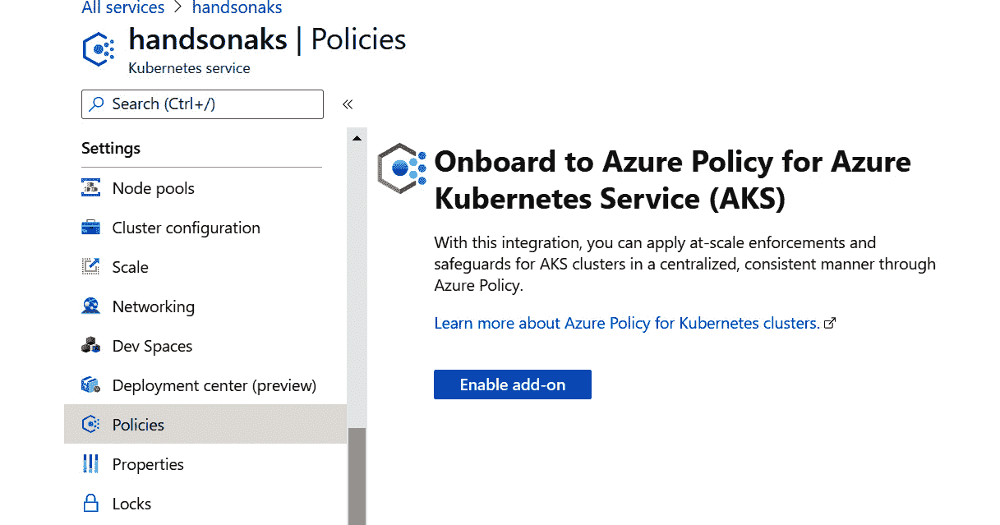

    图 13.2:为 AKS 启用 Azure 策略

    启用该加载项需要几分钟的时间才能完成。过一会儿，你应该会看到一条消息，说服务现在启用了，如图*图 13.3* :

    

    图 13.3:AKS 的 Azure 策略现已启用

3.  This has enabled Azure Policy for AKS. Next, you will enable Azure Defender to get the threat prevention ability from Azure Security Center. To do so, look up **security center** in the Azure portal's search bar, as shown in *Figure 13.4*:

    

    图 13.4:在 Azure 门户搜索栏中搜索安全中心

4.  如果这是您第一次在订阅中访问 Azure 安全中心，您将收到一条消息，如图 13.5 所示。要启用 Azure Defender，请单击屏幕底部的升级:

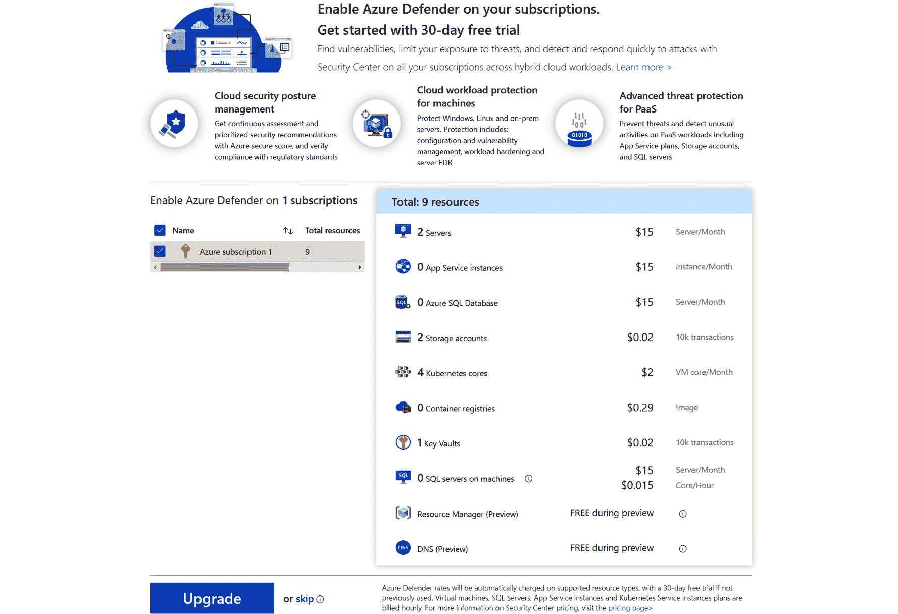

图 13.5:升级到 Azure Defender

如果您不是第一次在订阅中访问 Azure 安全中心，您可能不会收到此消息来启用 Azure Defender。要启用它，点击左侧的定价和设置，选择您的订阅，如图*图 13.6* :

图 13.6:手动升级到 Azure Defender

在结果窗格中，选择标题为 Azure Defender 的右框，然后单击屏幕顶部的“保存”按钮以启用 Azure Defender。或者，您可以调整您想要为哪个服务启用/禁用 Azure Defender，如图 13.7*所示:*

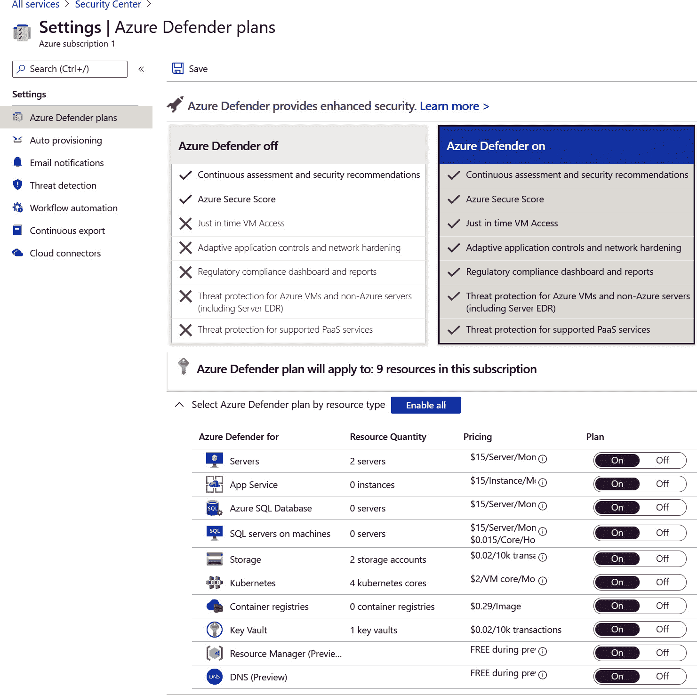

图 13.7:为您的订阅打开 Azure Defender

现在您已经启用了 Azure 安全中心和 Azure Defender，系统最多需要 30 分钟来配置默认策略和启动检测。

当您等待此配置生效时，您将在集群上部署几个违规的工作负载，这将在 Azure Defender 中触发警报。

## 部署违规工作负载

要在 Azure 安全中心触发建议和威胁警报，您需要在集群上部署违规工作负载。在本节中，您将向集群部署大量工作负载，这些工作负载要么没有按照最佳实践进行配置，要么甚至包含潜在的恶意软件，如加密矿工。让我们来看看在本章的代码示例中可以找到的违规工作负载示例:

*   **crypto-miner.yaml**: This file contains a deployment that will create a crypto-miner on your cluster.

    1 API 版本:apps/v1

    2 种:部署

    3 元数据:

    4 名称:加密矿工

    5 个标签:

    6 app:采矿

    7 规格:

    8 个副本:1 个

    9 选择器:

    10 个匹配标签:

    11 款应用:采矿

    12 模板:

    13 元数据:

    14 个标签:

    15 应用:采矿

    16 规格:

    17 个容器:

    18 -名称:采矿

    19 图片:kanix/monero-miner:最新

该文件是 Kubernetes 中的常规部署。正如您在*第 19 行*中看到的，这个部署的容器映像将是一个加密挖掘器。

#### 注意

如使用 Azure Defender 中和威胁一节所述，确保在完成本章后立即停止运行加密挖掘程序。运行加密挖掘器的时间超过这个例子的要求是没有意义的。

*   **escalation.yaml**: This file contains a deployment that allows privilege escalations in the container. This means that a process in the container can get access to the host operating system. There are cases where this is desired behavior, but typically you don't want this configuration.

    1 API 版本:apps/v1

    2 种:部署

    3 元数据:

    4 名称:升级

    5 个标签:

    6 应用:nginx-升级

    7 规格:

    8 个副本:1 个

    9 选择器:

    10 个匹配标签:

    11 应用:nginx-升级

    12 模板:

    13 元数据:

    14 个标签:

    15 应用:nginx-升级

    16 规格:

    17 个容器:

    18 -名称:nginx-升级

    19 图:基尼系数:高山

    20 安全上下文:

    21 allowPrivilegeEscalation 升级:true

正如您在前面的代码示例中所看到的，在*第 20–21 行*上，您使用 **securityContext** 配置了容器的安全上下文。您允许在*第 21 行*进行权限升级。

*   **host-volume.yaml**: This file contains a deployment with a directory on the host mounted in the container. This is not recommended because this way, the container can get access to the host.

    1 API 版本:apps/v1

    2 种:部署

    3 元数据:

    4 名称:主机卷

    5 个标签:

    6 app:engine 主机卷

    7 规格:

    8 个副本:1 个

    9 选择器:

    10 个匹配标签:

    11 app:engine 主机卷

    12 模板:

    13 元数据:

    14 个标签:

    15 个应用:engine x 主机卷

    16 规格:

    17 个容器:

    18 -名称:nginx-主机-卷

    19 图:基尼系数:高山

    20 卷安装:

    21 -安装路径:/测试-pd

    22 名称:测试卷

    23 只读:真

    24 卷:

    25 -名称:测试卷

    26 主机路径:

    27 #主机上的目录

    28 路径:/tmp

该代码示例包含一个**卷安装**字段和一个卷。正如您在*第 24-28 行*中看到的，该卷正在使用**主机路径**，这意味着它在运行容器的节点上安装了一个卷。

*   **role.yaml**: A role with very broad permissions. It is recommended to approach roles in Kubernetes with the principle of least privilege to ensure permissions are tightly controlled. A role with broad permissions is first and foremost a bad configuration, but worse, could be a sign of compromise on your cluster.

    1 版本:rbac.authorization.k8s.io/v1

    2 子代:群集角色

    3 元数据:

    4 名称:超级管理员

    5 条规则:

    6 - apiGroups: ["*" ]

    7 资源:["*"]

    8 个动词:["*"]

**集群角色**的这个实例给出了非常广泛的权限，正如您在*第 6-8 行*中看到的。这种配置赋予任何被分配了这个角色的人对 Kubernetes 中所有 API 上的所有资源的所有权限。

这些代码示例中的部署都不包含资源请求和限制。如*第 3 章*、*在 AKS* 上的应用部署所述，建议配置资源请求和限制，因为这些可以防止工作负载消耗过多的资源。

最后，您还将在公共服务上部署 Kubernetes 仪表板。这也是非常不鼓励的，因为这可能会无意中让攻击者访问您的集群。您将看到 Azure Defender 如何检测到这一点。

让我们开始部署这些文件。

1.  在 Azure 门户中打开 Cloud Shell，导航到本章的代码示例。
2.  Once there, execute the following commands to create the offending workloads.

    忽必烈 create-f crypto-miner YAML

    kubectl create -f 升级. yaml

    忽必烈 create-f host volume . YAML

    kubi KL create-f role . YAML 角色

    这将创建类似于图 13.8 的输出:

    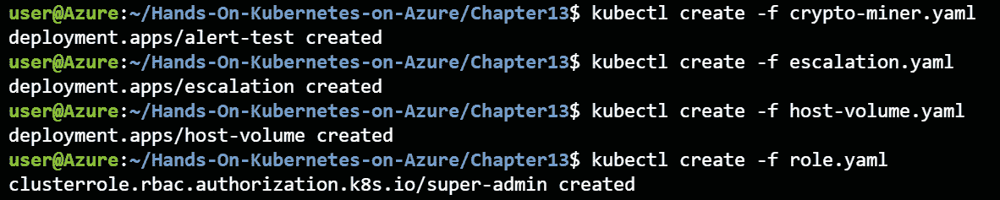

    图 13.8:创建违规的工作负载

3.  Now, deploy the Kubernetes dashboard using the following command:

    忽必烈申请-f[**https://raw . githubuser content . com/kubrines/dashboard/v 2 . 0 . 0/AIO/deploy/recommended . YAML**](13.html)

    这将创建类似于图 13.9 的输出:

    

    图 13.9:创建 Kubernetes 仪表板

4.  By default, the Kubernetes dashboard is not exposed through a load balancer. This is also the recommended configuration, because the dashboard gives broad access to your cluster. In this chapter, however, you will create this discouraged configuration to trigger a security alert in Azure Defender. To add a load balancer to the Kubernetes dashboard, use the following command:

    立方修补服务\

    立方结构仪表板-n 立方结构仪表板\

    -p“{ spec }”:{“type”:“Load 平衡器”}}

    这将修补该服务，并将其转换为**负载平衡器**类型的服务。验证是否已成功修补，并使用以下命令获取服务的公共 IP 地址:

    kubicl get service-n kubi tes 仪表板

    这将产生类似于图 13.10 的输出:

    

    图 13.10:获取 kubernetes 仪表板服务的公共 IP

5.  通过浏览 **https:// <公共 IP >** 验证您是否可以访问该服务。根据您的浏览器配置，您可能会得到一个证书错误，您可以通过选择继续到<公共 IP >(不安全)来绕过该错误，如图*图 13.11* :

图 13.11:关于 Kubernetes 仪表板服务上证书的安全警告

一旦你已经继续到仪表板，你应该得到一个登录屏幕，如图*图 13.12* :

图 13.12:暴露的 Kubernetes 仪表板

您不会在此处登录仪表板，但如果您希望探索其功能，请参考位于[https://Kubernetes . io/docs/tasks/access-application-cluster/web-ui-dashboard/](13.html)的 Kubernetes 文档。

现在，您的集群上运行着五个有问题的工作负载。其中一些将导致 Azure 安全中心出现配置警告；有些甚至会触发安全警报。您将在本章接下来的两节中探讨这些问题。

## 使用 Azure 安全评分分析配置

在前一节中，您创建了几个故意配置错误的工作负载。在本节中，您将查看 Azure 安全中心中与这些工作负载相关的建议。

#### 注意

创建工作负载后，可能需要 30 分钟才能显示建议和警报。

1.  After you have created the offending workloads, you will get security recommendations in Azure Security Center. To start, click on Secure Score in the left-hand navigation within Azure Security Center. This will show you a pane similar to *Figure 13.13*:

    

    图 13.13:Azure 安全中心的安全评分

    您在这里看到的是您的环境安全状况的摘要。在*图 13.13* 所示的示例中，您可以看到整体安全得分为 32%。如果您管理多个 Azure 订阅，该视图可以让您快速鸟瞰环境的安全配置。

2.  Let's drill down into the configuration of the Kubernetes cluster by clicking on the Azure subscription 1 subscription at the bottom of *Figure 13.13*. This will bring you to a pane similar to *Figure 13.14*:

    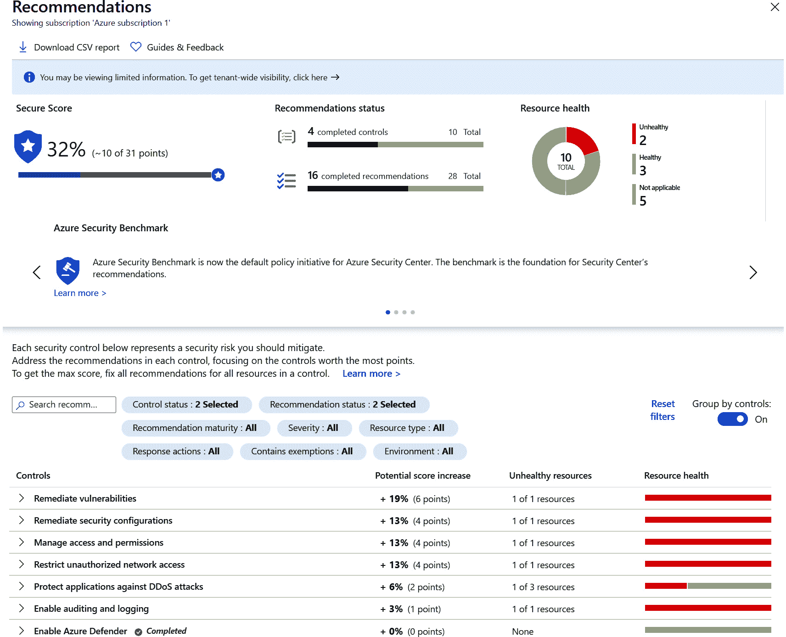

    图 13.14:订阅的安全评分详细信息

    此视图包含有关此订阅的安全分数的更多详细信息。它再次向您显示安全分数，以及推荐状态和资源运行状况。屏幕底部包含有关具体建议的更多详细信息。

3.  Tune this screen to get more insight into the Kubernetes recommendations. To do this, disable the Group by controls option on the right-hand side of the screen, and set the Resource type filter to managed cluster, as shown in *Figure 13.15*:

    

    图 13.15:Azure 安全中心中的 Kubernetes 建议

    您现在看到的是 Azure 安全中心推荐的 Kubernetes 安全建议列表。该列表过于详尽，无法在本章中完全涵盖，但如果您想了解每项建议的更多详细信息，请参考 AKS 文档以获得更详细的描述:[https://docs.microsoft.com/azure/aks/policy-reference](13.html)。

4.  Let's, however, explore a number of the recommendations that were caused by the offending workloads you created earlier. Start by clicking on the recommendation called Container with privilege escalation should be avoided. This will bring you to a view similar to *Figure 13.16*:

    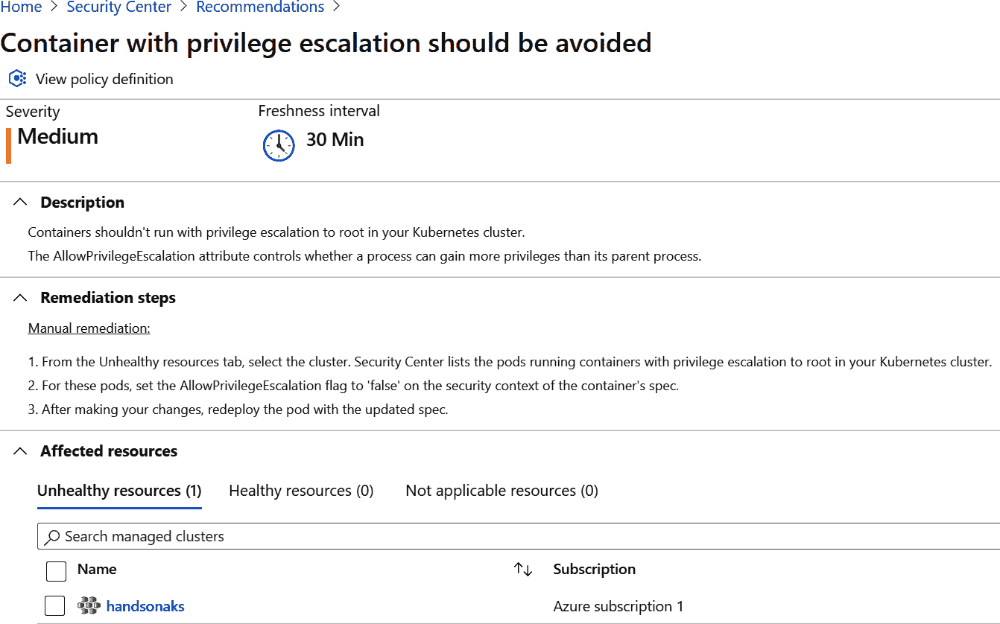

    图 13.16:应该避免推荐带有权限升级的容器的细节

    如您所见，此建议包含对建议本身的描述，以及遵循此建议的许多补救步骤。它还向您显示了受影响的资源，在本例中是一个 AKS 集群。如果你点击集群，你甚至会得到更多关于违规工作负载的细节，如图*图 13.17* :

    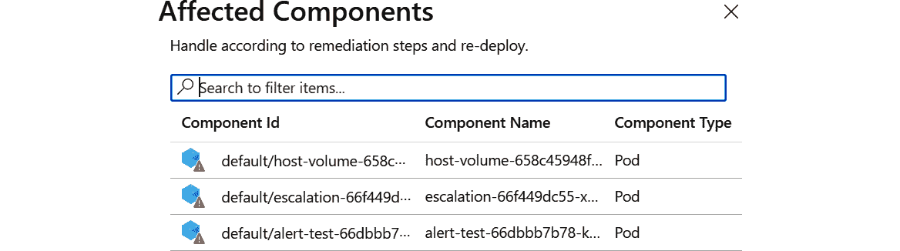

    图 13.17:受权限提升建议影响的 Pods

    在这种情况下，您创建的每个 pods 都触发了此建议，而不仅仅是允许权限升级的 pods。这向您表明，默认情况下，Kubernetes 允许这种权限升级，您应该在所有部署中实现这种保护。这向您展示了安全监控解决方案(如 Azure 安全中心)的优势，可以监控默认配置的潜在副作用。

5.  Let's apply the suggested remediation to this issue. To solve the privilege escalation, you will need to configure the security context of the container to no longer allow privilege escalation. This can be done by updating each deployment using the following commands:

    kubectl 补丁部署 crypto-miner -p '

    {

    " spec ":{ 0

    "模板":{ 0

    " spec ":{ 0

    “容器”:[

    {

    “名称”:“采矿”，

    " security context ":{ 0

    “允许特权升级”:假

    }

    }

    ]

    }

    }

    }

    }

    '

    kubectl 补丁部署升级-p '

    {

    " spec ":{ 0

    "模板":{ 0

    " spec ":{ 0

    “容器”:[

    {

    “名称”:“nginx-升级”，

    " security context ":{ 0

    “允许特权升级”:假

    }

    }

    ]

    }

    }

    }

    }

    '

    kubectl 补丁部署主机-卷-p '

    {

    " spec ":{ 0

    "模板":{ 0

    " spec ":{ 0

    “容器”:[

    {

    “名称”:“nginx-主机-卷”，

    " security context ":{ 0

    “允许特权升级”:假

    }

    }

    ]

    }

    }

    }

    }

    '

    正如您在命令中看到的，您正在修补每个部署。在每个补丁中，您将配置**安全上下文**字段并将**允许特权升级**字段设置为**假**。

    应用修补程序后，Azure 安全中心最多需要 30 分钟来刷新安全建议。过了这段时间后，您的集群应该作为该推荐的健康资源出现，如图 13.18*所示:*

    

    图 13.18:集群现在对于权限提升建议是健康的

6.  Let's investigate another recommendation, namely the one called Usage of pod HostPath volume mounts should be restricted to a known list to restrict node access from compromised containers. Click on this recommendation to be shown more details, as shown in *Figure 13.19*:

    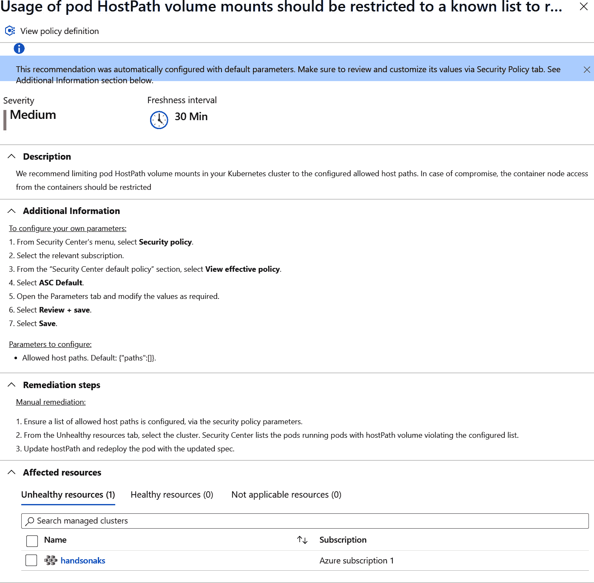

    图 13.19:关于主机路径建议的更多细节

    该建议向您显示了与上一条类似的信息。但是，触发此建议的策略可以进行调整，以允许访问某些**主机路径**。让我们探索如何编辑策略以允许这一点。

7.  Go back to the Azure Security Center main pane and click on Security policy on the left-hand side. In the resulting pane, click on your subscription and then click on the ASC Default assignment shown in *Figure 13.20*:

    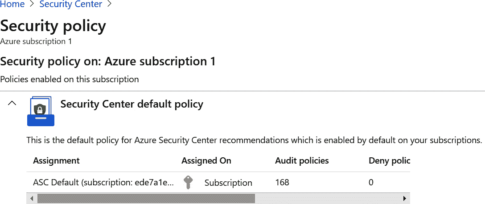

    图 13.20: ASC 默认策略分配

8.  In the resulting pane, click on Parameters at the top of the screen. Look for Allowed host paths in the list of parameters and change that parameter to the following:

    { " path ":["/tmp "]}

    结果见*图 13.21* :

    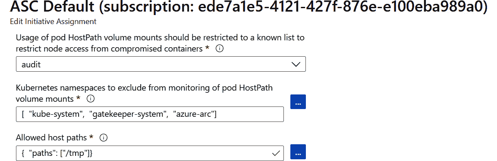

    图 13.21:向允许的主机路径添加路径

    要应用更改，请单击屏幕底部的“审阅+保存”，然后在最终屏幕上单击“保存”:

    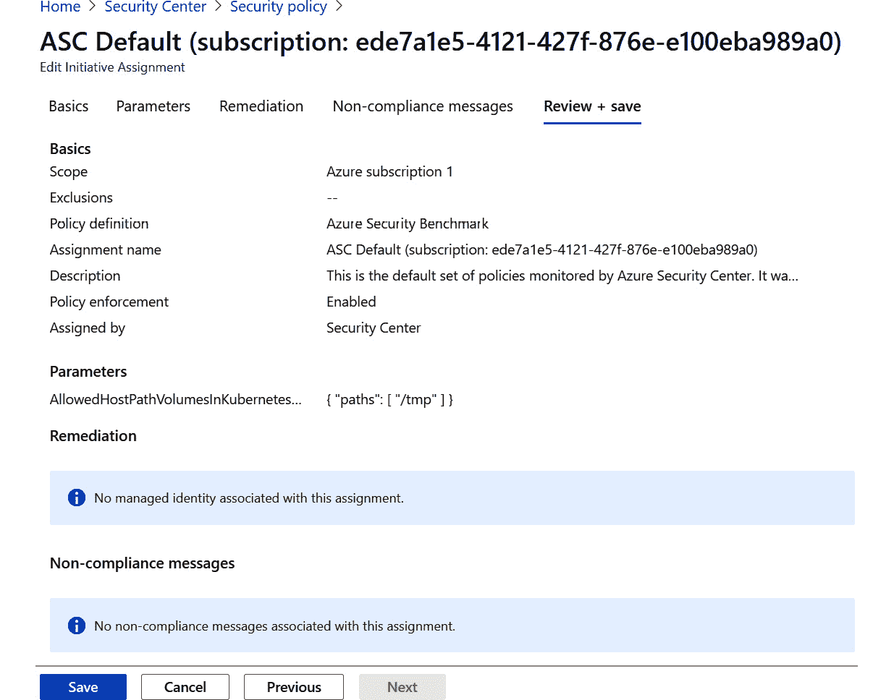

    图 13.22:单击保存确认策略更改

    现在大约需要 30 分钟来刷新建议。30 分钟后，该建议将不再有效，因为您配置了允许的 **/tmp** 路径。

9.  在这个列表中，有一个最后的建议值得强调。也就是说，Kubernetes 服务管理应用编程接口服务器应该配置为受限访问。如果你还记得，在*第 11 章*、*AKS*的网络安全中，你在你的集群上配置了授权的 IP 范围。这是微软推荐的，也显示为 Azure 安全中心推荐。点击该推荐获取更多详情，如图*图 13.23* :

图 13.23:解释应该启用授权 IP 范围的详细信息

如您所见，您再次获得了建议和补救步骤的描述。该建议值得强调的原因是，它包含 Azure 安全中心内的快速修复补救。要快速修复此建议，请选择您的 AKS 集群，然后单击屏幕底部的修复，如图 13.24 所示:

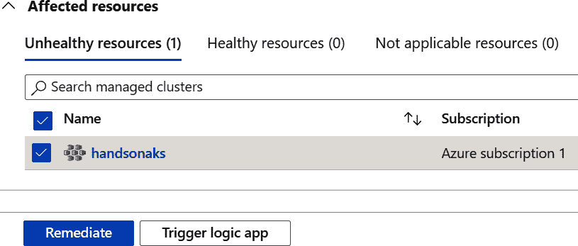

图 13.24:修正授权的知识产权建议

这将向您显示类似于图 13.25 的视图，您可以在其中输入授权访问所需的 IP 范围。

图 13.25:通过 Azure 安全中心设置授权的 IP 范围

您可以从 Azure 安全中心配置此配置。由于您将在接下来的步骤和章节中使用云外壳，并且云外壳没有固定的 IP，因此不建议在阅读本书时应用补救措施。但是，值得一提的是，Azure 安全中心允许您直接从安全中心内部修正某些配置建议。

现在，您已经了解了 Azure 安全中心的建议和安全评分。如果您想了解更多信息，请参考 Azure 文档，其中包含一个完全配置了所有建议的 YAML 部署示例:[https://docs . Microsoft . com/Azure/security-center/kubernetes-workload-protections](13.html)。

## 使用 Azure Defender 中和威胁

现在，您已经探索了使用 Azure 安全中心和 Secure Score 的配置最佳实践，接下来您将探索如何调查和处理安全警报和活动威胁。您创建的一些工作负载现在应该已经触发了安全警报，您可以在 Azure Defender 中进行调查。

具体来说，在*部署违规工作负载*部分，您在 Azure Defender 中创建了三个触发安全警报的工作负载:

*   **crypto-miner.yaml** :通过部署这个文件，您在集群上创建了一个 crypto-miner。这个加密挖掘器将在 Azure Defender 中生成两个安全警报，您将在本节中看到。一个警报将通过监控 Kubernetes 集群本身生成，而另一个警报将基于 DNS 流量生成。
*   **角色. yaml** :这个文件包含一个集群范围的角色，权限非常广泛。这将在 Azure Defender 中生成安全警报，通知您存在风险。
*   Kubernetes 仪表板:您还创建了 Kubernetes 仪表板，并公开展示了这一点。Azure Defender 也将基于此生成安全警报。

让我们详细探讨一下这些安全警报:

1.  To start, in Azure Security Center, click on Azure Defender in the left-hand navigation bar. This will open the Azure Defender pane in Azure Security Center. This shows you your coverage, your security alerts, and the advanced protection options, as shown in *Figure 13.26*. In this section, you will focus on the four security alerts that were generated.

    

    图 13.26: Azure Defender -概述窗格

2.  To get more details about the security alerts, click anywhere on the Security alerts bar chart in the middle of the screen. That will take you to a new pane, as shown in *Figure 13.27*:

    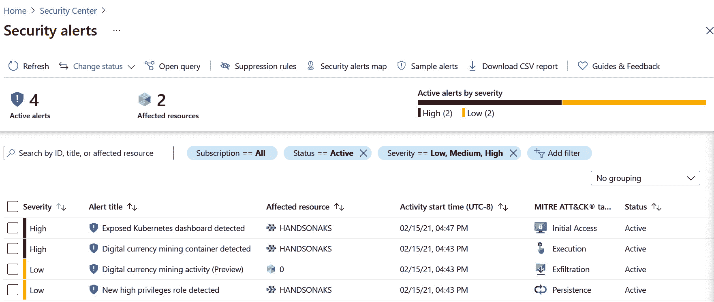

    图 13.27:Azure Defender 中的安全警报

    正如您在*图 13.27* 中所看到的，已经触发了四个安全警报:一个针对暴露的 Kubernetes 仪表板，两个针对加密挖掘器，一个针对高特权角色。让我们更详细地探讨每一个。

3.  Let's start by exploring the Exposed Kubernetes dashboard detected alert. Click on the alert title to get more details. To see all the details, click on View full details in the resulting pane, as shown in *Figure 13.28*:

    

    图 13.28:获取警报的全部细节

    这将带您进入一个新的窗格，如图 13.29*所示:*

    

    图 13.29:暴露的 Kubernetes 仪表板检测到警报的详细信息

    这向您展示了几个信息点。首先，它将此警报分类为高严重性，将其标记为活动，并标记首次遇到它的时间。接下来，您会看到警报的描述，在这种情况下，它解释了仪表板不应该公开。它还会向您显示受影响的资源。最后，您会看到此攻击针对的是 MITRE ATT&CK 战术框架的哪个阶段。米特 ATT&CK 战术框架是一个描述网络攻击多个阶段的框架。更多关于米特 ATT&CK 战术的信息，请参考[https://attack.mitre.org/versions/v7/](https://attack.mitre.org/versions/v7/)。

    在屏幕的右侧，您可以获得有关警报的更多详细信息。其中包含服务名称、命名空间、服务端口、后端 pods 上公开的目标端口，以及受影响的 Azure 资源 ID 和订阅 ID。如果点击屏幕下方的下一步:采取行动>>按钮，您将进入一个新的窗格，如图*图 13.30* :

    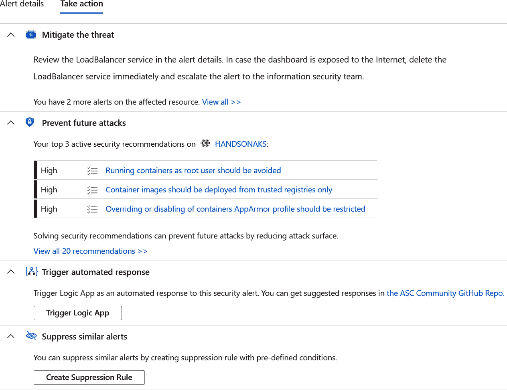

    图 13.30:仪表板警报上的安全建议

    在“采取措施”窗格中，您可以获得有关如何减轻威胁以及如何防止未来类似攻击的信息。请注意“防止未来攻击”部分如何包含指向您在上一部分中查看的安全建议的链接。

4.  Let's take the suggested action and update the Kubernetes dashboard service so it is no longer of the **LoadBalancer** type using the following command. This command will remove the **nodePort** that Kubernetes set up to expose the service through the load balancer and change the type of the service back to the **ClusterIP** type, which is only available from within the cluster.

    立方修补服务\

    立方结构仪表板-n 立方结构仪表板\

    -p′

    " spec ":{ 0

    “端口”:[

    {

    "nodePort"： 空，

    【港口】:443

    }

    ],

    类型:“”ClusterIP

    }

    }'

    最后，您可以选择在将来触发自动响应或抑制类似的警报，以防该警报为假阳性。

5.  Now that you have mitigated the threat, you can dismiss the alert. That way, others using the same subscription don't see this same alert. To dismiss the alert, click on the status on the left-hand side of the screen, select Dismissed, and click OK, as shown in *Figure 13.31*:

    

    图 13.31:取消仪表板警报

6.  Let's move on to the next alert. Close the detail panes for the dashboard alert by pressing the X at the top of the screen. Let's now focus on the first Digital currency mining container detected alert. Select that alert and click on View full details as you did with the previous alert. This will take you to a pane similar to *Figure 13.32*:

    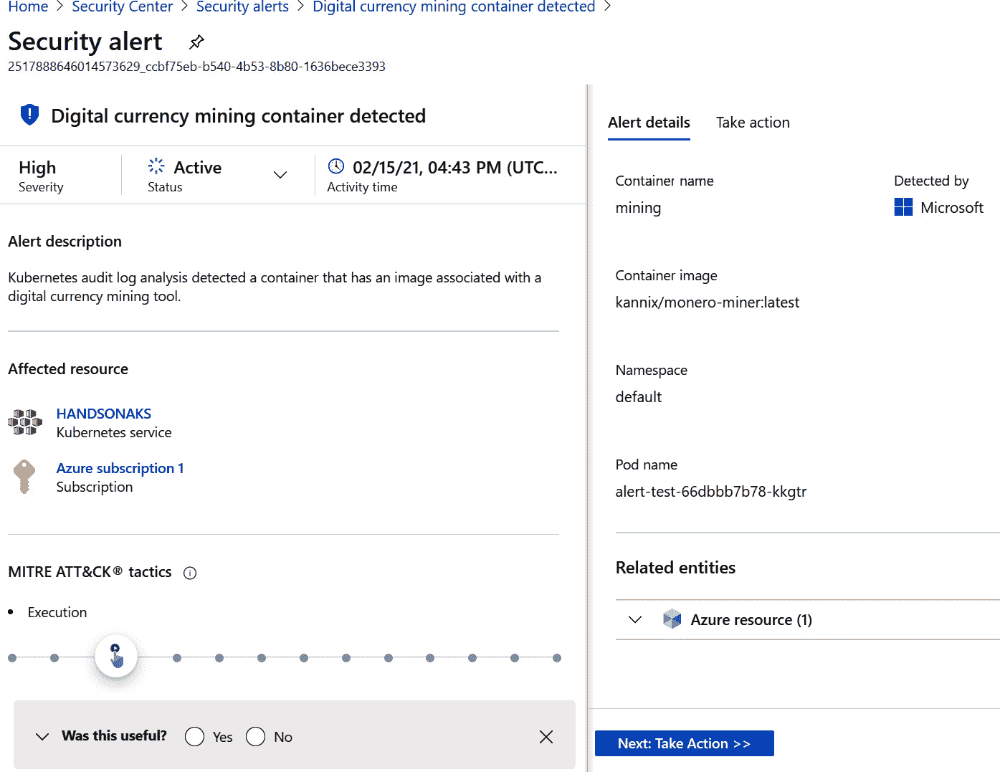

    图 13.32:数字货币挖掘容器检测到警报的详细信息

    此视图包含与上一个警报相似的详细信息。如您所见，此警报是 MITRE ATT 和 CK 战术框架执行阶段的一部分。在窗格的右侧，您现在可以看到违规容器的名称、它使用的图像、它的名称空间以及违规容器的名称。

    如果您按下屏幕底部的下一步:采取行动>>按钮，您将进入该警报的采取行动视图，如图 13.33 所示:

    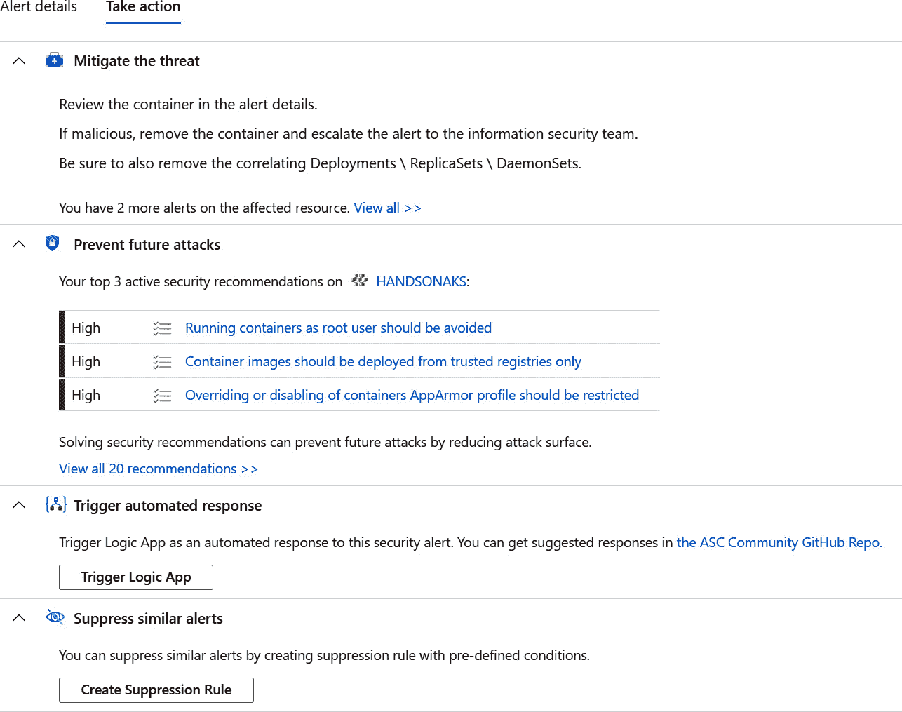

    图 13.33:检测到数字货币挖掘容器警报的安全建议

    在这里，您再次看到与上一个警报相似的细节。在“减轻威胁”部分，您将获得如何减轻这一持续威胁的不同描述。暂时不要采取任何缓解措施，因为你还需要探索一个与加密矿工相关的警报。

7.  To explore that alert, close the detailed pane for the first crypto-miner alert by pressing the X at the top of the screen. Now select the second alert, which is called Digital currency mining activity (Preview). This is actually not a Kubernetes alert, but an alert based on DNS, as you can see in *Figure 13.34*:

    #### 注意

    仅当您为 DNS 启用了 Azure Defender 时，此警报才会显示。如果未启用此功能，您将不会收到此警报。

    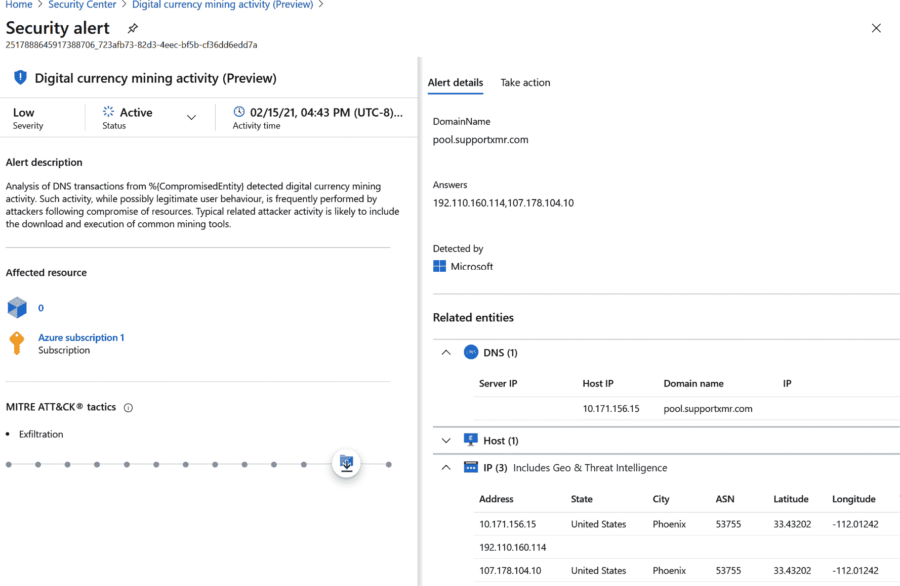

    图 13.34:数字货币挖掘活动警报的详细信息

    此警报是由 Azure Defender 为 DNS 生成的。它向您展示了攻击本身的许多细节。在窗格的右侧，您可以看到有关攻击的更多详细信息，显示您使用的域名和 IP 地址。如果您查看“采取行动”窗格，您将获得更多关于此攻击的潜在后续步骤的信息，如图 13.35 所示:

    

    图 13.35:当前挖掘警报的安全建议

    由于这是一个基于域名系统的警报，这里对要检查的进程的细节有限。然而，Azure 仍然为您提供了许多步骤来减轻这种威胁。由于您已经知道运行此加密挖掘器的进程，因此可以使用以下命令来减轻威胁:

    忽必烈删除 f 加密矿工 yaml

8.  This will resolve the alert. To actually mark it as resolved, you can dismiss the alert in the Azure portal. To do this, click on the status on the left-hand side of the screen, select the Dismissed status, and click OK, as shown in *Figure 13.36*:

    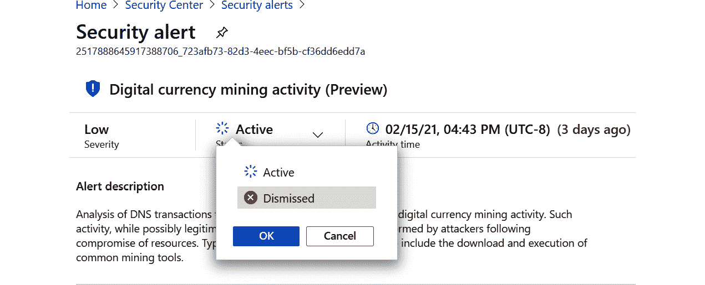

    图 13.36:解除数字货币域名系统警报

9.  在“安全警报”窗格中，单击最后一个警报，称为检测到的新高权限角色，然后在结果窗格中单击查看完整详细信息。这将带您进入类似于图 13.37 的窗格:

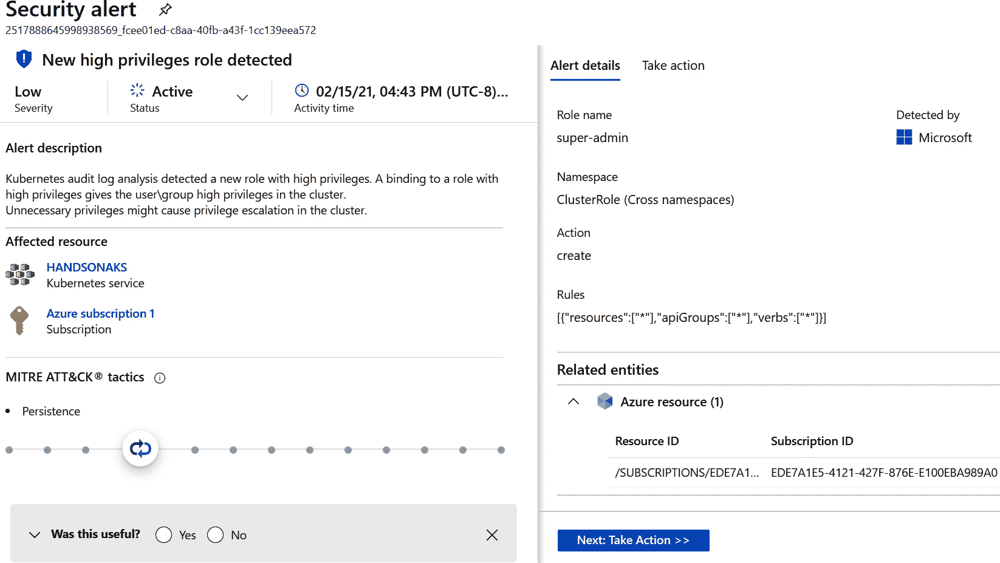

图 13.37:检测到新的高权限角色警报

这是低严重性警报。与前面的警报一样，您将获得描述、受影响的资源以及 MITRE ATT&CK 战术框架中的阶段，在本例中是持久性。这意味着攻击者利用这种潜在的攻击来获得对您的环境的持久访问。

在右侧，您还可以获得警报详细信息，包括角色名称、命名空间(在本例中是整个集群，因为它是一个**集群角色**)以及该角色可以访问的规则。如果你点击下一步:采取行动> >按钮，你也会得到更多关于缓解的信息，如图*图 13.38* :

图 13.38:关于新的高特权警报的安全建议

正如您在这里看到的，Azure 建议您查看警报中的角色，并检查链接到该角色的任何角色绑定。还建议授予比此角色中提供的打开权限更多的受限权限。让我们也使用以下命令从集群中删除此威胁:

多维数据集删除-f role.yaml

这将从集群中删除该角色。您也可以通过点击屏幕左侧的状态，选择“已解除”状态，然后点击“确定”来解除该警报，如图*图 13.39* :

图 13.39:取消新的高权限警报

这涵盖了由您在本章前面创建的资源生成的所有警报。作为补救措施的一部分，链接到警报的资源已经被删除，但是让我们也删除本章中创建的其他资源:

立方结构 delete -f escalation.yaml

忽必烈删除-f 主机卷. yaml

kubi KL delete-f[https://raw . githubusercontent . com/kubi ntes/dashboard/v 2 . 0 . 0/AIO/deploy/recommended . YAML](13.html)

这一章到此结束。

## 总结

在本章中，您探索了 Azure 安全中心和 Azure Defender。Azure 安全中心是一个基础设施安全监控平台。它既能监控安全配置，也能监控任何潜在的持续威胁。为了监控 Kubernetes 集群中的工作负载，Azure 安全中心对 AKS 使用了 Azure 策略。

首先，您为 AKS 启用了 Azure 策略。然后，您在订阅中启用了 Azure 安全中心和 Azure Defender。

然后，您在集群上创建了五个有害的工作负载。其中一些导致了 Azure 安全中心的配置建议。还有一些甚至导致在 Azure Defender 中触发安全警报。您研究了四个安全警报，并按照建议的缓解步骤来解决这些警报。**