# 十四、无服务器功能

由于可扩展性和降低的管理开销，无服务器计算和无服务器功能在过去几年中获得了巨大的吸引力。Azure Functions、AWS Lambda 和 GCP 云运行等云服务让用户可以非常轻松地将代码作为无服务器函数运行。

**无服务器**这个词指的是任何不需要管理服务器的解决方案。无服务器函数指的是无服务器计算的一个子集，您可以根据需要将代码作为函数运行。这意味着函数中的代码只有在有需求时才会运行和执行。这种架构风格被称为事件驱动架构。在事件驱动的体系结构中，当有事件发生时，会触发事件使用者。在无服务器函数的情况下，事件消费者将是这些无服务器函数。事件可以是任何东西，从队列中的消息到上传到存储的新对象，甚至是一个 HTTP 调用。

无服务器函数经常用于后端处理。无服务器功能的一个常见例子是创建上传到存储器的图片缩略图，如图 14.1*所示。由于您无法预测将上传多少图片以及何时上传，因此很难规划传统基础架构以及您应该有多少服务器可用于此过程。如果您将缩略图的创建实现为无服务器功能，则该功能将在上传的每张图片上调用。你不必计划函数的数量，因为每一张新的图片都会触发一个新的函数来执行。*

图 14.1:生成映像缩略图的无服务器函数的示例架构

正如您在前面的示例中看到的，功能将自动扩展以满足增加或减少的需求。此外，每个功能都可以独立于其他功能进行扩展。然而，这种自动缩放只是使用无服务器功能的一个好处。无服务器功能的另一个好处是易于开发。使用无服务器函数，您可以专注于编写代码，而不必处理底层基础架构。无服务器功能允许部署代码，而不用担心管理服务器和中间件。最后，在公共云无服务器功能中，每次执行该功能都要付费。这意味着每次运行您的函数时，您都要付费，并且当您的函数没有运行时，您的空闲时间不收费。

公有云无服务器功能平台的流行导致了多个开源框架的创建，以使用户能够在 Kubernetes 之上创建无服务器功能。在本章中，您将学习如何直接使用开源版本的 Azure Functions 在**Azure Kubernetes Service**(**AKS**)上部署无服务器功能。您将从运行一个基于 HTTP 消息触发的简单函数开始。之后，您将在集群上安装功能**自动缩放器**功能。您还将把部署了 AKS 的应用与 Azure 存储队列集成在一起。我们将涵盖以下主题:

*   不同功能平台概述
*   部署一个 HTTP 触发的函数
*   部署队列触发函数

让我们从探索 Kubernetes 可用的各种功能平台开始这一章。

## 各种功能平台

功能平台，如 Azure Functions、AWS Lambda 和 Google Cloud Functions，已经获得了巨大的普及。运行代码而不需要管理服务器并具有几乎无限的规模的能力非常受欢迎。使用云提供商的功能实现的缺点是，您被锁定在云提供商的基础架构及其编程模型中。此外，您只能在公共云中运行您的功能，而不能在您自己的数据中心中运行。

已经推出了许多开源函数框架来解决这些缺点。有许多流行的框架可以在 Kubernetes 上运行:

*   **Knative**([https://cloud.google.com/knative/](14.html)):Knative 是用 Go 语言编写的无服务器平台，由谷歌开发。您可以在谷歌云或您自己的 Kubernetes 集群上运行完全管理的 Knative 功能。
*   **OpenFaaS**([https://www.openfaas.com/](14.html)):OpenFaaS 是一个无服务器框架，是 Kubernetes 原生的。它可以在 AKS 等托管 Kubernetes 环境中运行，也可以在自托管集群中运行。OpenFaaS 也可以作为托管云服务使用 **OpenFaaSCloud** 。该平台是用 Go 语言编写的。
*   **无服务器**([https://serverless.com/](14.html)):这是一个基于 Node.js 的无服务器应用框架，可以在包括 Azure 在内的多个云提供商上部署和管理功能。Kubernetes 支持通过**kubernetes**提供。
*   **裂变. io**([https://fission.io/](14.html)):裂变是一个由公司平台 9 支持的无服务器框架。它是用围棋语言写的，是Kubernetes人的母语。它可以在任何 Kubernetes 集群上运行。
*   **Apacheopen 晶须**([https://openwhisk.apache.org/](14.html)):open 晶须是由 Apache 组织维护的开源、分布式无服务器平台。它可以在 Kubernetes、Mesos 或 Docker Compose 上运行。它主要是用 Scala 语言编写的。

微软对其功能平台采取了一个有趣的策略。微软将 Azure Functions 作为 Azure 上的托管服务进行操作，并开源了完整的解决方案，使其可以在任何系统上运行([https://github.com/Azure/azure-functions-host](14.html))。这也使得 Azure Functions 编程模型在 Kubernetes 之上可用。

微软还与红帽合作发布了一个名为 **Kubernetes 事件驱动自动缩放** ( **KEDA** )的额外开源项目，以使 Kubernetes 上的缩放功能更容易。KEDA 是一个定制的自动缩放器，允许在 Kubernetes 上的部署从零Pod 向下和向上缩放，这是不可能使用 Kubernetes 中默认的**水平Pod 自动缩放器** ( **HPA** )实现的。从零扩展到一个 pod 的能力很重要，这样您的应用就可以开始处理事件，但是缩减到零实例对于保留集群中的资源很有用。KEDA 还为 Kubernetes HPA 提供了额外的指标，以便根据集群外部的指标(例如，队列中的消息数量)做出扩展决策。

#### 注意

我们在*第 4 章*、*构建可扩展应用*中介绍并解释了 HPA。

在本章中，您将通过两个示例向 Kubernetes 部署 Azure 函数:

*   一个 HTTP 触发的函数(没有 KEDA)
*   队列触发函数(带 KEDA)

在开始这些功能之前，下一节将考虑这些部署的必要先决条件。

## 设置先决条件

在本节中，您将设置在 Kubernetes 集群上构建和运行函数所需的先决条件。您需要在 Azure 中设置一个 **Azure 容器注册表** ( **ACR** )和一个**虚拟机** ( **VM** )用于开发功能。ACR 将用于存储包含您将开发的功能的自定义容器映像。您还将使用虚拟机来构建函数和创建 Docker 映像，因为您不能从 Azure Cloud Shell 中这样做。

在*容器映像*一节中的*第 1 章*、*容器和Kubernetes*介绍中介绍了容器映像和容器注册。容器映像包含启动实际运行的容器所需的所有软件。在本章中，您将构建包含您的函数的自定义容器映像。您需要一个地方来存储这些映像，以便 Kubernetes 可以提取它们并按比例运行容器。您将为此使用 ACR。ACR 是一个完全由 Azure 管理的私有容器注册表。

到目前为止，在本书中，您已经在 Azure Cloud Shell 上运行了所有示例。对于本章中的示例，您将需要一个单独的虚拟机，因为 Azure Cloud Shell 不允许您构建容器映像。您将在 Azure 中创建新的虚拟机来执行这些任务。

让我们从创建一个 ACR 开始。

### 蔚蓝容器登记处

Kubernetes 上的 Azure 函数需要一个映像注册表来存储它的容器映像。在本节中，您将创建一个 ACR，并配置您的 Kubernetes 集群以访问该集群:

1.  In the Azure search bar, search for **container registry** and click on Container registries, as shown in *Figure 14.2*:

    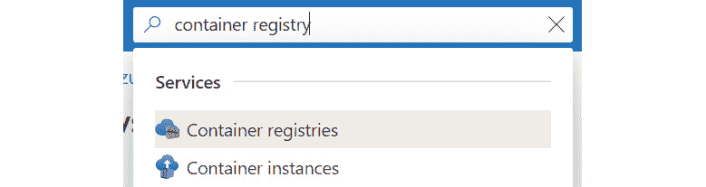

    图 14.2:通过 Azure 门户导航到容器注册服务

2.  Click the Add button at the top to create a new registry. To organize the resources in this chapter together, create a new resource group. To do this, click on Create new under the Resource group field to create a new resource group, and call it **Functions-KEDA**, as shown in *Figure 14.3*:

    

    图 14.3:创建新的资源组

    提供创建注册表的详细信息。注册表名称需要是全局唯一的，因此考虑将您的首字母添加到注册表名称中。建议在与集群相同的位置创建注册表。为了减少演示的开支，您可以将 SKU 更改为基本版。选择底部的审核+创建按钮，创建注册表，如图*图 14.4* :

    

    图 14.4:提供创建注册表的细节

    在结果窗格中，单击创建按钮创建注册表。

3.  Once your registry is created, open Cloud Shell so that you can configure your AKS cluster to get access to your container registry. Use the following command to give AKS permissions to your registry:

    az aks 更新-n 握手\

    -g rg-hand onaks-attach-ACR

    这将返回类似于图 14.5 的输出。该图已被裁剪，仅显示输出的顶部:

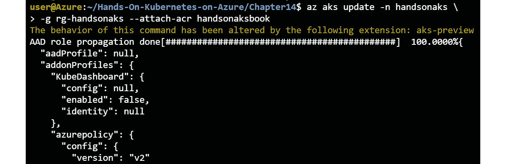

图 14.5:允许 AKS 集群访问容器注册表

你现在有一个与 AKS 集成的 ACR。在下一节中，您将创建一个用于构建 Azure 函数的虚拟机。

### 创建虚拟机

在本节中，您将创建一个虚拟机，并安装在该计算机上运行 Azure Functions 所需的工具:

*   Docker 运行时
*   蓝色命令行界面
*   天青函数
*   Kubectl

    #### 注意

    为了确保一致的体验，您将在 Azure 上创建一个用于开发的虚拟机。如果您希望在本地计算机上运行该示例，可以在本地安装所有必需的工具。

让我们开始创建虚拟机:

1.  To ensure this example works with the Azure trial subscription, you will need to scale down your cluster to one node. You can do this using the following command:

    az aks 比例尺-n 手摇-g rg-手摇-节点-计数 1

2.  To authenticate to the VM you are going to create, you'll need a set of SSH keys. If you followed the example in *Chapter 9*, *Azure Active Directory pod-managed identities in AKS* in the *Setting up a new cluster with AAD pod-managed identity* section, you will already have a set of SSH keys. To verify that you have SSH keys, run the following command:

    ls ~/.ssh

    这将向您显示 SSH 私钥( **id_rsa** )和公钥( **id_rsa.pub** )的存在，如*图 14.6* 所示:

    

    图 14.6:验证 SSH 密钥是否存在

    如果您还没有这些密钥，您将需要使用以下命令生成一组 SSH 密钥:

    ssh 密钥根

    系统将提示您输入位置和密码。保留默认位置并输入一个空密码。

3.  You will now create the VM. You will create an Ubuntu VM using the following command:

    功能-KEDA-开发机器\

    -image UbuntuLTS-ssh-key-value ~/。ssh/id_rsa.pub \

    -管理员-用户名手柄-标准尺寸 _D1_v2

4.  This will take a couple of minutes to complete. Once the VM is created, Cloud Shell should show you its public IP, as displayed in *Figure 14.7*:

    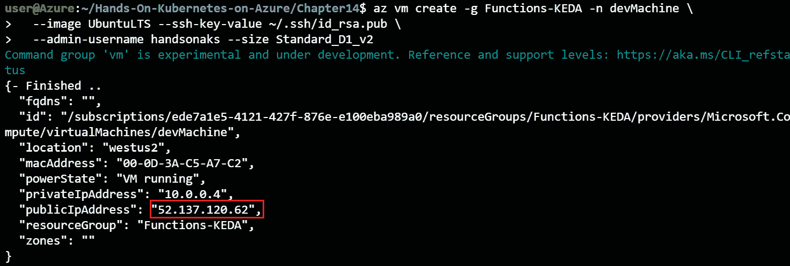

    图 14.7:创建开发虚拟机

    使用以下命令连接到虚拟机:

    宋承宪手摇@

    系统会提示您是否信任机器的身份。键入**是**确认。

5.  You're now connected to a new VM on Azure. On this machine, we will begin by installing Docker:

    sudo apt-get 更新

    sudo apt-get install dock . io-y-安装Docker

    sudo 系统 ctl 启用 docker

    sudo system ctl start dock(sudo 系统 CTL 启动停靠程序)

6.  To make the operation smoother, add the user to the Docker group. This will ensure you can run Docker commands without **sudo**:

    sudo usermod -aG 停靠者 handsonaks

    newgrp 坞站

    您现在应该能够运行 **hello-world** 命令:

    docker 运行 hello-world

    这将向您显示类似于图 14.8 的输出:

    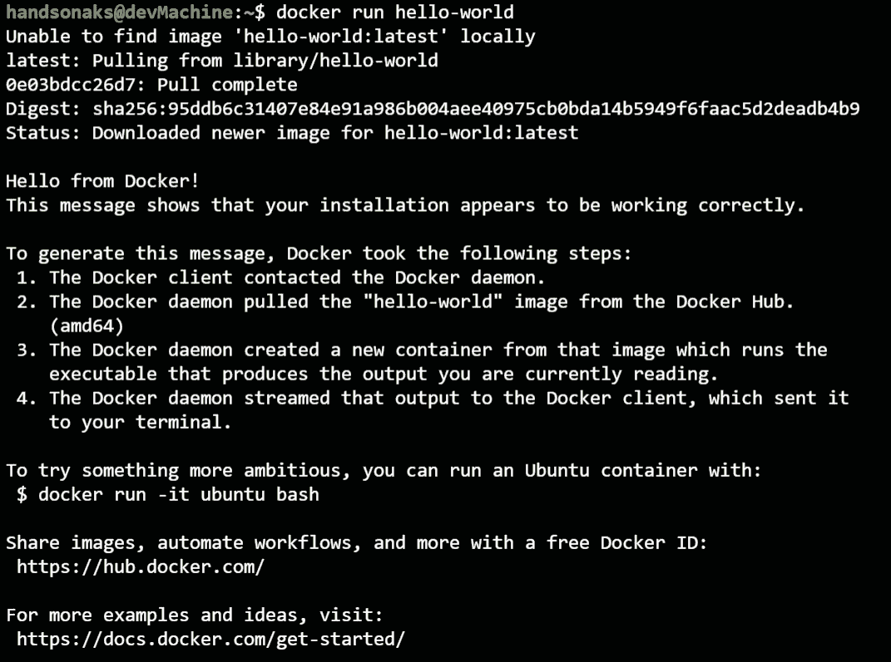

    图 14.8:验证 Docker 在虚拟机上运行

7.  Next, you will install the Azure CLI on this VM. You can install the CLI using the following command:

    curl-sL https://aka.ms/InstallAzureCLIDeb | sudo bash

8.  Verify that the CLI was installed successfully by signing in:

    登录信息

    这将显示您需要在[https://microsoft.com/devicelogin](14.html)输入的登录代码:

    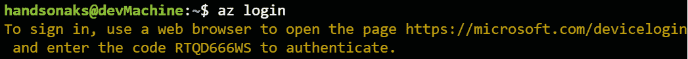

    图 14.9:登录到 Azure 命令行界面

    浏览到该网站并粘贴提供给您的登录代码，以使您能够登录到 Cloud Shell。请确保在您登录的浏览器中与有权访问您的 Azure 订阅的用户一起执行此操作。

    现在，您可以使用命令行界面向 ACR 验证您的计算机。这可以使用以下命令来完成:

    acr 登入-n<registryname></registryname>

    ACR 的凭据将在 3 小时后过期。如果在演示过程中遇到以下错误，您可以使用以下命令再次登录到 ACR:

    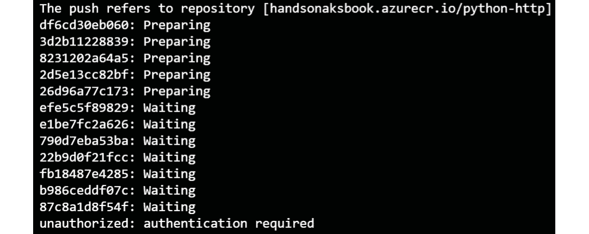

    图 14.10:未来潜在的身份验证错误

9.  Next, you'll install **kubectl** on your machine. The Azure CLI has a shortcut to install the CLI, which you can use to install it:

    sudo az aks 安装-cli

    让我们验证 **kubectl** 可以连接到我们的集群。为此，我们将首先获取凭据，然后执行一个 **kubectl** 命令:

    az aks get-凭证-n hand onaks-g rg-hand onaks

    kubectl 获取节点

10.  Now, you can install the Azure Functions tools on this machine. To do this, run the following commands:

    wget-q https://packages . Microsoft . com/config/Ubuntu/18.04/packages-Microsoft-prod . deb

    sudo dpkg -i 套装程式-microsoft-prod.deb

    sudo apt-get 更新

    sudo apt-get 安装 azure-functions-core-tools-3 -y

    这将返回类似于图 14.11 的输出:

图 14.11:安装函数核心工具

#### 注意

如果您运行的是比 18.04 更新的 Ubuntu 版本，请通过更改第一行中的网址以反映您的 Ubuntu 版本，确保您下载了正确的 **dpkg** 包。

现在，您已经具备了在 Kubernetes 上开始使用函数的先决条件。您创建了一个 ACR 来存储自定义容器映像，并且您有一个将用于创建和构建 Azure 函数的虚拟机。在下一节中，您将构建第一个函数，它是由 HTTP 触发的。

## 创建一个 HTTP 触发的 Azure 函数

在第一个例子中，您将创建一个 HTTP 触发的 Azure 函数。这意味着您可以浏览到实际函数所在的页面:

1.  To begin, create a new directory and navigate to that directory:

    mkdir http

    cd http

2.  Now, you will initialize a function using the following command:

    func init 坞站

    **––docker**参数指定您将该函数构建为 Docker 容器。这将导致创建一个 Dockerfile。选择 Python 语言，这是下面截图中的选项 3:

    

    图 14.12:创建一个 Python 函数

    这将为您的功能创建所需的文件。

3.  Next, you will create the actual function. Enter the following command:

    新功能

    这应该会产生如下输出。选择第八个选项，HTTP 触发器，函数名称 **python-http** :

    

    图 14.13:创建一个 HTTP 触发的函数

4.  The code of the function is stored in the directory called **python-http**. You are not going to make code changes to this function. If you want to check out the source code of the function, you can run the following command:

    cat python-http/__init__。巴拉圭

5.  You will need to make one change to the function's configuration file. By default, functions require an authenticated request. You will change this to **anonymous** for this demo. Make the change using the **vi** command by executing the following command:

    vi python-http/function.json

    将*5 号线*上的**授权等级**替换为**匿名**。要进行该更改，请按 *I* 进入插入模式，然后移除**功能**并将其替换为**匿名**:

    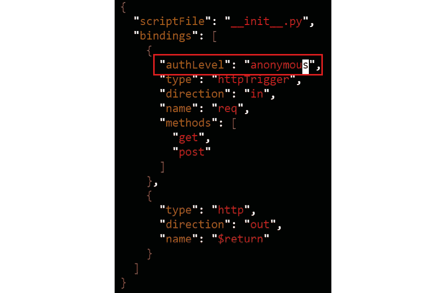

    图 14.14:将 authLevel 函数更改为匿名

    点击 *Esc* ，输入 **:wq！**，然后点击*进入*保存退出**六**。

    #### 注意

    您将功能的认证要求更改为**匿名**。这将使演示更容易执行。如果您计划将功能发布到生产中，您需要仔细考虑此设置，因为它控制谁有权访问您的功能。

6.  You are now ready to deploy your function to AKS. You can deploy the function using the following command:

    func kuble deploy 名称 python-http \

    -注册表 <registry name="">.azurecr.io</registry>

    这将导致函数运行时执行几个步骤。首先，它将构建一个容器映像，然后将该映像推送到注册表，最后，它将把该功能部署到 Kubernetes:

    

    图 14.15:将该功能部署到 AKS

    您可以单击显示的调用网址来访问您的函数。不过，在此之前，让我们先来探索一下集群上创建了什么。

7.  To create the function, a regular deployment on top of Kubernetes was used. To check the deployment, you can run the following command:

    kubectl 获取部署

    这将向您显示部署，如图 14.16 :

    

    图 14.16:部署细节

8.  This process also created a service on top of your Kubernetes cluster. You can get the public IP of the service that was deployed and connect to it:

    忽必烈得到服务

    这将向您显示服务及其公共 IP，如图 14.17*所示。注意这个公共知识产权和*第四步*的输出中显示的知识产权是如何相同的。*

图 14.17:获取服务的公共 IP

打开网页浏览器，浏览至**http://<external-IP>/API/python-http？名称=手摇**。你应该看到一个网页显示你好，手淫者。该 HTTP 触发函数执行成功。这在*图 14.18* 中显示:

图 14.18:HTTP 触发函数的输出

现在，您已经创建了一个带有 HTTP 触发器的函数。在您提供的 HTTP 应用编程接口具有不可预测的负载模式的情况下，使用 HTTP 触发函数非常有用。在进入下一部分之前，让我们先清理一下这个部署:

kubectl 删除部署 python-http-http

kubectl 删除服务 python-http-http

kubi tol delete secret python-http-删除密码 python-http

在本节中，您使用 HTTP 触发器创建了一个示例函数。让我们更进一步，将新功能与存储队列集成，并在下一节中设置 KEDA 自动缩放器。

## 创建队列触发函数

在前一节中，您创建了一个示例 HTTP 函数。在本节中，您将使用队列触发函数构建另一个示例。队列通常用于在应用的不同组件之间传递消息。可以基于队列中的消息触发一个函数，然后对这些消息执行额外的处理。

在本节中，您将创建一个与 Azure 存储队列集成的函数来使用事件。您还将配置 KEDA，以便在流量较低的情况下允许扩展到零Pod 或从零Pod 扩展。

让我们从在 Azure 中创建一个队列开始。

### 创建队列

在本节中，您将在该存储帐户中创建新的存储帐户和新的队列。在下一节*中，您将把函数连接到该队列，创建一个队列触发函数*。

1.  To begin, create a new storage account. Search for **storage accounts** in the Azure search bar and select Storage accounts:

    

    图 14.19:通过 Azure 门户导航到存储帐户服务

2.  Click the + New button at the top to create a new storage account. Provide the details to create the storage account. The storage account name has to be globally unique, so consider adding your initials. It is recommended to create the storage account in the same region as your AKS cluster. Finally, to save on costs, you are recommended to downgrade the replication setting to Locally-redundant storage (LRS) as shown in *Figure 14.20*:

    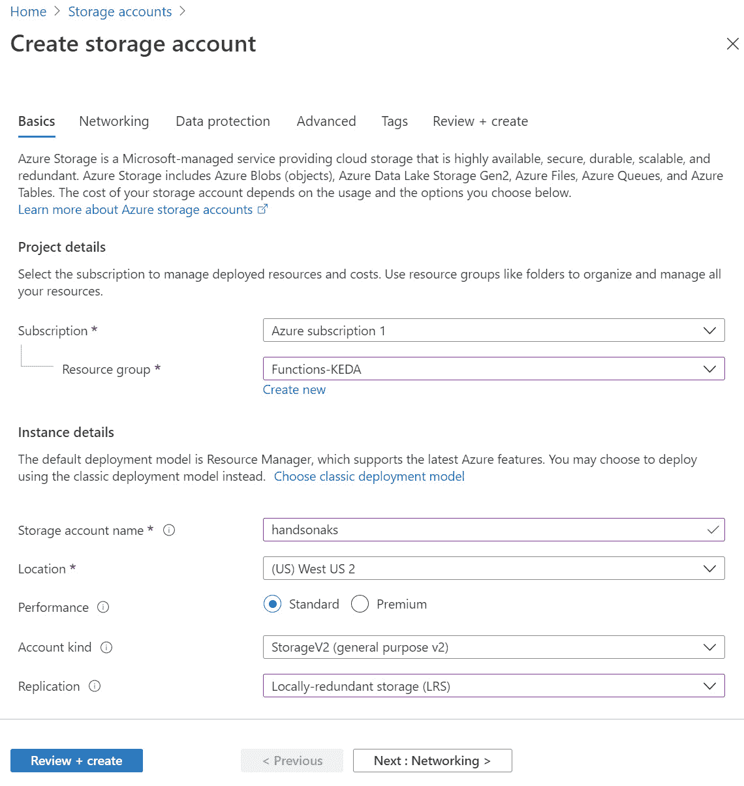

    图 14.20:提供创建存储帐户的详细信息

    准备就绪后，单击底部的“审阅+创建”按钮。在结果屏幕上，选择创建开始创建过程。

3.  It will take about a minute to create the storage account. Once it is created, open the account by clicking on the Go to resource button. In the Storage account pane, select Access keys in the left-hand navigation, click on Show keys, and copy the primary connection string, as shown in *Figure 14.21*. Note down this string for now:

    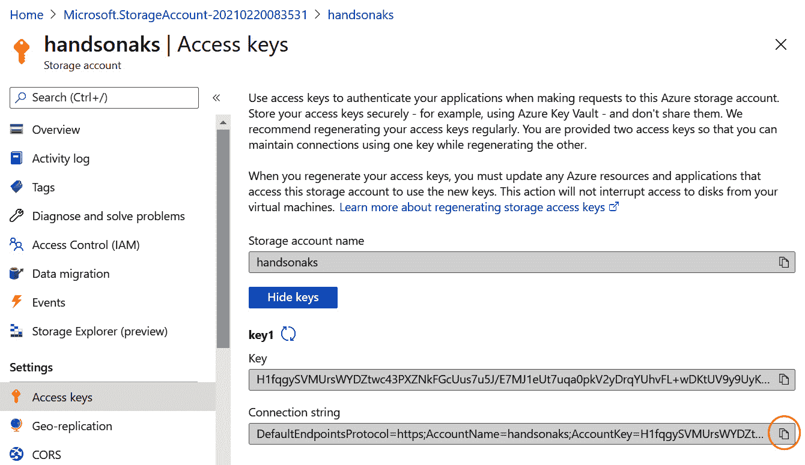

    图 14.21:复制主连接字符串

    #### 注意

    对于生产用例，不建议使用访问密钥连接到 Azure Storage。拥有该访问密钥的任何用户都可以完全访问存储帐户，并可以读取和删除其上的所有文件。建议生成一个**共享访问签名** ( **SAS** )令牌来连接到存储，或者使用 Azure AD 集成的安全性。要了解更多关于存储的 SAS 令牌认证，请参考[https://docs . Microsoft . com/rest/API/storage services/delegate-access-with-shared-access-signature](14.html)。要了解更多关于 Azure AD 认证到 Azure Storage 的信息，请参考[https://docs . Microsoft . com/rest/API/Storage service/authorize with-Azure-active-directory](14.html)。

4.  最后一步是在存储帐户中创建我们的队列。在左侧导航中查找**队列**，点击+ Queue 按钮添加队列，并提供名称。按照这个演示，使用**功能**作为队列名称:

图 14.22:创建新队列

现在，您已经在 Azure 中创建了一个存储帐户，并拥有了它的连接字符串。您在此存储帐户中创建了一个队列。在下一节中，您将创建一个函数来使用队列中的消息。

### 创建队列触发函数

在前一节中，您在 Azure 中创建了一个队列。在本节中，您将创建一个新的函数来监视该队列并从队列中删除消息。您需要使用此队列的连接字符串配置此函数:

1.  From within the VM, begin by creating a new directory and navigating to it:

    激光唱片..

    mkdir js 队列

    js queue CD-js 伫列

2.  Now we can create the function. We will start with the initialization:

    func init 坞站

    这会问你两个问题。对于运行时，选择节点(选项 2)，对于语言，选择 JavaScript(选项 1)。这会产生如图 14.23 所示的输出:

    

    图 14.23:初始化一个新函数

    初始化之后，您可以创建实际的函数:

    新功能

    这将要求你触发。选择 Azure 队列存储触发器(选项 10)。给新函数命名 **js-queue** 。这将产生如图 14.24*所示的输出:*

    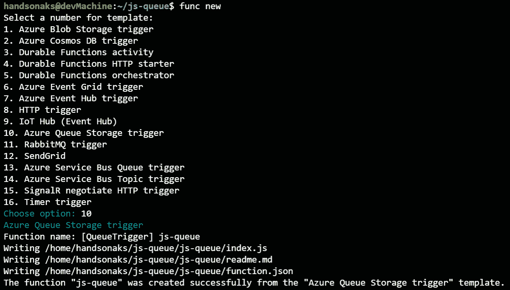

    图 14.24:创建队列触发函数

3.  You will now need to make a couple of configuration changes. You need to provide the function you created the connection string on to Azure Storage and provide the queue name. First, open the **local.settings.json** file to configure the connection strings for storage:

    vi local.settings.json

    要进行更改，请遵循以下说明:

    *   点击 *I* 进入插入模式。
    *   用您之前复制的连接字符串替换**AzureBjobstorage**的连接字符串。在这一行的末尾加一个逗号。
    *   添加新行，然后在该行上添加以下文本:

    " quecuconstring ":

    结果应该如图*图 14.25* :

    

    图 14.25:编辑 local.settings.json 文件

    *   点击 *Esc* 键保存并关闭文件，输入 **:wq！**，然后按*进入*。
4.  The next file you need to edit is the function configuration itself. Here, you will refer to the connection string from earlier, and provide the queue name we chose in the *Creating a queue* section. To do that, use the following command:

    vi js-queue/function.json

    要进行更改，请遵循以下说明:

    *   点击 *I* 进入插入模式。
    *   将队列名称更改为您创建的队列名称(**功能**)。
    *   接下来，在**连接**字段中添加**排队连接字符串**。

    您的配置现在应该如图 14.26 所示:

    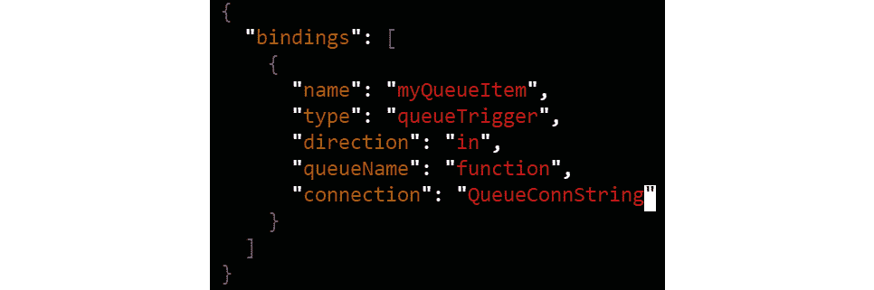

    图 14.26:编辑 js 队列/函数文件

    *   点击 *Esc* 键保存并关闭文件，输入 **:wq！**，然后按*进入*。
5.  You are now ready to publish your function to Kubernetes. You will start by setting up KEDA on your Kubernetes cluster:

    kubectl create ns keda

    func kubernetes install --keda --namespace whom

    这将返回类似于图 14.27 的输出:

    

    图 14.27:在 Kubernetes 上安装 KEDA

    这将在您的集群上设置 KEDA。安装不会花很长时间。要验证安装是否成功，请确保 KEDA pod 正在 **keda** 命名空间中运行:

    kubectl get pod -n keda

    这将返回类似于图 14.28 的输出:

    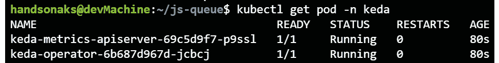

    图 14.28:验证 KEDA 安装成功

6.  You can now deploy the function to Kubernetes. You will configure KEDA to look at the number of queue messages every 5 seconds (**polling-interval=5**) to have a maximum of 15 replicas (**max-replicas=15**), and to wait 15 seconds before removing pods (**cooldown-period=15**). To deploy and configure KEDA in this way, use the following command:

    func kuble deploy 名称 js queue \

    -注册表 <registry name="">.azurecr.io \</registry>

    -轮询间隔=5 -最大-副本=15 -冷却周期=15

    这将返回类似于图 14.29 的输出:

    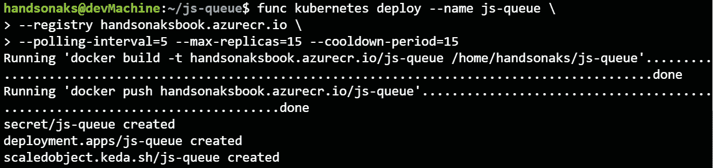

    图 14.29:部署队列触发的功能

    要验证安装是否成功完成，您可以运行以下命令:

    kubectl get all

    这将向您展示所有已部署的资源。正如您在*图 14.30* 中看到的，这个设置创建了一个部署、复制集和一个 HPA。在 HPA 中，您应该看到当前没有运行的副本:

    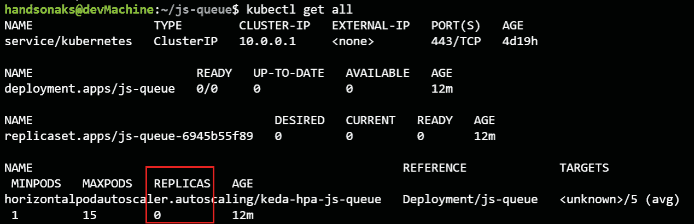

    图 14.30:验证设置创建的对象

7.  Now you will create a message in the queue to trigger KEDA and create a pod. To see the scaling event, run the following command:

    忽必烈得到 hpa -w

8.  为了在队列中创建一条消息，我们将使用 Azure 门户。要创建新邮件，请打开您之前创建的存储中的队列。单击屏幕顶部的+添加消息按钮，创建一条测试消息，然后单击确定。这在*图 14.31* 中显示:

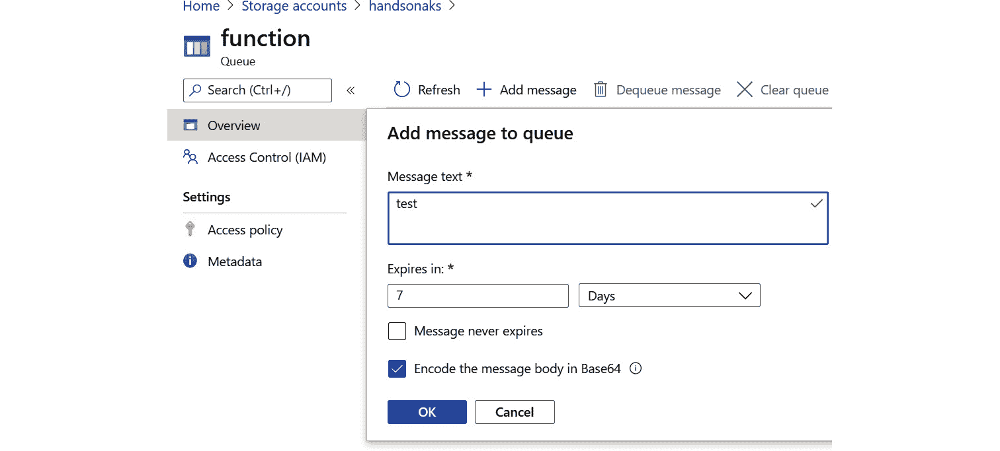

图 14.31:向队列添加消息

创建此消息后，查看您发出的前一个命令的输出。这可能需要几秒钟，但很快，您的 HPA 应该可以扩展到一个副本。之后，它还应该缩减到零个副本:

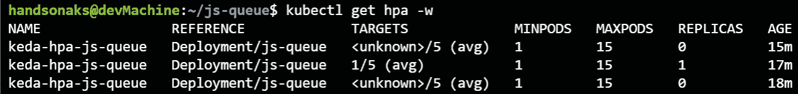

图 14.32: KEDA 从 0 扩展到 1，再回到 0 副本

这向您展示了，当队列中有消息时，KEDA 使Kubernetes HPA 能够从零扩展到一个Pod ，当这些消息被处理时，也能从一个Pod 扩展到零。

您现在已经创建了一个由添加到队列中的消息触发的函数。当您在队列中创建一条消息时，您能够验证 KEDA 将 pods 从 0 缩放到 1，当没有剩余消息时，将 pods 缩小到 0。在下一节中，您将执行一个规模测试，您将在队列中创建多个消息，并查看函数的反应。

### 刻度测试功能

在前一节中，您看到了当队列中只有一条消息时，函数是如何反应的。在本例中，您将向队列中发送 1，000 条消息，并查看 KEDA 将如何首先扩展该函数，然后再扩展，最后缩减到零:

1.  In the current Cloud Shell, watch the HPA using the following command:

    忽必烈得到 hpa -w

2.  To start pushing the messages, you are going to open a new Cloud Shell session. To open a new session, select the Open new session button in Cloud Shell:

    

    图 14.33:打开一个新的云外壳实例

    为了将 1000 条消息发送到队列中，在本书随附的 GitHub repo 中的代码示例的第 15 章*中提供了一个名为 **sendMessages.py** 的 Python 脚本。要使脚本工作，您需要使用 pip 安装 **azure 存储队列包:***

    pip 安装 azure-存储-队列==12.1.5

    安装完成后，您需要向该脚本提供您的存储帐户连接字符串。为此，请使用以下命令打开文件:

    sendMessages.py 代码

    将*第 8 行*上的存储连接字符串编辑为您的连接字符串:

    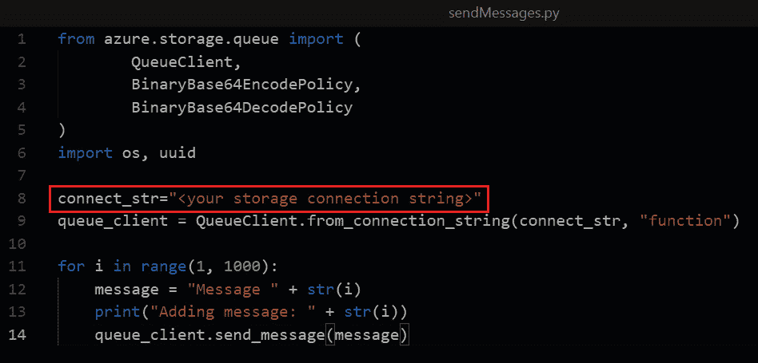

    图 14.34:在第 8 行粘贴存储帐户的连接字符串

3.  Once you have pasted in your connection string, you can execute the Python script and send 1,000 messages to your queue:

    python sendMessages.py

    发送消息时，切换回以前的 Cloud Shell 实例，观察 KEDA 从 0 扩展到 1，然后观察 HPA 扩展到副本数量。HPA 使用 KEDA 提供的指标来做出扩展决策。默认情况下，Kubernetes 不知道 KEDA 向 HPA 提供的 Azure 存储队列中的消息数量。

    #### 注意

    根据集群中 KEDA 扩展应用的速度，您的部署可能无法扩展到图 14.29 中所示的 15 个副本。

    一旦队列为空，KEDA 将缩减到零个副本:

图 14.35: KEDA 将从 0 扩展到 1，HPA 将扩展到 15 个Pod 

如您在该命令的输出中所见，部署首先从零扩展到一个副本，然后逐渐扩展到最多 15 个副本。当队列中没有更多消息时，部署再次缩减到零个副本。

以上就是在 Kubernetes 上运行无服务器函数的例子。让我们确保清理创建的对象。在您创建的虚拟机中运行以下命令(最后一步将删除该虚拟机；如果您想保留虚拟机，不要运行最后一步):

忽必烈删除机密 js 队列

忽必烈删除 scaledoble object js queue

kubectl 删除部署 js-queue

func kubernetes remove --namespace keda

az 组删除-n 功能-KEDA -是

在本节中，您运行了一个由 Kubernetes 之上的存储队列中的消息触发的函数。您使用了一个名为 KEDA 的组件来实现基于队列消息数量的伸缩。你看到了 KEDA 是如何从 0 到 1，再回到 0 的。您还看到了 HPA 如何使用 KEDA 提供的指标来扩展部署。

## 总结

在本章中，您在 Kubernetes 集群上部署了无服务器功能。为此，您首先创建了一个虚拟机和一个 ACR。

您通过部署使用 HTTP 触发器的函数来启动函数部署。Azure 函数核心工具用于创建该函数并将其部署到 Kubernetes。

之后，您在 Kubernetes 集群上安装了一个名为 KEDA 的附加组件。KEDA 允许在 Kubernetes 进行无服务器扩展。它允许部署到零Pod 和从零Pod 部署，还为 HPA 提供了额外的指标。您使用了对 Azure 存储队列中的消息触发的函数。

在本书的下一章(也是最后一章)，您将学习如何使用 GitHub Actions 在**连续集成和连续交付** ( **CI/CD** )管道中集成容器和 Kubernetes。