# 十五、AKS 的持续集成和持续部署

DevOps 是人员、流程和工具的结合，以更快、更频繁、更可靠地交付软件。DevOps 文化中有**持续整合和持续部署** ( **CI/CD** )的实践。CI/CD 是一组通过一个或多个工具实现的实践，用于自动测试、构建和交付软件。

CI 阶段指的是持续测试和构建软件的实践。配置项阶段的结果是一个可部署的工件。那个神器可以是很多东西；例如，对于一个 Java 应用，它将是一个 **JAR** 文件，而对于一个基于容器的应用，它将是一个容器映像。

光盘阶段是指持续发布软件的实践。在光盘阶段，在配置项期间生成的工件被部署到多个环境中，通常从测试到质量保证再到试运行到生产。

存在多种工具来实现配置项/光盘。GitHub Actions 就是这样一个工具。GitHub Actions 是一个内置在 GitHub 中的工作流自动化系统。借助 GitHub Actions，您可以构建、测试和部署以任何语言编写的应用到各种平台。它还允许您构建容器映像并将应用部署到 Kubernetes 集群，这将在本章中介绍。

具体而言，本章将涵盖以下主题:

*   容器和 Kubernetes 的 CI/CD 工艺
*   设置 Azure 和 GitHub
*   设置配置项管道
*   设置光盘管道

让我们从探索容器和 Kubernetes 的 CI/CD 生命周期开始。

## 容器和库伯内特的 CI/CD 工艺

在开始构建管道之前，最好了解容器和 Kubernetes 的典型 CI/CD 流程。本节将对*图 15.1* 所示的高层流程进行更深入的探讨。有关针对 Kubernetes 的 CI/CD 和 DevOps 的更详细的探索，鼓励您探索以下由微软提供的免费在线电子书:[https://docs . Microsoft . com/dotnet/architecture/contained-life cycle/](15.html)。

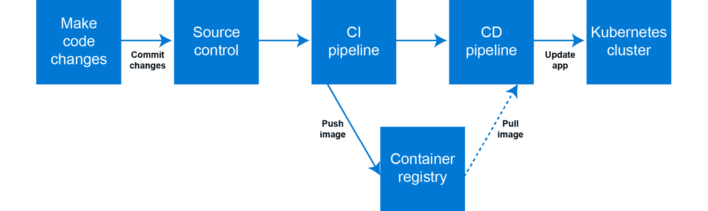

F 图 15.1:容器和 Kubernetes CI/CD 工艺

这个过程从某人修改代码开始。代码更改可能意味着应用代码的更改、用于构建容器的 Dockerfile 的更改，或者用于在集群上部署应用的 Kubernetes YAML 文件的更改。

一旦代码更改完成，这些更改将提交给源代码控制系统。通常，这是一个 Git 存储库，但是也存在其他系统，比如 Subversion (SVN)。在 Git 存储库中，您通常会有多个代码分支。分支使多个个人和团队能够在同一代码基础上并行工作，而不会相互干扰。一旦分支上的工作完成，它就与主分支合并。一旦一个分支被合并，来自该分支的更改将与使用该代码库的其他分支共享。

#### 注意

分支是 Git 源代码控制系统的一个强大功能。有多种方法可以管理如何在代码库中使用分支。请参考斯科特·沙孔和本·施特劳布的 *Pro Git* (Apress，2014)中关于分支的章节，对这个主题进行更深入的探索:[https://Git-SCM . com/book/en/v2/Git-branding-branch-in-a-cabines](15.html)。

将代码推入源代码控制后，无论是在主分支还是功能分支中，都可以触发配置项管道。在基于容器的应用中，这意味着代码被构建到容器映像中，该映像被测试，如果测试成功，它将被推送到容器注册表。根据分支，您可以包括不同的步骤和不同的测试。例如，在功能分支上，您可能只构建和测试容器以验证代码是否有效，但不会将其推送到注册表，而在主分支上，您可能构建和测试容器并将其推送到容器注册表。

最后，可以触发光盘管道来部署或更新 Kubernetes 上的应用。通常，在光盘管道中，部署会经历不同的阶段。您可以先将更新后的应用部署到一个临时环境中，在将应用转移到生产环境之前，您可以在该环境中对应用运行自动和手动测试。

现在，您已经理解了容器和 Kubernetes 的 CI/CD 过程，您可以开始构建本章的示例部分了。让我们从设置 Azure 和 GitHub 开始。

## 设置 Azure 和 GitHub

在本节中，您将设置用于创建和运行将要构建的管道的基本基础设施。要托管容器映像，您需要一个容器注册表。您可以使用许多容器注册中心，但是这里您将创建一个 Azure 容器注册中心实例，因为它与**Azure Kubernetes Service**(**AKS**)很好地集成在一起。创建容器注册表后，您需要将该容器注册表链接到您的 AKS 集群并创建一个新的服务主体，然后您需要设置一个 GitHub 存储库来运行本章的示例部分。执行以下七个步骤来完成本活动:

1.  To start, create a new container registry. In the Azure search bar, look for **container registry** and click on Container registries, as shown in *Figure 15.2:*

    

    图 15.2:通过 Azure 门户导航到容器注册服务

2.  Click the Create button at the top to create a new registry. To organize the resources in this chapter together, create a new resource group. To do this, click on Create new to create a new resource group and call it **rg-pipelines**, as shown in *Figure 15.3:*

    

    图图 15.3:创建新的资源组

    提供创建注册表所需的详细信息。注册表名称需要是全局唯一的，因此考虑将您的首字母添加到注册表名称中。建议在与集群相同的位置创建注册表。要优化演示花费，您可以将 SKU 更改为基本。选择底部的审核+创建按钮，创建注册表，如图*图 15.4:*

    

    图 15.4:创建新的容器注册表

    在结果窗格中，单击创建按钮创建注册表。

3.  When your registry is created, open Cloud Shell so that you can configure your AKS cluster to get access to your container registry. Use the following command to give AKS permissions on your registry:

    az aks 更新-n 握手\

    -g rg-hand onaks-attach-ACR

    这将返回类似于图 15.5 的输出，该输出已被裁剪，仅显示输出的顶部:

    

    图 15.5:允许 AKS 集群访问容器注册表

4.  Next, you'll need to create a service principal that will be used by GitHub Actions to connect to your subscription. You can create this service principal using the following command:

    az ad sp 为 rbac 创建-名称“cicd-管道”

    - sdk-auth -角色贡献者

    您将需要该命令的完整输出 JSON，如稍后在 GitHub 中的*图 15.6* 所示。复制此输出:

    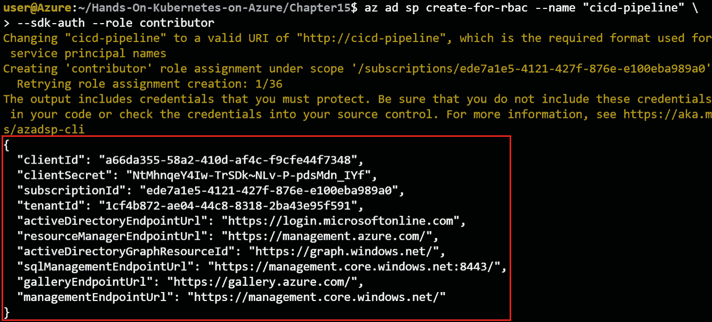

    图 15.6:创建新的服务主体

5.  这就完成了安装的 Azure 部分。接下来，您需要登录 GitHub，分叉这本书附带的回购，并在这个回购中配置一个机密。如果您还没有 GitHub 帐户，请通过[https://github.com/join](15.html)创建一个。如果您已经有账户，请使用[https://github.com/login](15.html)登录。
6.  Once you are logged in to GitHub, browse to the repository associated with this book at [https://github.com/PacktPublishing/Hands-On-Kubernetes-on-Azure-third-edition](15.html). Create a fork of this repo in your account by clicking on the Fork button in the top-right corner of the screen, as shown in *Figure 15.7:*

    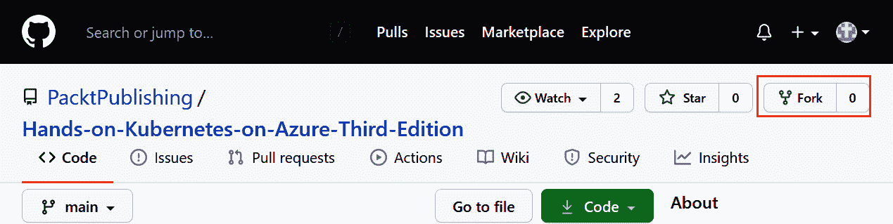

    图 15.7:分叉 GitHub 存储库

    分叉回购将在您自己的 GitHub 帐户中创建一个存储库副本。这将允许您对存储库进行更改，就像您在本章中构建管道一样。

7.  分叉存储库需要几秒钟的时间。一旦你有了自己的账户，你需要在这个回购中配置 Azure 机密。首先点击回购右上角的设置，如图*图 15.8:*

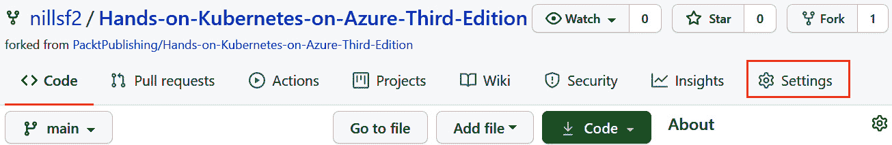

图 15.8:点击 GitHub 存储库中的设置

这将带你到你的回购设置。在左侧，单击机密，在结果屏幕上单击顶部的新建存储库机密按钮，如图 15.9 所示:

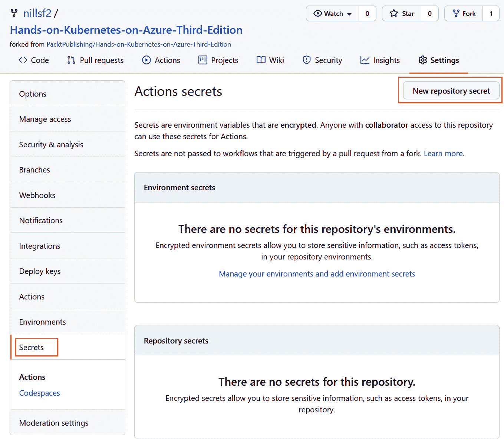

图 15 .9:创建新的存储库机密

这将带你到屏幕上创建新的机密。调用这个机密 **AZURE_CREDENTIALS** ，作为这个机密的值，粘贴到你在本节*第 4 步*发出的 CLI 命令的输出中，如图*图 15.10:*

图 15。 10:设置新机密的值

最后，点击屏幕底部的添加密码保存密码。

现在，您已经设置了 Azure 和 GitHub 来开始构建您的管道。您已经创建了一个服务主体，GitHub 将使用它与 Azure 进行交互，您还创建了一个容器注册表，您的 CI 管道可以将映像推送到该注册表，AKS 可以从中提取映像。现在让我们构建一个配置项管道。

## 建立竞争情报管道

您现在可以构建配置项管道了。作为本节演示的一部分，您将构建一个 **nginx** 容器，其中加载了一个小的自定义网页。容器构建完成后，您将把 **nginx** 容器推送到您在上一节中创建的容器注册表中。您将在接下来的 13 个步骤中逐步构建配置项管道:

1.  To start, open the forked GitHub repo and open the folder for **Chapter 15**. In that folder, you will find a couple of files, including **Dockerfile** and **index.html**. These files are used to build the custom container. Throughout the example, you will make changes to **index.html** to trigger changes in the GitHub action. Let's have a look at the contents of **index.html**:

    1

    2

    3 <title>版本 1</title>

    4

    5

    6

    # 版本 1

    7

    8

    这是一个简单的 HTML 文件，标题和头上都写着**版本 1** 。在*设置光盘管道*部分，您将被要求增加版本。

    接下来，还向您提供了一个 Dockerfile。该文件的内容如下:

    1 FROM nginx:1 . 19 . 7-阿尔卑斯山

    2 COPY index.html/usr/share/nginx/html/index . html

    这个文档文件从一个阿尔卑斯山的基本映像开始。Nginx 是一个流行的开源网络服务器，Alpine 是一个轻量级的操作系统，经常用于容器映像。在第二行，您将本地**index.html**文件复制到容器中，复制到 **nginx** 加载网页的位置。

    既然您已经了解了应用本身，那么就可以开始构建配置项管道了。作为参考，CI 管道的完整定义在本章的代码文件中以 **pipeline-ci.yaml** 的形式提供，但是在接下来的内容中将指示您一步一步地构建这个管道。

2.  Let's start by creating a GitHub Actions workflow. At the top of the screen in GitHub, click on Actions and then click on the set up a workflow yourself link, as shown in *Figure 15.11:*

    

    图 15.1 1:创建新的 GitHub 动作

3.  This will take you to a code editor that is part of GitHub. First, change the name of the pipeline file to **pipeline.yaml** and change the name on *line 3* to **pipeline**, as shown in *Figure 15.12:*

    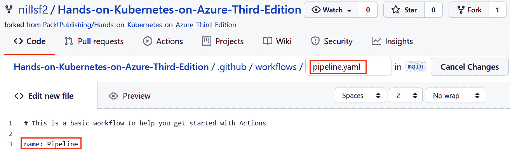

    图 15.12 :更改管道名称

4.  Next, you'll focus on the triggers of the workflow. In this demonstration, you'll only work with the main branch. However, you do not want the workflow to run for every code change. You only want it to run when changes are made to either the pipeline definition or the code in the **Chapter 15** folder. To achieve this, you can set up the following code to control the workflow trigger:

    4 #控制动作何时运行。

    5 开:

    6 #触发推或拉请求事件的工作流，但仅针对主分支

    7 推:

    8 个分支:[主要]

    9 条路径:

    第 10-15 章/**

    11 - .github/workflow/pipeline . YAML

    12 #允许您从“操作”选项卡手动运行此工作流

    13 工作流 _ 调度:

    该代码配置如下:

    *   **第 8 行**:配置哪些分支会触发此工作流。具体来说，在这种情况下，这表明工作流是通过将代码推送到主分支来触发的。
    *   **第 9-11 行**:这配置了一个路径过滤器。**第 15 章**目录的任何更改以及**中 **pipeline.yaml** 文件的更改。github/workflow/**目录将触发工作流运行。
    *   **第 13 行**:这样配置工作流程，也可以手动触发。这意味着您可以在不更改代码的情况下触发工作流运行。

    您也可以在 GitHub 动作工作流中配置可重用的变量。以下代码块配置了您将在 GitHub 操作的多个步骤中使用的容器注册表名称:

    14 # Env 设置可重用变量

    15 环境:

    16 ACRNAME:

    在这里，您将把 **ACRNAME** 变量设置为您创建的容器注册表的名称。通过使用变量，您可以避免在多个地方配置相同的值。

    这解释了管道是如何被触发的，以及如何配置变量；现在让我们看看管道中会运行什么。

5.  在我们定义在管道中执行的命令之前，让我们探索一下 GitHub Actions 工作流的结构，如图 15.13 所示:

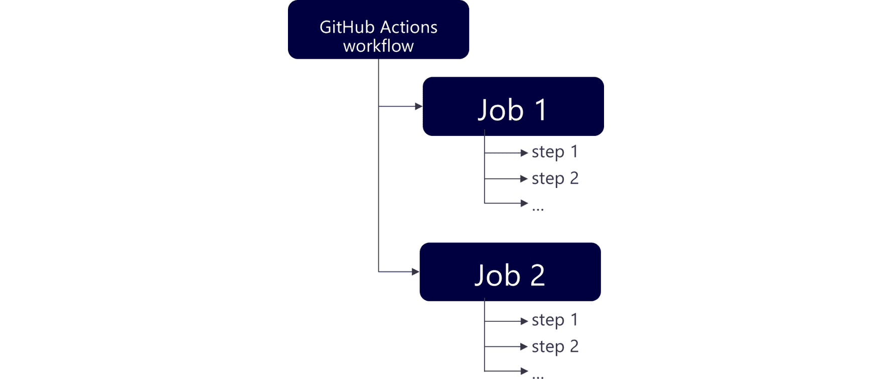

图 15.13: GitHub 动作工作流

GitHub 操作工作流由多个作业组成。一个作业可以有多个步骤。默认情况下，作业并行运行，但可以配置为顺序运行。作业中的步骤将按顺序运行。作业中的一个步骤将包含作为管道一部分运行的实际命令。一个步骤的例子是构建一个容器映像。在工作流中运行命令有多种方式:您可以像在常规终端上一样运行直接 shell 命令，也可以运行 GitHub 社区的预构建操作。

这些工作和步骤是在所谓的跑步者身上进行的。默认情况下，工作流在托管跑步者上运行。这些托管跑步者在 GitHub 建立和管理的基础设施上运行。或者，您可以在自行托管的运行程序上运行作业和步骤。这使您能够在 runner 上拥有更多配置功能，例如，允许您使用特殊硬件或安装特定软件。自我托管的跑步者可以是物理的、虚拟的、容器中的、内部的或云中的。

在本节中，您将运行社区中的工作流步骤以及 shell 命令。有关社区可用操作的概述，请参考位于[https://github.com/marketplace?type=actions](15.html)的 GitHub 市场。

在您正在构建的配置项管道中，您需要执行以下步骤:

1.  获取动作运行器上的 GitHub repo，也称为您的存储库的签出。
2.  登录 Azure 命令行界面。
3.  登录到 Azure 容器注册表。
4.  构建一个容器映像，并将此容器映像推送到 Azure 容器注册表。

让我们一步一步地建立管道。

1.  Before you build the actual steps in the pipeline, you'll need to configure the jobs and the configuration of your job. Specifically, for this example, you can use the following configuration:

    18 份工作:

    19 #此工作流包含一个名为“配置项”的作业

    20 个 CI:

    21 #作业将在其上运行的运行程序类型

    22 次运行:Ubuntu-最新

    您正在配置以下内容:

    *   **第 20 行**:你现在正在创建一个名为 **CI** 的单一作业。稍后您将添加光盘作业。
    *   **第 22 行**:这表示您将在 **ubuntu-latest** 类型的机器上运行该作业。

    这将为步骤配置 GitHub runner。现在让我们开始构建各个步骤。

2.  The first step will be checking out the Git repo. This means that the code in the repo gets loaded by the runner. This can be achieved using the following lines of code:

    25 步:

    26 #在$GITHUB_WORKSPACE 下签出您的存储库，以便您的工作可以访问它

    27 - 名称：Git 签出

    28 个用途:actions/checkout@v2

    这里表示的第一行(*第 25 行*)是打开**步骤**块和所有后续步骤的内容。第一步叫做 **Git checkout** ( *第 27 行*)简单来说就是指一个预建的动作，叫做 **actions/checkout@v2** 。 **@v2** 表示你使用的是这个动作的第二个版本。

3.  Next, you will need to log in to the Azure CLI and then use the Azure CLI to log in to the Azure Container Registry. To do so, you'll make use of an action from the marketplace. You can find items in the marketplace by using the search bar at the right side of your screen, as shown in *Figure 15.14:*

    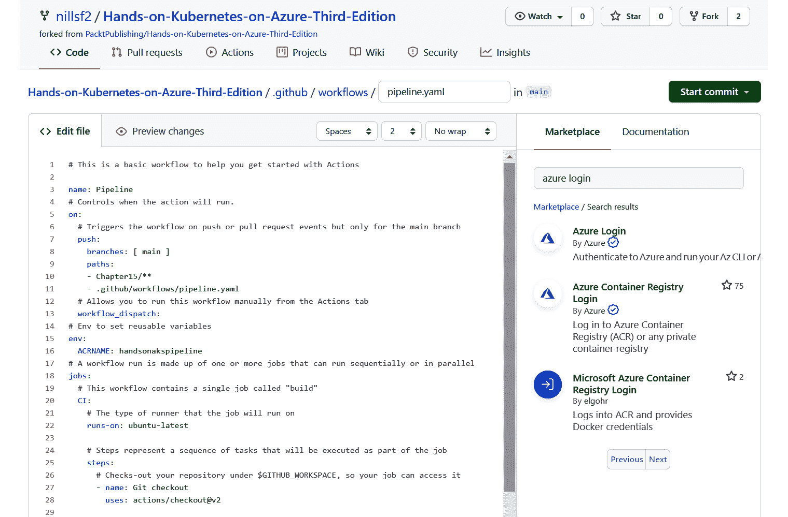

    图 15.14:搜索 Azure 登录操作

    在本演示中，您将使用 Azure 登录操作。点击 Azure 登录操作，获得更多信息的屏幕，如图*图 15.15:*

    

    图 15.15:关于 Azure 登录操作的更多细节

    这向您展示了有关如何使用该操作的更多信息，并为您提供了可以复制并粘贴到工作流编辑器中的示例代码。

    要登录到 Azure CLI 和 Azure 容器注册表，可以使用以下代码:

    30 -名称:az CLI 登录

    31 种用途:azure/login@v1

    32 带:

    33 个信条:${{机密。AZURE_CREDENTIALS }}

    Thirty-four

    35 -名称:ACR 登录

    36 运行:az acr 登录-n $ACRNAME

    第一步是登录 GitHub 操作运行器上的 Azure 命令行界面。要登录 Azure 命令行界面，它会使用您在上一节中配置的密码。第二个作业执行 Azure 命令行界面命令来登录 Azure 容器注册表。它使用您在第 14-15 行中配置的变量。它作为常规 shell 命令执行**登录**命令。在下一步中，您将把映像推送到这个容器注册表中。

4.  Next, you build the container image. There are multiple ways to do this, and you'll use **docker/build-push-action** in this example:

    39 -名称:构建和推送映像

    40 种用途:docker/build-push-action@v2

    41 带:

    42 上下文:。/第 15 章

    43 推:真

    44 个标签:${{ env。ACRNAME } } . azure Cr . io/网站/网站:${{ github.run_number }}

    这一步将构建您的容器映像并将其推送到注册表。您将上下文配置为在第 15 章文件夹中运行，因此 Dockerfile 中对**index.html**页面的引用仍然有效。它将使用容器注册表的名称来标记该映像，并且作为容器映像的版本号，它将使用 GitHub 操作的运行号。要获取工作流的运行号，您将使用 GitHub 配置的默认环境变量之一。完整列表请参考 GitHub 文档:[https://docs . GitHub . com/actions/reference/environment-variables](15.html)。

    #### 注意

    在本例中，您使用工作流运行号作为容器映像的版本。标记容器映像很重要，因为标记版本指示容器的版本。还有多种其他策略来版本化您的容器映像。

    不鼓励的一种策略是用最新的标签标记容器映像，并在 Kubernetes 部署中使用该标签。最新的**标签是 Docker 在没有提供标签的情况下添加到映像中的默认标签。**最新的**标签的问题是，如果您的容器注册表中带有**最新的**标签的映像发生了变化，Kubernetes 将不会直接获得该变化。在拥有带有最新**标签的映像本地副本的节点上，Kubernetes 在超时到期之前不会拉新映像；但是，没有映像副本的节点在需要运行带有此映像的 pod 时，会拉取更新的版本。这可能会导致在单个部署中运行不同的版本，这是应该避免的。****

*****   You are now ready to save and run this GitHub Actions workflow. You can save the workflow configuration file by clicking on the Start Commit button and then confirming by clicking Commit new file, as shown in *Figure 15.16:*

    

    图 15.16:保存动作配置文件

    *   Once the file has been saved, the workflow will be triggered to run. To follow the logs of the workflow run, you can click on Actions at the top of the screen. This should show you a screen similar to *Figure 15.17:*

    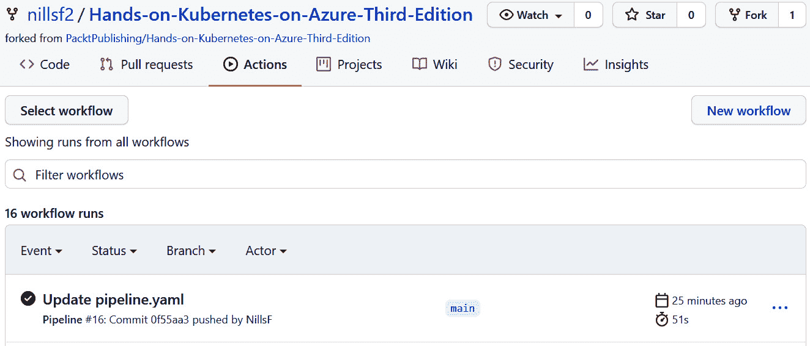

    图 15.17:获取动作运行历史

    单击顶部条目，获取工作流运行的更多详细信息。这将带您进入类似于*的屏幕图 15.18:*

    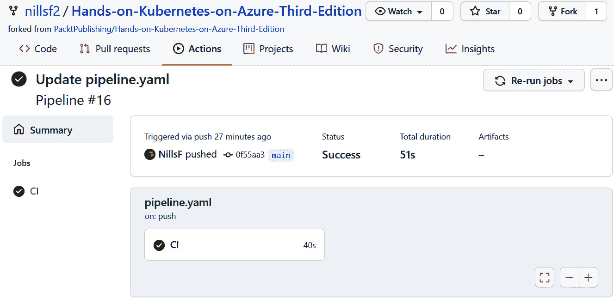

    图 15.18:动作运行的详细界面

    这将向您显示您的工作流详细信息，并向您显示您的工作流中只有一个作业。单击配置项获取该作业的日志。这将显示类似于*的屏幕图 15.19:*

    

    图 15.19:配置项作业的日志

    在此屏幕上，您可以看到工作流中每个步骤的输出日志。您可以通过单击每个步骤前面的箭头图标来展开该步骤的日志。

    *   In this example, you built a container image and pushed that to a container registry on Azure. Let's verify this image was indeed pushed to the registry. For this, go back to the Azure portal and, in the search bar, look for **container registry**, as shown in *Figure 15.20:*

    

    图 15.20:通过 Azure 门户导航到容器注册服务

    在结果屏幕中，单击您之前创建的注册表。现在，点击左侧的资源库，应该会显示**网站/网站**资源库，如图*图 15.21:*

    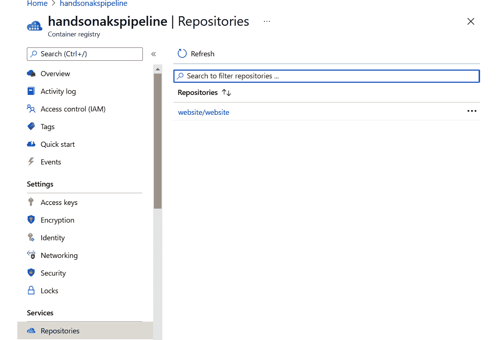

    图 15.21:显示容器注册表中的网站/网站库

    *   如果点击**网站/网站**资源库链接，应该会看到你的容器映像的映像标签，如图*图 15.22:*****

 ****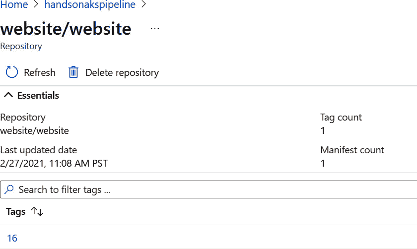

图 15.22:容器映像的映像标签

如果对比一下*图 15.18* 和*图 15.22* 的输出，就会看到动作的运行号也是映像上的标签。在您情况下，运行号和标签可能是 1。

您现在已经构建了一个基本的配置项管道。当**第 15 章**文件夹中的代码更改时，管道将运行并构建一个新的容器映像，该映像将被推送到容器注册表中。在下一节中，您将向管道中添加一个光盘作业，以便将映像部署到 Kubernetes 中的部署中。

## 设置光盘管道

您已经有一个带有配置项作业的管道，该作业将构建一个新的容器映像。在本节中，您将向该管道添加一个光盘作业，该作业将把更新的容器映像部署到 Kubernetes 中的一个部署中。

为了简化应用部署，在**第 15 章**内的**网站**文件夹中提供了该应用的掌舵图。您可以通过部署掌舵图来部署应用。通过使用 Helm 图表进行部署，您可以使用命令行覆盖 Helm 值。您已经在*第 12 章“将应用连接到 Azure 数据库”*中做到了这一点，当时您将 WordPress 配置为使用外部数据库。

在此光盘作业中，您需要执行以下步骤:

1.  看看代码。
2.  获取 AKS 凭据。
3.  设置应用。
4.  (可选)获取服务的公共知识产权。

让我们开始构建光盘管道。完整的 CI 和 CD 管道已在**管道-cicd.yaml** 文件中提供，供您参考:

1.  To add the CD job to the pipeline, you'll need to edit the **pipeline.yaml** file. To do this, from within your forked repository, click on Code at the top of the screen and go to the **.github/workflows** folder. In that folder, click on the **pipeline.yaml** file. Once that file is open, click on the pen icon in the top right, as highlighted in *Figure 15.23:*

    

    图 15.23:编辑 pipeline.yaml 文件

2.  In the file, at the bottom, start by adding the following lines to define the CD job:

    46 张光盘:

    47 次运行:Ubuntu-最新

    48 项需求:竞争情报

    49 步:

    在此代码块中，您正在创建光盘作业。这将再次运行在**Ubuntu-最新的**跑步者上。在*第 48 行*中，您定义此工作依赖于 CI 工作。这意味着此作业将仅在配置项作业完成后启动，并且仅在配置项作业成功完成时运行。最后*第 49 行*打开**步**块，接下来你要填写。

3.  The first step will be a Git checkout. This will use the same step you use in the CI job as well:

    50 - 名称：Git 签出

    51 个用途:actions/checkout@v2

4.  Next, you'll need to log in to the Azure CLI and get the AKS credentials. You could do this by using the same approach as you did in the CI job, meaning you could do an Azure CLI login and then run the **az aks get-credentials** command on the runner. However, there is a single GitHub action that can achieve this for AKS:

    53 名称:蓝色立方集上下文

    54 种用途:Azure/aks-set-context@v1

    55 带:

    56 个信条:${{机密。AZURE_CREDENTIALS }}

    57 资源组:rg-hand onaks

    58 集群名称:handsonaks

    这一步使用微软的 **Azure/aks-set-context** 动作。您可以使用自己创建的 Azure 凭据机密对其进行配置，然后定义要使用的资源组和群集名称。这将配置 GitHub 操作运行器来使用那些 AKS 凭证。

5.  You can now create the application on the cluster. As mentioned in the introduction of this section, you will deploy the application using the Helm Chart created in the **website** folder for this chapter. To deploy this Helm Chart on your cluster, you can use the following code:

    60 -名称:头盔升级

    61 跑:|

    62 helm 升级网站第 15 章/网站-安装\

    63 集 image . repository = $ ACRNAME . azure Cr . io/网站/网站\

    64 集 image . tag = $ { { github . run _ number } }

    该代码块执行 **Helm 升级**命令。第一个论点(**网站**)指的是 Helm 版本的名称。第二个论点(**第 15 章/网站**)指的是掌舵图的位置。 **- install** 参数配置 Helm 的方式是，如果图表还没有安装，它将被安装。这将是您第一次运行此操作的情况。

    在下面两行中，您设置了 Helm 值。您将映像存储库设置到容器注册表中的**网站/网站** repo，并将标签设置为动作的运行号。这与您在配置项步骤中用于标记映像的值相同。

6.  Finally, there is one optional step you can include in your workflow. This is getting the public IP address of the service that will be created to serve your website. This is optional because you could get this IP address using **kubectl** in Azure Cloud Shell, but it has been provided for your convenience:

    66 -名称:获取服务 IP

    67 跑:|

    68 PUBLICIP=""

    69 while[-z $ PUblic IP]；做

    70 呼应“等待公共 IP……”

    71 PUBLICIP=$(kubectl get service 网站-o JSON path = ' { . status . Loadbalancer . ingress[0]。ip} ')

    72 [ -z "$PUBLICIP" ] &> 睡眠 10

    73 完成

    74 回声$PUBLICIP

    这个代码块将运行一个小的 Bash 脚本。虽然公共 IP 还没有设置，但它会继续使用 **kubectl** 从服务中获取公共 IP。一旦设置了公共 IP，公共 IP 将显示在 GitHub 操作日志中。

7.  You are now ready to save the updated pipeline and run it for the first time. To save the pipeline, click on the Start commit button at the top right of the screen and click on Commit changes in the pop-up window, as shown in *Figure 15.24:*

    

    图 15.24:管道工作流

8.  Once you have committed the changes to GitHub, the workflow will be triggered to run. To follow the deployment, click on Actions at the top of the screen. Click on the top entry here to see the details of the run. Initially, the output will look similar to *Figure 15.25:*

    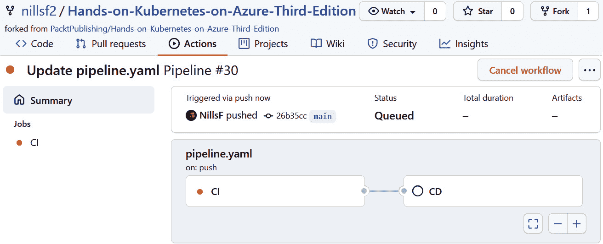

    图 15.25:动作运行时动作运行的详细输出

    如您所见，您现在可以访问此工作流运行中的两个作业，配置项作业和光盘作业。配置项作业运行时，光盘作业的日志将不可用。配置项作业成功完成后，您将能够访问光盘作业的日志。等待几秒钟，直到屏幕看起来像*图 15.26* ，表示工作流成功完成:

    

    图 15.26:两个作业完成后动作运行的详细输出

9.  Now, click on the CD job to see the logs of this job. Click on the arrow next to Get service IP to see the public IP of the service that got created, as shown in *Figure 15.27:*

    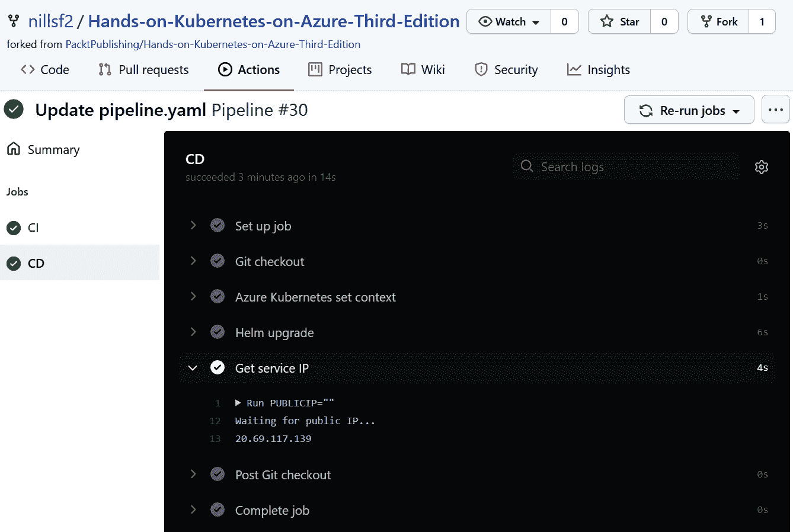

    图 15.27:显示服务公共 IP 地址的光盘作业日志

    在您的网络浏览器中打开一个新的选项卡来访问您的网站。您应该会看到类似于*的输出图 15.28:*

    

    图 15.28:网站运行 g 版本 1

10.  Let's now test the end-to-end pipeline by making a change to the **index.html** file. To do this, in GitHub, click on Code at the top of the screen, open **Chapter15**, and click on the **index.html** file. In the resulting window, click on the pen icon in the top right, as shown in *Figure 15.29:*

    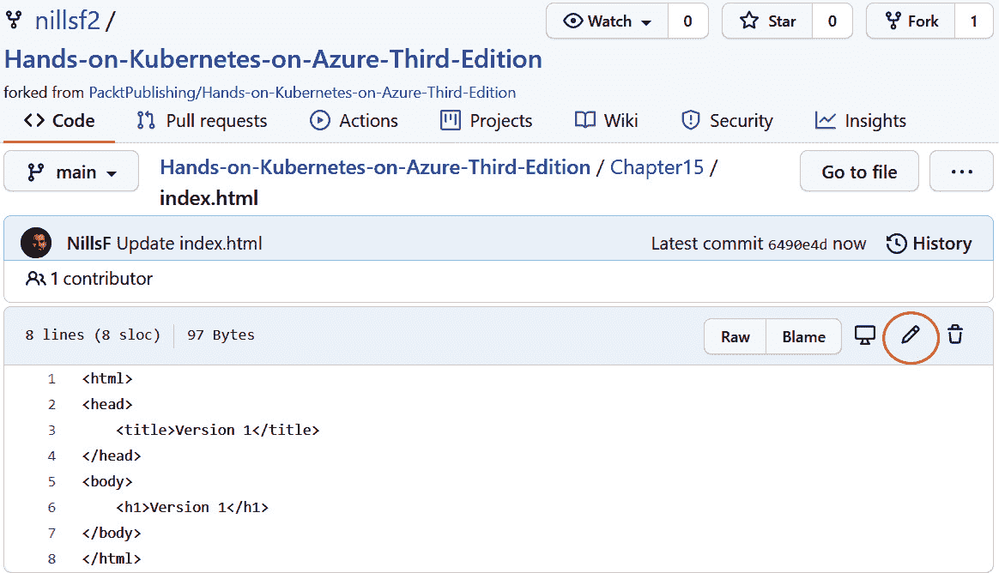

    图 15.29:点击笔图标编辑 index.html 文件

11.  You can now edit the file. Change the version of the website to **version 2** (or any other changes you might want to make), and then scroll to the bottom of the screen to save the changes. Click on the Commit changes button to commit the changes to GitHub, as shown in *Figure 15.30:*

    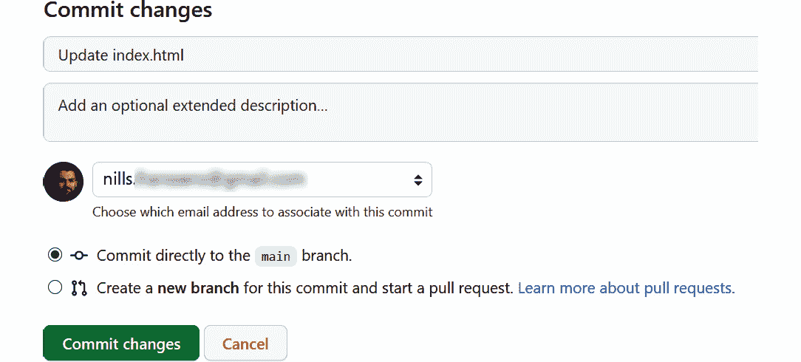

    图 15.30:将变更保存到 index.html 文件中

12.  This will trigger the workflow to be run. It will run through both the CI and CD jobs. This means that a new container will be built, with an updated **index.html** file. You can follow the status of the workflow run as you've done before, by clicking on Actions at the top of the screen and clicking on the top run. Wait until the job has finished, as shown in *Figure 15.31:*

    

    图 15.31:更新 index.html 后运行的操作

13.  如果您现在浏览回作为*第 9 步*的输出的 IP 地址，您应该会看到显示版本 2 的更新网页，如*图 15.32:* 所示

图 15.32:网页已经更新到版本 2

这向您展示了管道成功地执行了，并且将您的代码更改带到了生产中。

#### 注意

在本例中，您直接更新了网站的生产版本，无需任何批准。GitHub Actions 还允许您配置手动批准，以防您想在将更改提升到生产之前测试它们。要配置手动批准，您可以使用 GitHub 操作中的环境功能。更多信息请参考[https://docs.github.com/en/actions/reference/environments](15.html)。

使用 GitHub 操作的配置项和光盘示例到此结束。让我们确保清理您为本章创建的资源。在云外壳中，执行以下命令:

helm 卸载网站

az 组删除-n rg-管道-是

由于这也标志着本书中示例的结束，如果不再需要集群，您现在也可以删除集群本身。如果您希望这样做，可以使用以下命令删除集群:

az 组删除-n rg-handsonaks -是

这样，当你读完这本书里的例子后，如果你不再使用这些资源，你就不用为它们付费了。

## 总结

您现在已经成功地为 Kubernetes 集群创建了配置项/光盘管道。CI 是频繁构建和测试软件的过程，而 CD 是定期部署软件的实践。

在本章中，您使用 GitHub Actions 作为构建 CI/CD 管道的平台。您从构建配置项管道开始。在这个管道中，您构建了一个容器映像，并将其推送到容器注册中心。

最后，您还添加了一个 CD 管道来将该容器映像部署到您的 Kubernetes 集群中。您能够验证通过对网页进行代码更改，管道被触发，代码更改被推送到您的集群。

您在本章中构建的 CI/CD 管道是一个入门管道，它为您可以用来将应用部署到生产中的更健壮的 CI/CD 管道奠定了基础。在生产中使用之前，您应该考虑向管道中添加更多的测试，并将其与不同的分支集成。

## 最后的想法

这一章也是这本书的结尾。在这本书的过程中，你已经通过一系列的实践例子学会了如何使用 AKS。

这本书从基础开始；您学习了容器和 Kubernetes，并创建了一个 AKS 集群。

下一节重点介绍 AKS 上的应用部署。您学习了将应用部署到 AKS 的不同方法，如何扩展应用，如何调试故障，以及如何使用 HTTPS 保护服务。

接下来的部分将重点讨论 AKS 中的安全性。您在 Kubernetes 中学习了基于角色的访问控制，以及如何将 AKS 与 Azure Active Directory 集成。然后，您了解了 pod 身份，pod 身份在后续几章中使用。之后，您学习了如何在 AKS 中安全地存储机密，然后我们专注于网络安全。

这本书的最后一部分集中在 AKS 与其他服务的一些高级集成上。您通过 Kubernetes API 部署了一个 Azure 数据库，并将其与集群上的 WordPress 应用集成在一起。然后，您探讨了如何使用 Azure 安全中心监控配置和修复集群上的威胁。然后在集群上部署 Azure 功能，并使用 KEDA 扩展它们。在最后一章中，您配置了一个 CI/CD 管道，根据代码更改自动将应用部署到 Kubernetes。

如果您已经成功地完成了本书中提供的所有示例，那么您现在应该已经准备好在 AKS 之上大规模地构建和运行应用了。****