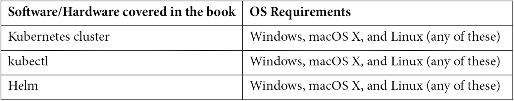

# 零、前言

这本书是对那些通过命令行对 Kubernetes 管理不熟悉的人的一个全面的介绍，它会让你很快跟上进度。

Kubernetes 是一个用于自动化应用部署、扩展和管理的开源容器编排系统，`kubectl`是一个帮助管理它的命令行工具。

# 这本书是给谁的

这本书是为开发人员、开发人员、系统管理员和所有希望使用`kubectl`命令行来执行 Kubernetes 功能的人编写的，他们可能知道 Docker，但还没有掌握使用`kubectl`来将容器部署到 Kubernetes。

# 这本书涵盖了什么

[*第 1 章*](01.html#_idTextAnchor016)*介绍和安装 ku pectl*，简要概述`kubectl`以及如何安装和设置。

[*第二章*](02.html#_idTextAnchor033)*获取集群信息*，教读者如何获取集群信息和可用的 API 列表。

[*第三章*](03.html#_idTextAnchor039)*使用节点*，教读者如何获取集群节点的信息。

[*第 4 章*](04.html#_idTextAnchor049)*创建和部署应用*，说明如何创建和安装 Kubernetes 应用。

[*第五章*](05.html#_idTextAnchor055)*更新和删除应用*，说明如何更新 Kubernetes 应用。

[*第 6 章*](06.html#_idTextAnchor064)*调试应用*，解释如何查看应用日志，`exec`到容器

[*第七章*](07.html#_idTextAnchor070)*使用 kubectl 插件*，解释如何安装`kubectl`插件。

[*第八章*](08.html#_idTextAnchor076)*为库贝斯克*介绍库贝斯克，讨论库贝斯克。

[*第九章*](09.html#_idTextAnchor081)*为Kubernetes*介绍 Helm，讨论Kubernetes包管理器 Helm。

[*第 10 章*](10.html#_idTextAnchor096)*`kubectl`最佳实践和 Docker 命令*，涵盖了`kubectl`中的`kubectl`最佳实践和 Docker 等同物。

# 为了充分利用这本书



**我们建议通过 GitHub 存储库访问代码(下一节** **中有链接)。这样做将帮助您避免任何与复制和粘贴代码相关的潜在错误。**

# 下载示例代码文件

你可以在[https://GitHub . com/packt publishing/kube CTL-Command-Line-Kubernetes-in-a-cable](https://github.com/PacktPublishing/kubectl-Command-Line-Kubernetes-in-a-Nutshell)下载这本书的示例代码文件。如果代码有更新，它将在现有的 GitHub 存储库中更新。

我们还有来自 https://github.com/PacktPublishing/丰富的书籍和视频目录的其他代码包。看看他们！

# 下载彩色图片

我们还提供了一个 PDF 文件，其中包含本书中使用的截图/图表的彩色图像。可以在这里下载:[https://static . packt-cdn . com/downloads/9781800561878 _ color images . pdf](https://static.packt-cdn.com/downloads/9781800561878_ColorImages.pdf)。

# 使用的约定

本书通篇使用了许多文本约定。

`Code in text`:表示文本中的码字、数据库表名、文件夹名、文件名、文件扩展名、路径名、虚拟网址、用户输入和推特句柄。这里有一个例子:“在你的主目录中创建`.kube`目录。”

代码块设置如下:

```
apiVersion: apps/v1
kind: Deployment
metadata:
  name: postgresql
  labels:
    app: postgresql
```

当我们希望将您的注意力吸引到代码块的特定部分时，相关的行或项目以粗体显示:

```
spec:
  replicas: 1
  selector:
    matchLabels:
      app: postgresql
```

任何命令行输入或输出都编写如下:

```
$ kubectl version –client --short
Client Version: v1.18.1
```

**粗体**:表示一个新的术语、一个重要的单词或者你在屏幕上看到的单词。例如，菜单或对话框中的单词像这样出现在文本中。这里有一个例子:“我们给节点分配了**标签**和**注释**，没有**角色**或**污点**集。”

提示或重要注意事项

像这样出现。

# 取得联系

我们随时欢迎读者的反馈。

**一般反馈**:如果您对本书的任何方面有疑问，请在留言主题中提及书名，并通过[customercare@packtpub.com](mailto:customercare@packtpub.com)发邮件给我们。

**勘误表**:虽然我们已经尽了最大的努力来保证内容的准确性，但是错误还是会发生。如果你在这本书里发现了一个错误，如果你能向我们报告，我们将不胜感激。请访问[www.packtpub.com/support/errata](http://www.packtpub.com/support/errata)，选择您的图书，点击勘误表提交链接，并输入详细信息。

**盗版**:如果您在互联网上遇到任何形式的我们作品的非法拷贝，如果您能提供我们的位置地址或网站名称，我们将不胜感激。请联系我们在[copyright@packt.com](mailto:copyright@packt.com)与材料的链接。

**如果你有兴趣成为一名作者**:如果有一个你有专长的话题，你有兴趣写或者投稿一本书，请访问[authors.packtpub.com](http://authors.packtpub.com)。

# 评论

请留下评论。一旦你阅读并使用了这本书，为什么不在你购买它的网站上留下评论呢？然后，潜在的读者可以看到并使用您不带偏见的意见来做出购买决定，我们在 Packt 可以了解您对我们产品的看法，我们的作者可以看到您对他们的书的反馈。谢谢大家！

更多关于 Packt 的信息，请访问[packt.com](http://packt.com)。