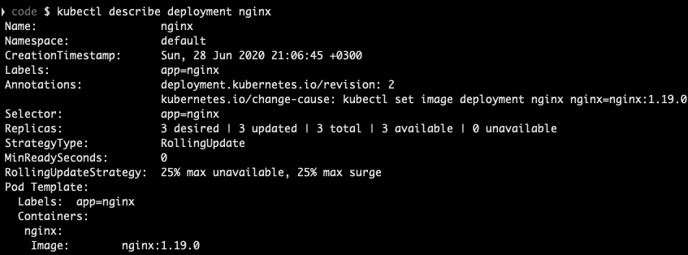
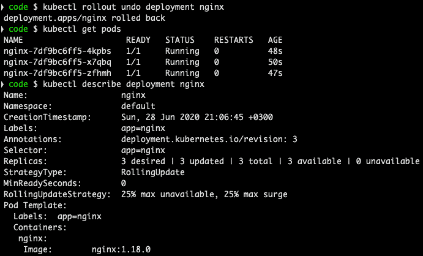
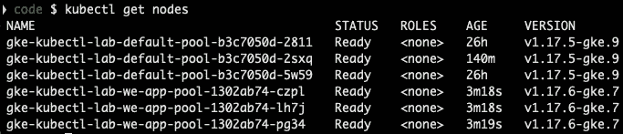
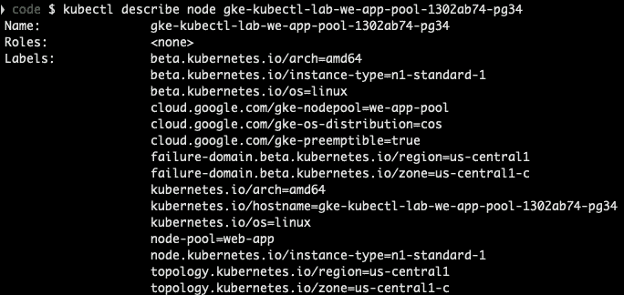
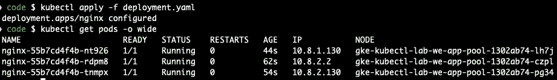
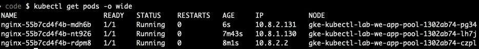
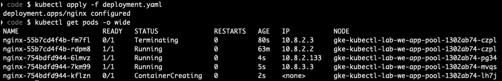
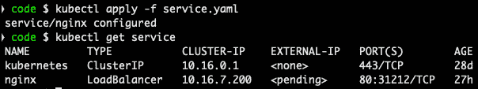
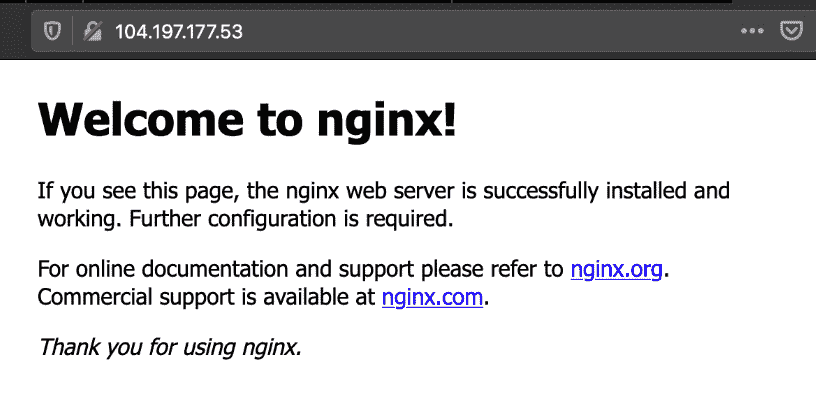

# 五、更新和删除应用

在前一章中，我们学习了如何部署应用及其服务，以及如何扩展部署副本。现在让我们了解一些更新应用的更高级的方法。

在这一章中，我们将学习如何将应用更新到新版本，以及如果发布的版本不好，如何回滚。我们将看到如何将应用分配给特定的节点，如何在高可用性模式下运行应用，如何使应用在互联网上可用，以及在有需要的情况下，如何删除应用。

我们将在本章中讨论以下主题:

*   发布新的应用版本
*   回滚应用版本
*   将应用分配给特定节点(节点关联性)
*   将应用副本调度到不同的节点(pod 相似性)
*   向互联网公开应用
*   删除应用

# 部署新的应用版本

在前一章中，我们使用`nginx v1.18.0` Docker 映像部署了一个应用。在这一部分，让我们将其更新为`nginx v1.19.0`:

要更新`nginx` Docker 映像标签，运行以下命令:

```
$ kubectl set image deployment nginx nginx=nginx:1.19.0 \
 --record
deployment.apps/nginx image updated
$ kubectl rollout status deployment nginx
deployment "nginx" successfully rolled out
$ kubectl get deployment nginx
NAME    READY   UP-TO-DATE   AVAILABLE   AGE
nginx   3/3     3            3           5d19h
$ kubectl get pods
NAME                    READY   STATUS    RESTARTS   AGE
nginx-6fd8f555b-2mktp   1/1     Running   0          60s
nginx-6fd8f555b-458cl   1/1     Running   0          62s
nginx-6fd8f555b-g728z   1/1     Running   0          66s
```

`$ kubectl rollout status deployment nginx`命令将显示卷展栏状态为成功、失败或等待:

```
deployment "nginx" successfully rolled out
```

这是一种检查部署部署状态的简便方法。

让我们通过运行以下命令来确保部署更新到`nginx` v1.19.0:

```
$ kubectl describe deployment nginx
```

前面命令的输出可以在下面的截图中看到:



图 5.1–描述部署的输出

是的，更新到了 v1.19.0，我们可以在`Pod Template`部分看到。现在，让我们使用`deployment.yaml`文件更新Docker 映像。

用新的 Docker `image`标签更新`deployment.yaml`文件:

```
...
spec:
  containers:
  -image: nginx:1.19.0
...
```

运行`$ kubectl apply -f deployment.yaml`命令:

```
$ kubectl apply -f deployment.yaml
deployment.apps/nginx configured
$ kubectl rollout status deployment nginx
deployment "nginx" successfully rolled out
$ kubectl get deployment nginx
NAME    READY   UP-TO-DATE   AVAILABLE   AGE
nginx   3/3     3            3           5d19h
$ kubectl get pods
NAME                    READY   STATUS    RESTARTS   AGE
nginx-6fd8f555b-2mktp   1/1     Running   0          12m
nginx-6fd8f555b-458cl   1/1     Running   0          12m
nginx-6fd8f555b-g728z   1/1     Running   0          12m
```

运行`$ kubectl get pods`命令显示，当我们应用与之前相同的 Docker 映像标签时，Pod 没有变化，因此 Kubernetes 足够聪明，不会对`nginx`部署进行任何不必要的更改。

# 回滚应用版本

当您需要将应用版本回滚到以前的版本时，总会有种情况(例如代码中的错误、为最新版本提供的错误 Docker 标记等等)。

这可以通过使用`$ kubectl rollout undo deployment nginx`命令后跟`get`和`describe`命令来完成:



图 5.2–部署版本回滚

前面的输出显示版本为`Image: nginx:1.18.0`，因此回滚成功。

我们还可以检查部署部署历史:

```
$ kubectl rollout history deployment nginx
deployment.apps/nginx
REVISION  CHANGE-CAUSE
1         <none>
2         <none>
```

我们也可以回滚到一个特定的版本:

```
$ kubectl rollout undo deployment nginx –to-revision=1
deployment.apps/nginx rolled back
```

很好，我们已经学习了如何回滚部署的发布。

# 将应用分配给特定节点(节点关联性)

有一些用例，其中 Kubernetes 集群具有不同规格的不同节点池，例如:

*   有状态应用
*   后端应用
*   前端应用

让我们将`nginx`部署重新安排到专用节点池:

1.  To get the nodes list, run the following command:

    ```
    $ kubectl get nodes
    ```

    前面的命令给出了以下输出:

    

    图 5.3–节点池列表

2.  Next, let's check a node under the `gke-kubectl-lab-we-app-pool` name. Run the following command:

    ```
    $ kubectl describe node gke-kubectl-lab-we-app-pool-1302ab74-pg34
    ```

    前面命令的输出如下图所示:

    

    图 5.4–节点标签

3.  在这里，我们有一个`node-pool=web-app`标签，对于`gke-kubectl-lab-we-app-pool`池的所有节点都是一样的。
4.  让我们用`nodeAffinity`规则更新`deployment.yaml`文件，这样`nginx`应用只被安排到`gke-kubectl-lab-we-app-pool` :

    ```
    ...
    spec:
      affinity:
        nodeAffinity:
          requiredDuringSchedulingIgnoredDuringExecution:
            nodeSelectorTerms:
            - matchExpressions:
              - key: node-pool
                operator: In
                values:
                - "web-app"
    containers:
    ...
    ```

5.  To deploy the changes, run the `$ kubectl apply -f deployment.yaml` command followed by the `get` command as shown in the following screenshot:

    

    图 5.5–节点关联性

    很好，Pod 被安排在`gke-kubectl-lab-we-app-pool`上。

    小费

    我们使用了`–o wide`标志，它允许我们显示更多关于 pod 的信息，比如它的 IP 和它被安排在的节点。

6.  Let's delete one pod to verify that it gets scheduled onto `gke-kubectl-lab-we-app-pool`:

    ```
    $ kubectl delete pod nginx-55b7cd4f4b-tnmpx
    ```

    我们再来看看PODS清单:



图 5.6–带有节点的 Pods 列表

前面的截屏显示了带有计划的节点的 pods 列表。很好，新的 pod 被安排在正确的节点池中。

# 将应用副本调度到不同的节点(pod 相似性)

使用`nodeAffinity`并不能确保下次将 pods 调度到单独的节点上，对于真正的应用高可用性，最佳实践是确保将应用 pods 调度到单独的节点上。如果其中一个节点关闭/重新启动/替换，让所有的 pod 在该节点上运行将导致应用关闭，其服务不可用。

让我们用`podAntiAffinity`规则更新`deployment.yaml`文件，以便将`nginx`应用仅调度到`gke-kubectl-lab-we-app-pool`和单独的节点上:

```
...
spec:
  affinity:
    nodeAffinity:
      requiredDuringSchedulingIgnoredDuringExecution:
        nodeSelectorTerms:
        - matchExpressions:
          - key: node-pool
            operator: In
            values:
            - "web-app"
    podAntiAffinity:
      requiredDuringSchedulingIgnoredDuringExecution:
      - labelSelector:
          matchExpressions:
          - key: app
            operator: In
            values:
            - nginx
          topologyKey: "kubernetes.io/hostname"
containers:
...
```

要部署新的更改，运行`$ kubectl apply -f deployment.yaml`命令，然后运行`get`命令，如下图所示:



图 5.7–节点关联性

如您所见，由于我们增加了`podAntiAffinity`规则，PODS再次被重新安排:


图 5.8–重新安排了节点相似性单元

如所示，Pod 运行在不同的节点上，`podAntiAffinity`规则将确保Pod 不会被调度到同一个节点上。

# 将应用暴露给互联网

很棒的工作到目前为止，所以为了完成这一章，让我们通过互联网提供我们的应用。

我们需要用`type: LoadBalancer`更新`service.yaml`，这将创建一个带有外部 IP 的负载平衡器。

注意

负载平衡器功能取决于供应商的集成，因为外部负载平衡器是由供应商创建的。所以，如果你用 Minikube 或者 Kind 在本地运行，你永远不会真正得到一个外部 IP。

用以下内容更新`service.yaml`文件:

```
...
spec:
  type: LoadBalancer
...
```

要部署新的更改，运行`$ kubectl apply -f service.yaml`命令，然后运行`get`命令，如下图所示:



图 5.9–带有挂起负载平衡器的服务

我们看到`pending`的状态取决于云提供商，并且负载平衡器可能需要 5 分钟的时间进行调配。一段时间后再次运行`get`命令，可以看到分配了 IP，如下图截图所示:


图 5.10–带有负载平衡器的服务

为了确保应用正在工作，让我们在浏览器中打开 IP `104.197.177.53`:



图 5.11–浏览器中的应用

瞧啊。我们的应用可以从互联网上访问。

重要说明

前面的例子展示了如何将应用公开给互联网是不安全的，因为它使用的是 HTTP。为了简单起见，我们使用了 HTTP，但是实际应用应该只使用 HTTPS。

# 删除申请

有时候，你需要删除一个应用，所以让我们来看几个选项来说明如何做。

在前面几节中，我们部署了部署和服务。让我们回忆一下我们部署了什么。

要检查部署，请运行以下命令:

```
$ kubectl get deployment
NAME    READY   UP-TO-DATE   AVAILABLE   AGE
nginx   3/3     3            3           6d17h
```

要检查活动服务，请运行以下命令:

```
$ kubectl get service
NAME         TYPE         CLUSTER-IP    EXTERNAL-IP     PORT(S)
kubernetes   ClusterIP    10.16.0.1     <none>          443/TCP
nginx        LoadBalancer 10.16.12.134  104.197.177.53  80:30295/TCP
```

我们有一个名为`nginx`的部署和一个名为`nginx`的服务。

首先，让我们使用以下命令删除`nginx`服务:

```
$ kubectl delete service nginx
service "nginx" deleted
$ kubectl get service
NAME         TYPE         CLUSTER-IP    EXTERNAL-IP     PORT(S)
kubernetes   ClusterIP    10.16.0.1     <none>          443/TCP
```

正如你在前面的截图中看到的，`nginx`服务被删除了，应用不再暴露在互联网上，被删除也是安全的。要删除`nginx`部署，运行以下命令:

```
$ kubectl delete deployment nginx
deployment.apps "nginx" deleted
$ kubectl get deployment
No resources found in default namespace.
```

用几个命令就可以很容易地删除应用部署的资源。

但是如果您有一个安装了两个以上资源的映像，您会对每个资源运行删除命令吗？当然不是，还有一个更简单的方法。

由于我们已经删除了部署和服务，让我们再次部署它们，以便再次删除一些内容。您需要将`deployment.yaml`和`service.yaml`放入某个文件夹中，例如`code`。

这将允许您将多个资源作为一个目录中的多个文件一起管理。

注意

您也可以在单个 YAML 文件中有多个 YAML 条目(使用`---`分隔符)。

要使用相同的命令安装部署和服务，请运行以下命令:

```
$ kubectl apply –f code/
deployment.apps/nginx created
service/nginx created
```

要检查部署和服务，请运行以下命令:

```
$ kubectl get deployment
NAME    READY   UP-TO-DATE   AVAILABLE   AGE
nginx   3/3     3            3           13s
$ kubectl get service
NAME         TYPE         CLUSTER-IP    EXTERNAL-IP     PORT(S)
kubernetes   ClusterIP    10.16.0.1     <none>          443/TCP
nginx        LoadBalancer 10.16.4.143   pending         80:32517/TCP
```

这一次，我们使用了一个命令来安装应用，同样，您也可以对应用应用更改，因为 Kubernetes 足够聪明，它只会更新被更改的资源。

注意

您也可以使用一个命令来显示服务和部署:`kubectl get deployment` / `service`。

我们也可以用同样的方法删除应用。要使用一个命令删除部署和服务，请运行以下命令:

```
$ kubectl delete –f code/
deployment.apps/nginx deleted
service/nginx deleted
$ kubectl get deployment
No resources found in default namespace.
$ kubectl get service
NAME         TYPE         CLUSTER-IP    EXTERNAL-IP     PORT(S)
kubernetes   ClusterIP    10.16.0.1     <none>          443/TCP
```

如您所见，我们只使用了一个命令来清理应用的所有已安装资源。

# 总结

在本章中，我们学习了如何发布新的应用版本、回滚应用版本、将应用分配给特定节点、在不同节点之间调度应用副本以及将应用公开给互联网。我们还学习了如何以几种不同的方式删除应用。

在下一章中，我们将学习如何调试应用，这一点非常重要，因为应用的发布并不总是顺利的。