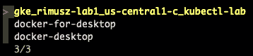
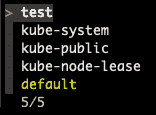
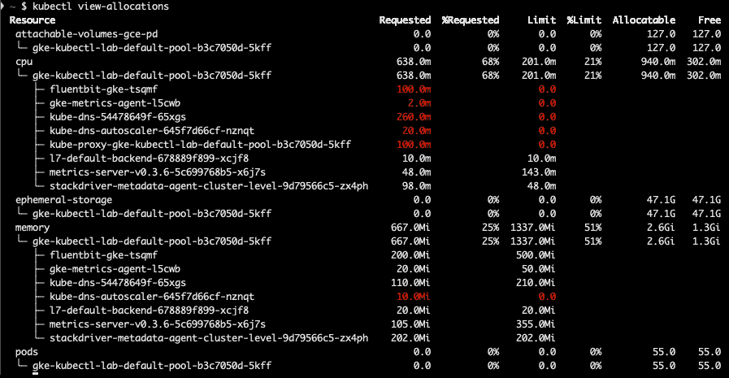

# 七、使用`kubectl`插件

在前一章中，我们学习了如何使用`kubectl`进行各种操作，比如列出节点和 pods，检查日志。在本章中，让我们学习如何用插件扩展`kubectl`命令库。`kubectl`有很多命令，但可能并不总是有你想要的命令，在这种情况下，我们需要使用插件。我们将学习如何安装`kubectl`插件，以便拥有更多带有额外子命令的功能。我们将看到如何使用这些插件，最后，我们将看到如何为`kubectl`创建一个基本插件。

在本章中，我们将涵盖以下主要主题:

*   安装插件
*   使用插件
*   创建基本插件

# 安装插件

`kubectl`中的一个插件只是一个可执行文件(它可以是一个编译好的 Go 程序或者 Bash shell 脚本等等)，它的名字以`kubectl-`开头，要安装这个插件，你只需要把它的可执行文件放在你的`PATH`变量中的一个目录中。

找到并安装插件最简单的方法是使用Kubernetes插件管理器**Krew**([https://krew.sigs.k8s.io/](https://krew.sigs.k8s.io/))来。Krew 可用于 macOS、Linux 和 Windows。

Krew 是一个 Kubernetes 插件，所以让我们继续安装它。在本例中，我们将使用 macOS:

1.  To install Krew on macOS, run the `$ brew install krew` command as shown in the following screenshot:

    

    图 7.1–在 macOS 上使用 brew 进行 krew 安装

2.  接下来，我们需要下载插件列表:

    ```
    $ kubectl krew update
    ```

3.  When we have a locally cached list of all the plugins, let's check for available plugins by running the `$ kubectl krew search` command as shown in the following screenshot:

    

    图 7.2–可用插件列表

    由于该列表有 90 多个插件，在前面的截图中，我们只显示了列表的一部分。

4.  让我们安装一些方便的插件通过运行`$ kubectl krew install ctx ns view-allocations`命令来扩展`kubectl`命令库，如下图所示:


图 7.3–使用 Krew 安装插件

正如你所看到的，安装`kubectl`插件是如此简单。

# 使用插件

所以，我们已经安装了几个非常有用的插件。让我们看看如何使用它们。

我们已经安装了三个插件:

*   `kubectl ctx`: This plugin allows us to easily to switch between Kubernetes clusters, which is very useful when you have more than one cluster set in your `kubeconfig`.

    让我们通过运行`$ kubectl ctx`命令来检查可用的集群:



图 7.4–CTX 插件

*   `kubectl ns`:这个插件允许我们在名称空间之间切换。让我们通过运行`$ kubectl ns`命令来检查集群中可用的名称空间:



图 7.5–ns 插件

*   `kubectl view-allocations`: This plugin lists resource allocations of a namespace, such as CPU, memory, storage, and so on.

    让我们通过运行`$ kubectl view-allocations`命令来检查集群中的资源分配:



图 7.6–视图分配插件

您可以在前面的列表中看到，使用插件看起来好像这些子命令是`kubectl`工具本身的一部分。

# 创建基本插件

在这一节中，让我们创建一个名为`toppods`的简单插件来显示 Kubernetes 集群节点。这只是如何创建插件的一个非常简单的例子:

1.  我们将创建一个简单的基于`bash`的插件，名为`kubectl-toppods` :

    ```
    $ cat kubectl-toppods
    #!/bin/bash
    kubectl top pods
    ```

2.  让我们将`kubectl-toppods`文件复制到`~/bin`路径:

    ```
    $ cp kubectl-toppods ~/bin
    ```

3.  确保它是可执行的:

    ```
    $ chmod +x ~/bin/ kubectl-toppods
    ```

4.  现在让我们试着运行它:

    ```
    $ kubectl toppods
    NAME                        CPU(cores)   MEMORY(bytes)
    postgresql-57578b68d9-6rpt8 1m           22Mi
    ```

很好！可以看到插件在工作，创建一个`kubectl`插件也不是很难。

# 总结

在本章中，我们学习了如何安装、使用和创建`kubectl`插件。了解如何用现有插件扩展`kubectl`，以及如何创建自己的插件是很有用的。

我们已经了解了一些非常方便和有用的`kubectl`插件:

*   `ctx`:让我们可以非常轻松地在 Kubernetes 集群之间切换
*   `ns`:允许我们在名称空间之间切换
*   `view-allocations`:显示集群中资源分配的列表

当您每天使用多个 Kubernetes 集群和名称空间时，使用`ctx`和`ns`插件将节省大量时间。

在下一章中，我们将学习如何使用 Kustomize 部署应用。