# *第九章*:介绍库本内斯的掌舵人

在前一章中，我们学习了如何安装和使用 Kustomize。这一章，我们来了解一下 Helm ( [https://helm.sh](https://helm.sh) )。

Helm 是事实上的 Kubernetes 包管理器，也是在 Kubernetes 上安装任何复杂应用程序的最佳和最简单的方法之一。

Helm 不是`kubectl`的一部分，也没有`kubectl`插件，但是它在 Kubernetes 空间中发挥了很大的作用，是一个必知的工具。

在本章中，我们将学习 Helm v3，特别是如何安装应用程序，升级和回滚应用程序版本，创建和 lint Helm 图表，以及使用插件扩展 Helm。

注意

我们将使用 Helm v3，因为在撰写本文时它是 Helm 的最新版本。

我们将在本章中讨论以下主题:

*   赫尔姆简介
*   使用 Helm 图表安装应用程序
*   升级 Helm 版本
*   回滚到以前的 Helm 版本
*   使用赫尔姆的模板命令
*   创建掌舵图
*   使用赫尔姆的林挺功能
*   用插件扩展头盔

# 赫尔姆简介

Helm 是一个 Kubernetes 包管理器，允许开发人员和用户以一种简单的方式将 Kubernetes 应用程序打包、配置、共享和部署到 Kubernetes 集群上。

你可以认为 Helm 和家酿/APT/Yum 包管理器一样，但是对于 Kubernetes 来说。

Helm v3 基于纯客户端架构。它以与`kubectl`相同的方式连接到 Kubernetes 应用编程接口，使用包含 Kubernetes 集群连接设置的`kubeconfig`文件。所以在`kubectl`工作的地方，赫尔姆命令行界面也将工作，使用相同的`kubectl`功能和权限。

为了更好地理解 Helm，您应该熟悉以下概念:

*   **Helm CLI**:命令行工具与 Kubernetes API 交互，执行各种功能，如安装、升级和删除 Helm 版本。
*   **一个图表**:这是描述 Kubernetes 资源的模板文件的集合。
*   **图表模板**:图表中使用的掌舵图表模板语言。
*   **存储库**:Helm 存储库是存储和共享打包图表的地方。
*   **发布版本**:部署到库本内特集群的图表的特定实例。

让我们在接下来的几节中详细了解一下它们。

## 赫尔姆 CLI

赫尔姆命令行界面可以使用以下命令安装在不同的操作系统上:

*   在 macOS 上安装如下:

    ```
    $ brew install helm
    ```

*   在 Windows 上安装是通过以下命令完成的:

    ```
    $ choco install kubernetes-helm
    ```

*   在 Linux 上安装如下:

    ```
    $ https://raw.githubusercontent.com/helm/helm/master/scripts/get-helm-3 | bash
    ```

您可以通过`helm –h`获得所有可用的 Helm CLI 命令。让我们列出最常用的，以及它们的描述:

*   `helm repo add`:在本地缓存列表中增加一个 Helm 图表库，之后我们可以引用它从库中拉图表。
*   `helm repo update`:获取图表库的最新信息；信息存储在本地。
*   `helm search repo`:在给定的存储库中搜索图表。
*   `helm pull`:从图表库中下载给定的图表。
*   `helm upgrade -i`:如果没有版本那就安装，否则升级版本。
*   `helm ls`:列出当前命名空间中的版本。如果提供了`-A`标志，它将列出所有的名称空间。
*   `helm history`:打印给定版本的历史版本。
*   `helm rollback`:将一个版本回滚到以前的版本。
*   `helm template`:在本地渲染图表模板并显示输出。
*   `helm create`:创建图表。
*   `helm lint`:绘制图表。
*   `helm plugin`:安装、列出、更新和卸载 Helm 插件。

让我们在接下来的章节中更详细地学习其中的每一个。

## 头盔图表

图表是一个掌舵包。它是描述 Kubernetes 资源的模板文件的集合。它使用模板来创建 Kubernetes 清单。

示例 Helm 图表结构如下所示:

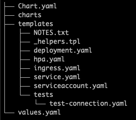

图 9.1–图表文件夹布局

让我们详细讨论一下前面的一些内容:

*   `Chart.yaml`:包含图表元数据信息的文件。
*   `charts`:存放子图表的文件夹。
*   `templates`:存放模板文件的文件夹。
*   `values.yaml`: A YAML-formatted file with configuration values used by the chart templates. These values can be resources, replica counts, or an image repository and tag, among other things.

    小费

    要更改值，建议使用`override-values.yaml`文件，在该文件中只需输入要更改的值。不建议更改图表附带的默认`values.yaml`文件，因为您可能会丢失该文件较新版本的更改记录。

既然我们已经学习了 Helm 图表结构的一些基础知识，让我们深入到图表模板化。

## 图表模板

Helm 最强的特性是图表模板化。Helm 模板语言基于 Go 语言包`text/template`语法。与模板语法一起使用的值可用于自定义 Kubernetes 资源清单。在安装图表之前，Helm 通过注入指定的值来呈现图表的模板，然后安装图表。

数值从图表附带的默认`values.yaml`文件或用户提供的文件中读取，例如名为`override-values.yaml`的文件。两个文件的值将被合并，然后应用于图表。

让我们看一下下面的图表模板示例:

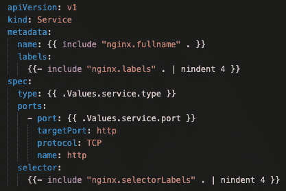

图 9.2–图表模板示例

Helm 模板是一个 Kubernetes 服务资源，上面的代码片段允许我们设置服务类型和端口。如果默认值不符合您的要求，您可以通过使用自定义`override-values.yaml`文件提供新的默认值来更改默认值。

其他值如`name`、`labels`、`selector`从`_helpers.tpl`文件注入，这是模板部分的默认位置:


图 9.3–助手的部分例子

前面的代码片段是`_helpers.tpl`文件的一部分，该文件定义了要注入到图表模板中的标签和选择器。

## 储存库

存储库是存储和共享打包图表的位置。它可以是任何能够提供文件的网络服务器。存储库中的图表以压缩的`.tgz`格式存储。

## 释放

发布是部署到 Kubernetes 集群的图表的特定实例。一个 Helm 图表可以使用同一个发布名称安装多次，每次都会创建一个新的发布版本。

特定发布的发布信息存储在与发布本身相同的命名空间中。

您可以使用相同的发行版名称但是不同的命名空间安装相同的 Helm 图表无数次。

现在我们已经学习了 Helm 的一些基础知识，让我们开始使用图表来安装应用程序。

# 使用 Helm 图表安装应用程序

有许多赫尔姆图表库，逐个设置它们太麻烦了。

相反，我们将使用作为我们的中央赫尔姆图表存储库 [https://chartcenter.io](https://chartcenter.io) ，它有 300 多个赫尔姆存储库，可以作为我们从一个位置安装所有图表的唯一真实来源。它还有一个很好的用户界面，你可以在这里搜索图表并获得关于它们的非常详细的信息:


图 9.4–图表中心用户界面

上一张截图显示了图表中心**界面**。

将 ChartCenter 设置为您的中央 Helm 存储库也非常容易，如下所示:

```
$ helm repo add center**https://repo.chartcenter.io**
"center" has been added to your repositories
$ helm repo update
Hang tight while we grab the latest from your chart repositories...
...Successfully got an update from the "center" chart repository
Update Complete. Happy Helming!
```

前面的命令添加了`center`图表存储库，并用其内容更新了 Helm 本地缓存。

现在我们可以尝试通过运行`$ helm search repo center/bitnami/postgresql -l | head -n 5`命令来搜索`postgresql`图表:

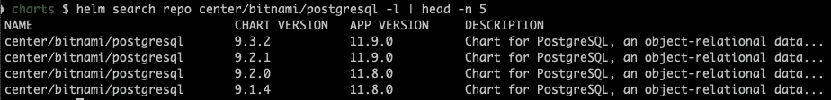

图 9.5–搜索 PostgreSQL 图表

在前面的截图中，我们可以看到我们获得了 Bitnami PostgreSQL 图表的最新五个版本。

在安装 PostgreSQL 图表之前，我们应该设置一个密码，因为设置自己的密码而不是使用 Helm 图表生成的密码是一个很好的做法。

通过阅读图表中位于 https://chartcenter.io/bitnami/postgresql T2 的 T0，我们可以找到我们需要使用的值名:

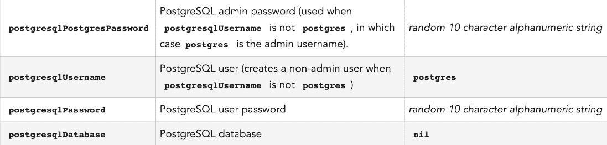

图 9.6–PostgreSQL 图表密码

前面的截图告诉我们需要`values.yaml`文件中的`postgresqlPassword`变量来设置 PostgreSQL 图表的密码。

首先，让我们创建一个`password-values.yaml`文件来存储 PostgreSQL 密码:

```
$ echo "postgresqlPassword: SomeVerySecurePassword" > password-values.yaml
```

让我们使用以下命令安装它:

```
$ helm upgrade –i postgresql center/bitnami/postgresql --version=9.2.1 -f password-values.yaml
```

下面的屏幕截图显示了前面命令的输出:

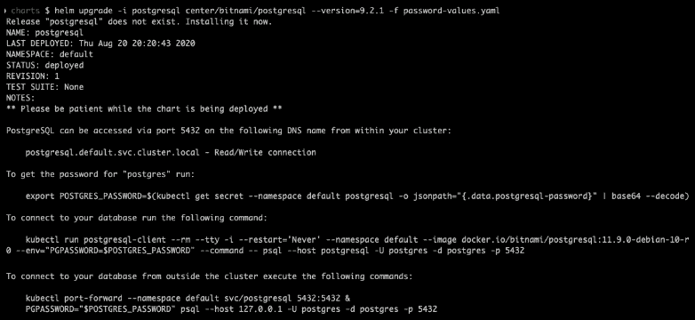

图 9.7–Helm 安装 PostgreSQL 图表

前面的命令将名为`postgresql`的 PostgreSQL 图表安装到了当前的命名空间中。

小费

前面的`helm upgrade`命令有一个`–i`标志(长名称为`--install`，它允许我们在第一次安装和之后的升级中使用相同的命令。

让我们使用以下命令检查图表安装了什么:

```
$ kubectl get all
```

下面的屏幕截图显示了前面命令的输出:

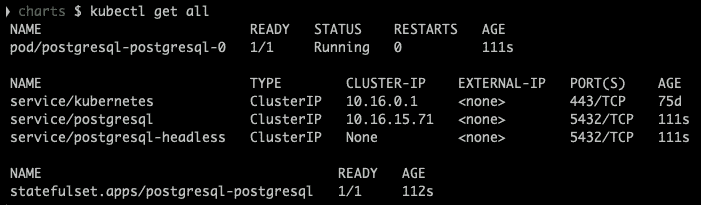

图 9.8–列出所有已安装的资源

在前面的截图中，我们可以看到`postgresql`吊舱，两个`postgresql-`相关服务，以及`statefulset`。查看`service/postgresql`，可以看到`postgresql`在`postgresql:5432`上可以被其他 Kubernetes 应用访问。

让我们通过运行以下命令来检查所有机密是否都已正确创建:

```
$ kubectl get secret
```

下面的屏幕截图显示了前面命令的输出:

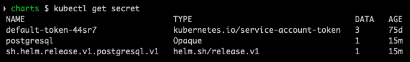

图 9.9–列出所有已安装的机密

在前面的截图中，我们看到了存储 PostgreSQL 密码的`postgresql`秘密和存储 Helm 发布信息的`sh.helm.release.v1.postgresql.v1`。

现在，让我们通过运行以下命令来检查当前命名空间中的 Helm 版本:

```
$ helm ls
```

下面的屏幕截图显示了前面命令的输出:

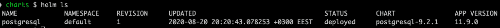

图 9.10–列出 Helm 版本

在前面的截图中，我们看到了`postgresql`的一个成功部署的 Helm 版本，其中我们有以下列表:

*   `STATUS`:显示释放状态为`deployed`
*   `CHART`:显示图表名称和版本为`postgresql-9.2.1`
*   `APP VERSION`:显示 PostgreSQL 版本；在这种情况下，`11.9.0`

这很容易安装——我们只需要提供密码，boom，我们有一个完整安装的 PostgreSQL 实例，它的密码甚至存储在秘密中。

# 升级头盔版本

在前一节中，我们安装了 PostgreSQL，所以现在让我们尝试升级它。我们需要知道如何做到这一点，因为它将不得不不时升级。

对于升级，我们将使用最新的 PostgreSQL 图表版本，即`9.3.2.`

让我们使用以下命令获取并运行升级:

```
$ helm upgrade –i postgresql center/bitnami/postgresql --version=9.3.2 -f password-values.yaml
```

下面的屏幕截图显示了前面命令的输出:


图 9.11–列出 Helm 版本

我们运行了前面的`helm upgrade`命令将`postgresql`图表版本更改为`9.3.2`，但是我们看到 PostgreSQL 版本仍然和原来一样，也就是`11.9.0`，所以这意味着图表本身收到了一些更改，但是应用程序版本保持不变。

运行`helm ls`显示`REVISION 2`，这意味着 PostgreSQL 图表的第二次发布。

让我们通过运行以下命令再次检查这些秘密:

```
$ kubectl get secrets
```

下面的屏幕截图显示了前面命令的输出:


图 9.12–列出 Helm 版本

从前面的截图中，我们可以看到一个新的秘密，`sh.helm.release.v1.postgresql.v2`，这是 PostgreSQL 升级版本的存储位置。

很高兴看到赫尔姆如何跟踪所有版本，并允许通过一个`helm upgrade`命令轻松升级应用程序。

注意

Helm 版本包含图表中的所有 Kubernetes 模板，这使得将它们作为一个单元跟踪(从版本的角度来看)变得容易得多。

让我们学习如何进行发布回滚。我们会这样做，因为发行版有时会变坏，需要回滚。

# 回滚到以前的 Helm 版本

在本节中，让我们看看如何使用`helm rollback`命令将回滚到以前的版本。

`helm rollback`命令是 Helm 独有的，它允许我们回滚整个应用程序，因此您不必担心具体需要回滚哪些 Kubernetes 资源。

当然，在处理现实应用程序的发布标识时，数据库模式也会发生变化，因此要回滚前端应用程序，您也必须回滚数据库模式的变化。这意味着事情并不总是像这里看起来的那样简单，但是使用 Helm 仍然简化了应用程序发布回滚过程的某些部分。

要运行`helm rollback`命令，我们首先需要知道我们想要回滚到的发布版本，可以通过以下命令找到:

```
$ helm history postgresql
```

下面的屏幕截图显示了前面命令的输出:


图 9.13–列出赫尔姆版本修订

在前面的`helm history postgresql`命令中，我们得到了一个版本修订列表。

所以，我们想把`postgresql`回滚到修订`1`:

```
$ helm rollback postgresql 1
```

下面的屏幕截图显示了前面命令的输出:


图 9.14–舵回退释放

在前面的截图中，我们看到回滚是用`helm rollback postgresql 1`命令完成的，现在我们看到了三个修订，因为即使在回滚时，也会创建一个新版本。

如您所见，回滚到以前的版本非常容易。

# 使用赫尔姆的模板命令

使用 Helm 的 helm `template`命令，您可以在完全渲染的 Kubernetes 资源模板中检查图表的输出。这是一个检查模板输出的非常方便的命令，尤其是当您正在开发一个新的图表、对图表进行更改、调试等等时。

因此，让我们通过运行以下命令来检查它:

```
$ helm template postgresql center/bitnami/postgresql --version=9.3.2 -f password-values.yaml
```

前面的命令将在屏幕上打印所有模板。当然，您也可以将其导出到文件中。

由于输出很长，我们不打算打印所有内容，而只打印库本内特清单的一部分:

```
---
# Source: postgresql/templates/secrets.yaml
apiVersion: v1
kind: Secret
metadata:
  name: postgresql
...
---
# Source: postgresql/templates/svc-headless.yaml
apiVersion: v1
kind: Service
metadata:
  name: postgresql-headless
...
---
# Source: postgresql/templates/svc.yaml
apiVersion: v1
kind: Service
metadata:
  name: postgresql
...
---
# Source: postgresql/templates/statefulset.yaml
apiVersion: apps/v1
kind: StatefulSet
metadata:
  name: postgresql-postgresql
...
```

前面的输出显示了`postgresql`图表中的所有资源。资源以`---`划分。

`helm template`是一个强大的命令，用于检查图表的模板并打印输出，以便您通读。`helm template`没有连接到 Kubernetes 集群，它只是用值填充模板并打印输出。

您可以通过在`helm upgrade`命令中添加`--dry-run --debug`标志来实现同样的目的。有了这个，Helm 将根据 Kubernetes 集群验证模板。

完整命令的示例如下所示:

```
$ helm template postgresql center/bitnami/postgresql --version=9.3.2 -f password-values.yaml --dry-run --debug
```

在安装或升级我们的 Helm 版本之前，我们已经学习了一些方便的 Helm 命令。

使用`helm template`的另一个强大用例是将模板渲染到一个文件中，然后进行比较。这对于比较图表版本或定制参数对最终输出的影响非常有用。

# 创建掌舵图

我们已经学会了许多用赫尔姆可以做的酷把戏！现在让我们学习如何创建一个赫尔姆图表。

`helm create`命令为您创建了一个示例图表，因此您可以将其用作基础，并使用所需的 Kubernetes 资源、值等对其进行更新。它创建了一个完全工作的`nginx`图表，所以我们要用这个名字来命名这个图表。

现在让我们检查一下通过运行以下命令创建图表有多容易:

```
$ helm create nginx
```

下面的屏幕截图显示了前面命令的输出:


图 9.15–舵创建命令

在前面的截图中，我们运行了`helm create nginx`命令，其中`nginx`是我们的图表名称。该名称还用于创建存储图表内容的新文件夹。使用`tree nginx`命令显示文件夹结构。

在截图中可以看到，`deployment.yaml`文件、**水平吊舱自动缩放器** ( **HPA** )、`ingress`、`service`、`serviceaccount`资源模板已经创建，所有的都提供了一个很好的起点。

前面的命令也创建了`test-connection.yaml`文件，所以我们可以用`helm test`对安装的`nginx`图表进行测试。

现在让我们通过运行以下命令来安装图表:

```
$ helm install nginx nginx
```

下面的屏幕截图显示了前面命令的输出:


图 9.16–安装 nginx 图表

在前面的截图中，我们运行了`helm install nginx nginx`。该命令使用以下基本语法:

```
helm install <RELEASE NAME> <CHART NAME>
```

这里，`<CHART NAME>`是本地文件夹，所以请注意，您可以从远程 Helm 存储库安装图表，也可以从本地文件夹安装图表，两者都使用相同的命令。

我们使用的下一个命令如下:

```
kubectl get all -l "app.kubernetes.io/name=nginx" 
```

该命令帮助我们在图表中显示默认情况下部署的资源。

正如我们已经提到的命令，让我们看看该命令是如何工作的:

```
$ helm test nginx
```

下面的屏幕截图显示了前面命令的输出:


图 9.17–测试 nginx 图表

前面的`helm test nginx`命令针对名为`nginx`的 Helm 版本运行测试。`kubectl get pods`命令的输出显示了用于运行图表测试然后被停止的`nginx-test-connection`吊舱。

接下来，我们来检查一下`test-connection.yaml`文件的内容:

```
$ cat nginx/templates/tests/test-connection.yaml
```

下面的屏幕截图显示了前面命令的输出:


图 9.18–测试连接. yaml 内容

在前面的截图中，您可以看到一个简单的 pod 模板，它针对`nginx`服务资源运行`curl`命令。

当实际的 Kubernetes 资源被创建时，这一行`args: ['{{ include "nginx.fullname" . }}:{{ .Values.service.port }}']`模板代码被转换为`nginx:80`。

简单易行，对吧？我们可以看到，`helm create`命令用示例资源模板，甚至用测试模板创建了一个工作图。

# 使用赫尔姆的林挺功能

到目前为止，我们已经学习了如何创建一个 Helm 图表。然而，我们也需要知道如何检查图表中的可能出现的问题和错误。为此，我们可以使用`helm lint <CHART NAME>`命令，该命令将通过运行一系列测试来检查 Helm 图表内容，以验证图表的完整性。

让我们`lint`我们已经创建的`nginx`图表:

```
$ helm lint nginx
```

下面的屏幕截图显示了前面命令的输出:

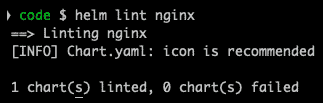

图 9.19–林挺 nginx 图表

正如你在前面截图中看到的，我们的图表没有问题，可以安全安装。`[INFO]`消息只是图表图标丢失的警告，可以放心忽略。

如果你想在[中托管你的图表，例如在](https://chartcenter.io)中，它会显示在它的用户界面中，那么真的建议你拥有它。

# 用插件扩展头盔

头盔也可以用插件扩展。插件对于扩展不属于赫尔姆命令行界面的赫尔姆功能很有用，因为赫尔姆可能没有您需要的一切。

目前还没有一个集中的 Helm 插件库，在那里你可以看到所有可用插件的列表，也没有一个 Helm 插件管理器。

由于大多数插件都存储在 GitHub 存储库中，建议使用 GitHub 主题`helm-plugin`来标记插件，您可以在那里轻松搜索可用的插件:

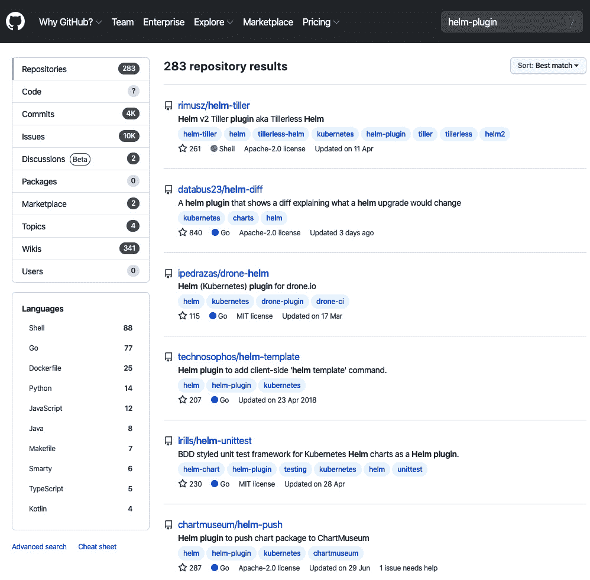

图 9.20–GitHub 上的 Helm 插件搜索

在之前的截图[中，https://github.com/search?q=helm-plugin](https://github.com/search?q=helm-plugin)被用来在 GitHub 中搜索 Helm 插件。

让我们看看安装一个 Helm 插件有多容易:

```
$ helm plugin list
```

下面的屏幕截图显示了前面命令的输出:

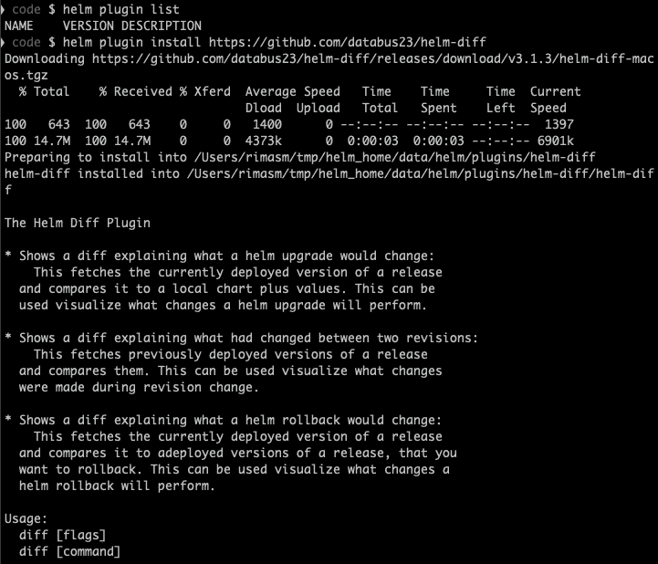

图 9.21–正在安装 Helm 插件 helm-diff

在前面的命令`helm plugin list`中，我们检查了安装的插件，然后我们使用`helm plugin`安装[https://github.com/databus23/helm-diff](https://github.com/databus23/helm-diff)来安装`helm-diff`插件。前面的插件安装输出被剪切，因为安装的插件打印了很多信息。

让我们检查插件列表:

```
$ helm plugin list
```

下面的屏幕截图显示了前面命令的输出:


图 9.22–赫尔姆插件列表

我们看到安装了`diff`插件，基本上是一个新的 Helm 命令:`helm diff`。

我们不会去检查`helm diff`是如何工作的，但是它是一个非常方便的版本，因为你可以检查安装的和新的图表版本之间的差异。

让我们再安装一个:

```
$ helm plugin install https://github.com/instrumenta/helm-kubeval
```

下面的屏幕截图显示了前面命令的输出:


图 9.23–helm 插件安装 helm-ku eval

前面的命令，`helm plugin install` 安装了`kubeval`插件，该插件根据库本内斯模式验证 Helm 图表。

让我们验证一下之前用`helm create`创建的`nginx`图表:

```
$ helm kubeval nginx
```

下面的屏幕截图显示了前面命令的输出:

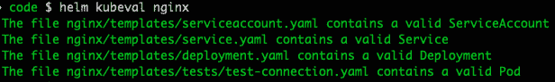

图 9.24–使用 kubeval 插件验证 nginx 图表

前面的`helm kubeval nginx`命令验证了`nginx`图表——正如我们所看到的，它是绿色的，所以没有问题。这个插件是对`helm lint`命令的一个很好的补充，两者的组合给你一个很好的工具来检查图表。

现在，我们知道如何用额外的功能扩展 Helm，因为一个工具不可能拥有一切。插件也很容易写，当然你可以在自己的时间里学习。

# 总结

在本章中，我们学习了如何使用 Helm 来安装、升级、回滚版本、检查图表模板的输出、创建图表、林挺图表以及使用插件扩展 Helm。

Helm 是一个强大的工具，您可以使用它来部署简单和复杂的 Kubernetes 应用程序。它将帮助您部署真实世界的应用程序，尤其是有这么多不同的图表可以从许多 Helm 存储库中使用。

在本书的最后一章，我们将为 Docker 用户学习`kubectl`最佳实践和`kubectl`命令。