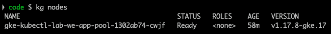
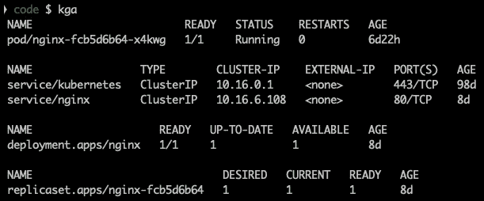
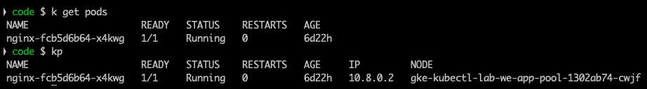
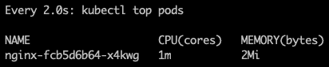
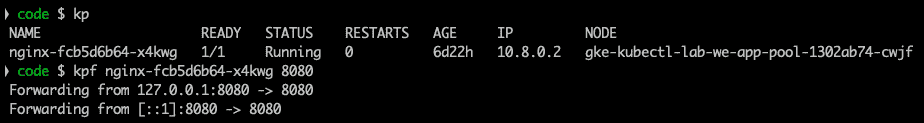
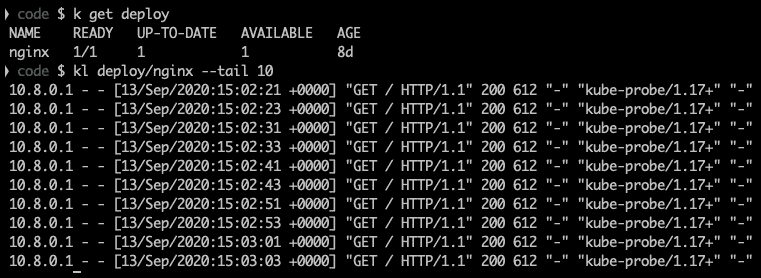

# 十、`kubectl`最佳实践和 Docker 命令

在前一章中，我们学习了 Helm，它是一个 Kubernetes 包管理器。在本书的最后一章，我们将学习一些最佳实践。

在本章中，我们将学习如何使用外壳别名来缩短`kubectl`命令，以及使用`kubectl`命令的其他便利技巧。

对于一些`kubectl`命令，我们还会在 Docker 中查看一些等价的命令，尤其是对于熟悉 Docker 命令并想了解`kubectl`中类似命令的 Kubernetes 新用户来说，那些比较容易知道的命令。

在本章中，我们将涵盖以下主要主题:

*   使用 kubectl 命令的外壳别名
*   kubectl 中类似的 Docker 命令

# 为 kubectl 命令使用外壳别名

每次用命令输入`kubectl`既无聊又耗时。您可以在`Bash`和`Zsh`外壳中使用`kubectl`命令完成，这当然有所帮助，但仍然不如使用别名快。

让我们概述一些方便的`kubectl`命令的列表，并根据您使用的 shell 将它们与别名一起使用，这些别名可以放在`zsh_aliases`或`bash_aliases`文件中:

*   `k`代表`kubectl`—这不言而喻。
*   `kg` for `kubectl get`—this is useful to get a list of pods, deployments, statefulsets, services, nodes, and other details, as shown in the following example command:

    ```
    $ kg nodes
    ```

    下面的屏幕截图显示了前面命令的输出:



图 10.1–千克节点输出

前面的截图通过运行`$ kg nodes`命令显示了集群中可用的 Kubernetes 节点列表。

*   `kd`对于`kubectl describe`—这对于描述Pod 、部署、状态集、服务、节点等非常有用。
*   `kga` for `kubectl get all`—this shows a list of pods, deployments, statefulsets, services, and resources in the currently set namespace. You can also provide the `-n` flag to specify the namespace or `-A` to show resources in all namespaces:

    ```
    $ kga
    ```

    下面的屏幕截图显示了前面命令的输出:



图 10.2–kga 输出

前面的截图显示了`kga`别名的输出，其中的资源在当前的名称空间中找到。

*   对于`kubectl really get all``krga`—这个显示了所有资源的列表，包括当前设置的名称空间中的机密、事件等等。您还可以提供`-n`标志来指定名称空间，或者提供`-A`来显示所有名称空间中的所有资源。
*   `kp` for `kubectl get pods -o wide`—this shows the list of pods in the current namespace. The `-o wide` flag shows a given pod's assigned IP and the node it has been scheduled to:

    ```
    $ k get pods
    $ kp
    ```

    下面的屏幕截图显示了前面命令的输出:



图 10.3–kgak 获取Pod 输出

前面的截图显示了`k get pods`和`kp`别名的输出。

*   `kap`代表`kubectl get pods -A -o wide`—这是与`kp`相似的别名，但是显示了所有名称空间中的 pods。
*   `ka`对于`kubectl apply -f`—您可以使用它来创建/更新部署:

    ```
    $ ka nginx.yaml
    ```

*   `kei` for `kubectl exec -it`—this executes into the running pod's shell:

    ```
    $ kei nginx-fcb5d6b64-x4kwg – bash
    ```

    下面的屏幕截图显示了前面命令的输出:


图 10.4–kei 输出

前面的截图显示了`kei nginx-fcb5d6b64-x4kwg bash – bash`的输出。

*   `ke` for `kubectl exec`—this executes a command in the running pod:

    ```
    $ ke nginx-fcb5d6b64-x4kwg -- ls -alh
    ```

    下面的屏幕截图显示了前面命令的输出:


图 10.5–ke 输出

上图截图为`ke nginx-fcb5d6b64-x4kwg bash – ls -alh`的输出。

*   `ktn` for `watch kubectl top nodes`—use this to watch a node's resource consumption:

    ```
    $ ktn
    ```

    下面的屏幕截图显示了前面命令的输出:


图 10.6–ktn 输出

前面的截图显示了`ktn`的输出，其中包含节点列表及其各自的资源使用情况。

*   `ktp` for `watch kubectl top pods`—use this to watch a pod's resources consumption:

    ```
    $ ktp
    ```

    下面的屏幕截图显示了前面命令的输出:



图 10.7–KTP 输出

前面的截图显示了`ktp`的输出，以及PODS列表及其资源使用情况。

*   `kpf` for `kubectl port-forward`—use this to do a port forward for the pod so we can access the pod from `localhost`:

    ```
    $ kpf nginx-fcb5d6b64-x4kwg 8080
    ```

    下面的屏幕截图显示了前面命令的输出:



图 10.8–KPF 输出

前面的截图显示了端口转发设置为端口`8080`的`kpf`的输出。

*   `kl` for `kubectl logs`—this shows the logs of a pod or deployment:

    ```
    $ kl deploy/nginx --tail 10
    ```

    下面的屏幕截图显示了前面命令的输出:



图 10.9–KL 输出

上面的截图显示了`kl`的输出以及`nginx`部署的日志。

此外，您可以将以下内容添加到您的列表中:

*   `d` : `docker`
*   `kz` : `kustomize`
*   `h` : `helm`

下面的代码块显示了`.zsh_aliases`的一个示例片段:

```
$ cat .zsh_aliases
# aliases
alias a="atom ."
alias c="code ."
alias d="docker"
alias h="helm"
alias k="kubectl"
alias ke="kubectl exec -it"
alias kc="kubectl create -f"
alias ka="kubectl apply -f"
alias kd="kubectl describe"
alias kl="kubectl logs"
alias kg="kubectl get"
alias kp="kubectl get pods -o wide"
alias kap="kubectl get pods --all-namespaces -o wide"
alias ktn="watch kubectl top nodes"
alias ktp="watch kubectl top pods"
alias ktc="watch kubectl top pods --containers"
alias kpf="kubectl port-forward"
alias kcx="kubectx"
alias kns="kubectl-ns"
```

使用别名将帮助您通过键入几个字母而不是几个单词来提高的工作效率。此外，并不是所有的命令都容易记住，所以使用别名也有助于克服这一点。

# kube CTL 中类似的 Docker 命令

以下是最有用的 Docker 命令列表，后面是它们在`kubectl`中的对应命令。

通过以下命令获取信息:

*   `docker info`
*   `kubectl cluster-info`

获取版本信息是通过以下命令完成的:

*   `docker version`
*   `kubectl version`

使用以下命令运行容器并公开其端口:

*   `docker run -d --restart=always --name nginx -p 80:80 nginx`
*   `kubectl create deployment --image=nginx nginx`
*   `kubectl expose deployment nginx --port=80 --name=nginx`

获取容器日志是通过以下命令完成的:

*   `docker logs --f <container name>`
*   `kubectl logs --f <pod name>`

执行到运行容器/容器外壳中是通过以下命令完成的:

*   `docker exec –it <container name> /bin/bash`
*   `kubectl exec –it <pod name>`

使用以下命令可以获得容器/容器列表:

*   `docker ps –a`
*   `kubectl get pods`

使用以下命令停止和移除容器/容器:

*   `docker stop <container name> && docker rm <container name>`
*   `kubectl delete deployment <deployment name>`
*   `kubectl delete pod <pod name>`

我们现在已经学习了对 Docker 用户最有用的`kubectl`命令，这应该会加快你与`kubectl`的学习曲线，并将成为你日常工作中有用的命令。

# 总结

在这最后一章中，我们通过研究如何使用别名来运行各种带有`kubectl`的命令，学习了一些`kubectl`最佳实践，然后在`kubectl`中看到了一些 Docker 命令的等价物。

使用别名缩短了键入所需的时间，当然，别名比一些长命令更容易记住。

纵观这本书，我们学到了很多有用的信息，比如如何安装`kubectl`；获取关于集群和节点的信息；安装、更新和调试应用；使用`kubectl`插件；还了解到了Kustomize和Helm。

希望这本书能帮助你掌握Kubernetes，一个 d Helm。