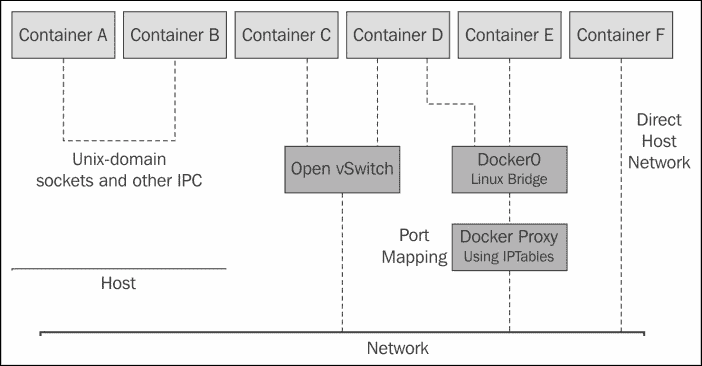
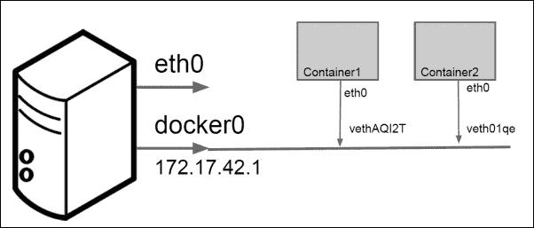
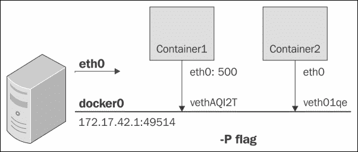
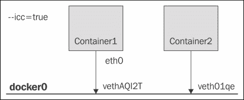
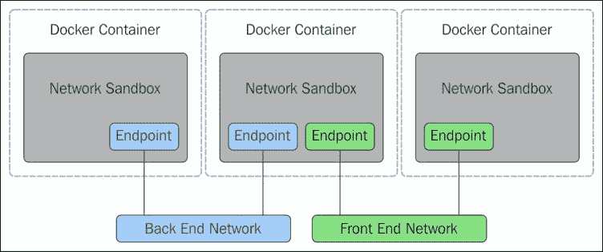

# 一、Docker网络入门

**Docker** 是一种轻量级容器技术，近年来引起了极大的兴趣。它巧妙地将各种 Linux 内核特性和服务(如名称空间、cgroups、SELinux 和 AppArmor 配置文件)捆绑在 AUFS 和 BTRFS 等联合文件系统上，以制作模块化映像。这些映像为应用提供了一个高度可配置的虚拟化环境，并遵循一次写入，在任何地方运行的工作流程。一个应用可以由运行在 Dcker 容器中的单个进程组成，也可以由运行在它们自己的容器中的多个进程组成，并且随着负载的增加而被复制。因此，需要强大的网络元素来支持各种复杂的用例。

在本章中，您将了解 Docker 网络的基本组件，以及如何构建和运行简单的容器示例。

本章涵盖以下主题:

*   网络和Docker
*   `docker0`桥联网
*   坞站卵形网络
*   Unix 域网络
*   链接 Docker 容器
*   Docker 网络有什么新功能

Docker 凭借其对性能的精通和通用的可复制性架构，在行业中获得了很大的吸引力，同时提供了现代应用开发的以下四个基石:

*   自治
*   分散
*   平行
*   隔离

此外，大规模采用 Thoughtworks 的微服务架构，即 **LOSA** ( **大量小应用**)正在进一步为 Docker 技术带来潜力。因此，谷歌、VMware 和微软等大公司已经将 Docker 移植到他们的基础设施中，无数 Docker 初创公司的推出也延续了这一势头，即 Tutum、Flocker、Giantswarm 等。

由于 Docker 容器可以在任何地方复制它们的行为，无论是您的开发机器、裸机服务器、虚拟机还是数据中心，应用设计人员可以将注意力集中在开发上，而操作语义则留给 DevOps。这使得团队工作流模块化、高效且高效。Docker 不应与 **虚拟机** ( **VM** )混淆，尽管它们都是虚拟化技术。虽然 Docker 共享一个操作系统，为运行在容器中的应用提供足够的隔离和安全级别，但它后来完全抽象出了操作系统，并提供了强大的隔离和安全保证。然而，与虚拟机相比，Docker 的资源占用非常少，因此在经济性和性能方面更受青睐。但是，它仍然不能完全替代虚拟机，因此是虚拟机技术的补充。下图显示了虚拟机和 Docker 的体系结构:


# 网络和Docker

每个 Docker 容器都有自己的网络栈，这是由于 Linux 内核的 NET 命名空间，每个容器都有一个新的 NET 命名空间被实例化，不能从容器外部或其他容器看到。

Docker 网络由以下网络组件和服务提供支持。

## Linux 桥

这些是内置在内核中的L2/媒体访问控制学习交换机，用于转发。

## 打开虚拟开关

这个是一个可编程的支持隧道的高级桥。

## 夜

网络地址转换器是直接转换 IP 地址和端口(SNAT、DNAT 等)的实体。

## 可采性

这个是内核中的一个策略引擎，用于管理数据包转发、防火墙和 NAT 功能。

## 表面化/SELinux

每个应用的防火墙策略可以用这些来定义。

各种网络组件可以用来与 Docker 一起工作，提供了访问和使用基于 Docker 的服务的新方式。因此，我们看到许多图书馆采用不同的网络方式。其中比较突出的有 Docker Compose、Weave、Kubernetes、pipeline、libnetwork 等等。下图描述了 Docker 网络的基本思想:



# Docker桥

`docker0`桥是默认联网的心脏。当 Docker 服务启动时，会在主机上创建一个 Linux 桥。容器上的接口与桥对话，桥代理外部世界。同一台主机上的多个容器可以通过 Linux 桥相互通信。

`docker0`可以通过`--net`标志进行配置，通常有四种模式:

*   `--net default`
*   `--net=none`
*   `--net=container:$container2`
*   `--net=host`

## 净默认模式

在这种模式下，默认桥被用作容器相互连接的桥。

## 净=无模式

在这种模式下，创建的容器是真正隔离的，不能连接到网络。

## 网络=容器:$容器 2 模式

使用这个标志，创建的容器与名为`$container2`的容器共享其网络命名空间。

## 网络=主机模式

在这种模式下，创建的容器与主机共享其网络命名空间。

### Docker 容器中的端口映射

在本节中，我们看一下容器端口如何映射到主机端口。该映射可以由 Docker 引擎隐式完成，也可以指定。

如果我们创建两个名为**容器 1** 和**容器 2** 的容器，这两个容器都从私有 IP 地址空间分配了一个 IP 地址，并且还连接到了**Docker 0** 桥，如下图所示:



前面的两个容器将能够相互 ping 通，并到达外部世界。

对于外部访问，它们的端口将映射到主机端口。

正如上一节提到的，容器使用网络名称空间。创建第一个容器时，会为该容器创建一个新的网络命名空间。在容器和 Linux 桥之间创建了一个 vEthernet 链接。从容器的`eth0`发送的流量通过 vEthernet 接口到达网桥，然后被交换。下面的代码可以用来显示 Linux 桥的列表:

```
# show linux bridges
$ sudo brctl show

```

输出将类似于如下所示，带有一个桥名和它所映射到的容器上的`veth`接口:

```
bridge name      bridge id        STP enabled    interfaces
docker0      8000.56847afe9799        no         veth44cb727
 veth98c3700

```

容器如何连接外部世界？主机上的`iptables nat`表用于伪装所有外部连接，如下图所示:

```
$ sudo iptables -t nat -L –n
...
Chain POSTROUTING (policy ACCEPT) target prot opt
source destination MASQUERADE all -- 172.17.0.0/16
!172.17.0.0/16
...

```

如何从外界到达容器？使用主机上的`iptables nat`选项再次完成端口映射。



# 孵蛋器

open vsswitch是一个强大的网络抽象。下图显示了 OVS 如何与 **虚拟机**、**虚拟机管理程序**和**物理交换机**交互。每个**虚拟机**都有一个与之关联的 **vNIC** 。每个 **vNIC** 通过 **VIF** (也称为**虚拟接口**)与 **虚拟交换机**相连:


OVS 使用隧道机制(如 GRE、VXLAN 或 STT)来创建虚拟覆盖，而不是使用物理网络拓扑和以太网组件。下图显示了如何为容器配置 OVS，以便使用 GRE 隧道在多台主机之间进行通信:


# Unix 域套接字

在单个主机内，UNIX IPC 机制，尤其是 UNIX 域套接字或管道，也可以用于容器之间的通信:

```
$  docker run  --name c1 –v /var/run/foo:/var/run/foo –d –I –t base /bin/bash 
$  docker run  --name c2 –v /var/run/foo:/var/run/foo –d –I –t base /bin/bash

```

`c1`和`c2`上的应用可以通过以下 Unix 套接字地址进行通信:

```
struct  sockaddr_un address;
address.sun_family = AF_UNIX;
snprintf(address.sun_path, UNIX_PATH_MAX, "/var/run/foo/bar" );

```

<colgroup class="calibre15"><col class="calibre16"> <col class="calibre16"></colgroup> 
| 

C1:服务器

 | 

C2:客户中心

 |
| --- | --- |
| 

```
bind(socket_fd, (struct sockaddr *) &address, sizeof(struct sockaddr_un));
listen(socket_fd, 5);
while((connection_fd = accept(socket_fd, (struct sockaddr *) &address, &address_length)) > -1)
nbytes = read(connection_fd, buffer, 256);
```

 | 

```
connect(socket_fd, (struct sockaddr *) &address, sizeof(struct sockaddr_un));
write(socket_fd, buffer, nbytes);
```

 |

# 链接Docker容器

在这个部分，我们介绍了链接两个容器的概念。Docker 在容器之间创建了一个隧道，不需要在容器外部暴露任何端口。它使用环境变量作为将信息从父容器传递到子容器的机制之一。

除了环境变量`env`，Docker 还将源容器的主机条目添加到`/etc/hosts`文件中。以下是主机文件的示例:

```
$ docker run -t -i --name c2 --rm --link c1:c1alias training/webapp /bin/bash
root@<container_id>:/opt/webapp# cat /etc/hosts
172.17.0.1  aed84ee21bde
...
172.17.0.2  c1alaias 6e5cdeb2d300 c1

```

有两个条目:

*   第一个是容器`c2`的条目，它使用 Docker 容器 ID 作为主机名
*   第二个条目`172.17.0.2 c1alaias 6e5cdeb2d300 c1`使用`link`别名引用`c1`容器的 IP 地址

下图显示了两个容器**容器 1** 和**容器 2** 使用 veth 对连接到带有`--icc=true`的`docker0`桥。这意味着这两个容器可以通过桥相互访问:



## 链接

链接为 Docker 提供服务发现。它们允许容器通过使用标志`-link name:alias`发现并安全地相互通信。通过守护标志`-icc=false`，可以禁用容器间通信。此标志设置为`false`，**容器 1** 不能访问**容器 2** ，除非通过链接明确允许。这是保护容器的一个巨大优势。当两个容器链接在一起时，Docker 会在它们之间创建父子关系，如下图所示:


从外面看，是这样的:

```
# start the database
$  sudo docker run -dp 3306:3306 --name todomvcdb \
-v /data/mysql:/var/lib/mysql cpswan/todomvc.mysql 

# start the app server
$  sudo docker run -dp 4567:4567 --name todomvcapp \ 
--link todomvcdb:db cpswan/todomvc.sinatra 

```

从内部看，它是这样的:

```
$  dburl = ''mysql://root:pa55Word@'' + \ ENV[''DB_PORT_3306_TCP_ADDR''] + ''/todomvc''
$  DataMapper.setup(:default, dburl)

```

# Docker 网络有什么新功能？

Docker 联网处于非常初级的阶段，开发者社区有许多有趣的贡献，例如 Pipework、Weave、Clocker 和 Kubernetes。每一个都反映了 Docker 网络的不同方面。我们将在后面的章节中了解它们。Docker，Inc .还建立了一个新的项目，将网络标准化。它叫 **libnetwork** 。

libnetwork 实现了 **容器网络模型** ( **CNM** )，该模型形式化了为容器提供联网所需的步骤，同时提供了一个可用于支持多个网络驱动程序的抽象。CNM 是建立在三个主要组件上的——沙箱、端点和网络。

## 沙盒

沙箱包含容器网络栈的配置。这包括管理容器的接口、路由表和域名系统设置。沙盒的实现可以是 Linux 网络命名空间、FreeBSD 监狱或其他类似的概念。沙箱可能包含来自多个网络的许多端点。

## 终点

端点将沙箱连接到网络。端点的实现可以是 veth 对、开放式虚拟交换机内部端口或类似的东西。一个端点只能属于一个网络，但可能只属于一个沙盒。

## 网络

网络是一组能够直接相互通信的端点。网络的实现可以是 Linux 桥、VLAN 等等。网络由许多端点组成，如下图所示:



# Docker CNM 模型

CNM 在网络和容器之间提供以下合同:

*   同一网络上的所有容器可以自由地相互通信
*   多个网络是在容器之间划分流量的方式，应该得到所有驱动程序的支持
*   每个容器有多个端点是将一个容器连接到多个网络的方式
*   端点被添加到网络沙箱中，为其提供网络连接

我们将在[第 6 章](6.html#190861-2d417e3c905d4b6c9e03acfd1355cc86 "Chapter 6. Next Generation Networking Stack for Docker: libnetwork")、*Docker:libnetwork*的下一代网络栈中讨论如何实现 CNM 的细节。

# 总结

在这一章中，我们了解了 Docker 网络的基本组件，这些组件是从耦合简单的 Docker 抽象和强大的网络组件(如 Linux 桥和 Open vSwitch)发展而来的。

我们学习了如何用各种模式创建 Docker 容器。在默认模式下，端口映射通过使用 iptables NAT 规则提供帮助，允许到达主机的流量到达容器。在本章的后面，我们介绍了容器的基本链接。我们还谈到了下一代 Docker 网络，称为 libnetwork。