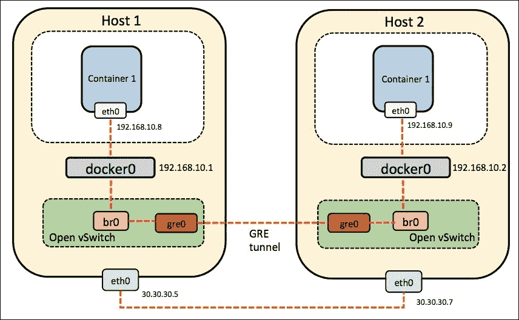

# 第三章。建立你的第一个码头工人网络

本章描述了 Docker 网络的实际示例，跨越多个主机上的多个容器。我们将涵盖以下主题:

*   管道工程简介
*   多个主机上的多个容器
*   迈向网络扩展——引入开放式虚拟交换机
*   与覆盖网络联网–法兰绒
*   Docker 网络选项的比较

# 管道工程简介

管道让你在任意复杂的场景中把容器连接在一起。

实际上，它创建了一个遗留的 Linux 桥，向容器添加了一个新的接口，然后将该接口附加到该桥上；容器获得了一个彼此通信的网段。

# 单个主机上的多个容器

管道工程是一个外壳脚本，安装很简单:

```
#sudo wget -O /usr/local/bin/pipework https://raw.githubusercontent.com/jpetazzo/pipework/master/pipework && sudo chmod +x /usr/local/bin/pipework

```

下图显示了使用管道系统的集装箱通信:


首先，创建两个容器:

```
#docker run -i -t --name c1 ubuntu:latest /bin/bash
root@5afb44195a69:/# ifconfig
eth0      Link encap:Ethernet  HWaddr 02:42:ac:11:00:10
 inet addr:172.17.0.16  Bcast:0.0.0.0  Mask:255.255.0.0
 inet6 addr: fe80::42:acff:fe11:10/64 Scope:Link
 UP BROADCAST RUNNING MULTICAST  MTU:1500  Metric:1
 RX packets:13 errors:0 dropped:0 overruns:0 frame:0
 TX packets:9 errors:0 dropped:0 overruns:0 carrier:0
 collisions:0 txqueuelen:0
 RX bytes:1038 (1.0 KB)  TX bytes:738 (738.0 B)
lo        Link encap:Local Loopback
 inet addr:127.0.0.1  Mask:255.0.0.0
 inet6 addr: ::1/128 Scope:Host
 UP LOOPBACK RUNNING  MTU:65536  Metric:1
 RX packets:0 errors:0 dropped:0 overruns:0 frame:0
 TX packets:0 errors:0 dropped:0 overruns:0 carrier:0
 collisions:0 txqueuelen:0
 RX bytes:0 (0.0 B)  TX bytes:0 (0.0 B)

#docker run -i -t --name c2 ubuntu:latest /bin/bash
root@c94d53a76a9b:/# ifconfig
eth0      Link encap:Ethernet  HWaddr 02:42:ac:11:00:11
 inet addr:172.17.0.17  Bcast:0.0.0.0  Mask:255.255.0.0
 inet6 addr: fe80::42:acff:fe11:11/64 Scope:Link
 UP BROADCAST RUNNING MULTICAST  MTU:1500  Metric:1
 RX packets:8 errors:0 dropped:0 overruns:0 frame:0
 TX packets:9 errors:0 dropped:0 overruns:0 carrier:0
 collisions:0 txqueuelen:0
 RX bytes:648 (648.0 B)  TX bytes:738 (738.0 B)
lo        Link encap:Local Loopback
 inet addr:127.0.0.1  Mask:255.0.0.0
 inet6 addr: ::1/128 Scope:Host
 UP LOOPBACK RUNNING  MTU:65536  Metric:1
 RX packets:0 errors:0 dropped:0 overruns:0 frame:0
 TX packets:0 errors:0 dropped:0 overruns:0 carrier:0
 collisions:0 txqueuelen:0
 RX bytes:0 (0.0 B)  TX bytes:0 (0.0 B)

```

现在让我们用管道连接它们:

```
#sudo pipework brpipe c1 192.168.1.1/24

```

该命令在主机上创建一个桥`brpipe`。它用 IP 地址`192.168.1.1`向容器`c1`添加一个`eth1`接口，并将该接口连接到网桥，如下所示:

```
root@5afb44195a69:/# ifconfig
eth0      Link encap:Ethernet  HWaddr 02:42:ac:11:00:10
 inet addr:172.17.0.16  Bcast:0.0.0.0  Mask:255.255.0.0
 inet6 addr: fe80::42:acff:fe11:10/64 Scope:Link
 UP BROADCAST RUNNING MULTICAST  MTU:1500  Metric:1
 RX packets:13 errors:0 dropped:0 overruns:0 frame:0
 TX packets:9 errors:0 dropped:0 overruns:0 carrier:0
 collisions:0 txqueuelen:0
 RX bytes:1038 (1.0 KB)  TX bytes:738 (738.0 B)
eth1      Link encap:Ethernet  HWaddr ce:72:c5:12:4a:1a
 inet addr:192.168.1.1  Bcast:0.0.0.0  Mask:255.255.255.0
 inet6 addr: fe80::cc72:c5ff:fe12:4a1a/64 Scope:Link
 UP BROADCAST RUNNING MULTICAST  MTU:1500  Metric:1
 RX packets:23 errors:0 dropped:0 overruns:0 frame:0
 TX packets:9 errors:0 dropped:0 overruns:0 carrier:0
 collisions:0 txqueuelen:1000
 RX bytes:1806 (1.8 KB)  TX bytes:690 (690.0 B)
lo        Link encap:Local Loopback
 inet addr:127.0.0.1  Mask:255.0.0.0
 inet6 addr: ::1/128 Scope:Host
 UP LOOPBACK RUNNING  MTU:65536  Metric:1
 RX packets:0 errors:0 dropped:0 overruns:0 frame:0
 TX packets:0 errors:0 dropped:0 overruns:0 carrier:0
 collisions:0 txqueuelen:0
 RX bytes:0 (0.0 B)  TX bytes:0 (0.0 B)
#sudo pipework brpipe c2 192.168.1.2/24

```

该命令不会创建桥`brpipe`，因为它已经存在。它将为容器`c2`添加一个`eth1`接口，并将其连接到网桥，如下所示:

```
root@c94d53a76a9b:/# ifconfig
eth0      Link encap:Ethernet  HWaddr 02:42:ac:11:00:11
 inet addr:172.17.0.17  Bcast:0.0.0.0  Mask:255.255.0.0
 inet6 addr: fe80::42:acff:fe11:11/64 Scope:Link
 UP BROADCAST RUNNING MULTICAST  MTU:1500  Metric:1
 RX packets:8 errors:0 dropped:0 overruns:0 frame:0
 TX packets:9 errors:0 dropped:0 overruns:0 carrier:0
 collisions:0 txqueuelen:0
 RX bytes:648 (648.0 B)  TX bytes:738 (738.0 B)
eth1      Link encap:Ethernet  HWaddr 36:86:fb:9e:88:ba
 inet addr:192.168.1.2  Bcast:0.0.0.0  Mask:255.255.255.0
 inet6 addr: fe80::3486:fbff:fe9e:88ba/64 Scope:Link
 UP BROADCAST RUNNING MULTICAST  MTU:1500  Metric:1
 RX packets:8 errors:0 dropped:0 overruns:0 frame:0
 TX packets:9 errors:0 dropped:0 overruns:0 carrier:0
 collisions:0 txqueuelen:1000
 RX bytes:648 (648.0 B)  TX bytes:690 (690.0 B)
lo        Link encap:Local Loopback
 inet addr:127.0.0.1  Mask:255.0.0.0
 inet6 addr: ::1/128 Scope:Host
 UP LOOPBACK RUNNING  MTU:65536  Metric:1
 RX packets:0 errors:0 dropped:0 overruns:0 frame:0
 TX packets:0 errors:0 dropped:0 overruns:0 carrier:0
 collisions:0 txqueuelen:0
 RX bytes:0 (0.0 B)  TX bytes:0 (0.0 B)

```

现在，容器已连接，并且能够相互 ping 通，因为它们位于同一子网`192.168.1.0/24`。管道工程提供了向容器添加静态 IP 地址的优势。

## 编织你的容器

Weave 创建了一个虚拟网络，可以跨多个主机连接 Docker 容器，就像它们都连接到一个交换机一样。Weave 路由器本身作为 Docker 容器运行，可以加密路由的流量，以便在互联网上传输。由应用程序容器在 Weave 网络上提供的服务可以被外部世界访问，不管那些容器在哪里运行。

使用以下代码安装编织:

```
#sudo curl -L git.io/weave -o /usr/local/bin/weave
#sudo chmod a+x /usr/local/bin/weave
```

下图显示了使用 Weave 的多主机通信:


在`$HOST1`上，我们运行以下内容:

```
# weave launch
# eval $(weave proxy-env)
# docker run --name c1 -ti ubuntu

```

接下来，我们在`$HOST2`上重复类似的步骤:

```
# weave launch $HOST1
# eval $(weave proxy-env)
# docker run --name c2 -ti ubuntu

```

在`$HOST1`上启动的容器中，产生以下输出:

```
root@c1:/# ifconfig
eth0      Link encap:Ethernet  HWaddr 02:42:ac:11:00:21
 inet addr:172.17.0.33  Bcast:0.0.0.0  Mask:255.255.0.0
 inet6 addr: fe80::42:acff:fe11:21/64 Scope:Link
 UP BROADCAST RUNNING MULTICAST  MTU:1500  Metric:1
 RX packets:38 errors:0 dropped:0 overruns:0 frame:0
 TX packets:34 errors:0 dropped:0 overruns:0 carrier:0
 collisions:0 txqueuelen:0
 RX bytes:3166 (3.1 KB)  TX bytes:2299 (2.2 KB)
ethwe     Link encap:Ethernet  HWaddr aa:99:8a:d5:4d:d4
 inet addr:10.128.0.3  Bcast:0.0.0.0  Mask:255.192.0.0
 inet6 addr: fe80::a899:8aff:fed5:4dd4/64 Scope:Link
 UP BROADCAST RUNNING MULTICAST  MTU:65535  Metric:1
 RX packets:130 errors:0 dropped:0 overruns:0 frame:0
 TX packets:74 errors:0 dropped:0 overruns:0 carrier:0
 collisions:0 txqueuelen:1000
 RX bytes:11028 (11.0 KB)  TX bytes:6108 (6.1 KB)
lo        Link encap:Local Loopback
 inet addr:127.0.0.1  Mask:255.0.0.0
 inet6 addr: ::1/128 Scope:Host
 UP LOOPBACK RUNNING  MTU:65536  Metric:1
 RX packets:0 errors:0 dropped:0 overruns:0 frame:0
 TX packets:0 errors:0 dropped:0 overruns:0 carrier:0
 collisions:0 txqueuelen:0
 RX bytes:0 (0.0 B)  TX bytes:0 (0.0 B)

```

您可以使用`ifconfig`命令看到编织网络界面`ethwe`:

```
root@c2:/# ifconfig
eth0      Link encap:Ethernet  HWaddr 02:42:ac:11:00:04
 inet addr:172.17.0.4  Bcast:0.0.0.0  Mask:255.255.0.0
 inet6 addr: fe80::42:acff:fe11:4/64 Scope:Link
 UP BROADCAST RUNNING MULTICAST  MTU:1500  Metric:1
 RX packets:28 errors:0 dropped:0 overruns:0 frame:0
 TX packets:29 errors:0 dropped:0 overruns:0 carrier:0
 collisions:0 txqueuelen:0
 RX bytes:2412 (2.4 KB)  TX bytes:2016 (2.0 KB)
ethwe     Link encap:Ethernet  HWaddr 8e:7c:17:0d:0e:03
 inet addr:10.160.0.1  Bcast:0.0.0.0  Mask:255.192.0.0
 inet6 addr: fe80::8c7c:17ff:fe0d:e03/64 Scope:Link
 UP BROADCAST RUNNING MULTICAST  MTU:65535  Metric:1
 RX packets:139 errors:0 dropped:0 overruns:0 frame:0
 TX packets:74 errors:0 dropped:0 overruns:0 carrier:0
 collisions:0 txqueuelen:1000
 RX bytes:11718 (11.7 KB)  TX bytes:6108 (6.1 KB)
lo        Link encap:Local Loopback
 inet addr:127.0.0.1  Mask:255.0.0.0
 inet6 addr: ::1/128 Scope:Host
 UP LOOPBACK RUNNING  MTU:65536  Metric:1
 RX packets:0 errors:0 dropped:0 overruns:0 frame:0
 TX packets:0 errors:0 dropped:0 overruns:0 carrier:0
 collisions:0 txqueuelen:0
 RX bytes:0 (0.0 B)  TX bytes:0 (0.0 B)

#root@c1:/# ping -c 1 -q c2
PING c2.weave.local (10.160.0.1) 56(84) bytes of data.
--- c2.weave.local ping statistics ---
1 packets transmitted, 1 received, 0% packet loss, time 0ms
rtt min/avg/max/mdev = 1.317/1.317/1.317/0.000 ms

```

同样，在`$HOST2`启动的容器中，会生成以下输出:

```
#root@c2:/# ping -c 1 -q c1
PING c1.weave.local (10.128.0.3) 56(84) bytes of data.
--- c1.weave.local ping statistics ---
1 packets transmitted, 1 received, 0% packet loss, time 0ms
rtt min/avg/max/mdev = 1.658/1.658/1.658/0.000 ms

```

于是我们有了它——位于不同主机上的两个容器愉快地相互交谈。

# 打开虚拟开关

Docker 默认使用 Linux 桥`docker0`。然而，在某些情况下，可能需要**Open vsswitch**(**OVS**)来代替 Linux 桥。一个 Linux 桥只能处理 1024 个端口——这限制了 Docker 的可扩展性，因为我们只能创建 1024 个容器，每个容器都有一个网络接口。

## 单主机 OVS

我们现在将在单个主机上安装 OVS，创建两个容器，并将它们连接到 OVS 桥。

使用此命令安装 OVS:

```
# sudo apt-get install openvswitch-switch

```

使用以下工具安装`ovs-docker`实用程序:

```
# cd /usr/bin
# wget https://raw.githubusercontent.com/openvswitch/ovs/master/utilities/ovs-docker
# chmod a+rwx ovs-docker

```

下图显示了单主机 OVS:


### 建造 OVS 大桥

在这里，我们将添加一个新的 OVS 桥并配置，这样我们就可以将容器连接到不同的网络上，如下所示:

```
# ovs-vsctl add-br ovs-br1
# ifconfig ovs-br1 173.16.1.1 netmask 255.255.255.0 up

```

使用以下步骤将端口从 OVS 桥添加到 Docker 容器:

1.  创建两个 Ubuntu Docker 容器:

    ```
    # docker run -I -t --name container1 ubuntu /bin/bash
    # docekr run -I -t --name container2 ubuntu /bin/bash

    ```

2.  将集装箱连接到 OVS 大桥:

    ```
    # ovs-docker add-port ovs-br1 eth1 container1 --ipaddress=173.16.1.2/24
    # ovs-docker add-port ovs-br1 eth1 container2 --ipaddress=173.16.1.3/24

    ```

3.  Test the connection between the two containers connected via an OVS bridge using the `ping` command. First, find out their IP addresses:

    ```
    # docker exec container1 ifconfig
    eth0      Link encap:Ethernet  HWaddr 02:42:ac:10:11:02
     inet addr:172.16.17.2  Bcast:0.0.0.0  Mask:255.255.255.0
     inet6 addr: fe80::42:acff:fe10:1102/64 Scope:Link
     UP BROADCAST RUNNING MULTICAST  MTU:1472  Metric:1
     RX packets:36 errors:0 dropped:0 overruns:0 frame:0
     TX packets:8 errors:0 dropped:0 overruns:0 carrier:0
     collisions:0 txqueuelen:0
     RX bytes:4956 (4.9 KB)  TX bytes:648 (648.0 B)

    lo        Link encap:Local Loopback
     inet addr:127.0.0.1  Mask:255.0.0.0
     inet6 addr: ::1/128 Scope:Host
     UP LOOPBACK RUNNING  MTU:65536  Metric:1
     RX packets:0 errors:0 dropped:0 overruns:0 frame:0
     TX packets:0 errors:0 dropped:0 overruns:0 carrier:0
     collisions:0 txqueuelen:0
     RX bytes:0 (0.0 B)  TX bytes:0 (0.0 B)

    # docker exec container2 ifconfig
    eth0      Link encap:Ethernet  HWaddr 02:42:ac:10:11:03
     inet addr:172.16.17.3  Bcast:0.0.0.0  Mask:255.255.255.0
     inet6 addr: fe80::42:acff:fe10:1103/64 Scope:Link
     UP BROADCAST RUNNING MULTICAST  MTU:1472  Metric:1
     RX packets:27 errors:0 dropped:0 overruns:0 frame:0
     TX packets:8 errors:0 dropped:0 overruns:0 carrier:0
     collisions:0 txqueuelen:0
     RX bytes:4201 (4.2 KB)  TX bytes:648 (648.0 B)

    lo        Link encap:Local Loopback
     inet addr:127.0.0.1  Mask:255.0.0.0
     inet6 addr: ::1/128 Scope:Host
     UP LOOPBACK RUNNING  MTU:65536  Metric:1
     RX packets:0 errors:0 dropped:0 overruns:0 frame:0
     TX packets:0 errors:0 dropped:0 overruns:0 carrier:0
     collisions:0 txqueuelen:0
     RX bytes:0 (0.0 B)  TX bytes:0 (0.0 B)

    ```

    现在知道了`container1`和`container2`的 IP 地址，我们可以 ping 通它们:

    ```
    # docker exec container2 ping 172.16.17.2
    PING 172.16.17.2 (172.16.17.2) 56(84) bytes of data.
    64 bytes from 172.16.17.2: icmp_seq=1 ttl=64 time=0.257 ms
    64 bytes from 172.16.17.2: icmp_seq=2 ttl=64 time=0.048 ms
    64 bytes from 172.16.17.2: icmp_seq=3 ttl=64 time=0.052 ms

    # docker exec container1 ping 172.16.17.2
    PING 172.16.17.2 (172.16.17.2) 56(84) bytes of data.
    64 bytes from 172.16.17.2: icmp_seq=1 ttl=64 time=0.060 ms
    64 bytes from 172.16.17.2: icmp_seq=2 ttl=64 time=0.035 ms
    64 bytes from 172.16.17.2: icmp_seq=3 ttl=64 time=0.031 ms

    ```

## 多宿主 OVS

让我们看看如何使用 OVS 连接多个主机上的 Docker 容器。

让我们考虑如下图所示的设置，它包含两台主机，**主机 1** 和**主机 2** ，运行 Ubuntu 14.04:



在两台主机上安装 Docker 并打开 vSwitch:

```
# wget -qO- https://get.docker.com/ | sh
# sudo apt-get install openvswitch-switch

```

安装`ovs-docker`实用程序:

```
# cd /usr/bin
# wget https://raw.githubusercontent.com/openvswitch/ovs/master/utilities/ovs-docker
# chmod a+rwx ovs-docker

```

默认情况下，Docker 选择一个随机网络来运行其容器。它创建一个网桥`docker0`，并为其分配一个 IP 地址(`172.17.42.1`)。因此，**主机 1** 和**主机 2** `docker0`的网桥 IP 地址是相同的，因此两台主机中的容器很难通信。为了克服这一点，让我们为网络分配静态 IP 地址，即`192.168.10.0/24`。

让我们看看如何更改默认的 Docker 子网。

在主机 1 上执行以下命令:

```
# service docker stop
# ip link set dev docker0 down
# ip addr del 172.17.42.1/16 dev docker0
# ip addr add 192.168.10.1/24 dev docker0
# ip link set dev docker0 up
# ip addr show docker0
# service docker start

```

添加`br0` OVS 大桥:

```
# ovs-vsctl add-br br0

```

创建到另一台主机的通道并将其连接到:

```
# add-port br0 gre0 -- set interface gre0 type=gre options:remote_ip=30.30.30.8

```

将`br0`桥添加到`docker0`桥:

```
# brctl addif docker0 br0

```

在主机 2 上执行以下命令:

```
# service docker stop
# iptables -t nat -F POSTROUTING
# ip link set dev docker0 down
# ip addr del 172.17.42.1/16 dev docker0
# ip addr add 192.168.10.2/24 dev docker0
# ip link set dev docker0 up
# ip addr show docker0
# service docker start

```

添加`br0` OVS 大桥:

```
# ip link set br0 up
# ovs-vsctl add-br br0

```

创建到另一台主机的隧道，并将其连接到:

```
# br0 bridge ovs-vsctl add-port br0 gre0 -- set interface gre0 type=gre options:remote_ip=30.30.30.7

```

将`br0`桥添加到`docker0`桥:

```
# brctl addif docker0 br0

```

`docker0`桥与另一座桥`br0`相连。这一次，它是一座 OVS 大桥。这意味着集装箱之间的所有交通也要经过`br0`。

此外，我们需要将运行容器的两台主机的网络连接在一起。GRE 隧道用于此目的。这条隧道与`br0` OVS 大桥相连，因此也与`docker0`相连。

在两台主机上执行上述命令后，您应该能够从两台主机 ping 通`docker0`网桥地址。

在主机 1 上，使用`ping`命令生成以下输出:

```
# ping 192.168.10.2
PING 192.168.10.2 (192.168.10.2) 56(84) bytes of data.
64 bytes from 192.168.10.2: icmp_seq=1 ttl=64 time=0.088 ms
64 bytes from 192.168.10.2: icmp_seq=2 ttl=64 time=0.032 ms
^C
--- 192.168.10.2 ping statistics ---
2 packets transmitted, 2 received, 0% packet loss, time 999ms
rtt min/avg/max/mdev = 0.032/0.060/0.088/0.028 ms

```

在主机 2 上，使用`ping`命令生成以下输出:

```
# ping 192.168.10.1
PING 192.168.10.1 (192.168.10.1) 56(84) bytes of data.
64 bytes from 192.168.10.1: icmp_seq=1 ttl=64 time=0.088 ms
64 bytes from 192.168.10.1: icmp_seq=2 ttl=64 time=0.032 ms
^C
--- 192.168.10.1 ping statistics ---
2 packets transmitted, 2 received, 0% packet loss, time 999ms
rtt min/avg/max/mdev = 0.032/0.060/0.088/0.028 ms

```

让我们看看如何在两台主机上创建容器。

在主机 1 上，使用以下代码:

```
# docker run -t -i --name container1 ubuntu:latest /bin/bash

```

在主机 2 上，使用以下代码:

```
# docker run -t -i --name container2 ubuntu:latest /bin/bash

```

现在我们可以从`container1`ping`container2`。这样，我们使用 Open vSwitch 连接多个主机上的 Docker 容器。

# 与覆盖网络联网–法兰绒

法兰绒是虚拟的网络层，为每台主机提供子网，供 Docker 容器使用。它与 CoreOS 一起打包，但也可以在其他 Linux 操作系统上配置。法兰绒通过将自己实际连接到 Docker 桥来创建覆盖，容器连接到 Docker 桥，如下图所示。要设置法兰绒，需要两台主机或虚拟机，可以是 CoreOS，更好的是 Linux 操作系统，如下图所示:


法兰绒代码可以从 GitHub 中克隆出来，如果需要的话，可以在不同风格的 Linux 操作系统上本地构建，如下图所示。它预装在 CoreOS 中:

```
# git clone https://github.com/coreos/flannel.git
Cloning into 'flannel'...
remote: Counting objects: 2141, done.
remote: Compressing objects: 100% (19/19), done.
remote: Total 2141 (delta 6), reused 0 (delta 0), pack-reused 2122
Receiving objects: 100% (2141/2141), 4.
Checking connectivity... done.

# sudo docker run -v `pwd`:/opt/flannel -i -t google/golang /bin/bash -c "cd /opt/flannel && ./build"
Building flanneld...

```

根据以下链接中提到的教程，可以使用 float 和 VirtualBox 轻松配置 CoreOS 机器:

[https://coreos.com/os/docs/latest/booting-on-vagrant.html](https://coreos.com/os/docs/latest/booting-on-vagrant.html)

创建并登录机器后，我们会发现一个法兰绒桥，它是使用`etcd`配置自动创建的:

```
# ifconfig flannel0
flannel0: flags=4305<UP,POINTOPOINT,RUNNING,NOARP,MULTICAST>  mtu 1472
 inet 10.1.30.0  netmask 255.255.0.0  destination 10.1.30.0
 unspec 00-00-00-00-00-00-00-00-00-00-00-00-00-00-00-00  txqueuelen 500 (UNSPEC)
 RX packets 243  bytes 20692 (20.2 KiB)
 RX errors 0  dropped 0  overruns 0  frame 0
 TX packets 304  bytes 25536 (24.9 KiB)
 TX errors 0  dropped 0 overruns 0  carrier 0  collisions 0

```

法兰绒环境可以通过查看`subnet.env`进行检查:

```
# cat /run/flannel/subnet.env
FLANNEL_NETWORK=10.1.0.0/16
FLANNEL_SUBNET=10.1.30.1/24
FLANNEL_MTU=1472
FLANNEL_IPMASQ=true

```

Docker 守护程序需要使用以下命令重新启动，以便从法兰绒网桥用子网重新实例化网络:

```
# source /run/flannel/subnet.env
# sudo rm /var/run/docker.pid
# sudo ifconfig docker0 ${FLANNEL_SUBNET}
# sudo docker -d --bip=${FLANNEL_SUBNET} --mtu=${FLANNEL_MTU} & INFO[0000] [graphdriver] using prior storage driver "overlay"
INFO[0000] Option DefaultDriver: bridge
INFO[0000] Option DefaultNetwork: bridge
INFO[0000] Listening for HTTP on unix (/var/run/docker.sock)
INFO[0000] Firewalld running: false
INFO[0000] Loading containers: start.
..............
INFO[0000] Loading containers: done.
INFO[0000] Daemon has completed initialization
INFO[0000] Docker daemon
commit=cedd534-dirty execdriver=native-0.2 graphdriver=overlay version=1.8.3

```

也可以通过查看`subnet.env`来查看第二台主机的法兰绒环境:

```
# cat /run/flannel/subnet.env
FLANNEL_NETWORK=10.1.0.0/16
FLANNEL_SUBNET=10.1.31.1/24
FLANNEL_MTU=1472
FLANNEL_IPMASQ=true

```

不同的子网被分配给第二个主机。Docker 服务也可以通过指向法兰绒桥在该主机中重新启动:

```
# source /run/flannel/subnet.env
# sudo ifconfig docker0 ${FLANNEL_SUBNET}
# sudo docker -d --bip=${FLANNEL_SUBNET} --mtu=${FLANNEL_MTU} & INFO[0000] [graphdriver] using prior storage driver "overlay"
INFO[0000] Listening for HTTP on unix (/var/run/docker.sock)
INFO[0000] Option DefaultDriver: bridge
INFO[0000] Option DefaultNetwork: bridge
INFO[0000] Firewalld running: false
INFO[0000] Loading containers: start.
....
INFO[0000] Loading containers: done.
INFO[0000] Daemon has completed initialization
INFO[0000] Docker daemon
commit=cedd534-dirty execdriver=native-0.2 graphdriver=overlay version=1.8.3

```

可以在各自的主机中创建 Docker 容器，并且可以使用`ping`命令测试它们，以便检查法兰绒覆盖网络的连通性。

对于主机 1，请使用以下命令:

```
#docker run -it ubuntu /bin/bash
INFO[0013] POST /v1.20/containers/create
INFO[0013] POST /v1.20/containers/1d1582111801c8788695910e57c02fdba593f443c15e2f1db9174ed9078db809/attach?stderr=1&stdin=1&stdout=1&stream=1
INFO[0013] POST /v1.20/containers/1d1582111801c8788695910e57c02fdba593f443c15e2f1db9174ed9078db809/start
INFO[0013] POST /v1.20/containers/1d1582111801c8788695910e57c02fdba593f443c15e2f1db9174ed9078db809/resize?h=44&w=80

root@1d1582111801:/# ifconfig
eth0      Link encap:Ethernet  HWaddr 02:42:0a:01:1e:02
 inet addr:10.1.30.2  Bcast:0.0.0.0  Mask:255.255.255.0
 inet6 addr: fe80::42:aff:fe01:1e02/64 Scope:Link
 UP BROADCAST RUNNING MULTICAST  MTU:1472  Metric:1
 RX packets:11 errors:0 dropped:0 overruns:0 frame:0
 TX packets:6 errors:0 dropped:0 overruns:0 carrier:0
 collisions:0 txqueuelen:0
 RX bytes:969 (969.0 B)  TX bytes:508 (508.0 B)
lo        Link encap:Local Loopback
 inet addr:127.0.0.1  Mask:255.0.0.0
 inet6 addr: ::1/128 Scope:Host
 UP LOOPBACK RUNNING  MTU:65536  Metric:1
 RX packets:0 errors:0 dropped:0 overruns:0 frame:0
 TX packets:0 errors:0 dropped:0 overruns:0 carrier:0
 collisions:0 txqueuelen:0
 RX bytes:0 (0.0 B)  TX bytes:0 (0.0 B)

```

对于主机 2，使用以下命令:

```
# docker run -it ubuntu /bin/bash
root@ed070166624a:/# ifconfig
eth0       Link encap:Ethernet  HWaddr 02:42:0a:01:1f:02
 inet addr:10.1.31.2  Bcast:0.0.0.0  Mask:255.255.255.0
 inet6 addr: fe80::42:aff:fe01:1f02/64 Scope:Link
 UP BROADCAST RUNNING MULTICAST  MTU:1472  Metric:1
 RX packets:18 errors:0 dropped:2 overruns:0 frame:0
 TX packets:7 errors:0 dropped:0 overruns:0 carrier:0
 collisions:0 txqueuelen:0
 RX bytes:1544 (1.5 KB)  TX bytes:598 (598.0 B)
lo         Link encap:Local Loopback
 inet addr:127.0.0.1  Mask:255.0.0.0
 inet6 addr: ::1/128 Scope:Host
 UP LOOPBACK RUNNING  MTU:65536  Metric:1
 RX packets:0 errors:0 dropped:0 overruns:0 frame:0
 TX packets:0 errors:0 dropped:0 overruns:0 carrier:0
 collisions:0 txqueuelen:0
 RX bytes:0 (0.0 B)  TX bytes:0 (0.0 B)
root@ed070166624a:/# ping 10.1.30.2
PING 10.1.30.2 (10.1.30.2) 56(84) bytes of data.
64 bytes from 10.1.30.2: icmp_seq=1 ttl=60 time=3.61 ms
64 bytes from 10.1.30.2: icmp_seq=2 ttl=60 time=1.38 ms
64 bytes from 10.1.30.2: icmp_seq=3 ttl=60 time=0.695 ms
64 bytes from 10.1.30.2: icmp_seq=4 ttl=60 time=1.49 ms

```

因此，在前面的示例中，我们可以看到法兰绒通过在每台主机上运行`flanneld`代理降低了复杂性，该代理负责从预配置的地址空间中分配子网租约。法兰绒内部使用`etcd`存储网络配置和其他详细信息，如主机 IP 和分配的子网。数据包的转发是使用后端策略实现的。

法兰绒还旨在解决除 GCE 之外的云提供商上的 Kubernetes 部署问题，其中法兰绒覆盖网状网络可以通过为每个服务器创建子网来缓解为每个 pod 分配唯一 IP 地址的问题。

# 总结

在本章中，我们学习了 Docker 容器如何使用不同的网络选项(如 Weave、OVS 和法兰绒)跨多个主机进行通信。管道工程使用传统的 Linux 桥，Weave 创建虚拟网络，OVS 使用 GRE 隧道技术，法兰绒为每台主机提供单独的子网，以便将容器连接到多台主机。有些实现(如管道工程)是遗留的，将在一段时间后过时，而另一些则设计用于特定的操作系统，如带有 CoreOS 的法兰绒。

下图显示了 Docker 网络选项的基本比较:


在下一章中，我们将讨论在使用框架(如 Kubernetes、Docker Swarm 和中间层)时，Docker 容器是如何联网的。