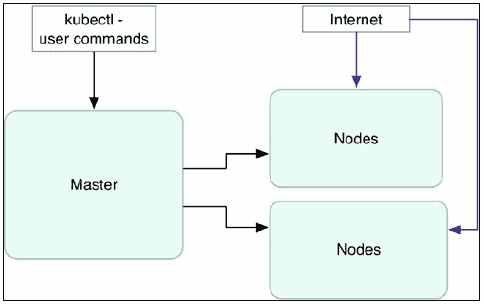
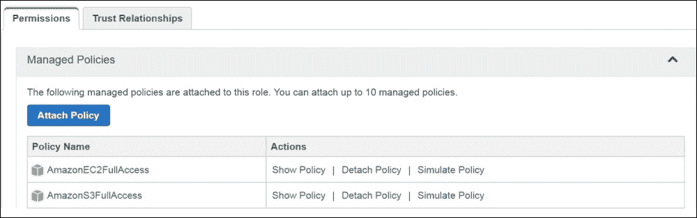
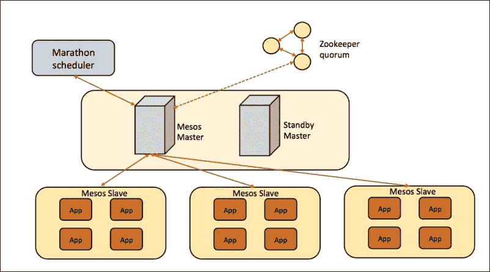
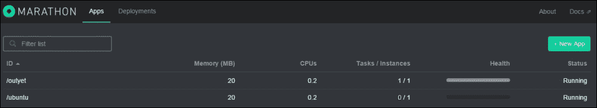
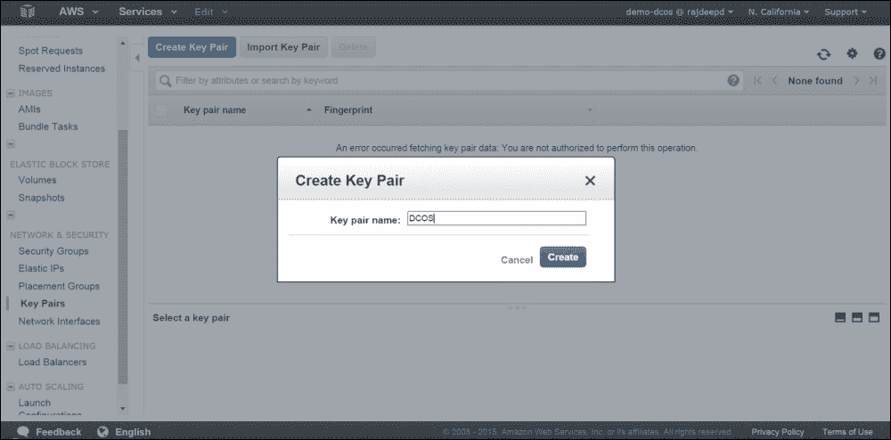
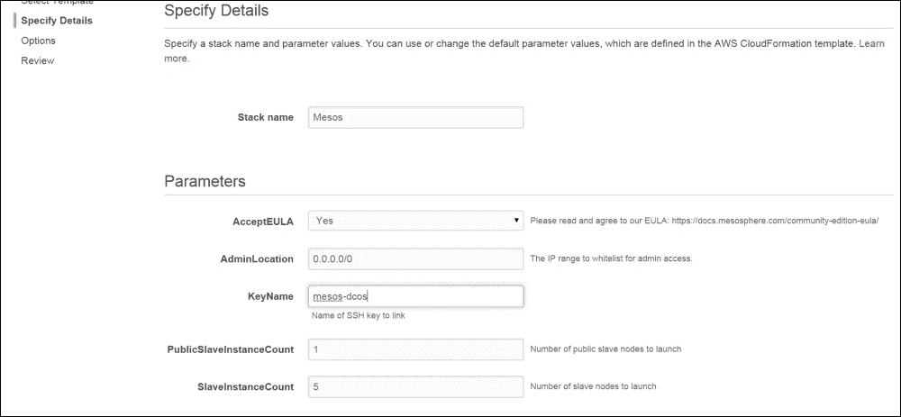
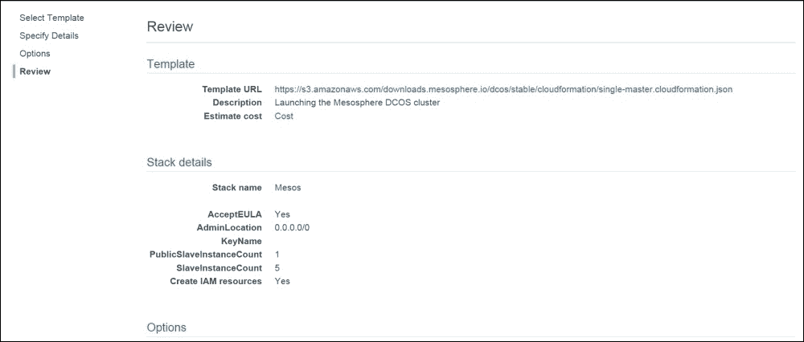
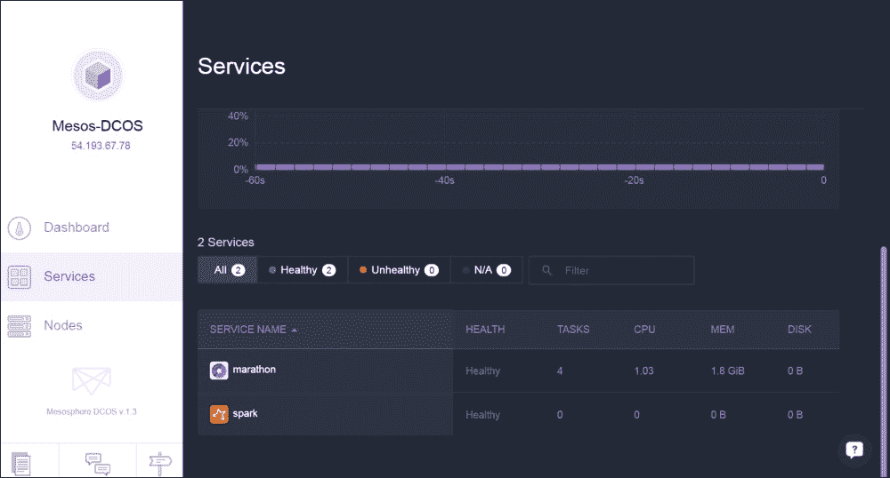

# 四、Docker集群中的网络

在这一章中，您将学习当使用像 Kubernetes、Docker Swarm 和中间层这样的框架时，Docker 容器是如何联网的。

我们将涵盖以下主题:

*   Docker群
*   忽必烈忽必烈忽必烈忽必烈忽必烈忽必烈忽必烈忽必烈忽必烈忽必烈
    *   Kubernetes 集群中的联网容器
    *   Kubernetes 网络与 Docker 网络有何不同
    *   Kubernetes在 AWS
*   中间层

# Docker群

Docker Swarm 是一个用于 Docker 的本地集群系统。Docker Swarm 公开了标准的 Docker API，这样任何与 Docker 守护进程通信的工具都可以与 Docker Swarm 进行通信。基本目标是允许一起创建和使用 Docker 主机池。Swarm 的集群管理器根据集群中的可用资源来调度容器。我们还可以在部署容器时为其指定受约束的资源。Swarm 旨在通过为更重更大的容器节省其他主机资源来将容器打包到主机上，而不是将它们随机调度到集群中的主机上。

与其他 Docker 项目类似，Docker Swarm 使用即插即用架构。Docker Swarm 提供后端服务来维护 Swarm 集群中的 IP 地址列表。有几个服务，如 etcd，领事和动物园管理员；甚至可以使用静态文件。Docker Hub 还提供托管的发现服务，在 Docker Swarm 的正常配置中使用。

Docker Swarm 调度使用多种策略对节点进行排序。创建新容器时，Swarm 使用以下策略，根据计算出的最高等级将其放在节点上:

1.  **展开**:这将优化，并根据该时间点节点上运行的容器数量来调度节点上的容器
2.  **Binpack** :选择节点根据 CPU 和 RAM 利用率调度容器
3.  **随机策略**:这个使用不计算；它随机选择节点来调度容器

Docker Swarm 还使用过滤器来调度容器，例如:

*   **约束**:这些使用与节点关联的键/值对，如`environment=production`
*   **相似性过滤器**:用于运行一个容器，并指示其根据标签、映像或标识符定位并运行到另一个容器旁边
*   **端口过滤器**:在这种情况下，节点是根据其上可用的端口来选择的
*   **依赖过滤器**:这个在同一个节点上协同调度依赖容器
*   **健康过滤器**:这防止了容器在不健康节点上的调度

下图解释了 Docker Swarm 集群的各种组件:


## Docker群设置

让我们设置我们的 Docker Swarm 设置，它将有两个节点和一个主节点。

我们将使用一个 Docker 客户端来访问 Docker Swarm 集群。Docker 客户端可以安装在机器或笔记本电脑上，应该可以访问 Swarm 集群中的所有机器。

在所有三台机器上安装 Docker 后，我们将从命令行重新启动 Docker 服务，以便可以从本地主机(`0.0.0.0:2375`)上的 TCP 端口 2375 或特定主机 IP 地址访问它，并且可以允许在所有 Swarm 节点上使用 Unix 套接字进行连接，如下所示:

```
$ docker -H tcp://0.0.0.0:2375 -H unix:///var/run/docker.sock –d &

```

Docker Swarm 映像需要作为主节点上的 Docker 容器进行部署。在我们的例子中，主节点的 IP 地址是`192.168.59.134`。用你的蜂群主节点替换它。在 Docker 客户机上，我们将使用以下命令在主节点上安装 Docker Swarm:

```
$ sudo docker -H tcp://192.168.59.134:2375 run --rm swarm create
Unable to find image 'swarm' locally
Pulling repository swarm
e12f8c5e4c3b: Download complete
cf43a42a05d1: Download complete
42c4e5c90ee9: Download complete
22cf18566d05: Download complete
048068586dc5: Download complete
2ea96b3590d8: Download complete
12a239a7cb01: Download complete
26b910067c5f: Download complete
4fdfeb28bd618291eeb97a2096b3f841

```

应该注意命令执行后生成的 Swarm 令牌，因为它将用于 Swarm 设置。在我们的例子中，是这样的:

```
"4fdfeb28bd618291eeb97a2096b3f841"

```

以下是设置双节点 Docker Swarm 集群的步骤:

1.  从 Docker 客户端节点，需要使用节点 1 的 IP 地址(在我们的示例中为`192.168.59.135`)和前面代码中生成的 Swarm 令牌来执行以下`docker`命令，以便将其添加到 Swarm 集群中:

    ```
    $ docker -H tcp://192.168.59.135:2375 run -d swarm join --addr=192.168.59.135:2375 token:// 4fdfeb28bd618291eeb97a2096b3f841
    Unable to find image 'swarm' locally
    Pulling repository swarm
    e12f8c5e4c3b: Download complete
    cf43a42a05d1: Download complete
    42c4e5c90ee9: Download complete
    22cf18566d05: Download complete
    048068586dc5: Download complete
    2ea96b3590d8: Download complete
    12a239a7cb01: Download complete
    26b910067c5f: Download complete
    e4f268b2cc4d896431dacdafdc1bb56c98fed01f58f8154ba13908c7e6fe675b

    ```

2.  通过用节点 2 替换节点 1 的 IP 地址，对节点 2 重复上述步骤
3.  Swarm manager is required to be set up on the master node using the following command on the Docker client node:

    ```
    $ sudo docker -H tcp://192.168.59.134:2375 run -d -p 5001:2375 swarm manage token:// 4fdfeb28bd618291eeb97a2096b3f841
    f06ce375758f415614dc5c6f71d5d87cf8edecffc6846cd978fe07fafc3d05d3

    ```

    Swarm 群集已设置，可以使用驻留在主节点上的 Swarm 管理器进行管理。要列出所有节点，可以使用 Docker 客户端执行以下命令:

    ```
    $ sudo docker -H tcp://192.168.59.134:2375 run --rm swarm list \ token:// 4fdfeb28bd618291eeb97a2096b3f841
    192.168.59.135:2375
    192.168.59.136:2375

    ```

4.  以下命令可用于获取集群信息:

    ```
    $ sudo docker -H tcp://192.168.59.134:5001 info
    Containers: 0
    Strategy: spread
    Filters: affinity, health, constraint, port, dependency
    Nodes: 2
    agent-1: 192.168.59.136:2375
     └ Containers: 0
     └ Reserved CPUs: 0 / 8
     └ Reserved Memory: 0 B / 1.023 GiB
     agent-0: 192.168.59.135:2375
     └ Containers: 0
     └ Reserved CPUs: 0 / 8
     └ Reserved Memory: 0 B / 1.023 GiB

    ```

5.  测试`ubuntu`容器可以通过指定名称为`swarm-ubuntu`并使用以下命令启动到集群上:

    ```
    $ sudo docker -H tcp://192.168.59.134:5001 run -it --name swarm-ubuntu ubuntu /bin/sh

    ```

6.  可以使用 Swarm 主机的 IP 地址来列出容器:

    ```
    $ sudo docker -H tcp://192.168.59.134:5001 ps

    ```

这就完成了双节点 Docker Swarm 集群的设置。

## Docker群体网络

Docker Swarm 网络与 libnetwork 集成，甚至为覆盖网络提供支持。libnetwork 提供了一个 Go 实现来连接容器；它是一个健壮的容器网络模型，为应用和容器的编程接口提供网络抽象。Docker Swarm 现在与 Docker 1.9 中的新网络模型完全兼容(请注意，我们将在以下设置中使用 Docker 1.9)。覆盖网络需要键值存储，包括发现、网络、IP 地址和更多信息。

在下面的例子中，我们将使用 Consul 来更好地理解 Docker Swarm 网络:

1.  我们将使用`docker-machine` :

    ```
    $ docker-machine create -d virtualbox sample-keystore
    Running pre-create checks...
    Creating machine...
    Waiting for machine to be running, this may take a few minutes...
    Machine is running, waiting for SSH to be available...
    Detecting operating system of created instance...
    Provisioning created instance...
    Copying certs to the local machine directory...
    Copying certs to the remote machine...
    Setting Docker configuration on the remote daemon...
    To see how to connect Docker to this machine, run: docker-machine.exe env sample-keystore

    ```

    供应一台名为`sample-keystore`的 VirtualBox 机器
2.  我们还将在港口`8500`的`sample-keystore`机器上部署`progrium/consul`容器，命令如下:

    ```
    $ docker $(docker-machine config sample-keystore) run -d \
     -p "8500:8500" \
     -h "consul" \
     progrium/consul -server –bootstrap
    Unable to find image 'progrium/consul:latest' locally
    latest: Pulling from progrium/consul
    3b4d28ce80e4: Pull complete
    e5ab901dcf2d: Pull complete
    30ad296c0ea0: Pull complete
    3dba40dec256: Pull complete
    f2ef4387b95e: Pull complete
    53bc8dcc4791: Pull complete
    75ed0b50ba1d: Pull complete
    17c3a7ed5521: Pull complete
    8aca9e0ecf68: Pull complete
    4d1828359d36: Pull complete
    46ed7df7f742: Pull complete
    b5e8ce623ef8: Pull complete
    049dca6ef253: Pull complete
    bdb608bc4555: Pull complete
    8b3d489cfb73: Pull complete
    c74500bbce24: Pull complete
    9f3e605442f6: Pull complete
    d9125e9e799b: Pull complete
    Digest: sha256:8cc8023462905929df9a79ff67ee435a36848ce7a10f18d6d0faba9306b97274
    Status: Downloaded newer image for progrium/consul:latest
    1a1be5d207454a54137586f1211c02227215644fa0e36151b000cfcde3b0df7c

    ```

3.  将本地环境设置到`sample-keystore`机器:

    ```
    $ eval "$(docker-machine env sample-keystore)"

    ```

4.  我们可以列出领事容器如下:

    ```
    $ docker ps
    CONTAINER ID       IMAGE           COMMAND           CREATED       STATUS        PORTS                                 NAMES
    1a1be5d20745   progrium/consul  /bin/start -server  5 minutes ago  Up 5 minutes   53/tcp, 53/udp, 8300-8302/tcp, 8400/tcp, 8301-8302/udp, 0.0.0.0:8500->8500/tcp   cocky_bhaskara

    ```

5.  Create a Swarm cluster using `docker-machine`. The two machines can be created in VirtualBox; one can act as the Swarm master. As we create each Swarm node, we will be passing the options required for Docker Engine to have an overlay network driver:

    ```
    $ docker-machine create -d virtualbox --swarm --swarm-image="swarm" --swarm-master --swarm-discovery="consul://$(docker-machine ip sample-keystore):8500" --engine-opt="cluster-store=consul://$(docker-machine ip sample-keystore):8500" --engine-opt="cluster-advertise=eth1:2376" swarm-master
    Running pre-create checks...
    Creating machine...
    Waiting for machine to be running, this may take a few minutes...
    Machine is running, waiting for SSH to be available...
    Detecting operating system of created instance...
    Provisioning created instance...
    Copying certs to the local machine directory...
    Copying certs to the remote machine...
    Setting Docker configuration on the remote daemon...
    Configuring swarm...
    To see how to connect Docker to this machine, run: docker-machine env swarm-master

    ```

    前面命令中使用的参数使用如下:

    *   `--swarm`:用于用 Swarm 配置机器。
    *   `--engine-opt`:该选项用于定义需要提供的任意守护程序选项。在我们的例子中，我们将在创建时为引擎守护程序提供`--cluster-store`选项，该选项告诉引擎键值存储的位置，以便覆盖网络的可用性。`--cluster-advertise`选项会将机器放在特定端口的网络上。
    *   `--swarm-discovery`:是用来发现和 Swarm 一起使用的服务，在我们这里`consul`就是那个服务。
    *   `--swarm-master`:用于将机器配置为 Swarm 主机。
6.  也可以创建另一个主机并添加到 Swarm 集群中，如下所示:

    ```
    $ docker-machine create -d virtualbox --swarm --swarm-image="swarm:1.0.0-rc2" --swarm-discovery="consul://$(docker-machine ip sample-keystore):8500" --engine-opt="cluster-store=consul://$(docker-machine ip sample-keystore):8500" --engine-opt="cluster-advertise=eth1:2376" swarm-node-1
    Running pre-create checks...
    Creating machine...
    Waiting for machine to be running, this may take a few minutes...
    Machine is running, waiting for SSH to be available...
    Detecting operating system of created instance...
    Provisioning created instance...
    Copying certs to the local machine directory...
    Copying certs to the remote machine...
    Setting Docker configuration on the remote daemon...
    Configuring swarm...
    To see how to connect Docker to this machine, run: docker-machine env swarm-node-1

    ```

7.  机器可列举如下:

    ```
    $ docker-machine ls
    NAME            ACTIVE   DRIVER       STATE     URL               SWARM
    sample-keystore   -     virtualbox   Running   tcp://192.168.99.100:2376
    swarm-master      -     virtualbox   Running   tcp://192.168.99.101:2376  swarm-master (master)
    swarm-node-1      -     virtualbox   Running   tcp://192.168.99.102:2376   swarm-master

    ```

8.  现在，我们将 Docker 环境设置为`swarm-master` :

    ```
    $ eval $(docker-machine env --swarm swarm-master)

    ```

9.  可以在主机上执行以下命令，以创建覆盖网络并进行多主机联网:

    ```
    $ docker network create –driver overlay sample-net

    ```

10.  可以使用以下命令在主机上检查网桥:

    ```
    $ docker network ls
    NETWORK ID         NAME           DRIVER
    9f904ee27bf5      sample-net      overlay
    7fca4eb8c647       bridge         bridge
    b4234109be9b       none            null
    cf03ee007fb4       host            host

    ```

11.  当切换到 Swarm 节点时，我们可以轻松地列出新创建的覆盖网络，如下所示:

    ```
    $ eval $(docker-machine env swarm-node-1)
    $ docker network ls
    NETWORK ID        NAME            DRIVER
    7fca4eb8c647      bridge          bridge
    b4234109be9b      none             null
    cf03ee007fb4      host            host
    9f904ee27bf5     sample-net       overlay

    ```

12.  一旦网络被创建，我们可以在任何主机上启动容器，它将是网络的一部分:

    ```
    $ eval $(docker-machine env swarm-master)

    ```

13.  启动样本`ubuntu`容器，约束环境设置为第一个节点:

    ```
    $ docker run -itd --name=os --net=sample-net --env="constraint:node==swarm-master" ubuntu

    ```

14.  我们可以使用`ifconfig`命令检查容器是否有两个网络接口，并且可以从任何其他主机上使用 Swarm 管理器部署的容器访问。

# 立方结构

Kubernetes 是一个容器集群管理工具。目前，它支持 Docker 和 Rocket。这是一个由谷歌支持的开源项目，该项目于 2014 年 6 月在谷歌 I/O 启动，支持在 GCE、Azure、AWS、vSphere 等各种云提供商上部署，也支持在裸机上部署。Kubernetes 管理器是精简的、可移植的、可扩展的和自我修复的。

Kubernetes 有各种重要成分，如下表所示:

*   **节点**:这是 Kubernetes 集群的物理或虚拟机部分，运行 Kubernetes 和 Docker 服务，可以在其上调度 pods。
*   **主**:这维护了 Kubernetes 服务器运行时的运行时状态。它是配置和管理 Kubernetes 组件的所有客户端调用的入口点。
*   **Kubectl** :这是命令行工具，用于与 Kubernetes 集群交互，以提供对 Kubernetes APIs 的主访问。通过它，用户可以部署、删除和列出 pods。
*   **Pod** :这是Kubernetes最小的调度单元。它是共享卷且没有端口冲突的 Docker 容器的集合。它可以通过定义一个简单的 JSON 文件来创建。
*   **复制控制器**:它管理一个Pod 的生命周期，并通过根据需要创建或杀死Pod 来确保指定数量的Pod 在给定时间运行。
*   **标签**:标签用于根据键值对识别和组织 pods 和服务。

下图显示了 Kubernetes 主/迷你流:



## 在 AWS 上部署 Kubernetes

让我们在 AWS 上开始Kubernetes 集群部署，这可以通过使用 Kubernetes 代码库中已经存在的配置文件来完成:

1.  在[http://aws.amazon.com/console/](http://aws.amazon.com/console/)登录自动气象站控制台。
2.  在[https://console.aws.amazon.com/iam/home?#home](https://console.aws.amazon.com/iam/home?#home)打开 IAM 控制台。
3.  选择 IAM 用户名，选择**安全凭证**选项卡，并点击**创建访问密钥**选项。
4.  创建密钥后，下载并保存在安全的地方。下载的`.csv`文件将包含一个`Access Key ID`和`Secret Access Key`，用于配置 AWS 命令行界面。
5.  安装并配置 AWS 命令行界面。在本例中，我们使用以下命令在 Linux 上安装了 AWS CLI:

    ```
    $ sudo pip install awscli

    ```

6.  要配置 AWS 命令行界面，请使用以下命令:

    ```
    $ aws configure
    AWS Access Key ID [None]: XXXXXXXXXXXXXXXXXXXXXXXXXXXXXXXX
    AWS Secret Access Key [None]: YYYYYYYYYYYYYYYYYYYYYYYYYYYY
    Default region name [None]: us-east-1
    Default output format [None]: text

    ```

7.  配置 AWS CLI 后，我们将创建一个配置文件，并为其附加一个角色，该角色可以完全访问 S3 和 EC2:

    ```
    $ aws iam create-instance-profile --instance-profile-name Kube

    ```

8.  The role can be created separately using the console or AWS CLI with a JSON file that defines the permissions the role can have:

    ```
    $ aws iam create-role --role-name Test-Role --assume-role-policy-document /root/kubernetes/Test-Role-Trust-Policy.json

    ```

    可以将一个角色附加到前面的配置文件中，该配置文件可以完全访问 EC2 和 S3，如下图所示:

    

9.  创建角色后，可以使用以下命令将其附加到策略:

    ```
    $ aws iam add-role-to-instance-profile --role-name Test-Role --instance-profile-name Kube

    ```

10.  默认情况下，脚本使用默认配置文件。我们可以修改如下:

    ```
    $ export AWS_DEFAULT_PROFILE=Kube

    ```

11.  Kubernetes 集群可以使用一个命令轻松部署，如下所示:

    ```
    $ export KUBERNETES_PROVIDER=aws; wget -q -O - https://get.k8s.io | bash
    Downloading kubernetes release v1.1.1 to /home/vkohli/kubernetes.tar.gz
    --2015-11-22 10:39:18--  https://storage.googleapis.com/kubernetes-release/release/v1.1.1/kubernetes.tar.gz
    Resolving storage.googleapis.com (storage.googleapis.com)... 216.58.220.48, 2404:6800:4007:805::2010
    Connecting to storage.googleapis.com (storage.googleapis.com)|216.58.220.48|:443... connected.
    HTTP request sent, awaiting response... 200 OK
    Length: 191385739 (183M) [application/x-tar]
    Saving to: 'kubernetes.tar.gz'
    100%[======================================>] 191,385,739 1002KB/s   in 3m 7s
    2015-11-22 10:42:25 (1002 KB/s) - 'kubernetes.tar.gz' saved [191385739/191385739]
    Unpacking kubernetes release v1.1.1
    Creating a kubernetes on aws...
    ... Starting cluster using provider: aws
    ... calling verify-prereqs
    ... calling kube-up
    Starting cluster using os distro: vivid
    Uploading to Amazon S3
    Creating kubernetes-staging-e458a611546dc9dc0f2a2ff2322e724a
    make_bucket: s3://kubernetes-staging-e458a611546dc9dc0f2a2ff2322e724a/
    +++ Staging server tars to S3 Storage: kubernetes-staging-e458a611546dc9dc0f2a2ff2322e724a/devel
    upload: ../../../tmp/kubernetes.6B8Fmm/s3/kubernetes-salt.tar.gz to s3://kubernetes-staging-e458a611546dc9dc0f2a2ff2322e724a/devel/kubernetes-salt.tar.gz
    Completed 1 of 19 part(s) with 1 file(s) remaining

    ```

12.  前面的命令将调用`kube-up.sh`，然后使用`config-default.sh`脚本调用`utils.sh`，该脚本包含具有四个节点的 K8S 集群的基本配置，如下所示:

    ```
    ZONE=${KUBE_AWS_ZONE:-us-west-2a}
    MASTER_SIZE=${MASTER_SIZE:-t2.micro}
    MINION_SIZE=${MINION_SIZE:-t2.micro}
    NUM_MINIONS=${NUM_MINIONS:-4}
    AWS_S3_REGION=${AWS_S3_REGION:-us-east-1}

    ```

13.  实例是运行 Ubuntu 操作系统的`t2.micro`。该过程需要 5 到 10 分钟，之后会列出主服务器和从属服务器的 IP 地址，并可用于访问 Kubernetes 集群。

## Kubernetes 网络及其与 Docker 网络的区别

Kubernetes 偏离了默认 Docker 系统的网络模型。目标是每个 pod 都有一个由系统的管理命名空间赋予的 IP 级别，它与系统上的其他物理机器和容器完全一致。从端口分配、系统管理、命名、管理公开、负担调整、应用设计以及 pods 从一台主机移动到另一台主机的角度来看，为每个 pods 单元分配 IP 有助于一个干净、倒退且良好的模型，其中单元可以像虚拟机或物理主机一样处理。所有Pod 中的所有容器都可以使用它们的地址与所有其他Pod 中的所有其他容器进行对话。这也有助于将传统应用转移到面向容器的方法。

由于每个 pod 都获得了一个真实的 IP 地址，它们可以相互通信，而不需要任何翻译。通过在 pod 内部和外部进行相同的 IP 地址和端口配置，我们可以创建一个无 NAT 的平面地址空间。这不同于标准的 Docker 模型，因为在那里，所有容器都有一个私有的 IP 地址，这将允许它们能够访问同一主机上的容器。但是在 Kubernetes 的例子中，一个 pod 中的所有容器的行为就好像它们在同一个主机上，并且可以到达本地主机上彼此的端口。这减少了容器之间的隔离，并提供了简单性、安全性和性能。端口冲突可能是其中的一个缺点；因此，一个容器内的两个不同容器不能使用同一个端口。

在 GCE 中，使用 IP 转发和高级路由规则，Kubernetes 集群中的每个虚拟机都会获得额外的 256 个 IP 地址，以便轻松地跨 pods 路由流量。

GCE 中的路由允许您在虚拟机中实现更高级的网络功能，例如设置多对一网络地址转换。Kubernetes利用了这一点。

这是对虚拟机拥有的主以太网桥的补充；该桥被称为容器桥`cbr0`，以区别于Docker桥`docker0`。为了将数据包从Pod 传送出 GCE 环境的，它应该经过 SNAT 到虚拟机的 IP 地址，GCE 识别并允许该地址。

其他主要目的是提供每荚 IP 模型的实现有开放虚拟交换机、Flannel和Weave。

在类似 GCE 的 Kubernetes 开放虚拟交换机桥的设置中，接下来是 Docker 桥被`kbr0`取代以提供额外的 256 个子网地址的模型。此外，还添加了一个 OVS 桥(`ovs0`)，该桥为Kubernetes桥添加了一个端口，以便提供 GRE 隧道来跨不同的从属端传输数据包，并连接驻留在这些主机上的Pod 。在接下来的图表中，还将更详细地阐述每个 pod 的 IP 模型，其中还将解释 Kubernetes 的服务抽象概念。

服务是另一种广泛使用的抽象类型，建议在 Kubernetes 集群中使用，因为它允许通过虚拟 IP 地址访问一组 pods(应用)，并代理到服务中的所有内部 pods。部署在 Kubernetes 中的一个应用可能使用同一个 pod 的三个副本，它们有不同的 IP 地址。但是，客户端仍然可以在暴露在外的一个 IP 地址上访问应用，而不管哪个后端 pod 接受请求。服务充当不同副本Pod 之间的负载平衡器，并为使用该应用的客户端提供单点通信。Kubernetes 的服务之一 Kubeproxy 提供负载平衡，并使用规则来访问服务 IPs，并将它们重定向到正确的后端 pod。

## 部署KubernetesPod 

现在，在下面的示例中，我们将部署两个 nginx 复制单元(`rc-pod`)并通过服务公开它们，以便理解 Kubernetes 网络。由**服务代理**决定应用可以通过虚拟 IP 地址暴露在哪里，以及请求将被代理到 pod(负载均衡器)的哪个副本。详情请参考下图:


以下是部署 Kubernetes pod 的步骤:

1.  在 Kubernetes 主文件中，创建一个新文件夹:

    ```
    $ mkdir nginx_kube_example
    $ cd nginx_kube_example

    ```

2.  In the editor of your choice, create the `.yaml` file that will be used to deploy the nginx pods:

    ```
    $ vi nginx_pod.yaml

    ```

    将以下内容复制到文件中:

    ```
    apiVersion: v1
    kind: ReplicationController
    metadata:
     name: nginx
    spec:
     replicas: 2
     selector:
     app: nginx
     template:
     metadata:
     name: nginx
     labels:
     app: nginx
     spec:
     containers:
     - name: nginx
     image: nginx
     ports:
     - containerPort: 80

    ```

3.  使用`kubectl` :

    ```
    $ kubectl create -f nginx_pod.yaml

    ```

    创建 nginx Pod 
4.  In the preceding pod creation process, we created two replicas of the nginx pod, and its details can be listed using the following command:

    ```
    $ kubectl get pods

    ```

    以下是生成的输出:

    ```
    NAME          READY     REASON    RESTARTS   AGE
    nginx-karne   1/1       Running   0          14s
    nginx-mo5ug   1/1       Running   0          14s

    ```

    要列出集群上的复制控制器，请使用`kubectl get`命令:

    ```
    $ kubectl get rc

    ```

    以下是生成的输出:

    ```
    CONTROLLER   CONTAINER(S)   IMAGE(S)   SELECTOR    REPLICAS
    nginx        nginx          nginx      app=nginx   2

    ```

5.  The container on the deployed minion can be listed using the following command:

    ```
    $ docker ps

    ```

    以下是生成的输出:

    ```
    CONTAINER ID        IMAGE                                   COMMAND                CREATED             STATUS              PORTS               NAMES
    1d3f9cedff1d        nginx:latest                            "nginx -g 'daemon of   41 seconds ago      Up 40 seconds       k8s_nginx.6171169d_nginx-karne_default_5d5bc813-3166-11e5-8256-ecf4bb2bbd90_886ddf56
    0b2b03b05a8d        nginx:latest                            "nginx -g 'daemon of   41 seconds ago      Up 40 seconds

    ```

6.  Deploy the nginx service using the following .`yaml` file in order to expose the nginx pod on host port `82`:

    ```
    $ vi nginx_service.yaml

    ```

    将以下内容复制到文件中:

    ```
    apiVersion: v1
    kind: Service
    metadata:
     labels:
     name: nginxservice
     name: nginxservice
    spec:
     ports:
     # The port that this service should serve on.
     - port: 82
     # Label keys and values that must match in order to receive traffic for this service.
     selector:
     app: nginx
     type: LoadBalancer

    ```

7.  使用`kubectl create`命令创建 nginx 服务:

    ```
    $kubectl create -f nginx_service.yaml
    services/nginxservice

    ```

8.  The nginx service can be listed using the following command:

    ```
    $ kubectl get services

    ```

    以下是生成的输出:

    ```
    NAME           LABELS                                    SELECTOR    IP(S)          PORT(S)
    kubernetes     component=apiserver,provider=kubernetes   <none>      192.168.3.1    443/TCP
    nginxservice   name=nginxservice                         app=nginx   192.168.3.43   82/TCP

    ```

9.  Now, the nginx server's test page can be accessed on the following URL via the service:

    `http://192.168.3.43:82`

# 中间层

中间层是一个软件解决方案，它提供了管理服务器基础设施的方法，并且基本上扩展了 Apache 中间层的集群管理能力。中间层也推出了 **DCOS** ( **数据中心操作系统**)，用于通过跨越所有机器并将它们视为一台计算机来管理数据中心，提供了一种高度可扩展和弹性的方式在其上部署应用。DCOS 可以安装在任何公共云或您自己的私有数据中心，从 AWS、GCE、微软 Azure 到 VMware。马拉松是 Mesos 的框架，旨在启动和运行应用；它可以替代 init 系统。马拉松提供了各种功能，如高可用性、应用运行状况检查和服务发现，这些功能可以帮助您在 Mesos 集群环境中运行应用。

本课程介绍如何创建单节点 Mesos 集群。

## Docker容器

Mesos 可以使用马拉松框架运行和管理 Docker 容器。

在本练习中，我们将使用 CentOS 7 部署一个 Mesos 集群:

1.  Install Mesosphere and Marathon using the following command:

    ```
    # sudo rpm -Uvh http://repos.mesosphere.com/el/7/noarch/RPMS/mesosphere-el-repo-7-1.noarch.rpm
    # sudo yum -y install mesos marathon

    ```

    Apache Mesos 使用 Zookeeper 进行操作。Zookeeper 充当中间层架构中的主选举服务，并存储中间层节点的状态。

2.  通过指向 Zookeeper 的 RPM 存储库来安装 Zookeeper 和 Zookeeper 服务器包，如下所示:

    ```
    # sudo rpm -Uvh http://archive.cloudera.com/cdh4/one-click-install/redhat/6/x86_64/cloudera-cdh-4-0.x86_64.rpm
    # sudo yum -y install zookeeper zookeeper-server

    ```

3.  Validate Zookeeper by stopping and restarting it:

    ```
    # sudo service zookeeper-server stop
    # sudo service zookeeper-server start

    ```

    Mesos 使用一个简单的架构来给你一个跨机器集群的智能任务分配，而不用担心它们被安排在哪里。

4.  通过启动`mesos-master`和`mesos-slave`过程配置阿帕奇 Mesos，如下所示:

    ```
    # sudo service mesos-master start
    # sudo service mesos-slave start

    ```

5.  Mesos will be running on port `5050`. As shown in the following screenshot, you can access the Mesos interface with your machine's IP address, here, `http://192.168.10.10:5050`:

    

6.  使用`mesos-execute`命令测试介子:

    ```
    # export MASTER=$(mesos-resolve `cat /etc/mesos/zk` 2>/dev/null)
    # mesos help
    # mesos-execute --master=$MASTER --name="cluster-test" --command="sleep 40"

    ```

7.  With the `mesos-execute` command running, enter *Ctrl* + *Z* to suspend the command. You can see how it appears in the web UI and command line:

    ```
    # hit ctrl-z
    # mesos ps --master=$MASTER

    ```

    中间层栈使用马拉松来管理流程和服务。它可以替代传统的初始化系统。它简化了集群环境中应用的运行。下图显示了带有马拉松的中间层主从拓扑:

    

    马拉松可以用来启动其他的 Mesos 框架；由于它是为长时间运行的应用设计的，它将确保它启动的应用将继续运行，即使它们运行的从节点出现故障。

8.  Start the Marathon service using the following command:

    ```
    # sudo service marathon start

    ```

    您可以在`http://192.168.10.10:8080`查看马拉松图形用户界面。

## 使用 Docker 部署网络应用

在这个练习中，我们将安装一个简单的网络应用:

1.  使用以下命令安装 Docker:

    ```
    # sudo yum install -y golang git device-mapper-event-libs docker
    # sudo chkconfig docker on
    # sudo service docker start
    # export GOPATH=~/go
    # go get github.com/golang/example/outyet
    # cd $GOPATH/src/github.com/golang/example/outyet
    # sudo docker build -t outyet.

    ```

2.  以下命令在将 Docker 文件添加到马拉松之前对其进行测试:

    ```
    # sudo docker run --publish 6060:8080 --name test --rm outyet

    ```

3.  转到浏览器上的`http://192.168.10.10:6060/`以确认其工作正常。一旦完成，你可以点击 *CTRL* + *C* 退出 Outyet Docker。
4.  使用马拉松Docker支持创建马拉松应用，如下所示:

    ```
    # vi /home/user/outyet.json
    {
     "id": "outyet",
     "cpus": 0.2,
     "mem": 20.0,
     "instances": 1,
     "constraints": [["hostname", "UNIQUE", ""]],
     "container": {
     "type": "DOCKER",
     "docker": {
     "image": "outyet",
     "network": "BRIDGE",
     "portMappings": [ { "containerPort": 8080, "hostPort": 0, "servicePort": 0, "protocol": "tcp" }
     ]
     }
     }
    }

    # echo 'docker,mesos' | sudo tee /etc/mesos-slave/containerizers
    # sudo service mesos-slave restart

    ```

5.  使用 Marathon Docker 更好地配置和管理容器，如下所示:

    ```
    # curl -X POST http://192.168.10.10:8080/v2/apps -d /home/user/outyet.json -H "Content-type: application/json"

    ```

6.  You can check all your applications on the Marathon GUI at `http://192.168.10.10:8080`, as shown in the following screenshot:

    

## 使用 DCOS 在自动气象站上部署介子

在这最后一部分，我们将在 AWS 上部署中间层最新推出的DCOS，以便在我们的数据中心管理和部署 Docker 服务:

1.  Create an AWS key pair in the region where the cluster is required to be deployed by going to the navigation pane and choosing **Key Pairs** under **NETWORK & SECURITY**:

    

2.  After being created, the key can be viewed as follows and the generated key pair (`.pem`) file should be stored in a secure location for future use:

    

3.  The DCOS cluster can be created by selecting the **1 Master** template on the official Mesosphere site:

    

    也可以通过在栈部署中提供亚马逊 S3 模板网址的链接来实现:

    

4.  Click on the **Next** button. Fill in the details such as **Stack name** and **KeyName**, generated in the previous step:

    

5.  Review the details before clicking on the **Create** button:

    

6.  After 5 to 10 minutes, the Mesos stack will be deployed and the Mesos UI can be accessed at the URL shown in the following screenshot:

    

7.  Now, we will be installing the DCOS CLI on a Linux machine with Python (2.7 or 3.4) and pip preinstalled, using the following commands:

    ```
    $ sudo pip install virtualenv
    $ mkdir dcos
    $ cd dcos
    $ curl -O https://downloads.mesosphere.io/dcos-cli/install.sh
    % Total    % Received % Xferd  Average Speed   Time    Time     Time  Current
     Dload  Upload   Total   Spent    Left  Speed
    100  3654  100  3654    0     0   3631      0  0:00:01  0:00:01 --:--:--  3635
    $ ls
    install.sh
    $ bash install.sh . http://mesos-dco-elasticl-17lqe4oh09r07-1358461817.us-west-1.elb.amazonaws.com
    Installing DCOS CLI from PyPI...
    New python executable in /home/vkohli/dcos/bin/python
    Installing setuptools, pip, wheel...done.
    [core.reporting]: set to 'True'
    [core.dcos_url]: set to 'http://mesos-dco-elasticl-17lqe4oh09r07-1358461817.us-west-1.elb.amazonaws.com'
    [core.ssl_verify]: set to 'false'
    [core.timeout]: set to '5'
    [package.cache]: set to '/home/vkohli/.dcos/cache'
    [package.sources]: set to '[u'https://github.com/mesosphere/universe/archive/version-1.x.zip']'
    Go to the following link in your browser:
    https://accounts.mesosphere.com/oauth/authorize?scope=&redirect_uri=urn%3Aietf%3Awg%3Aoauth%3A2.0%3Aoob&response_type=code&client_id=6a552732-ab9b-410d-9b7d-d8c6523b09a1&access_type=offline
    Enter verification code: Skipping authentication.
    Enter email address: Skipping email input.
    Updating source [https://github.com/mesosphere/universe/archive/version-1.x.zip]
    Modify your bash profile to add DCOS to your PATH? [yes/no]  yes
    Finished installing and configuring DCOS CLI.
    Run this command to set up your environment and to get started:
    source ~/.bashrc && dcos help

    ```

    DCOS 帮助文件如下所示:

    ```
    $ source ~/.bashrc && dcos help
    Command line utility for the Mesosphere Datacenter Operating System (DCOS). The Mesosphere DCOS is a distributed operating system built around Apache Mesos. This utility provides tools for easy management of a DCOS installation.
    Available DCOS commands:

     config       Get and set DCOS CLI configuration properties
     help         Display command line usage information
     marathon     Deploy and manage applications on the DCOS
     node         Manage DCOS nodes
     package      Install and manage DCOS packages
     service      Manage DCOS services
     task         Manage DCOS tasks

    ```

8.  现在，我们将在更新后使用 DCOS 包在 Mesos 集群上部署一个 Spark 应用。用`dcos <command> --help` :

    ```
    $ dcos config show package.sources
    [
     "https://github.com/mesosphere/universe/archive/version-1.x.zip"
    ]
    $ dcos package update
    Updating source [https://github.com/mesosphere/universe/archive/version-1.x.zip]

    $ dcos package search
    NAME       VERSION            FRAMEWORK     SOURCE             DESCRIPTION
    arangodb   0.2.1                True     https://github.com/mesosphere/universe/archive/version-1.x.zip   A distributed free and open-source database with a flexible data model for documents, graphs, and key-values. Build high performance applications using a convenient SQL-like query language or JavaScript extensions.
    cassandra  0.2.0-1               True     https://github.com/mesosphere/universe/archive/version-1.x.zip  Apache Cassandra running on Apache Mesos.
    chronos    2.4.0                 True     https://github.com/mesosphere/universe/archive/version-1.x.zip  A fault tolerant job scheduler for Mesos which handles dependencies and ISO8601 based schedules.
    hdfs       0.1.7                 True     https://github.com/mesosphere/universe/archive/version-1.x.zip  Hadoop Distributed File System (HDFS), Highly Available.
    kafka      0.9.2.0               True     https://github.com/mesosphere/universe/archive/version-1.x.zip  Apache Kafka running on top of Apache Mesos.
    marathon   0.11.1                True     https://github.com/mesosphere/universe/archive/version-1.x.zip  A cluster-wide init and control system for services in cgroups or Docker containers.
    spark      1.5.0-multi-roles-v2  True     https://github.com/mesosphere/universe/archive/version-1.x.zip  Spark is a fast and general cluster computing system for Big Data.

    ```

    获得一个详细命令描述
9.  火花套装可按安装如下:

    ```
    $ dcos package install spark
    Note that the Apache Spark DCOS Service is beta and there may be bugs, incomplete features, incorrect documentation or other discrepancies.
    We recommend a minimum of two nodes with at least 2 CPU and 2GB of RAM available for the Spark Service and running a Spark job.
    Note: The Spark CLI may take up to 5min to download depending on your connection.
    Continue installing? [yes/no] yes
    Installing Marathon app for package [spark] version [1.5.0-multi-roles-v2]
    Installing CLI subcommand for package [spark] version [1.5.0-multi-roles-v2]

    ```

10.  After deployment, it can be seen in the DCOS UI under the **Services** tab, as shown in the following screenshot:

    

11.  为了在前面的 Marathon 集群上部署虚拟 Docker 应用，我们可以使用 JSON 文件来定义容器映像、要执行的命令以及部署后要公开的端口:

    ```
    $ nano definition.json
    {
     "container": {
     "type": "DOCKER",
     "docker": {
     "image": "superguenter/demo-app"
     }
     },
     "cmd":  "python -m SimpleHTTPServer $PORT",
     "id": "demo",
     "cpus": 0.01,
     "mem": 256,
     "ports": [3000]
    }

    ```

12.  该 app 可添加至马拉松，列表如下:

    ```
    $ dcos marathon app add definition.json
    $ dcos marathon app list
    ID       MEM    CPUS  TASKS  HEALTH  DEPLOYMENT  CONTAINER  CMD
    /demo   256.0   0.01   1/1    ---       ---        DOCKER   python -m SimpleHTTPServer $PORT
    /spark  1024.0  1.0    1/1    1/1       ---        DOCKER   mv /mnt/mesos/sandbox/log4j.properties conf/log4j.properties && ./bin/spark-class org.apache.spark.deploy.mesos.MesosClusterDispatcher --port $PORT0 --webui-port $PORT1 --master mesos://zk://master.mesos:2181/mesos --zk master.mesos:2181 --host $HOST --name spark

    ```

13.  前面的 Docker 应用的三个实例可以如下启动:

    ```
    $ dcos marathon app update --force demo instances=3
    Created deployment 28171707-83c2-43f7-afa1-5b66336e36d7
    $ dcos marathon deployment list
    APP    ACTION  PROGRESS  ID
    /demo  scale     0/1     28171707-83c2-43f7-afa1-5b66336e36d7

    ```

14.  The deployed application can be seen in the DCOS UI by clicking on the **Tasks** tab under **Services**:

    

# 总结

在本章中，我们学习了使用各种框架的 Docker 网络，例如原生的 Docker Swarm。Swarm 使用 libnetwork 或现成的覆盖网络，提供多主机网络功能。

另一方面，Kubernetes 与 Docker 的视角不同，在 Docker 中，每个 pod 都获得其唯一的 IP 地址，pod 之间的通信可以在服务的帮助下进行。使用开放的虚拟交换机或 IP 转发和高级路由规则，可以增强 Kubernetes 网络，以提供不同子网的主机之间的连接，以及将主机暴露给外部世界的能力。在中间层的例子中，我们可以看到 Marathon 被用作部署的容器联网的后端。以中间层的 DCOS 为例，整个部署的机器栈被视为一台机器，以便在部署的容器服务之间提供丰富的网络体验。

在下一章中，我们将通过了解内核命名空间、cgroups 和虚拟防火墙来了解基本 Docker 网络的安全性和 QoS。