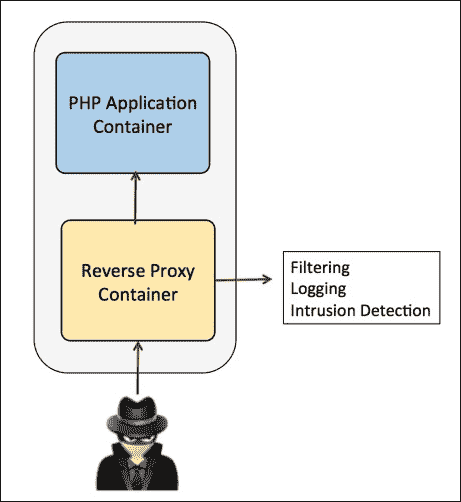
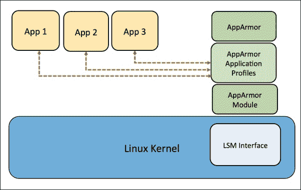
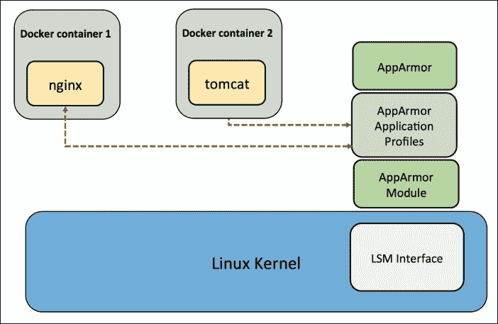

# 五、Docker容器的安全性和服务质量

在本章中，我们将学习如何在一般容器的上下文中实现安全性，以及如何实现服务质量策略，以确保像中央处理器和输入输出这样的资源按预期共享。大部分讨论将集中在这些主题在 Docker 上下文中的相关性。

我们将在本章中介绍以下内容:

*   文件系统限制
    *   只读挂载点
    *   写时复制
*   Linux 功能和 Docker
*   在 AWS ECS 中保护容器(EC2 容器服务)
*   理解 Docker 安全性 I–内核名称空间
*   了解 Docker 安全二–用户组
*   使用设备保护Docker容器
*   Docker 安全基准

# 文件系统限制

在本节中，我们将研究 Docker 容器启动时的文件系统限制。下一节解释只读挂载点和写时复制文件系统，它们被用作 Docker 容器和内核对象表示的基础。

## 只读挂载点

Docker 需要访问文件系统，如 sysfs 和 proc，以便进程运行。但是不一定需要修改这些挂载点。

以只读模式加载的两个主要挂载点是:

*   `/sys`
*   `/proc`

### sysfs

sysfs 文件系统被加载到挂载点`/sys`。sysfs 是一种用于表示内核对象、其属性及其相互关系的机制。它提供了两个组件:

*   内核编程接口，用于通过 sysfs 导出这些项目
*   查看和操作这些项目的用户界面，这些项目映射回它们所代表的内核对象

以下代码显示了正在安装的安装点:

```
{
  Source:      "sysfs",
  Destination: "/sys",
  Device:      "sysfs",
  Flags:       defaultMountFlags | syscall.MS_RDONLY,
},
```

前面代码的参考链接位于[https://github . com/docker/docker/blob/ECC 3717 CB 17313186 ee 711 e 624 b 960 b 096 a 9334 f/daemon/exec driver/native/template/default _ template _ Linux . go](https://github.com/docker/docker/blob/ecc3717cb17313186ee711e624b960b096a9334f/daemon/execdriver/native/template/default_template_linux.go)。

### procfs

proc 文件系统(procfs)是类似 Unix 的操作系统中的一个特殊文件系统，它以类似文件的分层结构呈现关于进程和其他系统信息的信息。载入`/proc`。与传统的跟踪方法或直接访问内核内存相比，它为动态访问保存在内核中的进程数据提供了一种更方便、更标准化的方法。它在引导时被映射到名为`/proc`的挂载点:

```
{
  Source:      "proc",
  Destination: "/proc",
  Device:      "proc",
  Flags:       defaultMountFlags,
},
```

只读路径与`/proc`:

```
ReadonlyPaths: []string{
  "/proc/asound",
  "/proc/bus",
  "/proc/fs",
  "/proc/irq",
  "/proc/sys",
  "/proc/sysrq-trigger",
}
```

### /dev/pts

这是另一个装载点，在创建过程中作为容器的读写装载。`/dev/pts`纯粹存在于内存中，磁盘上没有存储任何东西，因此以读写模式加载是安全的。

`/dev/pts`中的条目是伪端子(简称 pty)。Unix 内核有一个通用的终端概念。终端为应用提供了一种通过终端设备显示输出和接收输入的方式。一个进程可以有一个控制终端。对于文本模式应用，这是它与用户交互的方式:

```
{
  Source:      "devpts",
  Destination: "/dev/pts",
  Device:      "devpts",
  Flags:       syscall.MS_NOSUID | syscall.MS_NOEXEC,
  Data:        "newinstance,ptmxmode=0666,mode=0620,gid=5",
},
```

### /sys/fs/cggroup

这是实现组的挂载点，并作为容器的`MS_RDONLY`加载:

```
{
  Source:      "cgroup",
  Destination: "/sys/fs/cgroup",
  Device:      "cgroup",
  Flags:       defaultMountFlags | syscall.MS_RDONLY,
},
```

## 写入时复制

Docker 使用联合文件系统，这是一种写时复制文件系统。这意味着容器可以使用与容器基础相同的文件系统映像。当容器将内容写入映像时，它会被写入容器特定的文件系统。它会阻止一个容器访问另一个容器的更改，即使这些更改是从同一文件系统映像创建的。一个容器不能通过更改映像内容来影响另一个容器中的进程。下图解释了这一过程:


# Linux 功能

1.2 之前的 Docker 容器可以在权限模式下被赋予完整的功能，或者它们都可以遵循允许功能的白名单，同时丢弃所有其他功能。如果使用标志`--privileged`，它将授予容器所有的能力。这是不建议生产使用的，因为它真的不安全；它允许 Docker 作为直接主机下的进程的所有权限。

在 Docker 1.2 中，`docker run`引入了两个标志:

*   `--cap-add`
*   `--cap-drop`

这两个标志为容器提供细粒度控制，例如:

*   更改 Docker 容器界面的状态:

    ```
    docker run --cap-add=NET_ADMIN busybox sh -c "ip link eth0 down"

    ```

*   防止 Docker 容器中的任何杂烩:

    ```
    docker run --cap-drop=CHOWN ...

    ```

*   Allow all capabilities except `mknod`:

    ```
    docker run --cap-add=ALL --cap-drop=MKNOD ...

    ```

    默认情况下，Docker 用一组受限的功能启动容器。功能将根和非根的二进制模式转换为更细粒度的访问控制。例如，服务于 HTTP 请求的 web 服务器需要绑定到端口 80(对于 HTTP)和端口 443(对于 HTTPs)。这些服务器不需要在根模式下运行。这些服务器可以被授予`net_bind_service`功能。

    在这种情况下，容器和服务器有点不同。服务器需要在根模式下运行一些进程。例如，ssh、cron 和处理 dhcp 的网络配置等等。另一方面，容器不需要这种访问。

    以下任务不需要发生在容器中:

    *   ssh 访问由 Docker 主机管理
    *   cron 作业应该在用户模式下运行
    *   像 ipconfig 和路由这样的网络配置不应该发生在容器内部

    我们可以安全地推断容器可能不需要根权限。

    可以否认的例子如下:

    *   不允许装载操作
    *   不允许访问套接字
    *   防止访问文件系统操作，如更改文件属性或文件所有权
    *   防止容器装载新模块

    Docker 只允许以下功能:

    ```
    Capabilities: []string{
      "CHOWN",
      "DAC_OVERRIDE",
      "FSETID",
      "FOWNER",
      "MKNOD",
      "NET_RAW",
      "SETGID",
      "SETUID",
      "SETFCAP",
      "SETPCAP",
      "NET_BIND_SERVICE",
      "SYS_CHROOT",
      "KILL",
      "AUDIT_WRITE",
    },
    ```

    前面代码的参考位于[https://github . com/docker/docker/blob/master/daemon/exec driver/native/template/default _ template _ Linux . go](https://github.com/docker/docker/blob/master/daemon/execdriver/native/template/default_template_linux.go)。

    在 Linux 手册页中可以找到可用功能的完整列表([http://man7.org/linux/man-pages/man7/capabilities.7.html](http://man7.org/linux/man-pages/man7/capabilities.7.html))。

    运行 Docker 容器的一个主要风险是，提供给容器的默认功能和装载集可能会提供不完全的隔离，无论是单独使用还是与内核漏洞结合使用。

    Docker 支持添加和删除功能，允许使用非默认配置文件。这可能会通过移除功能使 Docker 更安全，或者通过添加功能使 Docker 更不安全。对用户来说，最好的做法是删除所有功能，除了那些流程明确需要的功能。

# 将容器固定在自动气象站电子控制系统中

亚马逊 **EC2 容器服务** ( **ECS** )提供高度可扩展的高性能容器管理服务，支持 Docker 容器。它允许您在亚马逊 EC2 实例的托管集群上轻松运行应用。Amazon ECS 让您无需安装、操作和扩展自己的集群管理基础架构。通过简单的 API 调用，您可以启动和停止支持 Docker 的应用，并查询集群的完整状态。

在下面的示例中，我们将看到如何使用两个 Docker 容器部署安全的 web 应用，一个容器包含简单的 web 应用(应用容器)，另一个容器包含启用了节流的反向代理(代理容器)，可用于保护 web 应用。这些容器将使用 ECS 部署在亚马逊 EC2 实例上。从下图中可以看出，所有网络流量都将通过抑制请求的代理容器进行路由。此外，我们可以使用各种安全软件在代理容器上执行过滤、日志记录和入侵检测等活动。

以下是这样做的步骤:

1.  我们将从 GitHub 项目中构建一个基本的 PHP web 应用容器。以下步骤可以在单独的 EC2 实例或本地机器上执行:

    ```
    $ sudo yum install -y git
    $ git clone https://github.com/awslabs/ecs-demo-php-simple-app

    ```

2.  将目录更改到`ecs-demo-php-simple-app`文件夹:

    ```
    $ cd ecs-demo-php-simple-app

    ```

3.  我们可以如下检查`Dockerfile`以了解它将部署的 web 应用:

    ```
    $ cat Dockerfile

    ```

4.  Build the container image using Dockerfile and then push it in your Docker Hub account. The Docker Hub account is required as it helps to deploy the containers on the Amazon ECS service by just specifying the container name:

    ```
    $ docker build -t my-dockerhub-username/amazon-ecs-sample.

    ```

    这里建立的映像需要有`dockerhub-username`(没有空格的正确)作为第一参数。

    下图描述了一名黑客无法访问 web 应用，因为该请求是通过代理容器过滤的，并且访问被阻止:

    

5.  将Docker映像上传至Docker中心账户:

    ```
    $ docker login

    ```

6.  检查以确保您的登录成功:

    ```
    $ docker info

    ```

7.  将您的映像推送到 Docker Hub 帐户:

    ```
    $ docker push my-dockerhub-username/amazon-ecs-sample

    ```

8.  After creating the sample web application Docker container, we will now create the proxy container, which can also contain some security-related software, if required, in order to strengthen security. We will create a new proxy Docker container using a customized Dockerfile and then push the image to your Docker Hub account:

    ```
    $ mkdir proxy-container
    $ cd proxy-container
    $ nano Dockerfile
    FROM ubuntu
    RUN apt-get update && apt-get install -y nginx
    COPY nginx.conf /etc/nginx/nginx.conf
    RUN echo "daemon off;" >> /etc/nginx/nginx.conf
    EXPOSE 80
    CMD service nginx start

    ```

    在前面的 Dockerfile 中，我们使用了一个基本的 Ubuntu 映像，并安装了 nginx，将其暴露在端口 80 上。

9.  接下来，我们将创建一个定制的`nginx.conf`，它将覆盖默认的`nginx.conf`，以确保反向代理配置正确:

    ```
    user www-data;
    worker_processes 4;
    pid /var/run/nginx.pid;

    events {
     worker_connections 768;
     # multi_accept on;
    }

    http {
     server {
     listen           80;

     # Proxy pass to servlet container
     location / {
     proxy_pass      http://application-container:80;
     }
     }
    }

    ```

10.  构建代理 Docker 映像并将构建的映像推送到 Docker Hub 帐户:

    ```
    $ docker build -t my-dockerhub-username/proxy-image.
    $ docker push my-dockerhub-username/proxy-image

    ```

11.  通过导航到 **AWS 管理控制台**([https://aws.amazon.com/console/](https://aws.amazon.com/console/))可以部署 ECS 容器服务。
12.  单击左侧边栏中的**任务定义**，然后单击**创建新的任务定义**。
13.  给你的任务定义起个名字，比如`SecurityApp`。
14.  Next, click on **Add Container** and insert the name of the proxy web container pushed to the Docker Hub account, as well as the name of the application web container. View the contents of the JSON using **Configure via JSON** tab to see the task definition that you have created. It should be like this:

    ```
    Proxy-container:
    Container Name: proxy-container
    Image: username/proxy-image
    Memory: 256
    Port Mappings
    Host port: 80
    Container port: 80
    Protocol: tcp
    CPU: 256
    Links: application-container
    Application container:
    Container Name: application-container
    Image: username/amazon-ecs-sample
    Memory: 256
    CPU: 256

    ```

    点击**创建**按钮，部署应用。

15.  点击左侧边栏中的**集群**。如果默认群集不存在，请创建一个。
16.  启动一个 ECS 优化的 **亚马逊机器映像** ( **AMI** )，确保它有一个公共 IP 地址和一个互联网路径。
17.  当实例启动并运行时，导航至 **AWS 管理控制台**的 **ECS** 部分，点击**集群**，然后**默认**。现在，我们应该能够在 **ECS 实例**选项卡下看到我们的实例。
18.  从**自动气象站管理控制台**选项卡的左侧导航至**任务**定义，并单击**运行任务**。
19.  在下一页，确保集群设置为**默认**，任务数为 **1** ，然后点击**运行任务**。
20.  流程完成后，我们可以看到任务的状态从挂起状态变为绿色运行状态。
21.  点击 **ECS** 选项卡，我们可以看到前面创建的容器实例。通过点击它，我们将获得关于其公共 IP 地址的信息。通过浏览器点击这个公共 IP 地址，我们将能够看到我们的示例 PHP 应用。

# 了解 Docker 安全性 I–内核名称空间

名称空间为内核的全局系统资源提供了一个包装器，并使该资源在名称空间内的进程看来就像它们有一个独立的实例一样。全局资源变化对同一命名空间中的进程可见，但对其他进程不可见。容器被认为是内核命名空间的优秀实现。

Docker 实现了以下命名空间:

*   **pid 命名空间**:用于进程隔离( **PID** — **进程标识**)
*   **网络名称空间**:用于管理网络接口(**网络** — **网络**
*   **ipc 名称空间**:用于管理对 ipc 资源的访问( **IPC** — **进程间通信**)
*   **mnt 命名空间**:用于管理挂载点( **MNT** — **挂载**
*   **uts 命名空间**:用于隔离内核和版本标识符( **UTS** — **Unix 分时系统**

在 libcontainer 中添加命名空间支持需要在 GoLang 的系统层添加补丁([https://codereview . appspot . com/126190043/patch/140001/150001](https://codereview.appspot.com/126190043/patch/140001/150001)<emph is>src/syscall/exec _ Linux . go</emph is>)这样就可以为 PIDs、用户 UIDs 等维护新的数据结构。

## pid 命名空间

pid 命名空间隔离进程 id 号空间；不同 pid 名称空间中的进程可以具有相同的 pid。pid 名称空间允许容器提供功能，例如暂停/恢复容器中的一组进程，并将容器迁移到新的主机，同时容器内部的进程保持相同的 PID。

新命名空间中的 PID 以 PID 1 开始。内核需要配置名称空间的标志`CONFIG_PID_NS`才能工作。

pid 命名空间可以嵌套。除了初始(根)pid 命名空间之外，每个 pid 命名空间都有一个父级。pid 命名空间的父级是使用克隆或非共享创建命名空间的进程的 pid 命名空间。pid 命名空间形成一棵树，所有命名空间最终都追溯到根命名空间，如下图所示:


## 净命名空间

net 命名空间提供了与网络相关的系统资源的隔离。每个网络命名空间都有自己的网络设备、IP 地址、IP 路由表、`/proc/net`目录、端口号等等。

网络命名空间从网络角度来看，使容器变得有用:每个容器可以有自己的(虚拟)网络设备和自己的应用，它们绑定到每个命名空间的端口号空间；主机系统中合适的路由规则可以将网络分组定向到与特定容器相关联的网络设备。使用网络名称空间需要一个内核，该内核使用`CONFIG_NET_NS`选项([https://lwn.net/Articles/531114/](https://lwn.net/Articles/531114/))配置。

由于每个容器都有自己的网络命名空间，这基本上意味着它有自己的网络接口和路由表，所以 Docker 也直接利用网络命名空间来隔离 IP 地址、端口号等。

### 基本网络命名空间管理

网络名称空间是通过向`clone()`系统调用`CLONE_NEWNET`传递一个标志来创建的。但是，从命令行使用 IP 网络配置工具来设置和使用网络名称空间是很方便的:

```
# ip netns add netns1

```

该命令创建一个名为`netns1`的新网络命名空间。当 IP 工具创建网络命名空间时，它将在`/var/run/netns`下为其创建绑定挂载，这允许命名空间持久化，即使在其中没有进程运行时也是如此，并且便于对命名空间本身的操作。由于网络名称空间在准备使用之前通常需要相当多的配置，因此这个特性将受到系统管理员的赞赏。

`ip netns exec`命令可用于运行命名空间内的网络管理命令:

```
# ip netns exec netns1 ip link list
1: lo: <LOOPBACK> mtu 65536 qdisc noop state DOWN mode DEFAULT link/loopback 00:00:00:00:00:00 brd 00:00:00:00:00:00

```

该命令列出了命名空间内可见的接口。可以使用以下命令删除网络命名空间:

```
# ip netns delete netns1

```

此命令删除引用给定网络命名空间的绑定装载。但是，只要有任何进程在名称空间中运行，名称空间本身就会一直存在。

### 网络命名空间配置

新的网络命名空间将有一个环回设备，但没有其他网络设备。除了环回设备之外，每个网络设备(物理或虚拟接口、网桥等)只能存在于单个网络命名空间中。此外，物理设备(连接到真实硬件的设备)不能分配给根以外的名称空间。相反，可以创建虚拟网络设备(例如，虚拟以太网或虚拟以太网)并将其分配给一个名称空间。这些虚拟设备允许命名空间内的进程通过网络进行通信；正是配置、路由等决定了他们可以与谁通信。

首次创建时，新命名空间中的`lo`环回设备关闭，因此即使环回`ping`也会失败。

```
# ip netns exec netns1 ping 127.0.0.1
connect: Network is unreachable

```

在前面的命令中，我们可以看到，由于 Docker 容器的网络命名空间存储在单独的位置，因此需要创建一个符号链接到`/var/run/netns`，可以通过以下方式完成:

```
# pid=`docker inspect -f '{{.State.Pid}}' $container_id`
# ln -s /proc/$pid/ns/net /var/run/netns/$container_id

```

在本例中，这是通过打开该接口来完成的，这将允许 ping 通回送地址。

```
# ip netns exec netns1 ip link set dev lo up
# ip netns exec netns1 ping 127.0.0.1
 PING 127.0.0.1 (127.0.0.1) 56(84) bytes of data.
64 bytes from 127.0.0.1: icmp_seq=1 ttl=64 time=0.052 ms
64 bytes from 127.0.0.1: icmp_seq=2 ttl=64 time=0.042 ms
64 bytes from 127.0.0.1: icmp_seq=3 ttl=64 time=0.044 ms
64 bytes from 127.0.0.1: icmp_seq=4 ttl=64 time=0.031 ms
64 bytes from 127.0.0.1: icmp_seq=5 ttl=64 time=0.042 ms

```

这仍然不允许`netns1`和根命名空间之间的通信。为此，需要创建和配置虚拟以太网设备。

```
# ip link add veth0 type veth peer name veth1
# ip link set veth1 netns netns1

```

第一个命令设置一对相连的虚拟以太网设备。发送到`veth0`的数据包将被`veth1`接收，反之亦然。第二个命令将`veth1`分配给`netns1`命名空间。

```
# ip netns exec netns1 ifconfig veth1 10.0.0.1/24 up
# ifconfig veth0 10.0.0.2/24 up

```

然后，这两个命令为这两个设备设置 IP 地址。

```
# ping 10.0.0.1
# ip netns exec netns1 ping 10.0.0.2

```

如先前的`ping`命令所示，双向通信现在是可能的。

不过，如前所述，名称空间不共享路由表或防火墙规则，因为运行路由和`netns1`中的`iptables -L`将证明:

```
# ip netns exec netns1 route
Kernel IP routing table
Destination   Gateway    Genmask        Flags    Metric Ref    Use Iface
10.0.0.0         *      255.255.255.0     U        0  0  0       veth1

# ip netns exec netns1 iptables -L
Chain INPUT (policy ACCEPT)
target     prot opt source               destination
Chain FORWARD (policy ACCEPT)
target     prot opt source               destination
Chain OUTPUT (policy ACCEPT)
target     prot opt source               destination

```

## 用户命名空间

用户名称空间允许用户和组标识的每名称空间映射。这意味着用户名称空间内的进程的用户标识和组标识可能与其名称空间外的标识不同。一个进程可以在名称空间之外有一个非零的用户标识，同时在名称空间之内有一个零的用户标识。该进程对用户命名空间之外的操作没有权限，但在命名空间内具有根权限。

### 创建新的用户命名空间

用户命名空间通过在调用`clone()`或`unshare()`时指定`CLONE_NEWUSER`标志来创建:

`clone()`允许子进程与调用进程共享部分执行上下文，如内存空间、文件描述符表和信号处理程序表。

`unshare()`允许进程(或线程)分离其执行上下文中当前与其他进程(或线程)共享的部分。当使用`fork()`或`vfork()`创建一个新的进程时，执行上下文的一部分，如挂载命名空间，被隐式共享。

如前所述，Docker 容器非常类似于 LXC 容器，因为一组名称空间和控制组是为容器单独创建的。每个容器都有自己的网络栈和命名空间。除非容器没有权限访问，否则不允许它们访问其他主机套接字或接口。如果给容器提供主机网络模式，那么只有它能够访问主机端口和 IP 地址，这可能会对主机上运行的其他程序造成潜在威胁。

如下例所示，我们在容器中使用`host`网络模式，它能够访问所有主机桥:

```
docker run -it --net=host ubuntu /bin/bash
$ ifconfig
docker0   Link encap:Ethernet  HWaddr 02:42:1d:36:0d:0d
 inet addr:172.17.0.1  Bcast:0.0.0.0  Mask:255.255.0.0
 inet6 addr: fe80::42:1dff:fe36:d0d/64 Scope:Link
 UP BROADCAST MULTICAST  MTU:1500  Metric:1
 RX packets:24 errors:0 dropped:0 overruns:0 frame:0
 TX packets:38 errors:0 dropped:0 overruns:0 carrier:0
 collisions:0 txqueuelen:0
 RX bytes:1608 (1.6 KB)  TX bytes:5800 (5.8 KB)

eno16777736 Link encap:Ethernet  HWaddr 00:0c:29:02:b9:13
 inet addr:192.168.218.129  Bcast:192.168.218.255  Mask:255.255.255.0
 inet6 addr: fe80::20c:29ff:fe02:b913/64 Scope:Link
 UP BROADCAST RUNNING MULTICAST  MTU:1500  Metric:1
 RX packets:4934 errors:0 dropped:0 overruns:0 frame:0
 TX packets:4544 errors:0 dropped:0 overruns:0 carrier:0
 collisions:0 txqueuelen:1000
 RX bytes:2909561 (2.9 MB)  TX bytes:577079 (577.0 KB)

$ docker ps -q | xargs docker inspect --format '{{ .Id }}: NetworkMode={{ .HostConfig.NetworkMode }}'
52afb14d08b9271bd96045bebd508325a2adff98dbef8c10c63294989441954d: NetworkMode=host

```

审核时，应检查所有容器的默认网络模式是否设置为`default`而非`host`:

```
$ docker ps -q | xargs docker inspect --format '{{ .Id }}: NetworkMode={{ .HostConfig.NetworkMode }}'
1aca7fe47882da0952702c383815fc650f24da2c94029b5ad8af165239b78968: NetworkMode=default

```

每个 Docker 容器都连接到一个以太网桥，以便在容器之间提供互连。它们可以相互 ping 通以发送/接收 UDP 数据包并建立 TCP 连接，但如果需要，这可以受到限制。名称空间还提供了一种简单的隔离，可以限制在另一个容器和主机中运行的进程的访问。

我们将使用`nsenter`命令行实用程序后面的来输入名称空间。这是 GitHub 上的一个开源项目，可在[https://github.com/jpetazzo/nsenter](https://github.com/jpetazzo/nsenter)获得。

使用它，我们将尝试输入现有的容器名称空间，或者尝试生成一组新的名称空间。它不同于 Docker `exec`命令的，因为`nsenter`不进入 cgroups，这通过使用名称空间逃避资源限制，为调试和外部审计带来了潜在的好处。

我们可以从 PyPI 安装`nsenter`(它需要 Python 3.4)并使用命令行实用程序连接到一个正在运行的容器:

```
$ pip install nsenter

```

要用容器的 pid 替换 pid，请使用以下命令:

```
$ sudo nsenter --net --target=PID /bin/ip a
1: lo: <LOOPBACK,UP,LOWER_UP> mtu 65536 qdisc noqueue state UNKNOWN group default
 link/loopback 00:00:00:00:00:00 brd 00:00:00:00:00:00
 inet 127.0.0.1/8 scope host lo
 valid_lft forever preferred_lft forever
 inet6 ::1/128 scope host
 valid_lft forever preferred_lft forever
14: eth0: <BROADCAST,UP,LOWER_UP> mtu 1500 qdisc noqueue state UP group default
 link/ether 02:42:ac:11:00:06 brd ff:ff:ff:ff:ff:ff
 inet 172.17.0.6/16 scope global eth0
 valid_lft forever preferred_lft forever
 inet6 fe80::42:acff:fe11:6/64 scope link
 valid_lft forever preferred_lft forever

```

我们可以使用`docker inspect`命令使其更加方便，如下所示:

1.  首先启动一个新的 nginx 服务器:

    ```
    $ docker run -d --name=nginx -t nginx

    ```

2.  然后获取容器的 PID:

    ```
    PID=$(docker inspect --format {{.State.Pid}} nginx)

    ```

3.  连接到正在运行的 nginx 容器:

    ```
    $ nsenter --target $PID --uts --ipc --net –pid

    ```

`docker-enter`也是可以用来进入容器内部指定 shell 命令的包装器之一，如果没有指定命令，将会调用一个 shell 来代替。如果需要在不执行另一个命令行工具的情况下检查或操作容器，我们可以使用上下文管理器来完成:

```
import subprocess
from nsenter import Namespace
with Namespace(mypid, 'net'):
# output network interfaces as seen from within the mypid's net NS:
 subprocess.check_output(['ip', 'a'])

```

# 了解Docker安全二–小组

在本节中，我们看一下 cgroups 如何构成容器隔离的主干。

## 定义群组

控制组提供了一种机制，用于将任务(进程)集及其所有未来的子任务聚合/划分到分层组中。

一个组将一组任务与来自子系统的参数相关联。子系统本身是一个资源控制器，用于定义用户组的边界或提供资源。

层次结构是以树的形式排列的一组组，这样系统中的每一个任务都正好位于层次结构中的一个组和一组子系统中。

## 为什么需要 cgroups？

在 Linux 内核中提供进程聚合有多种努力，主要是为了资源跟踪的目的。

这些努力包括 cpusets、CKRM/资源组、用户计数器和虚拟服务器名称空间。这些都需要流程分组/分区的基本概念，新分叉的流程与它们的父流程在同一个组(cgroup)中结束。

内核组补丁提供了有效实现这些组的基本内核机制。它对系统快速路径的影响极小，并为特定的子系统(如 cpusets)提供挂钩，以根据需要提供额外的行为。

## 手动创建组

在以下步骤中，我们将创建一个`cpuset`控制组:

```
# mount -t tmpfs cgroup_root /sys/fs/cgroup

```

`tmpfs`是将所有文件保存在虚拟内存中的文件系统。`tmpfs`中的所有内容都是临时的，也就是说，您的硬盘上不会创建任何文件。如果卸载`tmpfs`实例，其中存储的所有内容都将丢失:

```
# mkdir /sys/fs/cgroup/cpuset
# mount -t cgroup -ocpuset cpuset /sys/fs/cgroup/cpuset
# cd /sys/fs/cgroup/cpuset
# mkdir Charlie
# cd Charlie
# ls
cgroup.clone_children  cpuset.cpu_exclusive  cpuset.mem_hardwall     cpuset.memory_spread_page  cpuset.sched_load_balance  tasks
cgroup.event_control   cpuset.cpus           cpuset.memory_migrate   cpuset.memory_spread_slab  cpuset.sched_relax_domain_level
cgroup.procs           cpuset.mem_exclusive  cpuset.memory_pressure  cpuset.mems                notify_on_release

```

为该组分配 CPU 和内存限制:

```
# /bin/echo 2-3 > cpuset.cpus
# /bin/echo 0 > cpuset.mems
# /bin/echo $$ > tasks

```

以下命令将`/Charlie`显示为 cpuset cgroup:

```
# cat /proc/self/cgroup
11:name=systemd:/user/1000.user/c2.session
10:hugetlb:/user/1000.user/c2.session
9:perf_event:/user/1000.user/c2.session
8:blkio:/user/1000.user/c2.session
7:freezer:/user/1000.user/c2.session
6:devices:/user/1000.user/c2.session
5:memory:/user/1000.user/c2.session
4:cpuacct:/user/1000.user/c2.session
3:cpu:/user/1000.user/c2.session
2:cpuset:/Charlie

```

## 将进程附加到组

将流程标识`PID{X}`添加到任务文件中，如下所示:

```
# /bin/echo PID > tasks

```

注意是`PID`，不是 PIDs。

一次只能附加一个任务。如果您有几个任务要附加，您必须一个接一个地完成:

```
# /bin/echo PID1 > tasks
# /bin/echo PID2 > tasks
...
# /bin/echo PIDn > tasks

```

通过回显`0`附加当前外壳任务:

```
# echo 0 > tasks

```

## Docker 和 cgroups

在 Docker 的 GitHub repo([https://GitHub . com/open containers/runc/tree/master/libcontainer/cggroups](https://github.com/opencontainers/runc/tree/master/libcontainer/cgroups)下，cggroups 作为 lib container 项目的一部分进行管理。有一个 cggroup管理器，它管理与内核中的 cgroup APIs 的交互。

下面的代码显示了由管理器管理的生命周期事件:

```
type Manager interface {
 // Apply cgroup configuration to the process with the specified pid
 Apply(pid int) error
 // Returns the PIDs inside the cgroup set
 GetPids() ([]int, error)
 // Returns statistics for the cgroup set
 GetStats() (*Stats, error)
 // Toggles the freezer cgroup according with specified state
 Freeze(state configs.FreezerState) error
 // Destroys the cgroup set
 Destroy() error
 // Paths maps cgroup subsystem to path at which it is mounted.
 // Cgroups specifies specific cgroup settings for the various subsystems
 // Returns cgroup paths to save in a state file and to be able to
 // restore the object later.
 GetPaths() map[string]string
 // Set the cgroup as configured.
 Set(container *configs.Config) error
}

```

# 使用 AppArmor 保护Docker容器

AppArmor 是一个 **强制访问控制** ( **MAC** )系统，它是一个内核增强，将程序限制在有限的资源集内。AppArmor 的安全模型是将访问控制属性绑定到程序，而不是用户。

apparemor限制是通过加载到内核中的配置文件来提供的，通常是在启动时。AppArmor 配置文件可以是两种模式之一:强制执行或投诉。

在强制模式下加载的配置文件将导致强制实施配置文件中定义的策略，并报告策略违规尝试(通过系统日志或审计)。

投诉模式下的配置文件不会强制执行策略，而是报告违反策略的尝试。

AppArmor 不同于 Linux 上的其他一些 MAC 系统:它是基于路径的，它允许混合强制和抱怨模式的配置文件，它使用 include 文件来简化开发，并且它的进入壁垒比其他流行的 MAC 系统低得多。下图显示了链接到应用的 AppArmour 应用配置文件:



AppArmor 是一种已建立的技术，最早见于 Immunix，后来集成到 Ubuntu、Novell/SUSE 和 Mandriva 中。核心 AppArmor 功能从 2.6.36 开始就在主线 Linux 内核中；apparemor、Ubuntu 和其他开发人员正在进行工作，将附加的 apparemor 功能合并到主线内核中。

你可以在 https://wiki.ubuntu.com/AppArmor 找到更多关于 AppArmor 的信息。

## 表面化和对接

在 Docker 内部运行的应用可以利用 AppArmor 来定义策略。这些配置文件可以手动创建，也可以使用名为 bane 的工具加载。

### 注

在 Ubuntu 14.x 上，确保安装了 systemd，以使以下命令正常工作。

以下步骤显示了如何使用该工具:

1.  Download the bane project for GitHub:

    ```
    $ git clone https://github.com/jfrazelle/bane

    ```

    确保这是在您的 GOPATH 目录中完成的。比如我们用`/home/ubuntu/go`，克星源在`/home/Ubuntu/go/src/github.com/jfrazelle/bane`下载。

2.  安装贝恩需要编译的 toml 解析器:

    ```
    $ go get github.com/BurntSushi/toml

    ```

3.  转到`/home/Ubuntu/go/src/github.com/jfrazelle/bane`目录，运行以下命令:

    ```
    $ go install

    ```

4.  你会在`/home/Ubuntu/go/bin`找到克星二进制。
5.  使用`.toml`文件创建配置文件:

    ```
    Name = "nginx-sample"
    [Filesystem]
    # read only paths for the container
    ReadOnlyPaths = [
     "/bin/**",
     "/boot/**",
     "/dev/**",
     "/etc/**",
     …
    ]
    AllowExec = [
     "/usr/sbin/nginx"
    ]
    # denied executable files
    DenyExec = [
     "/bin/dash",
     "/bin/sh",
     "/usr/bin/top"
    ]

    ```

6.  Execute bane to load the profile. `sample.toml` is a file in the directory `/home/Ubuntu/go/src/github.com/jfrazelle/bane`:

    ```
    $ sudo bane sample.toml
    # Profile installed successfully you can now run the profile with # `docker run --security-opt="apparmor:docker-nginx-sample"`

    ```

    这个概要文件将使很多路径成为只读的，并且只允许在我们将要创建的容器中执行 nginx。它禁用 TOP、PING 等。

7.  Once the profile is loaded you can create a nginx container:

    ```
    $ docker run --security-opt="apparmor:docker-nginx-sample" -p 80:80 --rm -it nginx bash

    ```

    注意，如果 AppArmor 是找不到文件，将文件复制到`/etc/apparmor.d`目录并重新加载 AppArmor 配置文件:

    ```
    $ sudo invoke-rc.d apparmor reload

    ```

    使用 AppArmor 配置文件创建 nginx 容器:

    ```
    ubuntu@ubuntu:~/go/src/github.com$ docker run --security-opt="apparmor:docker-nginx-sample" -p 80:80 --rm -it nginx bash
    root@84d617972e04:/# ping 8.8.8.8
    ping: Lacking privilege for raw socket.

    ```

下图显示了在容器中运行的 nginx 应用如何使用 AppArmour 应用配置文件:



## Docker 安全基准

下面的教程展示了在安全和生产环境中运行 Docker 容器应该遵循的一些重要准则。参考自 CIS Docker 安全基准[https://Benchmark . cisecurity . org/tools 2/Docker/CIS _ Docker _ 1.6 _ Benchmark _ v 1 . 0 . 0 . pdf](https://benchmarks.cisecurity.org/tools2/docker/CIS_Docker_1.6_Benchmark_v1.0.0.pdf)。

### 定期审核 Docker 守护程序

除了审核您的常规 Linux 文件系统和系统调用，还要审核 Docker 守护程序。Docker 守护程序以 root 权限运行。因此，有必要审核其活动和使用情况:

```
$ apt-get install auditd
Reading package lists... Done
Building dependency tree
Reading state information... Done
The following extra packages will be installed:
 libauparse0
Suggested packages:
 audispd-plugins
The following NEW packages will be installed:
 auditd libauparse0
0 upgraded, 2 newly installed, 0 to remove and 50 not upgraded.
Processing triggers for libc-bin (2.21-0ubuntu4) ...
Processing triggers for ureadahead (0.100.0-19) ...
Processing triggers for systemd (225-1ubuntu9) ...

```

删除审核日志文件(如果存在):

```
$ cd /etc/audit/
$ ls
audit.log
$ nano audit.log
$ rm -rf audit.log

```

添加 Docker 服务的审核规则并审核 Docker 服务:

```
$ nano audit.rules
-w /usr/bin/docker -k docker
$ service auditd restart
$ ausearch -k docker
<no matches>
$ docker ps
CONTAINER ID    IMAGE      COMMAND    CREATED    STATUS   PORTS     NAMES
$ ausearch -k docker
----
time->Fri Nov 27 02:29:50 2015
type=PROCTITLE msg=audit(1448620190.716:79): proctitle=646F636B6572007073
type=PATH msg=audit(1448620190.716:79): item=1 name="/lib64/ld-linux-x86-64.so.2" inode=398512 dev=08:01 mode=0100755 ouid=0 ogid=0 rdev=00:00 nametype=NORMAL
type=PATH msg=audit(1448620190.716:79): item=0 name="/usr/bin/docker" inode=941134 dev=08:01 mode=0100755 ouid=0 ogid=0 rdev=00:00 nametype=NORMAL
type=CWD msg=audit(1448620190.716:79):  cwd="/etc/audit"
type=EXECVE msg=audit(1448620190.716:79): argc=2 a0="docker" a1="ps"
type=SYSCALL msg=audit(1448620190.716:79): arch=c000003e syscall=59 success=yes exit=0 a0=ca1208 a1=c958c8 a2=c8

```

### 为容器创建用户

目前，Docker 不支持将容器的根用户映射到主机上的非根用户。对用户命名空间的支持将在未来的版本中提供。这造成了严重的用户隔离问题。因此，强烈建议确保为容器创建了一个非根用户，并且使用该用户运行容器。

正如我们在下面的代码片段中看到的，默认情况下，`centos` Docker 映像的`user`字段为空，这意味着默认情况下，容器将在运行时获得一个根用户，这应该避免:

```
$ docker inspect centos
[
 {
 "Id": "e9fa5d3a0d0e19519e66af2dd8ad6903a7288de0e995b6eafbcb38aebf2b606d",
 "RepoTags": [
 "centos:latest"
 ],
 "RepoDigests": [],
 "Parent": "c9853740aa059d078b868c4a91a069a0975fb2652e94cc1e237ef9b961afa572",
 "Comment": "",
 "Created": "2015-10-13T23:29:04.138328589Z",
 "Container": "eaa200e2e187340f0707085b9b4eab5658b13fd190af68c71a60f6283578172f",
 "ContainerConfig": {
 "Hostname": "7aa5783a47d5",
 "Domainname": "",
 "User": "",
 contd

```

在构建 Docker 映像时，我们可以在 Dockerfile 中提供`test`用户，即权限较低的用户，如以下代码片段所示:

```
$ cd
$ mkdir test-container
$ cd test-container/
$ cat Dockerfile
FROM centos:latest
RUN useradd test
USER test
root@ubuntu:~/test-container# docker build -t vkohli .
Sending build context to Docker daemon 2.048 kB
Step 1 : FROM centos:latest
 ---> e9fa5d3a0d0e
Step 2 : RUN useradd test
 ---> Running in 0c726d186658
 ---> 12041ebdfd3f
Removing intermediate container 0c726d186658
Step 3 : USER test
 ---> Running in 86c5e0599c72
 ---> af4ba8a0fec5
Removing intermediate container 86c5e0599c72
Successfully built af4ba8a0fec5
$ docker images | grep vkohli
vkohli    latest     af4ba8a0fec5      9 seconds ago     172.6 MB

```

当我们启动 Docker 容器时，我们可以看到它获得了一个`test`用户，`docker inspect`命令也显示默认用户为`test`:

```
$ docker run -it vkohli /bin/bash
[test@2ff11ee54c5f /]$ whoami
test
[test@2ff11ee54c5f /]$ exit
$ docker inspect vkohli
[
 {
 "Id": "af4ba8a0fec558d68b4873e2a1a6d8a5ca05797e0bfbab0772bcedced15683ea",
 "RepoTags": [
 "vkohli:latest"
 ],
 "RepoDigests": [],
 "Parent": "12041ebdfd3f38df3397a8961f82c225bddc56588e348761d3e252eec868d129",
 "Comment": "",
 "Created": "2015-11-27T14:10:49.206969614Z",
 "Container": "86c5e0599c72285983f3c5511fdec940f70cde171f1bfb53fab08854fe6d7b12",
 "ContainerConfig": {
 "Hostname": "7aa5783a47d5",
 "Domainname": "",
 "User": "test",
 Contd..

```

### 不要在容器上装载敏感的主机系统目录

如果以读写模式装载敏感目录，则有可能对这些敏感目录中的文件进行更改。这些更改可能会带来安全隐患或不必要的更改，从而使 Docker 主机处于受损状态。

如果`/run/systemd`敏感目录安装在容器中，那么我们实际上可以从容器本身关闭主机:

```
$ docker run -ti -v /run/systemd:/run/systemd centos /bin/bash
[root@1aca7fe47882 /]# systemctl status docker
docker.service - Docker Application Container Engine
 Loaded: loaded (/lib/systemd/system/docker.service; enabled)
 Active: active (running) since Sun 2015-11-29 12:22:50 UTC; 21min ago
 Docs: https://docs.docker.com
 Main PID: 758
 CGroup: /system.slice/docker.service
[root@1aca7fe47882 /]# shutdown

```

可以使用以下命令对其进行审核，该命令返回当前映射目录的列表，以及它们是否以读写模式装载到每个容器实例中:

```
$ docker ps -q | xargs docker inspect --format '{{ .Id }}: Volumes={{ .Volumes }} VolumesRW={{ .VolumesRW }}'

```

### 不要使用权限容器

Docker 支持添加和删除功能，允许使用非默认配置文件。这可能会通过移除功能使 Docker 更安全，或者通过添加功能使 Docker 更不安全。因此，建议删除除容器进程明确需要的功能之外的所有功能。

如下图所示，当我们在没有权限模式下运行容器时，我们无法更改内核参数，但是当我们在权限模式下使用`--privileged`标志运行容器时，很容易更改内核参数，这可能会导致安全漏洞:

```
$ docker run -it centos /bin/bash
[root@7e1b1fa4fb89 /]#  sysctl -w net.ipv4.ip_forward=0
sysctl: setting key "net.ipv4.ip_forward": Read-only file system
$ docker run --privileged -it centos /bin/bash
[root@930aaa93b4e4 /]#  sysctl -a | wc -l
sysctl: reading key "net.ipv6.conf.all.stable_secret"
sysctl: reading key "net.ipv6.conf.default.stable_secret"
sysctl: reading key "net.ipv6.conf.eth0.stable_secret"
sysctl: reading key "net.ipv6.conf.lo.stable_secret"
638
[root@930aaa93b4e4 /]# sysctl -w net.ipv4.ip_forward=0
net.ipv4.ip_forward = 0

```

因此，在审核时，应确保所有容器不应将权限模式设置为`true`:

```
$ docker ps -q | xargs docker inspect --format '{{ .Id }}: Privileged={{ .HostConfig.Privileged }}'
930aaa93b4e44c0f647b53b3e934ce162fbd9ef1fd4ec82b826f55357f6fdf3a: Privileged=true

```

# 总结

在这一章中，我们通过对 cgroups 和内核名称空间的概述深入探讨了 Docker 安全性。我们还讨论了文件系统和 Linux 功能的一些方面，容器利用这些方面来提供更多功能，例如权限容器，但代价是在威胁方面暴露得更多。我们还看到了如何使用代理容器来限制易受攻击的流量，从而在 AWS ECS (EC2 容器服务)中的安全环境中部署容器。AppArmor 还提供内核增强特性，以便将应用限制在有限的资源集内。利用 Docker 容器的优势有助于我们在安全的环境中部署它们。最后，我们快速深入了解了 Docker 安全基准以及在生产环境中进行审计和 Docker 部署时可以遵循的一些重要建议。

在下一章中，我们将学习使用各种工具在 Docker 网络中进行调优和故障排除。