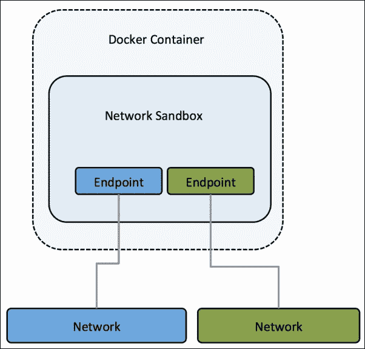
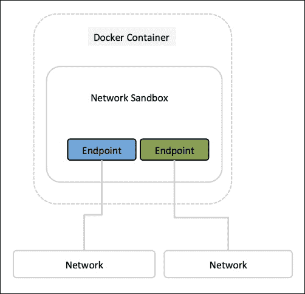
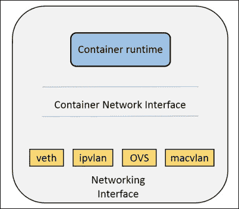

# 第六章。面向 Docker 的下一代网络堆栈:libnetwork

在本章中，我们将了解 Docker: libnetwork 的新网络堆栈，它为单主机和多主机虚拟网络提供了默认实现的可插拔架构:

*   介绍
    *   目标
    *   设计
*   CNM 物件
    *   CNM 属性
    *   CNM 生命周期
*   司机
    *   桥式驱动器
    *   覆盖网络驱动程序
*   使用覆盖网络与游民
*   具有码头工人机器和码头工人群的覆盖网络
*   手动创建覆盖网络并将其用于容器
*   集装箱网络接口
*   Calico 的 libnetwork 驱动程序

# 目标

用 go 语言编写的 libnetwork 是连接 Docker 容器的一种新方式。目的是提供一个容器网络模型，帮助程序员并提供网络库的抽象。libnetwork 的长期目标是遵循 Docker 和 Linux 的理念来交付独立工作的模块。libnetwork 的目标是为容器中的网络提供可组合的需求。它还旨在通过以下方式将 Docker Engine 和 libcontainer 中的网络逻辑模块化为一个可重用的库:

*   用 libnetwork 替换 Docker 引擎的网络模块
*   作为允许本地和远程驱动程序向容器提供网络的模型
*   为管理和测试 libnetwork 提供工具 dnet 仍在进行中(参考自[https://github.com/docker/libnetwork/issues/45](https://github.com/docker/libnetwork/issues/45))。

# 设计

libnetwork 实现了一个**集装箱网络模型** ( **CNM** )。它形式化了为容器提供网络所需的步骤，同时提供了一个可用于支持多个网络驱动程序的抽象。它的端点 API 主要用于管理相应的对象和簿记它们，以便提供 CNM 模型所需的抽象级别。

CNM 由三个主要部分组成。下图显示了 libnetwork 的网络沙盒模型:



# CNM 物件

让我们详细讨论一下 CNM 物体。

## 沙盒

这包含容器网络堆栈的配置，包括路由表管理、容器接口和 DNS 设置。沙盒的实现可以是 Linux 网络命名空间、FreeBSD 监狱或其他类似的概念。一个沙箱可能包含来自多个网络的许多端点。它还表示容器的网络配置，如 IP 地址、媒体访问控制地址和域名系统条目。libnetwork 利用特定于操作系统的参数来填充沙盒表示的网络配置。libnetwork 提供了一个在多个操作系统中实现沙盒的框架。Netlink 用于管理命名空间中的路由表，目前存在两种沙盒实现，`namespace_linux.go`和`configure_linux.go`，用于唯一标识主机文件系统上的路径。

沙箱与单个 Docker 容器相关联。以下数据结构显示了沙箱的运行时元素:

```
type sandbox struct {
  id            string
  containerID   string
  config        containerConfig
  osSbox        osl.Sandbox
  controller    *controller
  refCnt        int
  endpoints     epHeap
  epPriority    map[string]int
  joinLeaveDone chan struct{}
  dbIndex       uint64
  dbExists      bool
  isStub        bool
  inDelete      bool
  sync.Mutex
}
```

从网络控制器实例化一个新的沙箱(稍后将详细解释):

```
func (c *controller) NewSandbox(containerID string, options ...SandboxOption) (Sandbox, error) {
  …..
}
```

## 终点

一个端点将一个沙箱加入到网络中，并为一个容器向部署在同一网络中的其他容器公开的服务提供连接。它可以是开放式虚拟交换机的内部端口或类似的虚拟交换机对。一个端点只能属于一个网络，但可能只属于一个沙盒。端点代表服务，并提供各种 API 来创建和管理端点。它有一个全局范围，但只连接到一个网络，如下图所示:



端点由以下数据结构指定:

```
type endpoint struct {
  name          string
  id            string
  network       *network
  iface         *endpointInterface
  joinInfo      *endpointJoinInfo
  sandboxID     string
  exposedPorts  []types.TransportPort
  anonymous     bool
  generic       map[string]interface{}
  joinLeaveDone chan struct{}
  prefAddress   net.IP
  prefAddressV6 net.IP
  ipamOptions   map[string]string
  dbIndex       uint64
  dbExists      bool
  sync.Mutex
}
```

端点与唯一的标识和名称相关联。它连接到一个网络和一个沙盒 ID。它还与 IPv4 和 IPv6 地址空间相关联。每个端点都与一个`endpointInterface`结构相关联。

## 网络

网络是一组能够直接相互通信的端点。它在同一台主机或多台主机内提供所需的连接，每当创建或更新网络时，都会通知相应的驱动程序。一个例子是 VLAN 桥或 Linux 桥，它在集群中具有全局范围。

网络由网络控制器控制，我们将在下一节讨论。每个网络都有名称、地址空间、标识和网络类型:

```
type network struct {
  ctrlr        *controller
  name         string
  networkType  string
  id           string
  ipamType     string
  addrSpace    string
  ipamV4Config []*IpamConf
  ipamV6Config []*IpamConf
  ipamV4Info   []*IpamInfo
  ipamV6Info   []*IpamInfo
  enableIPv6   bool
  postIPv6     bool
  epCnt        *endpointCnt
  generic      options.Generic
  dbIndex      uint64
  svcRecords   svcMap
  dbExists     bool
  persist      bool
  stopWatchCh  chan struct{}
  drvOnce      *sync.Once
  internal     bool
  sync.Mutex
}
```

## 网络控制器

网络控制器对象提供创建和管理网络对象的应用编程接口。通过将特定驱动程序绑定到给定网络，它是 libnetwork 中的一个入口点，并且它支持内置和远程的多个活动驱动程序。网络控制器允许用户将特定的驱动程序绑定到给定的网络:

```
type controller struct {
  id             string
  drivers        driverTable
  ipamDrivers    ipamTable
  sandboxes      sandboxTable
  cfg            *config.Config
  stores         []datastore.DataStore
  discovery      hostdiscovery.HostDiscovery
  extKeyListener net.Listener
  watchCh        chan *endpoint
  unWatchCh      chan *endpoint
  svcDb          map[string]svcMap
  nmap           map[string]*netWatch
  defOsSbox      osl.Sandbox
  sboxOnce       sync.Once
  sync.Mutex
}
```

每个网络控制器都参考以下内容:

*   数据结构中的一个或多个驱动程序可驱动
*   数据结构中的一个或多个沙箱
*   数据存储
*   美味的

下图显示了**网络控制器**如何位于**码头工人引擎**和它们所连接的集装箱和网络之间:


## CNM 属性

属性有两种类型，如下:

*   **选项**:它们不是最终用户可见的，而是数据的键值对，提供了一种灵活的机制，将特定于驱动程序的配置从用户直接传递给驱动程序。libnetwork 仅在关键字与一个众所周知的标签匹配时对选项进行操作，因为结果值是由一个泛型对象表示的。
*   **标签**:它们是选项的子集是使用`–labels`选项在用户界面中表示的最终用户变量。它们的主要功能是执行特定于驱动程序的操作，并且它们是从用户界面传递的。

## CNM 生命周期

容器网络模型的消费者通过 CNM 对象及其应用编程接口进行交互，以将他们管理的容器联网。

驱动程序向网络控制器注册。内置驱动程序在 libnetwork 内部注册，而远程驱动程序通过插件机制(WIP)向 libnetwork 注册。每个驱动程序处理特定的网络类型。

使用`libnetwork.New()`应用编程接口创建网络控制器对象，以管理网络的分配，并可选地使用特定于驱动程序的选项配置驱动程序。

通过提供名称和`networkType`，使用控制器的`NewNetwork()`应用编程接口创建网络。`networkType`参数有助于选择相应的驱动程序，并将创建的网络绑定到该驱动程序。从这一点来看，网络上的任何操作都将由该驱动程序处理。

`controller.NewNetwork()`应用编程接口还接收携带特定于驱动程序的选项和标签的可选选项参数，驱动程序可以使用这些参数。

`network.CreateEndpoint()`可以被调用来在给定的网络中创建新的端点。该应用编程接口还接受随驱动程序而变化的可选选项参数。

驱动程序将使用`driver.CreateEndpoint`调用，当在网络中创建端点时，它可以选择保留 IPv4/IPv6 地址。驱动程序将使用在`driver`应用编程接口中定义的`InterfaceInfo`接口分配这些地址。需要 IPv4/IPv6 地址来完成端点作为服务的定义以及端点公开的端口。服务端点是应用程序容器正在侦听的网络地址和端口号。

`endpoint.Join()`可用于将容器连接到端点。如果该容器不存在，则`Join`操作将创建一个沙箱。驱动程序利用沙箱密钥来识别连接到同一个容器的多个端点。

有一个单独的应用编程接口来创建端点，还有一个应用编程接口来连接端点。

端点代表独立于容器的服务。当一个端点被创建时，它拥有为容器保留的资源，以便以后连接到该端点。它给出了一致的网络行为。

当容器停止时调用`endpoint.Leave()`。驱动程序可以清除在`Join()`调用期间分配的状态。当最后一个引用端点离开网络时，libnetwork 将删除沙箱。

只要端点仍然存在，libnetwork 就会一直保留 IP 地址。当容器(或任何容器)再次连接时，这些将被重用。它确保容器的资源在停止和再次启动时被重新使用。

`endpoint.Delete()`用于从网络中删除端点。这将导致删除端点并清理缓存的`sandbox.Info`。

`network.Delete()`用于删除一个网络。如果没有端点连接到网络，则允许删除。

# 驾驶员

驱动程序拥有一个网络，并负责网络的工作和管理。网络控制器提供 API，为驱动程序配置特定的标签/选项，这些标签/选项对用户不直接可见，但对 libnetwork 透明，可以由驱动程序直接处理。驱动程序既可以是内置的(如桥、主机或覆盖)，也可以是远程的(来自插件提供者)，可以部署在各种用例和部署场景中。

驱动程序拥有网络实施并负责管理，包括 **IP 地址管理(IPAM)** 。下图解释了该过程:


以下是内置驱动程序:

*   **空**:为了提供与旧`docker --net=none`的向后兼容，这个选项主要存在于不需要联网的情况下。
*   **桥接**:它提供了一个 Linux 特有的桥接实现驱动。
*   **叠加**:叠加驱动实现组网，可以跨越 VXLAN 等多台主机网络封装。我们将深入研究它的两个实现:使用 Consul 的基本设置和部署覆盖驱动程序的游民设置。
*   **远程**:它提供了一种方式，通过远程运输支持司机，具体的司机可以根据选择来编写。

## 驾驶台驾驶员

桥驱动程序代表 Linux 桥上的包装器，充当 libcontainer 的网络。它为每个创建的网络创建一个 veth 对。一端与容器连接，另一端与桥架连接。以下数据结构代表一个桥接网络:

```
type driver struct {
  config      *configuration
  etwork      *bridgeNetwork
  natChain    *iptables.ChainInfo
  filterChain *iptables.ChainInfo
  networks    map[string]*bridgeNetwork
  store       datastore.DataStore
  sync.Mutex
}
```

网桥驱动程序中执行的一些操作:

*   配置 IPTables
*   管理 IP 转发
*   管理端口映射
*   启用桥接网络过滤
*   在网桥上设置 IPv4 和 IPv6

下图显示了如何使用`docker0`和`veth`对将端点与`docker0`桥连接来表示网络:


## 叠加网络驱动

libnetwork 中的覆盖网络使用 VXLan 和一个 Linux 桥来创建一个覆盖的地址空间。它支持多主机网络:

```
const (
  networkType  = "overlay"
  vethPrefix   = "veth"
  vethLen      = 7
  vxlanIDStart = 256
  vxlanIDEnd   = 1000
  vxlanPort    = 4789
  vxlanVethMTU = 1450
)
type driver struct {
  eventCh      chan serf.Event
  notifyCh     chan ovNotify
  exitCh       chan chan struct{}
  bindAddress  string
  neighIP      string
  config       map[string]interface{}
  peerDb       peerNetworkMap
  serfInstance *serf.Serf
  networks     networkTable
  store        datastore.DataStore
  ipAllocator  *idm.Idm
  vxlanIdm     *idm.Idm
  once         sync.Once
  joinOnce     sync.Once
  sync.Mutex
}
```

# 使用覆盖网络与游民

叠加网络是在两个集装箱之间创建的，VXLan 隧道通过桥梁连接集装箱。

## 覆盖网络部署漫游设置

这个设置已经使用 Docker 实验版本进行了部署，该版本会定期更新，可能不支持某些功能:

1.  克隆官方 libnetwork 存储库并切换到`docs`文件夹:

    ```
    $ git clone
    $ cd
     libnetwork/docs

    ```

2.  流浪脚本预先存在于存储库中；我们将使用以下命令为 Docker 覆盖网络驱动程序测试部署三节点设置:

    ```
    $ vagrant up
    Bringing machine 'consul-server' up with 'virtualbox' provider...
    Bringing machine 'net-1' up with 'virtualbox' provider...
    Bringing machine 'net-2' up with 'virtualbox' provider...
    ==> consul-server: Box 'ubuntu/trusty64' could not be found.
    Attempting to find and install...
     consul-server: Box Provider: virtualbox
     consul-server: Box Version: >= 0
    ==> consul-server: Loading metadata for box 'ubuntu/trusty64'
     consul-server: URL: https://atlas.hashicorp.com/ubuntu/trusty64
    ==> consul-server: Adding box 'ubuntu/trusty64' (v20151217.0.0) for
    provider: virtualbox
     consul-server: Downloading:
    https://atlas.hashicorp.com/ubuntu/boxes/trusty64/versions/20151217.0.0/providers/virtualbox.box
    ==> consul-server: Successfully added box 'ubuntu/trusty64'
    (v20151217.0.0) for 'virtualbox'!
    ==> consul-server: Importing base box 'ubuntu/trusty64'...
    ==> consul-server: Matching MAC address for NAT networking...
    ==> consul-server: Checking if box 'ubuntu/trusty64' is up to date...
    ==> consul-server: Setting the name of the VM:
    libnetwork_consul-server_1451244524836_56275
    ==> consul-server: Clearing any previously set forwarded ports...
    ==> consul-server: Clearing any previously set network interfaces...
    ==> consul-server: Preparing network interfaces based on
    configuration...
     consul-server: Adapter 1: nat
     consul-server: Adapter 2: hostonly
    ==> consul-server: Forwarding ports...
     consul-server: 22 => 2222 (adapter 1)
    ==> consul-server: Running 'pre-boot' VM customizations...
    ==> consul-server: Booting VM...
    ==> consul-server: Waiting for machine to boot. This may take a few minutes...
    consul-server:
    101aac79c475b84f6aff48352ead467d6b2b63ba6b64cc1b93c630489f7e3f4c
    ==> net-1: Box 'ubuntu/vivid64' could not be found. Attempting to find and install...
     net-1: Box Provider: virtualbox
     net-1: Box Version: >= 0
    ==> net-1: Loading metadata for box 'ubuntu/vivid64'
     net-1: URL: https://atlas.hashicorp.com/ubuntu/vivid64
    \==> net-1: Adding box 'ubuntu/vivid64' (v20151219.0.0) for provider: virtualbox
     net-1: Downloading:
    https://atlas.hashicorp.com/ubuntu/boxes/vivid64/versions/20151219.0.0/providers/virtualbox.box
    contd...

    ```

3.  我们可以将游民部署的机器列表如下:

    ```
    $ vagrant status
    Current machine states:
    consul-server           running (virtualbox)
    net-1                   running (virtualbox)
    net-2                   running (virtualbox)
    This environment represents multiple VMs. The VMs are all listed above with their current state. For more information about a specific VM, run `vagrant status NAME`.

    ```

4.  多亏了流浪脚本，设置才得以完成；现在，我们可以 SSH 到 Docker 主机并启动测试容器:

    ```
    $ vagrant ssh net-1
    Welcome to Ubuntu 15.04 (GNU/Linux 3.19.0-42-generic x86_64)
    * Documentation:https://help.ubuntu.com/
    System information as of Sun Dec 27 20:04:06 UTC 2015
    System load:  0.0               Users logged in:       0
    Usage of /:   4.5% of 38.80GB   IP address for eth0:   10.0.2.15
    Memory usage: 24%               IP address for eth1:    192.168.33.11
    Swap usage:   0%                IP address for docker0: 172.17.0.1
    Processes:    78
    Graph this data and manage this system at:  https://landscape.canonical.com/
    Get cloud support with Ubuntu Advantage Cloud Guest:  http://www.ubuntu.com/business/services/cloud

    ```

5.  我们可以创建一个新的 Docker 容器，在容器内部我们可以列出`/etc/hosts`文件的内容，以便验证它是否有之前部署的覆盖桥规范，并且它会在启动时自动连接到它:

    ```
    $ docker run -it --rm ubuntu:14.04 bash
    Unable to find image 'ubuntu:14.04' locally
    14.04: Pulling from library/ubuntu
    6edcc89ed412: Pull complete
    bdf37643ee24: Pull complete
    ea0211d47051: Pull complete
    a3ed95caeb02: Pull complete
    Digest: sha256:d3b59c1d15c3cfb58d9f2eaab8a232f21fc670c67c11f582bc48fb32df17f3b3
    Status: Downloaded newer image for ubuntu:14.04

    root@65db9144c65b:/# cat /etc/hosts
    172.21.0.4  2ac726b4ce60
    127.0.0.1   localhost
    ::1 localhost ip6-localhost ip6-loopback
    fe00::0 ip6-localnet
    ff00::0 ip6-mcastprefix
    ff02::1 ip6-allnodes
    ff02::2 ip6-allrouters
    172.21.0.3  distracted_bohr
    172.21.0.3  distracted_bohr.multihost
    172.21.0.4  modest_curie
    172.21.0.4  modest_curie.multihost

    ```

6.  类似地，我们也可以在另一个主机`net-2`中创建 Docker 容器，并且可以验证覆盖网络驱动程序的工作，因为这两个容器将能够相互 ping 通，尽管它们部署在不同的主机上。

在前面的例子中，我们用默认选项启动了 Docker 容器，它们被自动添加到类型覆盖的多主机网络中。

我们还可以创建一个单独的覆盖桥，并使用`--publish-service`选项手动向其中添加容器，这是 Docker 实验的一部分:

```
vagrant@net-1:~$ docker network create -d overlay tester
447e75fd19b236e72361c270b0af4402c80e1f170938fb22183758c444966427
vagrant@net-1:~$ docker network ls
NETWORK ID           NAME               DRIVE
447e75fd19b2         tester             overlay
b77a7d741b45         bridge             bridge
40fe7cfeee20         none               null
62072090b6ac         host               host

```

第二个主机也将看到这个网络，我们可以使用 Docker 命令中的以下选项在这两个主机中创建添加到覆盖网络的容器:

```
$ docker run -it --rm --publish-service=bar.tester.overlay ubuntu:14.04 bash

```

我们将能够验证覆盖驱动程序的工作，因为两个容器将能够相互 ping 通。此外，tcpdump、wireshark、smartsniff 等工具也可以用来捕获 vXLAN 包。

# 码头工人机器和码头工人群叠加网络

本节解释创建多主机网络的基础。Docker 引擎通过覆盖网络驱动支持多主机联网。叠加驱动程序需要以下先决条件才能工作:

*   3.16 Linux 内核或更高版本
*   访问键值存储
*   Docker 支持以下键值存储:Consul、etcd 和 ZooKeeper
*   连接到键值存储的主机集群
*   集群中每台主机上的 Docker 引擎守护程序

本示例使用 Docker Machine 和 Docker Swarm 创建多网络主机。

Docker Machine 用于创建键值存储服务器和集群。创建的集群是 Docker Swarm 集群。

下图说明了如何使用 Docker Machine 设置三个虚拟机:


## 先决条件

*   无赖
*   码头工人发动机
*   码头工人机器
*   码头工人群

## 键值存储安装

覆盖网络需要键值存储。键值存储存储关于网络状态的信息，如发现、网络、端点、IP 地址等。Docker 支持各种键值存储，如 Consul、etcd 和 Zoo Keeper。本节已使用 Consul 实现。

以下是安装键值存储的步骤:

1.  Provision a VirtualBox virtual machine called `mh-keystore`.

    调配新虚拟机时，该过程会将 Docker 引擎添加到主机。领事实例将使用 Docker Hub 帐户([https://hub.docker.com/r/progrium/consul/](https://hub.docker.com/r/progrium/consul/))中的领事图像:

    ```
    $ docker-machine create -d virtualbox mh-keystore
    Running pre-create checks...
    Creating machine...
    (mh-keystore) Creating VirtualBox VM...
    (mh-keystore) Creating SSH key...
    (mh-keystore) Starting VM...
    Waiting for machine to be running, this may take a few minutes...
    Machine is running, waiting for SSH to be available...
    Detecting operating system of created instance...
    Detecting the provisioner...
    Provisioning with boot2docker...
    Copying certs to the local machine directory...
    Copying certs to the remote machine...
    Setting Docker configuration on the remote daemon...
    Checking connection to Docker...
    Docker is up and running!
    To see how to connect Docker to this machine, run: docker-machine env mh-keystore

    ```

2.  Start the `progrium/consul` container created previously running on the `mh-keystore` virtual machine:

    ```
    $ docker $(docker-machine config mh-keystore) run -d \
    >     -p "8500:8500" \
    >     -h "consul" \
    >     progrium/consul -server –bootstrap

    Unable to find image 'progrium/consul:latest' locally
    latest: Pulling from progrium/consul
    3b4d28ce80e4: Pull complete
    …
    d9125e9e799b: Pull complete
    Digest: sha256:8cc8023462905929df9a79ff67ee435a36848ce7a10f18d6d0faba9306b97274
    Status: Downloaded newer image for progrium/consul:latest
    032884c7834ce22707ed08068c24c503d599499f1a0a58098c31be9cc84d8e6c

    ```

    bash 扩展`$(docker-machine config mh-keystore)`用于将连接配置传递给 Docker `run`命令。客户端从运行在`mh-keystore`机器中的`progrium/consul`图像启动程序。集装箱被称为`consul` (标志 `–h`)，正在监听端口`8500`(你也可以选择任何其他端口)。

3.  将本地环境设置为`mh-keystore`虚拟机:

    ```
    $ eval "$(docker-machine env mh-keystore)"

    ```

4.  执行`docker ps`命令，确保领事容器已启动:

    ```
    $ docker ps
    CONTAINER ID      IMAGE            COMMAND               CREATED
    032884c7834c   progrium/consul   "/bin/start -server -"   47 seconds ago
     STATUS          PORTS
    Up 46 seconds  53/tcp, 53/udp, 8300-8302/tcp, 8301-8302/udp, 8400/tcp, 0.0.0.0:8500->8500/tcp
    NAMES
    sleepy_austin

    ```

## 创建一个包含两个节点的集群集群

在这一步中，我们将使用 Docker Machine 为您的网络配置两台主机。我们将在 VirtualBox 中创建两个虚拟机。其中一台机器将是 Swarm master，它将首先被创建。

创建每个主机后，覆盖网络驱动程序的选项将使用 Swarm 通过以下步骤传递给 Docker 引擎:

1.  Create a Swarm master virtual machine `mhs-demo0`:

    ```
    $ docker-machine create \
    -d virtualbox \
    --swarm --swarm-master \
    --swarm-discovery="consul://$(docker-machine ip mh-keystore):8500" \
    --engine-opt="cluster-store=consul://$(docker-machine ip mh-keystore):8500" \
    --engine-opt="cluster-advertise=eth1:2376" \
    mhs-demo0

    ```

    在创建时，您向引擎守护程序提供`--cluster-store`选项。该选项告诉引擎覆盖网络键值存储的位置。bash 扩展`$(docker-machine ip mh-keystore)`解析为您在前面部分的步骤 1 中创建的咨询服务器的 IP 地址。`--cluster-advertise`选项在网络上宣传机器。

2.  创建另一个虚拟机`mhs-demo1`并将其添加到Docker Swarm 集群:

    ```
    $ docker-machine create -d virtualbox \
     --swarm \
     --swarm-discovery="consul://$(docker-machine ip mh-keystore):8500" \
     --engine-opt="cluster-store=consul://$(docker-machine ip mh-keystore):8500" \
     --engine-opt="cluster-advertise=eth1:2376" \
    mhs-demo1

    Running pre-create checks...
    Creating machine...
    (mhs-demo1) Creating VirtualBox VM...
    (mhs-demo1) Creating SSH key...
    (mhs-demo1) Starting VM...
    Waiting for machine to be running, this may take a few minutes...
    Machine is running, waiting for SSH to be available...
    Detecting operating system of created instance...
    Detecting the provisioner...
    Provisioning with boot2docker...
    Copying certs to the local machine directory...
    Copying certs to the remote machine...
    Setting Docker configuration on the remote daemon...
    Configuring swarm...
    Checking connection to Docker...
    Docker is up and running!
    To see how to connect Docker to this machine, run: docker-machine env mhs-demo1

    ```

3.  List virtual machines using Docker Machine to confirm that they are all up and running:

    ```
    $ docker-machine ls

    NAME          ACTIVE   DRIVER       STATE     URL                         SWARM                DOCKER   ERRORS
    mh-keystore   *        virtualbox   Running   tcp://192.168.99.100:2376                        v1.9.1
    mhs-demo0     -        virtualbox   Running   tcp://192.168.99.101:2376   mhs-demo0 (master)   v1.9.1
    mhs-demo1     -        virtualbox   Running   tcp://192.168.99.102:2376   mhs-demo0            v1.9.1

    ```

    此时，虚拟机器正在运行。我们准备使用这些虚拟机为容器创建多主机网络。

## 创建覆盖网络

以下命令用于创建覆盖网络:

```
$ docker network create --driver overlay my-net

```

我们只需要在 Swarm 集群中的一台主机上创建网络。我们使用了 Swarm 主机，但是该命令可以在 Swarm 集群中的任何主机上运行:

1.  Check that the overlay network is running using the following command:

    ```
    $ docker network ls

    bd85c87911491d7112739e6cf08d732eb2a2841c6ca1efcc04d0b20bbb832a33
    rdua1-ltm:overlay-tutorial rdua$ docker network ls
    NETWORK ID          NAME                DRIVER
    bd85c8791149        my-net              overlay
    fff23086faa8        mhs-demo0/bridge    bridge
    03dd288a8adb        mhs-demo0/none      null
    2a706780454f        mhs-demo0/host      host
    f6152664c40a        mhs-demo1/bridge    bridge
    ac546be9c37c        mhs-demo1/none      null
    c6a2de6ba6c9       mhs-demo1/host     host

    ```

    因为我们使用的是 Swarm 主环境，所以我们能够看到所有 Swarm 代理上的所有网络:每个引擎上的默认网络和单个覆盖网络。在这种情况下，有两台发动机分别在`mhs-demo0`和`mhs-demo1`上运行。

    每一个`NETWORK ID`都是独一无二的。

2.  Switch to each Swarm agent in turn and list the networks:

    ```
    $ eval $(docker-machine env mhs-demo0)

    $ docker network ls
    NETWORK ID          NAME                DRIVER
    bd85c8791149        my-net              overlay
    03dd288a8adb        none                  null
    2a706780454f        host                  host
    fff23086faa8        bridge              bridge

    $ eval $(docker-machine env mhs-demo1)
    $ docker network ls

    NETWORK ID          NAME                DRIVER
    bd85c8791149        my-net              overlay
    358c45b96beb        docker_gwbridge     bridge
    f6152664c40a        bridge              bridge
    ac546be9c37c        none                null
    c6a2de6ba6c9        host                host

    ```

    两个代理都报告说他们拥有覆盖驱动程序的网络。我们有一个多主机覆盖网络运行。

    下图显示了两个容器如何使用叠加层`my-net`创建并绑定在一起:

    

# 使用覆盖网络创建容器

以下是使用覆盖网络创建容器的步骤:

1.  Create a container `c0` on `mhs-demo0` and connect to the `my-net` network:

    ```
    $ eval $(docker-machine env mhs-demo0)
    root@843b16be1ae1:/#

    $ sudo docker run -i -t --name=c0 --net=my-net  debian /bin/bash

    ```

    执行`ifconfig`找到`c0`的 IP 地址。在这种情况下，就是`10.0.0.4`:

    ```
    root@843b16be1ae1:/# ifconfig
    eth0      Link encap:Ethernet  HWaddr 02:42:0a:00:00:04
     inet addr:10.0.0.4  Bcast:0.0.0.0  Mask:255.255.255.0
     inet6 addr: fe80::42:aff:fe00:4/64 Scope:Link
     UP BROADCAST RUNNING MULTICAST  MTU:1450  Metric:1
     RX packets:17 errors:0 dropped:0 overruns:0 frame:0
     TX packets:17 errors:0 dropped:0 overruns:0 carrier:0
     collisions:0 txqueuelen:0
     RX bytes:1474 (1.4 KB)  TX bytes:1474 (1.4 KB)

    eth1      Link encap:Ethernet  HWaddr 02:42:ac:12:00:03
     inet addr:172.18.0.3  Bcast:0.0.0.0  Mask:255.255.0.0
     inet6 addr: fe80::42:acff:fe12:3/64 Scope:Link
     UP BROADCAST RUNNING MULTICAST  MTU:1500  Metric:1
     RX packets:8 errors:0 dropped:0 overruns:0 frame:0
     TX packets:8 errors:0 dropped:0 overruns:0 carrier:0
     collisions:0 txqueuelen:0
     RX bytes:648 (648.0 B)  TX bytes:648 (648.0 B)

    lo        Link encap:Local Loopback
     inet addr:127.0.0.1  Mask:255.0.0.0
     inet6 addr: ::1/128 Scope:Host
     UP LOOPBACK RUNNING  MTU:65536  Metric:1
     RX packets:0 errors:0 dropped:0 overruns:0 frame:0
     TX packets:0 errors:0 dropped:0 overruns:0 carrier:0
     collisions:0 txqueuelen:0
     RX bytes:0 (0.0 B)  TX bytes:0 (0.0 B)

    ```

2.  创建一个容器， `mhs-demo1,`上的`c1`并连接到 `my-net`网络:

    ```
    $ eval $(docker-machine env mhs-demo1)

    $ sudo docker run -i -t --name=c1 --net=my-net  debian /bin/bash
    Unable to find image 'ubuntu:latest' locally
    latest: Pulling from library/ubuntu
    0bf056161913: Pull complete
    1796d1c62d0c: Pull complete
    e24428725dd6: Pull complete
    89d5d8e8bafb: Pull complete
    Digest: sha256:a2b67b6107aa640044c25a03b9e06e2a2d48c95be6ac17fb1a387e75eebafd7c
    Status: Downloaded newer image for ubuntu:latest
     root@2ce83e872408:/#

    ```

3.  执行`ifconfig`找到`c1`的 IP 地址。在这种情况下，是`10.0.0.3` :

    ```
    root@2ce83e872408:/# ifconfig
    eth0      Link encap:Ethernet  HWaddr 02:42:0a:00:00:03
     inet addr:10.0.0.3  Bcast:0.0.0.0  Mask:255.255.255.0
     inet6 addr: fe80::42:aff:fe00:3/64 Scope:Link
     UP BROADCAST RUNNING MULTICAST  MTU:1450  Metric:1
     RX packets:13 errors:0 dropped:0 overruns:0 frame:0
     TX packets:7 errors:0 dropped:0 overruns:0 carrier:0
     collisions:0 txqueuelen:0
     RX bytes:1066 (1.0 KB)  TX bytes:578 (578.0 B)

    eth1      Link encap:Ethernet  HWaddr 02:42:ac:12:00:02
     inet addr:172.18.0.2  Bcast:0.0.0.0  Mask:255.255.0.0
     inet6 addr: fe80::42:acff:fe12:2/64 Scope:Link
     UP BROADCAST RUNNING MULTICAST  MTU:1500  Metric:1
     RX packets:7 errors:0 dropped:0 overruns:0 frame:0
     TX packets:7 errors:0 dropped:0 overruns:0 carrier:0
     collisions:0 txqueuelen:0
     RX bytes:578 (578.0 B)  TX bytes:578 (578.0 B)

    lo        Link encap:Local Loopback
     inet addr:127.0.0.1  Mask:255.0.0.0
     inet6 addr: ::1/128 Scope:Host
     UP LOOPBACK RUNNING  MTU:65536  Metric:1
     RX packets:0 errors:0 dropped:0 overruns:0 frame:0
     TX packets:0 errors:0 dropped:0 overruns:0 carrier:0
     collisions:0 txqueuelen:0
     RX bytes:0 (0.0 B)  TX bytes:0 (0.0 B)

    ```

4.  从`c0`(`10.0.0.4`)ping`c1`(`10.0.0.3`)反之亦然:

    ```
    root@2ce83e872408:/# ping 10.0.04
    PING 10.0.04 (10.0.0.4) 56(84) bytes of data.
    64 bytes from 10.0.0.4: icmp_seq=1 ttl=64 time=0.370 ms
    64 bytes from 10.0.0.4: icmp_seq=2 ttl=64 time=0.443 ms
    64 bytes from 10.0.0.4: icmp_seq=3 ttl=64 time=0.441 ms

    ```

## 集装箱网络接口

**容器网络接口** ( **CNI** )是一个规范，定义了如何使用可执行插件为 Linux 应用程序容器配置网络接口。CNI 的官方 GitHub 存储库解释了 go 库如何解释实现规范。

容器运行时首先为容器创建一个新的网络名称空间，它确定这个容器应该属于哪个网络以及要执行哪个插件。网络配置采用 JSON 格式，并在容器启动时定义应该为网络执行哪个插件。CNI 实际上是一种不断发展的开源技术，它源自 rkt 网络协议。每个 CNI 插件都被实现为一个可执行文件，并由容器管理系统、docker 或 rkt 调用。

在网络名称空间中插入容器后，即通过将 veth 对的一端连接到容器，将另一端连接到网桥，然后为接口分配一个 IP，并通过调用适当的 IPAM 插件建立与 IP 地址管理一致的路由。

CNI 模型目前被用于库本内特模型中库比莱人的联网。Kubernetes 是 Kubernetes 节点最重要的组件，它承担了运行容器的负载。

Kubernetes 的 CNI 包在以下 Kubernetes 包中定义:

```
Constants
const (
 CNIPluginName        = "cni"
 DefaultNetDir        = "/etc/cni/net.d"
 DefaultCNIDir        = "/opt/cni/bin"
 DefaultInterfaceName = "eth0"
 VendorCNIDirTemplate = "%s/opt/%s/bin"
)
func ProbeNetworkPlugins
func ProbeNetworkPlugins(pluginDir string) []network.NetworkPlugin

```

下图显示了 CNI 的位置:



# CNI 插件

根据官方 GitHub 资源库([https://github.com/appc/cni](https://github.com/appc/cni))，CNI 插件向网络添加容器所需的参数为:

*   **版本**:调用者正在使用的 CNI 规范的版本(调用插件的容器调用)。
*   **容器 ID** :这是可选的，但是推荐使用，并且定义了当容器处于活动状态时，应该有一个跨管理域的唯一 ID。例如，IPAM 系统可能要求为每个容器分配一个唯一的标识，以便它可以与后台运行的容器正确关联。
*   **网络命名空间路径**:这个代表要添加的网络命名空间的路径，例如`/proc/[pid]/ns/net`或者一个`bind-mount/link`。
*   **网络配置**:JSON 文档描述了一个容器可以加入的网络，将在下一节进行解释。
*   **额外参数**:它允许在每个容器的基础上对 CNI 插件进行粒度配置。
*   **容器**内部接口的名称:是分配给容器的名称，符合 Linux 限制，接口名称存在。

取得的成果如下:

*   **分配给接口**的 IP:这是根据要求分配给网络的 IPv4 地址或 IPv6 地址。
*   **DNS 名称服务器列表**:这是一个按优先级排序的 DNS 名称服务器地址列表。

## 网络配置

网络配置为 JSON 格式，可以存储在磁盘上，也可以由容器运行时从其他来源生成。JSON 中的以下字段很重要，如下所述:

*   **cniVersion(字符串)**:这个配置符合的是 CNI 规范的语义版本 2.0。
*   **名称(字符串)**:是网名。它在主机(或其他管理域)上的所有容器中是唯一的。
*   **类型(字符串)**:指的是CNI 插件可执行文件的文件名。
*   **ipMasq(布尔值)**:可选，在主机上设置IP 伪装，因为主机必须充当无法路由到分配给容器的 IP 的子网的网关。
*   **ipam** :带有 ipam 特有值的词典。
*   **类型(字符串)**:指的是IPAM 插件可执行文件的文件名。
*   **路由(列表)**:列出子网(用 CIDR 符号表示)，CNI 插件应该确保通过网络路由可以到达这些子网。每个条目都是一个字典，包含:
    *   **dst(字符串)**:CIDR 符号中的子网
    *   **gw(字符串)**:是要使用的网关的 IP 地址。如果未指定，则假定子网的默认网关(由 IPAM 插件确定)。

特定于插件的 OVS 的配置示例如下:

```
{
  "cniVersion": "0.1.0",
  "name": "pci",
  "type": "ovs",
  // type (plugin) specific
  "bridge": "ovs0",
  "vxlanID": 42,
  "ipam": {
    "type": "dhcp",
    "routes": [ { "dst": "10.3.0.0/16" }, { "dst": "10.4.0.0/16" } ]
  }
}
```

## IP 分配

CNI 插件为接口分配一个 IP 地址，并为接口安装必要的路由，因此它为 CNI 插件提供了极大的灵活性，许多 CNI 插件内部具有相同的代码来支持多种 IP 管理方案。

为了减轻 CNI 插件的负担，定义了第二类插件**IP 地址管理插件** ( **IPAM** )，它确定接口 IP/子网、网关和路由，并将该信息返回给主插件应用。IPAM 插件通过网络配置文件中定义的协议`ipam`部分或本地文件系统中存储的数据获取信息。

## IP 地址管理界面

IPAM 插件由运行可执行文件的调用，可执行文件在预定义的路径中搜索，并由 CNI 插件通过`CNI_PATH`指示。IPAM 插件接收来自这个可执行文件的所有系统环境变量，这些变量被传递给 CNI 插件。

IPAM 通过 stdin 接收网络配置文件。成功由一个零返回代码和下面的 JSON 表示，它被打印到 stdout(在`ADD`命令的情况下):

```
{
  "cniVersion": "0.1.0",
  "ip4": {
    "ip": <ipv4-and-subnet-in-CIDR>,
    "gateway": <ipv4-of-the-gateway>,  (optional)
    "routes": <list-of-ipv4-routes>    (optional)
  },
  "ip6": {
    "ip": <ipv6-and-subnet-in-CIDR>,
    "gateway": <ipv6-of-the-gateway>,  (optional)
    "routes": <list-of-ipv6-routes>    (optional)
  },
  "dns": <list-of-DNS-nameservers>     (optional)
}
```

以下是与 CNI 一起运行 Docker 网络的示例:

1.  首先，安装 Go Lang 1.4+和 jq(命令行 JSON 处理器)来构建 CNI 插件:

    ```
    $ wget https://storage.googleapis.com/golang/go1.5.2.linux-amd64.tar.gz
    $ tar -C /usr/local -xzf go1.5.2.linux-amd64.tar.gz
    $ export PATH=$PATH:/usr/local/go/bin
    $ go version
    go version go1.5.2 linux/amd64
    $ sudo apt-get install jq

    ```

2.  克隆官方 CNI GitHub 资源库:

    ```
    $ git clone https://github.com/appc/cni.git
    Cloning into 'cni'...
    remote: Counting objects: 881, done.
    remote: Total 881 (delta 0), reused 0 (delta 0), pack-reused 881
    Receiving objects: 100% (881/881), 543.54 KiB | 313.00 KiB/s, done.
    Resolving deltas: 100% (373/373), done.
    Checking connectivity... done.

    ```

3.  我们现在将创建一个`netconf`文件来描述网络:

    ```
    mkdir -p /etc/cni/net.d
    root@rajdeepd-virtual-machine:~# cat >/etc/cni/net.d/10-mynet.conf <<EOF
    >{
    >  "name": "mynet",
    >  "type": "bridge",
    >  "bridge": "cni0",
    >  "isGateway": true,
    >  "ipMasq": true,
    >  "ipam": {
    >    "type": "host-local",
    >    "subnet": "10.22.0.0/16",
    >    "routes": [
    >      { "dst": "0.0.0.0/0" }
    >    ]
    >  }
    >}
    > EOF

    ```

4.  构建 CNI 插件:

    ```
    ~/cni$ ./build
    Building API
    Building reference CLI
    Building plugins
     flannel
     bridge
     ipvlan
     macvlan
     ptp
     dhcp
     host-local

    ```

5.  现在，我们将执行`priv-net-run.sh`脚本，以创建带有CNI 插件:

    ```
    ~/cni/scripts$ sudo CNI_PATH=$CNI_PATH ./priv-net-run.sh ifconfig
    eth0      Link encap:Ethernet  HWaddr 8a:72:75:7d:6d:6c
     inet addr:10.22.0.2  Bcast:0.0.0.0  Mask:255.255.0.0
     inet6 addr: fe80::8872:75ff:fe7d:6d6c/64 Scope:Link
     UP BROADCAST RUNNING MULTICAST  MTU:1500  Metric:1
     RX packets:1 errors:0 dropped:0 overruns:0 frame:0
     TX packets:1 errors:0 dropped:0 overruns:0 carrier:0
     collisions:0 txqueuelen:0
     RX bytes:90 (90.0 B)  TX bytes:90 (90.0 B)

    lo        Link encap:Local Loopback
     inet addr:127.0.0.1  Mask:255.0.0.0
     inet6 addr: ::1/128 Scope:Host
     UP LOOPBACK RUNNING  MTU:65536  Metric:1
     RX packets:0 errors:0 dropped:0 overruns:0 frame:0
     TX packets:0 errors:0 dropped:0 overruns:0 carrier:0
     collisions:0 txqueuelen:0
     RX bytes:0 (0.0 B)  TX bytes:0 (0.0 B)

    ```

    的专用网络
6.  运行一个带有网络名称空间的 Docker 容器，该容器是之前使用 CNI 插件

    ```
    ~/cni/scripts$ sudo CNI_PATH=$CNI_PATH ./docker-run.sh --rm busybox:latest /bin/ifconfig
    eth0      Link encap:Ethernet  HWaddr 92:B2:D3:E5:BA:9B
     inet addr:10.22.0.2  Bcast:0.0.0.0  Mask:255.255.0.0
     inet6 addr: fe80::90b2:d3ff:fee5:ba9b/64 Scope:Link
     UP BROADCAST RUNNING MULTICAST  MTU:1500  Metric:1
     RX packets:2 errors:0 dropped:0 overruns:0 frame:0
     TX packets:2 errors:0 dropped:0 overruns:0 carrier:0
     collisions:0 txqueuelen:0
     RX bytes:180 (180.0 B)  TX bytes:168 (168.0 B)

    lo        Link encap:Local Loopback
     inet addr:127.0.0.1  Mask:255.0.0.0
     inet6 addr: ::1/128 Scope:Host
     UP LOOPBACK RUNNING  MTU:65536  Metric:1
     RX packets:0 errors:0 dropped:0 overruns:0 frame:0
     TX packets:0 errors:0 dropped:0 overruns:0 carrier:0
     collisions:0 txqueuelen:0
     RX bytes:0 (0.0 B)  TX bytes:0 (0.0 B)

    ```

    设置的

# 项目 Calico 的 libnetwork 驱动程序

Calico 为连接容器、虚拟机或裸机提供了可扩展的网络解决方案。Calico 使用可扩展的 IP 网络原理作为第 3 层方法来提供连接。Calico 可以在没有覆盖或封装的情况下部署。 Calico 服务应该作为容器部署在每个节点上，并为每个容器提供自己的 IP 地址。它还处理所有必要的 IP 路由、安全策略规则以及跨节点集群的路由分配。

为了提供更好的网络解决方案，卡利科架构包含四个重要组件:

*   Calico worker 流程 Felix 是 Calico 网络的核心，它主要路由主机上的工作负载并提供所需的连接。它还为传出端点流量提供内核接口。
*   BIRD，路由分发开源 BGP，在主机之间交换路由信息。由 BIRD 拾取的内核端点被分发到 BGP 对等体，以便提供主机间路由。两个 BIRD 进程在 calico 节点容器中运行，一个用于 IPv4 (bird)，一个用于 IPv6 (bird6)。
*   Confd 是一个为 BIRD 自动生成配置的模板化过程，它监控 etcd 存储中 BGP 配置的任何变化，例如日志级别和 IPAM 信息。Confd 还根据 etcd 的数据动态生成 BIRD 配置文件，并在更新应用于数据时自动触发。每当配置文件更改时，Confd 都会触发 BIRD 加载新文件。
*   用于配置和启动 Calico 服务的命令行【calicoctl 甚至允许数据存储区(etcd)定义和应用安全策略。该工具还为 Calico 配置的一般管理提供了简单的界面，无论 Calico 是在虚拟机、容器还是裸机上运行。calicoctl 支持以下命令:

    ```
    $ calicoctlOverride the host:port of the ETCD server by setting the environment variable ETCD_AUTHORITY [default: 127.0.0.1:2379]Usage: calicoctl <command> [<args>...]
    status            Print current status information
    node              Configure the main calico/node container and establish Calico networking
    container         Configure containers and their addresses
    profile           Configure endpoint profiles
    endpoint          Configure the endpoints assigned to existing containers
    pool              Configure ip-pools
    bgp               Configure global bgp
    ipam              Configure IP address management
    checksystem       Check for incompatibilities on the host system
    diags             Save diagnostic information
    version           Display the version of calicoctl
    config            Configure low-level component configuration
    See 'calicoctl <command> --help' to read about a specific subcommand.

    ```

根据印花布仓库([https://github.com/projectcalico/calico-containers](https://github.com/projectcalico/calico-containers))的官方 GitHub 页面，存在以下印花布集成:

*   Calico as 坞站网络插件
*   没有 Docker 网络的 Calico
*   卡利科与库比涅斯
*   带介子的印花棉布
*   带有码头工人群的印花棉布

下图显示了卡利科建筑:


在接下来的教程中我们将在搭载 Docker 1.9 的单节点机器上运行 Calico 的手动设置，最终将 libnetwork 从其实验版本带到主版本，Calico 可以直接配置，无需其他 Docker 实验版本:

1.  获取 etcd 最新版本，并在默认端口 2379 上进行配置:

    ```
    $ curl -L https://github.com/coreos/etcd/releases/download/v2.2.1/etcd-v2.2.1-linux-amd64.tar.gz -o etcd-v2.2.1-linux-amd64.tar.gz
     % Total    % Received % Xferd  Average Speed   Time    Time     Time  Current
     Dload  Upload   Total   Spent    Left  Speed
    100   606    0   606    0     0    445      0 --:--:--  0:00:01 --:--:--   446
    100 7181k  100 7181k    0     0   441k      0  0:00:16  0:00:16 --:--:-- 1387k
    $ tar xzvf etcd-v2.2.1-linux-amd64.tar.gz
    etcd-v2.2.1-linux-amd64/
    etcd-v2.2.1-linux-amd64/Documentation/
    etcd-v2.2.1-linux-amd64/Documentation/04_to_2_snapshot_migration.md
    etcd-v2.2.1-linux-amd64/Documentation/admin_guide.md
    etcd-v2.2.1-linux-amd64/Documentation/api.md
    contd..
    etcd-v2.2.1-linux-amd64/etcd
    etcd-v2.2.1-linux-amd64/etcdctl
    etcd-v2.2.1-linux-amd64/README-etcdctl.md
    etcd-v2.2.1-linux-amd64/README.md

    $ cd etcd-v2.2.1-linux-amd64
    $ ./etcd
    2016-01-06 15:50:00.065733 I | etcdmain: etcd Version: 2.2.1
    2016-01-06 15:50:00.065914 I | etcdmain: Git SHA: 75f8282
    2016-01-06 15:50:00.065961 I | etcdmain: Go Version: go1.5.1
    2016-01-06 15:50:00.066001 I | etcdmain: Go OS/Arch: linux/amd64
    Contd..
    2016-01-06 15:50:00.107972 I | etcdserver: starting server... [version: 2.2.1, cluster version: 2.2]
    2016-01-06 15:50:00.508131 I | raft: ce2a822cea30bfca is starting a new election at term 5
    2016-01-06 15:50:00.508237 I | raft: ce2a822cea30bfca became candidate at term 6
    2016-01-06 15:50:00.508253 I | raft: ce2a822cea30bfca received vote from ce2a822cea30bfca at term 6
    2016-01-06 15:50:00.508278 I | raft: ce2a822cea30bfca became leader at term 6
    2016-01-06 15:50:00.508313 I | raft: raft.node: ce2a822cea30bfca elected leader ce2a822cea30bfca at term 6
    2016-01-06 15:50:00.509810 I | etcdserver: published {Name:default ClientURLs:[http://localhost:2379 http://localhost:4001]} to cluster 7e27652122e8b2ae

    ```

2.  打开新终端并通过运行以下命令

    ```
    $ service docker stop
    $ docker daemon --cluster-store=etcd://0.0.0.0:2379
    INFO[0000] [graphdriver] using prior storage driver "aufs"
    INFO[0000] API listen on /var/run/docker.sock
    INFO[0000] Firewalld running: false
    INFO[0015] Default bridge (docker0) is assigned with an IP address 172.16.59.1/24\. Daemon option --bip can be used to set a preferred IP address
    WARN[0015] Your kernel does not support swap memory limit.
    INFO[0015] Loading containers: start.
    .....INFO[0034] Skipping update of resolv.conf file with ipv6Enabled: false because file was touched by user
    INFO[0043] Loading containers: done.
    INFO[0043] Daemon has completed initialization
    INFO[0043] Docker daemon       commit=a34a1d5 execdriver=native-0.2 graphdriver=aufs version=1.9.1
    INFO[0043] GET /v1.21/version
    INFO[0043] GET /v1.21/version
    INFO[0043] GET /events
    INFO[0043] GET /v1.21/version

    ```

    用 etcd 键值存储配置 Docker 守护程序
3.  现在，在新的终端中，按照以下方式启动 Calico 容器:

    ```
    $ ./calicoctl node --libnetwork
    No IP provided. Using detected IP: 10.22.0.1
    Pulling Docker image calico/node:v0.10.0
    Calico node is running with id: 79e75fa6d875777d31b8aead10c2712f54485c031df50667edb4d7d7cb6bb26c
    Pulling Docker image calico/node-libnetwork:v0.5.2
    Calico libnetwork driver is running with id: bc7d65f6ab854b20b9b855abab4776056879f6edbcde9d744f218e556439997f
    $ docker ps
    CONTAINER ID        IMAGE                           COMMAND         CREATED             STATUS              PORTS               NAMES
    7bb7a956af37        calico/node-libnetwork:v0.5.2   "./start.sh"           3 minutes ago       Up 3 minutes             calico-libnetwork
    13a0314754d6        calico/node:v0.10.0             "/sbin/start_runit"    3 minutes ago       Up 3 minutes             calico-node
    1f13020cc3a0        weaveworks/plugin:1.4.1         "/home/weave/plugin"   3 days ago          Up 3 minutes             weaveplugin

    ```

4.  使用最近在 Docker CLI 中引入的`docker network`命令创建卡利科桥
5.  Start the `busybox` container connected to the Calico `net1` bridge:

    ```
    $docker run --net=net1 -itd --name=container1 busybox
    1731629b6897145822f73726194b1f7441b6086ee568e973d8a88b554e838366
    $ docker ps
    CONTAINER ID        IMAGE                           COMMAND                CREATED             STATUS              PORTS               NAMES
    1731629b6897        busybox                         "sh"                   6 seconds ago       Up 5 seconds                            container1
    7bb7a956af37        calico/node-libnetwork:v0.5.2   "./start.sh"           6 minutes ago       Up 6 minutes                            calico-libnetwork
    13a0314754d6        calico/node:v0.10.0             "/sbin/start_runit"    6 minutes ago       Up 6 minutes                            calico-node
    1f13020cc3a0        weaveworks/plugin:1.4.1         "/home/weave/plugin"   3 days ago          Up 6 minutes                            weaveplugin
    $ docker attach 1731
    / #
    / # ifconfig
    cali0     Link encap:Ethernet  HWaddr EE:EE:EE:EE:EE:EE
     inet addr:10.0.0.2  Bcast:0.0.0.0  Mask:255.255.255.0
     inet6 addr: fe80::ecee:eeff:feee:eeee/64 Scope:Link
     UP BROADCAST RUNNING MULTICAST  MTU:1500  Metric:1
     RX packets:29 errors:0 dropped:0 overruns:0 frame:0
     TX packets:8 errors:0 dropped:0 overruns:0 carrier:0
     collisions:0 txqueuelen:1000
     RX bytes:5774 (5.6 KiB)  TX bytes:648 (648.0 B)

    eth1      Link encap:Ethernet  HWaddr 02:42:AC:11:00:02
     inet addr:172.17.0.2  Bcast:0.0.0.0  Mask:255.255.0.0
     inet6 addr: fe80::42:acff:fe11:2/64 Scope:Link
     UP BROADCAST RUNNING MULTICAST  MTU:1500  Metric:1
     RX packets:21 errors:0 dropped:0 overruns:0 frame:0
     TX packets:8 errors:0 dropped:0 overruns:0 carrier:0
     collisions:0 txqueuelen:0
     RX bytes:4086 (3.9 KiB)  TX bytes:648 (648.0 B)

    lo        Link encap:Local Loopback
     inet addr:127.0.0.1  Mask:255.0.0.0
     inet6 addr: ::1/128 Scope:Host
     UP LOOPBACK RUNNING  MTU:65536  Metric:1
     RX packets:0 errors:0 dropped:0 overruns:0 frame:0
     TX packets:0 errors:0 dropped:0 overruns:0 carrier:0
     collisions:0 txqueuelen:0
     RX bytes:0 (0.0 B)  TX bytes:0 (0.0 B)

    ```

    在容器内部，我们可以看到容器现在连接到了 Calico 桥，并且可以连接到部署在同一个桥上的其他容器。

# 总结

在这一章中，我们研究了 Docker 网络的一些更深层次和更概念性的方面，其中之一是 libnetworking，这是随着 Docker 1.9 的发布而已经成型的未来 Docker 网络模型。在解释 libnetworking 时，我们还研究了 CNM 模型及其各种对象和组件及其实现代码片段。接下来，我们详细研究了 CNM 的驱动程序，主要驱动程序是覆盖驱动程序，部署是游民设置的一部分。我们还研究了容器与覆盖网络以及 Docker Swarm 和 Docker Machine 的独立集成。在下一节中，我们解释了 CNI 接口、它的可执行插件，以及用 CNI 插件配置 Docker 网络的教程。

在最后一节中，将详细介绍 Calico 项目，该项目提供了一个基于 libnetwork 之外的可扩展网络解决方案，并主要提供与 Docker、Kubernetes、Mesos、裸机和虚拟机的集成。