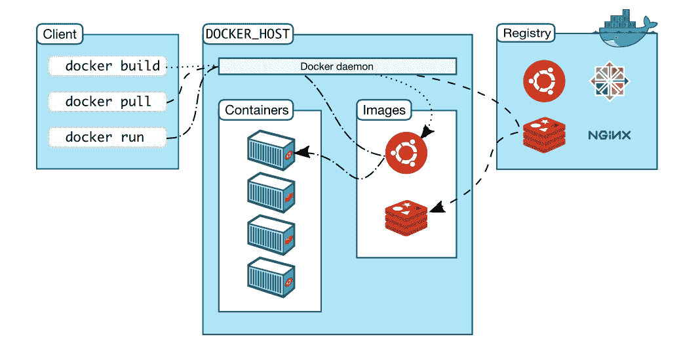

# 五、运行您的私人 Docker 基础设施

在[第 4 章](04.html)、*发布映像、*中，我们讨论了 Docker 映像，并清楚地解释了 Docker 容器是 Docker 映像的运行时实现。随着容器化范式在信息技术领域掀起风暴，Docker 的形象和容器越来越多。因此，出于安全考虑，全球企业需要将其 Docker 映像保存在自己的私有基础架构中。因此，将 Docker Hub 部署到我们自己的基础架构的概念已经出现并发展。Docker 集线器对于注册和存放不断增长的 Docker 映像至关重要。主要是，Docker Hub 专门用于集中管理以下方面的信息:

*   用户帐户
*   映像的校验和
*   公共命名空间

本章的重点是提供所有相关信息，使您和 Docker 容器工匠能够在自己的后院设计、填充和运行自己的私有 Docker 集线器。本章涵盖以下重要主题:

*   Docker 注册表
*   Docker 注册表用例
*   运行您自己的 Docker 注册表并将映像推送到新创建的注册表中
*   webhook 通知
*   docker registry http api 支持

## Docker 注册表

Docker 注册表实现与本书早期版本中提到的早期版本完全不同。Docker 注册表 2.0 是存储和分发 Docker 映像的新实现。它取代了之前的 Docker 注册表实现([https://github.com/docker/docker-registry](https://github.com/docker/docker-registry))。新的实现可在[https://github.com/docker/distribution](https://github.com/docker/distribution)获得。这是 Apache 许可下的开源。注册表是一个无状态的、高度可伸缩的服务器端应用，它存储并允许您分发 Docker 映像。新版本中不推荐使用 Docker 注册表索引。以前，Docker 注册表在内部使用索引来验证用户。

Docker Registry 2.0 在 Go 中完成、新增并实现，支持 Docker Registry HTTP API v2。当前的 Docker Hub([https://hub.docker.com](https://hub.docker.com))基于带有 Docker Engine 1.6 或更高版本的新 Docker 注册表 2.0。这使得它对用户来说更加可靠和透明。所有云提供商都采用了这个新的 Docker 注册表，包括 AWS 和 IBM。

新的注册表实现提供了以下好处:

*   更快的推拉
*   安全高效的实施
*   简化部署
*   可插拔存储后端
*   webhook 通知

如下图所示，Docker Registry 的一般体系结构显示了它如何与前端的 Nginx 和后端的存储集成在一起:



书记官处的突出特点如下:

*   注册表与 Docker Engine 1 . 6 . 0 版或更高版本兼容。
*   默认的存储驱动程序是本地 POSIX 文件系统，它适用于开发或小型部署。它还支持不同的存储后端(S3、微软 Azure、OpenStack Swift 和阿里云 OSS)。
*   它本身支持 TLS 和基本身份验证。
*   在新版本中，注册表还支持强大的通知系统。注册表支持发送 Webhook 通知，以响应注册表中发生的事件。通知是响应清单推拉和层推拉而发送的。这些操作被序列化为事件。事件被排队到注册中心内部的广播系统中，该系统将事件排队并分派到端点([https://docs.docker.com/registry/notifications/#endpoints](https://docs.docker.com/registry/notifications/#endpoints))。

最新的 Docker 注册表发布了两个选项:

*   可信注册表 Docker
*   Docker 注册表

让我们详细谈谈这两个选项:

*   **Docker 可信注册** ( **DTR** ):这是来自 Docker 的企业级解决方案。DTR 支持高可用性，安装在 Docker **通用控制平面** ( **UCP** )集群上。详情可登陆以下网站:
    [https://docs.docker.com/docker-trusted-registry/](https://docs.docker.com/docker-trusted-registry/)。

DTR 支持映像管理，并且内置了安全性和访问控制。还可以与 LDAP、**活动目录** ( **AD** )集成，支持**基于角色的访问控制** ( **RBAC** )。

DTR 的总体架构如下图所示:


DTR 有一个内置的认证机制。在节点上运行的 DTR 由以下容器组成:

*   `dtr-api-<replica_id>`:执行 DTR 业务逻辑。它服务于 DTR 网络应用和应用编程接口。
*   `dtr-garant-<replica_id>`:管理 DTR 认证。
*   `dtr-jobrunner-<replica_id>`:在后台运行清理作业。
*   `dtr-nautilusstore-<replica_id>`:存储安全扫描数据。
*   `dtr-nginx-<replica_id>`:接收 HTTP 和 HTTPS 请求，并将它们代理到其他 DTR 组件。默认情况下，它监听主机的端口`80`和`443`。
*   `dtr-notary-server-<replica_id>`:接收、验证和服务内容信任元数据，并在启用内容信任的情况下推送或拉入 DTR 时进行咨询。
*   `dtr-notary-signer-<replica_id>`:对内容信任元数据进行服务器端时间戳和快照签名。
*   `dtr-registry-<replica_id>`:实现拉推 Docker 图片的功能。它还处理映像的存储方式。
*   `dtr-rethinkdb-<replica_id>`:用于保存存储库元数据的数据库。

DTR 使用以下内部命名卷来保存数据:

*   `dtr-ca`:私钥和证书都存储在这里
*   `dtr-etcd`:etcd 用来存储 DTR 内部配置
*   `dtr-registry`:这是存储映像的体积
*   `dtr-rethink`:这被 RethinkDB 用来保存 DTR 数据，比如用户和存储库

默认情况下，DTR 将映像存储在主机的本地文件系统上。对于高度可用的 DTR 安装，它还支持云存储或网络文件系统。DTR 可以配置为支持亚马逊 S3、OpenStack Swift 和微软 Azure。

*   **Docker 注册表**:注册表是一个无状态的、高度可扩展的服务器端应用，用于存储和分发 Docker 映像。注册是开源的，在许可的阿帕奇许可下([http://en.wikipedia.org/wiki/Apache_License](http://en.wikipedia.org/wiki/Apache_License))。

在本书中，我们将关注开源 Docker 注册表的第二个选项。

## Docker 注册表用例

Docker 注册表存储 Docker 映像，并提供拉、推和删除映像的基本功能。在典型的工作流中，对源代码修订控制系统的提交会触发配置项系统上的构建，如果构建成功，配置项系统会将新映像推送到您的注册表中。然后，来自注册表的通知将触发转移环境上的部署，或者通知其他系统有新映像可用。

当用户需要执行以下操作时，会使用 Docker 注册表:

*   加强对映像保存位置的控制
*   拥有映像分发管道
*   将映像存储和分发与后端开发工作流相集成

注册表的重要用例如下:

*   **拉取或下载镜像**:用户使用 Docker 客户端向 Docker Registry 请求镜像，Registry 反过来用注册表的详细信息回复用户。然后，Docker 客户端将直接请求注册表获取所需的映像。注册表通过内部索引对用户进行身份验证。
*   **推送或上传图片**:用户请求推送图片，获取注册表信息，然后将图片直接推送至注册表。注册表对用户进行身份验证，最后对用户做出响应。
*   **删除映像**:用户也可以请求从库中删除映像。

用户可以选择使用带有或不带有索引的注册表。使用没有索引的注册表最适合存储私有映像。

除了前面的用例，Docker Registry 还支持映像的版本控制。可与**持续集成** ( **CI** )和**持续开发** ( **CD** )系统集成。当新映像成功推送到注册表时，来自注册表的通知将触发转移环境上的部署或通知其他系统有新映像可用。

在 V2 Docker 注册中心，还支持以下新用例:

*   **映像验证** : Docker Engine 希望运行已验证的映像，因此它希望确保映像是从可信来源下载的，并且没有发生篡改。Docker Registry V2 返回一个清单，Docker 引擎在下载映像之前验证清单的签名。下载每一层后，引擎会验证该层的摘要，确保内容符合清单的规定。
*   **可恢复推送**:上传图片到 Docker 注册表时可能会失去网络连接。现在，Docker 注册表能够通知 Docker 引擎文件上传已经开始。因此，Docker Engine 将通过仅发送剩余数据来完成映像上传来做出响应。
*   **可恢复拉取**:下载映像时，连接在完成前中断。Docker 引擎保留部分数据和请求，以避免下载重复的数据。这被实现为 HTTP 范围请求。
*   **图层上传重复数据删除**:Y 公司的构建系统从构建流程 A 和 B 创建两个相同的 Docker 图层，构建流程 A 在 B 之前完成图层上传，当流程 B 尝试上传图层时，注册表表示没有必要，因为图层已经知道了。如果进程 A 和 B 同时上传同一个层，两个操作都将继续，第一个完成的操作将存储在注册表中(注意，我们可能会修改这一点，以通过一些锁定机制来防止狗桩)。

This is the reason why Docker Registry V2 needs Docker Engine version 1.6 or above to support these features.

## 运行 Docker 注册表并推送映像

安装和运行 Docker Registry 相当容易，但是在生产环境中操作还需要其他非功能性需求，例如安全性、可用性和可扩展性。此外，日志记录和日志处理、系统监控和安全 101 是生产级系统所需的功能。正如前面在生产系统中解释的那样，大多数供应商使用 DTR。但是，Docker Registry 足够好，可以在您的非生产环境中使用，最好是在内部网环境中。

在本节中，我们将使用 Ubuntu 14.04 机器来安装、运行和测试 Docker 注册表。Docker Engine 将按照[第 1 章](01.html)、*Docker*入门中所述进行安装。我们将执行以下步骤来运行我们自己的注册表，最后，推送映像:

1.  **在本地主机**上运行 Docker 注册表:与大多数服务器一样，Docker 注册表不需要安装在运行 Docker 客户端的客户端系统上。Docker 注册表可以安装到任何支持 Docker 并且可以通过网络访问的服务器上。因此，多个 Docker 客户端可以访问正在运行的 Docker 注册表。

Docker 注册表接受 TCP 端口`5000`上的连接，因此这不会被您系统中的防火墙阻止。

如果您将大量映像推送到 Docker 注册表，它们会很快填满空间，因此建议您配置足够的空间来保存映像。在本地文件系统上，存储路径通常为`/var/lib/registry`。

2.  **启动注册表**:以下命令从 Docker Hub 下载注册表镜像，在后台启动一个容器:

```
 $ sudo docker run -d -p 5000:5000 \ 
 --restart=always --name registry registry:2 
 Unable to find image 'registry:2' locally 
 2: Pulling from library/registry 
 df53ce740974: Pull complete 
 9ce080a7bfae: Pull complete 
 Digest: 
 sha256:1cfcd718fd8a49fec9ef16496940b962e30e39
 27012e851f99905db55f1f4199 
 Status: Downloaded newer image for registry:2 
 8e5c4b02a43a033ec9f6a38072f58e6b06b87570ba951b3cce5
 d9a031601656e  

```

3.  **检查 Docker 注册表是否在本地主机**上运行:以下命令验证 Docker 注册表是否在本地主机的端口`5000`上启动并运行:

```
 $ sudo docker ps -a 
 CONTAINER ID IMAGE COMMAND 
 CREATED STATUS PORTS 
 NAMES 
 8e5c4b02a43a registry:2 "/entrypoint.sh /etc/" 
 3 minutes ago Up 3 minutes 0.0.0.0:5000->5000/tcp 
 registry 

```

4.  **获取并标记映像**:测试 Docker 最常见的映像是 Docker Hub 提供的`hello-world`映像。从本地注册表中提取映像:

```
 $ sudo docker pull hello-world 
 Using default tag: latest 
 latest: Pulling from library/hello-world 

 c04b14da8d14: Pull complete 
 Digest: 
 sha256:0256e8a36e2070f7bf2d0b0763dbabdd677985124
 11de4cdcf9431a1feb60fd9 
 Status: Downloaded newer image for 
 hello-world:latest 

```

以下命令用`localhost:5000`标记映像:

```
 $ sudo docker tag hello-world 
 localhost:5000/hello-world 

```

最后，本地主机上可用的映像列表如下:

```
 $ sudo docker images 
 REPOSITORY TAG IMAGE ID 
 CREATED SIZE 
 registry 2 541a6732eadb 
 2 days ago 33.3 MB 
 localhost:5000/hello-world latest c54a2cc56cbb 
 12 weeks ago 1.848 kB 
 hello-world latest c54a2cc56cbb 
 12 weeks ago 1.848 kB 

```

5.  **推送映像**:该`hello-world`映像现在可以推送至新创建的 Docker 注册表:

```
 $ sudo docker push localhost:5000/hello-world 
 The push refers to a repository [localhost:5000/
 hello-world] 
 a02596fdd012: Pushed 
 latest: digest: 
 sha256:a18ed77532f6d6781500db650194e0f9396ba5f
 05f8b50d4046b294ae5f83aa4 size: 524 

```

6.  **拉取映像**:这个`hello-world`映像现在可以从新创建的 Docker 注册表中拉取了:

```
 $ sudo docker pull localhost:5000/hello-world 
 Using default tag: latest 
 latest: Pulling from hello-world 

 Digest: 
 sha256:a18ed77532f6d6781500db650194e0f9396ba5f0
 5f8b50d4046b294ae5f83aa4 
 Status: Downloaded newer image for localhost:5000/
 hello-world:latest 

```

7.  **停止 Docker 注册表并删除**:现在使用以下命令停止并删除 Docker 注册表:

```
 $ sudo docker stop registry && sudo docker \ 
 rm -v registry 
 registry 
 registry 

```

8.  **存储** : Docker 注册表将所有注册表数据作为 Docker 卷保留在主机文件系统上。Docker 卷可以安装在`/var/lib/registry`路径上，并使用以下命令指示 Docker 注册表指向该路径:

```
 $ sudo docker run -d -p 5000:5000 \ 
 --restart=always --name registry -v \
 `pwd`/data:/var/lib/registry registry:2 
 Unable to find image 'registry:2' locally 
 2: Pulling from library/registry 
 517dc3530502: Pull complete 
 Digest: sha256:1cfcd718fd8a49fec9ef16496940b962e30e
 3927012e851f99905db55f1f4199 
 Status: Downloaded newer image for registry:2 
 5c0ea3042397720eb487f1c3fdb9103ebb0d149421aa114a
 8c5a9133f775332a 

```

The storage drivers can be configured for `inmemory`, `s3`, `azure`, `swift`, `oss`, and `gcs`: [https://github.com/docker/distribution/blob/master/docs/storage-drivers/index.md](https://github.com/docker/docker.github.io/blob/master/registry/storage-drivers/index.md).

## 使用 SSL 证书在本地主机上运行 Docker 注册表

在本节中，我们将模拟使用 SSL 安全运行 Docker 注册表的概念。在本地主机上运行 Docker 注册表的当前场景中，需要使用 TLS 保护 Docker 引擎。

按照以下步骤安全运行 Docker 注册表:

1.  **获取证书**:我们将对 TLS 证书使用自签名证书。首先创建`certs`目录，然后运行`openssl`命令:

```
 $ mkdir certs
 $ openssl req -newkey rsa:4096 -nodes -sha256 \ 
 -keyout certs/domain.key -x509 -days 365 -out \ 
 certs/domain.crt 
 Generating a 4096 bit RSA private key 
 .....................++ 
 ........................................
 .........++ 
 writing new private key to 'certs/domain.key' 
 ----- 
 You are about to be asked to enter information 
 that will be incorporated into your certificate 
 request. 
 What you are about to enter is what is called a 
 Distinguished Name or a DN. 
 There are quite a few fields but you can leave 
 some blank 
 For some fields there will be a default value, 
 If you enter '.', the field will be left blank. 
 ----- 
 Country Name (2 letter code) [AU]:US 
 State or Province Name (full name) [Some-State]: 
 Locality Name (eg, city) []: 
 Organization Name (eg, company) 
 [Internet Widgits Pty Ltd]: 
 Organizational Unit Name (eg, section) []: 
 Common Name (e.g. server FQDN or YOUR name) 
 []:myregistrydomain.com 
 Email Address []: 
 $ 

```

2.  将`certs`目录复制到`/usr/local/share/ca-certificates`路径下的 Ubuntu 16.o4 的证书目录。此路径特定于 Ubuntu (Debian)系统，如果使用红帽系统，您可能需要使用不同的路径:

```
 $ sudo cp certs/domain.crt \
 /usr/local/share/ca-certificates/myregistrydomain.com.crt 
 $ sudo update-ca-certificates

```

同时将`domain.crt`文件复制到`/etc/docker/certs.d/myregistrydomain.com:5000/ca.crt`中。

Ensure to create the `certs.d` and `myregistrydomain.com:5000` directories before running the preceding command.

3.  重新启动 Docker 引擎:

```
 $ sudo service docker restart 

```

4.  Docker 注册表可以在安全模式下启动，如下所示:

```
 $ sudo docker run -d -p 5000:5000 \ 
 --restart=always --name registry \ 
 > -v `pwd`/certs:/certs 
 > -e REGISTRY_HTTP_TLS_CERTIFICATE=
 /certs/domain.crt 
 > -e REGISTRY_HTTP_TLS_KEY=/certs/domain.key 
 > registry:2 
 Unable to find image 'registry:2' locally 
 2: Pulling from library/registry 

 c0cb142e4345: Pull complete 
 a5002dfce871: Pull complete 
 df53ce740974: Pull complete 
 Digest: sha256:1cfcd718fd8a49fec9ef16496940b962e30e
 3927012e851f99905db55f1f4199 
 Status: Downloaded newer image for registry:2 
 d7c41de81343313f6760c2231c037008581adf07acceea
 0b3372ec2c05a5a321 
 $ 

```

5.  现在，您应该能够从远程 Docker 主机推送映像:

```
 docker pull ubuntu 
 docker tag ubuntu myregistrydomain.com:5000/ubuntu 

```

通过添加`127.0.0.1 myregistrydomain.com`更新`/etc/hosts`，将`myregistrydomain.com`指向本地主机(`127.0.0.1`)。

```
 docker push myregistrydomain.com:5000/ubuntu 
 docker pull myregistrydomain.com:5000/ubuntu 

```

## 运行带有限制的 Docker 注册表

Docker 注册表的安全性至关重要。建议您在安全网络中的安全防火墙和**入侵防护系统** ( **IPS** ) / **入侵防御系统** ( **IDS** )后面运行。此外，假设注册管理机构将只接受 HTTPS 的安全连接。除此之外，Docker Registry 还可以提供访问限制，实现这一点的最简单方法是通过基本身份验证。基本身份验证是使用登录名和密码的 web 服务器的标准身份验证:

```
$ mkdir auth
$ sudo docker run --entrypoint htpasswd 
registry:2 -Bbn testvinod testpassword > auth/htpasswd
$

```

这里我们列出了安全访问 Docker 注册表需要完成的步骤:

1.  由于我们在安全模式下运行此注册表，请使用自签名证书并启用 TLS。
2.  此外，重新启动 Docker 进程以获取更新的配置。
3.  现在重新运行注册表，并确保当前运行的注册表已停止:

```
 $ sudo docker run -d -p 5000:5000 --restart=always \
 --name registry \
 > -v `pwd`/auth:/auth 
 > -e "REGISTRY_AUTH=htpasswd" 
 > -e "REGISTRY_AUTH_HTPASSWD_REALM=Registry Realm" 
 > -e REGISTRY_AUTH_HTPASSWD_PATH=/auth/htpasswd 
 > -v `pwd`/certs:/certs 
 > -e REGISTRY_HTTP_TLS_CERTIFICATE=/certs/domain.crt 
 > -e REGISTRY_HTTP_TLS_KEY=/certs/domain.key 
 > registry:2

```

4.  用户需要从远程计算机登录来测试注册表用户身份验证:

```
 $ sudo docker login myregistrydomain.com:5000 
 Username: testuser 
 Password:testpassword 

 Login Succeeded 

```

5.  从远程机器上推拉映像:

```
 $ sudo docker pull ubuntu 
 Using default tag: latest 
 latest: Pulling from library/ubuntu 
 cad964aed91d: Pull complete 
 3a80a22fea63: Pull complete 
 Digest: sha256:28d4c5234db8d5a634d5e621c363d900f8f241240ee0a6a978784c978fe9c737 
 Status: Downloaded newer image for ubuntu:latest 
 ubuntu@ip-172-30-0-126:~$ sudo docker tag ubuntu 
 myregistrydomain.com:5000/ubuntu 
 $ sudo docker push myregistrydomain.com:5000/ubuntu 
 The push refers to a repository 
 [myregistrydomain.com:5000/ubuntu] 
 f215f043863e: Pushed 
 0c291dc95357: Pushed 
 latest: digest: sha256:68ae734b19b499ae57bc8d9dd4c4f90d5ff17cfe801ffbd7b840b120f d61d3b4 size: 1357 
 $ sudo docker rmi myregistrydomain.com:5000/ubuntu 
 Untagged: myregistrydomain.com:5000/ubuntu:latest 
 Untagged: myregistrydomain.com:5000/ubuntu@sha256:68ae734b19b499ae57bc8d9dd4c4f90d5ff17cfe801ffbd7b840b120fd61d3b4 
 $ sudo docker pull myregistrydomain.com:5000/ubuntu 
 Using default tag: latest 
 latest: Pulling from ubuntu 
 Digest: sha256:68ae734b19b499ae57bc8d9dd4c4f90d5ff17cfe801ffbd7b840b120fd61d3b4 
 Status: Downloaded newer image for 
 myregistrydomain.com:5000/ubuntu:latest 

```

## 使用复合 Docker 管理 Docker 注册表

随着 Docker Registry 变得越来越复杂，处理它的配置将是乏味的。因此，强烈建议您使用 Docker Compose。Docker 作曲将在后面的第 8 章、*编排容器*中讨论。

`docker-compose.yml`文件创建如下:

```
registry:
 image: registry:2
 ports:
   - 5000:5000
 environment:
   REGISTRY_HTTP_TLS_CERTIFICATE: /certs/domain.crt
   REGISTRY_HTTP_TLS_KEY: /certs/domain.key
   REGISTRY_AUTH: htpasswd
   REGISTRY_AUTH_HTPASSWD_PATH: /auth/htpasswd
   REGISTRY_AUTH_HTPASSWD_REALM: Registry Realm
 volumes:
   - /path/data:/var/lib/registry
   - /path/certs:/certs
   - /path/auth:/auth

```

现在，运行命令来运行注册表:

```
$ sudo docker-compose up -d 
Creating ubuntu_registry_1  

```

这确保了 Docker 注册表再次启动并运行。

## 负载平衡考虑

在 Docker 注册表的企业部署中，负载平衡器需要在注册表集群之间分配负载。为了使负载平衡器正确工作，我们需要考虑存储驱动程序、HTTP secret 和 Redis 缓存(如果已配置)对于注册表集群是相同的。如果这些参数中的任何一个不同，注册中心将很难处理这些请求。

例如，用于 Docker 映像的存储驱动程序在所有注册表实例中应该是相同的。如果某个特定的装载点被用作文件系统，它应该是可访问的，并连接到所有注册表实例。同样，如果使用 S3 或 IBM 对象存储，注册中心应该能够访问相同的存储资源。上传的 HTTP 秘密坐标在所有实例中也必须相同。实际上，从现在开始，为不同的注册表实例配置不同的 Redis 缓存可能会起作用。然而，这不是一个好的实践，并且就更多的请求被重定向到后端而言，这将是昂贵的。

## webhook 通知

Docker 注册表具有基于注册表活动发送通知的内置功能:


通知通过 HTTP 发送到端点。这个完整的通知是基于收听者和广播者的体系结构。每个端点都有自己的队列，所有操作(推/拉/删除)都会触发事件。这些事件被排队，一旦事件到达队列的末尾，它就会向端点触发一个 HTTP 请求。事件被发送到每个端点，但是顺序没有保证。

事件具有定义良好的 JSON 结构，并作为通知正文发送。一个或多个事件在结构中发送，并被称为**包络**。一个信封可能包含一个或多个事件。注册表还能够接收来自端点的响应。带有 2XX 或 3XX 响应代码的响应被视为有效响应，并被视为已传递的消息。

## docker registry http api 支持

Docker 注册表有一个 HTTP 接口来与 Docker 引擎交互。这用于管理有关 Docker 映像的信息，并支持其分发。

来自 V1 的关键更新是 Docker 映像格式和签名清单概念的一系列变化。新的独立映像清单简化了映像定义并提高了安全性。该规范将建立在这项工作的基础上，利用清单格式的新属性来提高性能，减少带宽使用，并降低后端损坏的可能性。

Docker 注册表 V2 API 的完整文档可在此找到:
[https://github . com/Docker/distribution/blob/master/docs/spec/API . MD .](https://github.com/docker/distribution/blob/master/docs/spec/api.md)

这里讨论了重要的 API:

*   应用编程接口版本检查:

`GET /v2/`: This API provides version support information based on its response statuses.

以下是检查 Docker 注册表 API 版本的`curl`命令:

```
 $ curl -i http://localhost:5000/v2/
 HTTP/1.1 200 OK
 Content-Length: 2
 Content-Type: application/json; charset=utf-8
 Docker-Distribution-Api-Version: registry/2.0
 X-Content-Type-Options: nosniff
 Date: Mon, 21 Nov 2016 18:37:06 GMT

```

支持的错误代码有`401 Unauthorized`和`404 Not Found`。

*   列出存储库:

`GET /v2/_catalog`: This API provides the content of repositories.

以下是获取存储库内容的`curl`命令:

```
 $ curl -i http://localhost:5000/v2/_catalog
 HTTP/1.1 200 OK
 Content-Type: application/json; charset=utf-8
 Docker-Distribution-Api-Version: registry/2.0
 X-Content-Type-Options: nosniff
 Date: Mon, 21 Nov 2016 18:36:42 GMT
 Content-Length: 33
 {"repositories":["hello-world"]}

```

读者可能还记得，在启动 Docker 注册表时，我们只上传了一个文件。

*   拉一个映像:Docker 映像主要由两部分组成——一个 JSON 清单和单独的层文件。

可以使用以下网址提取映像清单:

```
 GET /v2/<name>/manifests/<reference>

```

这里是`curl`命令获取映像清单细节。

```

 curl -i http://localhost:5000/v2/
 hello-world/manifests/latestHTTP/1.1 200 OK
 Content-Length: 2742
 Content-Type: application/vnd.docker.distribution.
 manifest.v1+prettyjws
 Docker-Content-Digest: 
 sha256:f18d040ea7bf47c7ea8f7ff1a8682811cf375
 51c747158e37b9c75f5450e6fac
 Docker-Distribution-Api-Version: registry/2.0
 Date: Mon, 21 Nov 2016 18:54:05 GMT
 {
 "schemaVersion": 1,
 "name": "hello-world",
 "tag": "latest",
 "architecture": "amd64",
 "fsLayers": [
 {
 "blobSum": 
 "sha256:a3ed95caeb02ffe68cdd9fd8440
 6680ae93d633cb16422d00e8a7c22955b46d4"
 },
 {
 "blobSum": 
 "sha256:c04b14da8d1441880ed3fe6106fb2cc
 6fa1c9661846ac0266b8a5ec8edf37b7c"
 }
 ],
 "history": [ 
 }{ 
 "v1Compatibility": "----
 }
 ],
 "signatures":[
 {
 "----------------"
 }
 ]
 }

```

*   提取存储在 blob 中的映像图层:

```
 GET /v2/<name>/blobs/<digest> 

```

这将是一个练习，让读者使用在前面的拉取清单应用编程接口中收到的`<digest>`下载映像。

下表列出了方法和 URIs:

| **方法** | **路径** | **实体** | **描述** |
| `GET` | `/v2/` | 基础 | 检查端点是否实现了 Docker 注册表 API V2 |
| `GET` | `/v2/<name>/tag/list` | 标签 | 获取由名称标识的存储库下的标签 |
| `GET` | `/v2/<name>/manifests/<reference>` | 显示 | 获取由名称和引用标识的清单，其中引用可以是标记或摘要 |
| `PUT` | `/v2/<name>/manifests/<reference>` | 显示 | 将清单通过名称和引用进行标识，其中引用可以是标签或摘要 |
| `Delete` | `/v2/<name>/manifests/<reference>` | 显示 | 删除由名称和引用标识的清单，其中引用可以是标记或摘要 |
| `GET` | `/v2/<name>/blobs/<digest>` | 一滴 | 从由摘要标识的注册表中检索 blob |
| `DELETE` | `/v2/<name>/blobs/<digest>` | 一滴 | 从由摘要标识的注册表中删除 blob |
| `POST` | `/v2/<name>/blobs/uploads` | 启动 blob 上传 | 启动可恢复的 blob 上载；如果成功，将提供上传位置以完成上传 |
| `GET` | `/v2/<name>/blobs/uploads/<uuid>` | Blob 上载 | 检索`uuid`标识的上传状态 |
| `PATCH` | `/v2/<name>/blobs/uploads/<uuid>` | Blob 上载 | 为指定的上载更新数据块 |
| `PUT` | `/v2/<name>/blobs/uploads/<uuid>` | Blob 上载 | 完成`uuid`指定的上传 |
| `DELETE` | `/v2/<name>/blobs/uploads/<uuid>` | Blob 上载 | 取消未完成的上传过程，释放相关资源 |
| `GET` | `/v2/_catalog` | 目录 | 从注册表中检索已排序的 JSON 存储库列表 |

## 摘要

Docker Engine 允许对每一个增值软件解决方案进行容器化、索引化、注册和存储。Docker 是一个很好的工具，可以在任何地方系统地开发、运输、部署和运行容器。虽然`docker.io`可以让你免费上传你的 Docker 作品到它的注册中心，但是你上传到那里的任何东西都是可以公开发现和访问的。创新者和公司并不热衷于此，因此坚持私人 Docker 中心。在本章中，我们以易于理解的方式为您解释了所有步骤、语法和语义。我们展示了如何检索映像来生成 Docker 容器，并描述了如何以安全的方式将我们的映像推送到 Docker 注册表，以便被经过身份验证的开发人员找到和使用。认证和授权机制是整个过程的主要部分，已经详细解释过了。准确地说，这一章是作为建立自己的 Docker 中心的指南而构思和具体化的。随着世界组织对拥有容器化的云表现出模范般的兴趣，私有容器枢纽变得越来越重要。

在这个时间点上，我们知道使用 DTR 的 Docker Hub 和 Docker 开源注册表可以分发和管理 Docker 映像。Docker Hub 和 DTR 都是商业产品，它们将开源注册中心的功能整合到各自的解决方案中。Docker Hub 是一项多租户服务，而 DTR 和开源注册中心为用户提供了在自己的防火墙或专用云环境后托管私有注册中心的选项。

在下一章中，我们将深入容器，这是映像的自然发展。我们将展示运行服务的能力，例如 Docker 容器中的 web 服务器及其与主机和外部世界的交互。