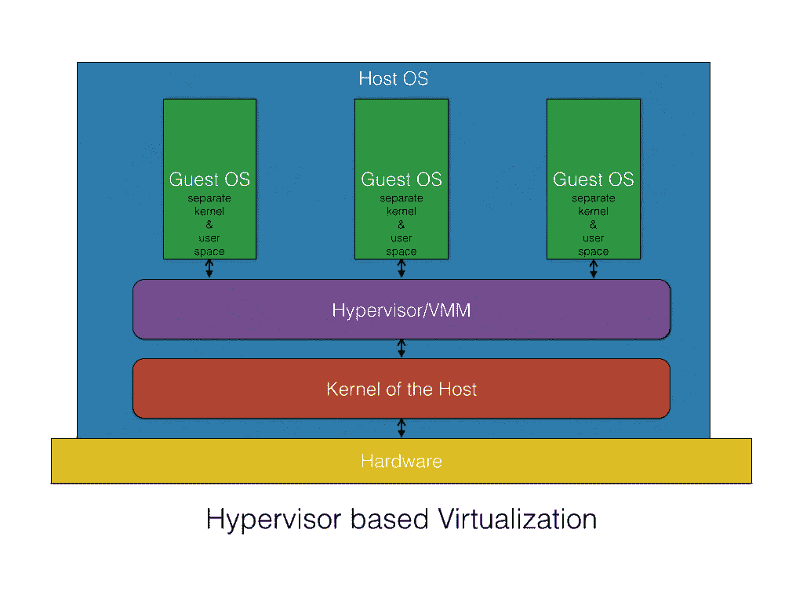

# 保护Docker容器

到目前为止，我们已经在本书中谈了很多关于快速发展的 Docker 技术。如果没有向您详细阐述 Docker 特定的安全问题和解决方法，这就不是一个好的、整洁的结尾。因此，这一章是特别精心制作的，并纳入本书，以解释所有关于Docker启发容器化的安全挑战。我们还想进一步说明如何通过一系列开创性技术、高质量算法、支持工具和最佳实践来解决挥之不去的安全问题。在本章中，我们将详细讨论以下关键主题:

*   Docker容器安全吗？
*   容器的安全特性
*   新兴的安全赋能方法
*   确保容器安全的最佳实践

## 容器化领域的安全场景

几十年来，确保任何信息技术系统和业务服务的安全牢不可破一直是信息技术领域的主要需求和主要挑战之一。聪明的头脑可以识别和利用各种安全漏洞和缺陷(其中一些漏洞和缺陷是在系统概念化和具体化阶段不小心和不知不觉地引入的)。这个漏洞最终会在信息技术服务交付过程中带来无数的漏洞和混乱。有时，系统甚至变得对消费者和客户不可用。

另一方面，安全专家和工程师尝试他们所掌握的各种技巧和技术，以阻止黑客的邪恶之旅。然而，迄今为止，这还不是一场彻底的胜利。到处都有一些来自未知来源的值得注意的入侵，导致非常令人不安的信息技术减速，有时甚至出现故障。因此，全球各地的组织和政府都在安全研究方面投入大量的人才、时间和财富，以彻底消除所有与安全和安全相关的事故和事故。有许多特定于安全的产品供应商和托管安全服务提供商，旨在最大限度地减少信息技术系统上的安全威胁和漏洞带来的不可挽回和无法描述的后果。准确地说，对于任何现有的和新兴的技术，安全性一直是最关键和最关键的方面。这里需要注意的一点是，企业和云信息技术团队不能在满足安全需求方面无忧无虑和自满。

支持 Docker 的容器化代表了从物理的、未充分利用的、封闭的、整体的和单一租赁的 IT 资源到灵活的、开放的、可负担的、自动化的、共享的、面向服务的、最佳利用的和虚拟的 IT 资源的难忘而不屈不挠的旅程中的下一个逻辑步骤。准确地说，我们倾向于软件定义和容器化的云环境，以便获得一系列广泛阐述的业务、技术和用户优势。正如本书多次强调的那样，Docker 容器通常包括文件系统、网络堆栈、进程空间以及在任何地方运行应用程序所需的所有其他东西。这意味着每个 Docker 容器都包括指定的应用程序及其所有依赖项，以独立的方式进行运送、托管和执行。然而，这种广为人知的抽象容易产生新的高级安全攻击、漏洞和漏洞。系统可能变得不可访问，数据集可能被破坏，服务可能被停止，等等。

准确地说，肆虐的 Docker 技术有望彻底改变全球企业开发、部署和管理关键软件应用程序的方式。然而，容器不是万能的。在混合 IT 环境中部署和交付应用程序时，我们面临的同样挑战会在容器中复制。本章指出了减轻容器化引发的安全问题的行之有效的方法。随着云环境的广泛容器化，牢不可破和不可穿透的容器最终保证了安全、可靠和智能的云中心。长期目标是在公众可发现的位置拥有许多健壮、有弹性和有回报的容器。毫无疑问，有一些开创性的工具和平台可以通过混合和协作，从那些可定制、可配置和紧凑的容器中构建更好、更大的容器。

### Docker 容器的安全分支

Docker 技术的迅速普及主要是由于 Docker Inc .与其他相关方合作，引入了一种开放的、具有行业优势的映像格式，用于高效地打包、分发和运行软件应用程序。然而，将许多应用程序塞进一个系统会带来明确的担忧和漏洞:

*   **利用主机内核**:容器共享同一个主机内核，这种共享可能是容器化范例的单点故障。主机内核中的一个缺陷可能允许容器中的一个进程崩溃，导致主机瘫痪。因此，Docker 安全的领域是探索各种选项来限制和控制内核上的攻击面。安全管理员和架构师必须小心翼翼地利用主机操作系统的安全特性来保护内核。
*   **拒绝服务(DoS)攻击**:所有容器都应该共享内核资源。如果一个容器可以独占对某些资源(包括内存和处理)的访问，主机上的其他容器必然会缺乏计算、存储和网络资源。最终，DoS 之谜悄然而至，合法用户将难以访问这些服务。
*   **容器突破**:获得容器访问权限的攻击者不应该能够访问其他容器或主机。默认情况下，用户没有命名空间，因此任何脱离容器的进程在主机上将拥有与容器中相同的权限。也就是说，如果一个进程拥有根权限，那么它在主机上也拥有根权限。这意味着用户可以通过应用程序代码中的 bug 获得提升的甚至是根权限。那么结果就是无法挽回的损失。也就是说，我们需要坚持最小特权:每个进程和容器都应该以最小的访问权限和资源集运行。
*   **中毒映像** : Docker 映像也会受到危害和篡改，导致容器和主机不良。我们写了在存放映像存储库时彻底清洗和管理 Docker 映像的方法。类似地，强有力的访问控制机制已经到位，以减轻映像中毒。

因此，Docker 映像、容器、集群、主机和云必然会受到一连串病毒、恶意软件和其他关键威胁的阻碍。因此，Docker 安全领域最近已经成为研究人员和从业者最具挑战性的领域，我们可以期待在未来的日子里有许多改变游戏规则和增强安全性的算法、方法和表达。

### 安全方面-虚拟机与 Docker 容器

考虑到 Docker 容器的采用和改编一直在增加，Docker 安全性被赋予了首要的重要性。毫无疑问，有很多工作可以确保 Docker 容器的最高安全性，Docker 平台的最新版本嵌入了许多支持安全性的功能。

在本节中，我们将描述就安全纠纷而言，Docker 容器所处的位置。由于容器正在与**虚拟机** ( **虚拟机**)同步进行密切检查，我们将从虚拟机和容器的几个安全相关点开始。让我们从了解虚拟机与容器的区别开始。通常，虚拟机是重量级的，因此会膨胀，而容器是轻量级的，因此是纤细光滑的。下表显示了虚拟机和容器的著名特性:

| **虚拟机** | **容器** |
| 几个虚拟机在一台物理机上一起运行(低密度)。 | 几十个容器可以在单个物理机器或虚拟机上运行(高密度)。 |
| 这确保了虚拟机的完全隔离以确保安全性。 | 这实现了进程级别的隔离，并使用名称空间和 cgroups 等功能提供了额外的隔离。 |
| 每个虚拟机都有自己的操作系统和由底层虚拟机管理程序管理的物理资源。 | 容器与其 Docker 主机共享同一个内核。 |
| 对于网络，虚拟机可以链接到虚拟或物理交换机。虚拟机管理程序有一个用于提高输入/输出性能、网卡绑定等的缓冲区。 | 容器利用标准的 IPC 机制，如信号、管道、套接字等，进行联网。每个容器都有自己的网络堆栈。 |

下图说明了基于虚拟机管理程序的虚拟化如何实现物理机之外的虚拟机:



下图生动地展示了容器化是如何明显偏离基于虚拟机管理程序的虚拟化的:


关于虚拟机和容器安全方面的争论正在升温。有支持其中一个的论点和反论点。在虚拟化范例中，虚拟机管理程序是虚拟机的集中式核心控制器。任何类型的对新调配的虚拟机的访问都需要通过此虚拟机管理程序解决方案，它为任何类型的未经身份验证、未经授权和不道德的目的筑起了一道坚固的墙。因此，与容器相比，虚拟机的攻击面更小。虚拟机管理程序必须被黑客攻击或入侵，才能影响其他虚拟机。这意味着攻击者在能够触及主机内核之前，必须通过虚拟机内核和虚拟机管理程序路由攻击。

与虚拟化范例相反，容器直接放置在主机系统内核的顶部。这种精简而平均的体系结构提供了非常高的效率，因为它完全消除了虚拟机管理程序的仿真层，并且还提供了高得多的容器密度。但是，与虚拟机范例不同，容器范例没有很多层，因此，如果任何容器受到损害，就可以轻松访问主机和其他容器。因此，与虚拟机相比，容器的攻击面更大。

然而，Docker 平台的设计者已经对这种安全风险给予了适当的考虑，并设计了系统来阻止大多数安全风险。在接下来的章节中，我们将讨论系统中天生设计的安全性、为显著增强容器安全性而规定的解决方案，以及最佳实践和指导原则。

### 容器突出的安全实现特征

Linux 容器，尤其是 Docker 容器，天生就有一些有趣的安全实现特性。

如前所述，多克利用大量安全路障阻止越狱。也就是说，如果一个安全机制被破坏，其他机制很快就会以容器被黑客攻击的方式出现。在评估 Docker 容器的安全影响时，需要检查几个主线区域。如前所述，Docker 为容器化的应用程序带来了多种隔离功能，以大幅提高它们的安全性。大多数都是现成的。粒度级别的策略添加、取消和修改功能考虑了容器化的安全要求。Docker 平台允许您执行以下操作:

*   将应用程序相互隔离
*   将应用程序与主机隔离开来
*   通过限制应用程序的功能来提高其安全性
*   鼓励采用最低特权原则

这个开源平台本质上能够为不同运行时环境(如虚拟机、裸机服务器和传统信息技术)上的各种应用程序提供这些隔离。

## 不可改变的基础设施

当您向应用程序部署更新时，您应该创建新的实例(服务器和/或容器)并销毁旧的实例，而不是尝试就地升级它们。一旦你的应用运行了，*你就别碰它！*好处以可重复性、减少管理开销、更容易回滚等形式出现。**不可变映像**是包含运行应用程序所需的一切的映像，因此它包含源代码。Docker 容器的原则之一是映像是不可变的。也就是说，一旦构建，就不可更改，如果要进行更改，结果会得到一个新的映像。

Docker 容器是自给自足的，因此我们只需运行该容器，而无需任何其他麻烦，例如装载卷。这意味着我们可以以更简单透明的方式与用户或合作伙伴共享我们的应用程序。直接的结果是，我们可以使用工具(如 Kubernetes)以自动化的方式轻松扩展我们的系统，这允许我们在一组机器上运行一组容器，也就是一个**集群**。

最后，如果有人试图玩不可变容器，那么不可变容器必然会崩溃，因此对故障的任何操作在初始阶段都是无效的。

### 资源隔离

众所周知，容器正被定位于**微服务架构** ( **MSA** )时代。也就是说，在单个系统中，可以有多个通用和专用服务，它们动态地相互协作，以实现易于维护的分布式应用程序。随着物理系统中服务的多样性和异构性不断攀升，安全性的复杂性自然会激增。因此，需要明确划分和隔离资源，以避免任何危险的安全漏洞。广泛接受的安全方法是利用包括名称空间在内的内核特性。以下是命名空间和 cgroups 的说明:

*   **命名空间**:一个 Linux 命名空间包装了一组系统资源，并将它们呈现给命名空间内的进程，使其看起来像是专用于这些进程的。简而言之，名称空间是一种资源管理工具，有助于为进程隔离系统资源。内核名称空间提供了第一种也是最重要的隔离形式。在一个容器中运行的进程不会影响在另一个容器或主机系统中运行的进程。网络命名空间确保每个容器获得自己的网络堆栈，从而限制对其他容器接口的访问。
*   **cggroups**:这是一个 Linux 内核概念，管理一组进程的系统资源(如 CPU 和内存)的隔离和使用。例如，如果您有一个占用大量 CPU 周期和内存的应用程序，如科学计算应用程序，您可以将该应用程序放在一个 cgroup 中，以限制其 CPU 和内存的使用。它确保了每个容器都获得了公平的内存、中央处理器和磁盘输入/输出份额，更重要的是，单个容器不会因为耗尽其中一个资源而导致系统崩溃。

#### 资源核算和控制

容器消耗不同的物理资源，以便提供其独特的功能。然而，资源消耗必须有纪律、有秩序，并因此受到严格监管。当出现偏差时，容器更有可能无法及时执行分配的任务。例如，如果资源使用没有系统地同步，就会产生 DoS。

Linux 容器利用 cgroups 实现资源核算和审计，以无摩擦的方式运行应用程序。众所周知，有多种资源有助于容器的成功运行。它们提供了许多有用的指标，并确保每个容器都获得其公平份额的内存、中央处理器和磁盘输入/输出。此外，它们还保证单个容器不会因耗尽这些资源中的任何一个而导致系统崩溃。这项功能可以帮助您抵御一些 DoS 攻击。此功能有助于在云环境中作为多租户公民运行容器，以确保其正常运行时间和性能。其他容器的任何形式的利用都会被主动识别并消灭在萌芽状态，从而避免任何形式的意外。

### 根特权-影响和最佳实践

Docker 引擎通过利用最近提到的资源隔离和控制技术，有效地保护容器免受任何恶意活动的影响。尽管如此，Docker 暴露了一些潜在的安全威胁，因为 Docker 守护程序是以根权限运行的。在这一节中，我们列出了一些安全风险和减轻这些风险的最佳实践。

另一个要坚持的重要原则是最小特权。容器中的每个进程都必须以最小的访问权限和资源运行，以便交付其功能。这样做的好处是，如果一个容器遭到破坏，其他资源和数据可以逃脱进一步的攻击。

### 受信任的用户控件

由于 Docker 守护程序以 root 权限运行，因此它能够将 Docker 主机上的任何目录装载到容器中，而不限制任何访问权限。也就是说，您可以启动一个容器，其中`/host`目录将是您的主机上的`/`目录，并且该容器将能够不受任何限制地更改您的主机文件系统。这只是无数恶意使用中的一个例子。考虑到这些活动，Docker 的后几个版本限制了通过 UNIX 套接字对 Docker 守护程序的访问。如果您明确决定这样做，Docker 可以配置为通过 HTTP 上的 REST API 访问守护程序。但是，您应该确保它只能从受信任的网络或虚拟专用网络访问，或者受到 stunnel 和客户端 SSL 证书的保护。你也可以用 HTTPS 和证书来保护他们。

#### 非根容器

如前所述，Docker 容器默认情况下以 root 权限运行，在容器内部运行的应用程序也是如此。从安全角度来看，这是另一个主要问题，因为黑客可以通过黑客攻击容器内运行的应用程序来获得对 Docker 主机的根访问权限。Docker 提供了一个简单而强大的解决方案，将容器的权限更改为非根用户，从而阻止恶意根用户访问 Docker 主机。可以使用`docker run`子命令的`-u`或`--user`选项或`Dockerfile`中的`USER`指令来完成对非根用户的更改。

在本节中，我们将向您展示 Docker 容器的默认根权限，然后使用`Dockerfile`中的`USER`指令继续修改非根用户的根权限。

首先，通过在`docker run`子命令中运行一个简单的`id`命令来演示 Docker 容器的默认根权限，如下所示:

```
$ sudodocker run --rm ubuntu:16.04 id
uid=0(root) gid=0(root) groups=0(root)  

```

现在，让我们执行以下步骤:

1.  创建一个`Dockerfile`，创建一个非根权限用户，并将默认根用户修改为新创建的非根权限用户，如下图所示:

```
      ##########################################
      # Dockerfile to change from root to 
      # non-root privilege
      ###########################################
      # Base image is Ubuntu
      FROM ubuntu:16.04
      # Add a new user "peter" with user id 7373
      RUN useradd -u 7373 peter
      # Change to non-root privilege
      USER peter 

```

2.  使用`docker build`子命令继续构建 Docker 映像，如下图所示:

```
      $ sudo docker build -t nonrootimage .

```

3.  最后，让我们使用`docker run`子命令中的`id`命令来验证容器的当前用户:

```
 $ sudo docker run --rm nonrootimage id
 uid=7373(peter) gid=7373(peter) groups=7373(peter) 

```

显然，容器的用户、组和组现在都变成了非根用户。

将默认根权限修改为非根权限是遏制恶意渗透到 Docker 主机内核的一种非常有效的方式。

到目前为止，我们讨论了独特的安全相关内核特性和功能。大多数安全漏洞可以通过理解和应用这些内核功能来消除。安全专家和倡导者考虑到在生产环境中更快、更广泛地采用盛行的容器化思想，提出了一些额外的安全解决方案，详细描述如下。在开发、部署和交付企业级容器时，开发人员和系统管理员需要高度重视这些安全方法，以消除任何种类的内部或外部安全攻击。

### 用于容器安全性的 SELinux

**安全增强 Linux** ( **SELinux** )是清理 Linux 容器中安全漏洞的勇敢尝试，是 Linux 内核中**强制访问控制** ( **MAC** )机制、**多级安全** ( **MLS** )和**多类别安全** ( **MCS** )的实现。有一个新的合作项目，被称为 sVirt 项目，它是建立在 SELinux 上的，并且正在与 Libvirt 集成，为虚拟机和容器提供一个适应性强的 MAC 框架。这种新的体系结构为容器提供了一个受保护的隔离和安全网，因为它主要防止容器内的根进程与容器外运行的其他进程接口和干扰。Docker 容器被自动分配给 SELinux 策略中指定的 SELinux 上下文。

SELinux 总是在标准**自主访问控制** ( **数模转换器**)被完全检查后检查所有允许的操作。SELinux 可以基于定义的策略，在 Linux 系统中的文件和进程以及它们的操作上建立和实施规则。根据 SELinux 规范，文件，包括目录和设备，被称为对象。类似地，进程，如运行命令的用户，被称为主体。大多数操作系统使用数模转换器系统来控制主体如何与对象以及相互之间的交互。在操作系统上使用 DAC，用户可以控制自己对象的权限。例如，在 Linux 操作系统上，用户可以使他们的主目录可读，给用户和主题一个窃取潜在敏感信息的句柄。然而，单独的数模转换器并不是一种可靠的安全方法，数模转换器的访问决策完全基于用户身份和所有权。通常，数模转换器只是忽略其他安全使能参数，如用户的角色、功能、程序的可信度以及数据的敏感性和完整性。

由于每个用户通常对其文件拥有完全的决定权，因此很难确保系统范围的安全策略。此外，用户运行的每个程序只需继承授予用户的所有权限，用户就可以自由更改对其文件的访问。所有这些导致了对恶意软件的最小保护。许多系统服务和特权程序以粗粒度特权运行，因此这些程序中任何一个的任何缺陷都很容易被利用和扩展，从而获得对系统的灾难性访问。

正如开头提到的，SELinux 将 MAC 添加到了 Linux 内核中。这意味着对象的所有者对对象的访问没有控制权或决定权。内核强制执行 MAC，这是一种通用的 MAC 机制，它需要能够对系统中的所有进程和文件强制执行管理性设置的安全策略。这些文件和流程将用于根据包含各种以安全为中心的信息的标签做出决策。

MAC 具有足够保护系统的固有能力。此外，媒体访问控制确保应用程序安全，防止任何故意的黑客攻击和篡改。MAC 还提供了强大的应用程序隔离，因此任何被攻击和被破坏的应用程序都可以单独运行。

接下来是 MCS。它主要用于保护容器免受其他容器的影响。也就是说，任何受影响的容器都没有能力关闭同一 Docker 主机中的其他容器。MCS 基于 MLS 功能，并且独特地利用了 SELinux 标签的最后一个组件*MLS 字段*。一般来说，当容器启动时，Docker 守护程序会挑选一个随机的 MCS 标签。Docker 守护进程用 MCS 标签标记容器中的所有内容。当守护进程启动容器进程时，它告诉内核用相同的 MCS 标签来标记进程。内核只允许容器进程读/写它们自己的内容，只要它们的 MCS 标签与文件系统内容的 MCS 标签匹配。内核阻止容器进程读取/写入标有不同 MCS 标签的内容。这样，被黑客攻击的容器进程就不会攻击不同的容器。Docker 守护程序负责保证没有容器使用相同的 MCS 标签。通过熟练使用 MCS，容器之间的错误级联被禁止。

Ubuntu 16.04 中默认不安装 SELinux，不像 Red Hat Fedora 或 CentOS 发行版，所以通过运行`apt-get`命令安装 SELinux，如下图所示:

```
$ sudo apt-get install selinux

```

然后通过运行以下`sed`脚本继续启用 SELinux 模式:

```
$ sudo sed -i 's/SELINUX=.*/SELINUX=enforcing/' /etc/selinux/config
$ sudo sed -i 's/SELINUXTYPE=.*/SELINUXTYPE=default/' \
/etc/selinux/config  

```

**应用装甲**(**appamor**)是一个高效易用的 Linux 应用安全系统。AppArmor 主动保护操作系统和应用程序免受任何外部或内部威胁，甚至防止未知的应用程序缺陷被任何黑客滥用。AppArmor 可用于保证 Docker 容器和容器内的应用程序。政策正在成为确保容器安全的有力机制。政策制定和政策的自动执行对保证容器的安全大有帮助。默认情况下，AppArmor 附带了 Ubuntu 16.04，所以总是建议使用这个。

在 Docker 1 . 13 . 0 和更高版本上，Docker 二进制文件在 TMPFS 中生成这个概要文件，然后将其加载到内核中。在 1.13.0 之前的 Docker 版本中，该配置文件改为在`/etc/apparmor.d/docker`中生成。

`docker-default`配置文件是运行容器的默认配置文件。它具有适度的保护性，同时提供广泛的应用程序兼容性。当你运行一个容器时，它使用`docker-default`策略，除非你用`security-opt`选项覆盖它。例如，下面明确指定了默认策略:

```
$ docker run --rm -it --security-opt \
 apparmor=docker-default hello-world

```

**安全计算模式** ( **seccomp** )由 Docker Engine 支持，这是 Linux 内核中提供的一项安全功能。这允许管理员将容器内可用的操作限制到单个系统调用的粒度。这种能力极大地限制了应用程序容器对主机系统执行操作的访问。企业可以相应地配置 seccomp 配置文件，并将其应用于 Docker 环境。

默认的 seccomp 配置文件为使用 seccomp 运行容器提供了一个合理的默认值，并禁用了 300 多个系统调用中的大约 44 个。它具有适度的保护性，同时提供广泛的应用程序兼容性。

绝大多数应用程序都能够在默认配置文件没有任何问题的情况下运行。事实上，默认配置文件已经能够主动保护 Dockerized 应用程序免受几个以前未知的错误的影响。

默认情况下，在 Ubuntu 16.04 上启用此功能:

```
$ cat /boot/config-`uname -r` | grep CONFIG_SECCOMP= CONFIG_SECCOMP=y

```

**SCONE:采用英特尔 SGX** 的安全 Linux 容器，被 Sergei Arnautov 和他的团队描述为 Docker 的安全容器机制，它使用英特尔 CPU 的 SGX 可信执行支持来保护容器进程免受外部攻击。SCONE 的设计目标固定如下:

*   首先，它获得了小型**可信计算基础** ( **TCB** )
*   其次，它必须具有低性能开销

SCONE 提供了一个安全的 C 标准库接口，可以透明地加密/解密 I/O 数据，从而显著降低 SGX 飞地内线程同步和系统调用的性能影响。SCONE 支持用户级线程和异步系统调用。根据他们的研究论文，SCONE 的评价很受 Docker 粉丝的赞赏。

#### 加载 Docker 映像及其安全影响

Docker 通常会从网络中提取映像，这些映像通常会在源位置进行精选和验证。但是，出于备份和恢复的目的，可以使用`docker save`子命令保存 Docker 映像，并使用`docker load`子命令加载回。这种机制也可以用来通过非常规手段加载第三方映像。不幸的是，在这样的实践中，Docker 引擎无法验证来源，因此映像可能携带恶意代码。因此，作为安全的第一道屏障，Docker 在一个*色的*子流程中提取映像进行权限分离。即使 Docker 确保了权限分离，也不建议加载任意映像。

**使用容器扫描来保护 Docker 部署** : **Docker 内容信任** ( **DCT** )为出版商提供了一种简单快捷的方法来保证在 Docker Hub 等网络级存储库中发布的容器的真实性。但是，组织需要采取务实的措施来访问、评估和采取相应的行动，以确保其容器化应用程序在其整个生命周期中的安全性。准确地说，离散余弦变换是一种方法，通过它您可以安全地签署您创建的 Docker 映像，以确保它们来自他们所说的来源。

**使用黑鸭 Hub 管理容器安全性**:黑鸭 Hub 是在整个应用程序生命周期中管理应用程序容器安全性的重要工具。Black Duck Hub 允许组织识别和跟踪其环境中易受攻击的开源应用程序和组件。评估利用了 Black Duck 的知识库，其中包含 110 万个开源项目的信息，以及超过 3500 亿行代码中超过 10 万个已知开源漏洞的详细数据。通过与红帽的合作，黑鸭识别和清点开源和专有代码生产环境的能力现在正被应用于容器化环境。红帽推出了**深度容器检测** ( **DCI** )，这是一款以企业为中心的产品，将容器认证、政策和信任融入到部署和管理应用程序容器的整体架构中。作为 DCI 的一部分，红帽与黑鸭合作，为组织提供了一种在部署之前、期间和之后验证容器内容的方法。

集成 Black Duck Hub 的漏洞扫描和映射功能使 OpenShift 客户能够更加自信和安全地消费、开发和运行容器化应用程序，因为他们知道这些应用程序包含经过独立验证和认证的代码。该集成还提供了一种方法来跟踪新披露的漏洞或与容器老化相关的可能影响安全性和风险的变更的影响。Black Duck Hub 的应用程序漏洞扫描和映射功能使 Docker 客户能够在部署前后识别漏洞，并发现随着容器化应用程序老化或暴露于新的安全漏洞和攻击而出现的问题。

### 使用 TUF 进行映像签名和验证

Docker 社区希望对 Docker 化软件的代码和版本有一个强有力的加密保证。DCT 是与 Docker 平台的 1.8 版本相关联的新的安全相关功能。DCT 本质上将**更新框架** ( **TUF** )集成到 Docker 中，使用了一个开源工具——公证人，它提供了对任何内容的信任。

TUF 帮助开发人员保护新的或现有的软件更新系统，这些系统经常容易受到许多已知攻击。TUF 通过提供一个全面而灵活的安全框架来解决这个普遍存在的问题，开发人员可以将其与任何软件更新系统集成。软件更新系统是在客户端系统上运行的应用程序，用于获取和安装软件。这可以包括对已经安装的软件的更新，甚至是全新的软件。

**防止映像伪造**:一旦建立信任，DCT 就提供了抵御具有特权网络位置的恶意演员的能力，也称为**中间人** ( **MitM** )攻击。

**防止重放攻击**:在典型的重放攻击中，以前有效的有效载荷被重放以欺骗另一个系统。在软件更新系统的情况下，旧版本的签名软件可以作为最新版本出现。如果用户被骗安装了特定软件的旧版本，恶意行为者可以利用已知的安全漏洞危害用户**的主机。DCT 在发布映像时使用时间戳密钥，提供防止重放攻击的保护。这确保了用户收到的是最新的。**

 ****防止密钥泄露**:如果密钥泄露，您可以利用该离线密钥执行密钥轮换。该密钥轮换只能由具有离线密钥的密钥来完成。在这种情况下，您需要创建一个新的密钥，并使用您的离线密钥对其进行签名。

其他加强安全的项目包括:

*   **Clair** :这是一个开源项目，针对应用 Docker 容器([https://github.com/coreos/clair](https://github.com/coreos/clair))中的漏洞进行静态分析。它在本地审核 Docker 映像，并检查容器注册表集成中的漏洞。最后，在第一次运行期间，Clair 将使用来自其数据源的漏洞数据引导其数据库。
*   **公证**:Docker 公证项目是一个框架，允许任何人通过潜在的不安全网络安全地发布和访问内容(例如，Docker 映像)。公证允许用户对内容进行数字签名和验证。
*   **鹦鹉螺项目**:鹦鹉螺是 Docker 的映像扫描功能，可以在 Docker Hub 中检查映像，帮助发现 Docker 容器中可能存在的漏洞。如今，鹦鹉螺只与 Docker Hub 一起工作。它不支持私有或内部注册。
*   **AuthZ Plugins** :原生 Docker 访问控制是全有或全无——你要么可以访问所有 Docker 资源，要么不可以。AuthZ 框架是 Twistlock 对 Docker 代码库的贡献。AuthZ 允许任何人为 Docker 编写授权插件，以提供对 Docker 资源的细粒度访问控制。
*   **Docker 可信注册** ( **DTR** ):这是 Docker 的企业版 Docker Hub。您可以在内部或虚拟私有云中运行 DTR，以支持安全性或合规性要求。Docker Hub 是开源的，而 DTR 是 Docker 销售的基于订阅的产品。与注册管理机构的通信使用顶级域名系统，以确保机密性和内容完整性。默认情况下，使用公共公钥基础设施信任的证书是强制性的，但是 Docker 允许将公司内部 CA 根证书添加到信任存储中。

### 新兴的安全方法

众所周知，Docker 平台使开发人员可以轻松地更新和控制容器中的数据和软件。同样，Docker 能够有效地确保构成应用程序的所有组件始终是最新的和一致的。Docker 还天生提供了在同一物理主机上运行的应用程序的逻辑隔离。这种著名的隔离完美地促进了安全策略的细粒度和高效实施。然而，与传统环境一样，静态数据容易受到来自网络和内部攻击者的各种攻击。Docker 环境遭受猛烈轰炸还有其他负面机会和可能性。因此，人们坚持要有适当的保障措施。容器和数据更快、更容易的扩散可以显著扩大以容器化云为目标的威胁数量和类型。

About Vormetric transparent encryption
Organizations can establish strong controls around their sensitive data in Docker implementations in an efficient manner. This solution enables data-at-rest encryption, privileged user access control, and the collection of security intelligence logs for structured databases and unstructured files. With these capabilities, organizations can establish persistent, strong controls around their stored Docker images and protect all data generated by Docker containers when the data is being written to the Docker host storage on an NFS mount or a local folder.

## 容器安全的最佳实践

有强大而有弹性的安全解决方案来增强提供商和用户的信心，让他们能够清晰、敏捷地迎接容器化的旅程。在本节中，我们提供了从不同来源收集的许多提示、最佳实践和关键指南，以便安全管理员和顾问能够严密保护 Docker 容器。归根结底，如果容器在多租户系统中运行，而您没有使用经过验证的安全实践，那么在安全方面肯定存在潜在的危险。

首要的建议是，不要在你的系统上运行随机的和未经测试的 Docker 映像。制定策略并利用 Docker 映像和容器的可信存储库，以订阅和使用应用程序和数据容器进行应用程序开发、打包、运输、部署和交付。从过去的经验来看，任何从公共领域下载的不受信任的容器都可能导致恶意和混乱的情况。Linux 发行版，如**红帽企业版 Linux** ( **RHEL** )具有以下机制，以帮助管理员确保最高的安全性。

Docker 专家(丹尼尔·沃尔什咨询工程师，红帽)广泛推荐的最佳实践如下:

*   仅运行来自受信任方的容器映像
*   只要有可能，容器应用程序就应该放弃特权或在没有特权的情况下运行
*   确保内核总是用最新的安全修复程序更新；安全内核至关重要
*   确保有支持团队在关注内核中的安全缺陷
*   使用高质量支持的主机系统来运行容器，并定期进行安全更新
*   不要禁用主机操作系统的安全功能
*   检查您的容器映像是否存在安全缺陷，并确保提供商及时修复它们

如前所述，最大的问题是 Linux 中的所有东西都没有命名空间。目前，Docker 使用五个名称空间来改变任何系统的进程视图:进程、网络、挂载、主机名和共享内存。虽然这些为用户提供了一定程度的安全性，但绝不是全面的安全性，如 KVM。在 KVM 环境中，虚拟机中的进程不直接与主机内核对话。他们不能访问内核文件系统。设备节点可以与虚拟机内核对话，而不是与主机对话。因此，为了在虚拟机之外进行权限升级，该过程必须颠覆虚拟机的内核，在虚拟机管理程序中找到启用漏洞，突破 SELinux 控件(sVirt)，并攻击主机的内核。在容器环境中，方法是保护主机免受容器内进程的影响，并保护容器免受其他容器的影响。它是关于将多个安全控件组合或聚集在一起，以保护容器及其内容。

基本上，我们希望设置尽可能多的安全屏障，以防止任何形式的爆发。如果一个特权进程可以突破一个遏制机制，那么这个想法就是用层次结构中的下一个障碍来阻止它们。有了 Docker，就有可能利用尽可能多的 Linux 安全机制。以下是可能采取的安全措施:

*   **文件系统保护**:文件系统需要是只读的，以避免任何未经授权的写入。也就是说，特权容器进程不能写入它们，也不会影响主机系统。通常，大多数应用程序不需要向它们的文件系统写任何东西。有几种带有只读文件系统的 Linux 发行版。因此，可以阻止特权容器进程以读写方式重新装载文件系统。这完全是为了阻止在容器中装载任何文件系统的能力。
*   **写时拷贝文件系统** : Docker 一直在使用**高级多层统一文件系统** ( **AUFS** )作为容器的文件系统。AUFS 是一个分层的文件系统，可以透明地覆盖一个或多个现有的文件系统。当一个进程需要修改一个文件时，AUFS 首先创建该文件的一个副本，并且能够将多个层合并成一个文件系统的单一表示。这个过程被称为写时复制，这可以防止一个容器看到另一个容器的变化，即使它们写入相同的文件系统映像。一个容器不能更改映像内容来影响另一个容器中的进程。
*   **能力的选择**:通常有两种方式进行权限检查:特权进程和非特权进程。特权进程会绕过各种内核权限检查，而非特权进程会根据进程的凭据接受完全权限检查。最近的 Linux 内核将传统上与超级用户相关的特权划分为不同的单元，称为**功能**，可以独立启用和禁用。功能是每个线程的属性。移除功能会给 Docker 容器带来一些积极的变化。能力总是决定着 Docker 的功能、可访问性、可用性、安全性等等。因此，在开始添加和删除功能的旅程时，它需要更深入的思考。
*   **保持系统和数据安全**:在企业和服务提供商在生产环境中使用容器之前，需要解决一些安全问题。由于以下三个原因，容器化最终将使保护应用程序变得更加容易:

信息技术部门负责与基础设施相关的安全缺陷。应用程序团队修复容器内部的缺陷，并负责运行时依赖关系。缓解 IT 和应用程序开发团队之间的紧张关系有助于平稳过渡到混合云模式。为了保护容器和它们的运行时基础设施，每个团队的职责都有明确的划分。有了这样一个清晰的隔离，主动识别任何可见和不可见的危及安全的考验，并迅速消除时间，政策工程和执行，精确和完美的配置，利用适当的安全挖掘和缓解工具，等等，正在系统地完成。

*   **利用 Linux 内核功能**:一台普通的服务器(裸机或虚拟机)需要以 root 身份运行一堆进程。这些工具通常包括`ssh`、`cron`、`syslogd`、硬件管理工具(例如，加载模块)和网络配置工具(例如，处理 DHCP、WPA 或 VPN)。容器与众不同，因为几乎所有这些任务都是由承载和运行容器的基础设施来处理的。由安全专家撰写的各种博客中有一些最佳实践、关键指南、技术诀窍等。您可以在[https://docs.docker.com/](https://docs.docker.com/)找到一些最有趣、最鼓舞人心的安全相关细节。

### Docker 容器的安全部署指南

Docker 容器越来越多地托管在生产环境中，供许多人公开发现和使用。特别是，随着云技术的更快采用，全球组织和机构的 IT 环境正在得到有条不紊的优化和转变，以灵活、果断地托管更广泛的虚拟机和容器。为了加快将容器带到云环境(私有、公共、混合和社区)的过程，有了新的改进和实现，例如 Flocker 和 Clocker。部署容器时必须遵循一些建议。众所周知，容器允许开发人员和系统管理员无缝部署业务运营所需的应用程序和服务的容器，从而显著降低了开销。但是，由于 Docker 利用与主机系统相同的内核来减少对资源的需求，因此如果配置不当，容器可能会面临重大的安全风险。在部署容器时，开发人员和系统管理员都需要严格遵循一些经过仔细注释的准则。例如，[https://github . com/gdssesecurity/Docker-Secure-Deployment-Guidelines](https://github.com/GDSSecurity/Docker-Secure-Deployment-Guidelines)以表格形式详细阐述了所有正确的细节。

一个不争的事实是，分布式和复杂应用程序中的软件缺陷为智能攻击者和黑客侵入托管关键、机密和客户数据的系统开辟了道路。因此，安全解决方案在信息技术堆栈的所有层中被坚持和根深蒂固，因此，在不同的级别和层出现了许多类型的安全漏洞。例如，外围安全仅解决了部分问题，因为不断变化的要求要求允许员工、客户和合作伙伴访问网络。同样，还有防火墙、入侵检测和防御系统、**应用交付控制器**(**ADC**)、访问控制、多因素身份验证和授权、打补丁等等。然后，为了在传输、持久化和被应用程序使用时保护数据，有加密、隐写术和混合安全模型。所有这些都是反应性和现实的机制，但日益增长的趋势都是关于虚拟企业坚持主动和先发制人的安全方法。随着信息技术趋向于备受期待的虚拟信息技术，安全专家对安全问题和影响给予了额外的重视。

### Docker 安全的未来

在不久的将来，容器化领域将会出现许多值得注意的即兴创作、变革和中断。通过大量的创新和集成，Docker 平台被定位为加强容器化进程的领先平台。以下是通过灵活利用 Docker 技术取得的主要成就:

*   **强化分布式范式**:虽然计算将越来越分布式和联邦化，但 MSA 在 IT 中扮演着非常决定性和更深层的角色。Docker 容器正在成为托管和交付越来越多的微服务的最有效容器。随着容器编排技术和工具获得更大的认可，微服务(特定的和通用的)得到识别、匹配、编排和编排，以形成业务感知的复合服务。
*   **赋能云范式**:云的理念正强烈地吸引着 IT 界，以引入备受推崇的 IT 基础架构合理化、简化、标准化、自动化和优化。抽象和虚拟化概念是云模式空前成功的关键，它们正在渗透到每一种信息技术模块中。最初，它始于服务器虚拟化，现在它完全是关于存储和网络虚拟化。随着我们周围所有技术的进步，人们普遍渴望实现软件定义的基础设施(软件定义的计算、存储和网络)。Docker 引擎是 Docker 平台的核心和关键部分，它被适当地固化，以便为容器在软件定义的环境中运行带来必要的资格，而没有任何障碍。
*   **实现 IT 弹性、可移植性、敏捷性和适应性**:容器正在成为灵活和未来的 IT 构件，带来更多的弹性、多功能性、优雅和柔软性。更快地提供信息技术资源以确保更高的可用性和实时可伸缩性，轻松消除开发和运营团队之间的各种摩擦，保证信息技术的本机性能，实现有组织和优化的信息技术以提高信息技术生产率，等等，这些都是 Docker 容器向更智能的信息技术发展的典范。

容器将是虚拟机和裸机服务器的战略性补充，以带来更深层次的信息技术自动化、加速和增强，从而实现备受宣传和期待的业务敏捷性、自主性和可负担性。

## 摘要

安全绝对是一个挑战，也是不可回避的重要方面。如果一个容器遭到破坏，那么关闭容器主机并不是一件难事。因此，确保容器和主机的安全对于容器化概念的繁荣是不可或缺的，尤其是当信息技术系统的集中化和联盟化在上升的时候。在这一章中，我们特别关注 Docker 容器令人作呕和毁灭性的安全问题，并解释了为承载动态、企业级和任务关键型应用程序的容器提供万无一失的安全解决方案的方式和方法。在即将展开的日子里，将会有新的安全方法和解决方案，以保证 Docker 容器和主机的不可穿透和牢不可破的安全性，因为容器及其内容物的安全性对于服务提供商和消费者来说是至关重要的。**