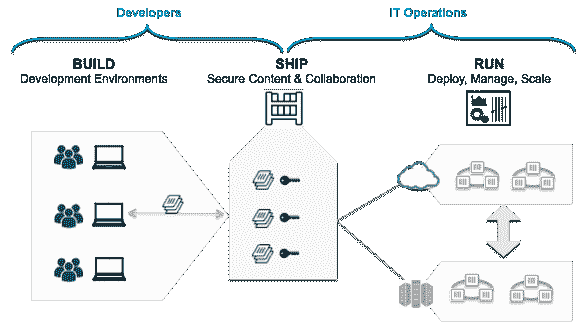

# Docker 平台–独特的功能和用例

毫无疑问，在任何时间点，信息技术都是最具发生性和高度可见性的领域。随着每一种进取型业务(小型、中型和大型)都通过信息技术领域的可喜进步得以实现，信息技术和业务之间存在着直接和决定性的关系。由于世界经济停滞甚至下滑，信息技术预算年复一年地被商业巨头削减，这对信息技术专业人员来说是一个明确的任务和及时的提醒，以更少的资源做更多的事情。也就是说，通过有条不紊地利用成熟且有前途的技术、工具和技巧，继续坚持各种业务操作的更深更灵巧的自动化。通过混合云实现基础架构优化、通过集成和编排技术实现流程卓越、DevOps 文化的快速传播、通过虚拟化和容器化方法实现划分的基础方面、API 的渗透、普及和说服性质、MSA 的快速出现、认知分析等，正被压倒性地认可和收获为实现业务敏捷性、可负担性、适应性和自主性的主要和突出的途径。

由 Docker 支持的容器化是一种经过严格审查的机制，它具有为软件工程领域带来某些关键中断的内在力量。Docker 范例是关于任何种类的软件应用程序及其依赖项的最佳打包，以便在任何内部和外部环境中运送、部署和执行。与软件行业目前可用的选项相比，容器化的应用程序(应用程序及其执行容器)是极其轻量级、可移植、可扩展、可再现和可重复的包。

Docker 的想法促进了许多有目的的创新。Docker(通过其独特的打包格式和高度集成的平台)简化并加速了可公开发现、网络可访问和远程部署的容器化应用程序的形成，这些应用程序易于组装、消费和配置。此外，还有软件解决方案，可以对容器进行可靠的监控、测量和管理。在本章中，我们将讨论 Docker 范式的加速成熟和稳定性如何确保急需的业务转换。文献讨论了 Docker 技术对下一代 IT 的几个改变游戏规则的影响，这一章旨在解开 Docker 之谜。

## 描述容器

包含虚拟化和容器化的划分是信息技术敏捷性的新标准。虚拟化一直是云计算巨大成功的神秘基础。现在，随着容器化思想变得无处不在和可用，人们重新关注使用容器来加快应用程序的构建、部署和交付。集装箱与一些改变游戏规则的能力特别匹配，因此有一股拥抱和发展集装箱化技术和工具的热潮。

集装箱在业内非常热门。本质上，容器是轻量级的、虚拟化的和可移植的，并且软件可以运行的**软件定义环境** ( **SDE** )与运行在同一物理主机上的其他软件是隔离的。在容器内运行的软件通常是一个单一用途的应用程序。容器为 IT 环境带来了令人垂涎的模块化、可移植性和简单性。开发人员喜欢容器是因为他们加快了软件工程的速度，而运营团队喜欢容器是因为他们可以专注于运行时任务，如日志记录、监控、管理生命周期和利用资源，而不是管理部署和依赖关系。

### 区分码头集装箱

确切地说，Docker 容器将一个软件包装在一个完整的文件系统中，该文件系统包含运行所需的一切:源代码、运行时、系统工具和系统库(任何可以安装在服务器上的东西)。这保证了软件将总是运行相同的，不管它的操作环境如何。

Docker支持的集装箱化的主要动机如下:

*   在单台机器上运行的容器共享相同的操作系统内核。它们立即启动，使用更少的内存。容器映像由分层的文件系统构建，并共享公共文件，这使得磁盘使用和映像下载更加高效。
*   Docker 容器基于开放标准。这种标准化使容器能够在所有主要的 Linux 发行版和其他操作系统上运行，如微软视窗和苹果麦金塔。

Docker 容器有几个好处，如下所示:

*   **效率** : 如前所述，一台机器上可以有多个容器利用相同的内核，因此它们是轻量级的，可以立即启动，并更有效地利用内存。

*   **原生性能**:容器由于其重量轻、损耗少，保证了更高的性能。
*   **可移植性**:应用程序、依赖项和配置都捆绑在一个完整的文件系统中，确保应用程序在任何环境(虚拟机、裸机服务器、本地或远程、通用或专用机器等)中无缝工作。这种可移植性的主要优点是可以改变部署之间的运行时依赖关系(甚至编程语言)。

下图说明了如何在多个主机之间移动和交换容器:

*   **Real-** **时间可伸缩性**:可以在几秒钟内调配任意数量的新鲜容器，以应对用户和数据负载。另一方面，当需求下降时，额外供应的容器可以被拆除。这确保了更高的吞吐量和按需容量。Docker Swarm、Kubernetes 和 Apache Mesos 等工具进一步简化了弹性缩放。
*   **高可用性**:通过使用多个容器运行，可以在应用程序中内置冗余。如果一个容器出现故障，幸存的对等体(提供相同的功能)将继续提供服务。通过编排，可以在相同或不同的主机上自动重新创建(重新计划)出现故障的容器，从而恢复全部容量和冗余。
*   **可操作性**:在 Docker 容器中运行的应用程序可以很容易地修改、更新或扩展，而不会影响主机中的其他容器。
*   **灵活性**:开发者可以自由使用自己喜欢的编程语言和开发工具。
*   **集群性**:容器可以根据需要进行特定目的的集群，并且有集成的管理平台来支持和管理集群。
*   **可组合性**:容器中托管的软件服务可以被发现、匹配和链接，以形成业务关键型、流程感知型和复合服务。
*   **安全性**:容器通过为应用程序提供额外的一层保护，将应用程序彼此隔离，并与底层基础架构隔离。
*   **可预测性**:对于不可变的映像，因为代码包含在映像中，所以映像在任何地方总是表现出相同的行为。这在部署和应用程序生命周期管理方面意义重大。
*   **重复性**:使用 Docker，可以构建一个映像，测试该映像，然后在生产中使用该映像。
*   **可复制性**:有了容器，很容易实例化完整应用程序堆栈和配置的相同副本。新员工、合作伙伴、支持团队和其他人可以使用这些工具进行安全的隔离实验。

## 简要介绍 Docker 平台

Linux 容器非常复杂，而且对用户不友好。意识到大量生产和流畅使用容器的过程中存在一些复杂性后，一个开源项目启动了，目标是开发一个复杂的模块化平台，该平台包括一个支持引擎，用于简化和精简各种容器的生命周期阶段。这意味着 Docker 平台被构建为自动化嵌入在轻量级、可扩展和自给自足的容器中的任何软件应用程序的制作、打包、运输、部署和交付。Docker 被定位为实现高性能和企业级分布式应用的最灵活和最具未来感的容器化技术。这将对信息技术行业产生灵活和决定性的影响，因为公司正在构建更小、自定义和可持续、易于管理和离散的应用程序，而不是分布在单个物理或虚拟服务器上的大型单片应用程序。简而言之，为了推动集装箱化运动，服务正在成为微服务。

Docker 平台支持从不同的分布式组件中艺术地组装应用程序，并消除了在运送代码时可能出现的任何类型的缺陷和偏差。Docker 通过大量脚本和工具，简化了软件应用程序的隔离，并通过在临时容器中运行它们来使它们自我维持。Docker 实现了每个应用程序之间以及与底层主机之间所需的分离。我们已经非常习惯于通过额外的间接层形成虚拟机，以实现必要的隔离。这种额外的层和开销消耗了大量宝贵的资源，因此是系统变慢的不想要的原因。另一方面，Docker 容器将所有资源(计算、存储和网络)共享到最佳水平，因此可以运行得更快。Docker 映像是以标准形式导出的，可以广泛共享和存储，以便生产更大更好的应用程序容器。简而言之，Docker 平台为各种信息技术基础设施的最佳消费、管理和可操作性奠定了令人振奋的基础。

Docker 平台是一个开源的容器化解决方案，能够智能、快速地自动将任何软件应用程序和服务捆绑到容器中，并加快容器化应用程序在任何 IT 环境(本地或远程系统、虚拟化或裸机、通用或嵌入式设备等)中的部署。容器生命周期管理任务完全由 Docker 平台负责。整个过程从为已识别的软件及其依赖项形成标准化和优化的映像开始。现在 Docker 平台采用现成的映像来形成容器化的软件。有公开的和私人的映像存储库。开发人员和运营团队可以利用它们以自动化的方式加快软件部署。

为了使 Docker 成为企业级的容器化平台，Docker 生态系统随着大量第三方产品和工具开发人员的加入而迅速发展。它有助于跳过开发环境和特定语言工具的设置和维护。相反，它专注于创建和添加新功能、修复问题和运送软件。“一次建成，随处运行”是Docker支持的集装箱化的流行口号。简而言之，Docker 平台引入了以下能力:

*   **敏捷性**:开发人员有定义环境的自由和创建应用程序的能力。IT 运营团队可以更快地部署应用程序，从而让业务超越竞争对手。
*   **可控性**:开发人员拥有从基础设施到应用的所有代码。
*   **可管理性** : IT 运营团队成员拥有标准化、安全和扩展运营环境的可管理性，同时降低组织的整体成本。

### 不断发展的 Docker 平台组件

Docker 是一个开发、运输和运行强大的分布式微服务应用程序的平台。在 Docker 领域的许多第三方产品供应商和初创公司的持续支持下，该平台处于扩展模式。对于不同的用例，正在构建额外的自动化工具并发布到市场上:

*   坞站集线器
*   可信注册表坞站
*   Docker引擎
*   Kitematic 坞站
*   Docker工具箱
*   坞站注册表
*   Docker机器
*   Docker群
*   复合坞站
*   Docker云
*   数据中心坞站

有了持续的需求，我们可以放心地期待在接下来的日子里对前面的列表进行新的补充。Docker 团队正在积极主动地开发各种工具，以实现所需的自动化和简单性，从而减轻 IT 专业人员的工作量。

## Docker技术的含义

随着 Docker 理念的系统化和智慧化应用，全球范围内有进取心的企业和组织必定会从他们的业务转型需求中受益匪浅。本节将描述 Docker 范例的最重要和潜在的影响。毫无疑问，集装箱是当今的热门话题。企业、服务提供商(云、通信等)和消费者都在追求 Docker 梦想。Docker 一直在为企业和云信息技术创造多方面的印象和影响。Docker 技术的系统杠杆作用肯定会得到加强，为企业带来可喜的进步。

### 现代企业发展

从概念上讲，容器映像可以被认为是可以存储在磁盘上的容器文件系统的快照。容器文件系统通常是分层排列的，每一个变化都在一个单独的层中被仔细捕获。这允许容器映像指示它是从哪个父映像导出的。通过标准化和简化的格式表示的 Docker 映像最终可以导致软件应用程序的快速和有益的部署和执行。容器是便携式的。这意味着构建一次映像并到处运行它们是可移植性目标的关键。容器可以在运行相关操作系统的任何硬件上运行。

也有挑战。由于单个 Docker 主机中可能有许多容器，因此在云环境(私有、公共和混合)中可能会出现容器蔓延的问题。为了进行有效的监控和管理，集群和编排的概念被用来寻找和绑定不同的分布式容器。此外，为了通过容器化应用程序构建分布式应用程序，鼓励通过编排技术进行服务组合。Docker Compose 是制作复合应用程序的关键解决方案。对于容器级的工作，有自动化的监控、测量、管理和编排软件解决方案(Docker Swarm、Kubernetes 和 Mesos)。在接下来的章节中，我们将解释容器如何最适合敏捷和熟练的业务。这并不意味着虚拟化已经过时。在某些情况和场景下，虚拟化和容器化的混合使用会带来奇迹。

将这些特殊功能与容器映像相结合，产生了一个可行且古老的抽象，实现了应用程序与底层操作系统之间的完全隔离。映像和操作系统的这种巧妙分离使得在开发、测试、试运行和生产环境中部署软件应用程序成为可能，没有任何障碍。这种 Docker 支持的一致性和普遍性通过消除各种不一致和不必要的摩擦，提高了部署的可靠性，加快了现代企业的发展。广泛表达的建议是拥有一个气密的容器映像，它可以将应用程序的所有依赖项包含并封装到一个包中。然后可以将其部署到一个容器中，使运输能够随时随地进行。

### MSA 和 Docker 容器

服务支持已经成功地进行了，原因和目标有很多。每个系统(物理的、机械的、电气的和电子的)都系统地启用了易于使用的接口。RESTful 接口和服务因其简单性而变得无处不在。在最近的过去，随着网络、企业、移动和云应用程序的激增，REST 理念显然已经吸引了大量的注意力和吸引力。人们很快发现，将业务功能拆分成可重用的服务是非常有效的；然而，与此同时，它引入了一个风险点。这意味着每次一个服务被更新，那么所有使用更新服务的其他服务都必须接受各种形式的验证和确认。这是因为服务不可避免地必须找到、绑定和利用其他服务及其独特的功能和数据点，才能正确和相关。这种肆无忌惮的共享可以发生在本地，也可以通过网络与远程共享。

简而言之，基本上，微服务方法规定，与其拥有一个所有开发人员都接触过的庞大代码库，管理起来往往会变得很危险，不如由跨不同时区的小型敏捷团队来管理大量更小的代码库。每个代码库都必须通过精心设计和定义的 API 进行互操作。每个代码库的大小都很小，但彼此之间完全解耦。依赖性完全消失了，带来了更好的安全性、可靠性、简单性、可扩展性、可用性等等。代码库被称为微服务。微服务史无前例的起飞动机肯定很多；具体来说，粒度扩展、易管理性、可操作性、可重新配置性和可扩展性、通过 API 访问的强安全性、容器作为最佳运行时环境的适当性等等，都是被广泛阐述的。微服务可以独立部署、水平扩展、由任何后端数据库(SQL、NoSQL、NewSQL、内存等)支持，并由任何编程语言构建。

Docker 容器最适合托管微服务。单个服务或流程的这种有意的容器化使得管理、更新和扩展这些服务变得非常简单。现在，随着任何信息技术环境中微服务数量的快速增长，管理复杂性也在不断增加。这意味着挑战包括如何管理集群中的单个服务，以及如何处理分布在不同主机上的多个服务。Kubernetes、MaestroNG、中间层和 Fleet 的出现满足了这种日益增长的需求。

总之，一个突出的原因是微服务的大量出现和推广，这带来了容器的不可或缺性。通过将微服务填充到容器中，可以实现微服务的各种预期目标。这一有趣的组合必将对全球进取型企业的信息技术团队起到非常重要的作用。实际上，容器化原则的广泛使用已经为特定目的以及不可知的微服务的爆发奠定了令人振奋的基础。

#### 个案研究

南非住房贷款公司在发展和生产中面临挑战。SA 目前有四个 scrum 团队，每个团队都有一个开发和一个系统测试实验室。该团队面临缓慢的部署时间，只能在开发实验室中构建和部署两个应用程序，导致部署周期长，有时需要长达 2 周的时间才能将应用程序转移到测试环境中。这个问题也延伸到了生产。主要的房屋贷款服务软件 monolithic 是使用传统技术构建的。

信息技术团队有意识地决定采用管理服务协议来获得敏捷性、可移植性和可扩展性，这一突破导致了 50 个微服务。了解了 Docker 技术的重要性后，团队可以将所有的微服务转移到容器中。

团队还需要一个生产就绪的编排服务，该服务可以为团队提供一个管理容器和将容器分发到节点上的单点，并为团队提供对所有容器的高级监督。Docker Swarm 是编排工具。SA Home Loans 现在使用 Docker Datacenter，这是一种内部解决方案，通过本地托管的受支持的**容器即服务** ( **CaaS** )平台为企业带来容器管理和部署服务。SA 房屋贷款现在每天最多构建和部署 20-30 次应用程序。**通用控制平面** ( **UCP** )嵌入了 Swarm 来提供生产就绪的容器编排解决方案。

### 基础设施优化

虚拟化已经成为巨大优化和组织各种信息技术基础设施(服务器、存储设备、网络和安全解决方案)的主要机制。通过虚拟机实现的经验证的分治技术是信息技术优化的主要目标。最近，Docker 容器因祸得福。容器只包含构建、运输和运行软件应用程序所必需的东西。与虚拟机不同，容器不需要来宾操作系统或虚拟机管理程序。这使企业能够从根本上减少存储量，并完全消除虚拟机管理程序许可成本。与物理机器中填充的虚拟机数量相比，物理主机或虚拟机中可容纳的容器数量更多。这意味着容器是细粒度的，而虚拟机是粗粒度的。在集装箱化的情况下，资源的浪费非常少。容器正在有条不紊地使用每一点信息技术基础设施和资源。

便携性是另一个因素。这使 IT 运营团队能够跨不同的云服务、物理服务器或虚拟机移动工作负载，而无需将它们锁定在使用特定的基础架构工具。通过容器进行工作负载整合或优化是没有错误的，因为容器可以在任何地方运行。就虚拟机而言，考虑到虚拟机管理程序的多样性/ **虚拟机监视器** ( **虚拟机管理程序**)，虚拟机放置是一件棘手且棘手的事情。这里的要点是，Docker 允许企业优化基础架构利用率并降低维护现有应用程序的成本，这顺便是企业 IT 团队每天面临的头号挑战。

Docker 大大减少了安装应用程序、扩展以满足客户需求或启动新容器所需的时间。这意味着，将新产品推向市场的速度非常快，因为底层基础设施(虚拟或物理)在几秒钟内就准备好了。

#### 个案研究

一个需要建立并提供**数据库即服务**(**【DaaS】**)功能的客户端解决了每个数据库实例都被调配并驻留在其自己的虚拟机中的问题。有时会有 100 个虚拟机运行 100 个数据库。这效率极低，浪费了大量昂贵的资源。现在，相同数量的数据库实例可以在相同数量的容器上运行，而这些容器又可以在几个虚拟机中运行。结果是巨大的成本节约。另一个案例研究如下:

*   **客户详情** : Swisscom 是瑞士领先的电信提供商，提供一系列企业和消费者服务。
*   **业务挑战**:这包括为客户提供可靠、易于维护的 DaaS，同时实现高效运行所需的服务器密度。
*   **解决方案方法**:ClusterHQ 的 Flocker 提供了以编程方式管理存储在 EMC ScaleIO 中的 Docker 容器的持久数据的能力。
*   **业务成果**:该解决方案大幅提升了每台服务器托管的应用密度，改善了数据库的运营管理，为消费者和企业 IT 部门的可持续创新提供了一个令人振奋的闪亮平台。

### 启用 DevOps

如今，为了优雅地确保业务的敏捷性、适应性和可负担性，敏捷开发越来越受到信息技术行业的关注。这意味着，通过严格采用适合信息技术敏捷性的方法，确实实现了非常需要的业务敏捷性。有越来越多可行且古老的机制来实现 IT 敏捷性。首先，信息技术敏捷性是通过敏捷编程方法驱动的，如结对编程、**极限编程** ( **XP** )、精益、Scrum 和看板、**测试驱动开发** ( **TDD** )和**行为驱动开发** ( **BDD** )。

现在软件开发过程显著加快。然而，开发和运营之间有很大的脱节。这意味着，当运营团队也严格遵循敏捷、自适应和自动化的信息技术运营时，真正的信息技术敏捷性就实现了。企业 DevOps 是在开发人员和运营商之间建立有益联系的最有前途的方法，这样 IT 系统可以快速启动和运行。容器化是最积极的发展，它使 DevOps 变得普及、深入和有说服力。

Docker 非常适合快速设置开发和测试环境以及沙盒环境。有趣的是，Docker 为保证效率的 DevOps 提供了更好的关注点分离；容器工匠只需要专注于构建 Docker 映像，并承诺将它们作为容器。运营团队可以监控、管理和维护集装箱。最后，Docker 可以轻松集成到多个 DevOps 工具中，以实现更好的工作流自动化和持续集成。此外，它还使 DevOps 团队能够快速、经济地扩展开发和测试环境，并以无缝的方式将应用程序从开发、测试转移到生产。

### 持续集成和持续部署

**持续集成** ( **CI** )和**持续部署** ( **CD** )是拥有敏捷 IT 最受欢迎的技术和工具。过去，开发人员会使用任何一种构建工具来自动化他们的构建过程。然后，他们将把他们的代码交给操作团队，继续进行部署、管理、管理和支持。有许多配置管理和软件部署工具来自动化软件部署和交付的繁琐和困难的事情。这种隔离模式带来了许多反复出现的问题。使用容器，操作团队可以构建他们想要部署和交付的完整堆栈的标准容器映像。开发人员可以使用它们来部署他们的代码来进行单元测试。相同的经过测试、提炼和强化的映像可以跨所有环境(开发、测试、阶段和生产)使用，以每次获得相同的结果。这种由容器化赞助的设置以无风险的方式加速了软件部署和交付活动。

根据 Docker 网站，CI/CD 通常将开发和测试结合在一起，允许开发人员协作构建代码，将其提交给主分支，并检查任何问题。这意味着开发人员可以构建和测试他们的代码，以便在应用程序开发生命周期的早期捕获 bug。由于 Docker 可以与 Jenkins 和 GitHub 等工具集成，开发人员可以在 GitHub 中提交代码，测试代码，并使用 Jenkins 自动触发构建，一旦映像完成，就可以将其添加到 Docker 注册表中。这最终简化了过程并节省了构建和设置过程的时间，同时允许开发人员并行运行测试并使其自动化，以便他们可以在测试运行时继续处理其他项目。容器化消除了环境依赖性和不一致性。

### 连续交货

**连续交付**方法包括快速的软件开发迭代和对部署的应用程序的频繁、安全的更新。这一切都是为了通过在短期迭代中生产可靠的软件来降低风险和更快地交付价值。因为 Docker 封装了应用程序和应用程序的环境或基础架构配置，所以它为连续交付管道的两个基本方面提供了一个关键的构建块。Docker 使准确测试您将要部署的内容变得很容易。在这种情况下，在切换过程中出现严重错误或带来任何不良变化的可能性较小。Docker 容器鼓励持续交付的核心原则:它们在管道的每个步骤重用相同的二进制文件，以确保在构建过程中不会引入错误。

如前所述，Docker 容器为不可变的基础设施提供了基础。可以添加、删除、克隆应用程序，和/或更改它们的支持者，而不会留下任何残余。IT 基础架构可以在不影响其上运行的应用程序的情况下进行更改。Docker 工具生态系统是增长的轨迹，因此许多与交付相关的工作可以简单地自动化和加速，以增加业务价值。正如马丁·福勒所说，你实际上是在以下情况下进行连续交付的:

*   如果您的软件在其整个生命周期中都是可部署的
*   如果你的团队优先考虑保持软件的可部署性而不是开发新的特性
*   如果任何人在任何时候有人对他们的系统进行更改时，都能获得关于他们的系统生产就绪性的快速、自动化的反馈
*   如果您可以按需将软件的任何版本按下按钮部署到任何环境

Docker 还可以轻松地与 CI 和持续交付平台集成，支持开发和测试，从而为生产提供无缝更新。在任何一种故障的情况下，都有可能回滚到以前的工作版本。

#### 精确测试

Docker 通过创建一个独立于语言、开发工具或环境变量的构建、测试和管理分布式应用程序的通用框架来加速开发。Docker 通过允许开发人员、**质量保证** ( **QA** )团队和系统管理员高效地共享代码、交换内容和集成应用程序来改进协作。我们可以确信，我们的质量保证环境与将在生产环境中部署的环境完全匹配。

#### 促进 CAa

我们一直在摆弄 IT 基础设施和**平台即服务** ( **PaaS** )。裸机服务器和虚拟机是信息技术中心的关键计算资源。现在，随着集装箱的成功扩散，**集装箱即服务** ( **CaaS** )变得非常受欢迎和诱人。传统环境中的平台即服务存在某些问题。CaaS 被吹捧为克服 PaaS 棘手问题的解决方案:

The high-level CaaS architecture

在上图中，左边的开发人员正在从一个可信的和精选的基础映像库中拉取和推送应用程序内容。右侧的运营团队正在监控和管理已部署的应用程序和基础架构。这两个团队可以通过一个工具集进行协作，该工具集允许分离关注点，同时在应用程序生命周期中统一这两个团队。Docker 平台就是这样一个工具集，它能够构建一个符合不同业务需求的 CaaS。

添加新技术组件大大简化。假设一家公司想将 MongoDB 添加到其投资组合中。现在，经过认证的映像可以从 Docker Hub 上下载下来，根据需要进行调整，然后快速部署。然后，这个容器可以提供给开发人员使用。容器也允许更多的实验。由于构建和拆卸容器非常容易，开发人员可以快速比较堆栈组件的特性。例如，一个开发人员想要测试三种不同的 NoSQL 数据库技术的性能，他们可以简单地为每种 NoSQL 技术启动适当的容器，而不必处理管理基础设施和底层技术堆栈的复杂性。然后，开发人员可以对每个不同的容器运行性能测试，并快速选择合适的容器。

就完全抽象底层基础设施而言，容器具有天生的、不可思议的能力来提供类似 JVM 的可移植性。真正的 CaaS 模型是为在多云环境中部署多容器应用程序铺平道路。

### 加快工作负载现代化

有各种各样的工作负载需要进行适当的现代化，并迁移到强大的环境(云)中，以便全球用户能够轻松找到、绑定和使用这些工作负载来生产关键业务应用程序。工作负载通常代表软件应用程序、中间件、平台等。过去，**面向服务架构** ( **SOA** )是通过集成和组合实现软件现代化的推动者。在最近的过去，管理服务协议被吹捧为实现遗留、单一和大规模应用程序现代化的最佳方法。为了便于管理，应用程序被相应地分割开来。随着复杂的应用程序作为可互操作、可移植和可组合的微服务的集合被表达和公开，开发、部署和管理的复杂性预计会下降。这意味着应用程序模块正在被重构，并准备好松散耦合或轻度耦合，甚至解耦。此外，建议应用程序是无状态的，以便可扩展和独立部署。

一些应用程序可以采取“提升和转移”的方式来云。这意味着，如果引入一些代码修改，它们可以被显著重构，以利用云中心的独特优势。这些应用程序正在针对特定的云平台进行重新设计、重新编码和调整用途。这给了遗留应用程序新的生命和新的目的。

容器是托管和交付微服务的高度优化和组织的运行时。容器和微服务在许多方面正成为信息技术领域最重要的组合。使用容器来“包装”或容器化现有的遗留应用程序有几个优点。容器负责底层平台和基础设施以及与之相关的复杂性。容器化的应用程序是可移植的，提高了执行传统现代化的速度。通过使用容器，云迁移变得更加顺畅。安全性、web 和服务支持以及治理等附加功能可以轻松快速地附加到容器化的应用程序中。此外，现代化的遗留应用程序更适合分布式计算。

当我们将当前和传统的应用程序迁移到云中时，实现它们现代化的一个好方法是利用 Kubernetes 和 Mesos 等技术，而不是构建所有的**非功能需求** ( **NFRs** )，例如可扩展性、安全性和可持续性。

#### 有状态应用程序的 Docker

容器通常是无状态的。但是，对于一些应用程序，需要有状态的计算资源。当在主机之间移植这些计算资源时，Docker 不提供本地存储卷管理或数据持久性。ClusterHQ 的 Flocker 解决方案解决了这些需求，并通过在将计算资源从一台主机移动到另一台主机时提供卷管理和数据持久性框架，使容器能够用于有状态的应用程序，如数据库。Flocker 与所有主要的容器管理器(包括 Docker Swarm、Kubernetes 和 Apache Mesos)一起工作。

#### 边缘计算容器

对安全性的担忧以及缺乏可见性和可控性被吹捧为云计算的一个广为人知和公认的缺点。私有云和小云是可行的选择。然而，他们也面临着某些限制。然而，最近的边缘或雾计算现象被认为是克服所有云弱点的最成功的计算范例。

边缘计算就是将数据处理和存储从集中式位置(云)转移到分布式和分散式环境(本地)。这意味着，通过让计算、网络和存储能力更接近用户，服务质量(T0)(**服务质量(T3)】属性/国家森林资源战略就可以轻松且回报丰厚地实现。传统上，所有计算和存储都发生在云环境中(内部和外部)。然而，某些场景，如实时分析和更快的响应，坚持在用户端进行计算。毫不夸张地说，当信息技术变得以人为中心、感知上下文、自适应、实时和多模式时，服务质量和体验会显著提高。现实世界和实时应用程序和服务总是在边缘参与计算。即使对于边缘计算来说，也有一些体系结构上的复杂性，现在随着应用程序和卷容器的更快成熟和稳定性，边缘计算天生就获得了急需的推动力。**

##### 设备联网、服务支持和集群

一般来说，边缘设备，如植入式设备、可穿戴设备、便携式设备、网关、手机、手持设备、消费电子产品和机器人可能主要受到资源限制。这些设备大多不是静态的，通常是流动的。为流程、应用程序和数据集成在它们之间建立无缝连接确实是一件乏味而艰难的事情。因此，边缘设备上的地理分布式计算需要一个轻量级、内在可扩展和智能的平台来处理极其脆弱的服务部署、交付和管理。**开放服务网关接口** ( **OSGi** )是一个有趣的框架，用于优雅地激活和管理资源受限的嵌入式和连接设备及其独特的服务。任何服务或应用程序都可以被容器化，并且可以装载各种各样的参与设备。然后，OSGi 包的一个实例可以被容器化，并托管在用户环境中一个相当强大的设备中，以便发现和管理所有类型的设备及其内部的服务容器。这种设置支持集中(从云中)以及分散的设备服务监控、测量和管理。Dockerized 平台是安装、配置、管理、升级和终止正在运行的服务的成熟机制。

##### 用于发现的设备服务注册表

特定环境中可能有数千个边缘设备。为了以系统的方式发现、索引和管理异构、动态和分布式设备，坚持需要服务注册和发现功能。管理平台必须具备此功能，以便以自动化方式查找、绑定和利用多个设备。

##### 容错

该平台必须具有容错能力，以保证高可用性和可靠性，从而确保业务连续性。

##### 贮藏

可以在边缘设备上执行缓存，以实现更快的访问并提高整体应用程序性能。如果 Docker 映像存储并缓存在边缘，则应用程序供应可以大幅加快。另一个用例是将应用程序数据存储在缓存中，以显著提高应用程序性能。

Bukhary Ikhwan Ismail 和团队已经建立了一个测试平台，以检验 Docker 作为边缘或雾计算的候选技术之一。试验台由一个数据中心和三个边缘站点组成，用于模拟环境。在每个边缘站点，都设置了一个 Docker 注册表，用于在边缘本地存储 Docker 映像。边缘站点的 Docker 守护程序将能够从 Docker 注册表中搜索和提取 Docker 映像。每个边缘站点上都配置了 Docker Swarm 来管理多个 Docker 守护程序。Docker Swarm 充当集群和编排工具。基于实验和评估，发现 Docker 提供了快速部署、小占用空间和良好的性能，这使其成为潜在的可行的边缘计算平台。

马塞尔·格罗斯曼和他的团队开发了 **Hypriot 集群实验室** ( **HCL** )。这是一个基于 ARM 的云解决方案，利用了 Docker。嵌入式系统和其他**单板计算机** ( **单板计算机**)获得了巨大的计算能力。随着设备越来越互联，越来越支持网络，产生了大量的机器数据，越来越需要快速收集和处理这些数据，以便挤出实时见解。如前所述，边缘/雾分析的时代正在快速发展。氯化氢可以为虚拟化边缘提供基础，因为它运行在 ARM 架构上，该架构的行为类似于小型数据中心，并通过设计提供节能功能。

## Docker 用例

集装箱化正在成为软件行业的前进方向，因为它带来了一种更新、更丰富的方式来构建和捆绑任何类型的软件，并在任何地方运输和运行它们。这是容器化快速发展的一个方面，承诺并提供软件可移植性，几十年来，这一直是信息技术开发人员和管理员的麻烦。由于许多有利因素和方面，Docker的想法在这里蓬勃发展。本节是专门为指定 Docker 思想的关键用例而准备的。

### 将容器集成到工作流中

工作流是一种被广泛接受和使用的抽象，用于明确表示任何复杂和大规模业务和科学应用程序的正确细节，并在集群、云和网格等分布式计算系统上执行它们。然而，工作流管理系统在传达底层环境的相关信息方面基本上是回避的，工作流中的任务将在底层环境中运行。这意味着工作流任务可以在为其设计的环境中完美运行。真正的挑战是在多个信息技术环境中运行任务，而不需要调整和扭曲所需任务的源代码。随着异构操作系统、中间件、编程语言和框架、数据库等的利用，信息技术环境越来越异构。通常，工作流系统侧重于任务之间的数据交换，并且是特定于环境的。在一个环境中运行良好的工作流，在不同的 it 环境中迁移和部署时开始崩溃。各种已知和未知的依赖性和不兼容性突然出现，诋毁工作流，延迟了 IT 设置、应用程序安装和配置、部署和交付的整个工作。集装箱是一劳永逸解决这一纠纷的最佳选择。

在文章中，*将容器集成到工作流中:一个使用 Makeflow、Work Queue 和 Docker 的案例研究，郑超*和 *Douglas Thain* 已经很好地分析了几种方法，以便通过实验证明容器在增强工作流/流程管理系统方面的独特贡献。他们探索了在支持 Docker 的集群上大型生物信息学工作负载的性能，并观察了在多个任务之间共享的容器上本地管理的最佳配置。

### 适用于高性能计算和技术合作应用的 Docker

根据道格拉斯·雅各布森和理查德·谢恩·佳能的说法，目前，容器被广泛用于网络、企业、移动和云应用。然而，对于容器是否是托管技术和科学计算应用程序的可行运行时，人们提出了一些问题和疑问。尤其是有很多**高性能计算** ( **HPC** )应用程序都向往一个完美的部署和执行环境。这篇研究论文的作者已经意识到 Docker 容器可能是高性能计算工作负载的完美答案。

在许多情况下，用户希望能够在用于开发或被其社区采用的相同环境中轻松执行他们的科学应用程序和工作流。一些研究人员已经尝试了云选项，但挑战很多。用户需要解决他们如何处理工作负载管理、文件系统和基本资源调配。容器承诺提供云类型系统的灵活性以及裸机系统的性能。此外，容器有可能更容易地集成到传统的高性能计算环境中，这意味着用户可以获得灵活性的好处，而无需管理系统的其他层(即批处理系统、文件系统等)的额外负担。

Minh Thanh Chung 和团队分析了高性能应用程序的虚拟机和容器的性能，并对结果进行了基准测试，结果清楚地表明容器是高性能计算应用程序的下一代运行时。简而言之，Docker 在高性能计算环境中提供了许多有吸引力的优势。为了测试这些，IBM Platform LSF 和 Docker 已经在 LSF 平台的核心之外进行了集成，该集成利用了丰富的 Platform LSF 插件框架。

我们都知道划分的一个方面是资源划分和供应。这意味着物理机器被细分为多个逻辑机器(虚拟机和容器)。现在反过来看，这种由多台物理机器雕刻而成的逻辑系统可以连接在一起，构建一台虚拟超级计算机来解决某些复杂的问题。*于熙贤*和*黄伟城*在研究论文*中描述了他们是如何构建一个虚拟高性能计算集群的。*他们已经将服务发现的自动缩放功能与轻量级虚拟化范例(Docker)相集成，并着手在物理集群硬件上实现虚拟集群。

#### 电信应用容器

*Csaba Rotter 和团队*探索并发表了一篇调查文章，标题为*在电信应用中使用 Linux 容器。*电信应用展现出强大的性能和高可用性需求；因此，在容器中运行它们需要额外的调查**。**电信应用是负责明确定义的任务的单个或多个节点应用。电信应用使用标准化的接口来连接到其他网元并实现标准化的功能。在标准化功能的基础上，电信应用程序可以具有特定于供应商的功能。有一组服务质量和**体验质量** ( **QoE** )属性，如高可用性、容量和性能/吞吐量。这篇论文清楚地阐述了集装箱在下一代电信应用中的独特贡献的原因。

*容错地图的高效原型化-借助 Docker-Hadoop***哈维尔·雷和团队*倡导分布式计算是计算和数据密集型工作负载的前进方向。有两大趋势。数据变大了，人们认识到，通过利用开创性的算法、脚本和并行语言，如 Scala、集成平台、新一代数据库和动态信息技术基础设施，大数据可以带来深刻的见解。MapReduce 是目前用于对海量数据进行计算的并行编程范式。Docker-Hadoop1 是一个虚拟化测试平台，旨在实现 Hadoop 集群的快速部署。使用 Docker-Hadoop，可以控制节点的特性，并运行可伸缩性和性能测试，否则将需要大型计算环境。Docker-Hadoop 有助于模拟和再现不同的故障场景，以验证应用程序。*

 *关于交互式社交媒体应用，阿林·卡里西奇和团队已经发布了一份名为 *OpenStack 和 Docker:为交互式社交媒体应用构建高性能 IaaS 平台*的研究出版物。众所周知，交互式社交媒体应用面临着高效地提供新资源以满足不断增长的应用用户需求的挑战。作者已经给出了 Docker 如何作为虚拟机管理程序运行的必要描述，以及作者如何使用他们开发的`nova-docker`插件来实现开放堆栈 IaaS 内部计算资源的快速供应。

## 摘要

在这个时间点上，Docker 不亚于一场流行病，全球每一家有进取心的企业都痴迷于集装箱化狂热，因为它们极度自动化、转型和颠覆。随着混合信息技术的蓬勃发展，Docker支持的集装箱化的作用正在稳步增长，以智能地增强信息技术支持的业务。在本章中，我们讨论了 Docker 范式的主要功能和贡献。我们描述了一个典型的软件包如何被容器化。此外，您可以遇到工业和企业规模的用例。*