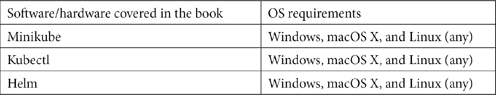

# 前言

目前，集装箱化被认为是实现 DevOps 的最佳方式。当 Docker 引入容器并改变 DevOps 时代时，谷歌开发了一个广泛的容器编排系统 Kubernetes，该系统现在被认为是容器编排领域的领跑者。本书的主要目标是了解使用 Helm 管理运行在 Kubernetes 上的应用程序的效率。这本书将以对 Helm 的简短介绍以及它如何有益于整个容器环境开始。然后，您将深入到架构方面，并了解 Helm 图表及其用例。您将学习如何编写 Helm 图表，以便在 Kubernetes 上自动部署应用程序。该书专注于围绕 Helm 和自动化提供企业就绪模式，涵盖了 Helm 应用程序开发、交付和生命周期管理的最佳实践。到本书结束时，您将知道如何利用 Helm 来开发企业模式，以实现应用程序交付。

# 这本书是给谁的

本书面向对学习 Helm 感兴趣的 Kubernetes 开发人员或管理员，以在 Kubernetes 上围绕应用程序开发提供自动化。Kubernetes 应用程序开发的基础知识将是有用的，但不需要 Helm 的先验知识。推荐自动化提供的业务用例的基础知识。

# 这本书涵盖了什么

*第 1 章**了解库本内斯和赫尔姆*，提供库本内斯和赫尔姆的介绍。您将了解用户在向 Kubernetes 部署应用程序时面临的挑战，以及 Helm 如何帮助简化部署和提高工作效率。

*第 2 章**准备 Kubernetes 和 Helm 环境*，介绍了在本地 Kubernetes 集群上使用 Helm 部署应用程序所需的工具。此外，您还将了解安装后发生的基本 Helm 配置。

*第 3 章*、*安装您的第一个 Helm 图表*，解释了如何通过安装 Helm 图表将应用程序部署到 Kubernetes，并介绍了使用 Helm 部署的应用程序的不同生命周期阶段。

*第 4 章*、*了解掌舵图*，深入探讨掌舵图的构建模块，为你准备构建自己的掌舵图所需的知识。

*第 5 章*、*构建您的第一个掌舵图*，提供构建掌舵图的端到端演练。本章首先介绍了构建 Helm 图表的基本概念，该图表利用了基本的 Helm 结构，然后继续修改基线配置以包含更高级的 Helm 结构。最后，您将学习如何将图表部署到基本的图表存储库中

*第六章*、*测试掌舵图*，围绕林挺和测试掌舵图讨论不同的方法论。

*第 7 章*、*使用 CI/CD 和 GitOps* 自动化掌舵流程，探索了一个利用 CI/CD 和 GitOps 模型来自动化掌舵任务的高级用例。也就是说，围绕测试、打包和发布 Helm 图表开发一个流程。此外，还介绍了跨多个不同环境的 Helm 图表安装管理。

*第 8 章*、*将 Helm 与运算符框架*一起使用，讨论了 Kubernetes 上运算符的基本概念，目的是使用运算符框架提供的运算符-sdk 工具从现有 Helm 图表中构建 Helm 运算符。

*第 9 章*、 *Helm 安全注意事项*深入探讨了使用 Helm 时的一些安全注意事项和注意事项，从工具安装的那一刻起，到它被用来在 Kubernetes 集群上安装 Helm 图表的第二个时刻。

# 为了充分利用这本书

虽然不是强制性的，但由于基本概念在整本书中都有解释，建议对 Kubernetes 和容器技术有所了解。

对于本书通篇使用的工具，第 2-9 章将重点关注以下关键技术:



这些工具的安装将在*第 2 章*、*准备库本内斯和赫尔姆环境*中详细讨论。本书中使用的其他工具是特定于章节的，它们的安装在使用它们的章节中有所描述。

如果您正在使用本书的数字版本，我们建议您自己键入代码或通过 GitHub 存储库访问代码(下一节中提供了链接)。这样做将帮助您避免任何与复制/粘贴代码相关的潜在错误。

# 下载示例代码文件

你可以从你在[www.packt.com](http://packt.com)的账户下载这本书的示例代码文件。如果您在其他地方购买了这本书，您可以访问[www.packtpub.com/support](https://www.packtpub.com/support)并注册将文件直接通过电子邮件发送给您。

您可以按照以下步骤下载代码文件:

1.  登录或注册[www.packt.com](http://packt.com)。
2.  选择“支持”选项卡。
3.  点击代码下载。
4.  在搜索框中输入图书的名称，并按照屏幕指示进行操作。

下载文件后，请确保使用最新版本的解压缩文件夹:

*   视窗系统的 WinRAR/7-Zip
*   zipeg/izp/un ARX for MAC
*   适用于 Linux 的 7-Zip/PeaZip

这本书的代码包也托管在 https://github.com/PacktPublishing/-Learn-Helm 的 GitHub 上。如果代码有更新，它将在现有的 GitHub 存储库中更新。

我们还有来自 https://github.com/PacktPublishing/.丰富的书籍和视频目录的其他代码包，快来看看吧！

## 行动中的代码

这本书的行动代码视频可以在 https://bit.ly/2AEAGvm.观看

## 下载彩色图片

我们还提供了一个 PDF 文件，其中包含本书中使用的截图/图表的彩色图像。可以在这里下载:[http://www . packtpub . com/sites/default/files/downloads/9781839214295 _ color images . pdf](http://www.packtpub.com/sites/default/files/downloads/9781839214295_ColorImages.pdf)。

## 使用的约定

本书通篇使用了许多文本约定。

`Code in text`:表示文本中的码字、数据库表名、文件夹名、文件名、文件扩展名、路径名、虚拟网址、用户输入和推特句柄。下面是一个例子:“将下载的`WebStorm-10*.dmg`磁盘镜像文件作为另一个磁盘挂载到系统中。”

代码块设置如下:

```
html, body, #map {
 height: 100%; 
 margin: 0;
 padding: 0
}
```

当我们希望将您的注意力吸引到代码块的特定部分时，相关的行或项目以粗体显示:

```
[default]
exten => s,1,Dial(Zap/1|30)
exten => s,2,Voicemail(u100)
exten => s,102,Voicemail(b100)
exten => i,1,Voicemail(s0)
```

任何命令行输入或输出都编写如下:

```
$ mkdir css
$ cd css
```

**粗体**:表示一个新的术语，一个重要的单词，或者你在屏幕上看到的单词。例如，菜单或对话框中的单词像这样出现在文本中。这里有一个例子:“从**管理**面板选择**系统信息**

提示或重要注意事项

像这样出现。

# 取得联系

我们随时欢迎读者的反馈。

**一般反馈**:如果您对本书的任何方面有疑问，请在邮件主题中提到书名，并在 customercare@packtpub.com 给我们发邮件。

**勘误表**:虽然我们已经尽了最大的努力来保证内容的准确性，但是错误还是会发生。如果你在这本书里发现了一个错误，如果你能向我们报告，我们将不胜感激。请访问[www.packtpub.com/support/errata](https://www.packtpub.com/support/errata)，选择您的图书，点击勘误表提交链接，并输入详细信息。

**盗版**:如果您在网上遇到任何形式的我们作品的非法拷贝，如果您能提供我们的位置地址或网站名称，我们将不胜感激。请联系我们在 copyright@packt.com 与链接的材料。

**如果你有兴趣成为一名作者**:如果有一个你有专长的话题，你有兴趣写或者投稿一本书，请访问[authors.packtpub.com](http://authors.packtpub.com/)。

# 评论

请留下评论。一旦你阅读并使用了这本书，为什么不在你购买它的网站上留下评论呢？然后，潜在的读者可以看到并使用您不带偏见的意见来做出购买决定，我们在 Packt 可以了解您对我们产品的看法，我们的作者可以看到您对他们的书的反馈。谢谢大家！

更多关于 Packt 的信息，请访问[packt.com](http://packt.com)。