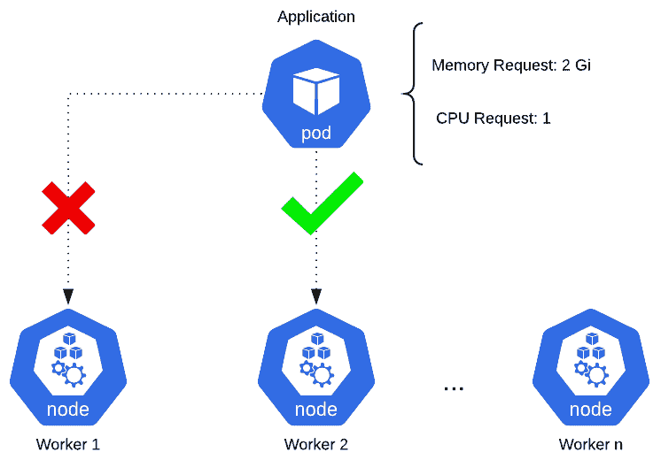
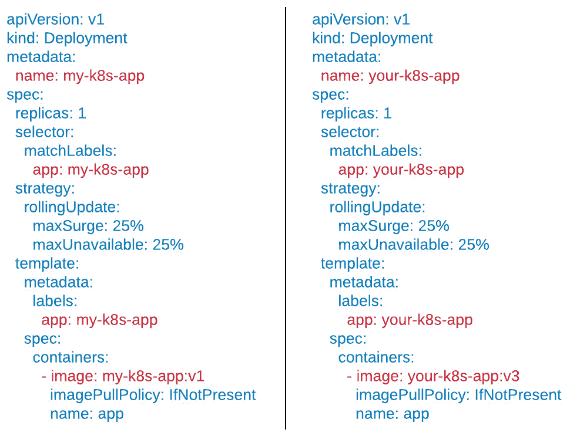
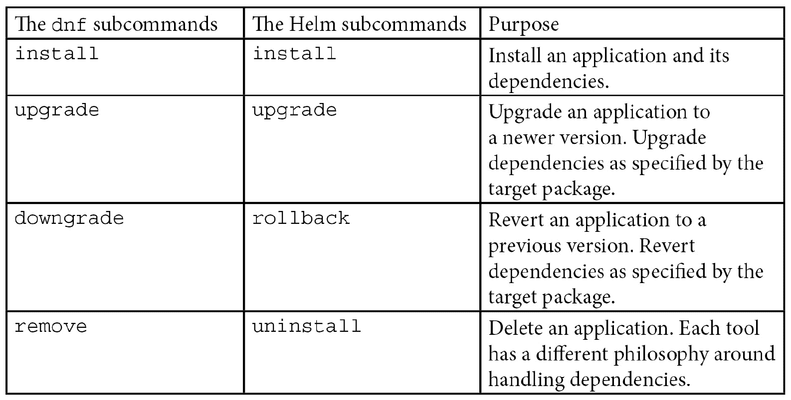
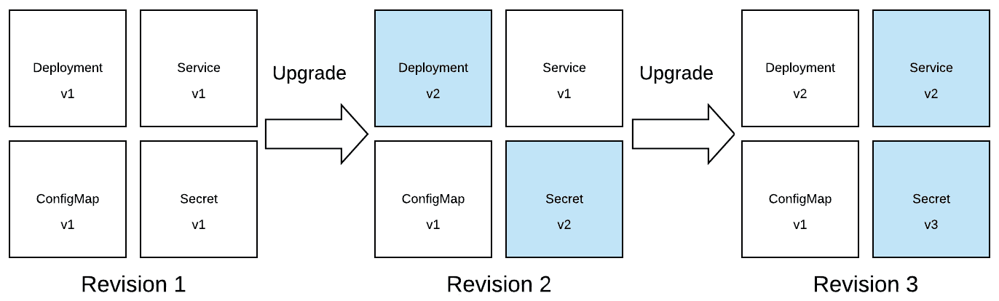

# 一、了解 Kubernetes 和 Helm

感谢您选择本书《学习掌舵》。如果你对这本书感兴趣，你可能会意识到现代应用带来的挑战。团队面临着确保应用轻量级和可伸缩性的巨大压力。应用还必须高度可用，并且能够承受不同的负载。从历史上看，应用通常被部署为单片，或者在单个系统上服务的大型单层应用。随着时间的推移，该行业已经转向微服务方法，或者转向在多个系统上服务的小型多层应用。该行业通常使用容器技术进行部署，已经开始利用 Kubernetes 等工具来编排和扩展他们的容器化微服务。

然而，Kubernetes 也有自己的一系列挑战。虽然它是一个有效的容器编排工具，但它呈现出陡峭的学习曲线，团队很难克服。Helm 是帮助简化在 Kubernetes 上运行工作负载的挑战的一个工具。Helm 允许用户更简单地部署和管理 Kubernetes 应用的生命周期。它抽象了配置 Kubernetes 应用背后的许多复杂性，并允许团队在平台上更有效率。

在本书中，您将探索 Helm 提供的每一项优势，并了解 Helm 如何在 Kubernetes 上简化应用部署。您将首先承担最终用户的角色，使用社区编写的 Helm 图表，并学习将 Helm 作为包管理器的最佳实践。随着这本书的进展，你将扮演一个 Helm 图表开发人员的角色，并学习如何以易于消费和高效的方式打包 Kubernetes 应用。在本书的最后，您将通过 Helm 了解关于应用管理和安全性的高级模式。

让我们首先了解微服务、容器、Kubernetes，以及它们给应用部署带来的挑战。然后，我们将讨论 Helm 的主要特性和优势。在本章中，我们将涵盖以下主要主题:

*   单片、微服务和容器
*   Kubernetes 概述
*   如何部署 Kubernetes 应用
*   配置 Kubernetes 资源的挑战
*   【Helm 为简化 Kubernetes 上的生活应用部署提供的优势

# 从单片到现代微服务

软件应用是大多数现代技术的基础组成部分。无论是文字处理器、网络浏览器还是媒体播放器，它们都支持用户交互来完成一项或多项任务。应用有着悠久而传奇的历史，从第一台通用计算机 ENIAC 的时代，到阿波罗太空任务中的载人登月，再到万维网、社交媒体和在线零售的兴起。

这些应用可以在各种平台和系统上运行。我们说过，在大多数情况下，它们运行在虚拟或物理资源上，但从技术上讲，这些不是唯一的选择吗？根据其用途和资源要求，整个机器可能专用于满足应用的计算和/或存储需求。幸运的是，部分由于摩尔定律的实现，微处理器的功率和性能最初随着时间的推移而增加，同时与物理资源相关的总成本也在增加。近年来，这一趋势已经消退，但这一趋势的出现及其在处理器存在的前 30 年中的持续存在有助于技术的进步。

软件开发人员充分利用了这个机会，在他们的应用中捆绑了更多的特性和组件。因此，单个应用可以由几个较小的组件组成，每个组件都可以独立地编写为各自的服务。最初，将组件捆绑在一起产生了几个好处，包括简化的部署过程。然而，随着行业趋势开始改变，企业更加关注更快速交付功能的能力，单个可部署应用的设计带来了许多挑战。每当需要变更时，需要再次验证整个应用及其所有底层组件，以确保变更没有不利的特性。这个过程可能需要多个团队的协调，这减缓了特性的整体交付。

更快地交付特性，尤其是跨组织内的传统部门交付特性，也是组织想要的。这种快速交付的概念是一种叫做 DevOps 的实践的基础，它的流行大约发生在 2010 年。DevOps 鼓励随着时间的推移对应用进行更多的迭代更改，而不是在开发之前进行广泛的规划。为了在这种新模式中保持可持续性，架构从单一的大型应用发展到支持几个更小的应用，这些应用可以更快地交付。因为这种思维的转变，更传统的应用设计被贴上了**铁板一块**的标签。这种将组件分解成独立应用的新的方法为这些组件创造了名称为**微服务**。微服务应用固有的特性带来了几个理想的特性，包括从一个应用到另一个应用同时开发和部署服务的能力，以及独立扩展(增加实例数量)服务的能力。

软件架构从单片到微服务的变化也导致了重新评估应用在运行时是如何打包和部署的。传统上，整个机器专用于一个或两个应用。现在，由于微服务导致单个应用所需的资源总体减少，将整个机器专用于一个或两个微服务不再可行。

幸运的是，一项名为**容器**的技术被引入，并因填补了创建微服务运行时环境所需的许多缺失功能的空白而广受欢迎。Red Hat 将容器定义为“一组与系统其余部分隔离的一个或多个进程，包括运行所需的所有文件”(https://www . red Hat . com/en/topics/containers/what-a-Linux-container)。容器技术在计算领域有着悠久的历史，可以追溯到 20 世纪 70 年代。许多基础容器技术，包括 **chroot** (能够将进程及其任何子进程的根目录更改到文件系统的新位置)和**监狱**，今天仍在使用。

简单和可移植的打包模型的结合，以及在每个物理或虚拟机上创建许多隔离沙箱的能力，导致了容器在微服务领域的快速采用。2010 年代中期容器受欢迎程度的提高也可以归功于 Docker，它通过简化的包装和可以在 Linux、macOS 和 Windows 上使用的运行时将容器推向大众。轻松分发容器映像的能力导致了容器技术的普及。这是因为首次用户不需要知道如何创建映像，而是可以利用他人创建的现有映像。

容器和微服务成了天作之合。应用具有打包和分发机制，并且能够共享相同的计算空间，同时利用彼此隔离的优势。然而，随着越来越多的容器化微服务被部署，整体管理成为一个关注点。如何确保每个运行容器的健康？如果容器出现故障，你会怎么做？如果您的 0my 底层计算机没有所需的计算能力，会发生什么情况？输入 Kubernetes，这有助于满足容器编排的需求。

在下一节中，我们将讨论 Kubernetes 如何工作并为企业提供价值。

# 什么是魔方？

Kubernetes，通常缩写为 **k8s** (发音为 **kaytes** ，是一个开源容器编排平台。该项目源于谷歌专有的编排工具博格，于 2015 年开源，并更名为 Kubernetes。继 2015 年 7 月 21 日发布 v1.0 之后，谷歌和 Linux 基金会合作成立**云原生计算基金会** ( **CNCF** )，作为 Kubernete 项目的当前维护者。

Kubernetes 这个词是希腊语，意思是“舵手”或“领航员”。舵手是负责驾驶船只的人，与船上的高级船员密切合作，确保安全和稳定的航线，以及船员的整体安全。Kubernetes 在容器和微服务方面也有类似的职责。Kubernetes 负责容器的编排和调度。它负责将这些容器“引导”到能够处理其工作负载的适当工作节点。Kubernetes 还将通过提供高可用性和修复第次检查来帮助确保这些微服务的安全。

让我们回顾一下 Kubernetes 帮助简化容器化工作负载管理的一些方法。

## 容器编排

Kubernetes 最突出的特点是容器编排。这是一个相当复杂的术语，所以我们将把它分成不同的部分。

容器编排是根据需求将容器放置在计算资源池中的特定机器上。容器编排最简单的用例是在能够处理其资源需求的机器上部署容器。在下图中，有一个应用请求 2 Gi 的内存(Kubernetes 资源请求通常使用它们的“二的幂”值，在这种情况下大约相当于 2 GB)和一个 CPU 内核。这意味着容器将从它被调度的底层机器中被分配 2 Gi 的内存和 1 个 CPU 核心。由 Kubernetes 来跟踪哪些机器(在这种情况下称为节点)具有可用的所需资源，并在该机器上放置一个传入容器。如果节点没有足够的资源来满足请求，容器将不会在该节点上被调度。如果集群中的所有节点都没有足够的资源来运行工作负载，则不会部署容器。一旦节点有足够的空闲资源，容器将被部署在具有足够资源的节点上:



图 1.1 - Kubernetes 编排和调度

容器编排使您无需一直努力跟踪机器上的可用资源。Kubernetes 和其他监控工具提供了对这些指标的洞察。因此，日常开发人员不需要担心可用的资源。开发人员可以简单地声明他们期望容器使用的资源量，Kubernetes 将在后端上处理剩余的资源。

## 高可用性

Kubernetes 的另一个好处是，它提供了有助于处理冗余和高可用性的功能。高可用性是防止应用停机的一个特征。这是由负载平衡器执行的，它将传入的流量分配给应用的多个实例。高可用性的前提是，如果应用的一个实例关闭，其他实例仍然可以接受传入的流量。在这方面，避免了停机时间，并且终端用户，无论是人还是另一个微服务，仍然完全不知道应用有一个失败的实例。Kubernetes 提供了一种网络机制，称为服务，允许应用负载平衡。我们将在本章的*部署 Kubernetes 应用*部分更详细地讨论服务。

## 可扩展性

考虑到容器和微服务的轻量级特性，开发人员可以使用 Kubernetes 快速扩展他们的工作负载，包括水平和垂直扩展。

水平扩展是部署更多容器实例的行为。如果在 Kubernetes 上运行工作负载的团队预计负载会增加，他们可以简单地告诉 Kubernetes 部署更多的应用实例。由于 Kubernetes 是一个容器编排器，开发人员不需要担心那些应用将要部署在的物理基础设施。它只需在集群中找到一个具有可用资源的节点，并在那里部署额外的实例。每个额外的实例将被添加到负载平衡池中，这将允许应用继续保持高可用性。

垂直扩展是向应用分配额外内存和 CPU 的行为。开发人员可以在应用运行时修改其资源需求。这将提示 Kubernetes 重新部署正在运行的实例，并在支持新资源需求的节点上重新计划它们。根据配置方式，Kubernetes 可以在部署新实例时，以防止停机的方式重新部署每个实例。

## 活跃社区

Kubernetes 社区是一个非常活跃的开源社区。因此，Kubernetes 经常收到补丁和新功能。该社区还对文档做出了许多贡献，包括官方的 Kubernetes 文档以及专业或业余博客网站。除了文档之外，社区还高度参与规划和参加世界各地的会议和大会，这有助于增加平台的教育和创新。

Kubernetes 大型社区的另一个好处是构建了大量不同的工具来增强所提供的能力。头盔就是其中一种工具。正如我们将在本章后面和本书中看到的，Helm——一个由 Kubernetes 社区成员构建的工具——通过简化应用部署和生命周期管理，极大地改善了开发人员的体验。

了解了 Kubernetes 为管理容器化工作负载带来的好处后，现在让我们讨论如何在 Kubernetes 中部署应用。

# 部署 Kubernetes 应用

在 Kubernetes 上部署应用与在 Kubernetes 之外部署应用基本相似。所有应用，无论是否是容器化的，都必须围绕包括以下内容的主题进行详细配置:

*   建立工作关系网
*   持久存储和文件装载
*   可用性和冗余性
*   应用配置
*   安全

在 Kubernetes 上配置这些细节是通过与 Kubernetes **应用编程接口** ( **应用编程接口**)交互来完成的。

Kubernetes API 充当一组端点，可以通过交互来查看、修改或删除不同的 Kubernetes 资源，其中许多资源用于配置应用的不同细节。

让我们讨论用户可以与之交互的一些基本的应用编程接口端点，以便在 Kubernetes 上部署和配置应用。

## 部署

我们将探索的第一个 Kubernetes 资源是名为部署。部署决定了在 Kubernetes 上部署应用所需的基本细节。这些基本细节之一包括 Kubernetes 应该部署的容器映像。容器映像可以在本地工作站上使用`docker`和`jib`等工具构建，但是映像也可以使用`kaniko`在 Kubernetes 上构建。因为 Kubernetes 没有公开用于构建容器映像的本机 API 端点，所以我们不会详细讨论如何在配置部署资源之前构建容器映像。

除了指定容器映像，部署还指定要部署的应用的副本或实例的数量。创建部署时，它会生成一个中间资源，称为复制集。复制集根据部署上的`replicas`字段决定部署多少个应用实例。应用部署在容器中，容器本身部署在一个名为 Pod 的构造中。Pod 是 Kubernetes 中最小的单元，至少封装了一个容器。

部署还可以定义应用的资源限制、运行状况检查和卷装载。创建部署时，Kubernetes 会创建以下体系结构:


图 1.2 -部署创建了一组 Pods

Kubernetes 中的另一个基本 API 端点用于创建服务资源，这将在下面讨论。

## 服务

虽然部署用于将应用部署到 Kubernetes，但它们不配置允许应用与 Kubernetes 通信的网络组件，而是公开一个单独的 API 端点，用于定义称为服务的网络层。服务允许用户和其他应用通过向服务端点分配静态 IP 地址来相互对话。然后，可以将服务端点配置为将流量路由到一个或多个应用实例。这种配置提供了负载平衡 ng 和高可用性。

下图描述了使用服务的示例体系结构。请注意，该服务位于客户端和 Pods 之间，以提供负载平衡和高可用性:


图 1.3 -服务负载平衡传入的请求

作为最后一个例子，我们将讨论`PersistentVolumeClaim` API 端点。

## 持久性卷索赔

微服务- 风格的应用通过以短暂的方式维护它们的状态来实现自给自足。然而，在许多用例中，数据必须超过单个容器的生命周期。Kubernetes 通过提供一个子系统来抽象如何提供存储以及如何使用存储的底层细节，从而解决了这个问题。为了给他们的应用分配持久存储，用户可以创建一个`PersistentVolumeClaim`端点，它指定所需的存储类型和数量。Kubernetes 管理员负责静态分配存储，表示为`PersistentVolume`，或者使用`StorageClass`动态调配存储，后者响应于`PersistentVolumeClaim`端点分配`PersistentVolume`。`PersistentVolume`捕获所有必要的存储细节，包括类型(如网络文件系统[NFS]、互联网小型计算机系统接口[iSCSI]或来自云提供商)，以及存储大小。从用户的角度来看，无论在集群中使用`PersistentVolume`分配方法还是存储后端的哪种方法，他们都不需要管理存储管理的底层细节。在 Kubernetes 中利用持久存储的能力增加了可以在平台上部署的潜在应用的数量。

下图描述了正在调配的持久性存储的示例。该图假设管理员已经通过`StorageClass`配置了动态供应:


图 1.4 -由持久卷声明创建的装载持久卷的容器

Kubernetes 中有更多的资源，但是到现在，你可能已经得到了图片。现在的问题是这些资源实际上是如何产生的？

我们将在下一节进一步探讨这个问题。

# 资源管理中的方法

为了在 Kubernetes 上部署应用，我们需要与 Kubernetes API 交互来创建资源。`kubectl`是我们用来和 Kubernetes API 对话的工具。`kubectl`是一个**命令行界面** ( **CLI** )工具，用于向最终用户抽象出 Kubernetes API 的复杂性，使他们能够更高效地在平台上工作。

我们来讨论一下`kubectl`如何用来管理 Kubernetes 资源。

## 命令式 和声明式配置

`kubectl`工具提供了系列子命令，以命令方式创建和修改资源。以下是这些命令的小列表:

*   `create`
*   `describe`
*   `edit`
*   `delete`

`kubectl`命令遵循一种通用格式:

```
kubectl <verb> <noun> <arguments>
```

动词指的是`kubectl`子命令之一，名词指的是特定的 Kubernetes 资源。例如，可以运行以下命令来创建部署:

```
kubectl create deployment my-deployment --image=busybox
```

这将指示`kubectl`与部署 API 对话，并使用 Docker Hub 中的 `busybox`映像创建一个名为`my-deployment`的新部署。

您可以使用`kubectl`来获取有关通过使用`describe`子命令创建的部署的更多信息:

```
kubectl describe deployment my-deployment
```

这个命令将检索关于部署的信息，并将结果格式化为可读的格式，允许开发人员检查 Kubernetes 上的实时`my-deployment`部署。

如果需要对部署进行更改，开发人员可以使用`edit`子命令对其进行适当修改:

```
kubectl edit deployment my-deployment
```

该命令将打开一个文本编辑器，允许您修改部署。

删除资源时，用户可以运行`delete`子命令:

```
kubectl delete deployment my-deployment
```

这将指示应用编程接口删除名为`my-deployment`的部署。

Kubernetes 资源一旦创建，就作为 JSON 资源文件存在于集群中，可以作为 YAML 文件导出，以增强可读性。这里可以看到一个 YAML 格式的示例资源:

```
apiVersion: apps/v1
kind: Deployment
metadata:
  name: busybox
spec:
  replicas: 1
  selector:
    matchLabels:
      app: busybox
  template:
    metadata:
      labels:
        app: busybox
    spec:
      containers:
        - name: main
          image: busybox
          args:
            - sleep
            - infinity
```

前面的 YAML 格式提供了一个非常基本的用例。它从 Docker Hub 部署`busybox`映像，并在有限地运行`sleep`命令，以保持 Pod 运行。

虽然使用我们刚刚描述的`kubectl`子命令创建资源可能更容易，但是 Kubernetes 允许您以声明的方式直接管理 YAML 资源，以获得对资源创建的更多控制。`kubectl`子命令并不总是让您配置所有可能的资源选项，但是直接创建 YAML 文件可以让您更灵活地创建资源并填补`kubectl`子命令可能包含的空白。

当以声明方式创建资源时，用户首先用 YAML 格式写出他们想要创建的资源。接下来，他们使用`kubectl`工具来针对 Kubernetes API 应用资源。在命令式配置中，开发人员使用`kubectl`子命令来管理资源，而声明式配置主要依赖于一个子命令— `apply`。

声明性配置通常采用以下形式:

```
kubectl apply -f my-deployment.yaml
```

该命令为 Kubernetes 提供了一个包含资源规范的 YAML 资源，尽管也可以使用 JSON 格式。Kubernetes 根据资源是否存在来推断要对其执行的操作(创建或修改)。

应用可以通过以下步骤进行声明性配置:

1.  首先，用户可以创建一个名为`deployment.yaml`的文件，并为部署提供一个 YAML 格式的规范。我们将使用与之前相同的示例:

    ```
    apiVersion: apps/v1
    kind: Deployment
    metadata:
      name: busybox
    spec:
      replicas: 1
      selector:
        matchLabels:
          app: busybox
      template:
        metadata:
          labels:
            app: busybox
        spec:
          containers:
            - name: main
              image: busybox
              args:
                - sleep
                - infinity
    ```

2.  The Deployment can then be created with the following command:

    ```
    kubectl apply -f deployment.yaml
    ```

    运行此命令后，Kubernetes 将尝试按照您指定的方式创建部署。

3.  如果您想要对部署进行更改，比如通过将`replicas`的编号更改为`2`，您将首先修改`deployment.yaml`文件:

    ```
    apiVersion: apps/v1
    kind: Deployment
    metadata:
      name: busybox
    spec:
      replicas: 2
      selector:
        matchLabels:
          app: busybox
      template:
        metadata:
          labels:
            app: busybox
        spec:
          containers:
            - name: main
              image: busybox
              args:
                - sleep
                - infinity
    ```

4.  You would then apply the change with `kubectl apply`:

    ```
    kubectl apply -f deployment.yaml
    ```

    运行该命令后，Kubernetes 会将提供的部署声明应用于之前应用的`deployment`。此时，应用将从`1`的`replica`值扩展到`2`。

5.  当涉及到删除一个应用时，Kubernetes 文档实际上建议以一种命令式的方式这样做；也就是说，使用`delete`子命令代替`apply` :

    ```
    kubectl delete -f deployment.yaml
    ```

6.  通过传入`-f`标志和文件名，可以将`delete`子命令变得更加声明性。这给了`kubectl`要删除的资源的名称，该名称在一个特定的文件中声明，并且它允许开发人员使用声明性的 YAML 文件继续管理资源。

了解了 Kubernetes 资源是如何创建的，现在让我们讨论一下资源配置中涉及的一些挑战。

# 资源配置挑战

在前一节中，我们介绍了 Kubernetes 如何有两种不同的配置方法——命令式和声明式。需要考虑的一个问题是，当使用命令式和声明式方法创建 Kubernetes 资源时，用户需要意识到哪些挑战？

让我们讨论一些最常见的挑战。

## 库伯内特资源的多种类型

首先，Kubernetes 有很多、*很多*不同的资源。以下是开发人员应该了解的资源的简短列表:

*   部署
*   StatefulSet
*   服务
*   进入
*   ConfigMap(配置地图)
*   机密
*   存储类
*   PersistentVolumeClaim
*   请参阅〈t0 服务帐户〉
*   作用
*   角色绑定
*   命名空间

开箱即用，在 Kubernetes 上部署应用并不像按一个标有`Deploy`的红色大按钮那么简单。开发人员需要能够确定部署他们的应用需要哪些资源，并且他们需要在足够深的层次上理解这些资源，以便能够适当地配置它们。这需要大量的平台知识和培训。虽然理解和创建资源听起来已经是一个很大的障碍，但这实际上只是许多不同运营挑战的开始。

## 保持实时状态和本地状态同步

我们鼓励的一种配置 Kubernetes 资源的方法是在源代码管理中维护它们的配置，供团队编辑和共享，这也允许源代码管理存储库成为真理的来源。源代码管理中定义的配置(称为“本地状态”)然后通过将它们应用于 Kubernetes 环境来创建，资源变为“活动”或进入所谓的“活动状态”这听起来很简单，但是当开发人员需要对他们的资源进行更改时会发生什么呢？正确的答案应该是修改本地文件，并应用这些更改来同步本地状态和活动状态，以努力更新真相的来源。然而，这并不是通常会发生的事情。短期内，用`kubectl patch`或`kubectl edit`就地修改实时资源，完全跳过修改本地文件，往往更简单。这导致了本地状态和活动状态之间的状态不一致，这种行为使得 T4 很难在 Kubernetes 上进行缩放。

## 应用生命周期难以管理

生命周期管理是一个负载术语，但是在这个上下文中，我们将它称为安装、升级和回滚应用的概念。在 Kubernetes 世界中，安装会创建资源来部署和配置应用。初始安装将创建我们在这里称之为应用的`version 1`。

因此，升级可以被认为是对一个或多个 Kubernetes 资源的编辑或修改。每一次`batch`的编辑都可以被认为是一次升级。开发人员可以修改单个服务资源，这将把版本号提升到`version 2`。开发人员然后可以修改部署、配置图和服务，将版本计数调整到`version 3`。

随着较新版本的应用继续在 Kubernetes 上推出，跟踪已经发生的变化变得更加困难。在大多数情况下，Kubernetes 没有保存变化历史的固有方式。虽然这使得升级更难跟踪，但也使得恢复应用的早期版本更加困难。假设一个开发人员先前对某个特定资源进行了不正确的编辑。团队如何知道回滚到哪里？`n-1`的情况特别容易解决，因为那是最近的版本。然而，如果最新的稳定版本是五个版本之前，会发生什么？团队最终通常会争先恐后地解决问题，因为他们无法快速识别以前有效的最新稳定配置。

## 资源文件是静态的

这是一个挑战，主要影响应用 YAML 资源的声明性配置风格。遵循声明性方法的一部分困难是 Kubernetes 资源文件不是为参数化而设计的。资源文件在很大程度上被设计成在被应用之前被完全写出，并且在文件被修改之前，内容仍然是真实的来源。与 Kubernetes 打交道时，这可能是一个令人沮丧的现实。一些 API 资源可能很长，包含许多不同的可定制字段，完整地编写和配置 YAML 资源可能会非常麻烦。

静态文件容易变成样板文件。样板表示在不同但相似的上下文中基本保持一致的文本或代码。如果开发人员管理多个不同的应用，他们可能会管理多个不同的部署资源、多个不同的服务等等，这就成为一个问题。在比较不同应用的资源文件时，您可能会发现它们之间有大量相似的 YAML 配置。

下图描述了两个资源之间具有重要样板配置的示例。蓝色文本表示样板行，而红色文本表示唯一的行:



图 1.5 -带有样板文件的两个资源的例子

请注意，在本例中，每个文件几乎完全相同。当管理与此类似的文件时，样板文件成为以声明方式管理应用的团队的主要难题。

# 掌舵救援！

随着时间的推移，Kubernetes 社区发现创建和维护 Kubernetes 资源来部署应用是很困难的。这促使开发了一个简单而强大的工具，允许团队克服在 Kubernetes 上部署应用带来的挑战。创建的工具称为 Helm。Helm 是一个开源工具，用于在 Kubernetes 上打包和部署应用。它通常被称为**Kubernetes 包管理器**，因为它与您在最喜欢的操作系统上找到的任何其他包管理器相似。Helm 在整个 Kubernetes 社区广泛使用，是一个 CNCF 毕业的项目。

鉴于 Helm 与传统包管理器的相似之处，让我们首先回顾包管理器是如何工作的，从而开始探索 Helm。

## 了解包装经理

包管理器用于简化安装、升级、恢复和删除系统应用的过程。这些应用是以单位定义的，称为**包**，其中包含目标软件及其依赖关系的元数据。

包管理器背后的过程很简单。首先，用户传递软件包的名称作为参数。然后，包管理器对包存储库执行查找，以查看该包是否存在。如果找到，包管理器会将包定义的应用及其依赖项安装到系统上的指定位置。

包管理器使得管理软件变得非常容易。举个例子，假设你想在一台 Fedora 机器上安装`htop`，一个 Linux 系统监视器。安装它就像键入一个命令一样简单:

```
dnf install htop --assumeyes	
```

这指示自 2015 年以来的 Fedora 包管理器`dnf`在 Fedora 包存储库中找到`htop`并安装。`dnf`还负责安装`htop`包的依赖项，因此您不必担心事先安装它的需求。在`dnf`从上游存储库中找到`htop`包后，它会询问您是否确定要继续。`--assumeyes`标志自动回答`yes`这个问题以及`dnf`可能提出的任何其他提示。

随着时间的推移，`htop`的更新版本可能会出现在上游存储库中。`dnf`和其他软件包管理器允许用户高效地升级到软件的新版本。允许用户使用`dnf`升级的子命令是升级:

```
dnf upgrade htop --assumeyes
```

这指示`dnf`将`htop`升级到最新版本。它还将其依赖项升级到包元数据中指定的版本。

虽然向前移动通常更好，但包管理器也允许用户向后移动，并在必要时将应用恢复到以前的版本。`dnf`使用`downgrade`子命令执行此操作:

```
dnf downgrade htop --assumeyes
```

这是一个强大的过程，因为包管理器允许用户在报告严重错误或漏洞时快速回滚。

如果您想完全删除一个应用，包管理器也可以处理这个问题。`dnf`为此提供了`remove`子命令:

```
dnf remove htop --assumeyes	
```

在本节中，我们回顾了如何使用 Fedora 上的`dnf`包管理器来管理软件包。Helm，作为 Kubernetes 包管理器，在目的和功能上都与`dnf`相似。`dnf`用于管理 Fedora 上的应用，而 Helm 用于管理 Kubernetes 上的应用。接下来我们将更详细地探讨这一点。

## Kubernetes 包管理器

鉴于 Helm 旨在提供类似于包管理器的体验，有经验的`dnf`或类似工具的用户将立即理解 Helm 的基本概念。事情变得更加复杂，不过，在谈及具体实施细节的时候。`dnf`对提供可执行文件、依赖信息和元数据的`RPM`包进行操作。另一方面，Helm 使用**图表**。一张 Helm 图表可以被认为是一个 Kubernetes 包。图表包含部署应用所需的声明性 Kubernetes 资源文件。类似于`RPM`，它还可以声明应用运行所需的一个或多个依赖关系。

Helm 依靠存储库来提供对图表的广泛访问。图表开发人员创建声明性 YAML 文件，将它们打包成图表，并将其发布到图表存储库中。终端用户然后使用 Helm 搜索现有图表以部署到 Kubernetes 上，类似于`dnf`的终端用户将如何搜索`RPM`包以部署到 Fedora。

让我们来看一个基本的例子。通过使用发布到上游存储库的图表，Helm 可以用来将内存缓存`Redis`部署到 Kubernetes。这可以使用 Helm 的`install`命令来执行:

```
helm install redis bitnami/redis --namespace=redis
```

这将把来自 bitnami 图表库的`redis`图表安装到名为`redis`的 Kubernetes 命名空间中。这一安装将被称为最初的**修订版**，或一个 Helm 图表的最初部署。

如果新版本的`redis`图表可用，用户可以使用`upgrade`命令升级到新版本:

```
helm upgrade redis bitnami/redis --namespace=redis
```

这将升级`Redis`以满足更新的`redis`ha 图表定义的规格。

对于操作系统，如果发现错误或漏洞，用户应该关心回滚。Kubernetes 上的应用也存在同样的问题，Helm 提供了回滚命令来处理这个用例:

```
helm rollback redis 1 --namespace=redis
```

该命令将把`Redis`回滚到它的第一个版本。

最后，Helm 提供了通过`uninstall` 命令完全移除`Redis`的能力:

```
helm uninstall redis --namespace=redis
```

比较`dnf`，Helm 的子命令，以及它们在下表中提供的功能。请注意`dnf`和【Helm】提供了类似的命令，提供了类似的用户体验:



了解了 Helm 作为包管理器的功能后，让我们更详细地讨论 Helm 给 Kubernetes 带来的好处。掌舵的好处

在本章的前面，我们回顾了如何通过管理 Kubernetes 资源来创建 Kubernetes 应用，并讨论了其中涉及的一些挑战。以下是 Helm 克服这些挑战的几种方法。

### Kubernetes 资源的抽象复杂性

让我们假设一个开发人员被赋予了在 Kubernetes 上部署 MySQL 数据库的任务。开发人员需要创建配置其容器、网络和存储所需的资源。从头开始配置这样一个应用所需的 Kubernetes 知识量很高，对于新的甚至中级的 Kubernetes 用户来说是一个很大的障碍。

有了 Helm，一个负责部署 MySQL 数据库的开发人员可以简单地在上游图表库中搜索 MySQL 图表。这些图表已经由社区中的图表开发人员编写，并且已经包含部署 MySQL 数据库所需的声明性配置。在这方面，具有这种任务的开发人员将作为简单的最终用户，以类似于任何其他包管理器的方式使用 Helm。

### 正在进行的修订历史

Helm 有一个概念叫做发布历史。当首次安装 Helm 图表时，Helm 会将该初始版本添加到历史记录中。随着版本通过升级而增加，历史会进一步修改，保留不同版本下应用如何配置的各种快照。

下图描述了正在进行的修订历史。蓝色的方块表示从以前版本修改过的资源:



图 1.6 -修订历史示例

跟踪每个修订的过程为回滚提供了机会。Helm 中的回滚非常简单。用户只需将 Helm 指向以前的版本，Helm 就会将实时状态恢复为所选版本的状态。有了 Helm，后援的日子一去不复返了。Helm 允许用户将他们的应用回滚到他们想要的最远的地方，甚至可以回滚到第一次安装的时候。

### 动态配置的声明性资源

声明式创建资源的最大麻烦之一是 Kubernetes 资源是静态的，不能参数化。您可能记得，这导致资源跨应用和类似配置成为样板，使得团队更难将其应用配置为代码。Helm 通过引入**值**和**模板**来缓解这些问题。

数值就是 Helm 所说的图表参数。模板是基于给定的一组值动态生成的文件。这两种结构为图表开发人员提供了编写 Kubernetes 资源的能力，这些资源是根据最终用户提供的值自动生成的。通过这样做，由 Helm 管理的应用变得更加灵活，更少重复，并且更容易维护。

值和模板允许用户进行如下操作:

*   参数化公共字段，例如部署中的映像名称和服务中的端口
*   基于用户输入生成 YAML 配置的长片段，例如部署中的卷装载或配置映射中的数据
*   基于用户输入包括或排除资源

动态生成声明性资源文件的能力使得创建基于 YAML 的资源变得更加简单，同时仍然确保应用是在一个易于复制的 fa 中创建的。

### 本地和活动状态之间的一致性

包管理器防止用户必须手动管理应用及其依赖关系。所有管理都可以通过包管理器本身来完成。Helm 也有同样的想法。因为一个 Helm 图表包含了 Kubernetes 资源的灵活配置，所以用户不应该直接对实时的 Kubernetes 资源进行修改。希望修改其应用的用户可以通过向 Helm 图表提供新值或将其应用升级到相关图表的更新版本来实现。这允许本地状态(由 Helm 图表配置表示)和活动状态在修改过程中保持一致，使用户能够为他们的 Kubernetes 资源配置提供真实来源。

### 智能部署

Helm 通过确定需要创建 Kubernetes 资源的顺序来简化应用部署。Helm 分析图表的每个资源，并根据它们的类型对它们进行排序。存在这种预先确定的顺序是为了确保首先创建通常具有依赖于它们的资源的资源。例如，机密和配置映射应该在部署之前创建，因为部署可能会以卷的形式消耗这些资源。Helm 在没有用户任何交互的情况下执行这种排序，因此这种复杂性是抽象的，并且防止用户需要担心这些资源的应用顺序。

### 自动化生命周期挂钩

与其他包管理器类似，Helm 提供了定义生命周期挂钩的能力。生命周期挂钩是在应用生命周期的不同阶段自动发生的动作。它们可以用来做以下事情:

*   在升级时执行数据备份。
*   回滚时恢复数据。
*   在安装前验证 Kubernetes 环境。

生命周期挂钩是有价值的，因为它们抽象了任务的复杂性，而这些任务可能不是 Kubernetes 特有的。例如，Kubernetes 用户可能不熟悉备份数据库背后的最佳实践，或者可能不知道何时应该执行这样的任务。生命周期挂钩允许专家编写自动化程序，在推荐时执行这些最佳实践，这样用户就可以继续高效工作，而无需担心那些细节。

# 总结

在这一章中，我们从探索采用基于微服务的体系结构的体系结构趋势的变化开始，将应用分解成几个较小的应用，而不是部署一个大的整体。更轻量级和更容易管理的应用的创建已经导致使用容器作为打包和运行时格式来更频繁地产生版本。通过采用容器，引入了额外的操作挑战，并通过使用 Kubernetes 作为容器编排平台来管理容器生命周期来解决这些挑战。

我们的讨论转向了可以配置 Kubernetes 应用的各种方式，包括部署、服务和持久卷声明。这些资源可以用两种不同风格的应用配置来表达:命令式和声明式。这些配置风格中的每一种都会带来一系列部署 Kubernetes 应用的挑战，包括理解 Kubernetes 资源如何工作所需的知识量以及管理应用生命周期的挑战。

为了更好地管理组成应用的每个资产，引入了 Helm 作为 Kubernetes 的包管理器。通过其丰富的功能集，可以轻松管理应用从安装、升级、回滚和删除的整个生命周期。

在下一章中，我们将介绍配置 Helm 环境的过程。我们还将安装使用 Helm 生态系统所需的工具，并遵循本书中提供的示例。

# 进一步阅读

有关构成应用的 Kubernetes 资源的更多信息，请参见 https://Kubernetes . io/docs/concepts/overview/使用对象/kubernetees-Objects/，上的*了解 Kubernetes 对象*页面。

要强调本章中讨论的 Helm 的一些优势，请参考 https://helm.sh/docs/intro/的 Helm 文档[中的*使用 Helm* 页面。(本页还深入探讨了 Helm 的一些基本用法，这将在本书中详细讨论。)](https://helm.sh/docs/intro/using_helm/)

# 问题

1.  单片应用和微服务应用有什么区别？
2.  什么是 Kubernetes？它旨在解决什么问题？
3.  将应用部署到 Kubernetes 时，常用的`kubectl`命令有哪些？
4.  在向 Kubernetes 部署应用时，经常会遇到哪些挑战？
5.  Helm 作为 Kubernetes 的包管理器是如何工作的？它如何应对 Kubernetes 带来的挑战？
6.  假设您想要回滚部署在 Kubernetes 上的应用。哪个 Helm 命令允许您执行此操作？Helm 如何跟踪您的更改以使回滚成为可能？
7.  允许 Helm 作为包管理器运行的四个主要 Helm 命令是什么？