# 三、安装你的第一张Helm图表

在本书的前面，我们将 Helm 称为“Kubernetes 包管理器”，并将其与操作系统的包管理器进行了比较。包管理器允许用户快速轻松地安装各种复杂的应用，并管理应用可能具有的任何依赖关系。Helm以类似的方式工作。

用户只需确定他们想要在 Kubernetes 上部署的应用，Helm 为他们完成剩下的工作。Helm 图表(Kubernetes 资源的打包)包含安装应用所需的逻辑和组件，允许用户在不需要知道所需特定资源的情况下执行安装。用户还可以将称为值的参数传递给 Helm 图表，以配置应用的不同方面，而不需要知道正在配置的 Kubernetes 资源的具体细节。通过利用 Helm 作为包管理器将 WordPress 实例部署到 Kubernetes 上，您将在本章中探索这些特性。

我们将在本章中讨论以下主题:

*   在 Helm Hub 上找到一个 WordPress 图表
*   创建Kubernetes环境
*   附加安装说明
*   安装 WordPress 图表
*   访问 WordPress 应用
*   升级 WordPress 版本
*   回滚一个 WordPress 发布
*   卸载 WordPress 版本

# 技术要求

本章将使用以下软件技术:

*   `minikube`
*   `kubectl`
*   `helm`

我们将假设这些组件已经安装在您的系统上。有关这些工具的其他信息，包括安装和配置，请参考 [*第 2 章*](02.html#_idTextAnchor098)*准备 Kubernetes 和 Helm 环境*。

# 了解 WordPress 应用

在本章中，您将使用 Helm 在 Kubernetes 上部署 **WordPress** 。WordPress 是一个开源的**内容管理系统** ( **CMS** )用来创建网站和博客。有两种不同的变体可供选择—[WordPress.com](http://WordPress.com)和[WordPress.org](http://WordPress.org)。[WordPress.com](http://WordPress.com)是**软件即服务** ( **SaaS** )版本的 CMS，意思是 WordPress 应用及其组件已经由 WordPress 托管和管理。在这种情况下，用户不需要担心安装自己的 WordPress 实例，因为他们可以简单地访问已经可用的实例。[另一方面，WordPress.org](http://WordPress.org)是自托管选项。它需要用户部署他们自己的 WordPress 实例，并且需要专业知识来维护。

由于[WordPress.com](http://WordPress.com)更容易起步，这听起来可能是更可取的选择。然而，这个 SaaS 版的 WordPress 相对于自托管的[WordPress.org](http://WordPress.org)有很多缺点:

*   它提供的功能没有 WordPress.org 的多。
*   它不能让用户完全控制他们的网站。
*   它要求用户为高级功能付费。
*   它不提供修改网站后端代码的能力。

另一方面，自托管的[WordPress.org](http://WordPress.org)变体让用户可以完全控制他们的网站和 WordPress 实例。它提供了完整的 WordPress 功能集，从安装插件到修改后端代码。

一个自托管的 WordPress 实例需要用户部署一些不同的组件。首先，WordPress 需要一个数据库来保存网站和管理数据。[WordPress.org](http://WordPress.org)声明数据库必须是或者 **MySQL** 或者 **MariaDB** ，后者既是网站的位置，也是管理门户。在 Kubernetes 中，部署这些组件意味着创建各种不同的资源:

*   `secrets`用于数据库和管理控制台身份验证
*   用于外部化数据库配置的`ConfigMap`
*   `services`用于联网
*   一`PersistentVolumeClaim`用于数据库存储
*   用于以有状态方式部署数据库的`StatefulSet`
*   用于部署前端的`Deployment`

创建这些 Kubernetes 资源需要 WordPress 和 Kubernetes 的专业知识。它需要 WordPress 专业知识，因为用户需要知道所需的物理组件以及如何配置它们。需要 Kubernetes 专业知识，因为用户需要知道如何将 WordPress 需求表达为 Kubernetes 资源。考虑到所需资源的复杂性和数量，在 Kubernetes 上部署 WordPress 可能是一项艰巨的任务。

这项任务带来的挑战是 Helm 的一个完美用例。用户可以利用 Helm 作为包管理器，在没有专业知识的情况下在 Kubernetes 上部署和配置 WordPress，而不是专注于创建和配置我们所描述的每一个 Kubernetes 资源。首先，我们将探索一个名为**掌舵中枢**到的平台，首先找到一个 WordPress Helm图表。之后，我们将使用 Helm 将 WordPress 部署到您的 Kubernetes 集群中，并探索 Helm 的基本特性。

# 找到一个单词按压图表

Helm 图表可以通过发布到图表存储库中来提供消费。图表存储库是可以存储和共享打包图表的位置。存储库只是作为一个 HTTP 服务器托管，可以采取各种实现的形式，包括 GitHub 页面、亚马逊 S3 桶或简单的网络服务器，如 Apache HTTPD。

为了能够使用存储在存储库中的现有图表，Helm 需要首先配置到它可以使用的存储库中。这是通过使用`helm repo add`添加存储库来实现的。添加存储库涉及的一个挑战是有许多不同的图表存储库可供使用；可能很难找到适合您的用例的特定存储库。为了更容易找到图表存储库，Helm 社区创建了一个名为 Helm Hub 的平台。

Helm Hub 是上游图表存储库的集中位置。由一个名为**单眼**的社区项目提供动力，Helm枢纽旨在聚合所有已知的公共图表库并提供搜索功能。在本章中，我们将使用 Helm Hub 平台搜索 WordPress Helm 图表。一旦找到一个合适的图表，我们将添加这个图表所属的存储库，以便以后可以安装它。

首先，与 Helm Hub 的交互可以通过命令行或网络浏览器来完成。使用命令行搜索 Helm 图表时，返回的结果会提供一个指向 Helm Hub 的 URL，该 URL 可用于查找图表上的其他信息以及如何添加其图表存储库的说明。

让我们按照这个工作流程来添加一个包含 WordPress 图表的图表存储库。

## 从命令行搜索 WordPress 图表

一般来说，Helm 包含两个不同的搜索命令来帮助我们找到 Helm 图表:

*   要在 Helm Hub 或单眼实例中搜索图表，请使用以下命令:

    ```
    helm search hub
    ```

*   要在存储库中搜索图表中的关键字，请使用以下命令:

    ```
    helm search repo
    ```

如果之前没有添加存储库，用户应该运行`helm search hub`命令来定位所有公共图表存储库中可用的 Helm 图表。添加存储库后，用户可以运行`helm search repo`在这些存储库中进行搜索。

让我们在Helm枢纽搜索任何现有的 WordPress 图表。Helm Hub 中的每个图表都有一组可以搜索的关键词。执行以下命令定位包含`wordpress`关键字的图表:

```
$ helm search hub wordpress
```

运行此命令后，将显示类似以下内容的输出:


图 3.1–运行输出`helm search hub wordpress`

该命令返回的每一行输出都是 Helm Hub 的图表。输出将显示每个图表的Helm枢纽页面的网址。它还将显示图表版本和应用版本，图表版本是 Helm 图表的最新版本，应用版本是图表默认部署的应用版本。该命令还将打印每个图表的描述，通常会说明图表部署的应用。

您可能已经注意到，一些返回值被截断了。这是因为`helm search hub`的默认输出是一个表格，导致结果以表格格式返回。默认情况下，宽度超过 50 个字符的列将被截断。通过指定`--max-col-width=0`标志可以避免这种截断。

尝试运行以下命令，包括`--max-col-width`标志，以表格格式查看未检查的结果:

```
$ helm search hub wordpress  --max-col-width=0
```

结果，在表格格式，将显示每个字段的全部，包括网址和描述。

网址如下:

*   [https://hub . helm . sh/charts/bitnami/WordPress](https://hub.helm.sh/charts/bitnami/wordpress)
*   [https://hub.helm.sh/charts/presslabs/wordpress-site](https://hub.helm.sh/charts/presslabs/wordpress-site)
*   [https://hub.helm.sh/charts/presslabs/wordpress-operator](https://hub.helm.sh/charts/presslabs/wordpress-operator)

描述如下:

*   `Web publishing platform for building blogs and websites.`
*   `A Helm chart for deploying a WordPress site on Presslabs Stack`
*   `Presslabs WordPress Operator Helm Chart`

或者，用户可以通过`--output`标志并指定一个`yaml`或`json`输出，该输出将完整打印搜索结果。

尝试使用`--output yaml`标志再次运行上一个命令:

```
$ helm search hub wordpress --output yaml
```

结果将是 YAML 格式，类似于这里显示的输出:


图 3.2–输出`helm search hub wordpress--output yaml`

对于本例，我们将选择安装前面示例输出中返回的第一个图表。要了解更多关于这个图表以及它是如何建立的，我们可以去 https://hub.helm.sh/charts/bitnami/WordPress，这将帮助我们从 Helm Hub 查看这个图表。

下一节将探讨由此产生的内容。

## 在浏览器中查看 WordPress 图表

使用`helm search hub`是在 Helm Hub 上搜索图表的最快方式。但是，它没有提供安装所需的所有细节。也就是说，用户需要知道图表的存储库网址，以便添加其存储库并安装图表。图表的 Helm Hub 页面可以提供这个 URL，以及其他安装细节。

将 WordPress 图表的网址粘贴到浏览器窗口后，将会显示类似以下内容的页面:


图 3.3–来自掌舵中心的 WordPress Helm图表

来自 Helm Hub 的 WordPress 图表的页面提供了许多细节，包括图表的维护者( **Bitnami** ，这是一家提供可部署到不同环境的软件包的公司)和图表的简要介绍(声明该图表将把 WordPress 实例部署到 Kubernetes，同时还会有一个 Bitnami MariaDB 图表作为依赖项)。该网页还提供了安装详细信息，包括用于配置安装的图表的支持值，以及 Bitnami 的图表存储库网址。这些安装细节使用户能够添加这个存储库并安装 WordPress 图表。

在页面的右侧，您应该会看到一个标记为**添加 bitnami 存储库的部分。**此部分包含可用于添加 Bitnami 图表存储库的命令。让我们看看如何使用它:

1.  在命令行中运行以下命令:

    ```
    $ helm repo add bitnami https://charts.bitnami.com
    ```

2.  Verify that the chart has been added by running `helm repo list`:

    ```
    $ helm repo list
    NAME  	 URL 
    bitnami https://charts.bitnami.com
    ```

    现在我们已经添加了存储库，可以做更多的事情了。

3.  运行以下命令，从包含`bitnami`关键字的本地配置存储库中查看图表:

    ```
    $ helm search repo bitnami --output yaml
    ```

以下输出显示了返回结果的简短列表:

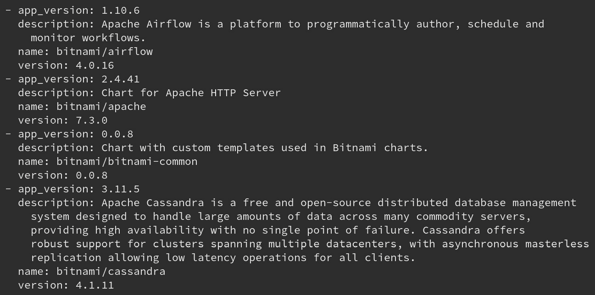

图 3.4–输出`helm search repo bitnami --output yaml`

类似于`helm search hub`命令，`helm search repo`命令以一个关键字作为参数。使用`bitnami`作为关键字将返回`bitnami`存储库下的所有图表，以及该存储库外也可能包含`bitnami`关键字的图表。

要确保您现在可以访问 WordPress 图表，请使用`wordpress`参数运行以下命令:

```
$ helm search repo wordpress
```

输出将显示您在 Helm Hub 上找到并在浏览器中观察到的 WordPress 图表:


图 3.5–输出`helm search repo wordpress`

斜线(`/`)前的`NAME`字段中的值表示包含返回的 Helm 图表的存储库的名称。在撰写本文时，`bitnami`知识库中最新版本的 WordPress 图表是版本`8.1.0`。这是将用于安装的版本。通过将`--versions`标志传递给`search`命令，可以观察到以前的版本:

```
$ helm search repo wordpress --versions
```

然后，您应该会看到每个版本的可用WordPress 图表都有一个新的行:


图 3.6–bitnami 存储库中 WordPress 图表的版本列表

既然已经确定了一个 WordPress 图表，并且已经添加了该图表的存储库，我们将在下一节探讨如何使用命令行来了解更多关于该图表的信息，以便为安装做准备。

## 从命令行显示 WordPress 图表信息

你可以在Helm枢纽页面上找到许多关于Helm图表的重要细节。一旦图表的存储库被添加到本地，该信息(以及更多信息)也可以从命令行通过下面列表中描述的四个`helm show`子命令来查看:

*   该命令显示图表的元数据(或图表定义):

    ```
    helm show chart
    ```

*   该命令显示图表的`README`文件:

    ```
    helm show readme
    ```

*   该命令显示图表的值:

    ```
    helm show values
    ```

*   该命令显示图表的定义、自述文件和值:

    ```
    helm show all
    ```

让我们将这些命令用于 Bitnami WordPress 图表。在这些命令中的每一个中，图表应该被引用为`bitnami/wordpress`。请注意，我们将通过`--version`标志来检索关于此图表的版本`8.1.0`的信息。如果省略此标志，将返回图表最新版本的信息。

运行`helm show chart`命令检索图表的元数据:

```
$ helm show chart bitnami/wordpress --version 8.1.0
```

这个命令的结果将是成为 WordPress 图表的**图表定义**。图表定义描述了诸如图表版本、其依赖项、关键字和维护者等信息:


图 3.7–WordPress 图表定义

运行`helm show readme`命令从命令行查看图表的自述文件:

```
$ helm show readme bitnami/wordpress --version 8.1.0
```

该命令的结果可能看起来很熟悉，因为图表的自述文件也显示在其 Helm Hub 页面上。从命令行利用此选项可以快速查看自述文件，而无需打开浏览器:


图 3.8–命令行中显示的 WordPress 图表的自述文件

我们使用`helm show values`来检查图表的值。值作为用户可以提供的参数，以便自定义图表安装。当我们安装图表时，我们将在本章后面的*为配置*创建值文件部分运行该命令。

最后，`helm show all`将来自前面三个命令的所有信息聚合在一起。如果您想同时检查图表的所有细节，请使用此命令。

现在我们已经找到并检查了一个 WordPress 图表，让我们设置一个 Kubernetes 环境，稍后可以将这个图表安装到这个环境中。

# 创造一个 Kubernetes 环境

为了在本章中创建 Kubernetes 环境，我们将使用 Minikube。我们学习了如何在 [*第 2 章*](02.html#_idTextAnchor098)*中安装迷你库贝，准备Kubernetes和Helm环境*。

让我们按照以下步骤设置 Kubernetes:

1.  运行以下命令启动 Kubernetes 集群:

    ```
    $ minikube start
    ```

2.  经过一小段时间后，您应该会在输出中看到类似如下的一行:

    ```
     Done! kubectl is now configured to use 'minikube'
    ```

3.  一旦 Minikube 集群启动并运行，为本章的练习创建一个专用的名称空间。运行以下命令创建名为`chapter3` :

    ```
    $ kubectl create namespace chapter3
    ```

    的名称空间

现在集群设置已经完成，让我们开始将 WordPress 图表安装到您的 Kubernetes 集群的过程。

# 安装 WordPress 图表

安装 Helm 图表是一个简单的过程，可以从检查图表的值开始。在下一节中，我们将检查 WordPress 图表上可用的值，并描述如何创建允许自定义安装的文件。最后，我们将安装图表并访问 WordPress 应用。

## 创建配置值文件

您可以通过提供 YAML 格式的`values`文件来覆盖图表中定义的值。为了正确创建`values`文件，您需要检查图表提供的支持值。如前所述，这可以通过运行`helm show values`命令来完成。

运行以下命令检查 WordPress 图表的值:

```
$ helm show values bitnami/wordpress --version 8.1.0
```

该命令的结果应该是一个可以设置的可能值的长列表，其中许多已经设置了默认值:

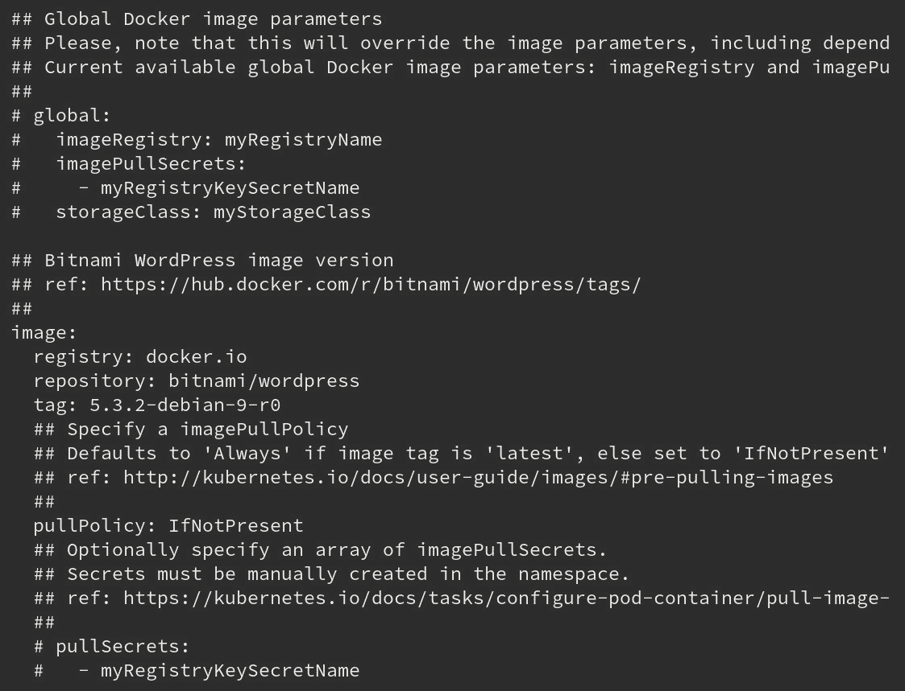

图 3.9–运行`helm show values`生成的值列表

前面的输出显示了WordPress 图表值的开始。其中许多属性已经设置了默认值，这意味着如果这些值没有被覆盖，它们将代表图表的配置方式。例如，如果`image`值没有在`values`文件中被覆盖，WordPress 图表使用的图像将使用来自 docker.io 注册表的`bitnami/wordpress`容器图像作为`5.3.2-debian-9-r0`标签。

图表值中以散列符号(`#`)开头的线条是注释。注释可用于解释一个值或一组值，也可用于注释值以取消设置。在前面输出的顶部的`global` YAML 小节中显示了一个通过注释来取消设置值的例子。默认情况下，除非用户明确设置，否则这些值都不会被设置。

如果我们进一步探究`helm show values`输出，我们可以找到与配置 WordPress 博客元数据相关的值:

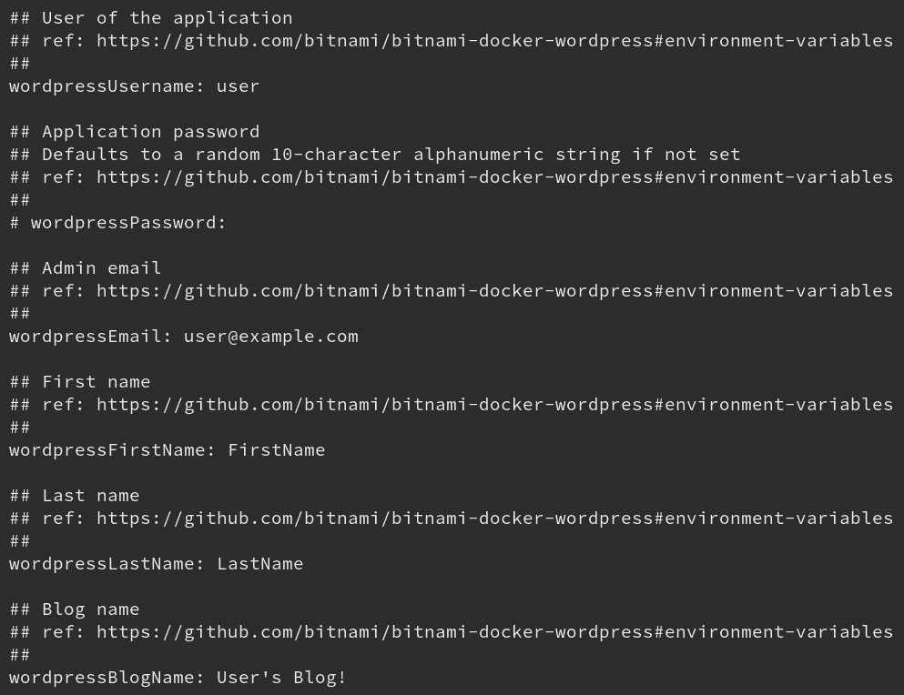

图 3.10–运行`helm show values`命令返回的值

这些值似乎对配置 WordPress 博客很重要。让我们通过创建一个`values`文件来覆盖它们。在你的机器上创建一个名为`wordpress-values.yaml`的新文件。在该文件中，输入以下内容:

```
wordpressUsername: helm-user
wordpressPassword: my-pass
wordpressEmail: helm-user@example.com
wordpressFirstName: Helm_is
wordpressLastName: Fun
wordpressBlogName: Learn Helm!
```

如果你愿意的话，可以自由地在这些价值观上获得更多的创造力。从`helm show values`继续往下的值列表，在开始安装之前，还有一个更重要的值应该添加到`values`文件中，如图所示:

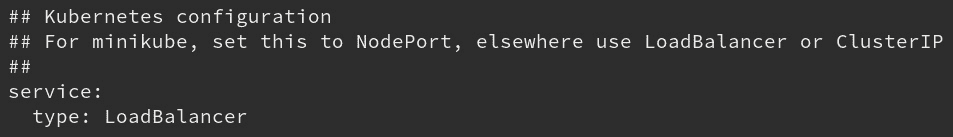

图 3.11–运行`helm show values`后返回的负载平衡器值

如注释中所述，该值表示如果我们使用 Minikube，我们需要将默认的`LoadBalancer`类型更改为`NodePort`。Kubernetes 中的一种`LoadBalancer`服务类型用于从公共云提供商处调配负载平衡器。虽然可以通过使用`minikube tunnel`命令来支持该值，但是将该值设置为`NodePort`将允许您直接通过本地端口访问 WordPress 应用，而不必使用`minikube tunnel`命令。

将该值添加到您的`wordpress-values.yaml`文件中:

```
service:
  type: NodePort
```

一旦该值添加到您的`values`文件中，您完整的`values`文件应该如下所示:

```
wordpressUsername: helm-user
wordpressPassword: my-pass
wordpressEmail: helm-user@example.com
wordpressFirstName: Helm_is
wordpressLastName: Fun
wordpressBlogName: Learn Helm!
service:
  type: NodePort
```

现在`values`文件已经完成 e，让我们运行安装。

## 运行安装

我们使用`helm install`来安装一个 Helm 图表。标准语法如下:

```
helm install [NAME] [CHART] [flags]
```

`NAME`参数是您希望给予您的 Helm 版本的名称。一个**版本**捕获了库伯内特资源，这些资源安装了一个图表并跟踪应用的生命周期。我们将在本章中探讨发行版是如何工作的。

`CHART`参数是已安装的 Helm 图表的名称。存储库中的图表可以按照`<repo name>/<chart name>`表格安装。

`helm install`中的`flags`选项允许您进一步自定义安装。`flags`允许用户定义和覆盖值，指定要使用的命名空间，等等。运行`helm install --help`可以查看标志列表。我们也可以将`--help`传递给其他命令，查看它们的用法和支持的选项。

现在，正确理解`helm install`的用法，运行以下命令:

```
$ helm install wordpress bitnami/wordpress --values=wordpress-values.yaml --namespace chapter3 --version 8.1.0
```

该命令将使用`bitnami/wordpress`Helm图安装一个名为`wordpress`的新版本。它将使用`wordpress-values.yaml`文件中定义的值来定制安装，图表将安装在`chapter3`命名空间中。它还将部署`8.1.0`版本，由`--version`标志定义。Helm将安装没有这个标志的最新版本的Helm图表。

如果图表安装成功，您应该会看到以下输出:


图 3.12–成功安装 WordPress 图表的输出

该输出显示关于安装的信息，包括版本名称、部署时间、安装到的名称空间、部署状态(即`deployed`)和修订号(由于这是版本的初始安装，因此设置为`1`)。

输出还显示与安装相关的注释列表。注释用于向用户提供有关其安装的附加信息。对于 WordPress 图表，这些注释提供了关于如何访问和验证 WordPress 应用的信息。虽然这些注释在安装后会直接出现，但如下一节所述，可以随时使用`helm get notes`命令进行检索。

随着您第一次 Helm 安装的完成，让我们来检查版本，以观察所应用的资源和配置。

## 检查你的释放

检查一个版本并验证其安装的最简单方法之一是列出给定名称空间中的所有 Helm 版本。为此，Helm 提供了`list`子命令。

运行以下命令查看`chapter3`命名空间中的版本列表:

```
$ helm list --namespace chapter3
```

在这个名称空间中，您应该只看到一个版本，如图所示:


图 3.13–列出舵释放的`helm list`命令的输出

`list`子命令提供以下信息:

*   发布名称
*   发布命名空间
*   版本的最新修订号
*   最新版本的时间戳
*   发布状态
*   图表名称
*   应用版本

请注意，状态、图表名称和应用版本是从前面的输出中截断的。

虽然`list`子命令对于提供高级版本信息很有用，但是用户可能还想了解特定版本的其他项目。Helm 提供了`get`子命令，以提供关于某个版本的更多信息。以下列表描述了可用于提供一组详细发布信息的命令:

*   要获取命名版本的所有钩子，运行以下命令:

    ```
    helm get hooks
    ```

*   要获取命名版本的清单，请运行以下命令:

    ```
    helm get manifest
    ```

*   要获取命名版本的注释，请运行以下命令:

    ```
    helm get notes
    ```

*   要获取命名版本的值，请运行以下命令:

    ```
    helm get values
    ```

*   要获取命名版本的所有信息，请运行以下命令:

    ```
    helm get all
    ```

来自前面列表`helm get hooks`的第一个命令用于显示给定版本的钩子。当您了解构建和测试Helm图表时，将在 [*第 5 章*](05.html#_idTextAnchor265)*构建您的第一个Helm图表*和 [*第 6 章*](06.html#_idTextAnchor292)*测试Helm图表*中更详细地探索钩子。目前，钩子可以被认为是 Helm 在应用生命周期的某些阶段执行的操作。

运行以下命令查看此版本中包含的挂钩:

```
$ helm get hooks wordpress --namespace chapter3
```

在输出中，您会发现两个带有以下注释的 Kubernetes Pod 清单:

```
'helm.sh/hook': test-success
```

该注释表示在执行`test`子命令期间运行的钩子，我们将在 [*第 6 章*](06.html#_idTextAnchor292)*测试Helm图*中更详细地探讨。这些测试挂钩为图表开发人员提供了一种机制，以确认图表是否按设计运行，并且可以被最终用户安全地忽略。

由于这个图表中包含的两个钩子都是为了测试目的，让我们继续前面列表中的下一个命令，继续发布检查。

`helm get manifest`命令可用于获取作为安装的一部分创建的 Kubernetes 资源列表。运行此命令，如下例所示:

```
$ helm get manifest wordpress --namespace chapter3
```

运行此命令后，您将看到以下 Kubernetes 清单:

*   两张`ecrets`清单。
*   两个`ConfigMaps`清单(第一个用于配置 WordPress 应用，第二个用于测试，由图表开发人员执行，因此可以忽略)。
*   一`PersistentVolumeClaim`显化。
*   两份`services`舱单。
*   一`Deployment`显化。
*   一`StatefulSet`显化。

从这个输出中，您可以观察在配置 Kubernetes 资源时，您的值在哪里产生了影响。需要注意的一个例子是在 WordPress 服务中，其`type`已经被设置为`NodePort`:


图 3.14–将`type`设置为`NodePort`

您还可以观察我们为 WordPress 用户设置的其他值。这些值在 WordPress 部署中被定义为环境变量，如图所示:


图 3.15–设置为环境变量的值

图表提供的大部分默认值保持不变。这些默认值已应用于 Kubernetes 资源，可以通过`helm get manifest`命令进行观察。如果更改了这些值，Kubernetes 资源的配置将会有所不同。

让我们继续下一个`get`命令。`helm get notes`命令用于显示头盔释放的音符。您可能还记得，当安装 WordPress 图表时，会显示发行说明。这些注释提供了有关访问应用的重要信息，可以通过运行以下命令再次显示:

```
$ helm get notes wordpress --namespace chapter3
```

`helm get values`命令对于调用给定版本中使用的值非常有用。运行以下命令查看`wordpress`版本中提供的值:

```
$ helm get values wordpress --namespace chapter3
```

该命令的结果应该看起来很熟悉，因为它们应该与`wordpress-values.yaml`文件中指定的值相匹配:

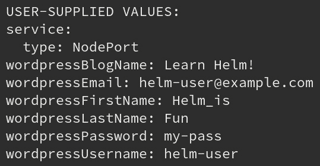

图 3.16–WordPress 版本中用户提供的值

虽然调用用户提供的值很有用，但在某些情况下，可能需要返回一个版本使用的所有值，包括默认值。这可以通过传入一个额外的`--all`标志来实现，如图所示:

```
$ helm get values wordpress --all --namespace chapter3
```

对于这个图表，输出会很长。以下输出显示了前几个值:


图 3.17–WordPress 版本所有值的子集

最后，Helm 提供了一个`helm get all`命令，可以用来聚合来自各种`helm get`命令的所有信息:

```
$ helm get all wordpress --namespace chapter3
```

除了 Helm 提供的命令外，`kubectl` CLI 还可用于更仔细地检查安装。例如，可以使用`kubectl`将范围缩小到一种类型的资源，例如部署，而不是获得安装创建的所有 Kubernetes 资源。为了确保返回的资源属于 Helm 版本，可以为`kubectl`命令提供一个在部署上定义的标签，用于表示版本的名称。Helm图表通常会在它们的Kubernetes资源中添加一个`app`标签。通过运行以下命令，使用`kubectl`命令行界面检索包含此标签的部署:

```
$ kubectl get all -l app=wordpress --namespace chapter3
```

您会发现以下部署存在于`chapter3` 命名空间中:

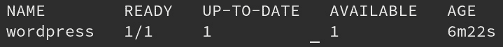

图 3.18–在`chapter3`命名空间中的 wordpress 部署

# 附加安装注意事项

很快，我们将探索刚刚安装的 WordPress 应用。首先，在将抛在安装主题之后之前，有几个方面需要考虑。

## n 旗

可以使用`-n`标志代替`--namespace`标志，以减少输入命令时的打字工作量。这适用于`upgrade`和`rollback`命令，我们将在本章后面描述。从这里开始，我们将使用`-n`标志来表示Helm应该与之交互的名称空间 ce。

## HELM _ NAMESPACE 环境变量

您也可以设置一个环境变量来表示 Helm 应该与之交互的命名空间。

让我们看看如何在各种操作系统上设置这个环境变量:

*   可以在 macOS 和 Linux 上设置变量如下:

    ```
    $ export HELM_NAMESPACE=chapter3
    ```

*   Windows 用户可以通过在 PowerShell 中运行以下命令来设置该环境变量:

    ```
    > $env:HELM_NAMESPACE = 'chapter3'
    ```

该变量的值可以通过运行`helm env`命令来验证:

```
$ helm env
```

您应该会在结果输出中看到`HELM_NAMESPACE`变量。默认情况下，变量设置为`default`。

在本书中，我们将不依赖于`HELM_NAMESPACE`变量，而是在每个命令旁边传递`-n`标志，以便更清楚我们打算使用哪个命名空间。提供`-n`标志也是为 Helm 指定名称空间的最佳方式，因为它确保我们针对的是我们期望的名称空间。

## 在-组和-值之间选择

对于`install`、`upgrade`和`rollback`命令，您可以选择两种方式之一将值传递给图表:

*   要从命令行在中传递值，请使用以下命令:

    ```
    --set
    ```

*   要在 YAML 文件或网址中指定值，请使用以下命令:

    ```
    --values
    ```

在本书中，我们将把`--values`标志作为配置图表值的首选方法。原因是以这种方式配置多个值更容易。维护一个`values`文件还将允许我们将这些资产保存在一个**源代码管理** ( **单片机**)系统中，例如`git`，这使得安装更加容易复制。请注意，敏感值(如密码)永远不应存储在源代码管理存储库中。我们将在 [*第 9 章*](09.html#_idTextAnchor416)*掌舵安全注意事项*中介绍安全主题。暂时，重要的是记住不要将`secrets`推入源代码管理存储库中。当需要在图表中提供机密时，推荐的方法是明确使用`--set`标志。

`--set`标志用于直接从命令行传递值。对于简单的值以及需要配置的值很少的情况，这是一种可以接受的方法。同样，使用`--set`标志不是首选方法，因为它限制了使安装更具可重复性的能力。以这种方式配置复杂的值也要困难得多，例如列表或复杂地图形式的值。还有其他相关旗帜，如`--set-file`、`--set-string`；`--set-file`标志用于传递已配置了`key1=val1`和`key2=val2`格式值的文件，而`--set-string`标志用于将`key1=val1`和`key2=val2`格式中提供的所有值设置为字符串。

有了这个解释，让我们来探索一下刚刚安装的 WordPr ess 应用。

# 访问 WordPress 应用

WordPress 图表的发行说明提供了四个命令，您可以运行这些命令来访问您的 WordPress 应用。运行这里列出的四个命令:

*   对于 macOS 或 Linux，运行以下命令:

    ```
    $ export NODE_PORT=$(kubectl get --namespace chapter3 -o jsonpath="{.spec.ports[0].nodePort}" services wordpress)
    $ export NODE_IP=$(kubectl get nodes --namespace chapter3 -o jsonpath="{.items[0].status.addresses[0].address}")
    $ echo "WordPress URL: http://$NODE_IP:$NODE_PORT/"
    $ echo "WordPress Admin URL: http://$NODE_IP:$NODE_PORT/admin"
    ```

*   对于 Windows PowerShell，运行以下命令:

    ```
    > $NODE_PORT = kubectl get --namespace chapter3 -o jsonpath="{.spec.ports[0].nodePort}" services wordpress | Out-String
    > $NODE_IP = kubectl get nodes --namespace chapter3 -o jsonpath="{.items[0].status.addresses[0].address}" | Out-String
    > echo "WordPress URL: http://$NODE_IP:$NODE_PORT/"
    > echo "WordPress Admin URL: http://$NODE_IP:$NODE_PORT/admin"
    ```

在基于一系列的`kubectl`查询定义了两个环境变量之后，产生的`echo`命令将显示访问 WordPress 的网址。第一个网址是查看主页，也是访问者访问您网站的地方。第二个网址是管理控制台，网站管理员使用它来配置和管理网站内容。

将第一个网址粘贴到浏览器中，您将看到一个类似于此处显示的内容的页面:

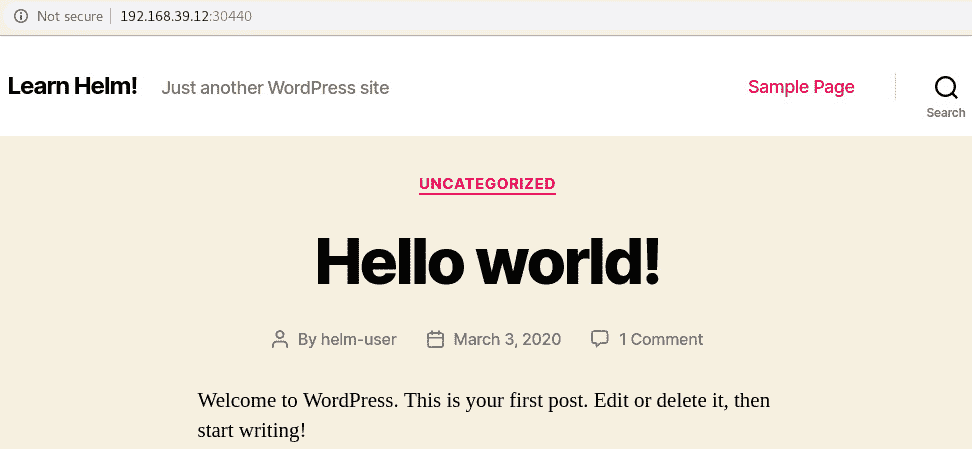

图 3.19–WordPress 博客页面

这一页的几个部分可能对你来说很熟悉。首先，请注意屏幕左上角的博客标题叫做**学习掌舵**！这不仅和这本书的书名很像，也是你之前在安装时给`wordpressBlogName`值的字符串。你也可以在页面底部的版权声明 **2020 Learn Helm 中看到这个数值！**。

影响主页定制的另一个值是`wordpressUsername`。注意，**你好世界的作者！**包含的帖子是**掌舵人用户**。这是提供给`wordpressUsername`值的用户名，如果提供了另一个用户名，则显示方式会有所不同。

前一组命令中提供的另一个链接用于管理控制台。将第二个`echo`命令的链接粘贴到浏览器中，您将看到以下屏幕:

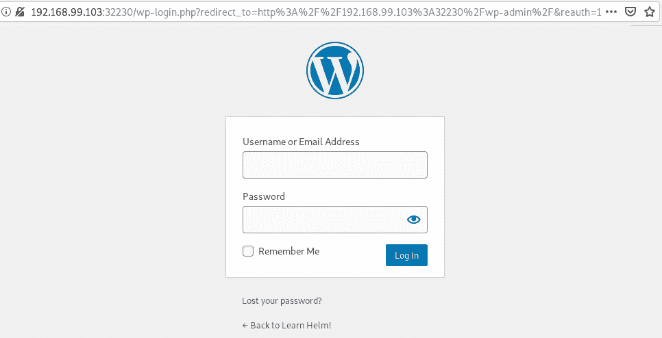

图 3.20:WordPress 管理控制台登录页面

要登录管理控制台，请输入您在安装过程中提供的`wordpressUsername`和`wordpressPassword`值。这些值可以通过查看您当地的`wordpress-values.yaml`文件来查看。也可以通过运行 WordPress 图表注释中指示的以下命令来检索它们:

```
$ echo Username: helm-user
$ echo Password: $(kubectl get secret --namespace chapter3 wordpress -o jsonpath='{.data.wordpress-password}' | base64 --decode)
```

通过身份验证后，将显示管理控制台仪表板，如图所示:


图 3.21–WordPress 管理控制台页面

如果你负责管理这个 WordPress 网站，你可以在这里配置你的网站，写文章，管理插件。如果您点击右上角的链接，上面写着**您好，掌舵人**，您将被引导至`helm-user`个人资料页面。从那里，您可以看到在安装过程中提供的其他几个值，如图所示:

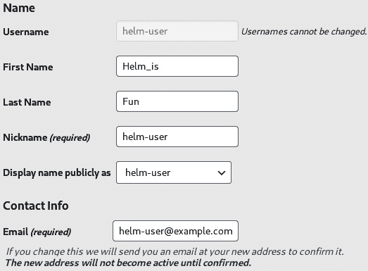

图 3.22–WordPress 配置文件页面

**名字**、**姓氏**和**电子邮件**字段指的是它们对应的`wordpressFirstname`、`wordpressLastname`和`wordpressEmail`Helm值。

请随意继续探索您的 WordPress 实例。完成后，继续下一节学习如何在 Helm 版本上执行升级。

# 升级 WordPress 版本

升级一个版本是指修改一个版本所安装的数值或者升级到一个更新版本的图表的过程。在本节中，我们将通过围绕 WordPress 副本和资源需求配置附加值来升级 WordPress 版本。

## 修改舵值

Helm 图表公开值来配置应用的实例数量及其相关资源集是很常见的。下面的截图说明了`helm show values`命令的几个部分，这些部分与用于此目的的值相关。

第一个值`replicaCount`很容易设置。由于`replica`是 Kubernetes 术语，描述了部署应用所需的 Pods 数量，这意味着`replicaCount`用于指定作为发布的一部分部署的应用实例的数量:


图 3.23–`helm show values`命令中的 `replicaCount`

将以下行添加到您的`wordpress-values.yaml`文件中，以将副本数量从`1`增加到`2`:

```
replicaCount: 2
```

我们需要定义的第二个值是指`resources` YAML 节下的一组值:

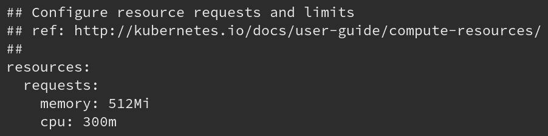

图 3.24–资源小节下的值

值可以缩进，如`resources`小节，以提供逻辑分组。在`resources`节下面是一个`requests`节，用于配置`memory`和`cpu`值，Kubernetes 会将其分配给 WordPress 应用。让我们在升级过程中修改这些值，将内存请求减少到`256Mi` (256 兆字节)并将`cpu`请求减少到`100m` (100 毫内核)。将这些修改添加到`wordpress-values.yaml`文件中，如图所示:

```
resources:
  requests:
    memory: 256Mi
    cpu: 100m
```

定义这两个新值后，您的整个`wordpress-values.yaml`文件将如下所示:

```
wordpressUsername: helm-user
wordpressPassword: my-pass
wordpressEmail: helm-user@example.com
wordpressFirstName: Helm
wordpressLastName: User
wordpressBlogName: Learn Helm!
service:
  type: NodePort
replicaCount: 2
resources:
  requests:
    memory: 256Mi
    cpu: 100m
```

一旦`values`文件已经用这些新值更新了，您可以运行`helm upgrade`命令来升级 rel 版本，我们将在下一节讨论。

## 运行升级

`helm upgrade`命令在基本语法上与`helm install`几乎相同，如下例所示:

```
helm upgrade [RELEASE] [CHART] [flags]
```

`helm install`希望您提供新版本的名称，而`helm upgrade`希望您提供应该升级的现有版本的名称。

可以使用`--values`标志提供`values`文件中定义的值，与`helm install`命令相同。运行以下命令，用一组新值升级 WordPress 版本:

```
$ helm upgrade wordpress bitnami/wordpress --values wordpress-values.yaml -n chapter3 --version 8.1.0
```

一旦命令被执行，您应该会看到类似于前面部分描述的`helm install`的输出:

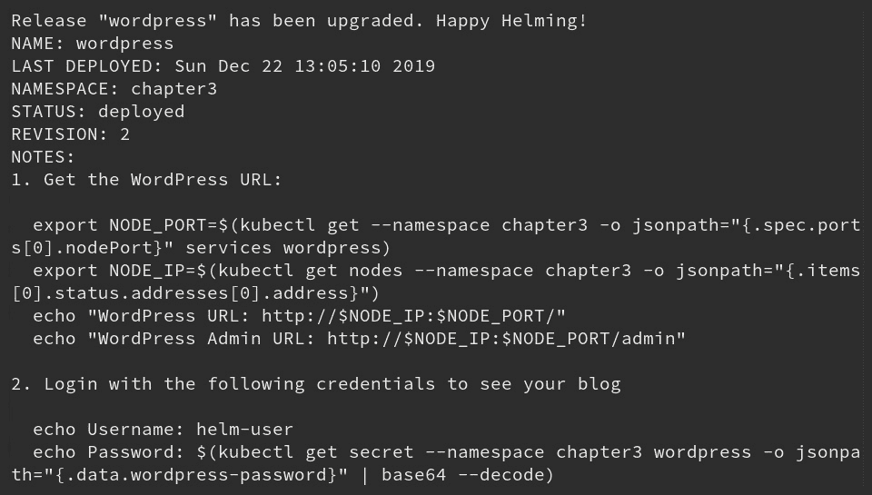

图 3.25`helm upgrade`的输出

通过运行以下命令，您应该还会看到`wordpress` Pods 重新启动:

```
$ kubectl get pods -n chapter3
```

在 Kubernetes 中，修改部署时会创建新的 Pods。在 Helm 中可以观察到同样的行为。升级过程中添加的值引入了 WordPress 部署的配置更改，结果创建了新的 WordPress Pods，并更新了配置。使用安装后较早使用的相同的`helm get` `manifest`和`kubectl get` `deployment`命令可以观察到这些变化。

在下一节中，我们将执行更多的升级，以演示在升级过程中，值 s 有时会有不同的行为。

## 在升级过程中重用和重置值

`helm upgrade`命令包括两个额外的标志，用于操作`helm install`命令中没有的值。

现在让我们看看这些标志:

*   `--reuse-values`:升级时，重用上一个版本的值。
*   `--reset-values`:升级时，将数值重置为图表默认值。

如果执行升级时未提供带有`--set`或`--values`标志的值，则默认情况下会添加`--reuse-values`标志。换句话说，如果未提供任何值，则在升级期间将再次使用以前版本使用的相同值:

1.  运行另一个`upgrade`命令，但不指定任何值:

    ```
    $ helm upgrade wordpress bitnami/wordpress -n chapter3 --version 8.1.0
    ```

2.  Run the `helm get values` command to inspect the values used in the upgrade:

    ```
    $ helm get values wordpress -n chapter3
    ```

    请注意，显示的值与之前的升级相同:

    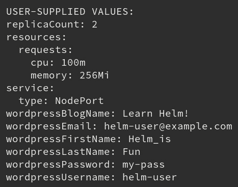

    图 3.26–输出`helm get values`

    当升级期间从命令行提供值时，可以观察到不同的行为。如果通过`--set`或`--values`标志传递值，所有未提供的图表值都将重置为默认值。

3.  通过提供带有`--set` :

    ```
    $ helm upgrade wordpress bitnami/wordpress --set replicaCount=1 -n chapter3 --version 8.1.0
    ```

    的单个值来运行另一个升级
4.  升级后，运行`helm get values`命令:

    ```
    $ helm get values wordpress -n chapter3
    ```

输出将声明用户提供的唯一值是`replicaCount`的值:


图 3.27`replicaCount`的输出

当升级期间至少提供一个值时，Helm 会自动应用`--reset-values`标志。这将导致所有值被设置回默认值，除了带有`--set`或 `--values`标志的单个属性。

用户可以手动提供`--reset-values`或`--reuse-values`标志，以明确确定升级期间值的行为。如果您希望下一次升级在从命令行覆盖之前将每个值重置为默认值，请使用`--reset-values`标志。如果您希望在从命令行设置不同值时重复使用上一版本的每个值，请提供`--reuse-values`标志。为了帮助简化升级期间的值管理，请尝试将您的值保存在文件中，该文件可用于为每次升级声明性地设置值。

如果您一直遵循本章中提供的每一个命令，那么现在您应该有了 WordPress 版本的四个版本。第四个版本不完全符合我们希望的应用配置方式，因为它只指定了`replicaCount`值，因为大多数值都被设置回默认值。在下一节中，我们将探讨如何将 WordPress 版本回滚到包含所需值集的 stabl e 版本。

# 回滚 WordPress 发布

虽然前进是的首选，但在某些情况下，返回到应用的早期版本更有意义。存在`helm rollback`命令来满足这个用例。让我们让将 WordPress 版本返回到之前的状态。

## 查看 WordPress 历史

每一个版本都有一个**版本**的历史。修订版用于跟踪特定版本中使用的值、Kubernetes资源和图表版本。安装、升级或回滚图表时，会创建一个新版本。默认情况下，修订数据保存在 Kubernetes 机密中(其他选项是 ConfigMap 或本地内存，由`HELM_DRIVER`环境变量决定)。这允许您的 Helm 版本由 Kubernetes 集群上的不同用户管理和交互，前提是他们拥有**基于角色的访问控制**(**RBAC**)允许他们查看或修改您命名空间中的资源。

可以通过使用`kubectl`从`chapter3`命名空间获取机密来观察修订机密:

```
$ kubectl get secrets -n chapter3
```

这将返回所有的机密，但是您应该在输出中看到这四个:

```
sh.helm.release.v1.wordpress.v1
Sh.helm.release.v1.wordpress.v2
sh.helm.release.v1.wordpress.v3
sh.helm.release.v1.wordpress.v4
```

这些机密中的每一个都对应于版本修订历史的一个条目，可以通过运行`helm history`命令来查看:

```
$ helm history wordpress -n chapter3
```

此命令将显示每个版本的表格，类似于以下内容(为了可读性，省略了一些列):

```
REVISION  ...  STATUS     ...  DESCRIPTION
1              superseded      Install complete
2              superseded      Upgrade complete
3              superseded      Upgrade complete
4              deployed        Upgrade complete     
```

在这个输出中，每个版本都有一个编号，以及更新时间、状态、图表、升级的应用版本和升级描述。状态为`superseded`的修订已升级。上面写着`deployed`的版本是当前部署的版本。其他状态包括`pending`和`pending_upgrade`，表示安装或升级正在进行中。`failed`指未能安装或升级的特定版本，`unknown`对应状态未知的版本。你不太可能遇到状态为`unknown`的版本。

通过指定`--revision`标志，可以针对修订号使用前面描述的`helm get`命令。对于这个回滚，让我们确定具有全套所需值的版本。大家可能还记得，当前版本`revision 4`只包含`replicaCount`值，但`revision 3`应该包含所需值。这可以通过运行带有`--revision`标志的`helm get values`命令来验证:

```
$ helm get values wordpress --revision 3 -n chapter3
```

完整的值列表通过检查此修订版呈现:


图 3.28–检查特定版本的输出

可以针对修订号运行其他`helm get`命令，以执行进一步检查。如有必要，还可以对`revision 3`执行`helm get manifest`命令，以检查将被恢复为红色的Kubernetes资源的状态。

在下一节中，我们将执行回滚。

## 运行回滚

`helm rollback`命令具有以下语法:

```
helm rollback <RELEASE> [REVISION] [flags]
```

用户提供版本名称和所需的修订号，将 Helm 版本回滚到以前的时间点。运行以下命令执行 WordPress 回滚到`revision 3`:

```
$ helm rollback wordpress 3 -n chapter3
```

`rollback`子命令提供了一个简单的输出，打印以下消息:

```
Rollback was a success! Happy Helming!
```

通过运行`helm` `history`命令，可以在发布历史中观察到该回滚:

```
$ helm history wordpress -n chapter3
```

在发布历史中，您会注意到添加了第五个版本，状态为`deployed`，描述为`Rollback to 3`。当应用回滚时，它会向发布历史记录中添加新的修订。这不能与升级混淆。最高版本号只是表示当前部署的版本。请务必检查版本的描述，以确定它是通过升级还是回滚创建的。

您可以通过再次运行`helm get values`来获取此版本的值，以确保回滚现在使用所需的值:

```
$ helm get values wordpress -n chapter3
```

输出将显示最新稳定版本的值:


图 3.29–最新稳定版本的值

您可能会注意到，我们没有在`rollback`子命令中明确设置图表版本或版本值。这是因为`rollback`子命令不是为接受这些输入而设计的；它旨在将图表回滚到以前的版本，并利用该版本的图表版本和值。请注意，`rollback`子命令不应该是日常 Helm 实践的一部分，它应该只保留给应用的当前状态不稳定并且必须恢复到以前的稳定点的紧急情况。

如果您已经成功地回滚了 WordPress 发行版，您就接近本章练习的结尾了。最后一步是通过利用`uninstall`子命令将 WordPress 应用从 Kubernetes 集群中移除，我们将在下一节对此进行描述。

# 卸载 WordPress 版本

卸载一个Helm版本意味着删除它管理的Kubernetes资源。此外，`uninstall`命令删除发布的历史记录。虽然这通常是我们想要的，但是指定`--keep-history`标志将指示Helm保留发布历史。

`uninstall`命令的语法非常简单:

```
helm uninstall RELEASE_NAME [...] [flags]
```

通过运行`helm uninstall`命令卸载 WordPress 版本:

```
$ helm uninstall wordpress -n chapter3
```

卸载后，您将看到以下消息:

```
release 'wordpress' uninstalled
```

您还会注意到`wordpress`版本不再存在于`chapter3`名称空间中:

```
$ helm list -n chapter3
```

输出将是一个空表。您也可以通过尝试使用`kubectl`获取 WordPress 部署来确认版本不再存在:

```
$ kubectl get deployments -l app=wordpress -n chapter3
No resources found in chapter3 namespace.
```

正如预期的那样，没有更多的 WordPress 部署可用。

```
$ kubectl get pvc -n chapter3
```

但是，您会注意到名称空间中仍然有一个`PersistentVolumeClaim`命令可用:

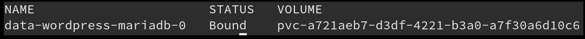

图 3.30–输出显示`PersistentVolumeClaim`

这个`PersistentVolumeClaim`资源没有被删除，因为它是由`StatefulSet`在后台创建的。在Kubernetes，如果删除了`StatefulSet`，由`StatefulSet`创建的`PersistentVolumeClaim`资源不会自动移除。在`helm uninstall`过程中，`StatefulSet`被删除，但相关的`PersistentVolumeClaim`没有被删除。这是我们所期望的。使用以下命令可以手动删除`PersistentVolumeClaim`资源:

```
$ kubectl delete pvc -l release=wordpress -n chapter3
```

现在，我们已经安装并卸载了 Wordpress，让我们清理一下您的 Kubernetes 环境，以便为我们将在本书后面章节中执行的 e 练习有一个干净的设置。

# 清理你的环境

要清理您的 Kubernetes 环境，您可以通过运行以下命令删除本章的名称空间:

```
$ kubectl delete namespace chapter3
```

删除`chapter3`命名空间后，还可以停止 Minikube VM:

```
$ minikube stop
```

这将关闭虚拟机，但将保持其状态，以便您可以在下一个练习中快速重新开始工作。

# 总结

在本章中，您学习了如何安装 Helm 图表并管理其生命周期。我们从搜索 Helm Hub 开始，寻找要安装的 WordPress 图表。找到图表后，包含该图表的存储库将按照其 Helm Hub 页面中的说明进行添加。然后，我们继续检查 WordPress 图表，创建一组覆盖默认值的值。这些值被保存到`values`文件中，然后在安装过程中提供。

图表安装后，我们使用`helm upgrade`通过提供附加值来升级版本。在此之后，我们使用`helm rollback`执行了回滚，以将图表恢复到以前的状态。最后，我们用`helm uninstall`删除了练习结束时的 WordPress 版本。

本章教你如何利用Helm作为最终用户和图表消费者。您使用 Helm 作为包管理器，将 Kubernetes 应用安装到集群中。您还通过执行升级和回滚来管理应用的生命周期。了解此工作流程对于使用 Helm 管理安装至关重要。

在下一章中，我们将更详细地探讨 Helm 图表的概念和结构，以开始学习如何创建图表。

# 进一步阅读

要了解有关在本地添加存储库、检查图表以及使用本章中使用的四个生命周期命令(`install`、`upgrade`、`rollback`和`uninstall`)的更多信息，请访问[https://helm.sh/docs/intro/using_helm/](https://helm.sh/docs/intro/using_helm/)。

# 问题

1.  什么是Helm枢纽？用户如何与它交互以找到图表和图表库？
2.  `helm get`和`helm show`组命令有什么区别？你什么时候会使用一组命令而不是另一组命令？
3.  `helm install`和`helm upgrade`命令中的`--set`和`--values`标志有什么区别？用一个比用另一个有什么好处？
4.  什么命令可以用来提供版本的修订列表？
5.  默认情况下，在不提供任何值的情况下升级版本会发生什么？当您为升级提供值时，这种行为有何不同？
6.  假设你有五个版本。将释放回滚到`revision 3`后`helm history`命令会显示什么？
7.  假设您想要查看部署到 Kubernetes 名称空间的所有版本。应该运行什么命令？
8.  假设您运行`helm repo add`来添加图表库。您可以运行什么命令来列出该存储库下的所有图表？