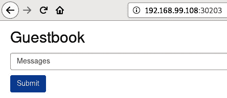
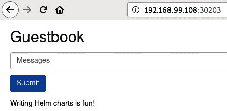
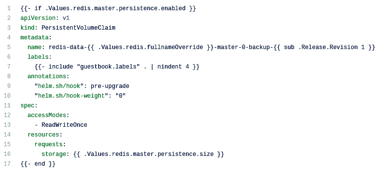
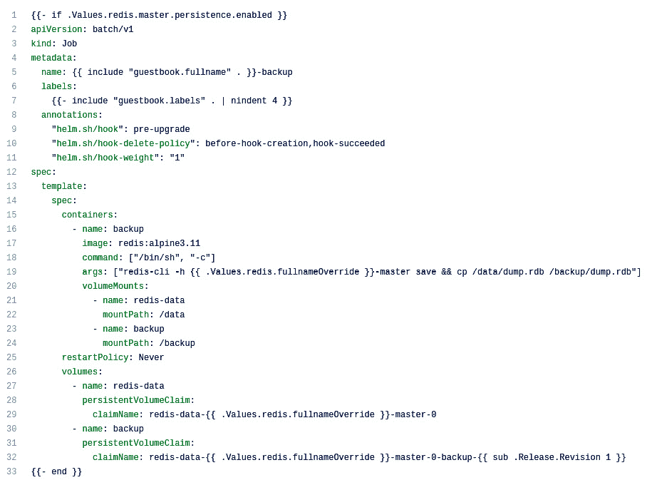
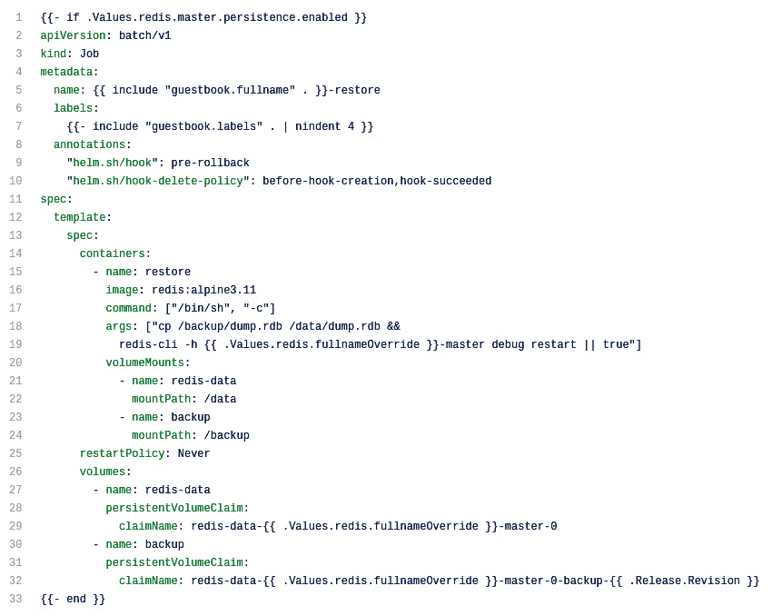
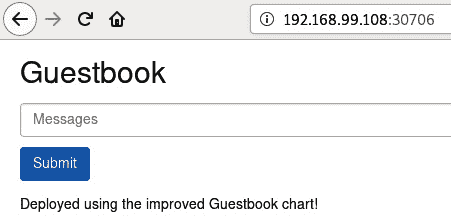
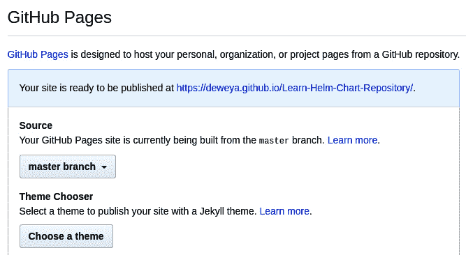
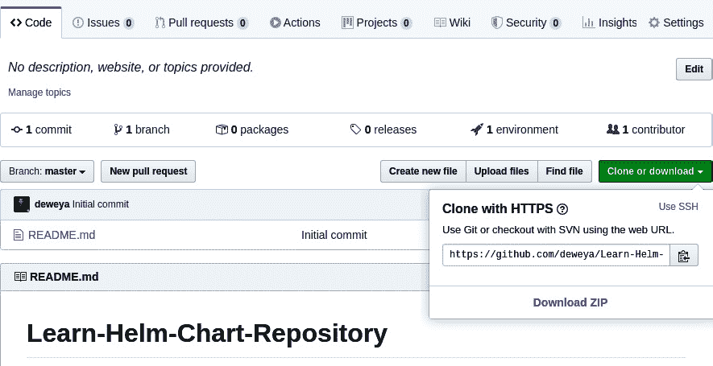

# 五、打造你的第一张 Helm 图表

在前一章中，您了解了组成 Helm 图表的各个方面。现在，是时候通过构建一个 Helm 图表来测试这些知识了。学习构建 Helm 图表将允许您以一种易于部署的方式打包复杂的 Kubernetes 应用。

在本章中，您将学习如何构建一个 Helm 图表来部署`guestbook`应用，这是一个在 Kubernetes 社区中使用的常见快速启动应用。该图表将通过遵循 Kubernetes 和 Helm 图表开发的最佳实践来构建，以提供一个编写良好且易于维护的自动化部分。在开发这个图表的整个过程中，你会学到许多不同的技能，可以用来构建你自己的 Helm 图表。在本章的最后，您将学习如何打包您的 Helm 图表并将其部署到图表存储库中，最终用户可以轻松访问该图表。

本章涵盖的主要主题如下:

*   了解留言簿应用
*   创建留言簿 Helm 图表
*   改进留言簿 Helm 图表
*   将留言簿图表发布到图表库

# 技术要求

本章需要以下技术:

*   `minikube`
*   `kubectl`
*   `helm`

除了前面的工具之外，您还可以在 https://github.com/PacktPublishing/-Learn-Helm 找到这本书的 GitHub 存储库。我们将参考本章中包含的 `helm-charts/charts/guestbook`文件夹。

建议您拥有自己的 GitHub 帐户，以便完成本章的最后一节*创建图表存储库。*该部分将提供如何创建您自己的帐户的说明。

# 了解留言簿应用

在这一章中，您将创建一个 Helm 图表来部署 Kubernetes 社区提供的留言簿教程应用。该应用在 Kubernetes 文档的以下页面[中介绍:https://Kubernetes . io/docs/教程/无状态-应用/guestboo](https://kubernetes.io/docs/tutorials/stateless-application/guestbook/) k/

留言簿应用是一个简单的 PHP:超文本预处理器(T2)前端，用于将 T4 消息保存到 Redis 后端。前端由对话框和**提交**按钮组成，如下图所示:


图 5.1:留言簿 PHP 前端

要与该应用交互，用户可以执行以下步骤:

1.  在**消息**对话框中输入消息。
2.  点击**提交**按钮。
3.  点击**提交**按钮后，信息将保存到 Redis 数据库。

Redis 是一个内存中的键值数据存储，在本章中，它将被集群用于数据复制。群集将由留言簿前端将写入的一个主节点组成。一旦写入，主节点将跨多个从节点复制数据，留言簿前端将从中读取数据。

下图描述了留言簿前端如何与 Redis 后端交互:


图 5.2:留言簿前端和 Redis 交互

有了对留言簿前端和 Redis 后端如何交互的基本理解，让我们建立一个 Kubernetes 环境来开始开发 Helm 图表。在开始之前，让我们首先启动 minikube，并为本章创建一个专用的名称空间。

# 设置环境

为了查看图表的运行情况，您需要按照以下步骤创建您的 minikube 环境:

1.  通过运行`minikube start`命令启动 minikube，如下所示:

    ```
    $ minikube start
    ```

2.  创建一个名为`chapter5,`的新命名空间，如下所示:

    ```
    $ kubectl create namespace chapter5
    ```

部署留言簿图表时，我们将使用这个名称空间。现在环境准备好了，让我们开始写图表。

# 创建留言簿 Helm 图表表

在这一部分，我们将创建一个 Helm 图表来部署留言簿应用。最终图表已发布在 Packt 存储库的`helm-charts/charts/guestbook`文件夹下。当你跟着例子走的时候，请随意参考这个位置。

我们将首先搭建留言簿 Helm 图表来创建图表的初始文件结构，从而开始开发。

## 搭建初始文件结构

大家可能还记得 [*第四章*](04.html#_idTextAnchor203)*理解 Helm 图表*，Helm 图表必须遵循特定的文件结构才能被认为有效。也就是说，图表必须包含以下必需文件:

*   `Chart.yaml`:用于定义图表元数据
*   `values.yaml`:用于定义默认图表值
*   `templates/`:用于定义要创建的图表模板和 Kubernetes 资源

我们在 [*第 4 章*](04.html#_idTextAnchor203)*中提供了图表可以包含的每个可能文件的列表，但是前面三个文件是开始开发新图表所必需的文件。虽然这三个文件可以从头开始创建，但 Helm 提供了一个`helm create`命令，可以用来更快地构建一个新的图表。除了创建前面列出的文件之外，`helm create`命令还将生成许多不同的样板模板，可以用来更快地编写您的 Helm 图表。让我们使用这个命令来构建一个名为`guestbook`的新 Helm 图表。*

`helm create`命令以 Helm 图表的名称(`guestbook`)作为参数。在本地命令行上运行以下命令来构建此图表:

```
$ helm create guestbook
```

运行此命令后，您将在机器上看到一个名为`guestbook/`的新目录。这是包含您的 Helm 图表的目录。在目录中，您将看到以下四个文件:

*   `charts/`
*   `Chart.yaml`
*   `templates/`
*   `values.yaml`

可以看到，`helm create`命令创建了一个`charts/`目录，此外还有所需的`Chart.yaml`、`values.yaml`和`templates/`文件。`charts/`目录目前为空白，但稍后当我们声明图表相关性时，它将自动填充。您可能还会注意到，其他提到的文件已经自动填充了默认设置。在本章中，我们将在开发`guestbook`图表时利用许多这些默认值。

如果您浏览`templates/`目录下的内容，您会发现默认情况下包含了许多不同的模板资源。这些资源将节省原本从头开始创建这些资源所花费的时间。虽然生成了许多有用的模板，但我们将删除`templates/tests/`文件夹。此文件夹用于包含您的 Helm 图表的测试，但我们将重点在 [*第 6 章*](06.html#_idTextAnchor292)*测试 Helm 图表*中编写您自己的测试。运行以下命令删除`templates/tests/`文件夹:

```
$ rm -rf guestbook/templates/tests
```

现在`guestbook`图表已经搭建好了，让我们继续评估已经生成的`Chart.yaml`文件。

## 评估图表定义

图表定义或`Chart.yaml`文件用于包含 Helm 图表的元数据。我们在 [*第 4 章*](04.html#_idTextAnchor203)*中讨论了`Chart.yaml`文件的每一个可能选项，但是让我们回顾一下包含在典型图表定义中的一些主要设置，如下所示:*

*   `apiVersion`:设置为`v1`或`v2` ( `v2`是头盔 3 的首选选项)
*   `version`:Helm 图表的版本。这个应该是符合**语义版本化规范** ( **SemVer** )的版本。
*   `appVersion`:Helm 图表正在部署的应用的版本
*   `name`:Helm 图表的名称
*   `description`:Helm 图表及其设计部署的简要说明
*   `type`:设置为`application`或`library`。`Application`图表用于部署特定的应用。`Library` 图表包含一组帮助函数(也称为“命名模板”)，可用于其他图表以减少样板文件。
*   `dependencies`:Helm 图表所依赖的图表列表

如果您观察您搭建的`Chart.yaml`文件，您会注意到这些字段中的每一个(依赖项除外)都已经设置好了。这个文件可以在下面的截图中看到:


图 5.3:搭建的图表文件

我们将暂时保留这个文件中包含的每个设置的默认值(尽管如果你愿意，可以随意写一个更有创意的描述)。当这些默认值变得相关时，我们将在本章后面更新它们。

默认图表定义中不包括但应该考虑的附加设置是`dependencies`。我们将在下一节更详细地讨论这一点，其中将添加一个 Redis 依赖项来简化开发工作。

## 添加 Redis 图表相关性

正如*理解留言簿应用*一节中提到的，这个 Helm 图表必须能够部署一个 Redis 数据库，该数据库将用于保存应用的状态。如果您完全从头开始创建这个图表，您需要正确理解 Redis 是如何工作的，以及如何将其正确部署到 Kubernetes。您还需要创建部署 Redis 所需的相应图表模板。

或者，通过包含已经包含逻辑和所需图表模板的 Redis 依赖项，您可以大大减少创建`guestbook` Helm 图表的工作量。让我们通过添加 Redis 依赖项来修改搭建的`Chart.yaml`文件，以简化图表开发。

添加 Redis 图表依赖关系的过程可以通过以下步骤执行:

1.  通过运行以下命令在 Helm Hub 存储库中搜索 Redis 图表:

    ```
    $ helm search hub redis
    ```

2.  将显示的图表之一是 Bitnami 的 Redis 图表。这是我们将用作依赖项的图表。如果您尚未在 [*第 3 章*](03.html#_idTextAnchor147)*中添加`bitnami`图表库，请使用`helm add repo`命令立即添加该图表库。请注意，存储库**统一资源定位器** ( **网址**)是从掌舵中心存储库中的 Redis 图表页面中检索的。代码可以在下面的片段中看到:

    ```
    $ helm add repo bitnami https://charts.bitnami.com
    ```* 
3.  Determine the version of the Redis chart you would like to use. A list of version numbers can be found by running the following command:

    ```
    $ helm search repo redis --versions
    NAME                        	CHART VERSION	APP VERSION
    bitnami/redis               	10.5.14       	5.0.8
    bitnami/redis               	10.5.13       	5.0.8
    bitnami/redis               	10.5.12       	5.0.8
    bitnami/redis               	10.5.11       	5.0.8
    ```

    您必须选择的版本是图表版本，而不是应用版本。应用版本只描述 Redis 版本，而图表版本描述的是实际 Helm 图表的版本。

    依赖项允许您选择特定的图表版本，或通配符，如`10.5.x`。使用通配符可以让您轻松地用与该通配符匹配的最新 Redis 版本(在本例中是版本`10.5.14`)更新图表。在这个例子中，我们将使用版本`10.5.x`。

4.  Add the `dependencies` field to the `Chart.yaml` file. For the `guestbook` chart, we will configure this field with the following minimum required fields (additional fields are discussed in [*Chapter 4*](04.html#_idTextAnchor203), *Understanding Helm Charts*):

    `name`:依赖关系图的名称

    `version`:依赖关系图的版本

    `repository`:依赖关系图的存储库 URL

    将以下 **YAML 非标记语言** ( **YAML** )代码添加到您的`Chart.yaml`文件的末尾，提供您收集的关于 Redis 图表的信息来配置依赖项的设置:

```
dependencies:
  - name: redis
    version: 10.5.x
    repository: https://charts.bitnami.com
```

一旦添加了依赖项，完整的`Chart.yaml`文件应该如下所示(为简洁起见，注释和空行已被删除):

```
apiVersion: v2
name: guestbook
description: A Helm chart for Kubernetes
type: application
version: 0.1.0
appVersion: 1.16.0
dependencies:
  - name: redis
    version: 10.5.x
    repository: https://charts.bitnami.com
```

该文件也可以在 P [ackt 存储库中查看，网址为 https://github . com/PacktPublishing/-Learn-Helm/blob/master/Helm-charts/charts/g](https://github.com/PacktPublishing/-Learn-Helm/blob/master/helm-charts/charts/guestbook/Chart.yaml)uest book/chart . YAML(请注意版本和`appVersion`字段可能会有所不同，我们将在本章后面对其进行修改)。

现在您的依赖项已经添加到图表定义中，让我们下载这个依赖项，以确保它已经被正确配置。

### 下载 Redis 图表依赖项

当第一次下载依赖项时，应该使用`helm dependency update`命令。该命令会将您的依赖项下载到`charts/`目录，并生成`Chart.lock`文件，该文件指定了关于已下载图表的元数据。

运行`helm dependency update`命令下载你的 Redis 依赖项。该命令将 Helm 图表的位置作为参数，可以在下面的代码片段中看到:

```
$ helm dependency update guestbook
Hang tight while we grab the latest from your chart repositories...
...Successfully got an update from the 'bitnami' chart repository
Update Complete.  Happy Helming!
Saving 1 charts
Downloading redis from repo https://charts.bitnami.com
Deleting outdated charts
```

您可以通过确保 Redis 图表出现在`charts/`文件夹下来验证下载成功的事实，如下图所示:

```
$ ls guestbook/charts
redis-10.5.14.tgz
```

现在已经包含了 Redis 依赖，让我们继续修改`values.yaml`文件。在这里，我们将覆盖特定于配置 Redis 的值，以及来自投标应用的留言簿。

## 修改 values.yaml 文件

Helm 图表的`values.yaml`文件用于提供一组默认参数，这些参数在整个图表的模板中被引用。当用户与 Helm 图表交互时，如果需要，他们可以使用`--set`或`--values`标志覆盖这些默认值。除了提供一组默认参数之外，一个写得好的 Helm 图表应该是自我记录的，包含每个值的直观名称和解释难以实现的值的注释。如果用户和维护者需要理解图表的值，编写一个自我记录的`value.yaml`文件允许他们简单地引用这个文件。

`helm create`命令生成一个值文件，该文件包含许多 Helm 图表开发中常用的样板值。让我们通过在这个文件的末尾添加一些额外的值来完成 Redis 依赖项的配置。之后，我们将重点修改一些样板值来配置留言簿前端资源。

### 添加值以配置 Redis 图表

虽然添加一个依赖项可以防止您需要创建它的图表模板，但是您可能仍然需要覆盖它的一些值来配置它。在这种情况下，有必要覆盖几个 Redis 图表的值，以允许它与`guestbook`图表的其余部分无缝工作。

让我们首先了解一下 Redis 图表的价值。这可以通过对下载的 Redis 图表运行`helm show values`命令来完成，如下所示:

```
$ helm show values charts/redis-10.5.14.tgz
```

请务必修改该命令以匹配您下载的 Redis 图表版本。显示值列表后，让我们确定需要覆盖的值，如下所示:

1.  The first value that will need to be overridden in the Redis chart is `fullnameOverride`. This value appears in the `helm show values` output, as follows:

    ```
    ## String to fully override redis.fullname template
    ##
    # fullnameOverride:
    ```

    图表通常在名为`$CHART_NAME.fullname`的命名模板中使用该值，以轻松生成其 Kubernetes 资源名称。当设置`fullnameOverride`时，命名模板将评估为该值。否则，该模板的结果将基于`.Release.Name`对象，或安装时提供的 Helm 版本的名称。

    Redis 依赖项使用`redis.fullname`模板来帮助设置 Redis 主服务名和 Redis 从服务名。

    下面的代码片段显示了 Redis 主服务名是如何在 Redis 图表中生成的示例:

    ```
    name: {{ template 'redis.fullname' . }}-master
    ```

    留言簿应用需要将 Redis 服务命名为`redis-master`和`redis-slave`。因此，`fullnameOverride`值应设置为`redis`。

    如果您有兴趣了解更多关于`redis.fullname`模板如何工作以及如何在整个 Redis 图表中应用的信息，您可以在`charts/`文件夹下取消归档 Redis 依赖关系。在该文件夹中，您将在`templates/_helpers.tpl`文件中找到`redis.fullname`模板，并在每个 YAML 模板中记录其调用。(事实证明，您生成的`guestbook`图表在`_helpers.tpl`文件中也包含了类似的模板，但是一般来说，在维护者定制模板的情况下，参考依赖者的资源会更安全。)

    如果您有兴趣了解更多关于留言簿应用如何工作的信息，可以在 GitHub 上找到源代码。以下文件定义了所需的 Redis 服务名称:

    https://github.com/kubernetes/examples/blob/master/guestbook/php-redis/guestbook.php

2.  The next value that needs to be overridden from the Redis chart is `usePassword`. The following code snippet shows what this value looks like in the `helm show values` output:

    ```
    ## Use password authentication
    usePassword: true
    ```

    留言簿应用是为未经身份验证访问 Redis 数据库而编写的，因此我们将想要将该值设置为`false`。

3.  我们需要覆盖的最终值是`configmap`。以下是该值在`helm show values`输出中的显示方式:

    ```
    ## Redis config file
    ## ref: https://redis.io/topics/config
    ##
    configmap: |-
      # Enable AOF https://redis.io/topics/persistence#append-only-file
      appendonly yes
      # Disable RDB persistence, AOF persistence already enabled.
      save ''
    ```

默认的`configmap`值将启用 Redis 可以使用的两种持久性，**仅追加文件** ( **AOF** )和 **Redis 数据库文件** ( **RDF** )持久性。AOFRedis 中的持久性是通过向 changelog 风格的文件中添加新的数据条目来提供变更历史的。RDF 持久性的工作原理是以一定的时间间隔将数据复制到文件中，从而创建数据快照。

在本章的后面，我们将创建简单的生命周期挂钩，允许用户将 Redis 数据库备份和恢复到以前的快照。因为只有 RDB 持久性可以处理快照文件，所以我们将覆盖`configmap`值来读取`appendonly no`，这将禁用 AOF 持久性。

识别每个 Redis 值，将这些值添加到图表的`values.yaml`文件的末尾，如以下代码块所示:

```
redis:
  # Override the redis.fullname template
  fullnameOverride: redis
  # Enable unauthenticated access to Redis
  usePassword: false
  # Disable AOF persistence
  configmap: |-
    appendonly no
```

请记住，从 [*第 4 章*](04.html#_idTextAnchor203)**理解 Helm 图表，*从图表依赖关系覆盖的值必须在该图表名称下限定范围。这就是为什么这些值将被添加到`redis:`小节的下面。*

 *您可以通过参考位于 Packt 存储库中的`v` [`alues.yaml`文件来检查您是否正确配置了 Redis 值。](https://github.com/PacktPublishing/-Learn-Helm/blob/master/helm-charts/charts/guestbook/values.yaml)

重要说明

一些与 Redis 无关的值可能与您的`values.yaml`文件不同，因为我们将在下一节修改这些值。

配置好 Redis 依赖项的值后，让我们继续修改`helm create`生成的默认值来部署留言簿前端。

### 修改值以部署留言簿前端

当您运行本章开头的`helm create`命令时，它创建的一些项目是`templates/`目录下的默认模板和`values.yaml`文件中的默认值。

以下是已创建的默认模板列表:

*   `deployment.yaml`:用于将留言簿应用部署到 Kubernetes。
*   `ingress.yaml`:提供了一个从 Kubernetes 集群外部访问留言簿应用的选项。
*   `serviceaccount.yaml`:用于为留言簿应用创建专用的`serviceaccount`。
*   `service.yaml`:用于在留言簿应用的多个实例之间进行负载平衡。还可以提供从 Kubernetes 集群外部访问留言簿应用的选项。
*   `_helpers.tp`:提供了一组在整个 Helm 图表中使用的通用模板。
*   `NOTES.txt`:提供一组安装应用后用来访问应用的指令。

每个模板都是由图表的值配置的。虽然`helm create`命令为部署留言簿应用提供了一个很好的起点，但它没有提供所需的每个默认值。为了用它们所需的值替换默认值，我们可以观察生成的图表模板，并相应地修改它们的参数。

让我们浏览一下指示需要进行修改的模板位置。

第一个位置在`deployment.yaml`图表模板中。在该文件中，有一行指示要部署的容器映像，如下所示:

```
image: '{{ .Values.image.repository }}:{{ .Chart.AppVersion }}'
```

可以看到，映像是由`image.repository`值和`AppVersion`图表设置决定的。如果您查看您的`values.yaml`文件，您可以看到`image.repository`值当前默认配置为部署`nginx`映像，如下图所示:

```
image:
  repository: nginx
```

同样，如果查看`Chart.yaml`文件，可以看到`AppVersion`当前设置为`1.16.0`，如下图:

```
appVersion: 1.16.0
```

由于留言簿应用起源于 Kubernetes 教程，您可以在 Kubernetes 文档中找到需要部署的具体映像，网址为 https://Kubernetes . io/docs/tutories/无状态-应用/留言簿/# creating-the-guest book-front-deployment。在文档中，您可以看到映像必须指定如下:

```
image: gcr.io/google-samples/gb-frontend:v4
```

因此，为了正确生成映像场，必须将`image.repository`值设置为`gcr.io/google-samples/gb-frontend`，将`AppVersion`图表设置设置为`v4`。

第二个必须修改的位置是在`service.yaml`图表模板中。在这个文件中，有一行决定了服务类型，如下图所示:

```
type: {{ .Values.service.type }}
```

根据`service.type`值，该服务将默认为具有`ClusterIP`服务类型，如`values.yaml`文件所示，如下所示:

```
service:
  type: ClusterIP
```

对于`guestbook`图表，我们将修改该值，改为创建一个`NodePort`服务。通过在 minikube **虚拟机** ( **虚拟机**)上公开一个端口，这将允许在 minikube 环境中更容易地访问应用。一旦连接到端口，我们就可以访问留言簿前端。

请注意，虽然`helm create`生成了一个也允许访问的`ingress.yaml`模板，但在 minikube 环境中工作时，更推荐使用`NodePort`服务，因为不需要附加组件或增强功能。幸运的是，生成的图表默认禁用入口资源创建，因此不需要任何操作来禁用该功能。

现在我们已经确定了需要更改的默认设置，让我们首先更新`values.yaml`文件，如下所示:

1.  更换`image.repository`值，使其设置为`gcr.io/google-samples/gb-frontend`。整个`image:`节现在应该如下所示:

    ```
    image:
      repository: gcr.io/google-samples/gb-frontend
      pullPolicy: IfNotPresent
    ```

2.  更换`service.type`值，使其设置为`NodePort`。整个`service:`节现在应该如下所示:

    ```
    service:
      type: NodePort
      port: 80
    ```

3.  您可以通过参考 Packt 存储库中的 fi [文件来验证您的`values.yaml`文件是否已被正确修改，网址为 https://github . com/Packtpublishing/-Learn-Helm/blob/master/Helm-chart](https://github.com/PacktPublishing/-Learn-Helm/blob/master/helm-charts/charts/guestbook/values.yaml)s/charts/guest book/values . YAML

接下来，让我们更新`Chart.yaml`文件，以便部署正确的留言簿应用版本，如下所示:

1.  替换`appVersion`字段，使其设置为`v4`。`appVersion`字段现在应该如下所示:

    ```
    appVersion: v4
    ```

2.  您可以通过参考位于 https://github . com/Packt publishing/-Learn-Helm/blob/master/Helm-charts/charts/guest book/chart . YAML 的 Packt 存储库中的 fi [le 来验证您的`Chart.yaml`文件是否已被正确修改](https://github.com/PacktPublishing/-Learn-Helm/blob/master/helm-charts/charts/guestbook/Chart.yaml)

现在，图表已经用正确的值和设置进行了更新，让我们通过将其部署到 minikube 环境来查看这个图表的运行情况。

## 安装留言簿图表

要安装您的`guestbook`图表，请在您的`guestbook/`目录外运行以下命令:

```
$ helm install my-guestbook guestbook -n chapter5
```

如果安装成功，将显示以下消息:

```
NAME: my-guestbook
LAST DEPLOYED: Sun Apr 26 09:57:52 2020
NAMESPACE: chapter5
STATUS: deployed
REVISION: 1
NOTES:
1\. Get the application URL by running these commands:
  export NODE_PORT=$(kubectl get --namespace chapter5 -o jsonpath='{.spec.ports[0].nodePort}' services my-guestbook)
  export NODE_IP=$(kubectl get nodes --namespace chapter5 -o jsonpath='{.items[0].status.addresses[0].address}')
  echo http://$NODE_IP:$NODE_PORT
```

安装成功后，您可能会发现留言簿和 Redis PODS 没有立即处于`Ready`状态。当 Pod 没有准备好时，它还不能被访问。

您也可以通过传入`--wait`标志来强制 Helm 等待这些 Pod 准备就绪。`--wait`标志可以与`--timeout`标志一起使用，以增加 Helm 等待 Pod 准备就绪的时间(秒)。默认值设置为 5 分钟，这对于该应用来说已经足够了。

通过检查每个 Pod 的状态，您可以确保所有 Pod 都准备好了，而没有`--wait`标志，如下所示:

```
$ kubectl get pods -n chapter5
```

当每个 Pod 准备就绪时，您将能够观察到每个 Pod 在`READY`列下报告`1/1`，如下图所示:


图 5.4:当每个 Pod 准备好的时候，kubectl get pods 的输出–第 5 章

一旦 Pod 准备就绪，您就可以运行发行说明中显示的命令。如有必要，可通过运行以下代码再次显示它们:

```
$ helm get notes my-guestbook -n chapter5
NOTES:
1\. Get the application URL by running these commands:
  export NODE_PORT=$(kubectl get --namespace chapter5 -o jsonpath='{.spec.ports[0].nodePort}' services my-guestbook)
  export NODE_IP=$(kubectl get nodes --namespace chapter5 -o jsonpath='{.items[0].status.addresses[0].address}')
  echo http://$NODE_IP:$NODE_PORT
```

将留言簿网址(从`echo`命令输出)复制粘贴到浏览器中，应显示留言簿**用户界面** ( **UI** )，如下图截图所示:



图 5.5:留言簿前端

尝试在对话框中输入消息，点击**提交**。留言簿前端会在**提交**按钮下显示消息，表示消息已经保存到 Redis 数据库，如下图截图所示:



图 5.6:留言簿前端显示先前发送的消息

如果你能够写一条消息，并看到它显示在你的屏幕上，那么你已经成功地建立和部署了你的第一个 Helm 图表！如果您看不到您的消息，可能是您的 Redis 依赖设置不正确。在这种情况下，请确保您的 Redis 值已经正确配置，并且您的 Redis 依赖关系已经在`Chart.yaml`文件中正确声明。

准备好之后，使用`helm uninstall`命令卸载该图表，如下所示:

```
$ helm uninstall my-guestbook -n chapter5
```

您还需要手动删除 Redis**persistentvolumeclays**(**PVCs**)，因为 Redis 依赖关系通过使用`StatefulSet`使数据库持久化(删除时不会自动删除 PVCs)。

运行以下命令删除 Redis PVCs:

```
$ kubectl delete pvc -l app=redis -n chapter5
```

在下一节中，我们将探索如何改进`guestbook`图表。

# 改进留言簿 Helm 图表

上一节中创建的图表能够成功部署留言簿应用。然而，就像任何类型的软件一样，Helm 图表总是可以改进的。在本节中，我们将重点介绍以下两个将改进`guestbook`图表的功能:

*   生命周期挂钩来备份和恢复 Redis 数据库
*   输入验证，以确保仅提供有效值

让我们首先关注添加生命周期挂钩。

## 创建升级前和回滚前生命周期挂钩

在本节中，我们将创建两个生命周期挂钩，如下所示:

1.  第一个钩子将出现在`pre-upgrade`生命周期阶段。这个阶段在`helm upgrade`命令运行后立即发生，但是在任何 Kubernetes 资源被修改之前。此挂钩将用于在执行升级之前拍摄 Redis 数据库的数据快照，以确保数据库在升级出错时得到备份。
2.  第二个钩子将出现在`pre-rollback`生命周期阶段。这个阶段发生在`helm rollback`命令运行之后，但是在任何 Kubernetes 资源被恢复之前。这个钩子将把 Redis 数据库恢复到以前拍摄的数据快照，并确保 Kubernetes 资源配置被恢复到与拍摄快照时相匹配的状态。

到本节结束时，您将更加熟悉生命周期挂钩以及可以使用它们执行的一些强大功能。请务必记住，本节中创建的钩子非常简单，仅用于探索 Helm 钩子的基本功能。不建议在生产环境中尝试逐字使用这些钩子。

让我们来看看如何创建`pre-upgrade`生命周期挂钩。

### 创建升级前挂钩以拍摄数据快照

在 Redis 中，数据快照包含在`dump.rdb`文件中。我们可以通过创建一个钩子来备份这个文件，这个钩子首先在 Kubernetes 命名空间中创建新的 PVC。钩子可以创建一个`job`资源，将`dump.rdb`文件复制到新的`PersistentVolumeClaim`中。

虽然`helm create`命令生成了一些强大的资源模板，允许快速创建初始的`guestbook`图表，但它并没有提供任何可用于此任务的钩子。因此，您可以按照以下步骤从头开始创建升级前挂钩:

1.  First, you should create a new folder to contain the hook templates. While this is not a technical requirement, it does help keep your hook templates separate from the regular chart templates. It also allows you to group the hook templates by function.

    在您的`guestbook`文件结构中创建新文件夹`templates/backup`，如下所示:

    ```
    $ mkdir guestbook/templates/backup
    ```

2.  Next, you should scaffold the two templates required to perform the backup. The first template required is a `PersistentVolumeClaim` template that will be used to contain the copied `dump.rdb` file. The second template will be a job template that will be used to perform the copy.

    创建两个空模板文件作为占位符，如下所示:

    ```
    $ touch guestbook/templates/backup/persistentvolumeclaim.yaml
    $ touch guestbook/templates/backup/job.yaml
    ```

3.  您可以通过引用 Packt 存储库来再次检查您的工作。您的文件结构应该与在 https://github . com/PacktPublishing/-Learn-Helm/tree/master/Helm-chaRTS/charts/guest book/templates/backup 找到的结构相同。
4.  Next, let's create the `persistentvolumeclaim.yaml` template. Copy the contents of the file below to your `backup/persistentvolumeclaim.yaml` file (this file can also be copied from the Packt repository at https://github.com/PacktPublishing/-Learn-Helm/blob/master/helm-charts/charts/guestbook/templates/backup/persistentvolumeclaim.yaml. Keep in mind that whitespace consists of `spaces`, not tabs, as per valid YAML syntax. The contents of the file can be seen here:

    

    图 5.7:备份/persistentvolumeclaim.yaml 模板

    在继续之前，让我们浏览一下`persistentvolumeclaim.yaml`文件的一部分，以帮助理解它是如何创建的。

    本文件的第 1 行和第 17*行由一个`if`动作组成。因为动作封装了整个文件，所以它表示只有当`redis.master.persistence.enabled`值设置为`true`时，才会包含该资源。该值默认为 Redis 依赖图中的`true`，可以使用`helm show values`命令进行观察。*

    *5 号线*确定新 PVC 备份的名称。它的名字基于 Redis 依赖图创建的 Redis 主 PVC 的名字，也就是`redis-data-redis-master-0`，所以很明显这是哪个 PVC 的备份。其名称也基于修订号。因为此挂钩是作为升级前挂钩运行的，所以它将尝试使用升级到的修订号。`sub`功能是用来从这个修订号中减去`1`，所以很明显这个 PVC 包含了上一个修订的数据快照。

    *第 9 行*创建一个注释，将该资源声明为`pre-upgrade`钩子。*第 10 行*创建一个`helm.sh/hook-weight`注释，以确定与其他升级前挂钩相比，该资源的创建顺序。权重以升序运行，因此该资源将在其他升级前资源之前创建。

5.  创建`persistentvolumeclaim.yaml`文件后，我们将创建最终的预升级模板`job.yaml`。将以下内容复制到您的`backup/job.yaml`文件中(该文件也可以从位于 https://github . com/PacktPublishing/-Learn-Helm/blob/master/Helm-charts/chaRTS/guest book/templates/backup/job . YAML 的 Packt 存储库中复制):



图 5.8:备份/作业模板

让我们浏览一下这个`job.yaml`模板的第部分，了解它是如何创建的。

*第 9 行*再次将该模板定义为升级前挂钩。*第 11 行*将钩重设置为`1,`，表示该资源将在另一个预升级`PersistentVolumeClaim`后创建。

*第 10 行*设置一个新的注释，以确定何时删除该作业。默认情况下，Helm 不会管理超出初始创建的钩子，这意味着当`helm uninstall`命令运行时，钩子不会被删除。`helm.sh/hook-delete-policy`注释用于确定删除资源的条件。该作业包含`before-hook-creation`删除策略，该策略指示如果名称空间中已经存在该作业，它将在`helm upgrade`命令期间被删除，从而允许在其位置创建新作业。该作业还将具有`hook-succeeded`删除策略，如果成功运行，将导致其被删除。

*第 19 行*执行`dump.rdb`文件的备份。它连接到 Redis 主服务器，保存数据库的状态，并将文件复制到备份 PVC。

*第 29 行*和*第 32 行*分别定义了 Redis 主聚氯乙烯和备用聚氯乙烯。这些 PVC 由作业装载，以便复制`dump.rdb`文件。

如果您已经按照执行了前面的每个步骤，那么您已经为您的 Helm 图表创建了升级前挂钩。让我们继续下一节来创建回滚前挂钩。之后，我们将重新部署`guestbook`图表，以查看这些挂钩的运行情况。

### 创建回滚前挂钩来恢复数据库

虽然升级前挂钩被写入以将`dump.rdb`文件从 Redis 主 PVC 复制到备份 PVC，但是`pre-rollback`挂钩可以被写入以执行反向操作，从而将数据库恢复到以前的快照。

按照以下步骤创建回滚前挂钩:

1.  创建`templates/restore`文件夹，该文件夹将用于包含预回滚挂钩，如下所示:

    ```
    $ mkdir guestbook/templates/restore
    ```

2.  接下来，脚手架一个空的`job.yaml`模板，将用于恢复数据库，如下所示:

    ```
    $ touch guestbook/templates/restore/job.yaml
    ```

3.  您可以通过参考位于 https://github . com/Packt publishing/-Learn-Helm/tree/master/Helm-charts/charts/guest book/templates/restore 的 Packt 存储库来检查您是否创建了正确的结构[。](https://github.com/PacktPublishing/-Learn-Helm/tree/master/helm-charts/charts/guestbook/templates/restore)
4.  接下来，让我们向`job.yaml`文件添加内容。将以下内容复制到您的`restore/job.yaml`文件中(该文件可以是[文件，因此可以从位于 https://github . com/PacktPublishing/-Learn-Helm/blob/master/Helm-charts/c](https://github.com/PacktPublishing/-Learn-Helm/blob/master/helm-charts/charts/guestbook/templates/restore/job.yaml)harts/guest book/templates/restore/job . YAML 的 Packt 存储库中复制):



图 5.9:回滚/作业模板

*此模板的第 7 行*将此资源声明为`pre-rollback`钩子。

实际数据恢复在*18*和 *19* 行进行。*第 18 行*将`dump.rdb`文件从备份 PVC 复制到 Redis 主 PVC。复制后，*第 19 行*重新启动数据库，以便重新加载快照。用于重新启动 Redis 数据库的命令将返回一个失败的退出代码，因为与数据库的连接将意外终止，但这可以通过在命令后附加`|| true`来解决，这将否定退出代码。

*第 29 行*定义了 Redis 主卷，*第 32 行*定义了所需的备份卷，该卷由它要回滚到的版本决定。

随着升级前和回滚前生命周期挂钩的创建，让我们通过在 minikube 环境中运行它们来看看它们是如何工作的。

### 执行生命周期挂钩

为了运行您创建的生命周期挂钩，您必须首先通过运行`helm install`命令再次安装图表，如下所示:

```
$ helm install my-guestbook guestbook -n chapter5
```

当每个 Pod 报告`1/1` `Ready`状态时，按照显示的发行说明访问您的留言簿应用。请注意，访问应用的端口将与以前不同。

进入留言簿前端后，写一条信息。在下面的截图中可以看到一条示例消息:



图 5.10:安装留言簿图表并输入消息时的留言簿前端

一旦消息被写入，并且其文本显示在**提交**按钮下，运行`helm upgrade`命令以触发预升级挂钩。`helm upgrade`命令会短暂挂起，直到备份完成，在这里可以看到:

```
$ helm upgrade my-guestbook guestbook -n chapter5
```

当命令返回时，您应该会发现 Redis 主 PVC 以及一个新创建的 PVC，称为`redis-data-redis-master-0-backup-1`，可以在这里看到:

```
$ kubectl get pvc -n chapter5
NAME                                 STATUS
redis-data-redis-master-0            Bound
redis-data-redis-master-0-backup-1   Bound
```

该聚氯乙烯包含一个数据快照，可用于在回滚前生命周期阶段恢复数据库。

现在让我们继续向留言簿前端添加额外的消息。您应该在**提交**按钮下显示两条消息，如下图所示:


图 5.11:运行回滚之前的留言簿消息

现在，运行`helm rollback`命令恢复到第一个版本。该命令将短暂挂起，直到恢复过程完成，可以在此处看到:

```
$ helm rollback my-guestbook 1 -n chapter5
```

当这个命令返回时，在浏览器中刷新你的留言簿前端。您将看到升级后添加的消息消失，因为它在进行数据备份之前并不存在，如下图所示:


图 5.12:回滚前生命周期阶段完成后的留言簿前端

虽然这个备份和恢复场景是一个简单的用例，但它展示了在图表中添加 Helm 生命周期挂钩所能提供的众多可能性之一。

重要说明

通过将`--no-hooks`标志添加到相应的生命周期命令(`helm install`、`helm upgrade`、`helm rollback`或`helm uninstall`)中，可以跳过钩子。应用此命令的命令将跳过该生命周期的钩子。

我们现在将重点关注用户输入验证以及如何进一步改进留言簿图表，以帮助防止提供不正确的值。

## 添加输入验证

使用 Kubernetes 和 Helm 时，当创建新资源时，输入验证由 Kubernetes **应用编程接口** ( **API** )服务器自动执行。这意味着如果 Helm 创建了无效资源，API 服务器将返回错误消息，导致安装失败。尽管 Kubernetes 执行本机输入验证，但仍可能有图表开发人员希望在资源到达 API 服务器之前执行验证的情况。

让我们开始探索如何通过使用`guestbook`Helm 图表中的`fail`功能来执行输入验证。

### 使用失败功能

`fail`功能用于模板渲染立即失败。当用户提供的值无效时，可以使用该函数。在本节中，我们将实现一个示例用例来限制用户输入。

您的`guestbook`图表的`values.yaml`文件包含一个名为`service.type`的值，用于确定应该为前端创建的服务类型。这个值可以在这里看到:

```
service:
  type: NodePort
```

我们将该值设置为默认为`NodePort`，但从技术上讲，也可以使用其他服务类型。假设您希望将服务类型限制为仅`NodePort`和`ClusterIP`服务。这个动作可以使用`fail`功能来执行。

按照以下步骤限制您的`guestbook`图表中的服务类型:

1.  Locate the `templates/service.yaml` service template. This file contains a line that sets the service type depending on the `service.type` value, as illustrated here:

    ```
    type: {{ .Values.service.type }}
    ```

    在设置服务类型之前，我们应该先检查`service.type`值是否等于`ClusterIP`或`NodePort`。这可以通过在适当的设置列表中设置一个变量来实现。然后，可以执行检查以确定`service.type`值包括在有效设置列表中。如果是，则继续设置服务类型。否则，应停止图表渲染，并向用户返回错误消息，通知他们有效的`service.type`输入。

2.  复制下图所示的`service.yaml`文件，实现*步骤 1* 中描述的逻辑。此文件也可以从 Packt 存储库中复制，网址为 https://github . com/Packtpublishing/-Learn-Helm/blob/master/Helm-charts/charts/guest book/templates/service . YAML:


图 5.13:在 service.yaml 模板中实现的服务类型验证

*第 8 行*至*第 13 行*表示输入验证。*第 8 行*创建了一个名为`serviceTypes`的变量，该变量等于正确服务类型的列表。*第 9 行*至*第 13 行*代表一个`if`动作。第 9 行中的`has`功能将检查`service.type`值是否包含在`serviceTypes`中。如果是，渲染将进入*第 10 行*设置服务类型。否则，渲染将进行到*第 12 行*。*第 12 行*使用`fail`功能暂停模板渲染，并向用户显示关于有效服务类型的消息。

尝试通过提供无效的服务类型来升级您的`my-guestbook`版本(如果您已经卸载了您的版本，安装也就足够了)。为此，请运行以下命令:

```
$ helm upgrade my-guestbook . -n chapter5 --set service.type=LoadBalancer
```

如果您在前面的*步骤 2* 中所做的更改成功，您应该会看到类似如下的消息:

```
Error: UPGRADE FAILED: template: guestbook/templates/service.yaml:12:6: executing 'guestbook/templates/service.yaml' at <fail 'value 'service.type' must be either 'ClusterIP' or 'NodePort''>: error calling fail: value 'service.type' must be either 'ClusterIP' or 'NodePort'
```

虽然用`fail`验证用户的输入是确保所提供的值符合某一组约束的好方法，但也有一些情况需要确保用户一开始就提供了某些值。这可以通过使用`required`功能来实现，这将在下一节中解释。

### 使用所需的功能

`required`功能与`fail`一样，也用于暂停模板渲染。不同之处在于，与`fail`不同的是，`required`功能用于确保在渲染图表模板时不将值留空。

回想一下，您的图表包含一个名为`image.repository`的值，如下图所示:

```
image:
  repository: gcr.io/google-samples/gb-frontend
```

该值用于确定将要部署的映像。鉴于该值对 Helm 图表的重要性，我们可以使用`required`功能来支持它，以确保图表安装时它始终有一个值。虽然我们目前在这个图表中提供了一个默认值，但是如果您想确保用户总是提供他们自己的容器映像，添加`required`功能将允许您删除这个默认值。

按照以下步骤针对`image.repository`值执行`required`功能:

1.  定位`templates/deployment.yaml`图表模板。该文件包含一条基于`image.repository`值设置容器映像的线(`appName`图表设置也有助于设置容器映像，但对于本例，我们将只关注`image.repository`，如下图所示:

    ```
    image: '{{ .Values.image.repository }}:{{ .Chart.AppVersion }}'
    ```

2.  `required`函数采用以下两个参数:
    *   显示是否提供值的错误消息必须提供的值

给定这两个参数，修改`deployment.yaml`文件，以便需要`image.repository`值。

要添加此验证，您可以从以下 [ng 代码片段中复制或参考 Packt 存储库:](https://github.com/PacktPublishing/-Learn-Helm/blob/master/helm-charts/charts/guestbook/templates/deployment.yaml)


图 5.14:使用第 28 行所需函数的 deployment.yaml 片段

1.  尝试通过提供空的`image.repository`值来升级您的`my-guestbook`版本，如下所示:

    ```
    $ helm upgrade my-guestbook . -n chapter5 --set image.repository=''
    ```

如果您的更改成功，您应该会看到类似以下内容的错误消息:

```
Error: UPGRADE FAILED: execution error at (guestbook/templates/deployment.yaml:28:21): value 'image.repository' is required
```

至此，您已经成功编写了第一个 Helm 图表，完成了生命周期挂钩和输入验证！

在下一节中，您将学习如何使用 GitHub Pages 创建一个简单的图表存储库，该存储库可用于向世界提供您的`guestbook`图表。

# 将留言簿图表发布到图表存储库中

现在您已经完成了留言簿图表的开发，该图表可以发布到存储库中，以便其他用户可以轻松访问。让我们首先创建图表存储库。

## 创建图表存储库

图表存储库是包含两个不同组件的服务器，如下所示:

*   舵角图，打包为`tgz`档案
*   一个`index.yaml`文件，包含关于存储库中包含的图表的元数据

基本的图表存储库要求维护者生成自己的`index.yaml`文件，而更复杂的解决方案，如 Helm 社区的`ChartMuseum`工具，在新图表被推送到存储库中时会动态生成`index.yaml`文件。在这个例子中，我们将使用 GitHub Pages 创建一个简单的图表存储库。GitHub Pages 允许维护人员从 GitHub 存储库中创建一个简单的静态托管站点，该站点可用于创建一个基本的图表存储库，为 Helm 图表提供服务。

您需要有一个 GitHub 帐户来创建 GitHub 页面图表存储库。[如果你已经有一个 Gi](https://github.com/login) tHub 账号，你可以登录 https://githu[b.com/login.，否则](https://github.com/join)你可以在 https://github.com/join.新建一个账号

登录 GitHub 后，按照[的步骤创建](https://github.com/new)图表库:

1.  按照 https://github.com/new 链接进入**创建新的存储库**页面。
2.  为图表存储库提供一个名称。我们建议命名`Learn-Helm-Chart-Repository`。
3.  选择**旁边的复选框，用自述文件**初始化该存储库。这是必需的，因为 GitHub 不允许您创建不包含任何内容的静态网站。
4.  您可以将其余设置保留为默认值。请注意，为了利用 GitHub Pages，您必须将隐私设置设置为**公共**，除非您有付费的 GitHub Pro 帐户。
5.  点击**创建存储库**按钮，完成存储库创建过程。
6.  虽然您的存储库已经创建，但在 GitHub Pages 启用之前，它还不能提供 Helm 图表。单击存储库中的**设置**选项卡，访问您的存储库设置。
7.  找到**设置**页面的 **GitHub 页面**部分(和**选项**选项卡)。它出现在页面底部。
8.  在**来源**下，选择下拉列表中名为**主分支**的选项。这将允许 GitHub 创建一个静态站点，为您的主分支的内容提供服务。
9.  如果您已经成功配置了 GitHub Pages，您将在屏幕顶部收到一条消息，显示 **GitHub Pages 源已保存**。您还将能够看到静态站点的网址，如以下示例屏幕截图所示:



图 5.15:GitHub 页面设置和示例网址

一旦您配置了您的 GitHub 存储库，您应该将其克隆到您的本地机器上。按照以下步骤克隆您的存储库:

1.  通过选择页面顶部的**代码**选项卡，导航至存储库的根目录。
2.  Select the green **Clone or download** button. This will reveal the URL to your GitHub repository. Note that this URL is not the same as your GitHub Pages static site.

    如有必要，您可以使用以下示例截图作为参考来查找您的 GitHub 存储库 URL:

    

    图 5.16:您的 GitHub 存储库 URL 可以通过点击克隆或下载按钮找到

3.  一旦您获得了存储库的`git`引用，将存储库克隆到您的本地机器上。运行以下命令时，请确保您不在`guestbook`目录中，因为我们希望此存储库与`guestbook`图表

    ```
    $ git clone $REPOSITORY_URL
    ```

    分开

克隆存储库后，继续下一部分，将`guestbook`图表发布到图表存储库中。

## 发布留言簿 Helm 图表

Helm 提供了两个不同的命令，使发布 Helm 图表成为一项简单的任务。但是，在运行这些命令之前，您可能会发现有必要在`Chart.yaml`文件中增加图表的`version`字段。和其他类型的软件一样，对图表进行版本控制是发布过程的一个重要部分。

将图表`Chart.yaml`文件中的版本字段修改为 1.0.0，如下所示:

```
version: 1.0.0
```

一旦你的`guestbook`图表版本已经增加，你可以通过将你的图表打包到一个`tgz`档案中来继续。这可以使用`helm package`命令来完成。从本地`guestbook`目录的上一级运行该命令，如下所示:

```
$ helm package guestbook
```

如果成功，这将创建一个名为`guestbook-1.0.0.tgz`的文件。

重要说明

使用包含依赖关系的图表时，`helm package`命令要求将这些依赖关系下载到`charts/`目录，以便成功打包图表。如果您的`helm package`命令失败，请检查您的 Redis 依赖项是否已经下载到`charts/`目录。如果没有，你可以在`helm package`中添加`--dependency-update`标志，它将下载依赖项并在同一个命令中打包你的 Helm 图表。

一旦您的图表打包完毕，应通过运行以下命令将生成的`tgz`文件复制到 GitHub 图表存储库的克隆中:

```
$ cp guestbook-1.0.0.tgz $GITHUB_CHART_REPO_CLONE
```

复制此文件时，您可以使用`helm repo index`命令为您的 Helm 存储库生成`index.yaml`文件。此命令将图表存储库克隆的位置作为参数。运行以下命令生成您的`index.yaml`文件:

```
$ helm repo index $GITHUB_CHART_REPO_CLONE
```

这个命令会悄无声息的成功，但是你会在`Learn-Helm-Chart-Repository`文件夹里面看到新的`index.yaml`文件。该文件的内容提供了`guestbook`图表元数据。如果此存储库中包含其他图表，它们的元数据也会出现在此文件中。

你的 Helm 图表储存库现在应该包含`tgz`档案和`index.yaml`文件。使用以下`git`命令将这些文件推送到 GitHub:

```
$ git add --all
$ git commit -m 'feat: adding the guestbook helm chart'
$ git push origin master
```

系统可能会提示您输入 GitHub 凭据。一旦提供，您的本地内容将被推送到远程存储库，您的`guestbook` Helm 图表将从 GitHub Pages 静态站点提供。

接下来，让我们将您的图表存储库添加到您的本地 Helm 客户端。

## 添加图表存储库

类似于其他图表存储库的过程，您必须首先知道您的 GitHub Pages 图表存储库的 URL，以便将其添加到本地。该网址显示在**设置**选项卡中，如*创建图表库*部分所述。

知道图表存储库的网址后，可以使用`helm repo add`命令在本地添加该存储库，如下所示:

```
$ helm repo add learnhelm $GITHUB_PAGES_URL
```

该命令将允许您的本地 Helm 客户端与名为`learnhelm`的存储库进行交互。您可以通过根据本地配置的回购搜索`guestbook`图表来验证您的图表是否已发布。这可以通过运行以下命令来完成:

```
$ helm search repo guestbook
```

您应该会在搜索输出中找到返回的`learnhelm/guestbook`图表。

随着您的`guestbook`图表成功发布，让我们通过清理您的 minikube 环境来结束。

# 清理

您可以通过删除`chapter5`命名空间来清理您的环境，如下所示:

```
$ kubectl delete namespace chapter5
```

如果您已经完成工作，您也可以使用`minikube stop`命令停止您的 minikube 集群。

# 总结

在本章中，您学习了如何通过编写图表来部署留言簿应用，从而从头开始构建 Helm 图表。您首先创建了一个部署留言簿前端的图表和一个 Redis 依赖关系图表，然后通过编写生命周期挂钩和添加输入验证来改进这个图表。本章结束时，您使用 GitHub Pages 构建了自己的图表存储库，并将您的`guestbook`图表发布到该位置。

在下一章中，您将学习关于测试和调试 Helm 图表的策略，以使您能够进一步加强图表开发技能。

# 进一步阅读

有关留言簿应用的更多信息，请参考 Kubernetes 文档中的*使用 Redis 部署 PHP 留言簿应用* [*教程，网址为 https:*](https://kubernetes.io/docs/tutorials/stateless-application/guestbook/)//Kubernetes . io/docs/教程/无状态-应用/留言簿/。

要了解更多关于开发 Helm 图表模板的信息，请参考以下链接:

*   [*来自 Helm documentat 的图表开发指南*](https://helm.sh/docs/chart_template_guide/getting_started/)*ion*:https://helm.sh/docs/chart_template_guide/gettin[g _ started/](https://helm.sh/docs/topics/chart_best_practices/conventions/)
*   [*Helm 文档中的最佳实践列表*](https://helm.sh/docs/topics/chart_best_practices/conventions/):https://helm.sh/docs/topics/chart_best[_ 实践/惯例/](https://helm.sh/docs/topics/charts_hooks/)
*   [图表挂钩上的附加信息:https://helm . s](https://helm.sh/docs/topics/charts_hooks/)[h/docs/topics/charts _ hooks/](https://helm.sh/docs/topics/chart_repository/)
*   关于 ch 艺术资料库的信息:https://helm.sh/docs/topics/chart_repository/

# 问题

1.  哪个命令可以用来构建新的 Helm 图表？
2.  在开发`guestbook` 图表时，声明 Redis 图表依赖关系提供了哪些关键优势？
3.  什么注释可以用来为给定的生命周期阶段设置钩子的执行顺序？
4.  使用`fail`功能的常见用例有哪些？`required`功能怎么样？
5.  为了将 Helm 图表发布到 GitHub Pages 图表存储库中，需要哪些 Helm 命令？
6.  图表库中`index.yaml`文件的目的是什么？*