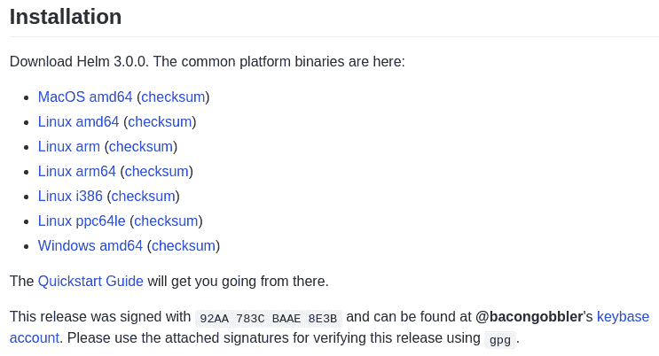
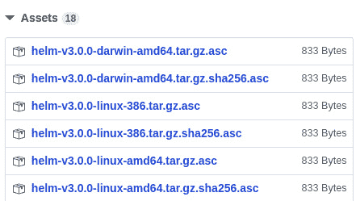

# 九、Helm安全考虑

正如您在本书中可能已经意识到的那样，Helm 是一个强大的工具，它为用户提供了许多部署可能性。然而，如果某些安全范例得不到认可和遵循，这种权力就会失控。幸运的是，从下载 Helm CLI 到在 Kubernetes 集群上安装 Helm 图表，Helm 提供了许多将安全性以简单的方式纳入日常使用的方法。

在本章中，我们将涵盖以下主题:

*   数据来源和完整性
*   Helm图安全性
*   关于 RBAC、价值和图表存储库的其他注意事项

# 技术要求

本章将利用以下技术:

*   `minikube`
*   `kubectl`
*   舵
*   **GNU 隐私卫士** ( **GPG** )

Minikube、Kubectl 和 Helm 的安装和配置在 [*第 2 章*](02.html#_idTextAnchor098)*准备 Kubernetes 和 Helm 环境*中进行了介绍。

我们还将利用位于 https://github.com/PacktPublishing/-Learn-Helm T2 的 Packt 存储库中的`guestbook`图表，作为本章后面的示例。如果您尚未克隆此存储库，请务必使用以下命令进行克隆:

```
$ git clone https://github.com/PacktPublishing/-Learn-Helm.git Learn-Helm
```

# 数据来源和完整性

处理任何类型的数据时，都应该考虑两个经常被忽略的问题:

*   数据是来自可靠的来源还是来自你期望的来源？
*   数据是否包含您预期的所有内容？

第一个问题是关于**数据出处**的话题。数据来源是关于确定数据的来源。

第二个问题是关于**数据完整性**的话题。数据完整性是关于确定您从远程位置接收的内容是否代表您预期接收的内容，并且可以帮助确定数据在通过网络发送时是否被篡改。数据来源和数据完整性都可以通过一个名为**数字签名**的概念进行验证。作者可以基于密码学创建一个唯一的签名来对数据进行签名，而该数据的消费者可以使用加密工具来验证该签名的真实性。

如果真实性得到验证，那么消费者就知道数据来自预期的来源，并且在传输时没有被篡改。

作者可以创建一个数字签名，首先创建一个“T1”良好隐私“T2”(“T3”PGP“T4”)密钥文件。在本文中，PGP 指的是 OpenPGP，它是一套基于加密的标准。PGP 专注于建立非对称加密，这是基于两种不同密钥的使用——私有和公共。

私钥是保密的，而公钥是共享的。对于数字签名，私钥用于加密数据，而公钥由消费者用于解密该数据。PGP 密钥文件通常是使用一种叫做 GPG 的工具创建的，这是一种实现 OpenPGP 标准的开源工具。

一旦 PGP 密钥文件被创建，作者就可以使用 GPG 对数据进行签名。签署数据后，GPG 在后台执行以下步骤:

1.  基于数据的内容计算散列。输出是一个固定长度的字符串，称为**消息摘要**。
2.  消息摘要是使用作者的私钥加密的。输出是数字签名。

为了验证签名，消费者必须使用作者的公钥来解密它。这种验证也可以使用 GPG 进行。

数字签名以两种方式在掌舵中发挥作用:

*   首先，每个 Helm 下载都有一个来自其中一个维护者的附带数字签名，可以用来验证二进制文件的真实性。该签名可用于验证下载的来源及其完整性。
*   其次，Helm图表也可以进行数字签名，以受益于相同的验证。图表的作者在打包过程中对图表进行签名，图表用户使用作者的公钥验证图表的有效性。

了解了数据来源和完整性与数字签名之间的关系后，让我们在您的本地工作站上创建一个 GPG 关键点，如果您还没有这样的工作站的话，我们将使用它来阐述前面描述的许多概念。

## 创建 GPG 关键帧

为了创建一个关键帧，你必须首先在你的本地机器上安装 GPG。使用以下说明作为在本地计算机上安装 GPG 的指南。请注意，在 Linux 系统上，您可能已经安装了 GPG:

*   For Windows, you can use the Chocolatey package manager, as in the following command:

    ```
    > choco install gnupg
    ```

    你也可以从 nload.html https://gpg4win.org/dow 下载 Win [dows 的安装程序。](https://gpg4win.org/download.html)

*   For macOS, you can use the Homebrew package manager using the following command:

    ```
    $ brew install gpg
    ```

    你也可以从 https://sourceforge.net/p/gpgosx/docu 下载基于苹果操作系统的 insta[/Download/。](https://sourceforge.net/p/gpgosx/docu/Download/)

*   对于基于 Debian 的 Linux 发行版，您可以使用`apt`包管理器，如图所示:

    ```
    $ sudo apt install gnupg
    ```

*   对于基于 RPM 的 Linux 发行版，可以使用`dnf`包管理器，如图所示:

    ```
    $ sudo dnf install gnupg
    ```

一旦您安装了 GPG，您就可以创建自己的 GPG keypair，我们将在讨论数据来源和完整性时用到它。

配置此密钥空气的步骤如下:

1.  运行以下命令创建一个新的 keypair。该命令可以从任何目录运行:

    ```
    $ gpg --generate-key
    ```

2.  按照提示输入您的姓名和电子邮件地址。这些将用于识别您是密钥的所有者，并将是接收您的公钥的人看到的姓名和电子邮件地址。
3.  按下 *O* 键继续。
4.  然后系统会提示您输入私钥密码。输入并确认用于加密和解密操作的所需密码..

一旦创建了 GPG 关键帧，您将看到类似以下的输出:


图 9.1:成功创建 GPG 关键帧后的输出

输出显示关于公钥(`pub`)和私钥(`sub`)的信息，以及公钥的指纹(输出的第二行)。指纹是一个唯一的标识符，用来识别你是钥匙的主人。第三行，以`uid`开头，显示您在生成 GPG 关键帧时输入的姓名和电子邮件地址。

现在您的`gpg`关键帧已经创建，请继续下一节，了解如何验证 Helm 下载。

## 验证 Helm 下载

正如*第 2 章*、*中所讨论的，准备一个 Kubernetes 和 Helm 环境*，可以安装 Helm 的方法之一是从 GitHub 下载一个档案。通过选择以下截图中显示的链接之一，可以从 Helm 的 GitHub 发行版页面([https://github.com/helm/helm/releases](https://github.com/helm/helm/releases))安装这些档案:



图 9.2:Helm的 GitHub 发行版页面的安装部分

在**安装**部分的底部，你会注意到一个段落，解释发布已经签署。每个 Helm 版本都由 Helm 维护人员签名，并且可以根据与下载的 Helm 版本相对应的数字签名进行验证。每个数字签名都位于**资产**部分。

下面的截图显示了这些是如何表示的:



图 9.3:Helm的 GitHub 发布页面中的资产部分

要验证你的 Helm 下载的出处和完整性，还应该下载相应的`.asc`文件。注意`.sha256.asc`文件仅用于验证完整性。在本例中，我们将下载相应的`.asc`文件，该文件将验证出处和完整性。

按照以下步骤开始验证舵的释放:

1.  在与您的操作系统相对应的安装下下载 Helm 归档文件。尽管 Helm 二进制文件可能已经安装，但您仍然可以下载一个归档文件来跟随示例。完成示例后，您可以从工作站中删除归档文件。
2.  Download the `.asc` file that corresponds with your operating system. For example, if you are running an AMD64-based Linux system, you would download the `helm-v3.0.0-linux-amd64.tar.gz.asc` file.

    重要说明

    文件名中包含的版本对应于您正在下载的实际 Helm 版本。

下载完这两个文件后，您应该会在命令行的同一目录中看到两个相似的文件:

```
helm-v3.0.0-linux-amd64.tar.gz
helm-v3.0.0-linux-amd64.tar.gz.asc
```

下一步包括将 Helm 维护者的公钥导入到您的本地`gpg`密钥环中。这允许您解密包含在`.asc`文件中的数字签名，以验证您下载的来源和完整性。维护者的公钥可以通过跟踪到他们的 keybase 帐户的链接来检索。将光标悬停在`keybase account`字样上即可找到该链接。在*图 9.2* 的示例中，该位置解析为[https://keybase.io/bacongobbler](https://keybase.io/bacongobbler)。然后可以通过在末尾添加`/pgp_keys.asc`来下载公钥，使[结果链接 https://keybase.io/bacongobbl](https://keybase.io/bacongobbler/pgp_keys.asc)er/PGP _ keys . ASC。

请注意，有多个 Helm 维护者，因此如果您在不同的版本上执行验证，您的链接可能会有所不同。请确保您下载的是与签署版本的密钥相对应的正确公钥。

让我们继续验证过程:

1.  使用命令行，下载 Helm 发行签名对应的公钥:

    ```
    $ curl -o **release_key.asc** https://keybase.io/bacongobbler/pgp_keys.asc
    ```

2.  Once downloaded, you need to import the public key to your gpg keyring. This is done by running the following command:

    ```
    $ gpg --import release_key.asc
    ```

    如果导入成功，您将看到以下消息:

    ```
    gpg: key 92AA783CBAAE8E3B: public key 'Matthew Fisher <matt.fisher@microsoft.com>' imported
    gpg: Total number processed: 1
    gpg:               imported: 1
    ```

3.  Now that the public key of the digital signature has been imported, you can verify the Helm installation's release by leveraging the `--verify` subcommand of GPG. This should be run against the `helm*.asc` file:

    ```
    $ gpg --verify helm-v3.0.0-linux-amd64.tar.gz.asc
    ```

    该命令将尝试解密包含在`.asc`文件中的数字签名。如果成功，则意味着 Helm 下载(以`.tar.gz`结尾的文件)是由您期望的人(【本版本的 T2】)签署的，并且下载没有以任何方式被修改或更改。成功的输出如下:

    ```
    gpg: assuming signed data in 'helm-v3.0.0-linux-amd64.tar.gz'
    gpg: Signature made Wed 13 Nov 2019 08:05:01 AM CST
    gpg:                using RSA key 967F8AC5E2216F9F4FD270AD92AA783CBAAE8E3B
    gpg: Good signature from 'Matthew Fisher <matt.fisher@microsoft.com>' [unknown]
    gpg: WARNING: This key is not certified with a trusted signature!
    gpg:          There is no indication that the signature belongs to the owner.
    Primary key fingerprint: 967F 8AC5 E221 6F9F 4FD2  70AD 92AA 783C BAAE 8E3B
    ```

进一步检查该输出时，您可能会注意到`WARNING`消息，表明密钥未通过认证，这可能会导致您质疑这是否实际成功的有效性。验证成功，但是您没有指示 gpg 维护者的公钥被证明属于他们所说的那个人。

您可以通过以下步骤执行此认证:

1.  检查输出末尾显示的主键指纹的最后 64 位(8 个字符)是否与 Helm releases 页面中显示的 64 位指纹匹配。大家可以从*图 9.2* 中回想起，显示的是指纹，如图:

    ```
    This release was signed with 92AA 783C BAAE 8E3B and **can be found** at @bacongobbler's keybase account.
    ```

2.  从前面的代码中可以看到，**主键指纹**的最后 64 位显示在 Helm releases 页面上，所以我们知道这个公钥确实属于我们期望它属于的人。因此，我们可以安全地认证维护者的公钥。这可以通过使用您自己的`gpg`密钥对公钥进行签名来实现。使用以下命令执行此步骤:

    ```
    $ gpg --sign-key 92AA783CBAAE8E3B # Last 64 bits of fingerprint
    ```

3.  In the `Really sign?` prompt, enter `y`.

    现在您已经签署了维护者的公钥，该密钥现在已经被认证。现在可以运行验证，而无需在输出中显示`WARNING`消息:

    ```
    $ gpg --verify helm-v3.0.0-linux-amd64.tar.gz.asc
    gpg: assuming signed data in 'helm-v3.0.0-linux-amd64.tar.gz'
    gpg: Signature made Wed 13 Nov 2019 08:05:01 AM CST
    gpg:                using RSA key 967F8AC5E2216F9F4FD270AD92AA783CBAAE8E3B
    gpg: checking the trustdb
    gpg: marginals needed: 3  completes needed: 1  trust model: pgp
    gpg: depth: 0  valid:   2  signed:   1  trust: 0-, 0q, 0n, 0m, 0f, 2u
    gpg: depth: 1  valid:   1  signed:   0  trust: 1-, 0q, 0n, 0m, 0f, 0u
    gpg: next trustdb check due at 2022-03-11
    gpg: Good signature from 'Matthew Fisher <matt.fisher@microsoft.com>' [full]
    ```

数字签名在验证 Helm 图表的来源和完整性方面也发挥了作用。我们将在下一节中继续讨论。

# 签署和验证舵角图

类似于 Helm 维护者如何签署版本，您可以签署自己的 Helm 图表，以便用户可以验证他们安装的图表实际上来自您，并且包含预期的内容。要签署图表，您必须首先在您的本地工作站上有一个`gpg`按键。

接下来，您可以利用`helm package`命令中的特定标志，用指定的键为您的图表签名。

让我们演示如何通过利用 Packt 存储库中的`guestbook`图表来实现这一点。该图表位于`Learn-Helm/helm-charts/charts/guestbook`文件夹中。我们将假设您的本地工作站上已经有一个 gpg keypair，但是如果没有，您可以按照本章的*数据来源和完整性*部分的*设置*部分的说明来配置您的 keypair。

在签署`guestbook`图表之前需要注意的一点是，如果您使用的是 GPG 版本`2`或更高版本，则必须将您的公共和机密密钥环导出为传统格式。GPG 的早期版本以`.gpg`文件格式存储钥匙圈，这是Helm期望你的钥匙圈的格式(在写作时)。较新版本的 GPG 以`.kbx`文件格式存储钥匙圈，这是目前不支持的。

通过将您的 GPG 公共和机密密钥环转换为`.gpg`文件格式，开始签名过程:

1.  通过运行以下命令找到您的`gpg`版本:

    ```
    $ gpg --version
    gpg (GnuPG) 2.2.9
    libgcrypt 1.8.3
    Copyright (C) 2018 Free Software Foundation, Inc.
    ```

2.  If your `gpg` version is `2` or greater, export your public and secret keyring using the following command:

    ```
    $ gpg --export > ~/.gnupg/pubring.gpg
    $ gpg --export-secret-keys > ~/.gnupg/secring.gpg
    ```

    一旦你的钥匙圈已经导出，你将能够签署和包装你的头盔图表。`helm package`命令提供三个关键(双关)标志，允许您签署和打包图表:

    `--sign`:允许您使用 PGP 私钥签署图表

    `--key`:签名时要使用的密钥的名称

    `--keyring`:包含 PGP 私钥的密钥环的位置

    在下一步中，这些标志将与`helm package`命令一起用于签署和打包留言簿 Helm 图表。

3.  Run the following `helm package` command:

    ```
    $ helm package --sign --key '$KEY_NAME' --keyring ~/.gnupg/secring.gpg guestbook
    ```

    `$KEY_NAME`变量可以指与所需密钥相关联的电子邮件、姓名或指纹。这些细节可以通过利用`gpg --list-keys`命令来发现。

    当使用`helm package`命令而不签名时，您将期望看到一个文件作为输出生成，即包含 Helm 图表的`tgz`档案。在这种情况下，当签署和打包`guestbook`Helm图表时，您将看到创建了以下两个文件:

    ```
    guestbook-1.0.0.tgz
    guestbook-1.0.0.tgz.prov
    ```

    `guestbook-1.0.0.tgz.prov`文件被称为一个**出处**文件。起源文件包含一个起源记录，显示如下:

    *   `Chart.yaml`文件中的图表元数据
    *   Helm `guestbook-1.0.0.tgz`文件的 sha256 哈希
    *   The PGP digital signature of the `guestbook-1.0.0.tgz` file

        Helm 图表的用户将利用来源文件来验证图表的数据来源和完整性。当将图表推送到图表存储库时，开发人员应该确保上传 Helm 图表的`.tgz`档案和`.tgz.prov`出处文件。

        一旦您打包并签署了您的 Helm 图表，您将需要导出与用于加密您的数字签名的私钥相对应的公钥。这将允许用户下载您的公钥并在验证过程中使用它。

4.  Export your public key to the `ascii-armor` format by using the following command:

    ```
    $ gpg --armor --export $KEY_NAME > pubkey.asc
    ```

    如果您正在公开发布`guestbook`图表，那么您的图表用户可以将该密钥保存到可下载的位置，例如 Keybase。然后，用户可以通过利用本章*验证Helm版本*一节中描述的`gpg --import`命令来导入该公钥。

    图表用户可以在安装前利用`helm verify`命令验证图表的数据来源和完整性。该命令旨在针对本地下载的`.tgz`图表档案和`.tgz.prov`来源文件运行。

5.  The following command provides an example of running this process against the `guestbook` Helm chart and assumes that your public key has been imported to a keyring called `~/.gnupg/pubring.gpg`:

    ```
    $ helm verify --keyring ~/.gnupg/pubring.gpg guestbook-1.0.0.tgz
    ```

    如果验证成功，将不显示任何输出。否则，将返回一条错误消息。验证可能因各种原因而失败，包括以下原因:

    那个。tgz 和. tgz.prov 文件不在同一目录中。

    . tgz.prov 文件已损坏。

    文件哈希不匹配，表明完整性丧失。

    用于解密签名的公钥与最初用于加密签名的私钥不匹配。

`helm verify`命令是设计用于在本地下载的图表上运行，因此用户可能会发现更好的方法是利用`helm install --verify`命令，该命令在一个命令中执行验证和安装，假设`.tgz`和`.tgz.prov`文件都可以从图表存储库中下载。

以下命令描述了如何使用`helm install --verify`命令:

```
$ helm install my-guestbook $CHART_REPO/guestbook --verify --keyring ~/.gnupg/pubring.gpg
```

通过使用本节中描述的方法来签名和验证 Helm 图表，您和您的用户都可以确保您正在安装的图表都属于您，并且没有被更改。

了解了数据来源和完整性如何在 Helm 中发挥作用后，让我们继续讨论 Helm 安全性考虑事项，进入下一个主题——与 Helm 图表和 He lm 图表开发相关的安全性。

# 开发安全的舵角图

虽然出处和完整性在 Helm 的安全性中起着主要作用，但它们不是您需要考虑的唯一问题。图表开发人员应该确保，在开发过程中，他们遵循有关安全性的最佳实践，以防止用户在 Kubernetes 集群中安装图表时引入漏洞。在本节中，我们将讨论与 Helm 图表开发相关的许多主要安全问题，以及作为开发人员，您可以做些什么来将安全作为首要任务来编写 Helm 图表。

我们将首先讨论我们的 Helm 图表可能使用的任何容器映像的安全性。

## 使用安全映像

由于 Helm(和 Kubernetes)的目标是部署容器映像，因此映像本身是一个主要的安全问题。首先，图表开发人员应该知道映像标签和映像摘要之间的区别。

标签是对给定映像的人类可读引用，为开发者和消费者提供了一种确定映像内容的简单方法。但是，标签可能会带来安全问题，因为无法保证给定标签的内容始终保持不变。映像所有者可以选择使用相同的标签来提供更新的映像，例如，为了解决安全漏洞，这将导致在运行时执行不同的底层映像，即使标签是相同的。对同一个标签执行这些修改会引入回归的可能性，这会给用户带来意想不到的负面影响。映像也可以通过摘要来引用，而不是通过标签来引用。映像摘要是映像的计算 SHA-256 值，它不仅为精确的映像提供不可变的标识符，还允许容器运行时验证从远程映像注册表检索的映像包含预期内容。这消除了部署包含针对给定标签的意外回归的映像的风险，也消除了中间人攻击的风险，在中间人攻击中，标签的内容被恶意修改。

例如，在图表模板中，不要将映像引用为`quay.io/bitnami/redis:5.0.9`，而是可以通过摘要将其引用为`quay.io/bitnami/redissha256:70b816f2127afb5d4af7ec9d6e8636b2f0f 973a3cd8dda7032f9dcffa38ba11f`。请注意，映像名称后面没有标签，而是明确指定了 SHA-256 摘要。这可以确保映像内容不会随着时间的推移而改变，即使标签发生了变化，从而增强您的安全态势。

随着时间的推移，您可能会认为与映像相关联的标签或摘要在部署时变得不安全，因为漏洞最终可能会针对该映像可能包含的包或操作系统版本发布。有许多不同的方法可以确定与给定映像相关的漏洞。一种方法是利用映像所属的注册表的本机功能。许多不同的映像注册中心都包含映像漏洞扫描功能，有助于了解映像何时易受攻击。

例如，Docker容器登记处可以以指定的时间间隔自动扫描映像，以确定映像包含的漏洞数量。Nexus 和 Artifactory 容器注册中心也是具有这种能力的容器注册中心的例子。除了容器注册中心提供的本地扫描功能之外，还可以利用其他工具，如 Clair(也是 **Quay** 的后备扫描技术)、Anchore、Vuls 和 OpenSCAP。当您的映像注册表或独立扫描工具报告某个映像易受攻击时，您应该立即将图表的映像更新到较新的版本(如果可用)，以防止漏洞被引入用户的 Kubernetes 集群。

为了帮助简化更新容器映像的过程，您可以开发一个定期检查映像更新的节奏。这有助于防止您的目标映像包含不适合部署的漏洞。许多团队和组织还规定映像只能来自可信的注册中心，以减少运行包含漏洞的映像的可能性。此设置是在容器运行时级别配置的，位置和特定配置因每个运行时而异。

除了映像漏洞扫描和内容来源，您还应该避免部署需要更高权限或能力的映像。功能用于给进程一个根权限子集。功能的一些例子是`NET_ADMIN`，它允许进程执行与网络相关的操作，以及`SYS_TIME`，它允许进程修改系统时钟。以根用户身份运行容器可以让容器访问所有的功能，只要有可能，就应该对这些功能进行限制。功能列表可以在 Linux 手册页的*Capabilities(7)*pa[ge(http://man7.org/linux/man-](http://man7.org/linux/man-pages/man7/capabilities.7.html)页/手册 7/capabilities.7.html)中找到。

授予容器能力或允许它以 root 身份运行，会让恶意进程更容易损坏底层主机。这不仅会影响引入漏洞的容器，还会影响在该主机上运行的任何其他容器，并可能影响整个 Kubernetes 集群。如果一个容器确实存在漏洞，但是没有任何被授予的能力，那么攻击向量就会小得多，并且有可能被完全阻止。开发 Helm 图表时，必须同时考虑映像的漏洞和权限要求，以确保您的用户以及 Kubernetes 集群的其他租户的安全。

除了部署的容器映像之外，图表开发人员还应该关注授予应用的资源。我们将在下一节深入探讨这个话题。

设置资源限制

pod 使用属于其底层节点的资源。如果没有适当的默认值，pod 可能会耗尽`node of resources`，导致 CPU 节流和 pod 驱逐等问题。耗尽底层节点也将阻止在那里调度其他工作负载。由于资源限制未被检查时可能出现的问题，图表开发人员应该关心在他们的 Helm 图表或 Kubernetes 集群中设置合理的默认值。

许多图表允许将部署`resources`字段声明为 Helm 值。图表开发人员可以默认`values.yaml`文件中的`resources`字段，设置开发人员认为应用应该需要的资源量。下面的代码显示了一个这样的例子:

```
resources:
  limits:
    cpu: 500m
    memory: 2Gi
```

如果保留默认值，该示例值将用于将 pod 的 CPU 限制设置为`500m`，将内存限制设置为`2Gi`。在`values.yaml`文件中设置此默认值可防止 pod 耗尽节点资源，同时还可为所需的应用资源量提供建议值。如果需要，用户可以选择覆盖资源限制。请注意，图表开发人员也可以为资源请求设置默认值，但这不会阻止 pod 耗尽节点资源。

虽然您应该考虑在`values.yaml`文件中设置默认资源限制，但您也可以在图表将安装的 Kubernetes 命名空间中设置限制范围和资源配额。这些资源通常不包含在 Helm 图表中，而是由集群管理员在应用部署之前创建的。限制范围用于确定允许容器在命名空间内使用的资源数量。限制范围还用于为部署到尚未定义资源限制的命名空间的每个容器设置默认资源限制。以下是由`LimitRange`对象定义的限制范围示例:

```
apiVersion: v1
kind: LimitRange
metadata:
  name: limits-per-container
spec:
  limits:
    - max:
        cpu: 1
        memory: 4Gi
      default:
        cpu: 500m
        memory: 2Gi
      type: Container
```

`LimitRange`在创建`LimitRange`对象的命名空间中实施指定的限制。它将允许的最大容器资源量设置为`cpu`的`1`核心和`memory`的`4Gi`。如果未定义资源限制，则自动将资源限制设置为`cpu`的`500m`和`memory`的`2Gi`。通过将`type`字段设置为`Pod`，也可以在 pod 级别应用限制范围。这将确保 pod 中所有容器的资源利用率总和低于指定的限制。除了针对 CPU 和内存利用率设置限制之外，您还可以通过将`type`字段设置为`PersistentVolumeClaim`来设置`LimitRange`对象默认为`PersistentVolumeClaim`对象所要求的存储。

这将允许您创建以下资源来设置单个聚氯乙烯的存储限制:

```
apiVersion: v1
kind: LimitRange
metadata:
  name: limits-per-pvc
spec:
  - max:
      storage: 4Gi
    type: PersistentVolumeClaim
```

当然，您也可以在 Helm 图表的`values.yaml`文件中设置默认存储量。`values.yaml`文件中的默认设置反映了您认为默认安装所需的存储量，`LimitRange`对象强制用户可以覆盖的绝对最大值。

除了限制范围之外，您还可以设置资源配额，以针对命名空间的资源使用添加其他限制。虽然限制范围在每个容器、容器或聚氯乙烯级别实施资源，但资源配额在每个命名空间级别实施资源使用。它们用于定义命名空间可以利用的最大资源数量。以下是资源配额示例:

```
apiVersion: v1
kind: ResourceQuota
metadata:
  name: pod-and-pvc-quota
spec:
  hard:
    limits.cpu: '4'
    limits.memory: 8Gi
    requests.storage: 20Gi
```

前面的`ResourceQuota`对象在应用到 Kubernetes 命名空间时，将最大 CPU 利用率设置为`4`内核，最大内存利用率设置为`8Gi`，将最大存储请求设置为`20Gi`，以获取命名空间中所有工作负载的总和。资源配额也可用于设置每个名称空间的最大`secrets`、`ConfigMaps`和其他 Kubernetes 资源量。通过使用`resource quotas`，可以防止单个命名空间过度利用集群资源。

通过在您的 Helm 图表中设置合理的默认资源限制，以及`LimitRange`和`ResourceQuota`的存在，您可以确保您的 Helm 图表的用户不会耗尽集群资源并导致中断或中断。了解了如何实施资源限制后，让我们进入下一个关于Helm图表安全性的话题——汉在Helm图表中掌握机密。

## 在舵手图中处理机密

处理机密是使用Helm图表时的常见问题。考虑一下 [*第 3 章*](03.html#_idTextAnchor147)*中的WordPress 应用安装您的第一个Helm图*，其中您需要提供密码来配置管理员用户。在`values.yaml`文件中默认不提供该密码，因为如果您忘记覆盖`password`值，这将使应用易受攻击。图表开发人员应该习惯于不为密码等机密值提供默认值，而是应该要求用户提供一个显式值。这可以通过利用`required`功能轻松实现。Helm 还具有使用`randAlphaNum`功能生成随机字符串的能力。

但是，请注意，每当图表升级时，此函数都会生成一个新的随机字符串。因此，开发人员在设计图表时，应期望用户提供自己的密码或其他密钥，以`required`功能作为确保提供值的大门。

当用户在图表安装过程中提供一个机密时，该值应该保存在`secret`中，而不是`ConfigMap`中。配置映射以纯文本显示值，不包含凭据或其他机密值。另一方面，机密通过对其内容进行 Base64 编码来提供混淆。机密也允许将它的内容作为`tmpfs`挂载到一个容器中，这意味着内容被挂载到易失性存储器中的容器中，而不是磁盘上。作为图表开发人员，您应该确保由 Helm 图表管理的所有凭据和机密配置都是使用 Kubernetes Secrets 创建的。

虽然图表开发人员应确保使用 Kubernetes Secrets 和`required`函数适当处理机密，但图表用户应确保像凭据这样的机密被安全地提供给 Helm 图表。最常见的是将值提供给带有`--values`标志的 Helm 图表，其中附加值或覆盖值在单独的`values`文件中声明，并在安装过程中传递给 Helm CLI。在使用常规值时，这是一种合适的方法，但是在使用机密值时，应该小心谨慎。用户应确保包含机密的`values`文件不会被检入`git`存储库或其他可能暴露机密的公共场所。用户可以避免暴露机密的一种方法是利用`--set`标志从他们的本地命令行内联传递机密。这降低了凭据被暴露的风险，但是用户应该知道这将暴露 bash 历史中的凭据。

用户可以避免暴露机密的另一种方法是利用加密工具对包含机密的`values`文件进行加密。这将继续允许用户应用`--values`标志并将`values`文件推送到远程位置，例如 git 存储库。`values`文件只能由拥有适当密钥的用户解密，并对所有其他用户保持加密，只允许可信成员访问数据。用户可以简单地利用 GPG 对`values`文件进行加密，也可以利用 **Sops** 等阿格专用工具。**Sops**(https://github.com/mozilla/sops)是一个工具，旨在加密 YAML 或 JSON 文件的值，但不加密密钥。以下代码显示了 Sops 加密文件中的密钥/值对:

```
password:ENC[AES256GCM,data:xhdUx7DVUG8bitGnqjGvPMygpw==,iv:3LR9KcttchCvZNpRKqE5LcXRyWD1I00v2kEAIl1ttco=,tag:9HEwxhT9s1pxo9lg19wyNg==,type:str]
```

请注意`password`密钥是如何未加密的，但值是如何加密的。这使您可以轻松地查看文件中包含什么类型的值，而不会暴露它们的机密。

还有其他工具能够加密包含 se [密码的`values`文件。例如`git-`](https://github.com/AGWA/git-crypt)`crypt`([https://github.com/AGWA/git-crypt](https://github.com/AGWA/git-crypt))和`blackbox`([https://github.com/StackExchange/blackbox](https://github.com/StackExchange/blackbox))。此外，哈希公司的`Vault`或赛博方舟幻化等工具可用于加密密钥/值存储形式的机密。然后，可以通过向机密管理系统进行认证来检索机密，然后通过将它们传递给`--set`，在 Helm 中利用它们。

了解了安全性在 Helm 图表开发中的作用后，现在让我们讨论如何在 Kubernetes 中应用**基于角色的访问控制**(**【RBAC】**)来为您的用户提供更高的安全性。

# 配置 RBAC 规则

Kubernetes 中认证用户执行操作的能力由一组 RBAC 策略控制。正如在*第 2 章*、*准备 Kubernetes 和 Helm 环境*中介绍的，策略(称为角色)可以与用户或服务帐户相关联，Kubernetes 包含几个可以关联的默认角色。从版本`1.6`开始，在 Kubernetes 中默认启用了 RBAC。在 Helm 用法的背景下考虑 Kubernetes RBAC 时，您需要考虑两个因素:

*   用户正在安装 Helm 图表
*   与运行工作负载的 pod 关联的服务帐户

在大多数情况下，负责安装 Helm 图表的个人与 Kubernetes 用户相关联。但是，可以通过其他方式安装 Helm 图表，例如由具有相关服务帐户的 Kubernetes 运营商安装。

默认情况下，用户和服务帐户在 Kubernetes 集群中具有最低权限。通过使用作用于单个命名空间的角色，或者在群集级别授予访问权限的群集角色，可以授予额外的权限。然后，根据目标策略的类型，使用角色绑定或集群角色绑定将它们与用户或服务帐户相关联。虽然 Kubernetes 有许多可以应用的角色，但是**最低权限访问**的概念应该尽可能地使用。最低权限访问指的是用户或应用仅被授予正常运行所需的最低权限集。比如我们之前开发的`guestbook`图。假设我们想要添加新的功能，可以在`guestbook`应用的名称空间中查询 pods 的元数据。

虽然 Kubernetes 包含一个名为**视图**的内置角色，该角色提供了在给定的命名空间中读取 pod 清单的必要权限，但它也提供了对其他资源的访问，例如配置地图和部署。为了最小化授予应用的访问级别，可以创建角色或集群角色形式的自定义策略，该策略仅提供应用所需的必要权限。由于 Kubernetes 集群的大多数典型用户无权在集群级别创建资源，因此让我们创建一个应用于 Helm 图表所部署的命名空间的角色。

要创建新角色，可以使用`kubectl create role`命令。基本角色包含两个关键要素:

*   针对Kubernetes应用编程接口的动作类型(动词)
*   要瞄准的 Kubernetes 资源列表

例如，为了演示如何在 Kubernetes 中配置 RBAC，让我们配置一组 RBAC 规则，以允许经过身份验证的用户查看命名空间中的 pods。

重要说明

如果您想在本地工作站上运行此示例，请确保首先通过运行`minikube start`启动 Minikube。

然后，您可以通过运行`kubectl create ns chapter9`来创建一个名为`chapter9`的新命名空间:

1.  Use the `kubectl` CLI to create a new role called `guestbook-pod-viewer`:

    ```
    $ kubectl create role guestbook-pod-viewer --resource=pods --verb=get,list -n chapter9
    ```

    创建这个新角色后，它需要与用户或服务帐户相关联。由于我们希望将其与在 Kubernetes 中运行的应用相关联，因此我们将把该角色应用于服务帐户。当一个 pod 被创建时，它使用一个名为`default`的服务帐户。当试图遵守最低权限访问原则时，建议使用单独的服务帐户。这是为了确保没有其他工作负载部署在与`guestbook`应用相同的名称空间中，因为它也将继承相同的权限。

2.  通过执行以下命令创建名为`guestbook`的新服务帐户:

    ```
    $ kubectl create sa guestbook -n chapter9
    ```

3.  Next, create a role binding called `guestbook-pod-viewers` to associate `guestbook-pod-viewer` with `guestbook ServiceAccount`:

    ```
    $ kubectl create rolebinding guestbook-pod-viewers --role=guestbook-pod-viewer --serviceaccount=chapter9:guestbook -n chapter9
    ```

    最后，要使用新创建的`guestbook` `ServiceAccount`运行`guestbook`应用本身，需要将服务帐户的名称应用到部署中。

    下图显示了`serviceAccount`配置在部署 YAML 中的显示方式:

    ```
    serviceAccountName: guestbook
    ```

    您可以通过使用您在 [*第 5 章*](05.html#_idTextAnchor265)*中创建的图表来轻松安装`guestbook`应用，或者通过使用位于 https://github.com/PacktPublishing/-Learn 帕克特存储库中的[图表来轻松安装](https://github.com/PacktPublishing/-Learn-Helm/tree/master/helm-charts/charts/guestbook)[应用。此图表显示了一组用于配置部署服务帐户的值。](https://github.com/PacktPublishing/-Learn-Helm/tree/master/helm-charts/charts/guestbook)*

4.  Install the `guestbook` Helm chart by running the following command:

    ```
    $ helm install my-guestbook Learn-Helm/helm-charts/charts/guestbook \
    --set serviceAccount.name=guestbook \
    --set serviceAccount.create=false \
    -n chapter9
    ```

    注意在*第 4 步*中，`serviceAccount.create`值被设置为`false`。当您使用`helm create`命令在 [*第 5 章*](05.html#_idTextAnchor265)*构建您的第一个Helm图表*时，提供了在图表安装时创建服务帐户的能力。由于您之前已经使用`kubectl`创建了服务帐户，因此不需要这样做。但是，在图表安装过程中创建与 RBAC 相关的其他资源的能力并不需要以创建服务帐户结束。事实上，如果 Helm 图表包含创建角色和角色绑定所需的 YAML 资源，您可以在单个图表安装中执行步骤 1、2 和 3。

5.  At this point, the `guestbook` application has the permissions necessary to list and get pods. To verify this assumption, `kubectl` has a command that queries whether a user or service account has the authority to perform an action. Execute the following command to verify that the `ServiceAccount` guestbook has access to query all the pods in the `guestbook` namespace:

    ```
    $ kubectl auth can-i list pods --as=system:serviceaccount:chapter9:guestbook -n chapter9
    ```

    `--as`标志利用 Kubernetes 中的用户模拟功能，允许调试授权策略。

6.  命令的结果应打印`yes`作为输出。要确认服务帐户无法访问它不应该能够访问的资源，例如列出部署，请执行以下命令:

    ```
    $ kubectl can-i list deployments --as=system:serviceaccount:guestbook:guestbook -n chapter9
    ```

7.  Feel free to delete your release with the `helm uninstall` command:

    ```
    $ helm uninstall my-guestbook -n chapter9
    ```

    您也可以停止您的 Minikube 实例，这在本章的剩余部分是不需要的:

    ```
    $ minikube stop
    ```

从`no`的输出可以看出，预期的政策已经到位。

当有效使用时，Kubernetes·RBAC 帮助为 Helm chart 开发人员提供实施最低权限访问所需的工具，保护用户和应用免受潜在的错误或恶意操作。

接下来，我们将讨论如何以增强 Helm 整体安全性的方式保护和访问图表存储库。

# 访问安全图表库

图表存储库提供了发现Helm图表并将其安装在你的Kubernetes集群上的能力。第 1 章**[*中介绍了存储库:理解Kubernetes和Helm**理解Kubernetes和Helm*，作为一个 HTTP 服务器，它包含一个`index.yaml`文件，其中包含与存储库中存在的图表相关的元数据。在前面的章节中，我们使用了来源于各种上游存储库的图表，并使用 GitHub Pages 实现了我们自己的存储库。这些存储库中的每一个都可以免费提供给任何感兴趣的人使用。但是，Helm 确实支持加入额外的安全措施来保护存储在存储库中的内容，包括以下内容:](01.html#_idTextAnchor017)**

 **   证明
*   **安全套接字层** / **传输层安全** ( **SSL** / **TLS** )加密

虽然大多数公共 Helm 存储库不需要任何形式的身份验证，但 Helm 确实允许用户针对安全的图表存储库执行基本的和基于证书的身份验证。对于基本身份验证，通过使用`--username`和`--password`标志，使用`helm repo add`命令添加存储库时，可以提供用户名和密码。例如，如果您想要访问使用基本身份验证保护的存储库，添加存储库将采用以下形式:

```
$ helm repo add $REPO_URL --username=<username> --password=<password>
```

然后，可以与存储库交互，而不需要重复提供凭证。

对于基于证书的身份验证，`helm repo add`命令提供了`--ca-file`、`--cert-file`和`--key-file`标志。`--ca-file`标志用于验证图表存储库的证书授权，而`--cert-file`和`--key-file`标志分别用于指定您的客户端证书和密钥。

对图表存储库本身启用基本身份验证和证书身份验证取决于所使用的存储库实现。例如，流行的图表存储库 ChartMuseum 提供了`--basic-auth-user`和`--basic-auth-pass`标志，可在启动时用于配置基本身份验证的用户名和密码。它还提供了`--tls-ca-cert`标志来配置**证书颁发机构** ( **CA** )证书进行证书认证。其他图表存储库实现可能会提供其他标志或要求您提供配置文件。

即使身份验证到位，安全地促进 HTTP 服务器和 Helm 客户端之间的传输也很重要。这可以使用基于安全套接字层(SSL) /传输层安全性(TLS)的加密来执行，以保护您的 Helm 客户端和您的 Helm 图表存储库之间的通信。虽然需要证书身份验证，但需要基本身份验证的存储库(和未经身份验证的存储库)仍然可以从加密网络流量中受益，因为这将保护身份验证尝试以及存储库的内容。与身份验证一样，在图表存储库中配置 TLS 取决于所使用的存储库实现。ChartMuseum 提供`--tls-cert`和`--tls-key`标志来提供证书链和密钥文件。更一般的网络服务器，如 NGINX，通常需要一个配置文件，提供服务器上证书和密钥文件的位置。GitHub Pages 等产品已经配置了顶级域名系统。

到目前为止，我们使用的每一个 Helm 存储库都使用了由公开可用的 ca 签名的证书，这些证书存储在您的网络浏览器和底层操作系统中。许多大型组织都有自己的 ca，可以用来生成图表存储库中配置的证书。由于该证书可能不是来自公共可用的证书颁发机构，Helm CLI 可能不信任该证书，添加存储库会导致以下错误:

```
Error: looks like '$REPO_URL' is not a valid chart repository or cannot be reached: Get $REPO_URL/index.yaml: x509: certificate signed by unknown authority
```

为了允许 Helm CLI 信任图表存储库的证书，可以将 CA 证书或包含多个证书的 CA 捆绑包添加到操作系统的信任存储中，或者使用`helm repo add`命令的`--ca-file`标志明确指定。这使得命令可以毫无错误地执行。

最后，根据图表存储库的配置方式，还可以获得额外的指标来执行请求级审核和日志记录，以确定谁试图访问存储库。

通过使用管理传输层的认证和管理证书，为韩恩实现了额外的功能覆盖了 Helm 存储库的安全足迹。

# 总结

在本章中，您了解了在使用 Helm 时需要考虑的一些不同的安全主题。首先，您学习了如何证明数据来源以及 Helm 版本和 Helm 图表的完整性。接下来，您学习了 Helm 图表安全性，以及图表开发人员如何利用安全性方面的最佳实践来编写稳定且安全的 Helm 图表。最后，您学习了如何使用 RBAC 来创建基于最低权限访问概念的环境，以及如何保护图表存储库以提供 HTTPS 加密并要求身份验证。现在，有了这些概念，您可以更好地创建一个 s ecure Helm 架构和工作环境。

# 进一步阅读

*   要了解更多关于 Helm c harts 环境中数据来源[和完整性的信息，请访问](https://helm.sh/docs/topics/provenance/)[https://helm.sh/docs/topics/provenance/](https://helm.sh/docs/topics/provenance/)。
*   要了解更多关于Kubernetes RBAC 的信息，请查看 ubernetes.io/docs/reference/access-authn-authz/rbac/.Kubernetes文档中的*使用 RBAC 授权* [*授权*页面](https://kubernetes.io/docs/reference/access-authn-authz/rbac/)
*   查看 Helm docu [中的图表存储库指南，了解更多关于图表存储库](https://helm.sh/docs/topics/chart_repository/)和t[https://helm.sh/docs/topics/chart_repository/](https://helm.sh/docs/topics/chart_repository/)的信息。

# 问题

1.  什么是数据来源和完整性？数据来源和数据完整性有何不同？
2.  假设您想要证明 Helm 下载的数据来源和完整性。除了发布档案，用户需要从 Helm 的 GitHub 发布页面下载什么文件来完成这个任务？
3.  用户可以运行什么命令来验证 Helm 图表的数据来源和完整性？
4.  作为一名 Helm 图表开发人员，您可以做些什么来确保部署稳定的容器映像？
5.  为什么在你的 Helm 图表上设置资源限制很重要？还有哪些 Kubernetes 资源可以用来配置 pod 和命名空间的资源限制？
6.  最小权限访问的概念是什么？哪些 Kubernetes 资源允许您配置授权并帮助实现最低权限访问？
7.  什么命令和标志集可用于针对图表存储库进行身份验证？*