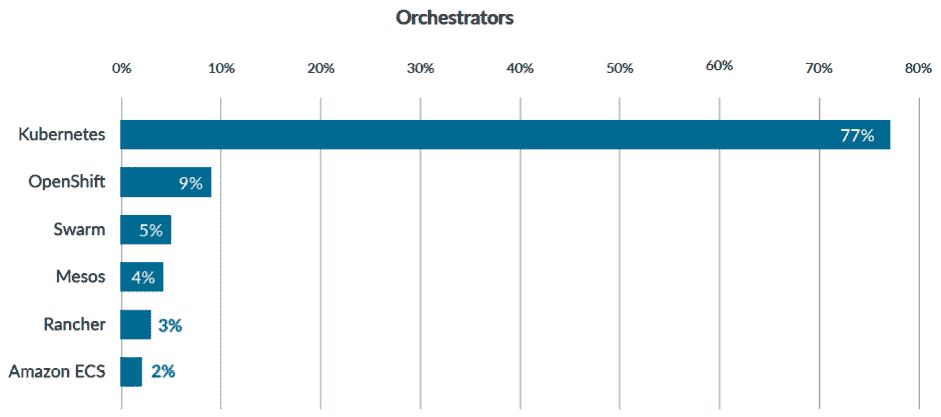
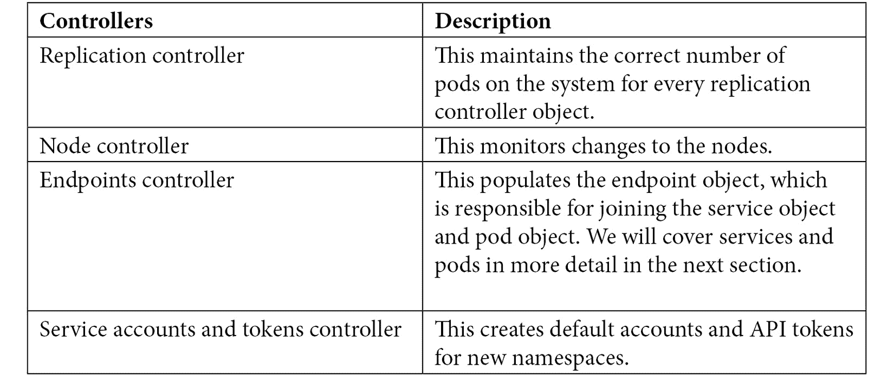
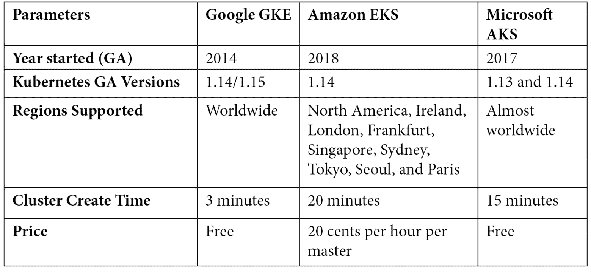
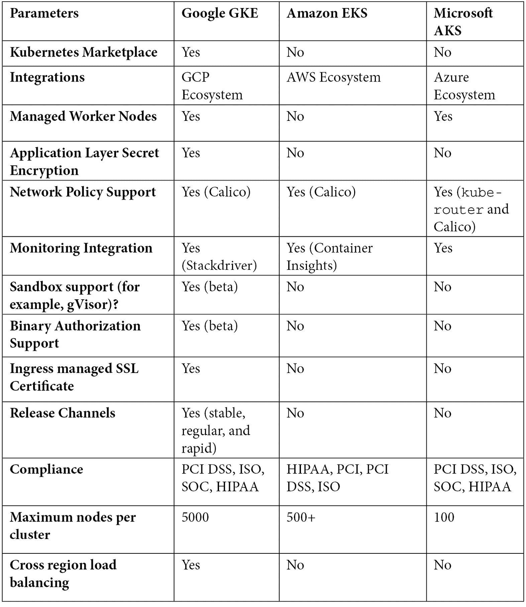
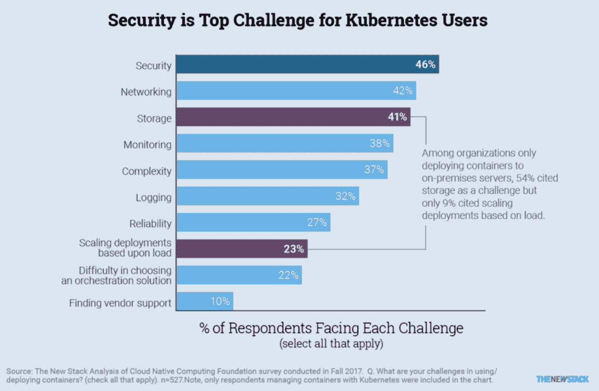

# *第一章*:Kubernetes建筑

众所周知，传统应用(如 web 应用)遵循模块化架构，将代码分为应用层、业务逻辑层、存储层和通信层。尽管采用了模块化架构，但组件是作为一个整体包装和部署的。尽管整体应用易于开发、测试和部署，但很难维护和扩展。这导致了微服务架构的增长。像 Docker 和 **Linux 容器** ( **LXC** )这样的容器运行时的开发已经简化了作为微服务的应用的部署和维护。

微服务体系结构将应用部署分成小的和互连的实体。微服务架构越来越受欢迎，导致了 Apache Swarm、Mesos 和 Kubernetes 等编排平台的增长。容器编排平台有助于在大型动态环境中管理容器。

Kubernetes 是一个开源编排平台，用于支持自动化部署、扩展和管理的容器化应用。最初由谷歌在 2014 年开发，现在由**云原生计算基金会** ( **CNCF** )维护。Kubernetes 是 2018 年毕业的第一个 CNCF 毕业的项目。已建立的全球组织，如优步、彭博、贝莱德、布拉卡尔、纽约时报、莱夫特、易贝、缓冲区、祖先、高尔夫、高盛和许多其他组织，在大规模生产中使用Kubernetes([https://kubernetes.io/case-studies/](https://kubernetes.io/case-studies/))。大型云提供商，如 **Elastic Kubernetes Service** (亚马逊) **Azure Kubernetes Service** (微软) **Google Kubernetes Engine** (谷歌)**阿里巴巴 Cloud Kubernetes** (阿里巴巴)等，提供自己管理的 Kubernetes 服务。

在微服务模型中，应用开发人员确保应用在容器化环境中正常工作。他们编写一个 Docker 文件来捆绑他们的应用。DevOps 和基础设施工程师直接与 Kubernetes 集群交互。它们确保开发人员提供的应用包在集群中平稳运行。他们监控节点、pod 和其他 Kubernetes 组件，以确保集群运行正常。然而，安全需要双方和安全团队的共同努力。要了解如何保护 Kubernetes 集群，我们首先必须了解什么是 Kubernetes 以及它是如何工作的。

在本章中，我们将涵盖以下主题:

*   Docker 的兴起和微服务的趋势
*   库比特组件
*   永恒的物体
*   永恒的变异
*   Kubernetes 和云提供商

# Docker 的崛起和微服务的趋势

在我们开始研究 Kubernetes 之前，了解微服务和容器化的增长非常重要。随着单一应用的发展，随着应用的发展，开发人员面临着不可避免的问题:

*   **缩放**:单块应用难以缩放。事实证明，解决可伸缩性问题的正确方法是通过分布式方法。
*   **运营成本**:运营成本随着单块应用的复杂性而增加。更新和维护在部署前需要仔细分析和足够的测试。这与可伸缩性相反；因为最低资源要求很高，所以您不能轻松地缩小单个应用的规模。
*   **更长的发布周期**:对于整料应用，维护和开发壁垒非常高。对于开发人员来说，当出现 bug 时，需要花费大量时间来在复杂且不断增长的代码库中找出根本原因。测试时间显著增加。在复杂的代码基础上，回归、集成和单元测试花费的时间要长得多。当客户的请求到来时，单个功能的交付需要几个月甚至一年的时间。这使得发布周期变长，并对公司业务产生重大影响。

这就产生了一种巨大的动力，要将单一应用分解成微服务。好处显而易见:

*   有了定义良好的接口，开发人员只需要关注他们拥有的服务的功能。
*   代码逻辑被简化，这使得应用更容易维护和调试。此外，与单片应用相比，微服务的发布周期大大缩短，因此客户不必为新功能等待太长时间。

当一个单一的应用分解成许多微服务时，就会增加 DevOps 端的部署和管理复杂性。复杂性显而易见；微服务通常用不同的编程语言编写，需要不同的运行时或解释器，有不同的包依赖、不同的配置等等，更不用说微服务之间的相互依赖了。这正是 Docker 出镜的好时机。

让我们看看 Docker 的演变。进程隔离长期以来一直是 Linux 的一部分，其形式为**控制组** ( **组**)和**命名空间**。通过 cgroup 设置，每个进程使用的资源(CPU、内存等)都是有限的。使用专用的进程名称空间，名称空间内的进程不知道在同一节点但在不同的进程名称空间中运行的其他进程。有了专用的网络命名空间，如果没有适当的网络配置，进程就无法与其他进程通信，即使它们运行在同一个节点上。

Docker 简化了基础设施和 DevOps 工程师的流程管理。2013 年，Docker 作为一家公司发布了 Docker 开源项目。DevOps 工程师通过 Docker 引擎管理容器，而不是管理命名空间和 cgroups。Docker 容器利用 Linux 中的这些隔离机制来运行和管理微服务。每个容器都有一个专用的 cgroup 和命名空间。

相互依赖的复杂性依然存在。编排平台就是试图解决这个问题的平台。Docker 还提供了 Docker Swarm 模式(后来改名为 Docker **企业版**，或 Docker **EE** ，以支持集群容器，大约与 Kubernetes 相同的时间。

## 不变收养状况

根据 Sysdig([https://sysdig.com/blog/sysdig-2019-container-usage-report](https://sysdig.com/blog/sysdig-2019-container-usage-report))在 2019 年进行的一份容器使用报告，一家容器安全和配器供应商表示，Kubernetes 在使用的配器中占据了高达 77%的份额。如果包括 OpenShift(红帽的 Kubernetes 变种)，市场份额接近 90%:



图 1.1–编排平台的市场份额

虽然 Docker Swarm 大约与 Kubernetes 同时发布，但是 Kubernetes 现在已经成为容器编排平台的事实选择。这是因为 Kubernetes 能够在生产环境中很好地工作。它易于使用，支持多种开发人员配置，并且可以处理大规模环境。

## 非立方簇

Kubernetes 集群是由多台机器(或**虚拟机** ( **虚拟机**)或节点组成的。有两种类型的节点:主节点和工作节点。主控制平面，如`kube-apiserver`，运行在主节点上。在每个工作节点上运行的代理称为`kubelet`，代表`kube-apiserver`作为宠臣工作，在工作节点上运行。Kubernetes 中的一个典型工作流从一个用户(例如 DevOps)开始，该用户与主节点中的`kube-apiserver`通信，`kube-apiserver`将部署作业委托给工作节点。在下一节中，我们将更详细地介绍`kube-apiserver`和`kubelet`:


图 1.2–Kubernetes 部署

前面的图显示了用户如何向主节点(`kube-apiserver`)发送部署请求，`kube-apiserver`将部署执行委托给一些工作节点中的`kubelet`。

# 非晶元件

Kubernetes 遵循客户机-服务器架构。在 Kubernetes 中，多个主节点控制多个工作节点。每个主节点和工作节点都有一组组件，这些组件是集群正常工作所必需的。主节点一般有`kube-apiserver`、`etcd`存储、`kube-controller-manager`、`cloud-controller-manager`和`kube-scheduler`。工作节点有`kubelet`、`kube-proxy`、**容器运行时接口(CRI)** 组件、**容器存储接口(CRI)** 组件等等。我们现在将详细介绍其中的每一项:

*   `kube-apiserver`:Kubernetes应用编程接口服务器(`kube-apiserver`)是一个控制平面组件，用于验证和配置对象(如Pod 、服务和控制器)的数据。它使用 REST 请求与对象交互。
*   `etcd` : `etcd`是高可用性键值存储，用于存储配置、状态和元数据等数据。`etcd`的监视功能为 Kubernetes 提供了监听配置更新并进行相应更改的能力。
*   `kube-scheduler` : `kube-scheduler`是 Kubernetes 的默认调度程序。它会监视新创建的 pods，并将 pods 分配给节点。调度程序首先过滤一组节点，Pod 可以在这些节点上运行。过滤包括基于可用资源和用户设置的策略创建可能节点的列表。一旦创建了该列表，调度器就对节点进行排序，以找到 pod 的最佳节点。
*   `kube-controller-manager`:Kubernetes 控制器管理器是核心控制器的组合，这些控制器监视状态更新并相应地对集群进行更改。目前 Kubernetes 附带的控制器包括:



*   `cloud-controller-manager`:在 v1.6 中引入了云容器管理器；它运行控制器与底层云提供商进行交互。这是将云供应商代码与 Kubernetes 代码分离的一种尝试。
*   `kubelet` : `kubelet`在每个节点上运行。它向应用编程接口服务器注册节点。`kubelet`监控使用 Podspecs 创建的豆荚，并确保豆荚和容器健康。
*   `kube-proxy` : `kube-proxy`是运行在每个节点上的网络代理。它管理每个节点上的网络规则，并根据这些规则转发或过滤流量。
*   `kube-dns` : DNS 是集群启动时启动的内置服务。随着 1.12 版本的发布，CoreDNS 成为了推荐的 DNS 服务器，取代了`kube-dns`。CoreDNS 使用一个容器(而不是用于`kube-dns`的三个容器)。它采用多线程缓存，内置负缓存，因此在内存和性能上优于`kube-dns`。

在这一节中，我们看了 Kubernetes 的核心组件。这些成分将出现在所有Kubernetes星团中。Kubernetes 还有一些可配置的接口，允许修改集群以适应组织需求。

## 不可分解的界面

Kubernetes 的目标是灵活和模块化，因此集群管理员可以修改网络、存储和容器运行时功能以适应组织的需求。目前，Kubernetes 提供了三种不同的接口，集群管理员可以使用它们来使用集群中的不同功能。

### 容器网络接口

Kubernetes 有一个默认的网络提供商`kubenet`，能力有限。`kubenet`每个集群只支持 50 个节点，显然不能满足大规模部署的任何要求。同时，Kubernetes 利用**容器网络接口** ( **CNI** )作为网络提供商和 Kubernetes 网络组件之间的公共接口，以支持大规模集群中的网络通信。目前支持的提供商包括印花布、法兰绒、`kube-router`等。

### 容器存储界面

Kubernetes 在 v1.13 中引入了容器存储接口，在 1.13 之前，新的卷插件是 Kubernetes 核心代码的部分。容器存储接口提供了向 Kubernetes 公开任意块和文件存储的接口。云提供商可以通过使用 CSI 插件向 Kubernetes 公开高级文件系统。MapR 和 Snapshot 等插件在集群管理员中很受欢迎。

### 容器运行时接口

在Kubernetes的最低级别，容器运行时确保容器启动、工作和停止。最流行的容器运行时是 Docker。容器运行时界面使集群管理员能够使用其他容器运行时，如`frakti`、`rktlet`和`cri-o`。

# 非立方体物体

系统的存储和计算资源被分类到不同的对象中，这些对象反映了集群的当前状态。对象是使用`.yaml`规范定义的，Kubernetes应用编程接口用于创建和管理对象。我们将详细介绍一些常见的 Kubernetes 对象。

## 豆荚

荚果是Kubernetes星团的基本组成部分。它是由一个或多个容器组成的组，这些容器预计将共存于单个主机上。一个容器内的容器可以使用本地主机或**进程间通信** ( **IPCs** )相互引用。

## 部署

Kubernetes 部署有助于根据标签和选择器向上或向下扩展Pod 。部署的 YAML 规范由`replicas`和`template`组成，前者是所需的Pod 实例数，后者与Pod 规范相同。

## 服务

Kubernetes 服务是应用的抽象。一项服务支持Pod 的网络接入。服务和部署协同工作，以简化应用不同单元之间的管理和通信。

## 副本集

副本集确保在任何给定时间系统中运行给定数量的 pod。最好在副本集上使用部署。部署封装了副本集和荚。此外，部署还提供了执行滚动更新的能力。

## 卷

容器储存是短暂的。如果容器崩溃或重新启动，它将从启动时的原始状态开始。Kubernetes 卷有助于解决这个问题。一个容器可以使用卷来存储一个状态。Kubernetes体积有一个荚的寿命；一旦豆荚腐烂，体积也会被清理。一些支持的卷包括`awsElasticBlockStore`、`azureDisk`、`flocker`、`nfs`和`gitRepo`。

## 命名空间

名称空间有助于将一个物理集群划分为多个虚拟集群。多个对象可以被隔离在不同的名称空间中。默认 Kubernetes 附带三个名称空间:`default`、`kube-system`和`kube-public`。

## 服务账户

需要与`kube-apiserver`交互的 Pods 使用服务帐户来标识自己。默认情况下，Kubernetes 为提供了一个默认服务帐户列表:`kube-proxy`、`kube-dns`、`node-controller`等等。可以创建额外的服务帐户来实施自定义访问控制。

## 网络策略

网络策略定义了一组规则，这些规则规定了如何允许一组Pod 与其他网络端点相互通信。任何传入和传出的网络连接都受网络策略的控制。默认情况下，一个Pod 能够与所有Pod 通信。

## Pod 安全策略

pod 安全策略是一个集群级别的资源，它定义了 pod 在系统上运行必须满足的一组条件。Pod 安全策略定义了 pod 的安全敏感配置。这些策略必须可供请求用户或目标 pod 的服务帐户访问才能工作。

# 不变变变

在 Kubernetes 生态系统中，Kubernetes 是所有变体中的旗舰。然而，还有一些其他的船只扮演着非常重要的角色。接下来，我们将介绍一些类似 Kubernetes 的平台，它们在生态系统中服务于不同的目的。

## 迷你裙

Minikube 是 Kubernetes 的单节点集群版本，可以在 Linux、macOS 和 Windows 平台上运行。Minikube 支持标准的 Kubernetes 特性，如`LoadBalancer`、服务、`PersistentVolume`、`Ingress`、容器运行时，以及开发者友好的特性，如插件和 GPU 支持。

Minikube 是获得 Kubernetes 实际操作体验的绝佳起点。这也是一个在本地运行测试的好地方，尤其是集群依赖或者概念验证。

## K3s

K3s 是一个轻量级 Kubernetes 平台。其总大小小于40MB。它是伟大的边缘、**物联网** ( **物联网**)和 **ARM** ，以前的**高级 RISC 机**，原来的 **Acorn RISC 机**，一个为计算机处理器配置的**精简指令集计算** ( **RISC** )架构家族。它应该完全符合Kubernetes。与 Kubernetes 的一个显著区别是它使用`sqlite`作为默认存储机制，而 Kubernetes 使用`etcd`作为其默认存储服务器。

## 开瓶器

OpenShift 版本 3 采用 Docker 作为其容器技术，采用 Kubernetes 作为其容器编排技术。在版本 4 中，OpenShift 切换到 CRI-O 作为默认的容器运行时。似乎 OpenShift 应该与 Kubernetes 相同；然而，也有不少不同之处。

### open hift vs kublantes

Linux 和红帽 Linux 之间的连接可能首先看起来和 OpenShift 和 Kubernetes 之间的连接一样。现在，让我们看看他们的一些主要区别。

#### 命名

Kubernetes 中名为的对象在 OpenShift 中可能有不同的名称，尽管有时它们的功能是相似的。例如，Kubernetes 中的一个命名空间在 OpenShift 中被称为一个项目，项目创建附带默认对象。Kubernetes 中的入口称为 OpenShift 中的路由。路由的引入实际上早于入口对象。下面，OpenShift 中的路由由 HAProxy 实现，而 Kubernetes 中有很多入口控制器选项。在Kubernetes的部署称为`deploymentConfig`。然而，下面的实现是完全不同的。

#### 安全

默认情况下，Kubernetes 是开放的，安全性较低。OpenShift 相对封闭，提供了一些很好的安全机制来保护集群。例如，在创建 OpenShift 集群时，DevOps 可以启用内部映像注册表，它不会暴露给外部映像注册表。同时，内部映像注册表充当受信任的注册表，映像将在其中被提取和部署。还有一点是 OpenShift 项目比`kubernetes`命名空间做得更好的——在 OpenShift 中创建项目时，可以修改项目模板，并在项目中添加额外的对象，如`NetworkPolicy`和默认配额，这些对象符合贵公司的政策。默认情况下，它也有助于硬化。

#### 费用

OpenShift 是红帽提供的产品，虽然有一个社区版本项目叫 OpenShift Origin。当人们谈论 OpenShift 时，他们通常指的是在红帽支持下的 OpenShift 产品的付费选项。Kubernetes 是一个完全免费的开源项目。

# Kubernetes 和云提供商

很多人相信 Kubernetes 是基础设施的未来，也有一些人相信一切都会以云告终。然而，这并不意味着您必须在云上运行 Kubernetes，但是它确实在云上运行得很好。

## 库柏作为服务

容器化使应用更加便携，因此锁定特定的云提供商变得不太可能。虽然有一些很棒的开源工具，比如`kubeadm`和`kops`，可以帮助 DevOps 创建 Kubernetes 集群，但是 Kubernetes 作为云提供商提供的服务听起来还是很有吸引力的。作为 Kubernetes 的最初创造者，谷歌从 2014 年开始向 Kubernetes 提供“T4”服务。叫做**谷歌 Kubernetes 引擎** ( **GKE** )。2017 年，微软提供了自己的 Kubernetes 服务，名为**Azure Kubernetes Service**(**AKS**)。AWS 在 2018 年提供**弹性库伯内斯服务** ( **EKS** )。

kube dex([https://kube dex . com/Google-gke-vs-Microsoft-aks-vs-Amazon-eks/](https://kubedex.com/google-gke-vs-microsoft-aks-vs-amazon-eks/))对云 Kubernetes 服务进行了一次很棒的对比。下表列出了三者之间的一些差异:





从前面的列表中值得强调的一些亮点如下:

*   **可扩展性** : GKE 每个集群最多支持 5000 个节点，而 AKS 和 EKS 只支持几百个节点甚至更少。
*   **高级安全选项** : GKE 支持 Istio 服务网格、沙盒、二进制授权和入口管理**安全套接字层** ( **SSL** )，而 AKS 和 EKS 则不能。

如果计划在云提供商提供的 Kubernetes 集群中部署和管理微服务，则需要考虑云提供商提供的可扩展性能力和安全选项。如果使用由云提供商管理的集群，会有某些限制:

*   默认情况下，一些集群配置和加固由云提供商完成，可能不会更改。
*   您将失去管理 Kubernetes 集群的灵活性。例如，如果您想要启用 Kubernetes 的审核策略并将审核日志导出到`splunk`，您可能想要对`kube-apiserver`清单进行一些配置更改。
*   对运行`kube-apiserver`的主节点的访问是有限的。如果您专注于部署和管理微服务，这种限制完全有意义。在某些情况下，您需要启用一些准入控制器，然后您还必须对`kube-apiserver`清单进行更改。这些操作需要访问主节点。

如果您想要一个可以访问集群节点的 Kubernetes 集群，一个开源工具—`kops`—可以帮助您。

## 科普斯

**Kubernetes Operations**(**kops**)从命令行帮助创建、销毁、升级和维护生产级高可用性 Kubernetes 集群。官方支持 AWS，测试版支持 GCE 和 OpenStack。与在云 Kubernetes 服务上配置 Kubernetes 集群的主要区别在于，配置从虚拟机层开始。这意味着通过`kops`您可以控制您想要使用的操作系统映像，并设置您自己的管理 SSH 密钥来访问主节点和工作节点。在 AWS 中创建 Kubernetes 集群的示例如下:

```
  # Create a cluster in AWS that has HA masters. This cluster
  # will be setup with an internal networking in a private VPC.
  # A bastion instance will be setup to provide instance access.
  export NODE_SIZE=${NODE_SIZE:-m4.large}
  export MASTER_SIZE=${MASTER_SIZE:-m4.large}
  export ZONES=${ZONES:-'us-east-1d,us-east-1b,us-east-1c'}
  export KOPS_STATE_STORE='s3://my-state-store'
  kops create cluster k8s-clusters.example.com \
  --node-count 3 \
  --zones $ZONES \
  --node-size $NODE_SIZE \
  --master-size $MASTER_SIZE \
  --master-zones $ZONES \
  --networking weave \
  --topology private \
  --bastion='true' \
  --yes
```

在`kops`命令之前的中，创建了一个三个工作节点的 Kubernetes 集群。用户可以选择主节点和 CNI 插件的大小。

## 为什么要担心Kubernetes的安全？

Kubernetes 在 2018 年普遍可用，并且仍在快速发展。还有一些功能还在开发中，不在 GA 状态(不是 alpha 就是 beta)。这表明 Kubernetes 本身还远未成熟，至少从安全角度来看。但这不是我们需要关注 Kubernetes 安全性的主要原因。

Bruce Schneier 在 1999 年对这一点的总结是最好的，当时他在一篇名为《T2》的文章中说“*复杂性是安全的最大敌人*”，正确地预测了我们今天遇到的网络安全问题([https://www . Schneier . com/esses/archives/1999/11/A _ 辩白 _for_simplicit.html](https://www.schneier.com/essays/archives/1999/11/a_plea_for_simplicit.html) )。为了满足稳定性、可伸缩性、灵活性和安全性的所有主要编排需求，Kubernetes 以一种复杂但有凝聚力的方式进行了设计。这种复杂性无疑带来了一些安全问题。

可配置性是 Kubernetes 平台给开发人员带来的最大好处之一。开发人员和云提供商可以自由配置他们的集群以满足他们的需求。Kubernetes 的这一特性是企业日益关注安全性的主要原因之一。不断增长的 Kubernetes 代码和 Kubernetes 集群的组件使得 DevOps 理解正确的配置变得很有挑战性。默认配置通常不安全(开放性确实给 DevOps 带来了尝试新功能的优势)。

随着 Kubernetes 使用量的增加，各种安全漏洞和缺陷已经见诸报端:

*   帕洛阿尔托网络公司的研究人员发现了 4 万个暴露在互联网上的 Docker 和 Kubernetes 容器。这是错误配置部署的结果。
*   攻击者利用特斯拉不安全的管理控制台运行一个加密采矿设备。
*   在 Kubernetes 版本中发现了权限提升漏洞，该漏洞允许巧尽心思构建的请求通过 API 服务器建立到后端的连接并发送任意请求。
*   在生产环境中使用 Kubernetes 元数据测试版功能导致了对流行的电子商务平台 Shopify 的服务器端请求伪造攻击。该漏洞暴露了 Kubernetes 元数据，该元数据揭示了谷歌服务帐户令牌和`kube-env`细节，这使得攻击者能够危害集群。

新栈(https://nenewstack . io/top-challenges-kubernetes-user-face-deployment/)最近进行的一项调查显示，安全是运行 Kubernetes 的企业最关心的问题:



图 1.3–Kubernetes 用户最关心的问题

默认情况下，Kubernetes 不安全。我们将在后面的章节中对此进行更多解释。安全性成为用户最关心的问题之一完全有道理。这是一个需要正确解决的问题，就像其他基础设施或平台一样。

# 总结

微服务的趋势和 Docker 的崛起使 Kubernetes 成为 DevOps 部署、扩展和管理容器化应用的事实平台。Kubernetes 将存储和计算资源抽象为 Kubernetes 对象，由`kube-apiserver`、`kubelet`、`etcd`等组件管理。

Kubernetes 可以在私有数据中心创建，也可以在云或混合平台上创建。这使得 DevOps 可以与多个云提供商合作，而不会被其中任何一家所限制。虽然截至 2018 年，Kubernetes 还在 GA，但它仍然很年轻，发展非常快。随着 Kubernetes 受到越来越多的关注，针对 Kubernetes 的攻击也变得更加引人注目。

在下一章中，我们将介绍 Kubernetes 网络模型，并了解微服务如何在 Kubernete s 中相互通信。

# 问题

1.  单体建筑的主要问题是什么？
2.  Kubernetes 的主组件是什么？
3.  什么是部署？
4.  Kubernetes 有哪些变体？
5.  我们为什么关心Kubernetes的安全？

# 进一步阅读

以下链接包含关于 Kubernetes、`kops`和 OpenShift 平台的更多详细信息。开始构建 Kubernetes 集群时，您会发现它们非常有用:

*   [https://kubernetes.io/docs/concepts/](https://kubernetes.io/docs/concepts/)
*   [https://kubernetes.io/docs/tutorials/](https://kubernetes.io/docs/tutorials/)
*   [https://github . com/kubrines/kops](https://github.com/kubernetes/kops)
*   [https://docs.openshift.com/container-platform/4.2](https://docs.openshift.com/container-platform/4.2)
*   [https://cloud . Google . com/kubernetes-engine/docs/concepts/kubernetes-engine-概述](https://cloud.google.com/kubernetes-engine/docs/concepts/kubernetes-engine-overview)