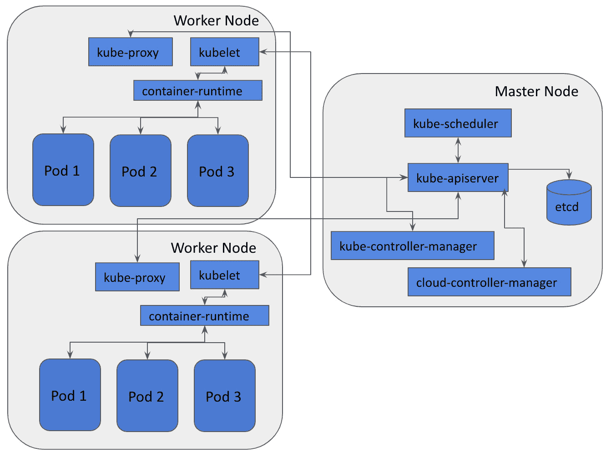
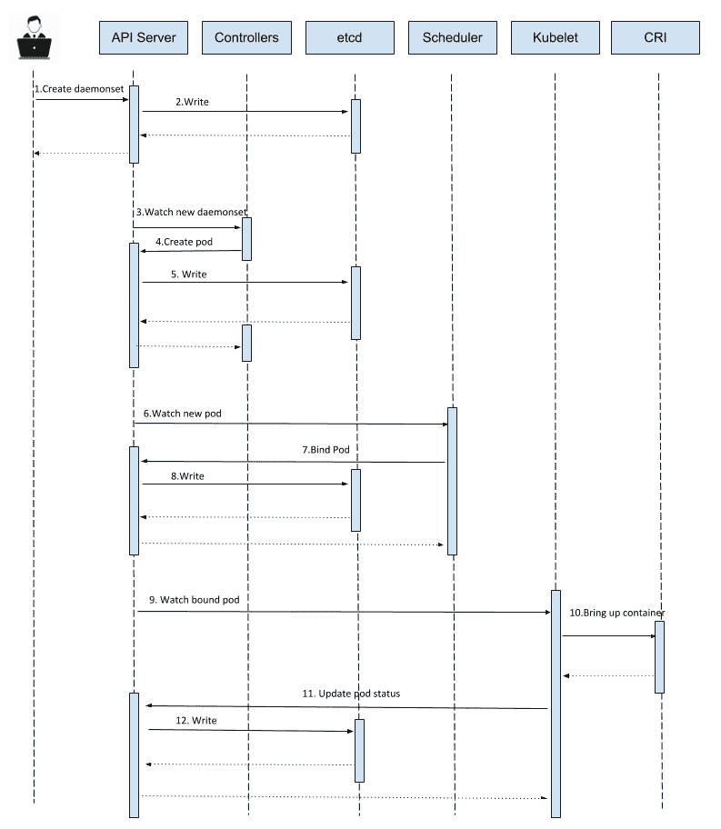
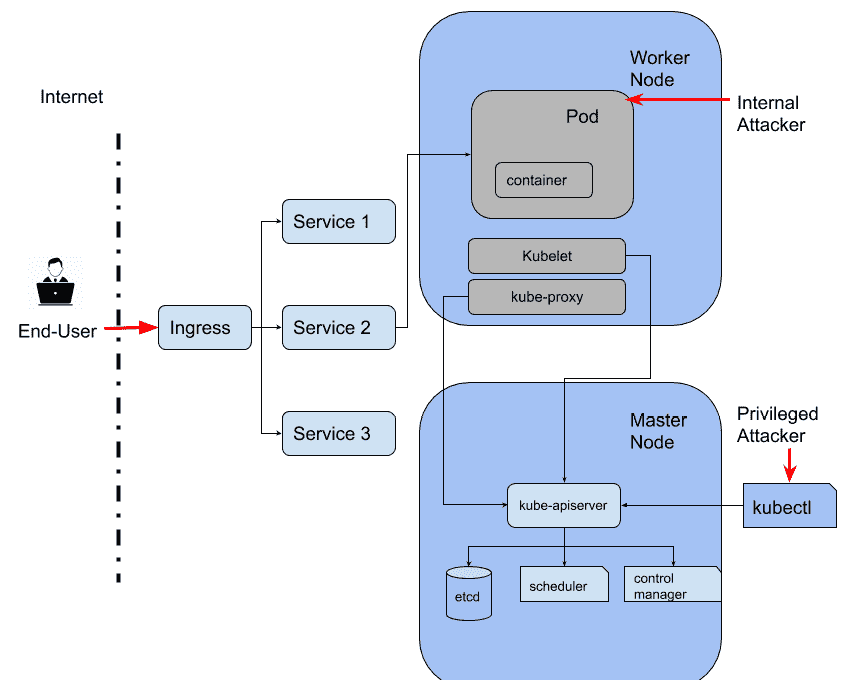
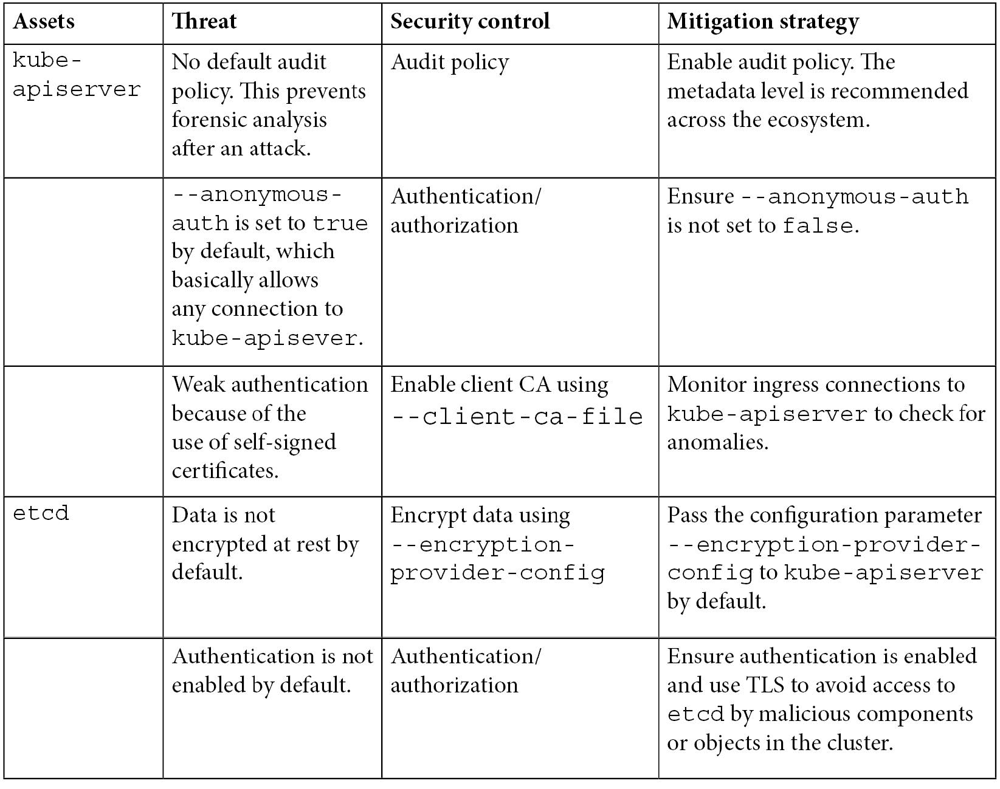
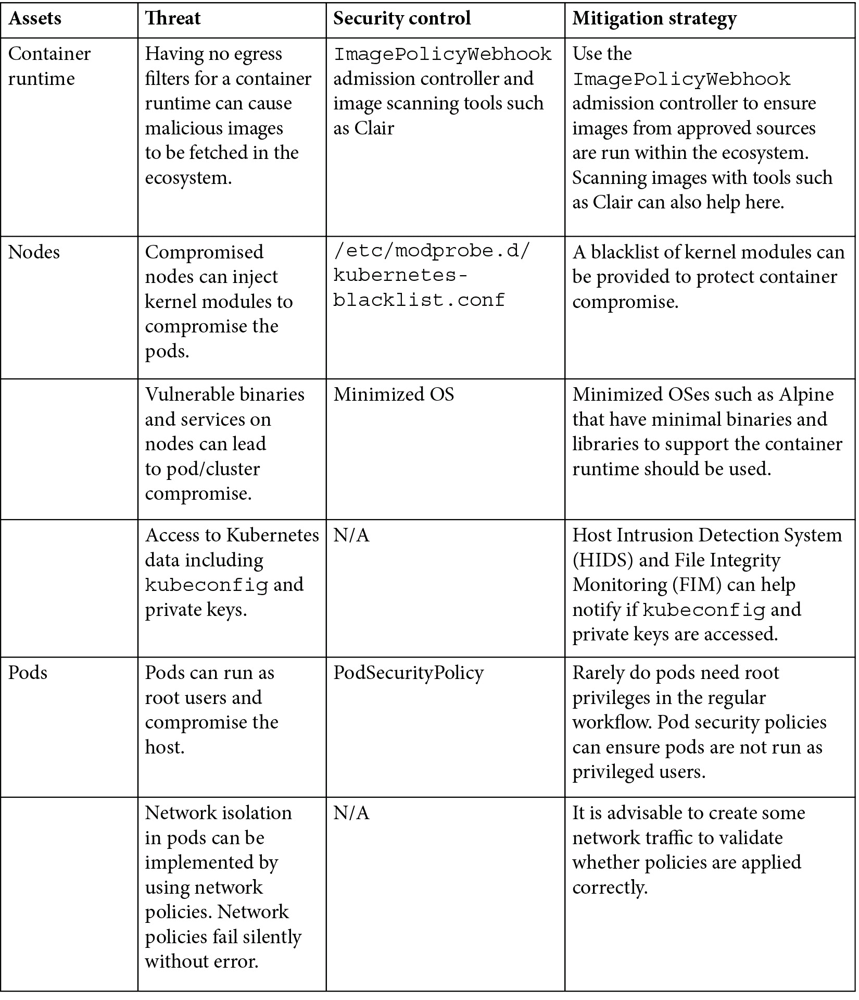
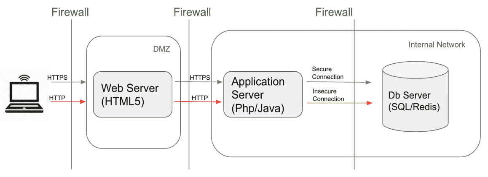
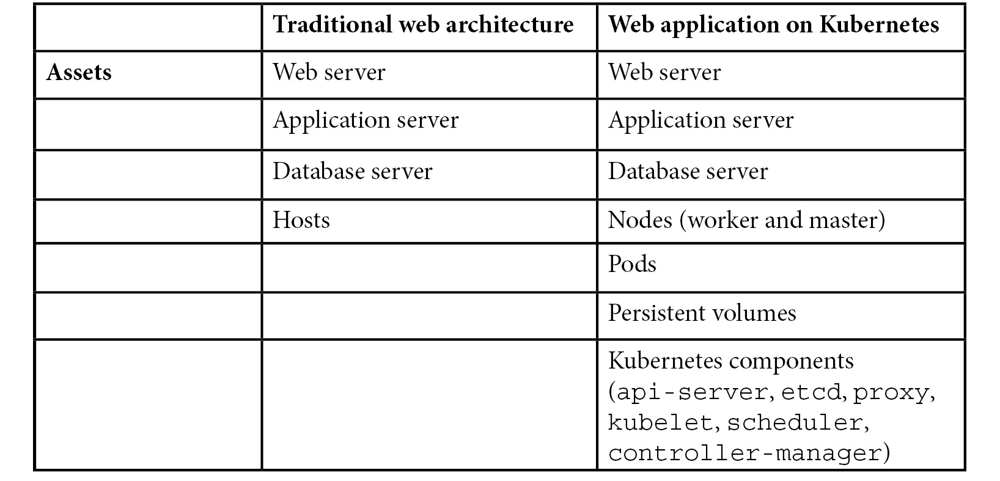

# 三、威胁建模

Kubernetes 是一个大型生态系统，包含多个组件，如`kube-apiserver`、`etcd`、`kube-scheduler`、`kubelet`等。在第一章中，我们强调了不同 Kubernetes 组件的基本功能。在默认配置中，Kubernetes 组件之间的交互会导致开发人员和集群管理员应该意识到的威胁。此外，在 Kubernetes 中部署应用引入了新的应用交互实体，为应用的威胁模型添加了新的威胁参与者和攻击面。

在本章中，我们将首先简要介绍威胁建模，并讨论 Kubernetes 生态系统中的组件交互。我们将查看默认 Kubernetes 配置中的威胁。最后，我们将讨论在 Kubernetes 生态系统中对应用进行威胁建模如何引入额外的威胁参与者和攻击面。

本章的目的是帮助您理解默认的 Kubernetes 配置不足以保护您部署的应用免受攻击者的攻击。Kubernetes 是一个不断发展和社区维护的平台，所以我们在本章中要强调的一些威胁没有缓解措施，因为威胁的严重性因环境而异。

本章旨在强调 Kubernetes 生态系统中的威胁，该生态系统包括 Kubernetes 集群中的 Kubernetes 组件和工作负载，因此开发人员和 DevOps 工程师了解其部署的风险，并针对已知威胁制定风险缓解计划。在本章中，我们将涵盖以下主题:

*   威胁建模简介
*   组件交互
*   Kubernetes 环境中的威胁行为者
*   Kubernetes 组件/对象威胁模型
*   威胁建模在 Kubernetes 中的应用

# 威胁建模介绍

威胁建模是在**软件开发生命周期** ( **SDLC** )的设计阶段对系统进行整体分析的过程，以主动识别对系统的风险。威胁建模用于在开发周期的早期考虑安全需求，以从一开始就降低风险的严重性。威胁建模包括识别威胁，了解每个威胁的影响，最后为每个威胁制定缓解策略。威胁建模旨在将生态系统中的风险突出显示为一个简单的矩阵，其中包含风险的可能性和影响，以及相应的风险缓解策略(如果存在)。

成功完成威胁建模后，您可以定义以下内容:

1.  **资产**:你需要保护的生态系统的财产。
2.  **安全控制**:保护资产免受已识别风险的系统属性。这些要么是防范措施，要么是针对资产风险的对策。
3.  **威胁角色**:威胁角色是一个实体或组织，包括脚本小子、民族国家攻击者和利用风险的黑客主义者。
4.  **攻击面**:威胁行动者正在与之交互的系统部分。它包括威胁参与者进入系统的入口点。
5.  **威胁**:对资产的风险。
6.  **缓解**:缓解定义了如何降低威胁资产的可能性和影响。

行业通常遵循以下威胁建模方法之一:

*   **STRIDE**:STRIDE 模型是微软在 1999 年发布的。它是欺骗、篡改、否认、信息泄露、拒绝服务和权限升级的缩写。STRIDE 对系统的威胁进行建模，以回答“系统会出现什么问题？”
*   **PASTA** :攻击模拟和威胁分析流程是一种以风险为中心的威胁建模方法。PASTA 遵循以攻击者为中心的方法，业务和技术团队使用该方法来开发以资产为中心的缓解策略。
*   **VAST** :可视化、敏捷和简单威胁建模旨在将跨应用和基础设施开发的威胁建模与 SDLC 和敏捷软件开发相集成。它提供了一个可视化方案，为所有利益相关者(如开发人员、架构师、安全研究人员和业务主管)提供可操作的输出。

威胁建模还有其他方法，但前面三种方法是业内最常用的。

如果威胁模型的范围没有很好地定义，威胁建模可能是一项无限长的任务。在开始识别生态系统中的威胁之前，清楚地了解每个组件的架构和工作方式以及组件之间的交互非常重要。

在前面的章节中，我们已经详细研究了每个 Kubernetes 组件的基本功能。现在，我们将在调查库本内生态系统中的威胁之前，先看看库本内不同组件之间的相互作用。

# 成分相互作用

Kubernetes 组件协同工作，以确保集群内运行的微服务按预期运行。如果您将微服务部署为 DaemonSet，那么 Kubernetes 组件将确保每个节点中都有一个 pod 运行微服务，不多也不少。那么幕后发生了什么？让我们看一个图表，从高层次展示组件的交互:

图 3.1–库本内 tes 组件之间的相互作用

快速回顾一下这些组件的作用:

*   **kube-API server**:Kubernetes API 服务器(`kube-apiserver`)是一个控制平面组件，用于验证和配置对象的数据。
*   **etcd** : `etcd`是一个高可用性键值存储，用于存储配置、状态和元数据等数据。
*   **kube-scheduler** : `kube-scheduler`是 Kubernetes 的默认调度程序。它监视新创建的荚，并将荚分配给节点。
*   **kube-控制器-管理器**:Kubernetes 控制器管理器是核心控制器的组合，这些核心控制器监视状态更新并相应地对集群进行更改。
*   **云-控制器-管理器**:云控制器管理器运行控制器与底层云提供商进行交互。
*   **kubelet** : `kubelet`向 API 服务器注册节点，并监控使用 Podspecs 创建的荚，以确保荚和容器是健康的。

值得注意的是，只有`kube-apiserver`与`etcd`进行通信。其他 Kubernetes 组件如`kube-scheduler`、`kube-controller-manager`、`cloud-controller manager`与主节点中运行的`kube-apiserver`交互，以履行其职责。在工作节点上，`kubelet`和`kube-proxy`都与`kube-apiserver`通信。

让我们以一个 DaemonSet 创建为例，展示这些组件如何相互对话:

图 3.2–在 Kubernetes 中创建一个 DaemonSet

要创建 daemmonset，我们使用以下步骤:

1.  用户向`kube-apiserver`发送请求，通过 HTTPS 创建一个 DaemonSet 工作负载。
2.  经过身份验证、授权和对象验证后，`kube-apiserver`在`etcd`数据库中为 DaemonSet 创建工作负载对象信息。在`etcd`默认情况下，传输中的数据和静态数据都不加密。
3.  daemmonset 控制器监视新 daemmonset 对象的创建，然后向`kube-apiserver`发送 pod 创建请求。请注意，DaemonSet 基本上意味着微服务将在每个节点的 pod 中运行。
4.  `kube-apiserver`重复*步骤 2* 中的操作，并在`etcd`数据库中创建工作负荷对象信息。
5.  `kube-scheduler`观察新 pod 的创建，然后根据节点选择标准决定在哪个节点上运行 pod。之后，`kube-scheduler`向`kube-apiserver`发送请求，请求 pod 将在哪个节点上运行。
6.  `kube-apiserver`接收`kube-scheduler`的请求，然后用 Pod 的节点分配信息更新`etcd`。
7.  工作节点上运行的`kubelet`监视分配给该节点的新 pod，然后向**容器运行时接口** ( **CRI** )组件(如 Docker)发送请求，以启动容器。之后，`kubelet`会将 Pod 的状态发送回`kube-apiserver`。
8.  `kube-apiserver`从目标节点上的`kubelet`接收 Pod 的状态信息，然后用 Pod 状态更新`etcd`数据库。
9.  一旦 Pod (来自 DaemonSet)被创建，Pod 就能够与其他 Kubernetes 组件通信，并且微服务应该启动并运行。

注意*而不是*默认情况下，组件之间的所有通信都是安全的。这取决于这些组件的配置。我们将在 [*第 6 章*](06.html#_idTextAnchor170)*固定离合器主部件*中对此进行更详细的介绍。

# Kubernetes 环境中的威胁行为者

威胁参与者是在系统中执行的实体或代码，资产应该受到保护。从的防御立场来看，你首先需要了解你的潜在敌人是谁，否则你的防御策略会过于模糊。Kubernetes 环境中的威胁因素可大致分为三类:

1.  **终端用户**:可以连接到应用的实体。这个参与者的入口点通常是负载平衡器或入口。有时，Pod 、容器或节点端口可能直接暴露在互联网上，为最终用户增加了更多的入口点。
2.  **内部攻击者**:在 Kubernetes 集群内部具有有限访问权限的实体。集群中的恶意容器或产生的 PODS 就是内部攻击者的例子。
3.  **权限攻击者**:在 Kubernetes 集群中拥有管理员访问权限的实体。基础设施管理员、受损`kube-apiserver`实例和恶意节点都是权限攻击者的例子。

威胁角色的例子包括脚本小子、黑客主义者和民族国家角色。所有这些行为者都属于上述三类，这取决于行为者在系统中的位置。

下图强调了 Kubernetes 生态系统中的不同参与者:

图 3.3–Kubernetes 环境中的威胁因素

如图所示，最终用户通常与入口控制器、负载平衡器或 pod 公开的 HTTP/HTTPS 路由进行交互。最终用户是最没有权限的。另一方面，内部攻击者对集群内资源的访问权限有限。权限攻击者拥有最高权限，能够修改集群。这三类攻击者有助于确定威胁的严重程度。与涉及权限攻击者的威胁相比，涉及最终用户的威胁具有更高的严重性。虽然这些角色在图中看起来是孤立的，但是攻击者可以使用 eleva 权限攻击从最终用户变成内部攻击者。

# Kubernetes 星团中的威胁

随着我们对 Kubernetes 组件和威胁参与者的新理解，我们将继续进行 Kubernetes 集群的威胁建模之旅。在下表中，我们涵盖了主要的 Kubernetes 组件、节点和 PODS。节点和荚是运行工作负载的基本 Kubernetes 对象。请注意，所有这些组件都是资产，应该受到保护以免受到威胁。这些组件中的任何一个受到损害都可能导致下一步的攻击，例如权限升级。另外，注意`kube-apiserver`和`etcd`是 Kubernetes 星团的大脑和心脏。如果他们中的任何一个妥协了，游戏就结束了。

下表突出显示了默认 Kubernetes 配置中的威胁。此表还强调了开发人员和集群管理员如何保护其资产免受这些威胁:

这张表只强调了一些威胁。还有更多的威胁，将在后面的章节中介绍。我们希望前面的表格能启发您大声思考什么需要保护，以及如何在您的 Kubernetes cluste r 中保护它。

# Kubernet es 中的威胁建模应用

现在我们已经了解了 Kubernetes 集群中的威胁，接下来让我们讨论部署在 Kubernetes 上的应用的威胁建模会有什么不同。在 Kubernetes 的部署增加了威胁模型的复杂性。Kubernetes 增加了额外的考虑因素、资产、威胁参与者和新的安全控制，在调查对已部署应用的威胁之前需要考虑这些因素。

让我们看一个三层网络应用的简单例子:

图 3.4–传统网络应用的威胁模型

在 Kubernetes 环境中，相同的应用看起来有些不同:

图 3.5–Kubernetes 中三层网络应用的威胁模型

如上图所示，web 服务器、应用服务器和数据库都在 pods 内部运行。让我们对传统网络架构和云原生架构之间的威胁建模进行一个高级比较:

总结前面的对比，你会发现云原生架构中需要保护的资产更多，在这个空间中你会面临更多的威胁行为者。Kubernetes 提供了更多的安全控制，但它也增加了更多的复杂性。更多的安全控制不一定意味着更多的安全。记住:复杂性是安全的敌人。

# 总结

在本章中，我们首先介绍了威胁建模的基本概念。我们讨论了 Kubernetes 环境中的重要资产、威胁和威胁参与者。我们讨论了不同的安全控制和缓解策略，以改善 Kubernetes 集群的安全状况。

然后，考虑到在 Kubernetes 中部署的应用，我们完成了应用威胁建模，并将其与传统的单一应用威胁建模进行了比较。Kubernetes 设计引入的复杂性使得威胁建模更加复杂，正如我们已经展示的:需要保护的资产更多，威胁参与者更多。更多的安全控制不一定意味着更多的安全。

您应该记住，尽管威胁建模可能是一个漫长而复杂的过程，但了解您的环境的安全状况是值得做的。为了更好地保护 Kubernetes 集群，同时进行应用威胁建模和基础设施威胁建模是非常必要的。

在下一章中，为了帮助您了解如何将 Kubernetes 集群保护到下一个级别，我们将讨论最小权限原则以及如何在 Kubernetes 集群中实现它。

# 问题

1.  您何时开始对应用进行威胁建模？
2.  Kubernetes 环境中有哪些不同的威胁行为者？
3.  说出对默认 Kubernetes 部署的最严重威胁之一。
4.  为什么在 Kubernetes 环境中威胁建模更加困难？
5.  与传统架构中的部署相比，Kubernetes 中部署的攻击面如何？

# 进一步阅读

Bits trail 和 Atredis Partners 在 Kubernetes 组件的威胁建模方面做得很好。他们的白皮书详细强调了每个 Kubernetes 组件中的威胁。您可以在[https://github . com/Kubernetes/community/blob/master/WG-security-audit/discovery/Kubernetes % 20 thrat % 20 model . pdf](https://github.com/kubernetes/community/blob/master/wg-security-audit/findings/Kubernetes%20Threat%20Model.pdf)上找到白皮书。

请注意，威胁建模的目的、范围和方法与前面的白皮书不同。所以，结果看起来会有些不同。