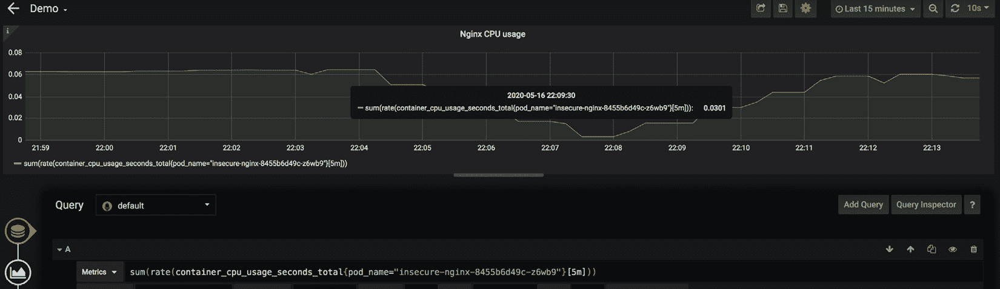

# *第 12 章*:分析和检测密码挖掘攻击

随着区块链和加密货币越来越受欢迎，加密挖掘攻击变得越来越引人注目。加密货币是区块链上分散交易的交易费，用于利用计算资源。使用计算资源获取用于验证交易的加密货币的过程称为加密挖掘，并由称为加密挖掘器的软件执行。安全研究人员发现了与受害者基础设施中运行的各种加密矿工二进制文件相关的黑客事件。Kubernetes 集群的默认开放性和挖掘所需的广泛计算能力使 Kubernetes 集群成为加密挖掘攻击的完美目标。Kubernetes 集群的复杂性也使得加密挖掘活动难以检测。

由于我们已经介绍了不同的 Kubernetes 内置安全机制和开源工具来保护 Kubernetes 集群，现在我们将看看如何在具体场景中使用它们。在本章中，我们将首先分析几个已知的加密挖掘攻击，然后讨论使用开源工具检测加密挖掘攻击的机制。最后但同样重要的是，我们将回顾我们在前面几章中讨论的主题，并看看它们应该如何应用于保护我们的环境免受一般攻击。

本章将涵盖以下主题:

*   分析加密挖掘攻击
*   检测挖掘攻击
*   防御攻击

# 分析加密挖掘攻击

在这一节中，我们将首先简要介绍密码挖掘攻击，然后分析一些公开披露的密码挖掘攻击。我们希望您了解加密挖掘攻击模式以及使攻击成为可能的缺陷。

## 加密挖掘攻击简介

区块链构成了密码货币的基础。简而言之，区块链是以区块为代表的数字资产链。这些块具有关于交易以及谁作为数字签名参与交易的信息。每种加密货币都与一个区块链相关联。验证事务记录的过程称为挖掘。采矿为区块链增添了历史，以确保区块在未来不会被修改。采矿是资源密集型的，以确保区块链的分散财产。通过成功开采区块，矿工赚取与交易相关的交易费。所以，如果你有一台笔记本电脑或个人电脑，你也可以用它来开采加密货币；但最有可能的是，你需要一些专用的 GPU 或者专用硬件，比如**现场可编程门阵列** ( **FPGA** )和**专用集成电路** ( **ASIC** )才能做好挖矿工作。Kubernetes 集群中资源的可用性使它们成为攻击者赚取加密货币的理想目标。

密码挖掘攻击就像免费乘坐无线网络一样。就像你的网络带宽将由搭便车者共享一样，你的一些(或大部分)中央处理器或计算资源将在未经你同意的情况下被挖掘过程占用。影响也差不多。如果免费无线骑手正在使用您的无线网络通过 BitTorrent 下载电影，您在观看网飞时可能会体验不佳。当一个挖掘进程正在运行时，同一节点上运行的其他应用程序将受到严重影响，因为挖掘进程可能会占用大部分时间的 CPU。

密码挖掘攻击已经成为黑客最有吸引力的攻击之一，因为它几乎可以保证从成功的入侵中获得一些好处。小偷来只是为了偷窃或破坏。如果干扰不是入侵的目标，那么密码挖掘攻击可能是黑客的主要选择之一。

据报道，黑客至少有两种方式对目标受害者发起密码挖掘攻击。一种是通过应用程序漏洞，如跨站点脚本、SQL 注入、远程代码执行等，让黑客获得对系统的访问权限，然后下载并执行 miner 二进制文件。另一种方法是通过恶意的容器图像。当从包含挖掘二进制文件的图像创建容器时，挖掘过程开始。

虽然互联网上有不同类型的加密挖掘二进制文件，但总的来说，挖掘过程计算量大，占用大量的 CPU 周期。采矿过程有时会加入采矿池，以便以协作方式进行采矿。

接下来，让我们看看现实世界中发生的几起加密挖掘攻击。我们将讨论使攻击成为可能的缺陷，并查看攻击模式 rns。

## 对特斯拉库本内特集群的密码挖掘攻击

2018 年，针对特斯拉 Kubernetes 集群的一次加密挖掘攻击发生了，并被 RedLock 报道。虽然攻击发生在很久以前，但我们至少可以从中学到两点——使攻击成为可能的缺陷和攻击模式 rns。

### 缺陷

黑客潜入了没有密码保护的 Kubernetes 仪表板。从仪表盘上，黑客获得了一些重要的秘密来访问亚马逊 S3 buc kets。

### 攻击模式

黑客很好地隐藏了他们的足迹，这样他们就可以避免被发现。以下是一些值得一提的模式:

*   挖掘过程没有占用太多的 CPU 周期，所以 pod 的 CPU 使用率不会太高。
*   与大多数加密挖掘情况不同，挖掘过程没有加入任何众所周知的挖掘池。取而代之的是，它有自己的挖掘服务器，位于云火炬后面，云火炬是一个内容交付网络 T2 服务。
*   挖掘进程和挖掘服务器之间的通信已加密。

在前面的策略中，黑客故意试图隐藏密码挖掘模式，这样他们就可以避开检测。

## Graboid——一种密码蠕虫攻击

这种密码蠕虫攻击是由帕洛阿尔托网络 Unit42 研究团队在 2019 年末发现的。虽然攻击不是针对 Kubernetes 集群的，但这是针对 Docker 守护程序的，它是 Kubernetes 集群的基础支柱之一。在其中一个攻击步骤中，该工具包从 Docker Hub 下载了包含加密挖掘二进制文件的映像并启动。该步骤也可以应用于 Kubernetes 集群 ers。

### 缺陷

Docker 引擎在未经认证和授权的情况下进行配置时暴露在互联网上。攻击者很容易完全控制 dockr 引擎。

### 攻击模式

一旦黑客控制了 Docker 引擎，他们就开始下载一个恶意图像，并启动一个容器。关于恶意容器，以下是一些值得一提的模式:

*   恶意容器联系了命令和控制服务器以下载一些恶意脚本。
*   恶意容器包含一个 Docker 客户端二进制文件，用于控制其他不安全的 Docker 引擎。
*   恶意容器通过 Docker 客户端向其他不安全的 Docker 引擎发起命令，以下载并启动另一个包含加密挖掘二进制文件的映像。

据连接互联网设备的搜索引擎 Shodan 称，有 2000 多个 Docker 引擎暴露在互联网上。重复前面的步骤，使得加密挖掘 wo rm 扩散。

## 吸取的教训

概括一下我们已经讨论过的两种已知的加密挖掘攻击，错误配置是使黑客攻击变得容易的主要问题之一。加密挖掘有一些典型的模式，例如，挖掘过程将与挖掘池通信，并且挖掘过程通常占用大量的 CPU 周期。然而，黑客可能会故意伪装他们的挖掘行为以逃避检测。一旦黑客进入 pod，他们可以启动联系命令和控制服务器下载并执行挖掘二进制文件；另一方面，他们也可以开始侦察。如果您的 Kubernetes 集群中的安全域配置不正确，他们很容易横向移动。接下来，让我们使用前几章中介绍的开源工具来检测 kubernet集群中的典型加密挖掘活动。

# 检测加密挖掘攻击

在这一节中，我们将讨论使用我们在前面章节中介绍的一些开源工具来检测 Kubernetes 集群中的加密挖掘活动。我们根据已知的加密挖掘模式来检测加密挖掘活动:高 CPU 使用率、与挖掘池的通信、矿工执行的命令行和二进制签名。请注意，每个单独的衡量标准都有自己的局限性。将它们结合在一起肯定会提高检测效率。然而，仍然有一些高级的密码挖掘攻击，比如攻击特斯拉的攻击。您有必要与您的安全团队合作，为您的 Kubernetes 集群应用全面的检测策略，以覆盖各种入侵。

为了演示检测加密挖掘的每个工具，我们模拟一个受害者`nginx` pod:

```
$ kubectl get pods -n insecure-nginx
NAME                              READY   STATUS    RESTARTS   AGE
insecure-nginx-8455b6d49c-z6wb9   1/1     Running   0          163m
```

在`nginx`窗格中，有一个位于`/tmp`目录中的矿工二进制文件:

```
root@insecure-nginx-8455b6d49c-z6wb9:/# ls /tmp
minerd2  perg
```

`minerd2`是挖掘二进制。我们可以假设`minerd2`或者被植入到图像中，或者从命令和控制服务器下载。首先，让我们看看监控中央处理器的使用如何帮助检测加密挖掘活动。

注意

不建议您在生产服务器中运行加密挖掘二进制文件。这仅用于教育目的。

## 监控 CPU 利用率

正如我们在第 10 章[](10.html#_idTextAnchor305)**中讨论的那样，库本内特集群的实时监控和资源管理*，资源管理和资源监控对于维护服务的可用性至关重要。加密挖掘通常占用数吨的 CPU 周期，这导致容器或容器的 CPU 使用率达到明显更高的水平。让我们通过比较一个`nginx` pod 内发生加密挖掘前后的 CPU 使用情况来看一个例子:*

 *

图 12.1–Grafana 指标中挖掘前 nginx pod 的 CPU 使用情况

前面的截图显示了普罗米修斯和格拉夫纳监控的`insecure-nginx`吊舱的 CPU 使用情况。一般情况下，最大 CPU 使用率小于`0.1`。当执行加密挖掘二进制文件时，您会发现 CPU 使用量猛增:


图 12.2–挖掘发生后 nginx pod 的 CPU 使用情况

中央处理器使用率从`0.07`的平均水平上升到`2.4`左右。无论幕后发生什么，如此巨大的 CPU 使用量提升应该会立即引起你的注意。同样显而易见的是，即使有这种 CPU 激增，也不意味着在 pod 内部有一个加密挖掘二进制程序在运行。CPU 激增也可能是由其他一些原因引起的。

另一方面，如果黑客故意限制密码挖掘攻击的进度，就像对特斯拉的攻击一样，那么中央处理器可能只会有一点点难以察觉的提升。接下来，让我们看看法尔科如何帮助检测密码挖掘 g 活动。

## 检测到矿池的网络流量

一种典型的加密挖掘过程行为是，挖掘过程与同一挖掘池中的其他挖掘过程协作，以便高效地进行挖掘。挖掘过程中，挖掘进程与挖掘池服务器通信。

在 Falco 的默认规则中，有一个规则可以检测到已知挖掘池的出站连接。让我们仔细看看这条规则。首先，有预定义的挖掘端口和挖掘域列表([https://github . com/falcosecurity/Falco/blob/master/rules/Falco _ rules . YAML # l 2590](https://github.com/falcosecurity/falco/blob/master/rules/falco_rules.yaml#L2590)):

```
- list: miner_ports
  items: [
        25, 3333, 3334, 3335, 3336, 3357, 4444,
        5555, 5556, 5588, 5730, 6099, 6666, 7777,
        7778, 8000, 8001, 8008, 8080, 8118, 8333,
        8888, 8899, 9332, 9999, 14433, 14444,
        45560, 45700
    ]
- list: miner_domains
  items: [
      "Asia1.ethpool.org","ca.minexmr.com", "monero.crypto-pool.fr",
      ...
      "xmr-jp1.nanopool.org","xmr-us-east1.nanopool.org",
      "xmr-us-west1.nanopool.org","xmr.crypto-pool.fr",
      "xmr.pool.minergate.com"
      ]
```

然后，有一个预定义的宏，用于连接到前面的矿工端口和矿工域:

```
- macro: minerpool_other
  condition: (fd.sport in (miner_ports) and fd.sip.name in (miner_domains))
```

除了`minerpool_other`宏之外，还有另外两个用于 HTTP 和 HTTPS 连接的宏，分别是`minerpool_http`和`minerpool_https`，它们结合起来得到了主要的检测逻辑:

```
- macro: net_miner_pool
  condition: (evt.type in (sendto, sendmsg) and evt.dir=< and (fd.net != "127.0.0.0/8" and not fd.snet in (rfc_1918_addresses)) and ((minerpool_http) or (minerpool_https) or (minerpool_other)))
```

然后`Detect outbound connections to common miner pool ports`规则使用`net_miner_pool`宏来检测到矿工域的出站连接:

```
# The rule is disabled by default.
# Note: Falco will send DNS requests to resolve miner pool domains which may trigger alerts in your environment.
- rule: Detect outbound connections to common miner pool ports
  desc: Miners typically connect to miner pools on common ports.
  condition: net_miner_pool and not trusted_images_query_miner_domain_dns
  enabled: true
  output: Outbound connection to IP/Port flagged by cryptoioc.ch (command=%proc.cmdline port=%fd.rport ip=%fd.rip container=%container.info image=%container.image.repository)
  priority: CRITICAL
  tags: [network, mitre_execution]
```

如果有一个加密挖掘进程正在运行并与列表中定义的矿工域通信，将触发警报，如下所示:

```
19:46:37.939287649: Critical Outbound connection to IP/Port flagged by cryptoioc.ch (command=minerd2 -a cryptonight -o stratum+tcp://monero.crypto-pool.fr:3333 -u 49TfoHGd6apXxNQTSHrMBq891vH6JiHmZHbz5Vx36nLRbz6WgcJunTtgcxno G6snKFeGhAJB5LjyAEnvhBgCs5MtEgML3LU -p x port=37110 ip=100.97.244.198 container=k8s.ns=insecure-nginx k8s.pod=insecure-nginx-8455b6d49c-z6wb9 container=07dce07d5100 image=kaizheh/victim) k8s.ns=insecure-nginx k8s.pod=insecure-nginx-8455b6d49c-z6wb9 container=07dce07d5100 k8s.ns=insecure-nginx k8s.pod=insecure-nginx-8455b6d49c-z6wb9 container=07dce07d5100
```

`Detect outbound connections to common miner pool ports`规则很简单。如果此规则生成了警报，您应该将其作为高优先级处理。规则的局限性也很明显；您必须保持挖掘域和挖掘端口的更新。如果有新的可用挖掘域或使用了新的挖掘服务器端口，并且它们没有添加到 Falco 列表中，则该规则将无法检测到加密挖掘活动。请注意，默认情况下，该规则是禁用的。由于 Falco 需要发送 DNS 请求来解析矿工池域，这些 DNS 请求会被一些云提供商提醒。附带说明的是，开源工具，如 Cilium 的哈勃，可以帮助监控网络流量。

另一种方法是使用白名单方法。如果您知道微服务出站连接中的目标端口或 IP 块，您可以创建 Falco 规则来提醒任何不在白名单上的出站连接的目标 IP 或端口。以下是一个例子:

```
- list: trusted_server_addresses
  items: [...]
- list: trusted_server_ports
  items: [...]
- rule: Detect anomalous outbound connections 
  desc: Detect anomalous outbound connections
  condition: (evt.type in (sendto, sendmsg) and container and evt.dir=< and (fd.net != "127.0.0.0/8" and not fd.snet in (trusted_server_addresses) or not fd.sport in (trusted_server_ports))) 
  output: Outbound connection to anomalous IP/Port(command=%proc.cmdline port=%fd.rport ip=%fd.rip container=%container.info image=%container.image.repository)
  priority: CRITICAL
```

上述规则警告任何到`trusted_server_ports`或`trusted_server_addresses`之外的 IP 地址或端口的出站连接。鉴于攻击发生在特斯拉，法尔科将提醒有一个异常的连接，即使 IP 地址看起来很正常。接下来，让我们看看另一个基于命令行中的模式来检测潜在的加密挖掘活动的 Falco 规则。

## 检测已启动的加密挖掘进程

地层挖掘协议是挖掘过程与挖掘服务器通信最常用的协议。某些挖掘二进制文件允许用户在执行时指定与挖掘池服务器通信的协议。

在 Falco 的默认规则中，有一个规则可以根据命令行中的关键字来检测加密二进制文件的执行情况:

```
- rule: Detect crypto miners using the Stratum protocol
  desc: Miners typically specify the mining pool to connect to with a URI that begins with 'stratum+tcp'
  condition: spawned_process and proc.cmdline contains "stratum+tcp"
  output: Possible miner running (command=%proc.cmdline container=%container.info image=%container.image.repository)
  priority: CRITICAL
  tags: [process, mitre_execution]
```

如果法尔科检测到任何使用`stratum+tcp`启动的进程，并且该进程的命令行中指定了`Detect crypto miners using the Stratum protocol`规则，则该规则将发出警报。输出如下所示:

```
19:46:37.779784798: Critical Possible miner running (command=minerd2 -a cryptonight -o stratum+tcp://monero.crypto-pool.fr:3333 -u 49TfoHGd6apXxNQTSHrMBq891vH6JiHmZHbz5Vx36 nLRbz6WgcJunTtgcxnoG6snKFeGhAJB5LjyAEnvhBgCs5MtEgML3LU -p x container=k8s.ns=insecure-nginx k8s.pod=insecure-nginx-8455b6d49c-z6wb9 container=07dce07d5100 image=kaizheh/victim) k8s.ns=insecure-nginx k8s.pod=insecure-nginx-8455b6d49c-z6wb9 container=07dce07d5100 k8s.ns=insecure-nginx k8s.pod=insecure-nginx-8455b6d49c-z6wb9 container=07dce07d5100
```

执行的`minerd2 -a cryptonight -o stratum+tcp://monero.crypto-pool.fr:3333 -u 49TfoHGd6apXxNQTSHrMBq891vH6JiHmZHbz5Vx36nLRbz6Wgc JunTtgcxnoG6snKFeGhAJB5LjyAEnvhBgCs5MtEgML3LU -p x`命令行包含`stratum+tcp`关键字。这就是警报被触发的原因。

与其他基于名称的检测规则一样，该规则的局限性显而易见。如果加密二进制执行不包含`stratum+tcp`，则规则不会被触发。

前面的规则使用黑名单方法。另一种方法是使用白名单方法，如果您知道将在微服务中运行的进程。您可以定义一个 Falco 规则，以便在启动任何不在受信任列表中的进程时发出警报。下面是一个例子:

```
- list: trusted_nginx_processes
  items: ["nginx"]
- rule: Detect Anomalous Process Launched in Nginx Container
  desc: Anomalous process launched inside container.
  condition: spawned_process and container and not proc.name in (trusted_nginx_processes) and image.repository.name="nginx"
  output: Anomalous process running in Nginx container (command=%proc.cmdline container=%container.info image=%container.image.repository)
  priority: CRITICAL
  tags: [process]
```

前面的规则将警告在`nginx`容器中启动的任何异常进程，包括加密挖掘进程。最后但同样重要的是，让我们看看图像扫描工具如何通过与 ma lware feed 服务集成来帮助检测加密挖掘二进制文件的存在。

## 检查二进制签名

加密挖掘二进制文件有时可以被识别为恶意软件。像传统的反病毒软件一样，我们也可以根据恶意软件的反馈来检查运行二进制文件的哈希值。借助图像扫描工具，如 Anchore，我们可以获得文件的哈希值:

```
root@anchore-cli:/# anchore-cli --json image content kaizheh/victim:nginx files | jq '.content | .[] | select(.filename=="/tmp/minerd2")'
{
  "filename": "/tmp/minerd2",
  "gid": 0,
  "linkdest": null,
  "mode": "00755",
  "sha256": "e86db6abf96f5851ee476eeb8c847cd73aebd0bd903827a362 c07389d71bc728",
  "size": 183048,
  "type": "file",
  "uid": 0
}
```

`/tmp/minerd2`文件的哈希值为`e86db6abf96f5851ee476eeb8c847 cd73aebd0bd903827a362c07389d71bc728`。然后，我们可以对照提供恶意软件馈送服务的 VirusTotal 检查哈希值:

```
$ curl -H "Content-Type: application/json" "https://www.virustotal.com/vtapi/v2/file/report?apikey=$VIRUS_FEEDS_API_KEY&resource=e86db6abf96f5851ee476eeb8c847cd73aebd0bd903827a 362c07389d71bc728" | jq .
```

`$VIRUS_FEEDS_API_KEY`是您访问病毒总应用编程接口服务的应用编程接口密钥，然后提供以下报告:

```
{
  "scans": {
    "Fortinet": {
      "detected": true,
      "version": "6.2.142.0",
      "result": "Riskware/CoinMiner",
      "update": "20200413"
    },
    ...
    "Antiy-AVL": {
      "detected": true,
      "version": "3.0.0.1",
      "result": "RiskWare[RiskTool]/Linux.BitCoinMiner.a",
      "update": "20200413"
    },
  },
  ...
  "resource": "e86db6abf96f5851ee476eeb8c847cd73aebd0bd903827a362c07389d71bc 728",
  "scan_date": "2020-04-13 18:22:56",
  "total": 60,
  "positives": 25,
  "sha256": "e86db6abf96f5851ee476eeb8c847cd73aebd0bd903827a362c07389d71bc 728",
 }
```

病毒总量报告显示`/tmp/minerd2`已被 25 个不同的来源报告为恶意软件，如富通网和安蒂 AVL。通过在您的配置项/光盘管道中集成图像扫描工具和恶意软件馈送服务，您可以在开发生命周期的早期阶段帮助检测恶意软件。然而，这种单一方法的缺点是，如果将挖掘二进制文件从命令和控制服务器下载到一个运行的 pod 中，您将错过加密挖掘攻击。另一个限制是，如果提要服务器没有任何关于加密二进制文件的信息，您肯定会错过它。

我们已经讨论了检测加密挖掘攻击的四种不同方法。这些方法各有其优点和局限性；将这些方法中的一些一起应用以提高它们的检测能力和检测效率将是理想的。

接下来，让我们回顾一下我们在本书中讨论的内容，并综合使用这些知识来预防一般的 nt 攻击。

# 防御攻击

在前一节中，我们讨论了检测加密挖掘活动的几种方法。在本节中，我们将讨论通过保护 Kubernetes 集群来防御一般攻击。因此，这不仅仅是针对特定攻击的防御，而是针对各种攻击的防御。四个主要的防御领域是 Kubernetes 集群供应、构建、部署和运行时。首先，让我们谈谈保护 kubernet的群集资源调配。

## 保护 Kubernetes 群集资源调配

有多种方法来供应库本内特集群，如`kops`和`kubeadm`。无论您使用哪种工具来配置集群，都需要安全地配置每个 Kubernetes 组件。使用`kube-bench`对您的 Kubernetes 集群进行基准测试，并改进安全配置。确保 RBAC 已启用，`--anonymous-auth`标志已禁用，网络连接已加密，等等。以下是我们在 [*第 6 章*](06.html#_idTextAnchor170)*保护集群组件*和 [*第 7 章*](07.html#_idTextAnchor186)*身份验证、授权和准入控制*中介绍的关键领域:

*   为 Kubernetes 控制平面、`kubelet`等正确配置身份验证和授权
*   保护 Kubernetes 组件之间的通信，例如`kube-apiserver`、`kubelet`、`kube-apiserver`和`etcd`之间的通信
*   为`etcd`启用静态数据加密
*   确保您不启动不必要的组件，如仪表板
*   确保启用所有必要的准入控制器，同时禁用不推荐使用的准入控制器

有了安全配置的 Kubernetes 集群，黑客很难轻易入侵您的 Kubernetes 集群，就像特斯拉的集群一样(仪表板不需要身份验证)。接下来，让我们讨论一下如何保护构建。

## 保护建筑

保护 Kubernetes 集群还包括保护微服务。保护微服务必须从 CI/CD 管道的开始开始。以下是一些关键的对策，如第 8 章[](08.html#_idTextAnchor249)**保护库本内斯吊舱*和 [*第 9 章*](09.html#_idTextAnchor277)*在 DevOps 管道*中进行图像扫描以保护构建阶段的微服务中所讨论的:*

 **   为您的微服务适当地解决由图像扫描工具发现的漏洞，以便通过利用应用程序漏洞成功入侵的可能性很小。
*   基准 Dockerfiles 以改进映像的安全配置。确保映像中没有存储敏感数据，所有相关包都已更新，等等。
*   扫描映像中的可执行文件，确保映像中没有恶意软件。
*   为工作负载正确配置 Kubernetes 安全上下文。遵循最小特权原则，限制对系统资源的访问，如使用主机级命名空间、主机路径等，并删除不必要的 Linux 功能，只授予所需的功能。
*   不要启用自动装载服务帐户。如果工作负载不需要服务帐户，请不要为其创建服务帐户。
*   遵循最小权限原则，尝试了解您的工作负载正在执行的任务，并且只向服务帐户授予所需的权限。
*   遵循最小特权原则，尝试估计工作负载的资源使用情况，并对工作负载应用适当的资源请求和限制。

当然，保护构建也可以扩展到保护整个 CI/CD 管道，比如源代码管理和 CI/CD 组件。然而，这超出了本书的范围。我们将只建议我们认为与保护您的 Kubernetes 集群最相关的选项。接下来，让我们谈谈的安全部署。

## 确保部署安全

我们已经在 [*第 7 章*](07.html#_idTextAnchor186)*认证、授权和准入控制*和 [*第 8 章*](08.html#_idTextAnchor249)*中讨论了 Kubernetes 集群中不同类型的准入控制器，以及在 DevOps 管道*中使用图像扫描准入控制器( [*第 9 章*](09.html#_idTextAnchor277) 、*图像扫描的需要使用准入控制器和其他内置机制可以为您的工作负载提供强大的安全保障。以下是一些关键的应对措施:*

*   为命名空间和工作负载应用网络策略。这可能是为了限制对工作负载的访问(入站网络策略)，也可能是为了实施最低特权原则(出站网络策略)。当给定一个工作负载时，如果您知道出站连接的目标 IP 块，您应该为该工作负载创建一个网络策略来限制其出站连接。出站网络策略应该阻止任何目的地超出白名单 IP 块的流量，例如从命令和控制服务器下载加密挖掘二进制文件。
*   使用**开放策略代理** ( **OPA** )确保仅允许可信映像注册表中的映像在集群中运行。使用此策略，OPA 应该阻止来自不可信来源的任何图像运行。例如，包含加密挖掘二进制文件的恶意映像可能驻留在 Docker Hub 中，因此您不应该将 Docker Hub 视为受信任的映像注册表。
*   使用图像扫描准入控制器确保只有符合扫描策略的图像才允许在集群中运行。我们已经在 [*第 9 章*](09.html#_idTextAnchor277)*图像扫描中在 DevOps Pipelines* 中谈到了这一点。部署工作负载时，可能会发现新的漏洞，并且会更新漏洞数据库。部署前需要扫描。
*   使用 OPA 或 pod 安全策略来确保工作负载具有有限的 Linux 功能，并限制对主机级命名空间、主机路径等的访问。
*   理想的情况是在工作节点上启用 apparemor，并且为部署的每个映像应用 apparemor 配置文件。虽然实际的保护发生在运行时，但是限制 AppArmor 配置文件是在工作负载部署时完成的。一个很好的用例是，当您知道容器内正在运行的进程时，构建一个 apparemor 配置文件来将允许的进程列入白名单，以便其他进程，如加密挖掘进程，将被 apparemor 阻止。

一定要利用准入控制器的功能，为您的工作负载部署构建一个看门人。接下来，让我们谈谈在运行时保护工作负载。

## 保护运行时间

最有可能的是，你的 Kubernetes 集群是对抗黑客的前沿战场。虽然我们讨论了不同的策略来确保构建和部署，但所有这些策略最终都旨在减少库本内特集群中的攻击面。你不能简单地闭上眼睛，就认为在你的库本内斯集群中一切都会好起来。这就是为什么我们在 [*第 10 章*](10.html#_idTextAnchor305)*中讨论了资源监控，在*中讨论了库本内特集群的实时监控和资源管理，在 [*中讨论了审计、秘密管理、检测和取证，在*](11.html#_idTextAnchor324) 中讨论了*深度防御*。概括一下这两章中的内容，以下是保护运行时的关键对策:

*   部署适当的监控工具，如普罗米修斯和格拉夫纳，来监控您的库本内特集群中的资源使用情况。这对于确保服务的可用性至关重要，此外，加密挖掘等攻击可能会触发 CPU 使用率激增。
*   启用 Kubernetes 的审核策略来记录 Kubernetes 事件和活动。
*   确保您的基础架构、Kubernetes 组件和工作负载的高可用性。
*   使用合适的秘密管理工具(如 Vault)来管理和提供微服务的秘密。
*   部署像样的检测工具，如 Falco，以检测 Kubernetes 集群中的可疑活动。
*   最好有取证工具来收集和分析可疑事件。

您可能会注意到，没有提到保护微服务之间的通信。服务网格是一个热门话题，有助于确保微服务之间以及微服务之外的通信安全。但是，本书没有涉及服务网格，原因有二:

*   服务网格给工作负载和 Kubernetes 集群带来了性能开销，因此它们还不是服务间安全通信的完美解决方案。
*   从应用程序安全的角度来看，使用 CA 签名的证书在端口`443`上强制执行服务侦听很容易，因此通信是加密的。如果微服务也执行身份验证和授权，那么只有受信任的微服务才能访问授权的资源。服务网格不是服务之间安全通信的不可替代的解决方案。

为了抵御对 Kubernetes 集群的攻击，我们需要端到端地保护 Kubernetes 集群的配置、构建、部署和运行时。它们都应该被认为是同等重要的，因为你的防守强度是由你最薄弱的环节决定的。

# 总结

在这一章中，我们讲述了过去两年中发生的几起加密挖掘攻击，这些攻击将人们的注意力引向了保护容器化环境的需要。然后，我们向您展示了如何使用不同的开源工具检测加密挖掘攻击。最后但并非最不重要的一点，我们讨论了如何通过概括我们在前几章中讨论的内容来保护您的 Kubernetes 集群免受攻击。

我们希望您理解保护 Kubernetes 集群的核心概念，这意味着保护集群配置、构建、部署和运行时阶段。开始使用安戈、普罗米修斯、格拉夫纳和法尔科时，你也应该感到舒适。

正如我们所知，Kubernetes 仍在发展，它并不完美。在下一章中，我们将讨论一些已知的 Kubernetes **常见漏洞和暴露** ( **CVEs** )以及一些可以保护集群免受未知变化影响的缓解措施。下一章的目的是让你准备好应对未来发现的任何库本内特的简历。

# 问题

*   在特斯拉的 Kubernetes 集群中，使密码挖掘攻击成为可能的缺陷是什么？
*   如果你是特斯拉的 DevOps，你会怎么做来阻止密码挖掘攻击？
*   当您看到容器中的 CPU 使用率激增时，您能断定发生了加密挖掘攻击吗？
*   你能想到一个绕过`Detect crypto miners using the Stratum protocol`法尔科规则的密码挖掘过程吗？
*   为了保护 Kubernetes 集群，您需要保护哪四个区域？

# 进一步阅读

有关本章所涵盖主题的更多信息，请参考以下链接:

*   特斯拉密码挖掘攻击:[https://redlock.io/blog/cryptojacking-tesla](https://redlock.io/blog/cryptojacking-tesla)
*   密码蠕虫攻击:[https://unit 42 . paloaltonetwoks . com/graboid-有史以来第一次密码劫持-蠕虫-在 docker-hub 上的映像中找到/](https://unit42.paloaltonetworks.com/graboid-first-ever-cryptojacking-worm-found-in-images-on-docker-hub/)
*   普罗米修斯:https://prometheus.io/docs/introduction/overview/
*   猎鹰: [https://falco.org/docs/](https://falco.org/docs/)
*   病毒总污染指数:[https://developers.virustotal.com/v3.0/reference](https://developers.virustotal.com/v3.0/reference)
*   密码挖掘攻击分析:[https://kromtech . com/blog/security-center/crypto jacking-intruss-cloud-how-modern-containing-trend-被攻击者利用](https://kromtech.com/blog/security-center/cryptojacking-invades-cloud-how-modern-containerization-trend-is-exploited-by-attackers)
*   哈勃:[https://github.com/cilium/hubble](https://github.com/cilium/hubble)**