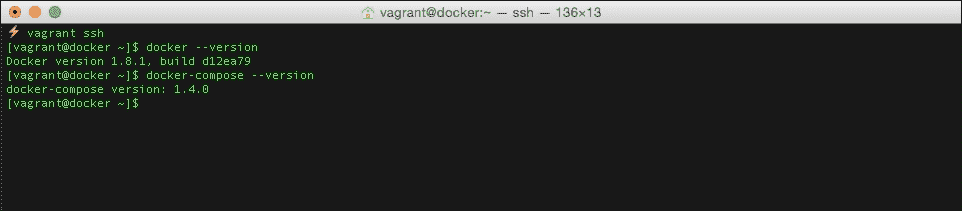
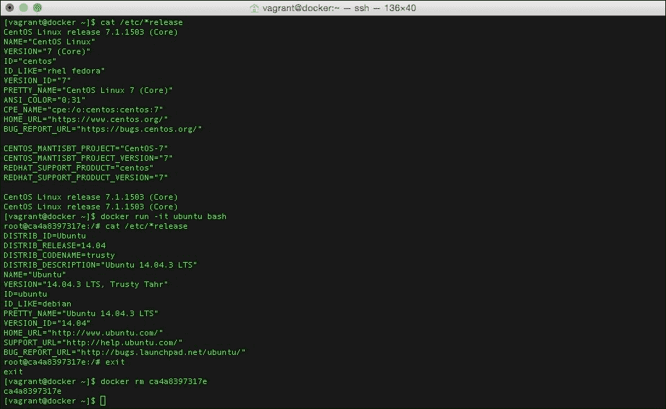
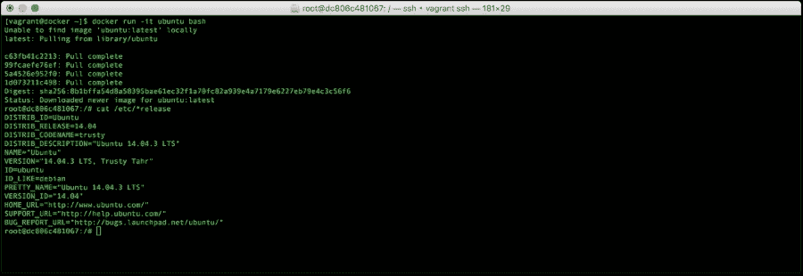

# 第一章。码头工人监控简介

Docker 是 SysAdmins 工具箱中最近的一个非常重要的新增功能。

Docker 将自己描述为构建、运输和运行分布式应用程序的开放平台。这意味着开发人员可以捆绑他们的代码，并将其传递给他们的运营团队。从这里，他们可以安全地部署，因为他们知道这样做的方式会引入与代码运行环境的一致性。

当遵循这个过程时，它应该会使“它在我的本地开发服务器上工作”的老开发人员对操作的争论成为过去。在 2014 年 6 月发布“生产就绪”1.0 之前，已经有超过 10，000 个备审应用程序可用。截至 2014 年底，这一数字已升至 71，000 多人。你可以通过查看 Docker 在 2015 年初发布的信息图来了解 Docker 在 2014 年是如何发展的，该信息图可以在[https://blog . Docker . com/2015/01/Docker-project-2014-旋风年回顾/](https://blog.docker.com/2015/01/docker-project-2014-a-whirlwind-year-in-review/) 上找到。

尽管关于这项技术的生产准备程度的争论仍在激烈进行，但 Docker 已经获得了一份令人印象深刻的技术合作伙伴名单，包括红帽、Canonical、惠普，甚至微软。

谷歌、Spotify、Soundcloud 和 CenturyLink 等公司都有以某种方式、形状或形式支持 Docker 的开源工具，也有许多独立开发人员发布了为 Docker 核心产品集提供额外功能的应用程序。此外，所有的公司都围绕着 Docker 生态系统涌现出来。

本书假设您在构建、运行和管理 Docker 容器方面有一定程度的经验，并且您现在希望从正在运行的应用程序开始度量，以进一步优化它们，或者您希望知道容器何时出现问题，以便您可以调试任何正在进行的问题。

如果您以前从未使用过 Docker，您可能想尝试一本优秀的书籍，这些书籍为您提供并向您介绍 Docker 提供的所有内容，例如*学习 Docker* 、 *Packt Publishing* 或 Docker 自己的容器介绍等书籍，可在其文档页面找到，如下所示:

*   学习 Docker:[https://www . packtpub . com/虚拟化与云/学习-docker](https://www.packtpub.com/virtualization-and-cloud/learning-docker)
*   官方码头文件:[https://docs.docker.com/](https://docs.docker.com/)

现在，我们已经熟悉了 Docker 是什么；本章的其余部分将涵盖以下主题:

*   与虚拟机、裸机和云实例(宠物、牛、鸡和雪花)等更传统的服务器相比，监控容器有何不同。
*   你应该运行的 Docker 的最低版本是什么？
*   如何按照本书中的练习说明，使用游民在当地创造一个环境

# 宠物、牛、鸡和雪花

在我们开始讨论监视容器的各种方法之前，我们应该先了解一下系统管理员的世界是什么样的，以及容器在其中的位置。

一个典型的系统管理员可能会管理托管在现场或第三方数据中心的服务器群，有些甚至会管理托管在公共云中的实例，如亚马逊网络服务或微软 Azure，有些系统管理员可能会在多个托管环境中处理他们所有的服务器群。

这些不同的环境中的每一个都有自己的做事方式，以及执行最佳实践。早在 2012 年 2 月，Randy Bias 在 Cloudscaling 上做了一个演讲，讨论了开放和可扩展云的架构。幻灯片快结束时，兰迪介绍了“宠物对牛”的概念(他把这个概念归功于比尔·贝克，他当时是微软的工程师)。

您可以在上查看原始幻灯片。

宠物对牛现在被广泛接受为描述现代托管实践的一个很好的类比。

## 宠物

宠物类似于传统的物理服务器或虚拟机，如下所示:

*   每只宠物都有名字；例如`myserver.domain.com`。
*   当它们不舒服时，你带它们去看兽医，帮助它们好转。你雇佣系统管理员来照顾他们。
*   你密切关注他们，有时会持续数年。您需要进行备份、修补，并确保它们得到完整记录。

## 牛

另一方面，牛代表更现代的云计算实例，如下所示:

*   你有太多的名字，所以你给他们号码；例如，网址可能看起来像`ip123123123123.eu.public-cloud.com`。
*   当它们生病时，你向它们开枪，如果你的牧群需要，你就替换掉你杀死的任何东西:一台服务器崩溃或显示出它有问题的迹象，你终止它，你的配置自动用一个精确的副本替换它。
*   你把它们放在田野里，远远地看着它们，你不会期望它们活得很久。您不是监视单个实例，而是监视集群。当需要更多的资源时，您可以添加更多的实例，一旦不再需要该资源，您就可以终止这些实例，让您回到基本配置。

## 鸡

接下来是一个术语，这是描述容器如何适应宠物与牛的世界的好方法；在一篇名为“云计算:宠物、牛和...鸡？”在活动状态上，伯纳德·戈尔登将容器描述为鸡:

*   在资源利用方面，它们比牛更有效率。容器可以在几秒钟内启动，而实例或服务器可能需要几分钟；它还比典型的虚拟机或云实例使用更少的 CPU 功率。
*   鸡比牛多得多。您可以将容器非常密集地打包到实例或服务器上。
*   鸡的寿命往往比牛和宠物短。容器适合运行微服务；这些容器可能只激活几分钟。

原博文可在[http://www . activestate . com/blog/2015/02/云计算-宠物-牛和鸡](http://www.activestate.com/blog/2015/02/cloud-computing-pets-cattle-and-chickens)找到。

## 雪花

最后一个术语是与动物无关，它描述了一种你在你的服务器产业中不想拥有的服务器，雪花。这一学期是由马丁·福勒在一篇名为“白雪公主”的博客文章中写的。雪花是一个用于“传统”或“继承”服务器的术语:

*   雪花很娇嫩，小心翼翼。通常，自您启动后，服务器就一直在数据中心。没有人知道最初是谁配置的，也没有文档记录；你只知道这很重要。
*   每一个都是独一无二的，不可能精确复制。即使是最强硬的系统管理员也害怕在机器无法启动时重启机器，因为它运行的是无法轻易重新安装的报废软件。

马丁的帖子可以在[http://martinfowler.com/bliki/SnowflakeServer.html](http://martinfowler.com/bliki/SnowflakeServer.html)找到。

## 那么这一切意味着什么呢？

根据您的需求和您想要部署的应用程序，您的容器可以启动到 pet 或黄牛风格的服务器上。您还可以创建一群鸡，让您的容器运行微服务。

此外，理论上，您可以用基于容器的应用程序来替换您担心的雪花服务器，该应用程序满足所有寿命终止的软件需求，同时保持在现代可支持的平台上的可部署性。

每种不同风格的服务器都有不同的监控要求，在最后一章中，我们将再次查看 Pets、黄牛、鸡和雪花，并讨论我们在后面几章中介绍的工具。我们还将介绍您在规划监控时应该考虑的最佳实践。

# 码头工人

虽然 Docker 在一年多前达到了 1.0 版本的里程碑，但它仍处于起步阶段；每一个新版本都会带来新的特性、bug 修复，甚至对一些正在贬值的早期功能的支持。

Docker 本身现在是几个较小项目的集合；其中包括以下内容:

*   码头工人引擎
*   码头工人机器
*   复合坞站
*   码头工人群
*   坞站集线器
*   坞站注册表
*   Kitmatic

在这本书里，我们将使用 Docker 引擎、Docker 合成和 Docker 中枢。

Docker Engine 是 Docker 项目的核心组件，它提供了 Docker 功能的主要部分。每当在本书中提到 Docker 或`docker`命令时，我都会提到 Docker 引擎。

本书假设您安装了 Docker Engine 版或更高版本；Docker Engine 的旧版本可能不包含运行接下来章节中介绍的命令和软件所需的必要功能。

Docker Compose 在 2014 年被 Docker 收购之前，是作为名为 **Fig** 的第三方编排工具开始其生命的。它被描述为一种使用 YAML([http://yaml.org](http://yaml.org))定义多容器应用程序的方式。简单地说，这意味着您可以使用一个调用人类可读配置文件的命令来快速部署复杂的应用程序。

我们假设您安装了 Docker Compose 1.3.3 或更高版本；本书中提到的`docker-compose.yml`文件就是在牢记这个版本的情况下编写的。

最后，我们将在本书中部署的大部分图像将来自 Docker Hub([https://hub.docker.com/](https://hub.docker.com/)，该中心不仅拥有包含 40，000 多幅公共图像的公共注册表，还拥有 100 幅官方图像。以下截图显示了 Docker Hub 网站上的官方存储库列表:


您也可以注册并使用 Docker Hub 托管您自己的公共和私有图像。

# 启动本地环境

只要有可能，我会尽量确保本书中的实践练习能够在本地机器上运行，比如你的台式机或笔记本电脑。出于本书的目的，我将假设您的本地机器运行的是最新版本的 OS X 或最新的 Linux 发行版，并且具有足够高的规格来运行本章中提到的软件。

我们将用来启动 Docker 实例的两个工具也将在 Windows 上运行；因此，应该可以遵循其中的说明，尽管您可能需要参考使用指南来了解语法的任何变化。

由于 Docker 的架构方式，本书的许多内容将让您在充当主机的虚拟服务器上运行命令并与命令行交互，而不是容器本身。因此，我们不会使用 Docker Machine 或 Kitematic。

这两个都是 Docker 提供的工具，用于在本地机器上快速引导支持 Docker 的虚拟服务器，因为不幸的是，这些工具部署的主机包含一个精简的操作系统，该系统针对以尽可能小的占用空间运行 Docker 进行了优化。

由于我们将在主机上安装额外的软件包，一个精简的“仅 Docker”操作系统可能不具备满足我们将在后面章节中运行的软件的先决条件的组件；因此，为了确保以后没有问题，我们将运行完整的操作系统。

就我个人而言，我更喜欢基于 RPM 的操作系统，如红帽企业版 Linux、Fedora 或 CentOS，因为从我第一次登录 Linux 服务器的那天起，我就一直在使用它们。

然而，由于许多读者将熟悉基于 Debian 的 Ubuntu，我将为这两种操作系统提供实际的例子。

为了确保体验尽可能一致，我们将安装游民和 VirtualBox 来运行虚拟机，该虚拟机将充当运行我们的容器的主机。

由 Mitchell Hashimoto 编写的 float 是一个命令行工具，用于创建和配置可复制和可移植的虚拟机环境。已经有许多博客帖子和文章实际上推销 Docker 反对游民；然而，在我们的例子中，这两种技术在提供可重复和一致的环境方面非常好地协同工作。

游民可用于 Linux、OS X 和 Windows。有关如何安装的详细信息，请访问位于[https://www.vagrantup.com/](https://www.vagrantup.com/)的游民网站。

VirtualBox 是一个伟大的全方位开源虚拟化平台，最初由 Sun 开发，现在由 Oracle 维护。它允许您在本地机器上运行 32 位和 64 位客户操作系统。关于如何下载和安装 VirtualBox 的详细信息可以在[https://www.virtualbox.org/](https://www.virtualbox.org/)找到；同样，VirtualBox 可以安装在 Linux、OS X 和 Windows 上。

# 克隆环境

环境的来源以及实例可以在位于[https://github.com/russmckendrick/monitoring-docker](https://github.com/russmckendrick/monitoring-docker)的监控 Docker 存储库中的 GitHub 上找到。

要在本地计算机的终端上克隆存储库，请运行以下命令(根据需要替换文件路径):

```
mkdir ~/Documents/Projects
cd ~/Documents/Projects/
git clone https://github.com/russmckendrick/monitoring-docker.git

```

一旦被克隆，您应该会看到一个名为`monitoring-docker`的目录，然后进入该目录，如下所示:

```
cd ~/Documents/Projects/monitoring-docker

```

# 运行虚拟服务器

在存储库中，您将找到两个文件夹，其中包含启动 CentOS 7 或 Ubuntu 14.04 虚拟服务器所需的`Vagrant`文件。

如果您想使用 CentOS 7 游民箱，请将目录更改为`vagrant-centos`:

```
cd vagrant-centos

```

一旦进入游民-centos 目录，就会看到有一个`Vagrant`文件；启动 CentOS 7 虚拟服务器只需要这个文件。虚拟服务器启动后，将安装最新版本的`docker`和`docker-compose`，并且`monitoring-docker`目录也将使用挂载点`/monitoring-docker`挂载到虚拟机内部。

要启动虚拟服务器，只需键入以下命令:

```
vagrant up

```

这将从[https://atlas.hashicorp.com/russmckendrick/boxes/centos71](https://atlas.hashicorp.com/russmckendrick/boxes/centos71)下载最新版本的流浪盒，然后启动虚拟服务器；这是一个 450 MB 的下载，所以下载可能需要几分钟；它只需要做一次。

如果一切顺利，您应该会看到类似以下输出的内容:


现在您已经启动了虚拟服务器，您可以使用以下命令连接到它:

```
vagrant ssh

```

登录后，应确认`docker`和`docker-compose`均可用:



最后，您可以尝试使用以下命令运行`hello-world`容器:

```
docker run hello-world

```

如果一切按预期进行，您应该会看到以下输出:


要尝试更有野心的东西，可以使用以下命令运行 Ubuntu 容器:

```
docker run -it ubuntu bash

```

在我们启动并进入 Ubuntu 容器之前，让我们通过检查可以在`/etc`中找到的发布文件来确认我们正在运行 CentOS 主机:



现在，我们可以启动 Ubuntu 容器了。使用相同的命令，我们可以通过查看其发布文件来确认我们在 Ubuntu 容器中:



要退出容器，只需输入`exit`。这将停止容器的运行，因为它已经终止了容器中唯一正在运行的进程，即 bash，并将您返回到主机 CentOS 机器。

从我们的 CentOS 7 主机上可以看到，我们已经启动并移除了一个 Ubuntu 容器。

CentOS 7 和 Ubuntu 游民文件都将在您的虚拟机上配置一个静态 IP 地址。是`192.168.33.10`；此外，在[也有这个 IP 地址的 DNS 记录。这些将允许您访问任何暴露在浏览器中的容器，无论是在`http://192.168.33.10/`还是](http://docker.media-glass.es)[http://docker.media-glass.es/](http://docker.media-glass.es/)。

### 类型

网址[http://docker.media-glass.es/](http://docker.media-glass.es/)只在游民箱打开的时候工作，你有一个服务网页的容器在运行。

通过运行以下命令，您可以看到这一点:

```
docker run -d -p 80:80russmckendrick/nginx-php

```

### 类型

**下载示例代码**

您可以从您在[http://www.packtpub.com](http://www.packtpub.com)的账户下载您购买的所有 Packt Publishing 书籍的示例代码文件。如果您在其他地方购买了这本书，您可以访问[http://www.packtpub.com/support](http://www.packtpub.com/support)并注册，以便将文件直接通过电子邮件发送给您。

这将下载并启动一个运行 NGINX 的容器。然后可以在浏览器中前往`http://192.168.33.10/`或[http://docker.media-glass.es/](http://docker.media-glass.es/)；你应该看看禁书。这是因为我们还没有给 NGINX 提供任何内容(这方面的更多内容将在本书后面介绍):


更多的例子和想法，去[http://docs.docker.com/userguide/](http://docs.docker.com/userguide/)的网站。

# 暂停虚拟服务器

要退出虚拟服务器并返回到您的本地机器，请键入`exit`。

您现在应该看到本地机器的终端提示；但是，您启动的虚拟服务器仍将在后台愉快地运行，使用资源，直到您使用以下命令关闭它:

```
vagrant halt

```

使用`vagrant destroy`完全终止虚拟服务器:

```
vagrant destroy

```

要检查虚拟服务器的当前状态，您可以运行以下命令:

```
vagrant status

```

以下输出给出了前面命令的结果:


重新启动虚拟服务器或从头开始创建虚拟服务器，都可以通过再次发出`vagrant up`命令来实现。

前面的细节展示了如何使用 CentOS 7 流浪盒。如果您更喜欢启动 Ubuntu 14.04 虚拟服务器，您可以使用以下命令进入`vagrant-ubuntu`目录下载并安装游民箱:

```
cd ~/Documents/Projects/monitoring-docker/vagrant-ubuntu
vagrant up

```

从这里，您将能够运行 float up，并遵循用于引导和与 CentOS 7 虚拟服务器交互的相同指令。

# 总结

在本章中，我们讨论了不同类型的服务器，还讨论了容器化的应用程序如何适合每一个类别。我们还安装了 VirtualBox，并使用游民推出了 CentOS 7 或 Ubuntu 14.04 虚拟服务器，安装了`docker`和`docker-compose`。

我们新的虚拟服务器环境将在接下来的章节中用于测试各种不同类型的监控。在下一章中，我们将通过使用 Docker 的内置功能来探索关于我们正在运行的容器的指标来开始我们的旅程。