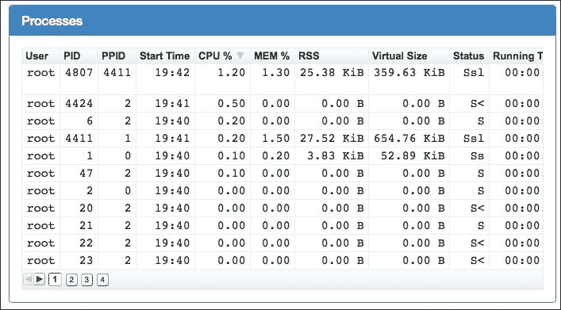
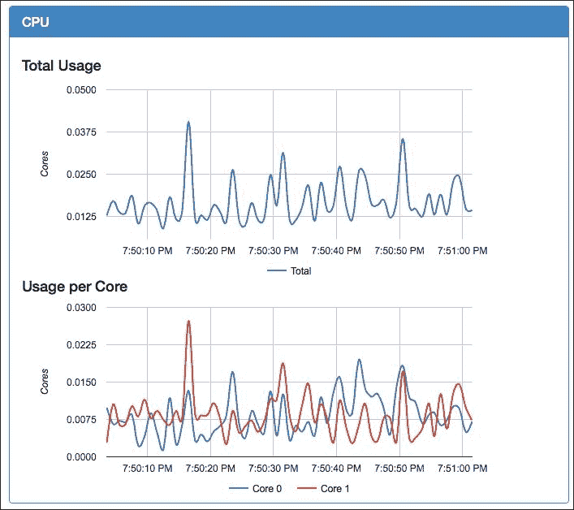
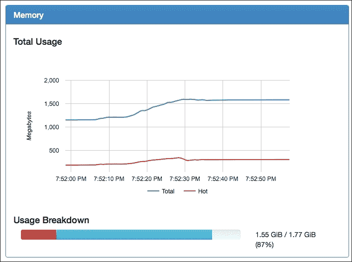
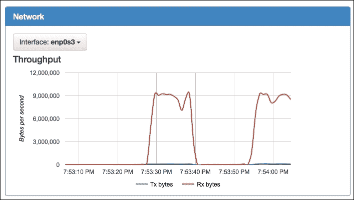
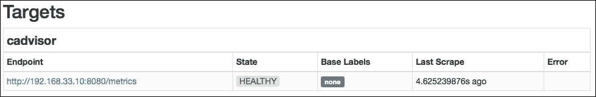

# 三、高级容器资源分析

在最后一章中，我们研究了如何使用 Docker 内置的 API 来深入了解您的容器正在运行哪些资源。现在，我们来看看如何通过使用谷歌的 cAdvisor 将它提升到一个新的水平。在本章中，您将涵盖以下主题:

*   如何安装 cAdvisor 并开始收集指标
*   了解所有关于网络界面和实时监控的信息
*   您有哪些选项可以将指标发送到远程 Prometheus 数据库进行长期存储和趋势分析

# 什么是 cAdvisor？

谷歌对 cAdvisor 的描述如下:

> *“cAdvisor(Container Advisor)让容器用户了解他们运行的容器的资源使用和性能特征。它是一个正在运行的守护进程，收集、聚合、处理和导出关于正在运行的容器的信息。具体来说，对于每个容器，它保存资源隔离参数、历史资源使用情况、完整的历史资源使用情况直方图和网络统计数据。这些数据由一个容器导出，并且是机器范围的。”*

该项目一开始是作为谷歌的一个内部工具，用于深入了解使用自己的容器堆栈推出的容器。

### 注

谷歌自己的容器堆栈被称为“让我为你包含它”或简称 lmctfy。lmctfy 上的工作已经作为谷歌端口功能安装到 libcontainer 上，lib Container 是开放容器计划的一部分。lmctfy 上的更多详情可在[https://github.com/google/lmctfy/](https://github.com/google/lmctfy/)找到。

cAdvisor 是用 Go([https://golang.org](https://golang.org))写的；您可以编译自己的二进制文件，也可以使用通过容器提供的预编译二进制文件，该容器可从谷歌自己的 Docker Hub 帐户获得。你可以在[http://hub.docker.com/u/google/](http://hub.docker.com/u/google/)找到这个。

安装后，cAdvisor 将位于后台并捕获类似于`docker stats`命令的指标。我们将在本章后面的内容中浏览这些统计数据并理解它们的含义。

cAdvisor 将这些指标与主机的指标结合在一起，并通过简单易用的内置 web 界面公开它们。

# 使用容器运行 cAdvisor

有许多方法可以安装 cAdvisor 最简单的入门方法是下载并运行包含预编译 cAdvisor 二进制文件的副本的容器映像。

在运行 cAdvisor 之前，让我们启动一个新的流浪主机:

```
[russ@mac ~]$ cd ~/Documents/Projects/monitoring-docker/vagrant-centos/
[russ@mac ~]$ vagrant up
Bringing machine 'default' up with 'virtualbox' provider...
==>default: Importing base box 'russmckendrick/centos71'...
==>default: Matching MAC address for NAT networking...
==>default: Checking if box 'russmckendrick/centos71' is up to date...

.....

==>default: => Installing docker-engine ...
==>default: => Configuring vagrant user ...
==>default: => Starting docker-engine ...
==>default: => Installing docker-compose ...
==>default: => Finished installation of Docker
[russ@mac ~]$ vagrantssh

```

### 类型

**使用反斜杠**

因为我们有很多选项可以传递给`docker run`命令，所以我们使用`\`将命令拆分成多行，这样更容易跟踪正在发生的事情。

访问主机后，运行以下命令:

```
docker run \
 --detach=true \
 --volume=/:/rootfs:ro \
 --volume=/var/run:/var/run:rw \
 --volume=/sys:/sys:ro \
 --volume=/var/lib/docker/:/var/lib/docker:ro \
 --publish=8080:8080 \
 --privileged=true \
 --name=cadvisor \
google/cadvisor:latest

```

您现在应该有一个 cAdvisor 容器并在您的主机上运行。在开始之前，让我们通过讨论为什么我们将所有选项传递给容器来更详细地了解 cAdvisor。

cAdvisor 二进制文件被设计为与 Docker 二进制文件一起在主机上运行，因此通过在容器中启动 cAdvisor，我们实际上是将二进制文件隔离在其关闭的环境中。为了让 cAdvisor 访问它在主机上需要的资源，我们必须挂载几个分区，并且给容器特权访问，让 cAdvisor 二进制文件认为它正在主机上执行。

### 注

当使用`--privileged`启动容器时，Docker 将允许完全访问主机上的设备；此外，Docker 将配置 AppArmor 或 SELinux，以允许您的容器像在容器外运行的进程一样访问主机。有关`--privileged`标志的信息，请参见[Docker博客上的这篇文章。](http://blog.docker.com/2013/09/docker-can-now-run-within-docker/)

# 从源代码编译 cAdvisor

如前一节所述，cAdvisor 确实应该在主机上执行；这意味着，您可能必须使用 case 来编译自己的 cAdvisor 二进制文件，并直接在主机上运行它。

要编译 cAdvisor，您需要执行以下步骤:

1.  在主机上安装 Go 和 Mercurial 需要 1.3 或更高版本的 Go 来编译 cAdvisor。
2.  设定上班的路线。
3.  抓取 cAdvisor 和 godep 的源代码。
4.  为您的围棋二进制文件设置路径。
5.  使用 godep 构建 cAdvisor 二进制文件，为我们获取依赖关系。
6.  将二进制文件复制到/ `usr/local/bin/`。
7.  下载`Upstart`或`Systemd`脚本并启动该过程。

如果您遵循了上一节中的说明，您将已经运行了一个 cAdvisor 进程。在从源代码编译之前，您应该从一个干净的宿主开始；让我们注销主机并启动一个新副本:

```
[vagrant@centos7 ~]$ exit
logout
Connection to 127.0.0.1 closed.
[russ@mac ~]$ vagrant destroy
default: Are you sure you want to destroy the 'default' VM? [y/N] y
==>default: Forcing shutdown of VM...
==>default: Destroying VM and associated drives...
==>default: Running cleanup tasks for 'shell' provisioner...
[russ@mac ~]$ vagrant up
Bringing machine 'default' up with 'virtualbox' provider...
==>default: Importing base box 'russmckendrick/centos71'...
==>default: Matching MAC address for NAT networking...
==>default: Checking if box 'russmckendrick/centos71' is up to date...

.....

==>default: => Installing docker-engine ...
==>default: => Configuring vagrant user ...
==>default: => Starting docker-engine ...
==>default: => Installing docker-compose ...
==>default: => Finished installation of Docker
[russ@mac ~]$ vagrantssh

```

要在 CentOS 7 主机上构建 cAdvisor，请运行以下命令:

```
sudo yum install -y golanggit mercurial
export GOPATH=$HOME/go
go get -d github.com/google/cadvisor
go get github.com/tools/godep
export PATH=$PATH:$GOPATH/bin
cd $GOPATH/src/github.com/google/cadvisor
godep go build .
sudocpcadvisor /usr/local/bin/
sudowgethttps://gist.githubusercontent.com/russmckendrick/f647b2faad5d92c96771/raw/86b01a044006f85eebbe395d3857de1185ce4701/cadvisor.service -O /lib/systemd/system/cadvisor.service
sudosystemctl enable cadvisor.service
sudosystemctl start cadvisor

```

在 Ubuntu 14.04 LTS 主机上，运行以下命令:

```
sudo apt-get -y install software-properties-common
sudo add-apt-repository ppa:evarlast/golang1.4
sudo apt-get update

sudo apt-get -y install golang mercurial

export GOPATH=$HOME/go
go get -d github.com/google/cadvisor
go get github.com/tools/godep
export PATH=$PATH:$GOPATH/bin
cd $GOPATH/src/github.com/google/cadvisor
godep go build .
sudocpcadvisor /usr/local/bin/
sudowgethttps://gist.githubusercontent.com/russmckendrick/f647b2faad5d92c96771/raw/e12c100d220d30c1637bedd0ce1c18fb84beff77/cadvisor.conf -O /etc/init/cadvisor.conf
sudo start cadvisor

```

您现在应该有一个正在运行的 cAdvisor 进程。您可以通过运行`ps aux | grep cadvisor`来检查这一点，您应该会看到一个路径为`/usr/local/bin/cadvisor`的进程正在运行。

# 收集指标

现在，您已经运行了cAdvisor；为了开始收集指标，您需要做什么来配置服务？简而言之，什么都没有。当您启动 cAdvisor 进程时，它会立即开始轮询您的主机，以找出正在运行的容器，并收集正在运行的容器和您的主机上的信息。

# 网页界面

cAdvisor 应该是在`8080`端口上运行的；如果您打开`http://192.168.33.10:8080/`，您应该会看到 cAdvisor 标志和主机概述:


这个初始页面流式传输关于主机的实时统计数据，尽管当您开始深入查看容器时，每个部分都是重复的。首先，让我们使用主机信息来查看每个部分。

## 概述

这个概述部分让你鸟瞰你的系统；它使用量规，因此您可以快速了解哪些资源达到了极限。在下面的截图中，CPU 利用率的方式很少，文件系统使用率相对较低；但是，我们使用了 64%的可用内存:


## 流程

下面的截图显示了我们在上一章中使用的`ps aux`、`dockerps`和`top`命令输出的组合视图:



以下是每个列标题的含义:

*   **用户**:显示哪个用户在运行流程
*   **PID** :这是唯一的流程 ID
*   **PPID** :这是母流程的 **PID**
*   **开始时间**:显示流程开始的时间
*   **CPU %** :这是进程当前消耗的 CPU 的百分比
*   **MEM %** :这是进程当前消耗的内存的百分比
*   **RSS** :这个显示进程使用了多少主内存
*   **虚拟大小**:显示进程使用了多少虚拟内存
*   **状态**:显示流程的当前状态；这是标准的 Linux 进程状态代码
*   **运行时间**:显示进程运行了多长时间
*   **命令**:显示进程正在运行哪个命令
*   **容器**:显示流程附着在哪个容器上；列为`/`的容器是主机

由于可能有几百个进程处于活动状态，所以这个部分被分成几页；您可以通过左下角的按钮导航到这些。此外，您可以通过单击任何标题对流程进行排序。

## CPU

下面的图显示了最后一分钟的 CPU 利用率:



以下是每个术语的含义:

*   **总使用量**:这显示了所有内核的总使用量
*   **每个内核的使用量**:此图分解了每个内核的使用量
*   **使用情况细分**(上一张截图中未显示):这显示了所有内核的总使用情况，但将其细分为内核正在使用的内容和用户拥有的进程正在使用的内容

## 记忆

**记忆**部分被分成两部分。该图告诉您主机或容器的所有进程使用的内存总量；这是冷热记忆的总和。**热**内存是当前的工作集:最近被内核触碰的页面。**冷**内存是有一段时间没碰过的页面，需要的话可以回收。

**使用细分**给出了主机内存总量或容器中的容差的可视化表示，以及总使用量和热使用量:



## 网络

此部分显示最后一分钟的进出流量。您可以使用左上角的下拉框更改界面。还有一个图表显示任何网络错误。通常，该图应该是平坦的。如果不是，那么您将看到主机或容器的性能问题:



## 文件系统

最后一节给出了文件系统使用的分解。在下面的截图中，`/dev/sda1`是引导分区，`/dev/sda3`是主文件系统，`/dev/mapper/docker-8…`是运行容器的写文件系统的集合:


# 查看容器统计

页面顶部有一个你运行容器的链接；你可以点击链接或者直接进入`http://192.168.33.10:8080/docker/`。页面加载后，您应该会看到所有正在运行的容器的列表，以及 Docker 进程的详细概述，最后是您已经下载的映像的列表。

## 分包商

分包商显示您的容器列表；每个条目都是一个可点击的链接将带您进入一个页面，该页面将为您提供以下详细信息:

*   隔离:
    *   **CPU** :显示容器的 CPU 余量；如果您没有设置任何资源限制，您将看到主机的 CPU 信息
    *   **内存**:显示容器的内存余量；如果您没有设置任何资源限制，您的容器将显示无限制的余量
*   用法:
    *   **概述**:这显示了量表，因此您可以快速查看您离任何资源限制有多近
    *   **流程**:显示您所选容器的流程
    *   **中央处理器**:这显示了中央处理器利用率图表仅隔离到您的容器
    *   **内存**:显示容器的内存利用率

## 驾驶员状态

驱动程序给出了主 Docker 进程的基本统计数据，以及主机内核、主机名和底层操作系统的信息。

它还提供了关于容器和映像总数的信息。您可能会注意到，映像的总数比您预期看到的要大得多；这是因为它将每个文件系统算作一个单独的映像。

### 注

有关 Docker 映像的更多详细信息，请参见位于[https://docs.docker.com/userguide/dockerimg/](https://docs.docker.com/userguide/dockerimg/)的 Docker 用户指南。

它还为您提供了存储配置的详细分类。

## 映像

最后，您会得到一个在主机上可用的 Docker 映像列表。它列出了存储库、标签、大小和创建映像的时间，以及映像的唯一标识。这可以让您知道映像的来源(存储库)、您下载的映像版本(标签)以及映像的大小(大小)。

# 这都太棒了，有什么蹊跷？

所以你可能在想，浏览器中所有这些信息都是非常有用的；能够以易于阅读的格式查看实时性能指标确实是一个优势。

你可能已经注意到了，使用 cAdvisor 的 web 界面的最大缺点是，它只能向你显示一分钟的度量值；你可以很真实地看到信息实时消失。

由于一块玻璃可以实时看到你的容器，所以 cAdvisor 是一个很好的工具；如果你想回顾任何超过一分钟的指标，你就不走运了。

也就是说，除非您配置某个地方来存储您的所有数据；这就是普罗米修斯进来的地方。

# 普罗米修斯

那么什么是普罗米修斯呢？它的开发者描述如下:

> *Prometheus 是一个开源系统的监控和警报工具包，构建于 SoundCloud。自 2012 年成立以来，它已成为在 SoundCloud 上检测新服务的标准，外部使用和贡献不断增加。*

好的，但是这和 cAdvisor 有什么关系呢？嗯，普罗米修斯有一个相当强大的数据库后端，它将导入的数据存储为一系列时间事件。

维基百科对时间序列的描述如下:

> *“时间序列是一系列数据点，通常由在一个时间间隔内进行的连续测量组成。时间序列的例子有海洋潮汐、太阳黑子的计数和道琼斯工业平均指数的每日收盘价。时间序列经常通过线形图绘制*
> 
> [https://en . Wikipedia . org/wiki/time _ series](https://en.wikipedia.org/wiki/Time_series)

默认情况下，cAdvisor 所做的事情之一是在`/metrics`在单个页面上公开它捕获的所有指标；您可以在我们的 cAdvisor 安装中的`http://192.168.33.10:8080/metrics`处看到这一点。每次加载页面时都会更新度量:


正如您在前面的截图中看到的，这只是一个长的原始文本页面。普罗米修斯的工作方式是，您将其配置为以用户定义的时间间隔(比如说每五秒钟)刮擦`/metrics`URL；文本采用普罗米修斯理解的格式，并被摄入普罗米修斯的时间序列数据库。

这意味着，使用普罗米修斯强大的内置查询语言，您可以开始向下钻取您的数据。让我们看看让普罗米修斯开始运转。

## 发射普罗米修斯

像 cAdvisor 一样，有几种方法可以发射普罗米修斯。首先，我们将启动一个容器并注入我们自己的配置文件，以便 Prometheus 知道我们的 cAdvisor 端点在哪里:

```
docker run \
 --detach=true \
 --volume=/monitoring_docker/Chapter03/prometheus.yml:/etc/prometheus/prometheus.yml \
 --publish=9090:9090 \
 --name=prometheus \
prom/prometheus:latest

```

一旦你启动了容器，普罗米修斯将可以通过以下网址访问:`http://192.168.33.10:9090`。当你第一次加载网址时，你会被带到一个状态页面；这给出了普罗米修斯安装的一些基本信息。本页的重要部分是目标列表。这列出了普罗米修斯将用来获取指标的网址；您应该会看到您的 cAdvisor 网址以**健康**状态列出，如下图所示:



另一个信息页面包含以下内容:

*   **运行时间信息**:如果您已经配置了一个端点，这将显示 Prometheus 启动的时间和轮询数据
*   **建造信息**:这里包含了你一直在运行的普罗米修斯版本的详细信息
*   **配置**:这是我们在容器启动时注入到容器中的配置文件的副本
*   **规则**:这是我们注入的任何规则的副本；这些将用于报警
*   **启动标志**:显示所有运行时变量及其值

## 质疑普罗米修斯

由于我们目前只有几个容器启动并运行，让我们启动一个运行 Redis 的容器，这样我们就可以开始查看普罗米修斯内置的查询语言。

我们将使用官方的 Redis 映像，因为我们只是以此为例，所以不需要传递任何用户变量:

```
docker run --name my-redis-server -d redis

```

我们现在有一个名为`my-redis-server`的容器正在运行。cAdvisor 应该已经向 Prometheus 公开了关于容器的指标；让我们继续看看。在普罗米修斯网页界面，转到页面顶部菜单中的**图形**链接。在这里，您将看到一个文本框，您可以在其中输入您的查询。首先，让我们看看 Redis 容器的 CPU 使用情况。

在框中，输入以下内容:

```
container_cpu_usage_seconds_total{job="cadvisor",name="my-redis-server"}
```

然后，点击**执行**后，应该会返回两个结果，列在页面的**控制台**选项卡中。如果你还记得的话，cAdvisor 会记录容器可以访问的每个 CPU 内核的 CPU 使用情况，这就是为什么我们返回了两个值，一个用于“cpu00”，一个用于“cpu01”。点击**图表**链接将显示一段时间内的结果:


正如您在前面的截图中所看到的一样，我们现在可以访问过去 25 分钟的使用情况图表，这大约是我在生成图表之前启动 Redis 实例的时间。

## 仪表盘

此外，当在主应用中使用查询工具创建其中一个图形时，您可以安装一个单独的仪表板应用。这在第二个容器中运行，该容器使用应用编程接口作为数据源连接到您的主普罗米修斯容器。

在启动 Dashboard 容器之前，我们应该初始化一个 SQLite3 数据库来存储我们的配置。为了确保数据库的持久性，我们将在`/tmp/prom/file.sqlite3`中将其存储在主机上:

```
docker run \
 --volume=/tmp/prom:/tmp/prom \
 -e DATABASE_URL=sqlite3:/tmp/prom/file.sqlite3 \
prom/promdash ./bin/rake db:migrate

```

初始化数据库后，我们可以正确启动仪表板应用:

```
docker run \
 --detach=true \
 --volume=/tmp/prom:/tmp/prom \
 -e DATABASE_URL=sqlite3:/tmp/prom/file.sqlite3 \
 --publish=3000:3000  \
 --name=promdash \
prom/promdash

```

应用现在应该可以在`http://192.168.33.10:3000/`访问。我们需要做的第一件事就是设置数据源。为此，单击屏幕顶部**服务器**链接上的，然后单击**新服务器**。在这里，您将被要求提供您的普罗米修斯服务器的详细信息。命名服务器并输入以下网址:

*   **名称**:T0
*   **URL** : `http://192.168.33.10:9090`
*   **服务器类型** : `Prometheus`

一旦你点击**创建服务器**，你会收到一条消息说**服务器已成功创建**。接下来，你需要创建一个`directory`；这是您的仪表板将被存储的地方。

点击顶部菜单中的**仪表盘**链接，然后点击**新目录**，创建一个名为`Test directory`的目录。现在，您可以开始创建仪表板了。点击**新仪表盘**，称之为**我的仪表盘**，放入`Test directory`。一旦点击**创建仪表板**，您将进入预览屏幕。

从这里，您可以使用每个部分右上角的控件构建仪表板。要添加数据，只需在仪表板部分输入您希望看到的查询:


### 注

有关如何创建仪表板的详细信息，请参见位于[http://prometheus.io/docs/visualization/promdash/](http://prometheus.io/docs/visualization/promdash/)的普罗米修斯文档的 **PROMDASH** 部分。

## 接下来的步骤

目前，我们在一个容器中运行普罗米修斯，它的数据存储在同一个容器中。这意味着，如果因为任何原因容器被终止，我们的数据丢失；这也意味着我们不能在不丢失数据的情况下升级。为了解决这个问题，我们可以创建一个数据量容器。

### 注

数据卷容器是一种特殊类型的容器，只作为其他容器的存储而存在。更多详细信息，请参见[上的 Docker](https://docs.docker.com/userguide/dockervolumes/#creating-and-mounting-a-data-volume-container) 用户指南。

首先，让我们确保移除了所有正在运行的普罗米修斯容器:

```
docker stop prometheus&&dockerrm Prometheus

```

接下来，让我们创建一个名为`promdata`的数据容器:

```
docker create \
 --volume=/promdata \
 --name=promdata \
prom/prometheus /bin/true

```

最后，再次启动普罗米修斯，这次使用数据容器:

```
docker run \
 --detach=true \
 --volumes-from promdata \
 --volume=/monitoring_docker/Chapter03/prometheus.yml:/etc/prometheus/prometheus.yml \
 --publish=9090:9090 \
 --name=prometheus \
prom/prometheus

```

这将确保，如果您不得不升级或重新启动您的容器，您已经捕获的指标是安全可靠的。

在本书的这一部分，我们只涉及到使用普罗米修斯的基础知识；关于申请的更多信息，我推荐以下链接作为一个很好的起点:

*   文件:[http://prometheus.io/docs/introduction/overview/](http://prometheus.io/docs/introduction/overview/)
*   推特:[https://twitter.com/PrometheusIO](https://twitter.com/PrometheusIO)
*   项目页面:[https://github.com/prometheus/prometheus](https://github.com/prometheus/prometheus)
*   谷歌集团:https://groups.google.com/forum/#!论坛/普罗米修斯-开发者

# 替代品？

普罗米修斯有一些替代品。一个这样的替代方案是 InfluxDB，它对自己的描述如下:

> *无外部依赖的开源分布式时间序列数据库。*

但是，在撰写本文时，cAdvisor 目前与最新版本的 InfluxDB 不兼容。cAdvisor 的代码库中有补丁；然而，这些还没有进入谷歌维护的 Docker Image。

如需了解更多关于英菲尼克斯数据库及其全新可视化投诉应用 Chronograf 的详细信息，请访问位于[https://influxdb.com/](https://influxdb.com/)的项目网站，如需了解更多关于如何将 cAdvisor 统计数据导出到英菲尼克斯数据库的详细信息，请访问位于[https://github.com/google/cadvisor/tree/master/docs](https://github.com/google/cadvisor/tree/master/docs)的 cAdvisor 的支持文档。

# 总结

在本章中，我们学习了如何将查看容器的实时统计数据从命令行转移到 web 浏览器中。我们探索了一些不同的方法来安装谷歌的 cAdvisor 应用，以及如何使用它的网络界面来监视我们正在运行的容器。我们还学习了如何从 cAdvisor 中获取指标，并使用现代时间序列数据库 Prometheus 存储它们。

我们在本章中介绍的两项主要技术仅公开发布不到 12 个月。在下一章中，我们将研究如何使用一个在 SysAdmins 工具箱中已经存在了 10 多年的监控工具——Zabbix。