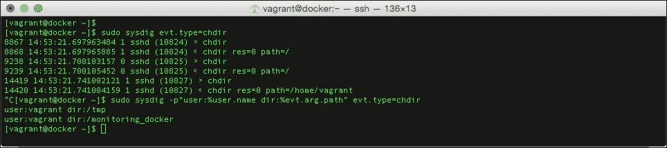
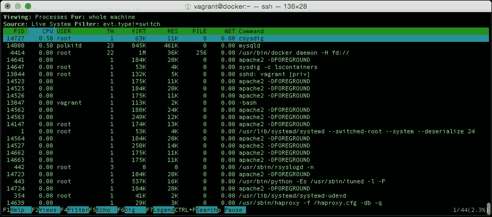

# 五、将Sysdig用于查询

我们之前看到的工具都依赖于对 Docker 进行 API 调用或者从 LXC 读取指标。Sysdig 的工作方式与此不同，它将自己挂钩到主机的内核中。虽然这种方法确实违背了 Docker 的理念，即每个服务都在自己的独立容器中运行，但只运行几分钟 Sysdig 就能获得的信息远远超过了不使用它的任何理由。

在本章中，我们将研究以下主题:

*   如何在主机上安装 Sysdig 和 Csysdig
*   基本用法以及如何实时查询您的容器
*   如何捕获日志以便以后查询

# 什么是 Sysdig？

在我们开始进入 Sysdig 之前，让我们先了解一下它是什么。当我第一次听说这个工具时，我对自己说，它听起来太好了，不可能是真的；网站对该工具的描述如下:

> *“Sysdig 是开源的、系统级的探索:从运行的 Linux 实例中捕获系统状态和活动，然后保存、过滤和分析。Sysdig 在 Lua 中是可脚本化的，包括一个命令行界面和一个强大的交互式 UI csysdig，它运行在您的终端中。把 sysdig 想象成 strace+tcpdump+htop+iftop+lsof+牛逼酱。拥有最先进的容器可视性。”*

这是一个相当大的声明，因为它声称的所有强大的工具都在一组 goto 命令中，以便在查看问题时运行，所以一开始我有点怀疑。

任何一个必须在 Linux 服务器上尝试跟踪一个错误日志中不太详细的问题的人都会知道，使用 strace、lsof 和 tcpdump 等工具可能会很快变得复杂，通常需要捕获大量数据，然后使用几种工具的组合，通过减少捕获的数据量来缓慢、手动地跟踪问题。

想象一下，当 Sysdig 的说法被证明是真的时，我有多高兴。这让我希望当一线工程师的时候能把工具拿回来；这会让我的生活轻松很多。

Sysdig 有两种不同的口味，首先是在[http://www.sysdig.org/](http://www.sysdig.org/)提供的开源版本；这附带了一个 ncurses 界面，以便您可以从基于终端的 GUI 轻松访问和查询数据。

### 注

维基百科将 **ncurses** (新诅咒)描述为一个编程库，它提供了一个允许程序员以独立于终端的方式编写基于文本的用户界面的应用编程接口。这是一个用于开发在终端仿真器下运行的“类似图形用户界面”的应用软件的工具包。它还优化了屏幕更改，以减少使用远程外壳时遇到的延迟。

还有一种商业服务，允许您将您的 Sysdig 流式传输到他们的外部托管服务；这个版本有一个基于 web 的界面，用于查看和查询您的数据。

在这一章中，我们将集中讨论开源版本。

# 安装Sysdig

考虑到Sysdig 的功能有多强大，它拥有我所见过的最简单的安装和配置过程之一。要在 CentOS 或 Ubuntu 服务器上安装 Sysdig，请键入以下命令:

```
curl -s https://s3.amazonaws.com/download.draios.com/stable/install-sysdig | sudo bash

```

运行上述命令后，您将获得以下输出:


就这样，你准备走了。没有什么可配置或做的了。有一个手动安装过程，也有一种安装工具的方法，使用容器来构建必要的内核模块；更多详细信息，请参见如下安装指南:

[http://www.sysdig.org/wiki/how-to-install-sysdig-for-linux/](http://www.sysdig.org/wiki/how-to-install-sysdig-for-linux/)

# 使用 Sysdig

在我们看如何使用 Sysdig 之前，让我们通过运行以下命令，使用`docker-compose`启动几个容器:

```
cd /monitoring_docker/chapter05/wordpress/
docker-compose up –d

```

这将启动一个 WordPress 安装，运行一个数据库和两个 web 服务器容器，它们使用一个 HAProxy 容器进行负载平衡。一旦容器启动，您将能够在 http://docker.media-glass.es/的 T2 查看 WordPress 安装。在网站可见之前，您需要输入一些详细信息来创建管理员用户；按照屏幕提示完成这些步骤。

## 基础

Sysdig 的核心是一个产生数据流的工具；您可以通过键入`sudo sysdig`来查看该流(要退出，请按 *Ctrl* + *c* )。

那里有很多信息，所以让我们开始向下过滤流，并运行以下命令:

```
sudosysdigevt.type=chdir

```

这将只显示用户更改目录的事件；要查看它的运行情况，请打开第二个终端，当您登录时，您会看到第一个终端中有一些活动。如您所见，它看起来很像传统的日志文件；我们可以通过运行以下命令来格式化输出，以提供用户名等信息:

```
sudosysdig -p"user:%user.name dir:%evt.arg.path" evt.type=chdir

```

然后，在第二个终端中，更改目录几次:



如您所见，这比原始的无格式输出更容易阅读。按 *Ctrl* + *c* 停止过滤。

## 捕捉数据

在上一节中，我们实时查看了过滤数据；还可以将 Sysdig 数据流式传输到一个文件中，以便您可以在以后查询数据。从第二个终端退出，并在第一个终端上运行以下命令:

```
sudosysdig -w ~/monitoring-docker.scap

```

当命令在第一个终端上运行时，在第二个终端上登录主机，并几次更改目录。另外，在我们录制的时候，点击一下我们在本节开头开始的 WordPress 网站，网址是`http://docker.media-glass.es/`。完成后，按下 *Crtl* + *c* 停止录制；您现在应该返回到提示符。您可以通过运行以下命令来检查 Sysdig 创建的文件的大小:

```
ls -lha ~/monitoring-docker.scap

```

现在，我们可以使用我们捕获的数据来应用与查看实时流时相同的过滤器:

```
sudosysdig -r ~/monitoring-docker.scap -p"user:%user.name dir:%evt.arg.path" evt.type=chdir

```

通过运行前面的命令，您将获得以下输出:


请注意，我们如何获得与实时查看数据时相似的结果。

## 容器

`~/monitoring-docker.scap`记录的事情之一是系统状态的细节；这包括我们在本章开始时推出的容器的信息。让我们使用这个文件来获得一些容器的统计数据。为了列出在此期间活动的容器，我们捕获了数据文件运行:

```
sudo sysdig -r ~/monitoring-docker.scap -c lscontainers

```

为了查看哪些容器大部分时间都在使用 CPU，我们点击了 WordPress 站点的运行:

```
sudo sysdig -r ~/monitoring-docker.scap -c topcontainers_cpu

```

要查看名称中有“wordpress”的每个容器中的顶级进程(在我们的示例中是全部)，请运行以下命令:

```
sudo sysdig -r ~/monitoring-docker.scap -c topprocs_cpu container.name contains wordpress

```

最后，我们的哪个容器传输的数据量最大？：

```
sudosysdig -r ~/monitoring-docker.scap -c topcontainers_net

```

通过运行前面的命令，您将获得以下输出:


如您所见，我们已经从捕获的数据中提取了相当多的容器信息。此外，使用该文件，您可以删除命令的`-r ~/monitoring-docker.scap`部分，以实时查看容器度量。

还值得指出的是，Sysdig 的二进制文件可以在 OS X 和 Windows 上运行；虽然这些不会捕获任何数据，但它们可以用来读取您在 Linux 主机上记录的数据。

## 进一步阅读

从本节中介绍的几个基本练习中，您应该开始了解 Sysdig 到底有多强大。在[http://www.sysdig.org/wiki/sysdig-examples/](http://www.sysdig.org/wiki/sysdig-examples/)的 Sysdig 网站上有更多的例子。还有，我推荐你看一下[https://sysdig.com/fishing-for-hackers/](https://sysdig.com/fishing-for-hackers/)的博文；这是我第一次接触 Sysdig，它确实证明了它的有用性。

# 使用 Csysdig

虽然使用命令行查看 Sysdig 捕获的数据并手动过滤结果很容易，但当您开始将越来越多的命令串在一起时，情况可能会变得更加复杂。为了让 Sysdig 捕获的数据尽可能容易访问，Sysdig 附带了一个名为 **Csysdig** 的 GUI。

启动Cysdig 只需一个命令:

```
sudo csysdig

```

一旦流程启动，任何使用过 top 或 cAdvisor 的人都会立即熟悉它(减去图表)；它的默认视图将显示正在运行的进程的实时信息:



要更改此视图，称为**流程**视图，按 *F2* 打开**视图**菜单；从这里，您可以使用键盘上的向上和向下箭头来选择视图。您可能已经猜到，我们希望看到**容器**视图:


然而，在我们深入到我们的容器之前，让我们通过按下 *q* 退出 Csysdig，并加载我们在前面部分创建的文件。为此，请键入以下命令:

```
sudo csysdig -r ~/monitoring-docker.scap

```

一旦 Csysdig 加载，你会注意到**源**已经从**直播系统**变成了我们数据文件的文件路径。从这里，按下 *F2* 并用向上箭头选择容器，然后点击*进入*。从这里，您可以使用向上和向下箭头选择两个 web 服务器中的一个，它们可以是`wordpress_wordpress1_1`或`wordpress_wordpress2_1`，如下图所示:


### 注

本章的剩余部分假设您前面已经打开了 Csysdig，它将告诉您如何在工具中导航。请随意探索自己。

一旦你选择了一个服务器，点击*进入*，你会看到一个容器正在运行的进程列表。同样，您可以使用箭头键来选择要进一步深入的流程。

我建议查看一个在**文件**列中列出了值的 Apache 进程。这一次，与其按下*进入*选择流程，不如让我们“呼应”一下在我们捕获数据时的流程；选择工艺后，按下 *F5* 。

您可以使用向上和向下箭头滚动输出:


为了更好地格式化数据，按下 *F2* 并选择**可打印 ASCII** 。从前面的截图中可以看到，这个 Apache 流程执行了以下任务:

*   接受传入连接
*   访问了`.htaccess`文件
*   阅读`mod_rewrite`规则
*   从主机文件中获取信息
*   连接到 MySQL 容器
*   发送了 MySQL 密码

通过在流程的“回声”结果中滚动剩余的数据，您应该能够轻松地跟踪与数据库的交互，一直到发送到浏览器的页面。

离开“回声”屏幕，按*退格*；这将永远带你回到一个水平。

如果你想要一个更详细的进程正在做什么，那么按 *F6* 进入**挖**视图；这将列出进程当时正在访问的文件，以及网络交互和它如何访问内存。

要查看完整的命令列表并获得更多帮助，您可以随时按 *F1* 。此外，要获得屏幕上任何列的明细，请按 *F7* 。

# 总结

正如我在本章开头提到的，Sysdig 可能是我近年来遇到的最强大的工具之一。

它的部分力量在于，它以一种从未感觉到势不可挡的方式公开了大量信息和指标。很明显，开发人员已经花了很多时间来确保用户界面和命令的结构都感觉自然并且可以立即理解，即使是操作团队的最新成员也是如此。

唯一的缺点是，除非您想实时查看信息，或者研究存储 Sysdig 生成的数据量的开发中的问题，否则就使用的磁盘空间而言，成本可能相当高。

这是 Sysdig 已经认识到的事情，为了帮助实现这一点，该公司提供了一种基于云的商业服务，称为 Sysdig Cloud，供您将您的 Sysdig 数据流式传输到其中。在下一章中，我们将了解这项服务以及它的一些竞争对手。