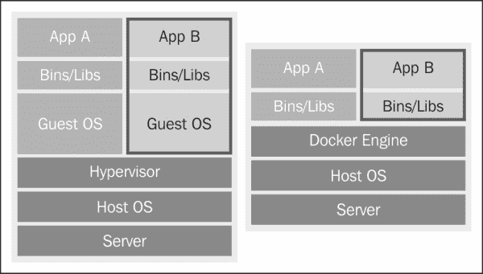
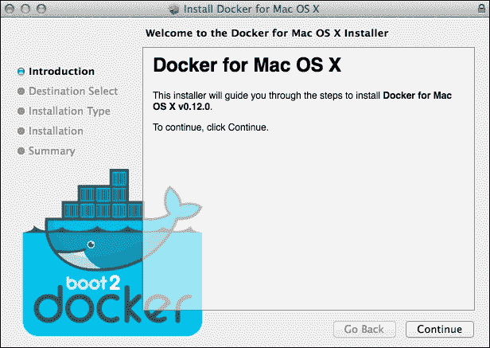

# 第一章。卸载坞站

**Docker** 是一种轻型集装箱化技术，近年来获得了广泛的普及。它使用大量的 Linux 内核特性，如名称空间、cgroups、AppArmor 配置文件等，将进程沙箱化到可配置的虚拟环境中。

在本章中，您将学习如何在开发和生产中的各种系统上安装 Docker。对于基于 Linux 的系统，由于内核已经可用，安装就像`apt-get install`或`yum install`命令一样简单。但是，要在非 Linux 操作系统(如 OSX 和 Windows)上运行 Docker，您需要安装一个由 Docker Inc .开发的助手应用，名为**bootwocker**。这个将在 **VirtualBox** 上安装一个轻量级 Linux VM，这将通过端口 2375 使 Docker 可用，端口 2375 由**互联网** **分配** **号** **权限** ( **IANA** )。

在本章的最后，您将在您的系统上安装 Docker，无论是在开发中还是在生产中，并对其进行验证。

本章将涵盖以下几点:

*   介绍 Docker
*   安装 Docker
*   Ubuntu (14.04 和 12.04)
*   Mac OSX 和 Windows
*   OpenStack
*   初始阶段:在 Docker 中构建 Docker
*   验证安装:`Hello` `World`输出
*   介绍 Docker

Docker 是由 DotCloud Inc .(目前是 Docker Inc .)开发的，作为框架，他们将他们的**平台** **构建为** **一个** **服务** ( **PaaS** )。当他们发现开发人员对这项技术越来越感兴趣时，他们将其作为开源发布，并宣布将完全专注于 Docker 技术的开发，这是一个好消息，因为这意味着对平台的持续支持和改进。

有许多工具和技术旨在使分布式应用成为可能，甚至易于设置，但没有一个像 Docker 一样具有广泛的吸引力，这主要是因为它的跨平台特性以及对系统管理员和开发人员的友好性。可以在任何操作系统中设置 Docker，无论是 Windows、OSX 还是 Linux，Docker 容器在任何地方都以相同的方式工作。这是非常强大的，因为它支持一次写入，随处运行的工作流。Docker 容器保证以相同的方式运行，无论是在您的开发桌面、裸机服务器、虚拟机、数据中心还是云上。不再有程序在开发人员的笔记本电脑上运行而不在服务器上运行的情况。

Docker 附带的工作流的本质是，开发人员可以完全专注于构建应用并让它们在容器内运行，而系统管理员可以在部署中运行容器。角色的分离和支持它的单一底层工具的存在简化了代码管理和部署过程。

但是虚拟机不是已经提供了所有这些功能吗？

**虚拟机** ( **虚拟机** ) 完全虚拟化。这意味着它们之间共享最少的资源，并且每个虚拟机都有自己的一组资源分配给它。虽然此允许对单个虚拟机进行细粒度配置，但最少的共享也会转化为更多的资源使用、冗余的运行进程(需要运行整个操作系统！)，因此会产生性能开销。

另一方面，Docker 建立在一种容器技术的基础上，这种技术隔离了一个进程，并使它相信自己正在独立的操作系统上运行。该进程仍然与其主机运行在同一个操作系统中，共享其内核。它使用一个分层的写时复制文件系统，称为**另一个** **Unionfs** ( **AUFS** )，在容器之间共享操作系统的公共部分。当然，更大程度的共享只能意味着更少的隔离，但 Linux 进程的资源管理解决方案(如名称空间和 cgroups)的巨大改进使 Docker 能够实现类似虚拟机的进程沙箱化，同时保持非常小的资源占用。

让我们看看下面的图片:



这是一个 Docker 与 VM 的比较。容器与其他容器和进程共享主机的资源，虚拟机必须为每个实例运行整个操作系统。

# 安装码头工人

docker可以在大多数主要 Linux 发行版的标准存储库中找到。我们将查看 Ubuntu 14.04 和 12.04 (Trusty 和 precision)、Mac OSX 和 Windows 中 Docker 的安装过程。如果您当前使用的是上面没有列出的操作系统，您可以在[https://docs.docker.com/installation/#installation](https://docs.docker.com/installation/#installation)查阅您的操作系统的说明。

## 在 Ubuntu 中安装 Docker

Docker 从 Ubuntu 12.04 开始就是 Ubuntu 支持的。记住你仍然需要一个 64 位操作系统来运行 Docker。让我们看看 Ubuntu 14.04 的安装说明。

### 在 LTS Ubuntu Trusty 14.04 安装 Docker

Docker 是 Ubuntu Trusty 发行版软件存储库中的一个软件包，名为`docker.io`:

```
$ sudo apt-get update
$ sudo apt-get -y install docker.io

```

就这样！您现在已经在系统上安装了 Docker。但是，由于该命令已被重命名为`docker.io`，您将不得不用`docker.io`而不是`docker`来运行所有 Docker 命令。

### 注

包被命名为`docker.io`，因为它与另一个名为`docker`的 KDE3/GNOME2 包冲突。如果你想以`docker`的身份运行命令，你可以创建一个到`/usr/local/bin`目录的符号链接。第二个命令向 bash 添加自动完成规则:

```
$ sudo ln -s /usr/bin/docker.io /usr/local/bin/docker
$ sudo sed -i '$acomplete -F _docker docker' \> /etc/bash_completion.d/docker.io
```

### 在乌班图精密 12.04 LTS 安装 Docker

Ubuntu 12.04 附带了一个较旧的内核(3.2)，它与 Docker 的一些依赖项不兼容。所以我们将不得不升级它:

```
$ sudo apt-get update
$ sudo apt-get -y install linux-image-generic-lts-raring linux-headers-generic-lts-raring
$ sudo reboot

```

我们刚刚安装的内核内置了 AUFS，这也是 Docker 的一个需求。

现在让我们总结一下安装过程:

```
$ curl -s https://get.docker.io/ubuntu/ | sudo sh

```

这是一个易于安装的`curl`脚本。查看该脚本的各个部分将使我们更好地理解该过程:

1.  首先，脚本检查我们的**高级**T5】包 **工具** ( **APT** )系统是否可以处理`https`URL，如果不能则安装【T1:

    ```
    # Check that HTTPS transport is available to APT
    if [ ! -e /usr/lib/apt/methods/https ]; then  apt-get update  apt-get install -y apt-transport-https
    fi

    ```

2.  Then it will add the Docker repository to our local key chain:

    ```
    $ sudo apt-key adv --keyserver hkp://keyserver.ubuntu.com:80 --recv-keys 36A1D7869245C8950F966E92D8576A8BA88D21E9

    ```

    ### 类型

    您可能会收到该包不可信的警告。回答`yes`继续安装。

3.  Finally, it adds the Docker repository to the APT sources list, and updates and installs the `lxc-docker` package:

    ```
    $ sudo sh -c "echo deb https://get.docker.io/ubuntu docker main\
    > /etc/apt/sources.list.d/docker.list"
    $ sudo apt-get update
    $ sudo apt-get install lxc-docker

    ```

    ### 注

    在 0.9 之前的 Docker 版本对 LXC (Linux 容器)有很强的依赖性，因此不能安装在 OpenVZ 上托管的虚拟机上。但是从 0.9 开始，执行驱动已经与 Docker 内核解耦，这使得我们可以使用众多隔离工具中的一种，比如 LXC、OpenVZ、systemd-nspawn、libvirt-lxc、libvirt-sandbox、qemu/kvm、BSD Jails、Solaris Zones，甚至 chroot！但是，默认情况下，它附带了 Docker 自己的容器化引擎的执行驱动程序，名为 l **ibcontainer** ，这是一个纯 Go 库，可以直接访问内核的容器 API，没有任何其他依赖关系。

    要使用任何其他集装箱化引擎，比如 LXC，可以使用-e 标志，比如:`$ docker -d -e lxc`。

    现在我们已经安装了 Docker，我们可以全速前进了！但是有一个问题:像 **APT** 这样的软件仓库通常都落后于时代，而且通常都有旧版本。Docker 是一个快速发展的项目，在过去的几个版本中发生了很多变化。所以总是建议安装最新版本。

## 升级码头工人

当 Docker 在 APT 存储库中更新时，您可以升级 Docker。另一种(也是更好的)方法是从源代码构建。这种方法的教程在标题为*初始:Docker 中的 Docker* 的部分。建议升级到最新的稳定版本，因为较新的版本可能包含关键的安全更新和错误修复。此外，本书中的例子假设 Docker 版本大于 1.0，而 Ubuntu 的标准存储库打包了一个旧得多的版本。

## Mac OSX 和 Windows

Docker 依赖于 Linux 内核，所以我们需要在一个 VM 中运行 Linux，并通过它安装和使用 Docker。Boot2Docker 是由 Docker Inc .构建的一个助手应用，它安装了一个包含专门为运行 Docker 容器而制作的轻量级 Linux 发行版的虚拟机。它还附带了一个客户端，提供了与 Docker 相同的**应用** **程序** **接口** ( **应用编程接口**，但与虚拟机中运行的`docker`守护程序接口，允许我们从 OSX/视窗终端运行命令。要安装 Boot2Docker，请执行以下步骤:

1.  从[http://boot2docker.io/](http://boot2docker.io/)下载最新版本的操作系统的 Boot2Docker。
2.  The installation image is shown as follows:

    

3.  运行安装程序，它将安装 VirtualBox 和 Boot2Docker 管理工具。

运行 Boot2docker。第一次运行将要求您提供一个**安全** **外壳** ( **SSH** )密钥密码。脚本的后续运行会将您连接到虚拟机中的 shell 会话。如果需要，后续运行将初始化一个新虚拟机并启动它。

或者，要运行 bootwocker，也可以使用终端命令`boot2docker`:

```
$ boot2docker init # First run
$ boot2docker start
$ export DOCKER_HOST=tcp://$(boot2docker ip 2>/dev/null):2375

```

你只有一次跑`boot2docker init`。它会要求您输入 SSH 密钥密码。该密码随后被`boot2docker ssh`用来验证 SSH 访问。

一旦你初始化了 Boot2Docker，你可以随后使用`boot2docker start`和`boot2docker stop`命令。

`DOCKER_HOST`是一个环境变量，设置后，向 Docker 客户端指示`docker`守护程序的位置。端口转发规则被设置为引导 2 时钟虚拟机的端口 2375(运行`docker`守护程序的地方)。您必须在您想要在 Docker 中使用的每个终端外壳中设置这个变量。

### 注

Bash 允许您通过将子命令包含在````或`$()`中来插入命令。这些将首先被评估，结果将在外部命令中被替换。

如果你是那种爱瞎逛的人，Boot2Docker 默认用户是`docker`，密码是`tcuser`。

boot2Docker 管理工具提供了几个命令:

```
$ boot2docker
Usage: boot2docker [<options>] {help|init|up|ssh|save|down|poweroff|reset|restart|config|status|info|ip|delete|download|version} [<args>]

```

使用 boot2Docker 时，`DOCKER_HOST`环境变量必须在终端会话中可用，Docker 命令才能工作。所以，如果你得到`Post http:///var/run/docker.sock/v1.12/containers/create: dial unix /var/run/docker.sock: no such file or directory`错误，这意味着环境变量没有被赋值。当你打开一个新的终端时，很容易忘记设置这个环境变量。对于 OSX 用户来说，为了让事情变得简单，请在您的`.bashrc`或`.bash_profile`外壳中添加以下行:

```
alias setdockerhost='export DOCKER_HOST=tcp://$(boot2docker ip 2>/dev/null):2375'

```

现在，每当你打开一个新的终端或者得到上面的错误，只要运行下面的命令:

```
$ setdockerhost

```


此图显示了当您登录到 Boot2Docker 虚拟机时终端屏幕的外观。

### 升级 boot 2 时钟

1.  从[http://boot2docker.io/](http://boot2docker.io/)下载最新版本的 OSX bootwocker 安装程序。
2.  运行安装程序，将更新 VirtualBox 和 Boot2Docker 管理工具。

要升级现有虚拟机，请打开终端并运行以下命令:

```
$ boot2docker stop
$ boot2docker download

```

# OpenStack

**OpenStack** 是一款免费开源软件，可以让设置云。主要用于部署公共和私有**基础设施** **作为** **a** **服务** ( **IaaS** )解决方案。它由一组相互关联的项目组成，用于云设置的不同组件，如计算调度器、钥匙串管理器、网络管理器、存储管理器、仪表板等。

Docker 可以充当 OpenStack Nova Compute 的虚拟机管理程序驱动程序。OpenStack 的 Docker 支持是随着 **Havana** 版本推出的。

但是...怎么做？

Nova 的 Docker 驱动程序嵌入了一个微型 HTTP 服务器，该服务器通过一个 **UNIX** **TCP** 套接字与 Docker 引擎的内部**具象**状态 T5】传输 ( **REST** ) API(稍后您会了解到更多这方面的信息)进行对话。

Docker 有自己的名为 Docker-Registry 的映像存储系统，可以将嵌入到 glass(OpenStack 的映像存储库)中，以推送和拉取 Docker 映像。Docker-Registry 既可以作为`docker`容器运行，也可以在独立模式下运行。

## 使用开发栈安装

如果您只是设置 OpenStack 并采用 DevStack 路线，那么配置设置使用 Docker 是非常容易的。

在运行开发栈路线的`stack.sh`脚本之前，在`localrc`文件中配置**虚拟** **驱动程序**选项以使用 Docker:

```
VIRT_DRIVER=docker

```

然后从`devstack`目录运行 Docker 安装脚本。该脚本需要`socat`实用程序(通常由`stack.sh`脚本安装)。如果您没有安装`socat`实用程序，请运行以下命令:

```
$ apt-get install socat
$ ./tools/docker/install_docker.sh

```

最后，从`devstack`目录运行`stack.sh`脚本:

```
$ ./stack.sh

```

## 手动安装 OpenStack 的 Docker

如果您已经设置了 OpenStack，或者如果 DevStack 方法没有成功，docker也可以手动安装:

1.  Firstly, install Docker according to one of the Docker installation procedures.

    如果您将`docker`注册表放在扫视服务旁边，请运行以下命令:

    ```
    $ sudo yum -y install docker-registry

    ```

    在`/etc/sysconfig/docker-registry`文件夹中，设置`REGISTRY_PORT`和`SETTINGS_FLAVOR`注册表如下:

    ```
    $ export SETTINGS_FLAVOR=openstack
    $ export REGISTRY_PORT=5042

    ```

    在`docker`注册表文件中，还需要指定 OpenStack 身份验证变量。以下命令可以实现这一点:

    ```
    $ source /root/keystonerc_admin
    $ export OS_GLANCE_URL=http://localhost:9292

    ```

    默认情况下，`/etc/docker-registry.yml`在`/tmp`下设置 openstack 配置的本地或备用`storage_path`路径。您可能希望将路径更改为更永久的位置:

    ```
    openstack:
     storage: glance
     storage_alternate: local
     storage_path: /var/lib/docker-registry

    ```

2.  为了让 **Nova** 通过其本地插座与 Docker 进行通信，请将`nova`添加到`docker`组，并重新启动`compute`服务以获取更改:

    ```
    $ usermod -G docker nova
    $ service openstack-nova-compute restart

    ```

3.  启动 Redis(由 Docker 注册表使用)，如果尚未启动:

    ```
    $ sudo service redis start
    $ sudo chkconfig redis on

    ```

4.  最后，启动注册表:

    ```
    $ sudo service docker-registry start
    $ sudo chkconfig docker-registry on

    ```

## 新星形态

Nova 需要配置为使用`virt` Docker 驱动程序。

根据以下选项编辑`/etc/nova/nova.conf`配置文件:

```
[DEFAULT]
compute_driver = docker.DockerDriver

```

或者，如果您想要使用您自己的 Docker-Registry，它在不同于 5042 的端口上监听，您可以覆盖以下选项:

```
docker_registry_default_port = 5042

```

## 扫视配置

扫视需要配置为支持 Docker 容器格式。只需将 Docker 添加到扫视配置文件的容器格式列表中:

```
[DEFAULT]
container_formats = ami,ari,aki,bare,ovf,docker

```

### 类型

保留默认格式，以免破坏现有的扫视安装。

## 坞站-开放叠流

一旦将 Nova 配置为使用`docker`驱动程序，流程与任何其他驱动程序相同:

```
$ docker search hipache
Found 3 results matching your query ("hipache")
NAME                             DESCRIPTION
samalba/hipache                  https://github.com/dotcloud/hipache

```

然后用 Docker-Registry 位置标记图像并推送:

```
$ docker pull samalba/hipache
$ docker tag samalba/hipache localhost:5042/hipache
$ docker push localhost:5042/hipache

```

推送指的是一个存储库:

```
[localhost:5042/hipache] (len: 1)
Sending image list
Pushing repository localhost:5042/hipache (1 tags)
Push 100% complete

```

在这种情况下，Docker-Registry(运行在端口映射为 5042 的 Docker 容器中)会将图像推送到 glass。从那里，Nova 可以到达他们，您可以使用扫视**命令** - **线** **界面** ( **CLI** )验证图像:

```
$ glance image-list

```

### 注

只有 docker 容器格式的映像才是可引导的。该图像基本上包含一个容器文件系统的 tarball。

您可以使用`nova` `boot`命令引导实例:

```
$ nova boot --image "docker-busybox:latest" --flavor m1.tiny test

```

### 类型

使用的命令将是图像中配置的命令。每个容器映像可以有一个为运行配置的命令。驱动程序不会覆盖此命令。

实例一旦启动，就会在`nova` `list`中列出:

```
$ nova list

```

您还可以在 Docker 中看到相应的容器:

```
$ docker ps

```

# 初始:在 Docker 中构建 Docker

虽然从标准存储库安装更容易，但它们通常包含旧版本，这意味着您可能会错过重要的更新或功能。保持更新的最好方法是定期从公共`GitHub`存储库中获取最新版本。传统上，从一个来源构建软件是痛苦的，并且只能由真正在项目中工作的人来完成。Docker 的情况并非如此。从 Docker 0.6 开始，在 Docker 中构建 Docker 已经成为可能。这意味着升级 Docker 就像在 Docker 本身构建一个新版本并替换二进制文件一样简单。让我们看看这是如何做到的。

## 依赖关系

您需要在 64 位 Linux 机器(虚拟机或裸机)中安装以下工具来构建 Docker:

*   **去**
*   **制作**

**Git** 是一个免费的和开源的分布式版本控制系统，旨在以速度和效率处理从小型到超大型的所有项目。这里使用它来克隆 Docker 公共源代码存储库。查看出[git-scm.org](http://git-scm.org)了解更多详情。

`make`实用程序是一个软件工程工具，用于管理和维护计算机程序。当程序由许多组件文件组成时， **Make** 提供了最大的帮助。这里使用一个`Makefile`文件来以可重复和一致的方式启动 Docker 容器。

## 从源头建造码头工人

为了在 Docker 中构建 Docker，我们将首先获取源代码，然后运行几个`make`命令，最终创建一个`docker`二进制文件，该文件将替换 Docker 安装路径中的当前二进制文件。

在您的终端中运行以下命令:

```
$ git clone https://git@github.com/dotcloud/docker

```

该命令将官方 Docker 源代码存储库从`Github`存储库克隆到名为`docker`的目录中:

```
$ cd docker
$ sudo make build

```

这将准备开发环境并安装创建二进制文件所需的所有依赖项。第一次跑步可能需要一些时间，所以你可以去喝杯咖啡。

### 类型

如果遇到自己觉得难以调试的错误，可以随时去 freenode IRC 上的`#docker`。开发人员和 Docker 社区非常有帮助。

现在，我们准备编译该二进制文件:

```
$ sudo make binary

```

这将编译一个二进制文件并将其放入`./bundles/<version>-dev/binary/`目录。瞧啊。你已经准备好了一个新版本的 Docker。

不过，在替换现有的二进制文件之前，请运行以下测试:

```
$ sudo make test

```

如果测试通过，那么用您刚刚编译的二进制文件替换您当前的二进制文件是安全的。停止`docker`服务，创建现有二进制文件的备份，然后将新烘焙的二进制文件复制到它的位置:

```
$ sudo service docker stop
$ alias wd='which docker'
$ sudo cp $(wd) $(wd)_
$ sudo cp $(pwd)/bundles/<version>-dev/binary/docker-<version>-dev $(wd)
$ sudo service docker start

```

恭喜你！您现在已经运行了最新版本的 Docker。

### 类型

OSX 和 Windows 用户可以遵循与 boot2Docker 虚拟机中 SSH 相同的过程。

# 验证安装

要验证安装是否成功，请在终端控制台中运行以下命令:

```
$ docker run -i -t ubuntu echo Hello World!

```

`docker` `run`命令启动一个带有`ubuntu`基本图像的容器。由于这是您第一次启动`ubuntu`容器，容器的输出将如下所示:

```
Unable to find image 'ubuntu' locally
Pulling repository ubuntu
e54ca5efa2e9: Download complete
511136ea3c5a: Download complete
d7ac5e4f1812: Download complete
2f4b4d6a4a06: Download complete
83ff768040a0: Download complete
6c37f792ddac: Download complete

Hello World!

```

当您发出`docker` `run` `ubuntu`命令时，Docker 会在本地查找`ubuntu`图像，如果没有找到，它会从公共`docker`注册表下载`ubuntu`图像。你还会看到它说**拉** **从属层**。

这意味着它正在下载文件系统层。默认情况下，Docker 使用 AUFS，一个分层的写时复制文件系统，这意味着容器映像的文件系统是多个只读文件系统层的顶点。这些层在运行的容器之间共享。如果您启动一个将写入该文件系统的操作，它将创建一个新的层，这将是底层层和新数据的区别。共享公共层意味着只有第一个容器将占用大量内存，而后续容器将占用少量内存，因为它们将共享只读层。这意味着，即使在一台功率相对较低的笔记本电脑上，您也可以运行数百个容器。


一旦图像被完全下载，它将启动容器，并在您的控制台中呼应`Hello` `World!`。这是 Docker 容器的另一个显著特征。每个容器都与一个命令相关联，它应该运行该命令。请记住，Docker 容器不同于虚拟机，因为它们不会虚拟化整个操作系统。每个`docker`容器只接受一个命令，并在隔离环境中的沙盒进程中运行它。

# 有用的提示

以下是两个有用的提示，可能会为你以后省去很多麻烦。第一个展示了如何给 docker 客户端非根访问权限，第二个展示了如何配置 Ubuntu 防火墙规则来启用转发网络流量。

### 注

如果您使用的是 Boot2Docker，则不需要遵循这些步骤。

## 给予非根用户访问权限

创建一个名为`docker`的组，并将您的用户添加到该组中，以避免必须为每个`docker`命令添加`sudo`前缀。默认情况下，您需要运行带有`sudo`前缀的`docker`命令的原因是`docker`守护程序需要以`root`权限运行，但是 docker 客户端(您运行的命令)不需要。因此，通过创建一个`docker`组，您可以在不使用`sudo`前缀的情况下运行所有客户端命令，而守护程序则以`root`权限运行:

```
$ sudo groupadd docker # Adds the docker group
$ sudo gpasswd -a $(whoami) docker # Adds the current user to the group
$ sudo service docker restart

```

为了使更改生效，您可能需要注销并再次登录。

## UFW 设置

Docker 使用桥来管理容器中的网络。**不复杂** **防火墙** ( **UFW** )是 Ubuntu 中默认的防火墙工具。它会丢弃所有转发流量。您需要像这样启用转发:

```
$ sudo vim /etc/default/ufw
# Change:
# DEFAULT_FORWARD_POLICY="DROP"
# to
DEFAULT_FORWARD_POLICY="ACCEPT"

```

通过运行以下命令重新加载防火墙:

```
$ sudo ufw reload

```

或者，如果您希望能够从其他主机到达您的容器，那么您应该在 docker 端口(`default` `2375`)上启用传入连接:

```
$ sudo ufw allow 2375/tcp

```

### 类型

**下载示例代码**

您可以从您在[http://www.packtpub.com](http://www.packtpub.com)的账户下载您购买的所有 Packt Publishing 书籍的示例代码文件。如果您在其他地方购买了这本书，您可以访问[http://www.packtpub.com/support](http://www.packtpub.com/support)并注册，以便将文件直接通过电子邮件发送给您

# 总结

我希望这一章能让你迷上 Docker。接下来的章节将带你进入码头工人的世界，并试图用它的惊人之处让你眼花缭乱。

在本章中，您学习了 Docker 的一些历史和一些基础知识，以及它是如何工作的。我们看到了它与虚拟机的区别和优势。

然后我们开始在我们的开发环境中安装 Docker，无论是 Ubuntu、Mac 还是 Windows。然后我们看到了如何用 Docker 替换 OpenStack 的虚拟机管理程序。后来，我们从源代码中构建了 Docker，在 Docker 内！说说吃自己的狗粮吧！

最后，我们下载了第一个图像，运行了第一个容器。现在，您可以拍拍自己的背，进入下一章，我们将深入介绍主要的 Docker 命令，并了解如何创建自己的图像。