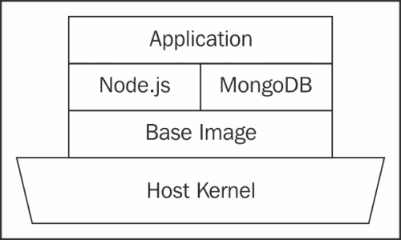
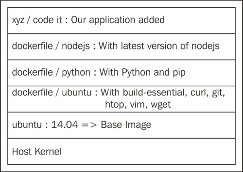
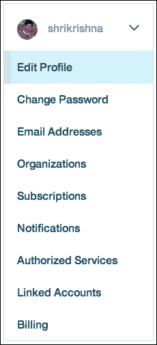
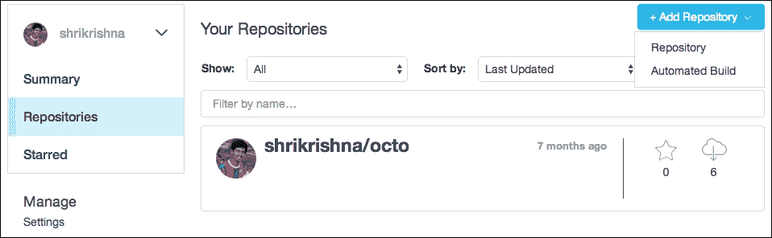
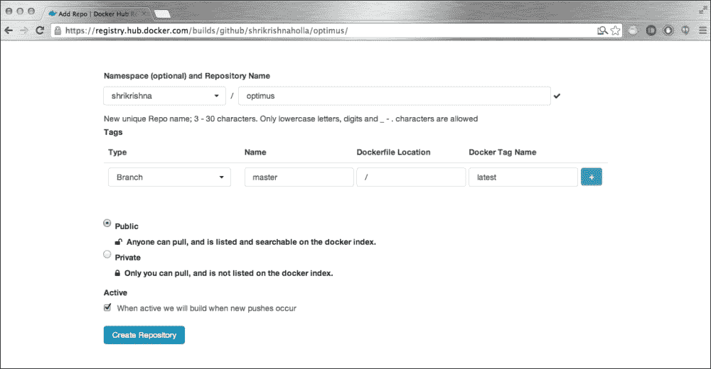
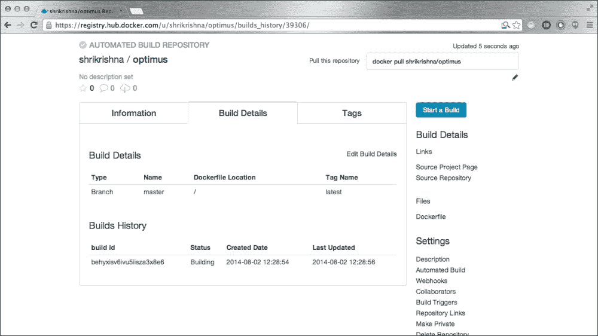
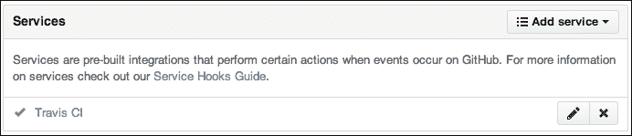
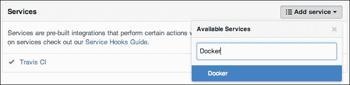

# 二、Docker CLI 和 Dockerfile

在最后一章中，我们在开发设置中设置了 Docker，并运行了第一个容器。在本章中，我们将探索 Docker 命令行界面。在本章的后面，我们将看到如何使用 Dockerfiles 创建我们自己的 Docker 映像，以及如何自动化这个过程。

在本章中，我们将涵盖以下主题:

*   Docker 术语
*   Docker 命令
*   Docker 文件
*   Docker 工作流—拉-用-修改-提交-推工作流
*   自动化构建

# Docker 术语

在我们开始进入 Docker 领域的激动人心的旅程之前，让我们更好地理解将在本书中使用的 Docker 术语。在概念上与虚拟机映像非常相似，Docker 映像是系统的快照。虚拟机映像和 Docker 映像之间的区别在于，虚拟机映像可以有正在运行的服务，而 Docker 映像只是一个文件系统快照，这意味着虽然您可以将映像配置为包含您喜欢的包，但您只能在容器中运行一个命令。不过，不要担心，因为限制是一个命令，而不是一个进程，所以有办法让 Docker 容器做几乎任何虚拟机实例可以做的事情。

Docker 还为 Docker 映像实现了一个类似 Git 的分布式版本管理系统。映像可以存储在本地和远程的存储库中(称为注册表)。功能和术语大量借用了 Git——快照被称为提交，你拉一个映像存储库，你把你的本地映像推到一个存储库，等等。

## Docker 容器

Docker 容器可以与虚拟机的实例相关联。它运行沙盒进程，这些进程与主机共享同一个内核。术语**容器**来源于海运容器的概念。这个想法是，您可以将容器从您的开发环境运送到部署环境，并且无论您在哪里运行它们，在容器中运行的应用都将以相同的方式运行。

下图显示了 AUFS 的图层:



这在上下文中类似于容器，容器在交付前保持密封，但可以在其间装载、卸载、堆叠和运输。

容器中进程的可见文件系统基于 AUFS(尽管您也可以将容器配置为使用不同的文件系统运行)。AUFS 是一个分层的文件系统。这些层都是只读的，这些层的合并对流程是可见的。但是，如果一个进程对文件系统进行了更改，则会创建一个新的层，表示原始状态和新状态之间的差异。当您使用此容器创建映像时，图层将被保留。因此，可以从现有映像构建新映像，从而创建非常方便的映像分层模型。

## 对接守护程式

`docker`守护进程是管理容器的进程。这很容易与 Docker 客户端混淆，因为相同的二进制文件用于运行两个进程。但是`docker`守护进程需要`root`权限，而客户端不需要。

不幸的是，由于`docker`守护进程以 root 权限运行，它还引入了攻击向量。阅读[https://docs.Docker.com/articles/security/](https://docs.Docker.com/articles/security/)了解更多详情。

## Docker 客户端

Docker 客户端是，它与`docker`守护进程交互来启动或管理容器。Docker 使用 RESTful API 在客户端和守护进程之间进行通信。

### 注

REST 是一种架构风格，由应用于分布式超媒体系统中的组件、连接器和数据元素的一组协调的架构约束组成。简单地说，RESTful 服务通过标准的 HTTP 方法工作，例如`GET`、`POST`、`PUT`和`DELETE`方法。

## Docker 型式

一个 Docker 文件是一个写在**域** **特定** **语言** ( **DSL** )中的文件，其中包含设置 Docker 映像的说明。把它想象成 Docker 的 Makefile 等价物。

## Docker 登记处

这是 Docker 社区发布的所有 Docker 映像的公共存储库。您可以从该注册表中自由拉取图片，但是要推送图片，您需要在[http://hub.docker.com](http://hub.docker.com)注册。Docker 注册中心和 Docker hub 是由 Docker Inc .运营和维护的服务，它们提供无限的免费存储库。您也可以付费购买私有存储库。

# Docker 命令

现在让我们在 Docker 命令行界面上动手吧。我们将看看最常见的命令及其用例。Docker 命令是以 Linux 和 Git 为模型的，所以如果你使用过这两个命令中的任何一个，你会发现自己就像在家里一样使用 Docker。

这里只提到最常用的选项。有关完整的参考，您可以在[https://docs.docker.com/reference/commandline/cli/](https://docs.docker.com/reference/commandline/cli/)查阅官方文件。

## 守护程序命令

如果您通过标准存储库安装了`docker`守护程序，启动`docker`守护程序的命令将被添加到`init`脚本中，以便在启动时作为服务自动启动。否则，您必须首先自己运行`docker`守护程序，客户端命令才能工作。

现在，当启动守护程序时，您可以使用控制**域** **名称** **系统** ( **DNS** )配置、存储驱动程序和容器的执行驱动程序的参数来运行它:

```
$ export DOCKER_HOST="tcp://0.0.0.0:2375"
$ Docker -d -D -e lxc -s btrfs –-dns 8.8.8.8 –-dns-search example.com

```

### 注

只有当您想自己启动守护进程时，您才需要这些。否则，可以用`$ sudo service Docker start`启动`docker`守护进程。对于 OSX 和 Windows，您需要运行[第 1 章](1.html "Chapter 1. Unboxing Docker")、*安装 Docker* 中提到的命令。

下表描述了各种标志:

<colgroup><col style="text-align: left"> <col style="text-align: left"></colgroup> 
| 

旗

 | 

说明

 |
| --- | --- |
| 

```
-d

```

 | 这将使 Docker 作为守护程序运行。 |
| 

```
-D

```

 | 这将在调试模式下运行 Docker。 |
| 

```
-e [option]

```

 | 这个是要使用的执行驱动。默认执行驱动是原生的，使用`libcontainer`。 |
| 

```
-s [option]

```

 | 这迫使 Docker 使用不同的存储驱动程序。默认值为“”，Docker 对此使用 AUFS。 |
| 

```
--dns [option(s)]

```

 | 此为所有 Docker 容器设置 DNS 服务器(或多个服务器)。 |
| 

```
--dns-search [option(s)]

```

 | 这将为所有 Docker 容器设置域名系统搜索域。 |
| 

```
-H [option(s)]

```

 | 这个就是要绑定的插座。可以是`tcp://host:port, unix:///path/to/socket, fd://* or fd://socketfd`中的一个或多个。 |

如果多个`docker`守护程序同时运行，客户端将接受`DOCKER_HOST`参数设置的值。你也可以用`-H`标志让它连接到一个特定的守护进程。

考虑这个命令:

```
$ docker -H tcp://0.0.0.0:2375 run -it ubuntu /bin/bash

```

前面的命令与下面的命令相同:

```
$ DOCKER_HOST="tcp://0.0.0.0:2375" docker run -it ubuntu /bin/bash

```

## 版本命令

`version`命令打印出版本信息:

```
$ docker -vDocker version 1.1.1, build bd609d2

```

## 信息命令

`info`命令打印`docker`守护程序配置的详细信息，例如执行驱动程序、正在使用的存储驱动程序等:

```
$ docker info # The author is running it in boot2docker on OSX
Containers: 0
Images: 0
Storage Driver: aufs
 Root Dir: /mnt/sda1/var/lib/docker/aufs
 Dirs: 0
Execution Driver: native-0.2
Kernel Version: 3.15.3-tinycore64
Debug mode (server): true
Debug mode (client): false
Fds: 10
Goroutines: 10
EventsListeners: 0
Init Path: /usr/local/bin/docker
Sockets: [unix:///var/run/docker.sock tcp://0.0.0.0:2375]

```

## 运行命令

运行命令是我们最常使用的命令。它用于运行 Docker 容器:

```
$ docker run [options] IMAGE [command] [args]

```

<colgroup><col style="text-align: left"> <col style="text-align: left"></colgroup> 
| 

旗帜

 | 

说明

 |
| --- | --- |
| 

```
-a, --attach=[]

```

 | 将附加到`stdin``stdout`或`stderr`文件(标准输入、输出和错误文件)。). |
| 

```
-d, --detach

```

 | 这个在后台运行容器。 |
| 

```
-i, --interactive

```

 | 这个在交互模式下运行容器(保持`stdin`文件打开)。 |
| 

```
-t, --tty

```

 | 这个分配给一个伪`tty`标志(如果你想连接到容器 Docker，这是必需的)。 |
| 

```
-p, --publish=[]

```

 | 这个向主机(`ip:hostport:containerport`)发布一个容器的港口。 |
| 

```
--rm

```

 | 该在退出时自动移除容器(不能与`-d`标志一起使用)。 |
| 

```
--privileged

```

 | 这给了这个容器额外的权限。 |
| 

```
-v, --volume=[]

```

 | 此绑定坐骑一卷(来自>=`/host:/container`；from docker = > `/container`)。 |
| 

```
--volumes-from=[]

```

 | 这从指定的容器装载体积。 |
| 

```
-w, --workdir=""

```

 | 这个就是容器内部的工作目录。 |
| 

```
--name=""

```

 | 这给容器指定一个名称。 |
| 

```
-h, --hostname=""

```

 | 这个给容器分配一个主机名。 |
| 

```
-u, --user=""

```

 | 这个是容器应该运行的用户名或 UID。 |
| 

```
-e, --env=[]

```

 | 这个设置环境变量。 |
| 

```
--env-file=[]

```

 | 这个从一个新的行分隔文件中读取环境变量。 |
| 

```
--dns=[]

```

 | 这将设置自定义 DNS 服务器。 |
| 

```
--dns-search=[]

```

 | 此设置自定义 DNS 搜索域。 |
| 

```
--link=[]

```

 | 此添加到另一个容器(`name:alias`)的链接。 |
| 

```
-c, --cpu-shares=0

```

 | 这个是这个容器的相对 CPU 份额。 |
| 

```
--cpuset=""

```

 | 这些是允许执行的 CPUs 从 0 开始。(例如，0 到 3)。 |
| 

```
-m, --memory=""

```

 | 这个是这个容器`(<number><b&#124;k&#124;m&#124;g>`的内存限制。 |
| 

```
--restart=""

```

 | (v1.2+)这个指定了容器崩溃时的重启策略。 |
| 

```
--cap-add=""

```

 | (v1.2+)此向容器授予能力(参考[第 4 章](4.html "Chapter 4. Automation and Best Practices")、*安全最佳实践*)。 |
| 

```
--cap-drop=""

```

 | (v1.2+)此将能力列入容器黑名单(参考[第 4 章](4.html "Chapter 4. Automation and Best Practices")、*安全最佳实践*)。 |
| 

```
--device=""

```

 | (v1.2+)此将设备安装在容器上。 |

当运行一个容器时，重要的是要记住，容器的生存期与您启动容器时运行的命令的生存期相关联。现在试着运行这个:

```
$ docker run -dt ubuntu ps
b1d037dfcff6b076bde360070d3af0d019269e44929df61c93dfcdfaf29492c9
$ docker attach b1d037
2014/07/16 16:01:29 You cannot attach to a stopped container, start it first

```

这里发生了什么？当我们运行简单命令`ps`时，容器运行该命令并退出。因此，我们得到了一个错误。

### 注

`attach`命令将标准输入和输出附加到运行的容器。

这里的另一个重要信息是，对于所有需要容器标识的命令，您不需要使用整个 64 个字符的标识。前几个字符就足够了。下面的代码显示了相同的示例:

```
$ docker attach b1d03
2014/07/16 16:09:39 You cannot attach to a stopped container, start it first
$ docker attach b1d0
2014/07/16 16:09:40 You cannot attach to a stopped container, start it first
$ docker attach b1d
2014/07/16 16:09:42 You cannot attach to a stopped container, start it first
$ docker attach b1
2014/07/16 16:09:44 You cannot attach to a stopped container, start it first
$ docker attach b
2014/07/16 16:09:45 Error: No such container: b

```

更方便的方法是自己给容器命名:

```
$ docker run -dit --name OD-name-example ubuntu /bin/bash
1b21af96c38836df8a809049fb3a040db571cc0cef000a54ebce978c1b5567ea
$ docker attach OD-name-example
root@1b21af96c388:/#

```

`-i`标志对于容器中的任何类型的交互都是必需的，而`-t`标志对于创建伪终端是必需的。

前面的例子也让我们意识到了一个事实，即使我们退出了一个容器，它仍然处于`stopped`状态。也就是说，我们将能够再次启动容器，保留其文件系统层。您可以通过运行以下命令看到这一点:

```
$ docker ps -a
CONTAINER ID IMAGE         COMMAND CREATED    STATUS    NAMES
eb424f5a9d3f ubuntu:latest ps      1 hour ago Exited OD-name-example 

```

虽然这可能很方便，但随着越来越多的容器被保存下来，您可能很快就会耗尽主机的磁盘空间。因此，如果您要运行一次性容器，您可以使用`–-rm`标志运行它，该标志将在进程退出时移除容器:

```
$ docker run --rm -it --name OD-rm-example ubuntu /bin/bash
root@0fc99b2e35fb:/# exit
exit
$ docker ps -a
CONTAINER ID    IMAGE    COMMAND    CREATED    STATUS   PORTS   NAMES

```

### 运行服务器

现在，对于我们的下一个例子，我们将尝试运行一个网络服务器。选择这个例子是因为 Docker 容器最常见的实际用例是 web 应用的运输:

```
$ docker run -it –-name OD-pythonserver-1 --rm python:2.7 \
python -m SimpleHTTPServer 8000;
Serving HTTP on 0.0.0.0 port 8000

```

现在我们知道问题了；我们有一个在容器中运行的服务器，但是由于容器的 IP 是由 Docker 动态分配的，这使得事情变得困难。但是，我们可以将容器的端口绑定到主机的端口，Docker 将负责转发网络流量。现在让我们用`-p`标志再次尝试这个命令:

```
$ docker run -p 0.0.0.0:8000:8000 -it --rm –-name OD-pythonserver-2 \ python:2.7 python -m SimpleHTTPServer 8000;
Serving HTTP on 0.0.0.0 port 8000 ...
172.17.42.1 - - [18/Jul/2014 14:25:46] "GET / HTTP/1.1" 200 -

```

现在打开浏览器，进入`http://localhost:8000`。瞧！

如果您是 OS X 用户，并且您意识到自己无法访问`http://localhost:8000`，这是因为 VirtualBox 尚未配置为响应**网络地址转换** ( **NAT** )对 boot2Docker VM 的请求。向别名文件(`bash_profile`或)添加以下功能。`bashrc`)会省去很多麻烦:

```
natboot2docker () { VBoxManage controlvm boot2docker-vm natpf1 \
   "$1,tcp,127.0.0.1,$2,,$3"; }

removeDockerNat() {
    VBoxManage modifyvm boot2docker-vm \
    --natpf1 delete $1;
}
```

之后，您应该可以使用`$ natboot2docker mypythonserver 8000 8000`命令访问 Python 服务器。但是完成后记得运行`$ removeDockerDockerNat mypythonserver`命令。否则，当您下次运行 boot2Docker 虚拟机时，您将面临一个不允许您获取 IP 地址或`ssh`脚本的错误:

```
$ boot2docker ssh
ssh_exchange_identification: Connection closed by remote host
2014/07/19 11:55:09 exit status 255

```

您的浏览器现在显示容器的`/root`路径。如果你想为你的主机目录服务呢？让我们尝试安装一个设备:

```
root@eb53f7ec79fd:/# mount -t tmpfs /dev/random /mnt
mount: permission denied

```

如您所见，`mount`命令不起作用。事实上，大多数潜在危险的内核功能都会被丢弃，除非您包含`--privileged`标志。

然而，除非你知道自己在做什么，否则你永远不应该使用这面旗帜。Docker 提供了一种更简单的方法来绑定装载主机卷，并使用`-v`和`–volumes`选项绑定装载主机卷。让我们在当前目录中再次尝试这个示例:

```
$ docker run -v $(pwd):$(pwd) -p 0.0.0.0:8000:8000 -it –rm \
--name OD-pythonserver-3 python:2.7 python -m SimpleHTTPServer 8000;
Serving HTTP on 0.0.0.0 port 8000 ...
10.0.2.2 - - [18/Jul/2014 14:40:35] "GET / HTTP/1.1" 200 -

```

现在，您已经将运行命令的目录绑定到容器。但是，当您访问容器时，您仍然会得到容器根目录的目录列表。为了服务已经绑定到容器的目录，让我们使用`-w`标志将其设置为容器的工作目录(容器化进程运行的目录):

```
$ docker run -v $(pwd):$(pwd) -w $(pwd) -p 0.0.0.0:8000:8000 -it \ --name OD-pythonserver-4 python:2.7 python -m SimpleHTTPServer 8000;
Serving HTTP on 0.0.0.0 port 8000 ...
10.0.2.2 - - [18/Jul/2014 14:51:35] "GET / HTTP/1.1" 200 -

```

### 注

Boot2Docker 用户还不能使用这个，除非你使用 guest 插件并设置共享文件夹，其指南可以在[https://medium . com/boot 2 docker-轻量级-Linux-for docker/boot 2 docker-with-virtualbox-guest-additions-da1e 3a b 2465 c](https://medium.com/boot2docker-lightweight-linux-for-docker/boot2docker-together-with-virtualbox-guest-additions-da1e3ab2465c)找到。虽然这个解决方案有效，但它是一个黑客，不建议使用。与此同时，Docker 社区正在积极尝试寻找解决方案(查看 boot2Docker GitHub 存储库中的问题`#64`和 Docker 存储库中的`#4023`)。

现在`http://localhost:8000`将服务于您当前运行的目录，但是来自 Docker 容器。不过要小心，因为您所做的任何更改也会写入主机的文件系统。

### 类型

从 v1.1.1 开始，可以使用`$ docker run -v /:/my_host:ro ubuntu ls /my_host`将主机的挂载根绑定到一个容器上，但是禁止在容器的`/`路径上挂载。

该卷可选地以`:ro`或`:rw`命令作为后缀，以分别以只读或读写模式装载卷。默认情况下，卷以与主机中相同的模式(读写或只读)装载。

该选项主要用于装载静态资产和写入日志。

但是如果我想安装一个外部设备呢？

在 v1.2 之前，您必须在主机中装载设备，并使用权限容器中的`-v`标志绑定装载，但是 v1.2 增加了一个`--device`标志，您可以使用它来装载设备，而无需使用`--privileged`标志。

例如，要使用容器中的网络摄像头，请运行以下命令:

```
$ docker run --device=/dev/video0:/dev/video0

```

Docker v1.2 还添加了一个`--restart`标志来指定容器的重启策略。目前，有三种重启策略:

*   `no`:如果容器死亡，不要重启(默认)。
*   `on-failure`:如果容器以非零退出代码退出，则重新启动容器。它还可以接受可选的最大重启次数(例如，`on-failure:5`)。
*   `always`:无论返回什么退出代码，都要重启容器。

下面是一个无休止重启的例子:

```
$ docker run --restart=always code.it

```

下一行用来在放弃之前尝试五次:

```
$ docker run --restart=on-failure:5 code.it

```

## 搜索命令

`search`命令允许我们在公共注册表中搜索 Docker 映像。让我们搜索所有与 Python 相关的映像:

```
$ docker search python | less

```

## 拉动命令

`pull`命令用于从注册表中提取映像或存储库。默认情况下，它从公共 Docker 注册表中提取它们，但是如果您正在运行自己的注册表，您也可以从中提取它们:

```
$ docker pull python # pulls repository from Docker Hub
$ docker pull python:2.7 # pulls the image tagged 2.7
$ docker pull <path_to_registry>/<image_or_repository>

```

## 启动命令

我们在讨论`docker run`时看到，容器状态在退出时被保留，除非它被明确移除。`docker start`命令启动停止的容器:

```
$ docker start [-i] [-a] <container(s)>

```

考虑以下`start`命令的例子:

```
$ docker ps -a
CONTAINER ID IMAGE         COMMAND   CREATED STATUS    NAMES
e3c4b6b39cff ubuntu:latest python -m 1h ago  Exited OD-pythonserver-4 
81bb2a92ab0c ubuntu:latest /bin/bash 1h ago  Exited evil_rosalind 
d52fef570d6e ubuntu:latest /bin/bash 1h ago  Exited prickly_morse 
eb424f5a9d3f ubuntu:latest /bin/bash 20h ago Exited OD-name-example
$ docker start -ai OD-pythonserver-4
Serving HTTP on 0.0.0.0 port 8000 

```

选项的含义与`docker run`命令相同。

## 停止命令

`stop`命令通过发送`SIGTERM`信号来停止正在运行的容器，然后在宽限期后发送`SIGKILL`信号:

### 注

`SIGTERM`和`SIGKILL`是 Unix 信号。信号是一种进程间通信的形式，用于 Unix、类 Unix 和其他符合 POSIX 的操作系统。`SIGTERM`发出终止进程的信号。`SIGKILL`信号用于强行杀死一个进程。

```
docker run -dit --name OD-stop-example ubuntu /bin/bash
$ docker ps
CONTAINER ID IMAGE         COMMAND   CREATED  STATUS    NAMES
679ece6f2a11 ubuntu:latest /bin/bash 5h ago   Up 3s   OD-stop-example
$ docker stop OD-stop-example
OD-stop-example
$ docker ps
CONTAINER ID IMAGE         COMMAND   CREATED  STATUS    NAMES

```

您也可以指定`-t`标志或`--time`标志，可以设置等待时间。

## 重启命令

`restart`命令重启正在运行的容器:

```
$ docker run -dit --name OD-restart-example ubuntu /bin/bash
$ sleep 15s # Suspends execution for 15 seconds
$ docker ps
CONTAINER ID IMAGE         COMMAND   STATUS    NAMES
cc5d0ae0b599 ubuntu:latest /bin/bash Up 20s    OD-restart-example

$ docker restart OD-restart-example
$ docker ps
CONTAINER ID IMAGE         COMMAND   STATUS    NAMES
cc5d0ae0b599 ubuntu:latest /bin/bash Up 2s    OD-restart-example

```

如果观察状态，您会注意到容器已重新启动。

## RM 命令

`rm`命令移除 Docker 容器:

```
$ Docker ps -a # Lists containers including stopped ones
CONTAINER ID  IMAGE  COMMAND   CREATED  STATUS NAMES
cc5d0ae0b599  ubuntu /bin/bash 6h ago   Exited OD-restart-example 
679ece6f2a11  ubuntu /bin/bash 7h ago   Exited OD-stop-example 
e3c4b6b39cff  ubuntu /bin/bash 9h ago   Exited OD-name-example 

```

我们似乎在冒险之后剩下了很多容器。让我们删除其中一个:

```
$ dockerDocker rm OD-restart-example
cc5d0ae0b599

```

我们可以也可以组合两个 Docker 命令。让我们将打印`docker ps -a`中容器的标识参数的`docker ps -a -q`命令和`docker rm`命令结合起来，一次性移除所有容器:

```
$ docker rm $(docker ps -a -q)
679ece6f2a11
e3c4b6b39cff
$ docker ps -a
CONTAINER ID    IMAGE    COMMAND     CREATED    STATUS      NAMES

```

这首先评估`docker ps -a -q`命令，输出由`docker rm`命令使用。

## PS 命令

`ps`命令用于列出容器。它的使用方式如下:

```
$ docker ps [option(s)]

```

<colgroup><col style="text-align: left"> <col style="text-align: left"></colgroup> 
| 

旗

 | 

说明

 |
| --- | --- |
| 

```
-a, --all

```

 | 该显示所有容器，包括停止的容器。 |
| 

```
-q, --quiet

```

 | 该仅显示容器标识参数。 |
| 

```
-s, --size

```

 | 这个打印容器的尺寸。 |
| 

```
-l, --latest

```

 | 这个只显示最新的容器(包括停止的容器)。 |
| 

```
-n=""

```

 | 此显示最后一个 *n* 容器(包括停止的容器)。它的默认值是-1。 |
| 

```
--before=""

```

 | 此显示在指定的 ID 或名称之前创建的容器。它包括停止的容器。 |
| 

```
--after=""

```

 | 此显示在指定的 ID 或名称后创建的容器。它包括停止的容器。 |

默认情况下，`docker ps`命令将只显示正在运行的容器。要查看所有容器，运行`docker ps -a`命令。要仅查看容器标识参数，请使用`-q`标志运行它。

## 日志命令

`logs`命令显示容器的日志:

```
Let us look at the logs of the python server we have been running
$ docker logs OD-pythonserver-4
Serving HTTP on 0.0.0.0 port 8000 ...
10.0.2.2 - - [18/Jul/2014 15:06:39] "GET / HTTP/1.1" 200 -
^CTraceback (most recent call last):
 File ...
 ...
KeyboardInterrupt

```

您还可以提供一个`--tail`参数来跟踪容器运行时的输出。

## 检查命令

`inspect`命令允许你获得一个容器或映像的细节。它以 JSON 数组的形式返回这些细节:

```
$ Docker inspect ubuntu # Running on an image
[{
 "Architecture": "amd64",
 "Author": "",
 "Comment": "",
 .......
 .......
 .......
 "DockerVersion": "0.10.0",
 "Id": "e54ca5efa2e962582a223ca9810f7f1b62ea9b5c3975d14a5da79d3bf6020f37",
 "Os": "linux",
 "Parent": "6c37f792ddacad573016e6aea7fc9fb377127b4767ce6104c9f869314a12041e",
 "Size": 178365
}]

```

同样，对于一个容器，我们运行以下命令:

```
$ Docker inspect OD-pythonserver-4 # Running on a container
[{
 "Args": [
 "-m",
 "SimpleHTTPServer",
 "8000"
 ],
 ......
 ......
 "Name": "/OD-pythonserver-4",
 "NetworkSettings": {
 "Bridge": "Docker0",
 "Gateway": "172.17.42.1",
 "IPAddress": "172.17.0.11",
 "IPPrefixLen": 16,
 "PortMapping": null,
 "Ports": {
 "8000/tcp": [
 {
 "HostIp": "0.0.0.0",
 "HostPort": "8000"
 }
 ]
 }
 },
 ......
 ......
 "Volumes": {
 "/home/Docker": "/home/Docker"
 },
 "VolumesRW": {
 "/home/Docker": true
 }
}]

```

Docker inspect 提供关于容器或映像的所有低级信息。在前面的示例中，找出容器的 IP 地址和暴露的端口，并向`IP:port`发出请求。您将看到您正在直接访问运行在容器中的服务器。

然而，手动查看整个 JSON 数组并不是最佳选择。所以`inspect`命令提供了一个标志，`-f`(或`--follow`标志)，它允许你使用`Go`模板来指定你想要的。例如，如果您只想获取容器的 IP 地址，请运行以下命令:

```
$ docker inspect -f  '{{.NetworkSettings.IPAddress}}' \
OD-pythonserver-4;
172.17.0.11

```

`{{.NetworkSettings.IPAddress}}`是在 JSON 结果上执行的`Go`模板。`Go`模板非常强大，您可以使用它们做的一些事情已经在[http://golang.org/pkg/text/template/](http://golang.org/pkg/text/template/)列出。

## 最高命令

`top`命令显示容器中正在运行的进程及其统计数据，类似于 Unix `top`命令。

让我们下载并运行`ghost`博客平台，并查看其中运行的进程:

```
$ docker run -d -p 4000:2368 --name OD-ghost dockerfile/ghost
ece88c79b0793b0a49e3d23e2b0b8e75d89c519e5987172951ea8d30d96a2936

$ docker top OD-ghost-1
PID                 USER                COMMAND
1162                root                bash /ghost-start
1180                root                npm
1186                root                sh -c node index
1187                root                node index

```

没错。我们刚刚建立了自己的博客，只有一个命令。这带来了另一个微妙的优势，并显示了未来的趋势。每个通过 TCP 端口公开其服务的工具现在都可以被容器化，并在自己的沙盒世界中运行。您所需要做的就是公开它的端口，并将其绑定到您的主机端口。您不需要担心安装、依赖性、不兼容性等问题，卸载将是干净的，因为您只需要停止所有容器并删除映像。

### 注

Ghost 是一个开放源码发布平台，设计精美，使用方便，对所有人都是免费的。它是用 Node.js 编码的，node . js 是一个服务器端的 JavaScript 执行引擎。

## 附加命令

`attach`命令连接到一个正在运行的容器。

让我们用 Node.js 启动一个容器，将 node interactive shell 作为守护程序运行，然后附加到它上面。

### 注

Node.js 是一个事件驱动的异步 I/O web 框架，它在谷歌的 V8 运行时环境中运行用 JavaScript 编写的应用。

带有 Node.js 的容器如下:

```
$ docker run -dit --name OD-nodejs shykes/nodejs node
8e0da647200efe33a9dd53d45ea38e3af3892b04aa8b7a6e167b3c093e522754

$ docker attach OD-nodejs
console.log('Docker rocks!');Docker rocks!

```

## 击杀命令

`kill`命令杀死一个容器，并向容器中运行的进程发送`SIGTERM`信号:

```
Let us kill the container running the ghost blog.
$ docker kill OD-ghost-1
OD-ghost-1

$ docker attach OD-ghost-1 # Verification
2014/07/19 18:12:51 You cannot attach to a stopped container, start it first

```

## CP 命令

`cp`命令将文件或文件夹从容器的文件系统复制到主机路径。路径是相对于文件系统的根目录的。

是时候找点乐子了。首先，让我们用`/bin/bash`命令运行一个 Ubuntu 容器:

```
$ docker run -it –name OD-cp-bell ubuntu /bin/bash

```

现在，在容器内，让我们创建一个具有特殊名称的文件:

```
# touch $(echo -e '\007')

```

`\007`字符是一个 ASCII `BEL`字符，当打印在终端上时会响起系统铃声。你可能已经猜到我们要做什么了。因此，让我们打开一个新的终端，并执行以下命令将这个新创建的文件复制到主机:

```
$ docker cp OD-cp-bell:/$(echo -e '\007') $(pwd)

```

### 类型

要使`docker cp`命令起作用，容器路径和主机路径都必须完整，因此不要使用`.`、`,`、`*`等快捷方式。

因此，我们在一个容器中创建了一个文件名为`BEL`字符的空文件。然后，我们将文件复制到主机容器中的当前目录。只剩下最后一步了。在执行`docker cp`命令的主机选项卡中，运行以下命令:

```
$ echo *

```

你会听到系统铃声！我们可以将容器中的任何文件或目录复制到主机。但是找点乐子也无妨！

### 注

如果你觉得这很有趣，你可能会喜欢阅读[http://www . dwheeler . com/esses/fixing-UNIX-Linux-filename . html](http://www.dwheeler.com/essays/fixing-unix-linux-filenames.html)。这是一篇很棒的文章，讨论了文件名中的边缘情况，这可能会在程序中引起简单到复杂的问题。

## 港口命令

`port`命令查找面向公众的端口，该端口绑定到容器中的一个暴露端口:

```
$ docker port CONTAINER PRIVATE_PORT
$ docker port OD-ghost 2368
4000

```

Ghost 在`2368`端口运行一个服务器，允许你写和发布博客文章。在`top`命令的示例中，我们将主机端口绑定到`OD-ghost`容器的端口`2368`。

# 运行自己的项目

到目前为止，我们已经相当熟悉基本的 Docker 命令。让我们加大赌注。对于接下来的几个命令，我将使用我的一个辅助项目。随意使用自己的项目。

让我们首先列出我们的需求，以确定我们必须传递给`docker run`命令的参数。

我们的应用将在 Node.js 上运行，因此我们将选择维护良好的`dockerfile/nodejs`映像来启动我们的基本容器:

*   我们知道我们的应用将绑定到端口`8000`，所以我们将该端口暴露给主机的`8000`。
*   我们需要给容器一个描述性的名称，这样我们就可以在以后的命令中引用它。在这种情况下，让我们选择应用的名称:

```
$ docker run -it --name code.it dockerfile/nodejs /bin/bash
[ root@3b0d5a04cdcd:/data ]$ cd /home
[ root@3b0d5a04cdcd:/home ]$

```

启动容器后，您需要检查应用的依赖项是否已经可用。在我们的例子中，我们只需要 Git(除了 Node.js)，它已经安装在`dockerfile/nodejs`映像中。

现在我们的容器已经准备好运行我们的应用了，剩下的就是我们获取源代码并进行必要的设置来运行应用:

```
$ git clone https://github.com/shrikrishnaholla/code.it.git
$ cd code.it && git submodule update --init --recursive

```

这将下载应用中使用的插件的源代码。

然后运行以下命令:

```
$ npm install

```

现在，运行应用所需的所有节点模块都已安装。

接下来，运行以下命令:

```
$ node app.js

```

现在你可以去`localhost:8000`使用应用了。

## 差异命令

`diff`命令显示容器和它所基于的映像之间的差异。在这个例子中，我们正在运行一个带有`code.it`的容器。在单独的选项卡中，运行以下命令:

```
$ docker diff code.it
C /home
A /home/code.it
...

```

## 提交命令

`commit`命令用容器的文件系统创建一个新的映像。就像 Git 的`commit`命令一样，您可以设置一个描述映像的提交消息:

```
$ docker commit [OPTIONS] CONTAINER [REPOSITORY[:TAG]]

```

<colgroup><col style="text-align: left"> <col style="text-align: left"></colgroup> 
| 

旗

 | 

说明

 |
| --- | --- |
| 

```
-p, --pause

```

 | 该在提交期间暂停容器(从 v1.1.1+开始可用)。 |
| 

```
-m, --message=""

```

 | 这是提交消息。它可以是映像功能的描述。 |
| 

```
-a, --author=""

```

 | 此显示作者详情。 |

例如，让我们使用这个命令来提交我们设置的容器:

```
$ docker commit -m "Code.it – A browser based text editor and interpreter" -a "Shrikrishna Holla <s**a@gmail.com>" code.it shrikrishna/code.it:v1

```

### 类型

如果要复制这些示例，请替换本示例中的作者详细信息和映像名称的用户名部分。

输出将是一个冗长的映像标识。如果你仔细看这个命令，我们已经把这个映像命名为`shrikrishna/code.it:v1`。这是一个惯例。映像/存储库名称的第一部分(正斜杠之前)是作者的 Docker Hub 用户名。第二部分是预期应用或映像名称。第三部分是一个标签(通常是版本描述)，用冒号与第二部分分开。

### 注

`Docker` `Hub`是由 Docker，Inc .维护的公共注册表。它托管公共 Docker 映像，并提供服务来帮助您构建和管理您的 Docker 环境。更多细节可以在[https://hub.docker.com](https://hub.docker.com)找到。

标记有不同版本的映像集合就是一个存储库。您通过运行`docker commit`命令创建的映像将是本地映像，这意味着您可以从该映像运行容器，但不能公开使用。要将其公开或推送到您的私有 Docker 注册表，请使用`docker push`命令。

## 映像命令

`images`命令列出了系统中的所有映像:

```
$ docker images [OPTIONS] [NAME]

```

<colgroup><col style="text-align: left"> <col style="text-align: left"></colgroup> 
| 

旗

 | 

说明

 |
| --- | --- |
| 

```
-a, --all

```

 | 此显示所有映像，包括中间层。 |
| 

```
-f, --filter=[]

```

 | 该提供过滤值。 |
| 

```
--no-trunc

```

 | 这个不截断输出(显示完整的 ID)。 |
| 

```
-q, --quiet

```

 | 这个只显示映像标识。 |

现在我们来看几个`image`命令用法的例子:

```
$ docker images
REPOSITORY           TAG   IMAGE ID       CREATED    VIRTUAL SIZE
shrikrishna/code.it  v1    a7cb6737a2f6   6m ago     704.4 MB

```

这将列出所有顶级映像、它们的存储库和标签以及它们的虚拟大小。

Docker 映像只不过是只读文件系统层的栈。联合文件系统，如 AUFS，然后合并这些层，它们看起来是一个文件系统。

在 Docker-speak 中，只读层是一个映像。它从未改变。当运行容器时，进程认为整个文件系统是读写的。但是更改只在最上面的可写层进行，这是在容器启动时创建的。映像的只读层保持不变。当你提交一个容器时，它会冻结顶部层(下面的层已经被冻结)，并将其变成一个映像。现在，当一个容器启动这个映像时，映像的所有层(包括以前可写的层)都是只读的。所有更改现在都在所有底层之上的新可写层上进行。然而，由于联合文件系统(如 AUFS)的工作方式，进程认为文件系统是读写的。

我们的`code.it`示例中涉及的图层的大致示意图如下:



### 注

在这一点上，明智的做法可能是考虑 union 文件系统需要付出多少努力来合并所有这些层并提供一致的性能。过了一段时间，事情不可避免地会破裂。例如，AUFS 有 42 层的限制。当层数超过这个值时，就不允许创建更多的层，构建就会失败。阅读[https://github.com/docker/docker/issues/1171](https://github.com/docker/docker/issues/1171)了解更多关于这个问题的信息。

以下命令列出了最近创建的映像:

```
$ docker images | head

```

`-f`标志可以被赋予`key=value`类型的参数。它经常用于获取悬空映像的列表:

```
$ docker images -f "dangling=true"

```

这将显示未标记的映像，也就是说，已经提交或构建的映像没有标记。

## RMI 命令

`rmi`命令删除映像。删除一个映像也会删除它所依赖的并且在它被拉取时已经下载的所有底层映像:

```
$ docker rmi [OPTION] {IMAGE(s)]

```

<colgroup><col style="text-align: left"> <col style="text-align: left"></colgroup> 
| 

旗

 | 

说明

 |
| --- | --- |
| 

```
-f, --force

```

 | 这将强制移除映像。 |
| 

```
--no-prune

```

 | 此命令不会删除未标记的父级。 |

此命令从您的计算机中删除一个映像:

```
$ docker rmi test

```

## 保存命令

`save`命令将映像或存储库保存在一个 tarball 中，然后流向`stdout`文件，保留映像的父层和元数据:

```
$ docker save -o codeit.tar code.it

```

`-o`标志允许我们指定一个文件，而不是流式传输到`stdout`文件。它用于创建备份，然后可以与`docker load`命令一起使用。

## 加载命令

`load`命令从 tarball 加载映像，恢复文件系统层和与映像相关的元数据:

```
$ docker load -i codeit.tar

```

`-i`标志允许我们指定一个文件，而不是试图从`stdin`文件中获取一个流。

## 导出命令

`export`命令将容器的文件系统保存为一个目标球，并流向`stdout`文件。它展平了文件系统层。换句话说，它合并了所有文件系统层。在此过程中，映像历史记录的所有元数据都会丢失:

```
$ sudo Docker export red_panda > latest.tar

```

这里，`red_panda`是我的一个容器的名字。

## 导入命令

`import`命令创建一个空的文件系统映像，并将目标球的内容导入其中。您可以选择将其标记为映像:

```
$ docker import URL|- [REPOSITORY[:TAG]]

```

网址必须以`http`开头。

```
$ docker import http://example.com/test.tar.gz # Sample url

```

如果要从本地目录或档案导入，可以使用-参数从`stdin`文件中获取数据:

```
$ cat sample.tgz | docker import – testimage:imported

```

## 标记命令

您可以将命令添加到映像中。它有助于识别映像的特定版本。

比如`python`映像名称代表`python:latest`，可用 Python 的最新版本，可以随时更改。但是每当它被更新时，旧版本都会被标记上各自的 Python 版本。所以`python:2.7`命令将安装 Python 2.7。因此，`tag`命令可用于表示映像的版本，或用于需要识别映像不同版本的任何其他目的:

```
$ docker tag IMAGE [REGISTRYHOST/][USERNAME/]NAME[:TAG]

```

仅当您使用自己的私有注册表时，才需要`REGISTRYHOST`命令。同一映像可以有多个标签:

```
$ docker tag shrikrishna/code.it:v1 shrikrishna/code.it:latest

```

### 类型

无论何时标记映像，请遵循`username/repository:tag`惯例。

现在，再次运行`docker images`命令将显示相同的映像已经用`v1`和`latest`命令标记:

```
$ docker images
REPOSITORY            TAG     IMAGE ID      CREATED     VIRTUAL SIZE
shrikrishna/code.it   v1      a7cb6737a2f6  8 days ago  704.4 MB
shrikrishna/code.it   latest  a7cb6737a2f6  8 days ago  704.4 MB

```

## 登录命令

`login`命令用于注册或登录到 Docker 注册服务器。如果没有指定服务器，则默认为[https://index.docker.io/v1/](https://index.docker.io/v1/):

```
$ Docker login [OPTIONS] [SERVER]

```

<colgroup><col style="text-align: left"> <col style="text-align: left"></colgroup> 
| 

旗

 | 

说明

 |
| --- | --- |
| 

```
-e, --email=""

```

 | 电子邮件 |
| 

```
-p, --password=""

```

 | 密码 |
| 

```
-u, --username=""

```

 | 用户名 |

如果尚未提供标志，服务器将提示您提供详细信息。首次登录后，详细信息将存储在`$HOME/.dockercfg`路径中。

## 推送命令

`push`命令是用于将映像推送到公共映像注册表或私有 Docker 注册表:

```
$ docker push NAME[:TAG]

```

## 历史命令

`history`命令显示历史映像:

```
$ docker history shykes/nodejs
IMAGE         CREATED        CREATED BY                      SIZE
6592508b0790  15 months ago  /bin/sh -c wget http://nodejs.  15.07 MB
0a2ff988ae20  15 months ago  /bin/sh -c apt-get install ...  25.49 MB
43c5d81f45de  15 months ago  /bin/sh -c apt-get update       96.48 MB
b750fe79269d  16 months ago  /bin/bash                       77 B
27cf78414709  16 months ago                                  175.3 MB

```

## 事件命令

一旦启动， `events`命令实时打印由`docker`守护程序处理的所有事件:

```
$ docker events [OPTIONS]

```

<colgroup><col style="text-align: left"> <col style="text-align: left"></colgroup> 
| 

旗

 | 

说明

 |
| --- | --- |
| 

```
--since=""

```

 | 此显示自时间戳(在 Unix 中)以来创建的所有事件。 |
| 

```
--until=""

```

 | 这个流事件直到时间戳。 |

对于示例， `events`命令的用法如下:

```
$ docker events

```

现在，在不同的选项卡中，运行以下命令:

```
$ docker start code.it

```

然后运行以下命令:

```
$ docker stop code.it

```

现在回到运行 Docker 事件的选项卡，查看输出。它将遵循以下方针:

```
[2014-07-21 21:31:50 +0530 IST] c7f2485863b2c7d0071477e6cb8c8301021ef9036afd4620702a0de08a4b3f7b: (from dockerfile/nodejs:latest) start

[2014-07-21 21:31:57 +0530 IST] c7f2485863b2c7d0071477e6cb8c8301021ef9036afd4620702a0de08a4b3f7b: (from dockerfile/nodejs:latest) stop

[2014-07-21 21:31:57 +0530 IST] c7f2485863b2c7d0071477e6cb8c8301021ef9036afd4620702a0de08a4b3f7b: (from dockerfile/nodejs:latest) die

```

可以使用`--since`、`--until`等标志获取特定时间段的事件日志。

## 等待命令

`wait`命令阻塞直到一个容器停止，然后打印其退出代码:

```
$ docker wait CONTAINER(s)

```

## 构建命令

构建命令从指定路径的源文件构建映像:

```
$ Docker build [OPTIONS] PATH | URL | -

```

<colgroup><col style="text-align: left"> <col style="text-align: left"></colgroup> 
| 

旗

 | 

说明

 |
| --- | --- |
| 

```
-t, --tag=""

```

 | 这是存储库名称(和一个可选标签)，在成功的情况下将应用于结果映像。 |
| 

```
-q, --quiet

```

 | 此抑制输出，默认为详细。 |
| 

```
--rm=true

```

 | 该在成功构建后移除中间容器。 |
| 

```
--force-rm

```

 | 这总是移除中间容器，即使在不成功的构建之后。 |
| 

```
--no-cache

```

 | 该命令在构建映像时不使用缓存。 |

该命令使用 Docker 文件和上下文来构建 Docker 映像。

Dockerfile 就像一个 Makefile。它包含创建映像所需运行的各种配置和命令的说明。我们将在下一节讨论如何编写 Dockerfiles。

### 类型

最好先阅读关于 Dockerfiles 的部分，然后再回到这里更好地理解这个命令及其工作原理。

位于`PATH`或`URL`路径的文件被称为构建的**上下文**。上下文用于引用 Dockerfile 中的文件或文件夹，例如在`ADD`指令中(这就是像`ADD ../file.txt`这样的指令不起作用的原因。不在上下文中！).

当给出一个 GitHub URL 或一个带有`git://`协议的 URL 时，存储库被用作上下文。存储库及其子模块在本地机器中递归克隆，然后作为上下文上传到`docker`守护进程。这允许您在您的私有 Git 存储库中拥有 Dockerfiles，您可以从您的本地用户凭证或从**虚拟**T5】私有 T7】网络 ( **VPN** )访问这些文件。

## 上传到 Docker 守护程序

请记住，Docker 引擎同时拥有`docker`守护程序和 Docker 客户端。您作为用户给出的命令是通过 Docker 客户端发出的，然后 Docker 客户端与`docker`守护程序(通过 TCP 或 Unix 套接字)进行对话，后者执行必要的工作。`docker`守护程序和 Docker 主机可以在不同的主机上(这是 boot2Docker 工作的前提)，其中`DOCKER_HOST`环境变量设置为远程`docker`守护程序的位置。

当您给`docker build`命令一个上下文时，本地目录中的所有文件都会被定向并发送到`docker`守护程序。`PATH`变量指定在`docker`守护程序中的构建上下文中的文件位置。所以当你运行`docker build .`时，当前文件夹中的所有文件都会被上传，而不仅仅是那些被列出来添加到 Dockerfile 中的文件。

由于这可能有点问题(因为一些系统，如 Git 和一些 ide，如 Eclipse，会创建隐藏文件夹来存储元数据)，Docker 提供了一种机制，通过在`PATH`变量中创建一个名为`.dockerignore`的文件，并使用必要的排除模式来忽略某些文件或文件夹。举个例子，查一下[https://github.com/docker/docker/blob/master/.dockerignore](https://github.com/docker/docker/blob/master/.dockerignore)。

如果给出了一个普通的网址，或者如果 Dockerfile 通过`stdin`文件传输，则不设置任何上下文。在这些情况下，`ADD`指令只有在引用远程网址时才起作用。

现在让我们通过一个 Dockerfile 构建`code.it`示例映像。如何创建此文件的说明在*文件*部分提供。

此时，您已经创建了一个目录，并将 Dockerfile 放在其中。现在，在您的终端上，转到该目录并执行`docker` `build`命令:

```
$ docker build -t shrikrishna/code.it:docker Dockerfile .
Sending build context to Docker daemon  2.56 kB
Sending build context to Docker daemon
Step 0 : FROM Dockerfile/nodejs
 ---> 1535da87b710
Step 1 : MAINTAINER Shrikrishna Holla <s**a@gmail.com>
 ---> Running in e4be61c08592
 ---> 4c0eabc44a95
Removing intermediate container e4be61c08592
Step 2 : WORKDIR /home
 ---> Running in 067e8951cb22
 ---> 81ead6b62246
Removing intermediate container 067e8951cb22
. . . . .
. . . . .
Step 7 : EXPOSE  8000
 ---> Running in 201e07ec35d3
 ---> 1db6830431cd
Removing intermediate container 201e07ec35d3
Step 8 : WORKDIR /home
 ---> Running in cd128a6f090c
 ---> ba05b89b9cc1
Removing intermediate container cd128a6f090c
Step 9 : CMD     ["/usr/bin/node", "/home/code.it/app.js"]
 ---> Running in 6da5d364e3e1
 ---> 031e9ed9352c
Removing intermediate container 6da5d364e3e1
Successfully built 031e9ed9352c

```

现在，您将能够在 Docker 映像的输出中查看新构建的映像

```
REPOSITORY          TAG        IMAGE ID     CREATED      VIRTUAL SIZE
shrikrishna/code.it Dockerfile 031e9ed9352c 21 hours ago 1.02 GB

```

要查看缓存的运行情况，请再次运行相同的命令

```
$ docker build -t shrikrishna/code.it:dockerfile .
Sending build context to Docker daemon  2.56 kB
Sending build context to Docker daemon
Step 0 : FROM dockerfile/nodejs
 ---> 1535da87b710
Step 1 : MAINTAINER Shrikrishna Holla <s**a@gmail.com>
 ---> Using cache
 ---> 4c0eabc44a95
Step 2 : WORKDIR /home
 ---> Using cache
 ---> 81ead6b62246
Step 3 : RUN     git clone https://github.com/shrikrishnaholla/code.it.git
 ---> Using cache
 ---> adb4843236d4
Step 4 : WORKDIR code.it
 ---> Using cache
 ---> 755d248840bb
Step 5 : RUN     git submodule update --init --recursive
 ---> Using cache
 ---> 2204a519efd3
Step 6 : RUN     npm install
 ---> Using cache
 ---> 501e028d7945
Step 7 : EXPOSE  8000
 ---> Using cache
 ---> 1db6830431cd
Step 8 : WORKDIR /home
 ---> Using cache
 ---> ba05b89b9cc1
Step 9 : CMD     ["/usr/bin/node", "/home/code.it/app.js"]
 ---> Using cache
 ---> 031e9ed9352c
Successfully built 031e9ed9352c

```

### 类型

现在用这个缓存来实验。更改中间的一行(例如端口号)，或者在中间的某个地方添加一行`RUN echo "testing cache"`看看会发生什么。

使用存储库网址构建映像的示例如下:

```
$ docker build -t shrikrishna/optimus:git_url \ git://github.com/shrikrishnaholla/optimus
Sending build context to Docker daemon 1.305 MB
Sending build context to Docker daemon
Step 0 : FROM        dockerfile/nodejs
 ---> 1535da87b710
Step 1 : MAINTAINER  Shrikrishna Holla
 ---> Running in d2aae3dba68c
 ---> 0e8636eac25b
Removing intermediate container d2aae3dba68c
Step 2 : RUN         git clone https://github.com/pesos/optimus.git /home/optimus
 ---> Running in 0b46e254e90a
. . . . .
. . . . .
. . . . .
Step 5 : CMD         ["/usr/local/bin/npm", "start"]
 ---> Running in 0e01c71faa0b
 ---> 0f0dd3deae65
Removing intermediate container 0e01c71faa0b
Successfully built 0f0dd3deae65

```

# Docker 型式

我们已经看到了如何通过提交容器来创建映像。如果您想用新版本的依赖项或自己应用的新版本来更新映像怎么办？很快，一遍又一遍地做开始、设置和提交的步骤变得不切实际。我们需要一种可重复的方法来构建映像。接下来是 Dockerfile，它只不过是一个文本文件，其中包含了一些指令，可以自动执行构建映像所需的步骤。`docker build`将依次读取这些指令，沿途提交，并构建一个映像。

`docker build`命令获取这个 Docker 文件和一个上下文来执行指令，并构建一个 Docker 映像。上下文是指给`docker build`命令的路径或源代码库网址。

Dockerfile 包含以下格式的指令:

```
# Comment
INSTRUCTION arguments

```

以`#`开头的任何一行都将被视为注释。如果一个`#`符号出现在的任何地方，它将被认为是争论的一部分。指令不区分大小写，尽管指令大写以区别于参数是一个公认的惯例。

让我们看看可以在 Dockerfile 中使用的指令。

## 从指令

`FROM`指令为后续指令设置基础映像。一个有效的 Dockerfile 的第一个非注释行将是一个`FROM`指令:

```
FROM <image>:<tag>

```

映像可以是任何有效的本地或公共映像。如果在本地找不到，`Docker build`命令将尝试从公共注册表中将其拉出。`tag`命令在这里是可选的。如果没有给出，`latest`命令被假定。如果给出不正确的`tag`命令，则返回错误。

## 维护者指令

`MAINTAINER`指令允许您为生成的映像设置作者:

```
MAINTAINER <name>

```

## 运行指令

`RUN`指令将在当前映像之上的新图层中执行任何命令，并提交该映像。这样提交的映像将用于 Dockerfile 中的下一条指令。

`RUN`指令有两种形式:

*   `RUN <command>`形式
*   `RUN ["executable", "arg1", "arg2"...]`形式

在第一个表单中，命令在一个 shell 中运行，特别是`/bin/sh -c <command>` shell。第二种形式在基本映像没有`/bin/sh` 外壳的情况下很有用。Docker 为这些映像构建使用缓存。因此，如果您的映像构建在中间某个地方失败了，下一次运行将重用之前成功的部分构建，并从失败的地方继续。

在以下情况下，缓存将被无效:

*   当使用`--no-cache`标志运行`docker build`命令时。
*   当给出不可缓存的命令如`apt-get update`时。以下所有`RUN`指令将再次运行。
*   当第一次遇到`ADD`指令时，如果上下文的内容已经改变，将使来自 Dockerfile 的所有后续指令的缓存无效。这也将使`RUN`指令的缓存无效。

## CMD 指令

`CMD`指令为容器提供了要执行的默认命令。它有以下几种形式:

*   `CMD ["executable", "arg1", "arg2"...]`形态
*   `CMD ["arg1", "arg2"...]`形态
*   `CMD command arg1 arg2 …`形态

第一种形式类似于 exec，是首选形式，其中第一个值是可执行文件的路径，后面是可执行文件的参数。

第二种形式省略了可执行文件，但需要`ENTRYPOINT`指令来指定可执行文件。

如果使用`CMD`指令的 shell 形式，那么`<command>`命令将在`/bin/sh -c` shell 中执行。

### 注

如果用户在`docker run`中提供了命令，它将覆盖`CMD`命令。

`RUN`和`CMD`指令的区别在于一个`RUN`指令实际上运行命令并提交它，而`CMD`指令在构建期间不执行。这是用户启动容器时运行的默认命令，除非用户提供了启动它的命令。

例如，让我们编写一个`Dockerfile`，将`Star` `Wars`输出带到您的终端:

```
FROM ubuntu:14.04
MAINTAINER shrikrishna
RUN apt-get -y install telnet
CMD ["/usr/bin/telnet", "towel.blinkenlights.nl"]

```

将此保存在名为`star_wars`的文件夹中，并在此位置打开您的终端。然后运行这个命令:

```
$ docker build -t starwars .

```

现在，您可以使用以下命令运行它:

```
$ docker run -it starwars 

```

以下截图显示了`starwars`输出:


因此，你可以在你的终端观看**星球大战**！

### 注

西蒙·詹森、斯登冲锋枪·斯潘斯和迈克·爱德华兹创作了这部《星球大战》的《T2》。吃饱了，按住*Ctrl*+*】*。系统会提示您输入`close`退出。

## 入口点指令

`ENTRYPOINT`指令允许您将 Docker 映像转换为可执行文件。换句话说，当您在`ENTRYPOINT`中指定一个可执行文件时，容器将会像该可执行文件一样运行。

`ENTRYPOINT`指令有两种形式:

1.  `ENTRYPOINT ["executable", "arg1", "arg2"...]`形态。
2.  `ENTRYPOINT command arg1 arg2 …`形态。

该指令添加了一个入口命令，当参数被传递给`docker run`命令时，该命令不会被覆盖，这与`CMD`指令的行为不同。这允许将参数传递给`ENTRYPOINT`指令。`docker run <image> -arg`命令将把`-arg`参数传递给`ENTRYPOINT`指令中指定的命令。

参数，如果在`ENTRYPOINT`指令中指定，将不会被`docker run`参数覆盖，但是通过`CMD`指令指定的参数将被覆盖。

举个例子，让我们写一个以`cowsay`为`ENTRYPOINT`指令的 Dockerfile:

### 注

`cowsay`是一个生成带有信息的牛的 ASCII 图片的程序。它还可以使用其他动物的预制映像来生成图片，比如 Linux 吉祥物企鹅图克斯。

```
FROM ubuntu:14.04
RUN apt-get -y install cowsay
ENTRYPOINT ["/usr/games/cowsay"]
CMD ["Docker is so awesomoooooooo!"]

```

将这个名为`Dockerfile`的文件保存在名为`cowsay`的文件夹中。然后通过终端，转到该目录，并运行以下命令:

```
$ docker build -t cowsay .

```

构建映像后，运行以下命令:

```
$ docker run cowsay

```

下面的屏幕截图显示了前面命令的输出:


如果你仔细看截图，第一次运行没有参数，它使用了我们在 Dockerfile 中配置的参数。然而，当我们在第二次运行中给出自己的参数时，它覆盖了默认值，并将所有参数(T0 标志和句子)传递给了`cowsay`文件夹。

### 注

如果你是那种喜欢操纵别人的人，这里有一个提示:应用在[http://superuser.com/a/175802](http://superuser.com/a/175802)给出的指令来建立一个 pre-exec 脚本(一个每当执行一个命令就调用的函数)，它将每个命令传递给这个 Docker 容器，并把它放在。`bashrc`文件。现在，cowsay 将在一个文本气球中打印它执行的每个命令，由一个 ASCII 奶牛说！

## 工作目录指令

`WORKDIR`指令为跟随其后的`RUN`、`CMD`和`ENTRYPOINT` Dockerfile 命令设置工作目录:

```
WORKDIR /path/to/working/directory

```

该指令可以在同一个 Dockerfile 中多次使用。如果提供了相对路径，`WORKDIR`指令将相对于前一条`WORKDIR`指令的路径。

## 暴露指令

`EXPOSE`指令通知 Docker，当容器启动时，将暴露某个港口:

```
EXPOSE port1 port2 …

```

即使在公开端口之后，在启动一个容器时，您仍然需要使用`-p`标志向`Docker run`提供端口映射。该说明在连接容器时很有用，我们将在[第 3 章](3.html "Chapter 3. Configuring Docker Containers")、*连接容器*中看到。

## 环境指令

ENV 命令用于设置环境变量:

```
ENV <key> <value>

```

这会将`<key>`环境变量设置为`<value>`。该值将传递给所有未来的`RUN`指令。这相当于在命令前面加上`<key>=<value>`。

使用`ENV`命令设置的环境变量将保持不变。这意味着当从结果映像运行容器时，环境变量也将可用于运行过程。`docker inspect`命令显示在创建映像期间分配的值。但是，这些可以使用`$ docker run –env <key>=<value>`命令来覆盖。

## 用户指令

用户指令设置运行映像时要使用的用户名或 UID，以及以下任何`RUN`指令:

```
USER xyz

```

## 音量指令

`VOLUME`指令将用给定的名称创建一个装载点，并将其标记为保存来自主机或其他容器的外部装载卷:

```
VOLUME [path]

```

这里有一个`VOLUME`指令的例子:

```
VOLUME ["/data"]

```

下面是该指令的另一个示例:

```
VOLUME /var/log

```

两种格式都可以接受。

## 添加指令

`ADD`指令用于将文件复制到映像中:

```
ADD <src> <dest>

```

`ADD`指令将文件从`<src>`复制到`<dest>`的路径中。

`<src>`路径必须是相对于正在构建的源目录的文件或目录的路径(也称为构建的上下文)或远程文件的网址。

`<dest>`路径是源将在目标容器内复制到的绝对路径。

### 注

如果通过将 Dockerfile 传递到`stdin`文件(`docker build - <` `somefile`)来构建，则没有构建上下文，因此 Dockerfile 只能包含一个基于 URL 的`ADD`语句。您也可以通过`stdin`文件(`docker build - <` `archive.tar.gz`)传递压缩档案。Docker 将在归档文件的根目录下寻找 Dockerfile，而归档文件的其余部分将被用作构建的上下文。

`ADD`指令遵循以下规则:

*   `<src>`路径必须在构建的上下文中。您不能使用`ADD ../file as ..`语法，因为它超出了上下文。
*   如果`<src>`是一个 URL 并且`<dest>`路径没有以结尾斜杠结束(它是一个文件)，那么该 URL 处的文件被复制到`<dest>`路径。
*   如果`<src>`是一个网址，`<dest>`路径以一个尾随斜杠结束(它是一个目录)，那么该网址的内容将被提取，并且从该网址推断出一个文件名并保存到`<dest>/filename`路径中。所以，在这种情况下，网址不能有`example.com`这样的简单路径。
*   如果`<src>` 是一个目录，则复制整个目录以及文件系统元数据。
*   如果`<src>` 是本地焦油档案，则提取到`<dest>`路径。`<dest>`的结果是:
    *   无论路径上存在什么。
    *   提取的 tar 归档文件的内容，在逐个文件的基础上与路径`<src>`冲突。
*   如果`<dest>`路径不存在，它将与其路径上所有缺失的目录一起创建。

## 复制指令

复制指令将文件复制到映像中:

```
COPY <src> <dest>

```

`Copy`指令类似于`ADD`指令。区别在于`COPY`指令不允许任何文件脱离上下文。因此，如果您通过`stdin`文件或网址(不指向源代码库)传输 Dockerfile，则不能使用`COPY`指令。

## ONBUILD 指令

`ONBUILD`指令向映像添加一个触发器，当映像用作另一个构建的基础映像时，将执行该触发器:

```
ONBUILD [INSTRUCTION]

```

当源应用涉及需要编译才能使用的生成器时，这很有用。除了`FROM`、`MAINTAINER`和`ONBUILD`指令之外的任何构建指令都可以注册。

以下是该说明的工作原理:

1.  在构建过程中，如果遇到`ONBUILD`指令，它会注册一个触发器并将其添加到映像的元数据中。当前版本不会受到任何影响。
2.  在构建结束时，所有这些触发器的列表作为名为`OnBuild`的键被添加到映像清单中(可以通过`Docker inspect`命令看到)。
3.  当该映像后来被用作新构建的基础映像时，作为处理`FROM`指令的一部分，`OnBuild key` 触发器按照它们被注册的顺序被读取和执行。如果其中任何一个失败，则`FROM` 指令中止，导致构建失败。否则，`FROM` 指令完成，构建照常继续。
4.  触发器在执行后会从最终映像中清除。换句话说，它们不会被*子代*继承。

让我们把`cowsay`带回来！这里有一个带有`ONBUILD`指令的文件:

```
FROM ubuntu:14.04
RUN apt-get -y install cowsay
RUN apt-get -y install fortune
ENTRYPOINT ["/usr/games/cowsay"]
CMD ["Docker is so awesomoooooooo!"]
ONBUILD RUN /usr/games/fortune | /usr/games/cowsay

```

现在将该文件保存在名为`OnBuild`的文件夹中，在该文件夹中打开一个终端，并运行以下命令:

```
$ Docker build -t shrikrishna/onbuild .

```

我们需要编写另一个基于这个映像的 Dockerfile。让我们写一个:

```
FROM shrikrishna/onbuild
RUN  apt-get moo
CMD ['/usr/bin/apt-get', 'moo']

```

### 注

`apt-get moo`命令是复活节彩蛋的一个例子，通常可以在许多开源工具中找到，只是为了好玩才添加的！

构建该映像将现在执行我们之前给出的`ONBUILD`指令:

```
$ docker build -t shrikrishna/apt-moo apt-moo/
Sending build context to Docker daemon  2.56 kB
Sending build context to Docker daemon
Step 0 : FROM shrikrishna/onbuild
# Executing 1 build triggers
Step onbuild-0 : RUN /usr/games/fortune | /usr/games/cowsay
 ---> Running in 887592730f3d
 ________________________________
/ It was all so different before \
\ everything changed.            /
 --------------------------------
 \   ^__^
 \  (oo)\_______
 (__)\       )\/\
 ||----w |
 ||     ||
 ---> df01e4ca1dc7
 ---> df01e4ca1dc7
Removing intermediate container 887592730f3d
Step 1 : RUN  apt-get moo
 ---> Running in fc596cb91c2a
 (__)
 (oo)
 /------\/
 / |    ||
 *  /\---/\
 ~~   ~~
..."Have you mooed today?"...
 ---> 623cd16a51a7
Removing intermediate container fc596cb91c2a
Step 2 : CMD ['/usr/bin/apt-get', 'moo']
 ---> Running in 22aa0b415af4
 ---> 7e03264fbb76
Removing intermediate container 22aa0b415af4
Successfully built 7e03264fbb76

```

现在让我们使用我们新获得的知识为我们之前通过手动满足容器中的依赖关系并提交而构建的应用编写一个 Dockerfile。Dockerfile 看起来像这样:

```
# Version 1.0
FROM dockerfile/nodejs
MAINTAINER Shrikrishna Holla <s**a@gmail.com>

WORKDIR /home
RUN     git clone \ https://github.com/shrikrishnaholla/code.it.git

WORKDIR code.it
RUN     git submodule update --init --recursive
RUN     npm install

EXPOSE  8000

WORKDIR /home
CMD     ["/usr/bin/node", "/home/code.it/app.js"]

```

创建一个名为`code.it`的文件夹，并将此内容保存为名为`Dockerfile`的文件。

### 注

很好的做法是为每个 Dockerfile 创建一个单独的文件夹，即使不需要上下文。这允许您在不同的项目之间分离关注点。你可能会注意到许多 Dockerfile 作者俱乐部`RUN`的说明(例如，查看 [dockerfile.github.io](http://dockerfile.github.io) 中的 dockerfile)。原因是 AUFS 将可能的层数限制在 42 层。欲了解更多信息，请点击[https://github.com/docker/docker/issues/1171](https://github.com/docker/docker/issues/1171)查看本期内容。

你可以回到 *Docker build* 部分，看看如何用这个 Dockerfile 构建一个映像。

# Docker 工作流-拉-用-修改-提交-推

现在，当我们接近本章末尾时，我们可以猜测典型的 Docker 工作流是什么样的:

1.  准备一个运行应用的需求列表。
2.  确定哪个公共映像(或您自己的映像)可以满足这些需求中的大部分，同时还能得到良好的维护(这一点很重要，因为您需要随时用更新的版本来更新映像)。
3.  接下来，通过运行一个容器并执行满足需求的命令(可以是安装依赖项、绑定挂载卷或获取源代码)，或者通过编写一个 Dockerfile(这是更可取的，因为您将能够使构建可重复)来满足剩余的需求。
4.  将新映像推送到公共 Docker 注册中心，这样社区也可以使用它(如果需要，也可以推送到私有注册中心或存储库)。

# 自动化构建

自动化构建直接在 Docker Hub 上自动构建和更新来自 GitHub 或 BitBucket 的映像。它们通过向您选择的 GitHub 或 BitBucket 存储库添加一个`commit`钩子来工作，当您推送一个提交时，触发一个构建和一个更新。因此，您不必在每次更新时都手动构建一个映像并将其推送到 Docker Hub。以下步骤将向您展示如何做到这一点:

1.  To set up an Automated Build, log in to your Docker Hub account.

    

2.  通过**链接** **账户**菜单链接你的 GitHub 或 BitBucket 账户。
3.  Select **Automated** **Build** in the **Add** **Repository** menu.

    

4.  选择包含要构建的 Dockerfile 的 GitHub 或 BitBucket 项目。(您需要授权 Docker Hub 访问您的存储库。)
5.  选择包含源代码和 Dockerfile 的分支(默认为主分支)。
6.  为自动化构建命名。这也将是存储库的名称。
7.  为构建分配可选的 Docker 标记。默认为`lastest`标记。
8.  Specify where the Dockerfile is located. The default is `/`.

    

配置完成后，自动构建将触发一个构建，几分钟后您将能够在 Docker Hub 注册表中看到它。它将与您的 GitHub 和 BitBucket 存储库保持同步，直到您自己停用自动构建。

构建状态和历史可以在 Docker Hub 中您的配置文件的自动构建页面中看到。



创建自动生成后，您可以停用或删除它。

### 注

但是，您不能使用 Docker `push`命令推进自动构建。您只能通过将代码提交到您的 GitHub 或 BitBucket 存储库中来管理它。

您可以为每个存储库创建多个自动构建，并将其配置为指向特定的 Dockerfile 或 Git 分支。

## 构建触发器

自动化构建也可以通过 Docker Hub 上的网址触发。这允许您按需重建自动构建映像。

## web 手册

网络钩子是在成功的构建事件中调用的触发器。通过一个网络钩子，你可以指定一个目标网址(比如一个通知你的服务)和一个当映像被推送时将被传递的 JSON 有效载荷。如果您有一个持续集成的工作流，那么 Webhooks 非常有用。

要将网络挂钩添加到您的 Github 存储库中，请执行以下步骤:

1.  Go to **Settings** in your repository.

    

2.  From the menu bar on the left, go to **Webhooks** **and** **Services**.

    

3.  Click on **Add** **Service**.

    

4.  In the text box that opens, enter **Docker** and select the service.

    

5.  你们都准备好了！现在，每当您提交到存储库时，都会在 Docker Hub 中触发一个构建。

# 总结

在本章中，我们查看了 **Docker** 命令行工具，并尝试了可用的命令。然后我们找到了如何使用 Dockerfile 使构建可重复。此外，我们使用 Docker Hub 的自动构建服务来自动化这个构建过程。

在下一章中，我们将通过查看帮助我们配置容器的各种命令来尝试获得对容器如何运行的更多控制。我们将研究限制容器消耗的资源量(中央处理器、内存和存储)。