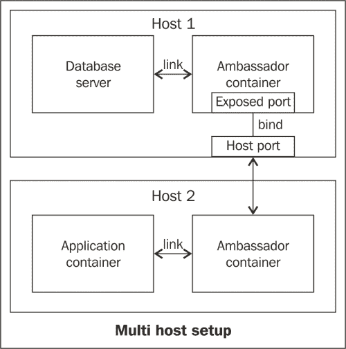

# 第三章。配置Docker容器

在前一章中，我们看到了 Docker 中可用的所有不同命令。我们看了一些例子，涵盖了如何提取图像、运行容器、将图像附加到容器、提交以及将图像推送到存储库。我们还学习了如何编写 Dockerfiles，以使构建映像成为一个可重复的过程。

在本章中，我们将更深入地了解如何控制容器的运行。尽管 Docker 容器是沙箱化的，但这并不能防止其中一个容器中的一个不正常的流氓进程占用其他容器(包括主机)的可用资源。例如，小心这个命令(不要运行它):

```
$ docker run ubuntu /bin/bash -c ":(){ :|:& };:"

```

通过运行前面的命令，您可以对容器和运行它的主机进行分叉轰炸。

维基百科对*叉形炸弹*的定义如下:

> *“在计算中，分叉炸弹是一种拒绝服务攻击，在这种攻击中，进程不断复制自己以耗尽可用的系统资源，导致资源匮乏，并使系统变慢或崩溃。”*

由于 Docker 预计将在生产中使用，一个容器停止所有其他容器的可能性将是致命的。因此，有一些机制可以限制容器可以拥有的资源量，我们将在本章中讨论这些机制。

在前一章中，当我们谈到`docker`运行时，我们已经对卷进行了基本介绍。我们现在将更详细地探讨卷，并讨论它们为什么重要以及如何最好地使用它们。我们还将尝试更改`docker`守护程序正在使用的存储驱动程序。

另一个方面是网络。在检查正在运行的容器时，您可能已经注意到 Docker 随机选择了一个子网并分配了一个 IP 地址(默认值通常是 172.17.42.0/16)。我们将尝试通过设置我们自己的子网来覆盖这一点，并探索有助于管理网络方面的其他可用选项。在许多场景中，我们需要在容器之间进行通信(想象一个容器运行您的应用，另一个容器运行您的数据库)。由于 IP 地址在构建时不可用，我们需要一种机制来动态发现在其他容器中运行的服务。当容器在同一台主机上运行时，以及当它们在不同的主机上运行时，我们将寻找实现这一点的方法。

简而言之，在本章中，我们将涵盖以下主题:

*   限制资源
    *   中央处理器
    *   随机存取存储
    *   储存；储备
*   管理带有卷的容器中的数据
*   配置 Docker 以使用不同的存储驱动程序
*   配置网络
    *   端口转发
    *   自定义的 IP 地址范围
*   链接容器
    *   使用容器链接在同一主机内链接
    *   使用大使容器的跨主机链接

# 约束资源

任何承诺沙盒功能的工具都必须提供一种机制来约束资源分配。Docker 提供了限制容器启动时可以使用的 CPU 内存和 RAM 数量的机制。

## 设置 CPU 份额

使用`docker run`命令中的`-c`选项可以控制一个容器占用的中央处理器份额的数量:

```
$ docker run -c 10 -it ubuntu /bin/bash

```

值`10`是该容器相对于其他容器的相对优先级。默认情况下，所有容器都获得相同的优先级，因此 CPU 处理周期的比率也相同，您可以通过运行`$ cat /sys/fs/cgroup/cpu/docker/cpu.shares`来检查(如果您在 OS X 或 Windows 上，请在执行此操作之前将 SSH 添加到 boot2Docker 虚拟机中)。但是，您可以在运行容器时给出自己的优先级值。

当容器已经在运行时，是否可以设置 CPU 份额？是的。在`/sys/fs/cgroup/cpu/docker/<container-id>/cpu.shares`处编辑文件，并输入您想要赋予它的优先级。

### 注

如果提到的位置不存在，运行`$ grep -w cgroup /proc/mounts | grep -w cpu`命令，找出`cpu` `cgroup`安装的位置。

然而，这是一个黑客，如果 Docker 决定改变 CPU 共享的实现方式，未来可能会改变。关于这方面的更多信息可以在[https://groups.google.com/forum/#!找到主题/Docker-用户/-pP8-KgJJGg](https://groups.google.com/forum/#!topic/docker-user/-pP8-KgJJGg) 。

## 设置内存限制

同样，在启动容器时，也可以限制容器允许消耗的内存量:

```
$ docker run -m <value><optional unit>

```

这里，`unit`可以是`b`、`k`、`m`或`g`，分别代表字节、千字节、兆字节和千兆字节)。

一个单元的例子可以表示如下:

```
$ docker run -m 1024m -dit ubuntu /bin/bash

```

这为容器设置了 1 GB 的内存限制。

与限制 CPU 份额的情况一样，您可以通过运行以下代码来检查默认内存限制:

```
$ cat /sys/fs/cgroup/memory/docker/memory.limit_in_bytes
18446744073709551615

```

如文件名所述，前面的代码以字节为单位打印限制。输出中显示的值对应于 1.8 x 1010 千兆字节，这实际上意味着没有限制。

当容器已经在运行时，是否可以设置内存限制？

与 CPU 份额一样，内存限制由`cgroup`文件强制执行，这意味着我们可以通过更改容器的`cgroup`内存文件的值来动态更改限制:

```
$ echo 1073741824 > \ /sys/fs/cgroup/memory/docker/<container_id>/memory.limit_in_bytes

```

### 注

如果`cgroup`文件的位置不存在，运行`$ grep -w cgroup /proc/mounts | grep -w memory`找出文件的挂载位置。

这也是一种黑客攻击，如果 Docker 决定改变内存限制在内部实现的方式，这种攻击在未来可能会改变。

更多关于这个的信息可以在 https://groups.google.com/forum/#!找到主题/Docker-用户/-pP8-KgJJGg 。

## 在虚拟文件系统(设备映射器)上设置存储限制

限制磁盘使用可能有点棘手。没有直接的方法来限制一个容器可以使用的磁盘空间量。默认的存储驱动程序 AUFS 不支持磁盘配额，至少不是没有黑客(困难是因为 AUFS 没有自己的块设备。访问[http://aufs.sourceforge.net/aufs.html](http://aufs.sourceforge.net/aufs.html)了解 AUFS 如何运作的深入信息。在写这本书的时候，需要磁盘配额的 Docker 用户选择`devicemapper`驱动，这将允许每个容器使用多达一定数量的磁盘空间。但是一种更通用的跨存储驱动程序的机制正在开发中，可能会在未来的版本中引入。

### 注

`devicemapper`驱动程序是一个 Linux 内核框架，用于将块设备映射到更高级别的虚拟块设备。

`devicemapper`驱动程序基于两个块设备(将它们视为虚拟磁盘)创建存储块的`thin`池，一个用于数据，另一个用于元数据。默认情况下，这些块设备是通过将稀疏文件装载为环回设备来创建的。

### 注

一个**稀疏文件**是一个包含大部分空白空间的文件。因此，一个 100 GB 的稀疏文件可能实际上只包含开头和结尾的几个字节(并且只占用磁盘上的这些字节)，但是作为一个 100 GB 的文件对应用是可见的。读取稀疏文件时，文件系统会在运行时透明地将空块转换为填充零字节的真实块。它通过文件的元数据跟踪已写块和空块的位置。在类似 UNIX 的操作系统中，环回设备是一种伪设备，它使文件可以作为块设备访问。

之所以称之为`thin`池，是因为当您实际上向块写入数据时，它只会将存储块标记为已使用(来自该池)。每个容器都配有一个特定大小的基本精简设备，并且不允许容器累积超过该大小限制的数据。

默认限制是什么？`thin`池的默认限制是 100 GB。但是，由于用于该池的环回设备是一个稀疏文件，它最初不会占用这么多空间。

为每个容器和映像创建的基本设备的默认大小限制是 10 GB。同样，由于这是稀疏的，它最初不会占用物理磁盘上这么多空间。但是，它占用的空间量会随着大小限制的增加而增加，因为块设备的大小越大，稀疏文件的(虚拟)大小就越大，它需要存储的元数据也就越多。

如何更改这些默认值？您可以使用`--storage-opts`选项更改这些选项，该选项在运行`docker`守护程序时可用，前缀为`dm`(表示`devicemapper`)。

### 注

在运行本节中的任何命令之前，用`docker save`备份所有图像，并停止`docker`守护程序。完全移除`/var/lib/docker`(Docker 存储图像数据的路径)可能也是明智的。

### 设备映射器配置

各种配置如下:

*   `dm.basesize`:这指定了基本设备的大小，由容器和图像使用。默认情况下，该值设置为 10 GB。创建的设备很稀疏，因此最初不会占用 10 GB。相反，它将在数据写入时填满，直到达到 10 GB 的限制:

    ```
    $ docker -d -s devicemapper --storage-opt dm.basesize=50G

    ```

*   `dm.loopdatasize`:这是`thin`池的大小。默认大小为 100 GB。需要注意的是这个文件比较稀疏，所以最初不会占用这个空间；相反，随着越来越多的数据被写入其中，它将逐渐填满:

    ```
    $ docker -d -s devicemapper --storage-opt dm.loopdatasize=1024G

    ```

*   `dm.loopmetadatasize`:如前所述，创建了两个块设备，一个用于数据，另一个用于元数据。此选项指定创建此块设备时要使用的大小限制。默认大小为 2 GB。该文件也很稀疏，因此最初不会占用整个大小。建议的最小大小为总池大小的 1%:

    ```
    $ docker -d -s devicemapper --storage-opt dm.loopmetadatasize=10G

    ```

*   `dm.fs`:这是用于基本设备的文件系统类型。支持`ext4`和`xfs`文件系统，不过`ext4`默认为:

    ```
    $ docker -d -s devicemapper --storage-opt dm.fs=xfs

    ```

*   `dm.datadev`:这个指定了一个自定义的块设备用于`thin`池(而不是环回)。如果使用此选项，建议为数据和元数据指定块设备，以完全避免使用回送设备:

    ```
    $ docker -d -s devicemapper --storage-opt dm.datadev=/dev/sdb1 \-storage-opt dm.metadatadev=/dev/sdc1

    ```

还有更多可用的选项，并在[https://github . com/docker/docker/tree/master/daemon/graph driver/dev mapper/readme . MD](https://github.com/docker/docker/tree/master/daemon/graphdriver/devmapper/README.md)上清晰地解释了所有这些是如何工作的。

另一个很棒的资源是 Docker 供稿人 jérme Petazzoni 在[发布的一篇关于调整容器大小的博文，网址为 http://jpetazzo . github . io/2014/01/29/Docker-device-mapper-resize/](http://jpetazzo.github.io/2014/01/29/docker-device-mapper-resize/)。

### 注

如果切换存储驱动程序，旧的容器和映像将不再可见。

在本节的开头，提到有可能有配额，并且仍然通过黑客攻击使用 AUFS。黑客攻击包括根据需求创建基于`ext4`文件系统的回送文件系统，并将其绑定为容器专用的卷:

```
$ DIR=$(mktemp -d)
$ DB_DIR=(mktemp -d)
$ dd if=/dev/zero of=$DIR/data count=102400
$ yes | mkfs -t ext4 $DIR/data
$ mkdir $DB_DIR/db
$ sudo mount -o loop=/dev/loop0 $DIR/data $DB_DIR

```

现在，您可以使用`docker run`命令的`-v`选项将`$DB_DIR`目录绑定到容器:

```
$ docker run -v $DB_DIR:/var/lib/mysql mysql mysqld_safe.

```

# 管理带有卷的容器中的数据

《Docker》一书《T2》的一些显著特点如下:

*   卷是与容器的`root`文件系统分离的目录。
*   它由`docker`守护进程直接管理，可以跨容器共享。
*   卷也可用于在容器内装载主机系统的目录。
*   从正在运行的容器更新映像时，对卷所做的更改将不包括在内。
*   因为卷在容器的文件系统之外，所以它没有数据层或快照的概念。因此，读写直接发生在卷上。
*   如果多个容器使用同一个卷，该卷将一直存在，直到至少有一个容器使用它。

创建卷很容易。只需用`-v`选项启动一个容器:

```
$ docker run -d -p 80:80 --name apache-1 -v /var/www apache.

```

现在注意卷没有`ID`参数，所以您不能像命名容器或标记图像一样精确地命名卷。但是，可以利用这样一个子句，即一个卷会一直存在，直到至少有一个容器使用它，这就引入了纯数据容器的概念。

### 注

由于 Docker 版本，如果您愿意，您可以使用-v 选项将主机的整个文件系统绑定到一个容器，如下所示:

```
$ docker run -v /:/my_host ubuntu:ro ls /my_host.

```

但是，禁止安装到容器的/上，因此出于安全原因，您不能替换容器的`root`文件系统。

## 纯数据容器

一个纯数据容器是一个除了公开一个其他数据访问容器可以使用的卷之外什么也不做的容器。如果访问卷的容器因事故而停止或崩溃，纯数据容器用于防止卷被破坏。

## 使用另一个容器的容积

一旦我们用`-v`选项启动了一个容器，我们就创建了一个卷。我们可以使用`--volumes-from`选项将一个容器创建的卷与其他容器共享。此选项的可能使用情形可以是备份数据库、处理日志、对用户数据执行操作等。

## 用例–Docker 上生产的 MongoDB

作为一个用例，假设您想要在您的生产环境中使用 **MongoDB** ，您将运行一个 MongoDB 服务器和一个`cron`作业，定期备份您的数据库快照。

### 注

MongoDB 是一个提供高性能、高可用性和易扩展性的文档数据库。您可以在[http://www.mongodb.org](http://www.mongodb.org)获得更多关于 MongoDB 的信息。

让我们看看如何使用`docker`卷来设置 MongoDB:

1.  首先，我们需要一个数据容器。这个容器的任务只是暴露 MongoDB 存储数据的卷:

    ```
     $ docker run -v /data/db --name data-only mongo \ echo "MongoDB stores all its data in /data/db"

    ```

2.  Then we need to run the MongoDB server, which uses the volume created by the data-only container:

    ```
    $ docker run -d --volumes-from data-only -p 27017:27017 \ --name mongodb-server mongo mongod

    ```

    ### 注

    `mongod`命令运行 MongoDB 服务器，通常作为守护程序/服务运行。通过端口`27017`进入。

3.  最后，我们需要运行`backup`实用程序。在这种情况下，我们只是将 MongoDB 数据存储转储到主机上的当前目录:

    ```
    $ docker run -d --volumes-from data-only --name mongo-backup \ -v $(pwd):/backup mongo $(mkdir -p /backup && cd /backup && mongodump)

    ```

### 注

这绝不是在生产中设置 MongoDB 的详尽例子。您可能需要一个监控 MongoDB 服务器运行状况的进程。您还需要使 MongoDB 服务器容器可被您的应用容器发现(我们将在后面详细学习)。

# 配置 Docker 使用不同的存储驱动程序

在使用不同的存储驱动程序之前，用`docker save`备份所有图像，并停止`docker`守护程序。一旦你备份了所有重要的图像，移除`/var/lib/docker`。更改存储驱动程序后，您可以恢复保存的图像。

我们现在将默认存储驱动程序 AUFS 更改为两个替代存储驱动程序–`devicemapper`和`btrfs`。

## 使用设备映射器作为存储驱动程序

很容易将切换到`devicemapper`驾驶员。只需使用`-s`选项启动`docker`守护程序:

```
$ docker -d -s devicemapper

```

此外，您可以使用`--storage-opts`标志提供各种`devicemapper`驾驶员选项。`devicemapper`驱动程序的各种可用选项和示例已在本章的*限制资源存储*一节中介绍。

### 注

如果你运行的红帽/软呢帽没有 AUFS，Docker 会一直使用`devicemapper`驱动程序，这是可用的。

一旦您切换了存储驱动程序，您可以通过运行`docker info`来验证其中的更改。

## 使用 btrfs 作为存储驱动程序

要使用 btrfs 作为存储驱动程序，您必须首先设置它。本节假设您在 Ubuntu 14.04 操作系统上运行它。这些命令可能会因您运行的 Linux 发行版而异。以下步骤将使用`btrfs`文件系统设置块设备:

1.  首先需要安装`btrfs`及其依赖项:

    ```
    # apt-get -y btrfs-tools

    ```

2.  接下来，您需要创建一个`btrfs`文件系统类型的块设备:

    ```
    # mkfs btrfs /dev/sdb

    ```

3.  现在为 Docker 创建目录(此时您应该已经备份了所有重要的图像并清理了`/var/lib/docker`。):

    ```
    # mkdir /var/lib/docker

    ```

4.  然后在`/var/lib/docker` :

    ```
    # mount /dev/sdb var/lib/docker

    ```

    安装 btrfs 闭塞装置
5.  检查挂载是否成功:

    ```
    $ mount | grep btrfs
    /dev/sdb on /var/lib/docker type btrfs (rw)

    ```

### 注

资料来源:http://server code . com/2014/06/09/docker-btr . html。

现在你可以用`-s`选项启动`docker`守护程序:

```
$ docker -d -s btrfs

```

切换存储驱动程序后，您可以通过运行`docker info`命令来验证其中的更改。

# 配置 Docker 的网络设置

Docker 为每个容器创建了一个单独的网络栈和一个虚拟桥来管理容器内、容器和主机之间以及两个容器之间的网络通信。

有一些网络配置可以设置为`docker run`命令的参数。它们如下:

*   `--dns`:域名系统服务器是将网址(如 [http://www.docker.io](http://www.docker.io) 解析为运行网站的服务器的 IP 地址。
*   `--dns-search`: This allows you to set DNS search servers.

    ### 注

    如果将`example.com`设置为域名系统搜索域，域名系统搜索服务器会将`abc`解析为`abc.example.com`。如果您的公司网站中有许多需要经常访问的子域，这将非常有用。重复输入整个网址太痛苦了。如果您试图访问非完全限定域名的网站(例如，`xyz.abc.com`)。)，它会为查找添加搜索域。来源:[http://superuser.com/a/184366](http://superuser.com/a/184366)。

*   `-h`或`--hostname`:这个可以设置主机名。这将作为条目添加到容器面向主机的 IP 的`/etc/hosts`路径中。
*   `--link`:这是启动容器时可以指定的另一个选项。它允许容器与其他容器通信，而不需要知道它们的实际 IP 地址。
*   `--net`:此选项允许您设置容器的网络模式。它可以有四个值:
    *   `bridge`:这为 docker 桥上的容器创建了一个网络栈。
    *   `none`:不会为此容器创建网络栈。它将被完全隔离。
    *   `container:<name|id>`:这使用了另一个容器的网络栈。
    *   `host` : This uses the host's network stack.

        ### 类型

        这些值有副作用，例如可以从容器访问本地系统服务。这个选项被认为是不安全的。

*   `--expose`:这个暴露容器的端口，不在主机上发布。
*   `--publish-all`:这个将所有暴露的端口发布到主机的接口。
*   `--publish`:这个以下面的格式向主机发布一个容器的港口:`ip:hostPort:containerPort | ip::containerPort | hostPort:containerPort | containerPort`。

### 类型

如果没有给出`--dns`或`--dns-search`，那么容器的`/etc/resolv.conf`文件将与守护进程运行的主机的`/etc/resolv.conf`文件相同。

然而，当您运行`docker`守护进程时，也可以给它一些配置。它们被提及如下:

### 注

这些选项只能在启动`docker`守护程序时提供，一旦运行就不能调整。这意味着您必须提供这些参数以及`docker -d`命令。

*   `--ip`:这个选项允许我们在面向容器的`docker0`界面设置主机的 IP 地址。因此，这将是绑定容器端口时使用的默认 IP 地址。例如，该选项可以显示如下:

    ```
    $ docker -d --ip 172.16.42.1

    ```

*   `--ip-forward`: This is a `Boolean` option. If it is set to `false`, the host running the daemon will not forward the packets between containers or from the outside world to the container, completely isolating it (from a network perspective).

    ### 注

    可以使用`sysctl`命令检查该设置:

    ```
    $ sysctl net.ipv4.ip_forward
    net.ipv4.ip_forward = 1
    .

    ```

*   `--icc`: This is another `Boolean` option that stands for `inter-container communication`. If it is set to `false`, the containers will be isolated from each other, but will still be able to make general HTTP requests to package managers and so on.

    ### 注

    如何只在需要的两个容器之间实现通信？通过链接。我们将在*链接容器*部分详细探讨链接。

*   `-b or --bridge`:你可以让 Docker 用一个自定义的桥来代替`docker0`。(桥的创建不在本讨论范围内。不过，如果你好奇的话，可以在[上找到更多信息](http://docs.docker.com/articles/networking/#building-your-own-bridge)。)
*   `-H or --host`:这个选项可以接受多个参数。Docker 有一个 RESTful API。守护进程充当服务器，当你运行`run`和`ps`等客户端命令时，它会向服务器发出`GET`和`POST`请求，服务器执行必要的操作并返回响应。`-H`标志用于告诉`docker`守护程序它必须监听的客户端命令通道。论据可以如下:
    *   TCP 套接字，以`tcp://<host>:<port>`的形式表示
    *   `unix:///path/to/socket`形式的 UNIX 插座

## 配置容器和主机之间的端口转发

容器无需任何特殊配置即可与外界连接，但外界不允许窥视。这是一种安全措施，并且相当明显，因为容器都通过虚拟桥连接到主机，从而有效地将它们放置在虚拟网络中。但是如果你在一个你想对外公开的容器中运行一个服务会怎么样？

端口转发是公开在容器中运行的服务的最简单方法。在图像的摘要文件中提及需要暴露的端口总是明智的。在 Docker 的早期版本中，可以在 Dockerfile 本身中指定 Dockerfile 应该绑定到哪个主机端口，但这被放弃了，因为有时主机中已经运行的服务会干扰容器。现在，您仍然可以在 Dockerfile 中指定想要公开的端口(使用`EXPOSE`指令)，但是如果您想要将其绑定到您选择的端口，您需要在启动容器时这样做。

有两种方法可以启动容器并将其端口绑定到主机端口。解释如下:

*   `-P or --publish-all`:使用带有`-P`选项的`docker run`启动一个容器，将会发布使用图像的 Dockerfile 中的`EXPOSE`指令暴露的所有端口。Docker将通过暴露的港口，并将其绑定到`49000`和`49900`之间的随机港口。
*   `-p or --publish`:这个选项可以让你明确告诉 Docker上的哪个端口哪个 IP 应该绑定到一个容器上的一个端口(当然主机中的一个接口应该有这个 IP)。多次使用选项可以完成多个绑定:
    1.  `docker run -p ip:host_port:container_port`
    2.  `docker run -p ip::container_port`
    3.  `docker run -p host_port:container_port`

## 自定义 IP 地址范围

我们已经看到了如何将容器的端口绑定到主机的端口，如何配置容器的 DNS 设置，甚至如何设置主机的 IP 地址。但是如果我们想自己设置容器和主机之间的网络子网呢？Docker 在 RFC 1918 提供的一个可用私有 IP 地址范围内创建了一个虚拟子网。

设置自己的子网范围非常容易。`docker`守护程序的`--bip`选项可用于设置网桥的 IP 地址以及它将在其中创建容器的子网:

```
$ docker -d --bip 192.168.0.1/24

```

在这种情况下，我们已经将`192.168.0.1`的 IP 地址设置为`docker`守护进程，并提到它必须为子网范围`192.168.0.0/24`中的容器分配 IP 地址(即从`192.168.0.2`到`192.168.0.254`，总共 252 个可能的 IP 地址)。

就这样！在[https://docs.docker.com/articles/networking/](https://docs.docker.com/articles/networking/)有更高级的网络配置和示例。一定要去看看。

# 连接容器

将容器端口绑定到主机端口是完全可以的，如果你只是有一个普通的 web 服务器，你想公开给互联网。然而，大多数生产系统是由许多不断相互通信的独立组件组成的。诸如数据库服务器之类的组件不能绑定到公共可见的 IP，但是运行前端应用的容器仍然需要发现数据库容器并连接到它们。在应用中硬编码容器的 IP 地址既不是一个干净的解决方案，也行不通，因为 IP 地址是随机分配给容器的。那么我们如何解决这个问题呢？答案如下。

## 链接同一主机内的容器

使用`--link`选项启动容器时，可以指定链接:

```
$ docker run --link CONTAINER_IDENTIFIER:ALIAS . . .

```

这是如何工作的？当给出一个链接选项时，Docker 向容器的`/etc/hosts`文件添加一个条目，将`ALIAS`命令作为名为`CONTAINER_IDENTIFIER`的容器的主机名和 IP 地址。

### 注

`/etc/hosts`文件可以用来覆盖 DNS 定义，也就是说，将主机名指向某个 IP 地址。在主机名解析过程中，在向域名系统服务器发出请求之前，会检查`/etc/hosts` 。

例如，命令行代码如下所示:

```
$ docker run --name pg -d postgres
$ docker run --link pg:postgres postgres-app

```

前面的命令运行一个 PostgreSQL 服务器(其 Dockerfile 公开端口 5432，PostgeSQL 的默认端口)，第二个容器将使用`postgres`别名链接到它。

### 注

PostgreSQL 是一个完全符合 T2 的强大开源对象关系数据库系统。

## 使用大使容器的跨主机链接

当所有容器都在同一个主机内时，链接容器工作正常，但是 Docker 的容器可能经常分布在不同的主机上，在这些情况下链接失败，因为在不同主机上运行的容器的 IP 地址不被当前主机上运行的`docker`守护程序所知。此外，链接是静态的。这意味着，如果一个容器重新启动，它的 IP 地址会改变，所有链接到它的容器都将失去连接。一个便携的解决方案是使用大使容器。

下图显示了大使容器:



在这种体系结构中，一台主机中的数据库服务器暴露给另一台主机。这里也是，如果数据库容器发生变化，只需要重启`host1`阶段的大使容器。

### 用例——多主机 Redis 环境

让我们使用`progrium/ambassadord`命令设置一个多主机 Redis 环境。还有其他图像也可以用作大使容器。可以使用`docker search`命令或在[https://registry.hub.docker.com](https://registry.hub.docker.com)搜索它们。

### 注

Redis 是一个开源的、网络化的、内存中的、键值数据存储，具有可选的持久性。它以读写速度快而闻名。

在这个环境中，有两个主机，`Host` `1`和`Host` `2`。`Host` `1`的 IP 地址为`192.168.0.100`，为私有(不对外公开)。`Host` `2`位于 192.168.0.1，绑定到公共 IP。这是运行您的前端 web 应用的主机。

### 注

要尝试此示例，请启动两台虚拟机。如果你使用游民，我建议使用安装了 Docker 的 Ubuntu 镜像。如果你有游民 v1.5，可以通过运行`$ vagrant init phusion/ubuntu-14.04-amd64`来使用 Phusion 的 Ubuntu 镜像。

#### 主机 1

在第一台主机上，运行以下命令:

```
$ docker run -d --name redis --expose 6379 dockerfile/redis

```

该命令启动一个 Redis 服务器，并公开端口`6379`(这是 Redis 服务器运行的默认端口)，但不将其绑定到任何主机端口。

下面的命令启动一个大使容器，链接到 Redis 服务器，并将端口 6379 绑定到其专用网络 IP 地址的端口 6379(在本例中恰好是 192.168.0.100)。这仍然不是公共的，因为主机是私有的(不暴露给公共互联网):

```
$ docker run -d --name redis-ambassador-h1 \
 -p 192.168.0.100:6379:6379 --link redis:redis \
 progrium/ambassadord --links

```

#### 主机 2

在另一个主机(如果您在开发中使用的是 host，则是另一个虚拟机)中，运行以下命令:

```
$ docker run -d --name redis-ambassador-h2 --expose 6379 \
progrium/ambassadord 192.168.0.100:6379

```

这个大使容器监听目的 IP 的端口，在这个例子中是主机 1 的 IP 地址。我们已经公开了端口 6379，这样它就可以被我们的应用容器连接到:

```
$ docker run -d --name application-container \--link redis-ambassador-h2:redis myimage mycommand

```

这将是在互联网上向公众公开的容器。由于 Redis 服务器运行在私有主机上，因此无法从私有网络之外进行攻击。

# 总结

在本章中，我们看到了如何在 Docker 容器中调配资源，如 CPU、RAM 和存储。我们还讨论了如何使用卷和卷容器来管理容器中应用产生的持久数据。我们了解了 Docker 使用的交换存储驱动程序、各种网络配置及其相关用例。最后，我们看到了如何在主机内部和主机之间链接容器。

在下一章中，我们将看看当我们考虑使用 Docker 部署我们的应用时，哪些工具和方法会有所帮助。我们将关注的一些事情是多个服务的协调、服务发现和 Docker 的远程 API。我们还将介绍安全注意事项。