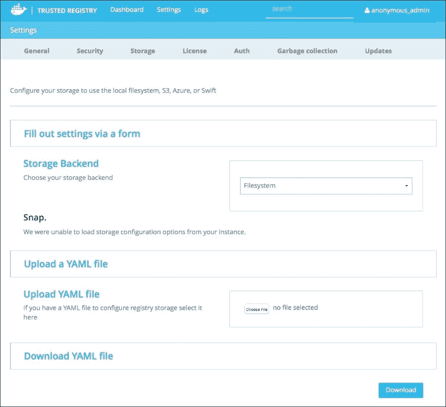

# 第二章。保护Docker组件

在本章中，我们将研究如何使用映像签名工具来保护一些 Docker 组件。有一些工具可以帮助保护我们存储映像的环境，无论映像是否经过签名。我们还将考虑使用附带商业级支持的工具。我们将关注的一些工具(映像签名和商业级支持工具)包括:

*   **Docker 内容信任**:可以用来给你的图片签名的软件。我们将查看所有组件，并通过一个示例来签署映像。
*   **Docker Subscription**:Subscription 是一个包含所有内容的包，包括存储您的映像的位置和运行您的容器的 Docker Engine，同时为所有这些内容以及您计划使用的应用及其生命周期提供商业级支持。
*   **Docker 可信注册中心** ( **DTR** ):可信注册中心为您提供了一个安全的位置来存储和管理您的本地或云中的映像。它还大量集成到您当前的基础架构中。我们将查看所有可用的零件。

# Docker 内容信任

Docker 内容信任是一种手段，通过这种手段，您可以安全地签署您创建的 Docker 映像，以确保它们来自他们所说的来源，即您！在本节中，我们将看看**公证**以及的组件，作为签名映像的示例。最后，我们将浏览一下关于硬件签名功能的最新公证使用方法。这是一个非常令人兴奋的话题，所以让我们先深入了解一下吧！

## Docker 内容信任组件

要了解 Docker 内容信任是如何工作的，熟悉构成其生态系统的所有组件是有益的。

该生态系统的第一部分是**更新框架** ( **TUF** )部分。TUF，我们将从现在开始提到它，是公证人赖以建立的框架。TUF 解决了软件更新系统的问题，因为它们通常很难管理。它使用户能够确保所有应用都是安全的，并且能够经受住任何关键的妥协。但是，如果一个应用在默认情况下是不安全的，那么在它达到安全的合规性之前，保护该应用是没有帮助的。它还支持通过不可信来源进行可信更新等等。要了解更多关于 TUF 的信息，请访问网站:

[http://the update framework . com/](http://theupdateframework.com/)

内容信任生态系统的下一部分是公证人。公证人是使用您的密钥进行实际签名的关键基础部分。公证是开源软件，可以在这里找到:

[https://github.com/docker/notary](https://github.com/docker/notary)

这是由 Docker 的人员制作的，用于发布和验证内容。公证人由一个服务器和一个客户端组成。客户端驻留在您的本地机器上，并在本地处理密钥的存储以及与公证服务器的通信，以匹配时间戳。

基本上，到公证服务器有三个步骤。

1.  编译服务器
2.  配置服务器
3.  运行服务器

由于这些步骤在将来可能会改变，所以最好的信息位置是在 Docker 公证员的 GitHub 页面上。关于公证员服务器端的编译和设置的更多信息，请访问:

[https://github.com/docker/notary#compiling-notary-server](https://github.com/docker/notary#compiling-notary-server)

Docker 内容信任利用两个不同的密钥。第一个是标签键。为您发布的每个新存储库生成标记密钥。这些密钥可以与其他人共享，并导出给那些需要代表注册表签署内容的人。另一个键，离线键，是重要的键。这是你想锁在金库里的钥匙，永远不要和任何人分享*…永远不要*！顾名思义，这个密钥应该保持离线，而不是存储在您的机器上或网络或云存储上的任何东西上。您唯一需要离线密钥的时候是当您将它旋转出来创建一个新的密钥或者创建一个新的存储库的时候。

那么，这一切意味着什么，它如何真正让你受益？这有助于防范三种关键情况，没有双关的意思。

*   防止映像伪造，例如，如果有人决定假装你的映像来自你。如果那个人不能用存储库特定的密钥签署那个映像，记住你要保持*离线的那个*！，他们不会把它当作真的来自你。
*   防止重放攻击；重放攻击是指恶意用户试图将应用的旧版本冒充为最新的合法版本。由于 Docker 内容信任使用时间戳的方式，这将最终失败，并保证您和您的用户的安全。
*   防止密钥泄露。如果某个密钥泄露，您可以利用该离线密钥进行密钥轮换。该密钥轮换只能由具有离线密钥的密钥来完成。在这种情况下，您需要创建一个新的密钥，并使用您的离线密钥对其进行签名。

所有这些的主要区别在于离线密钥应该保持离线。永远不要把它存储在你的云存储上，GitHub 上，甚至是一个总是连接到互联网的系统上，比如你的本地机器。最好将其存储在加密的拇指驱动器上，并将该拇指驱动器存储在安全的位置。

要了解更多关于 Docker 内容信任，请访问以下博客文章:

[http://blog.docker.com/2015/08/content-trust-docker-1-8/](http://blog.docker.com/2015/08/content-trust-docker-1-8/)

## 签名图片

现在我们已经涵盖了 Docker 内容信任的所有组件，让我们来看看如何签署映像以及涉及的所有步骤。这些说明只是为了开发的目的。如果您想要在生产中运行公证服务器，您将需要使用自己的数据库，并使用公证网站上的说明自行编译公证:

[https://github.com/docker/notary#compiling-notary-server](https://github.com/docker/notary#compiling-notary-server)

这将允许你使用你自己的情况下自己的密钥到你自己的后端注册表。如果您正在使用 Docker Hub，使用 Docker 内容信任非常简单。

```
$ export DOCKER_CONTENT_TRUST=1

```

最重要的一点是，您需要在推送的所有映像上贴上标签，我们将在下一个命令中看到:

```
$ docker push scottpgallagher/ubuntu:latest

The push refers to a repository [docker.io/scottpgallagher/ubuntu] (len: 1)
f50e4a66df18: Image already exists
a6785352b25c: Image already exists
0998bf8fb9e9: Image already exists
0a85502c06c9: Image already exists
latest: digest: sha256:98002698c8d868b03708880ad2e1d36034c79a6698044b495ac34c4c16eacd57 size: 8008
Signing and pushing trust metadata
You are about to create a new root signing key passphrase. This passphrase
will be used to protect the most sensitive key in your signing system. Please
choose a long, complex passphrase and be careful to keep the password and the
key file itself secure and backed up. It is highly recommended that you use a
password manager to generate the passphrase and keep it safe. There will be no
way to recover this key. You can find the key in your config directory.
Enter passphrase for new root key with id d792b7a:
Repeat passphrase for new root key with id d792b7a:
Enter passphrase for new repository key with id docker.io/scottpgallagher/ubuntu (46a967e):
Repeat passphrase for new repository key with id docker.io/scottpgallagher/ubuntu (46a967e):
Finished initializing "docker.io/scottpgallagher/ubuntu"

```

上面代码中最重要的一行是:

```
latest: digest: sha256:98002698c8d868b03708880ad2e1d36034c79a6698044b495ac34c4c16eacd57 size: 8008

```

这为您提供了SHA 哈希，用于验证映像是否如其所言，是否由他人创建，以及映像的大小。这将在以后有人去运行那个`image/container`时使用。

如果你要在没有这个映像的机器上做一个`docker pull`，你可以看到它已经用那个散列签名了。

```
$ docker pull scottpgallagher/ubuntu

Using default tag: latest
latest: Pulling from scottpgallagher/ubuntu
Digest: sha256:98002698c8d868b03708880ad2e1d36034c79a6698044b495ac34c4c16eacd57
Status: Downloaded newer image for scottpgallagher/ubuntu:latest

```

同样，当我们执行`pull`命令时，我们看到了 SHA 值。

因此，这意味着当您运行这个容器时，如果不首先将本地散列与注册服务器上的散列进行比较以确保它没有改变，它就不会在本地运行。如果它们匹配，它将运行，如果它们不匹配，它将不会运行，并会给你一个关于哈希不匹配的错误消息。

使用 Docker Hub，你实际上不是用自己的密钥来签署映像，除非你操作了`~/.docker/trust/trusted-certificates/`目录中的密钥。请记住，默认情况下，当您安装 Docker 时，您会获得一组可以使用的证书。

## 硬件签约

既然我们已经看到能够对映像进行签名，还有哪些其他安全措施已经到位，有助于使该过程更加安全？输入 YubiKeys！YubiKeys 是一种您可以利用的双因素身份验证形式。YubiKey 的工作方式是它有根密钥，内置在硬件中。您启用 Docker 内容信任，然后推送您的映像。在使用您的映像时，Docker 注意到您已经启用了内容信任，并要求您触摸 YubiKey，是的，物理触摸它。这是为了确保你是一个人，而不是一个机器人或只是一个脚本。然后您需要提供一个 passphase 来使用，然后再一次触摸 YubiKey。完成此操作后，您将不再需要 YubiKey，但您将需要之前分配的密码。

我对这个的描述确实不太公正。在 Docker con Europe 2015([http://europe-2015.dockercon.com](http://europe-2015.dockercon.com))上，两位 Docker 员工 Aanand Prasad 和迪奥戈·莫尼卡之间进行了一场精彩的表演。

要观看视频，请访问以下网址:

[https://youtu . be/flfffthrzq？t=1 小时 21 分 33 秒](https://youtu.be/fLfFFtOHRZQ?t=1h21m33s)

# Docker订阅

Docker Subscription 是为您的分布式应用提供的服务，将帮助您支持和部署这些应用。Docker 订阅包包括两个关键软件部分和一个支持部分:

*   **Docker 注册表** —存储和管理映像的地方(本地托管或托管在云中)
*   Docker **引擎** —运行这些映像
*   **Docker** **通用控制飞机** ( **UCP** )
*   **商业** **支持** —拿起电话或发一封邮件寻求帮助

如果你是一名开发人员，有时事情的操作方面要么有点难以设置和管理，要么需要一些培训才能开始。借助 Docker Subscription，您可以利用商业级支持提供的专业知识来消除这些顾虑。有了这种支持，你会在你的问题上得到回应。您将收到任何可用或已经可用的热修复程序来修补您的解决方案。对未来升级的帮助也是选择 Docker 订阅计划的额外好处的一部分。您将获得将您的环境升级到最新和最安全的 Docker 环境的帮助。

定价根据您希望运行环境的位置进行细分，无论是在您选择的服务器上还是在云环境中。它还基于您希望拥有多少 Docker 可信注册中心和/或多少商业支持的 Docker 引擎。所有这些解决方案都为您提供了与现有 **LDAP** 或**活动目录** 环境的集成。有了这个额外的好处，您可以使用组策略等项目来管理对这些资源的访问。您必须决定的最后一件事是您希望支持端的响应时间有多快。所有这些都将导致您为订阅服务支付的价格。不管你付出什么，花的钱都是值得的，不仅是因为你会得到内心的平静，还因为你获得的知识是无价的。

您还可以每月或每年更改您的计划，并以十为增量升级您的 Docker Engine 实例。您还可以以十个为一组升级**Docker** **枢纽企业**实例的数量。在内部服务器和云之间切换也是可能的，反之亦然。

为了不被混淆，分解一些东西，Docker 引擎是 Docker 生态系统的核心。它是用于运行、构建和管理容器或映像的命令行工具。Docker Hub 企业版是您存储和管理映像的地方。这些映像可以公开，也可以保密。我们将在本章的下一节了解更多关于 DTR 的知识。

有关 Docker 订阅的更多信息，请访问以下链接。您可以注册 30 天的免费试用，查看订阅计划，并联系销售人员寻求更多帮助或问题。订阅计划足够灵活，可以适应您的操作环境，无论是您想要的全天候支持，还是仅仅是其中的一半:

[https://www.docker.com/docker-subscription](https://www.docker.com/docker-subscription)

您也可以在此查看商业支持的明细:

[https://www.docker.com/support](https://www.docker.com/support)

将这一切带回到本书的主题“保护 Docker”，这是到目前为止您可以使用 Docker 环境获得的最安全的保护，您将使用它来管理您的映像和容器，以及管理它们的存储和运行位置。一点额外的帮助永远不会有坏处，有了这个选项，一点点帮助将会有很大的帮助。

最新增加的部分是 Docker 通用控制平面。Docker UCP 公司为管理应用和基础架构提供了一个解决方案，无论它们可能在哪里运行，该解决方案都是 Docker 化的。这可以在内部运行，也可以在云中运行。您可以在以下链接中找到关于Docker·UCP 的更多信息:

[https://www . docker . com/products/docker-universal-control-plane](https://www.docker.com/products/docker-universal-control-plane)

您也可以使用上面的网址获得产品的演示。Docker UCP 是可扩展的，易于设置，您可以通过集成到现有的 LDAP 或活动目录环境中来管理用户和访问控制。

# Docker可信注册处

DTR 是一个解决方案，它提供了一个安全的位置，您可以在内部或云中存储和管理您的 Docker 映像。它还提供了一些监控功能，让您可以深入了解使用情况，以便您可以知道传递给它的负载类型。与 Docker Registry 不同，DTR 并不是免费的，它确实有一个定价模型。正如我们之前在 Docker Subscription 上看到的，DTR 的定价计划是相同的。不要担心，因为我们将在本书的下一部分讨论 Docker Registry，这样您也可以理解它，并拥有映像存储的所有可用选项。

我们之所以将它分成单独的部分，是因为其中涉及到许多移动的部分，了解它们如何作为一个整体在 Docker Subscription 部分发挥作用非常重要，而且就其本身而言，在 DTR 部分，您的所有映像都被维护和存储。

## 安装

有两种方法可以安装 DTR，或者说有两个地方可以安装 DTR。首先，您可以在自己管理的服务器上部署它。另一种是将其部署到云提供商环境，如 **【数字海洋】****【亚马逊网络服务】** ( **AWS** )或**微软 Azure** 。

第一部分你需要的是 DTR 的许可证。目前，他们确实提供了您可以使用的试用许可证，我强烈建议您这样做。这将允许您在所选环境中评估软件，而不必完全提交给该环境。如果您发现某些东西在特定环境中不起作用，或者您觉得另一个位置可能更适合您，那么您可以进行切换，而不必受限于特定位置，也不必将您现有的环境转移到不同的提供商或位置。如果您选择使用 AWS，他们确实有预烘焙的 **亚马逊机器映像** ( **AMI** )您可以利用它更快地设置您的可信注册表。这避免了必须手动完成所有工作。

在安装可信注册表之前，您首先需要安装 Docker 引擎。如果您还没有安装它，请查看下面链接中的文档，了解安装的更多信息。

[https://docs . docker . com/docker-trusted registry/install/install-csengine/](https://docs.docker.com/docker-trusted-registry/install/install-csengine/)

你会注意到安装普通的 Docker 引擎和 **Docker CS 引擎**是有区别的。 Docker CS 引擎代表商业支持的Docker 引擎。请务必查看文档，因为推荐或支持的 Linux 版本列表比 Docker Engine 的常规列表要短。

如果您使用 AMI 进行安装，请按照此处的说明进行操作:

[https://docs . docker . com/docker-trusted registry/install/DTR-ami-byol 启动/](https://docs.docker.com/docker-trusted-registry/install/dtr-ami-byol-launch/)

如果您是在微软 Azure 上安装，那么请按照这里的说明操作:

[https://docs . docker . com/docker-trusted registry/install/DTR-vhd-azure/](https://docs.docker.com/docker-trusted-registry/install/dtr-vhd-azure/)

一旦你安装了 Docker Engine，是时候安装 DTR 了。如果您读到这一点，我们将假设您没有安装到 AWS 或微软 Azure。如果您使用这两种方法中的任何一种，请查看上面的链接。安装非常简单:

```
$ sudo bash -c '$(sudo docker run docker/trusted-registry install)'

```

### 注

注意:在 Mac OS 上运行时，可能需要从上面的命令中删除`sudo`选项。

运行后，您可以在浏览器中导航到 Docker 主机的 IP 地址。然后，您将为受信任的注册表设置域名，并应用许可证。门户网站将指导您完成其余的安装过程。

在访问门户时，您也可以通过现有的 LDAP 或活动目录环境设置身份验证，但这可以随时完成。

一旦完成，就到了*保护 Docker 可信注册中心*的时间了，我们将在下一节讨论这个问题。

## 保护 Docker 可信注册表

既然我们已经建立了可信注册表，我们需要确保它的安全。在确保安全之前，您需要创建一个管理员帐户来执行操作。一旦您的可信注册表启动并运行，并登录其中，您将能够在**设置**下看到六个区域。这些是:

*   **常规**设置
*   **安全**设置
*   **存储**设置
*   **牌照**
*   **授权**设置
*   **更新**

**常规**设置主要集中在 **HTTP 端口**或 **HTTPS 端口**、用于您的可信注册表的**域名**以及代理设置(如果适用)等设置上。


下一节**安全**设置，大概是最重要的一节。在这个**仪表盘**窗格中，您可以使用您的 **SSL 证书**和 **SSL 私钥**。这些使您的 Docker 客户端和可信注册表之间的通信安全。现在，这些证书有几个选项。您可以使用安装受信任注册表时创建的自签名注册表。您也可以使用命令行工具，如 **OpenSSL** ，自行签名。如果您在企业组织中，他们很可能有一个您可以请求证书的位置，例如可以与注册表一起使用的证书。当执行`docker pull`或`docker push`命令时，您需要确保可信注册表上的证书与客户端上使用的证书相同，以确保通信安全:


下一节讨论映像存储设置。在这个**仪表板**面板中，您可以设置您的映像在后端存储中的存储位置。此选项可能包括您正在使用的 NFS 共享、受信任的注册表服务器的本地磁盘存储、来自 AWS 的 S3 存储桶或其他云存储解决方案。一旦您选择了**存储后端**选项，您就可以从该**存储**中设置存储映像的路径:



**许可证**部分非常简单，因为这是您更新许可证的地方，当您需要续订新许可证或升级可能包含更多选项的许可证时:


身份验证设置允许您将登录到受信任的注册表绑定到您现有的身份验证环境中。您在这里的选项有:**无**或**托管**选项。**无**除测试目的外，不建议使用。**托管**选项是您设置用户名和密码并从那里管理它们的地方。另一种选择是使用一个 **LDAP** 服务，一个您可能已经在运行的服务，这样用户就可以拥有与他们的其他工作设备相同的登录凭证，例如电子邮件或网络登录。


最后一节**更新**，介绍如何管理 DTR 的更新。这些设置完全由您自己决定如何处理更新，但是如果您正在进行自动更新，请确保在更新过程中出现问题时，您也将备份用于恢复目的。


## 给药

既然我们已经介绍了帮助您保护受信任注册表的项目，我们不妨花几分钟来介绍控制台中的其他项目，以帮助您管理它。除了注册表中的**设置**选项卡之外，还有四个其他选项卡，您可以导航并收集有关注册表的信息。这些是:

*   **仪表盘**
*   **储存库**
*   **组织**
*   **日志**

**仪表盘**是您通过浏览器登录控制台时进入的主登录页面。这将在一个中央位置显示有关您的注册表的信息。您将看到的信息是关于注册服务器本身以及注册服务器运行的 Docker 主机的更多硬件相关信息。**存储库**部分将允许您控制您的用户可以从中提取映像的存储库，无论是**公共**还是**私有**。**组织**部分允许您控制访问，也就是说，系统上的哪些人可以针对您选择配置的存储库推送、拉入或执行其他 Docker 相关命令。最后一个部分，即**日志**部分，将允许您基于注册表中正在使用的容器来查看日志。原木每两周轮换一次，最大尺寸为 *64 mb* 。您可以根据容器过滤日志，也可以搜索日期和/或时间。

## 工作流程

在本节中，让我们提取一个映像，对其进行操作，然后将其放在我们的 DTR 上，供我们组织内的其他人访问。

首先，我们需要从**Docker中心**提取一个映像。现在，您可以从的 **Dockerfile** 开始，然后进行 Docker 构建，然后推送，但是对于这个演示，假设我们有`mysql`映像，我们希望以某种方式对其进行定制。

```
$ docker pull mysql

Using default tag: latest
latest: Pulling from library/mysql

1565e86129b8: Pull complete
a604b236bcde: Pull complete
2a1fefc8d587: Pull complete
f9519f46a2bf: Pull complete
b03fa53728a0: Pull complete
ac2f3cdeb1c6: Pull complete
b61ef27b0115: Pull complete
9ff29f750be3: Pull complete
ece4ebeae179: Pull complete
95255626f143: Pull complete
0c7947afc43f: Pull complete
b3a598670425: Pull complete
e287fa347325: Pull complete
40f595e5339f: Pull complete
0ab12a4dd3c8: Pull complete
89fa423a616b: Pull complete
Digest: sha256:72e383e001789562e943bee14728e3a93f2c3823182d14e3e01b3fd877976265
Status: Downloaded newer image for mysql:latest

$ docker images

REPOSITORY          TAG                 IMAGE ID            CREATED             VIRTUAL SIZE
mysql               latest              89fa423a616b        20 hours ago        359.9 MB

```

现在，假设我们对映像进行了定制。假设我们设置了一个容器，将它的日志发送到一个日志隐藏服务器，该服务器用于从我们正在运行的所有容器中收集日志。我们现在需要保存这些更改。

```
$ docker commit be4ea9a7734e <dns.name>/mysql

```

当我们进行提交时，我们需要一些花絮信息。第一个是容器 ID，我们可以通过运行一个`docker ps`命令得到。我们还需要我们之前设置的注册服务器的域名，最后是一个唯一的映像名称。在我们的情况下，我们将保持它为`mysql`。

我们现在准备将更新后的映像推送到我们的注册服务器。我们唯一需要的信息就是我们想要推送的图片名称，将会是`<dns.name>/mysql`。

```
$ docker push <dns.name>/mysql

```

该映像现已准备好供我们组织中的其他用户使用。由于该映像位于我们的可信注册表中，因此我们可以控制客户端对该映像的访问。这可能意味着我们的客户将需要我们的证书和密钥，以便能够推送和提取此映像，以及我们在上一节中讨论的组织设置中设置的权限。

```
$ docker pull <dns.name>/mysql

```

然后，我们可以运行映像，如果需要的话进行更改，并根据需要将新创建的映像推回到可信的注册服务器。

# Docker登记处

如果你想完全靠自己，Docker 注册表是一个开放源码选项。如果你完全不想插手，你可以一直使用 Docker Hub，并依赖公共和私有存储库，这将使你在 Docker Hub 上运行一笔费用。这可以本地托管在您选择的服务器或云服务上。

## 安装

Docker 注册表的安装非常简单，因为它运行在 Docker 容器中。这允许您几乎在任何地方运行它，在您自己的服务器环境或云环境中的虚拟机上。使用的典型端口是端口`5000`，但您可以根据自己的需要进行更改:

```
$ docker run -d -p 5000:5000 --restart=always  --name registry registry:2.2

```

您将从上面注意到的其他项目之一是，我们正在指定要使用的版本，而不是将其留空并提取最新版本。这是因为在撰写本书时，该注册表标签的最新版本仍然是 0.9.1 版。现在，虽然这可能适合一些人，但是版本 2 足够稳定，可以考虑并运行您的生产环境。我们还引入了`--restart=always`标志，因为在容器发生一些事情的情况下，它将重新启动，并可用于提供或接受映像。

运行上述命令后，您将在运行该命令的 Docker 主机的 IP 地址上拥有一个正在运行的容器注册表，以及您在上述`docker run`命令中使用的端口选择。

现在是时候把一些图片放到你的新注册表上了。我们需要的第一件事是一个映像来推送到注册表，我们可以通过两种方式做到这一点。我们可以基于我们已经创建的 Docker 文件构建映像，或者我们可以从另一个注册表中下拉映像，在我们的例子中，我们将使用 Docker Hub，然后将该映像推送到我们的新注册表服务器。首先，我们需要选择一个映像，再次，我们将默认回`mysql`映像，因为这是一个更受欢迎的映像，大多数人可能会在他们的环境中使用一段时间。

```
$ docker pull mysql
Using default tag: latest
latest: Pulling from library/mysql

1565e86129b8: Pull complete
a604b236bcde: Pull complete
2a1fefc8d587: Pull complete
f9519f46a2bf: Pull complete
b03fa53728a0: Pull complete
ac2f3cdeb1c6: Pull complete
b61ef27b0115: Pull complete
9ff29f750be3: Pull complete
ece4ebeae179: Pull complete
95255626f143: Pull complete
0c7947afc43f: Pull complete
b3a598670425: Pull complete
e287fa347325: Pull complete
40f595e5339f: Pull complete
0ab12a4dd3c8: Pull complete
89fa423a616b: Pull complete
Digest: sha256:72e383e001789562e943bee14728e3a93f2c3823182d14e3e01b3fd877976265
Status: Downloaded newer image for mysql:latest

```

接下来，您需要标记映像，以便它现在指向您的新注册表，这样您就可以将它推到新位置:

```
$ docker tag mysql <IP_address>:5000/mysql

```

让我们分解上面的命令。我们正在做的是将`<IP_address>:5000/mysql`的标签应用到我们从 Docker Hub 中提取的`mysql`映像。现在`<IP_address>`片段将被运行注册表容器的 Docker 主机的 IP 地址所替换。这也可以是一个域名，只要该域名指向 Docker 主机上运行的正确 IP。我们还需要为我们的注册服务器指定端口号，在我们的例子中，我们把它留在了端口`5000`，所以我们在标签中包含:`5000`。然后，我们要在命令的最后给它同样的`mysql`。我们现在准备将此映像推送到我们的新注册表中。

```
$ docker push <IP_address>:5000/mysql

```

推送后，您现在可以从另一台配置了 Docker 并可以访问注册表服务器的机器上将其拉下。

```
$ docker pull <IP_address>:5000/mysql

```

我们在这里看到的是默认设置，虽然如果您想使用防火墙等来保护环境甚至内部 IP 地址的安全，它可能会起作用，但您可能仍然想将安全性提升到下一个级别，这就是我们将在下一节中看到的内容。我们怎样才能让这个更安全？

## 配置和安全性

是时候用一些额外的功能来收紧我们的运行注册表了。第一种方法是使用顶级域名系统运行你的注册表。使用 TLS，您可以将证书应用到系统中，这样从系统中提取证书的人就可以知道它就是您所说的那个人，因为他们知道某个人没有组成服务器，或者正在通过向您提供受损的映像来进行中间人攻击。

要做到这一点，我们将需要重做我们在上一节中运行的 Docker `run`命令。这将假设您已经完成了从企业环境中获取证书和密钥的一些过程，或者您已经使用另一个软件对证书和密钥进行了自我签名。

我们的新命令如下所示:

```
$ docker run -d -p 5000:5000 --restart=always --name registry \
 -e REGISTRY_HTTP_TLS_CERTIFICATE=server.crt \
 -e REGISTRY_HTTP_TLS_KEY=server.key \
 -v <certificate folder>/<path_on_container> \ 
 registry:2.2.0

```

您需要在证书所在的目录中，或者在上面的命令中指定证书的完整路径。同样，我们保留了`5000`的标准端口，以及注册表的名称。你也可以把它改成更适合你的东西。为了这本书，我们会让它与官方文档中的内容保持一致，以防你在那里寻找更多的参考。接下来，我们给`run`命令增加两行:

```
 -e REGISTRY_HTTP_TLS_CERTIFICATE=server.crt \
 -e REGISTRY_HTTP_TLS_KEY=server.key \

```

这将允许您指定将要使用的证书和密钥文件。这两个文件需要在运行 run 命令的同一个目录中，因为环境变量会在运行时查找它们。现在，如果您愿意，您还可以在 run 命令中添加一个卷开关，使它更加干净，并将证书和密钥放在该文件夹中，并以这种方式运行注册表服务器。

另一种帮助提高安全性的方法是在注册服务器上设置用户名和密码。这将有助于当用户想要推或拉一个项目，因为他们将需要用户名和密码信息。这个问题的关键是你必须结合使用 TLS 和这个方法。这种用户名和密码方法不是一个独立的选项。

首先，您需要创建一个密码文件，将在您的`run`命令中使用:

```
$ docker run --entrypoint htpasswd registry:2.2.0 -bn <username> <password> > htpasswd

```

现在，理解这里发生的事情可能有点令人困惑，所以在跳到`run`命令之前，让我们先弄清楚这一点。首先，我们发出`run`命令。这个命令将运行`registry:2.2.0`容器，它的入口点指定意味着运行`htpasswd`命令以及`-bn`开关，这将以加密的方式将`username`和`password` 注入到一个名为`htpasswd` 的文件中，您将在注册服务器上使用该文件进行身份验证。`-b`表示以批处理模式运行，而`-n`表示显示结果，`>`表示将这些项目放入文件中，而不是放入实际的输出屏幕中。

现在，在我们新增强的、完全安全的注册表 Docker `run`命令上:

```
$ docker run -d -p 5000:5000 --restart=always --name registry \
 -e "REGISTRY_AUTH=htpasswd" \
 -e "REGISTRY_AUTH_HTPASSWD_REALM=Registry Name" \
 -e REGISTRY_AUTH_HTPASSWD_PATH=htpasswd \
 -e REGISTRY_HTTP_TLS_CERTIFICATE=server.crt \
 -e REGISTRY_HTTP_TLS_KEY=server.key \
 registry:2.20

```

同样，这是一个很大的消化，但让我们走一遍。我们之前在中看到过其中的一些台词:

```
 -e REGISTRY_HTTP_TLS_CERTIFICATE=server.crt \
 -e REGISTRY_HTTP_TLS_KEY=server.key \

```

新的是:

```
 -e "REGISTRY_AUTH=htpasswd" \
 -e "REGISTRY_AUTH_HTPASSWD_REALM=Registry Name" \
 -e REGISTRY_AUTH_HTPASSWD_PATH=htpasswd \

```

第一个告诉注册服务器使用`htpasswd`作为其验证客户端的方法。第二个给你的注册表一个名字，你可以自行更改。最后一个告诉注册服务器用于`htpasswd`认证的文件的位置。同样，您将需要使用卷并将`htpasswd`文件放入容器中自己的卷中，以便以后更容易更新。执行 Docker `run`命令时，您还需要记住`htpasswd`文件需要与证书和密钥文件放在同一个目录中。

# 总结

在本章中，我们已经了解了如何使用 Docker 内容信任的组件对您的映像进行签名，以及如何使用 Docker 内容信任和第三方实用程序(以 YubiKeys 的形式)进行硬件签名。我们还看了 Docker Subscription，您可以利用它来帮助设置安全的 Docker 环境，以及 Docker 本身支持的环境。然后，我们将 DTR 视为一个解决方案，您可以使用它来存储您的 Docker 映像。最后，我们看了 Docker 注册表，这是一个自我托管的注册表，您可以使用它来存储和管理您的映像。本章应该有助于为您提供足够的配置项目，以帮助您做出正确的决定，在哪里存储您的映像。

在下一章中，我们将研究如何保护/强化 Linux 内核。因为内核是用来运行所有容器的，所以以适当的方式保护它以帮助缓解任何安全相关问题是很重要的。我们将介绍一些可用于实现这一目标的强化指南。