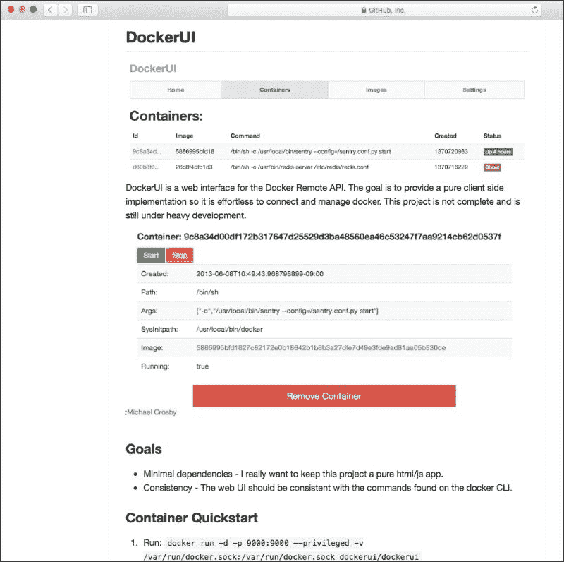
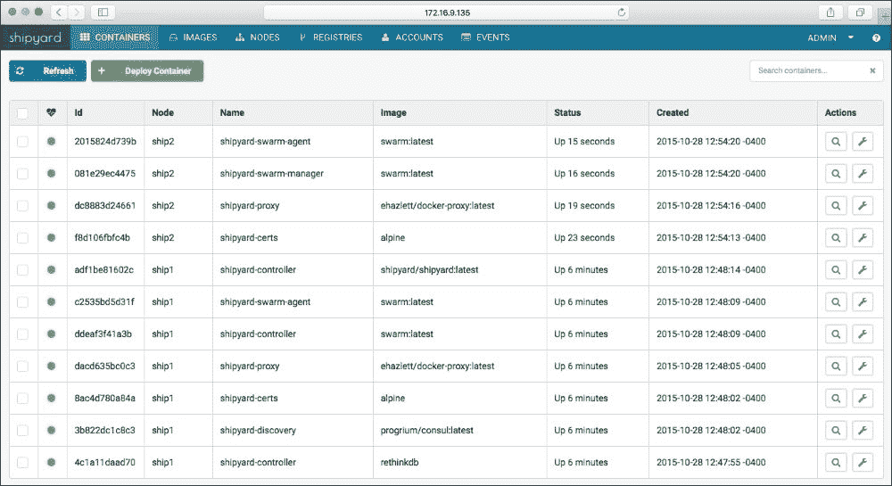
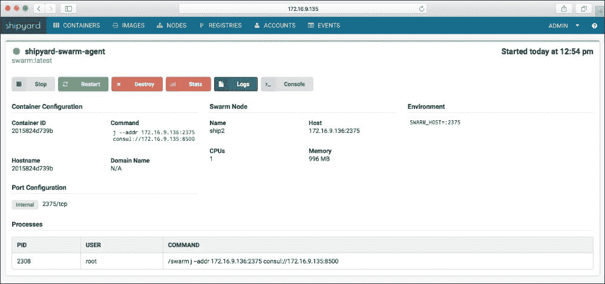

# 七、使用第三方工具保护 Docker

在本章中，让我们看一下使用第三方工具保护 Docker。这些工具不是 Docker 生态系统的一部分，您可以使用它们来帮助保护您的系统。我们将研究以下三个项目:

*   **流量授权**:这允许入站和出站流量由令牌代理验证，以确保服务之间的流量是安全的。
*   **召唤**:召唤是一个命令行工具，可以读取`secrets.yml`格式的文件，并将秘密作为环境变量注入任何进程。一旦这个过程结束，秘密就消失了。
*   **svert 和 SELinux**:svert是一个社区项目，集成了 **强制访问控制** ( **MAC** )安全性和基于 Linux 的虚拟化(**基于内核的虚拟机** ( **KVM** )、lguest 等等)。

然后，我们将添加一些额外的第三方工具的额外材料，这些工具非常有用和强大，值得作为有用的第三方工具获得一些认可。这些工具包括**Docker**、**Docker**、**船厂**和**Docker**。不用多说，让我们跳进去，开始我们的道路，以最安全的环境，我们可以获得。

# 第三方工具

那么，我们会重点关注哪些第三方工具呢？从前面的介绍中，您了解到我们将特别关注三种工具。这些将是流量授权、召唤和带有 SELinux 的病毒。这三个工具在不同方面都有帮助，可以用来执行不同的事情。我们将了解它们之间的差异，并帮助您确定实施哪些差异。您可以决定是否要全部实现它们，只实现其中的一个或两个，或者您可能觉得这些都不适合您当前的环境。然而，最好知道外面有什么，以防您的需求发生变化，并且您的 Docker 环境的整体架构会随着时间而变化。

## 交通授权

流量授权可以用来调节服务之间的 HTTP/HTTPS 流量。这涉及到转发器、看门人和令牌代理。这允许令牌代理验证入站和出站流量，以便确保服务之间的流量是安全的。每个容器运行一个网关守护设备，用于拦截所有 HTTP/HTTPS 入站流量，并通过授权头中的令牌验证其真实性。转发器也在每个容器上运行，像看门人一样，这也拦截流量；但是，它不会拦截入站流量，而是拦截出站流量，并将令牌放在授权头上。这些令牌是令牌代理发出的。还可以缓存这些令牌，以节省时间并最大限度地减少延迟的影响。让我们将其分解为一系列步骤，如下所示:

1.  服务甲向服务乙发起请求
2.  服务 A 上的转发器将向令牌代理进行身份验证。
3.  令牌代理将发布服务 A 将应用于授权头的令牌，并将请求转发给服务 b
4.  服务 B 的看门人将拦截该请求，并根据令牌代理验证授权头。
5.  一旦验证了授权头，就将其转发给服务 b

如您所见，这将对入站和出站请求应用额外的授权。正如我们将在下一节中看到的，您还可以使用召唤和流量授权来使用共享的秘密，这些秘密一旦被使用就可以使用，但是一旦应用完成了它的操作就消失了。

有关流量授权和 Docker 的更多信息，请访问[https://blog . invite . net/secure-Docker-with-secrets-dynamic-Traffic-Authorization](https://blog.conjur.net/securing-docker-with-secrets-and-dynamic-traffic-authorization)。

## 召唤

召唤是一个命令行工具，用于帮助传递秘密或你不想暴露的东西，比如密码或环境变量，然后这些秘密在退出进程时被处理掉。这很好，因为一旦秘密被使用并且进程退出，秘密就不再存在了。这意味着秘密不会一直存在，直到被手动删除或被攻击者发现用于恶意用途。让我们看看如何利用召唤。

call 通常使用三个文件:一个`secrets.yml`文件，用于执行动作或任务的脚本，以及 Dockerfile。正如您之前所了解的，或者基于您当前的 Docker 经验，Dockerfile 是帮助构建容器的基础，并提供了如何设置容器、安装什么、配置什么等说明。

使用召唤的一个很好的例子是能够将您的 AWS 凭证部署到一个容器中。为了利用 AWS 命令行界面，您需要一些应该保密的关键信息。这两条信息是您的 **AWS 访问密钥标识**和 **AWS 秘密访问密钥**。有了这两条信息，你就可以操纵某人的 AWS 账户，并在该账户内执行操作。让我们看一下其中一个文件的内容，`secrets.yml`文件:

```
secrets.yml
AWS_ACCESS_KEY_ID: !var $env/aws_access_key_id
AWS_SECRET_ACCESS_KEY: !var $env/aws_secret_access_key
```

`-D`选项用于替换值，而`$env`是替换变量的一个例子，因此，选项可以互换。

在前面的内容中，我们可以看到我们希望将这两个值传递到我们的应用中。有了这个文件、您想要部署的脚本文件和 Dockerfile，您现在就可以构建应用了。

我们只需在包含三个文件的文件夹中使用`docker build`命令:

```
$ docker build -t scottpgallagher/aws-deploy .

```

接下来，我们需要安装召唤，这可以通过一个简单的`curl`命令来完成，如下所示:

```
$ curl -sSL https://raw.githubusercontent.com/conjurinc/summon/master/install.sh | bash

```

现在我们已经安装了召唤，我们需要用召唤运行容器，并传递我们的秘密值(注意，这将只在 OS X 工作):

```
$ security add-generic-password -s "summon" -a "aws_access_key_id" -w "ACESS_KEY_ID"
$ security add-generic-password -s "summon" -a "aws_secret_access_key" -w "SECRET_ACCESS_KEY"

```

现在，我们已经准备好使用 call 运行 Docker，以便将这些凭证传递给容器:

```
$ summon -p ring.py docker run —env-file @ENVFILE aws-deploy

```

您也可以使用以下`cat`命令查看您传递的值:

```
$ summon -p ring.py cat @SUMMONENVFILE
aws_access_key_id=ACESS_KEY_ID
aws_secret_access_key=SECRET_ACCESS_KEY

```

`@SUMMONENVFILE`是一个内存映射文件，包含来自`secrets.yml`文件的值。

欲了解更多信息和查看利用召唤的其他选项，请访问[https://conjurinc.github.io/summon/#examples](https://conjurinc.github.io/summon/#examples)。

## 病毒和 SELinux

sVirt 是 SELinux 实现的一部分，但它通常被关闭，因为大多数人认为它是一个路障。唯一的拦路虎应该是学习 sVirt 和 SELinux。

sVirt 是一个开源的社区项目，为基于 Linux 的虚拟化实现 MAC 安全。您想要实现 sVirt 的一个原因是为了提高安全性，并增强系统抵御虚拟机管理程序中可能存在的任何错误的能力。这将有助于消除任何可能针对虚拟机或主机的攻击媒介。

请记住，Docker 主机上的所有容器共享 Docker 主机上运行的 Linux 内核的使用。如果主机上的这个 Linux 内核存在漏洞，那么在这个 Docker 主机上运行的所有容器都有可能很容易受到攻击。如果您实现了 sVirt，并且一个容器被破坏了，那么这个破坏不可能到达您的 Docker 主机，然后到达其他 Docker 容器。

sVirt 使用标签的方式与 SELinux 相同。下表列出了这些标签及其说明:

<colgroup class="calibre16"><col class="calibre17"> <col class="calibre17"> <col class="calibre17"></colgroup> 
| 

类型

 | 

SELinux 上下文

 | 

描述

 |
| --- | --- | --- |
| 虚拟机进程 | `system_u:system_r:svirt_t:MCS1` | `MCS1`是随机选择的 MCS 字段。目前，大约支持 500，000 个标签。 |
| 虚拟机映像 | `system_u:object_r:svirt_image_t:MCS1` | 只有带有相同 MCS 字段的标记为`svirt_t`的进程才能读取/写入这些映像文件和设备。 |
| 虚拟机共享读/写内容 | `system_u:object_r:svirt_image_t:s0` | 所有标有`svirt_t`的进程都可以写入`svirt_image_t:s0`文件和设备。 |
| 虚拟机映像 | `system_u:object_r:virt_content_t:s0` | 这是映像退出时使用的系统默认标签。不允许`svirt_t`虚拟进程读取带有此标签的文件/设备。 |

# 其他第三方工具

还有其他一些第三方工具确实值得在本章中提及，值得探索，看看它们能为您增加什么价值。现在，很多注意力似乎都集中在图形用户界面应用上，以帮助保护应用和基础架构的安全。以下实用程序将为您提供一些与您使用 Docker 工具运行的环境相关的选项。

### 注

请注意，在实现以下某些项目时，您应该小心谨慎，因为这可能会产生不必要的影响。确保在生产实施之前使用测试环境。

## 停靠站

dockersh 被设计为在支持多个交互式用户的机器上用作登录外壳替代。为什么这很重要？如果您还记得在 Docker 主机上处理 Docker 容器时出现的一些一般安全警告，您就会知道，无论谁有权访问 Docker 主机，都有权访问该 Docker 主机上所有正在运行的容器。使用 dockersh，您可以在每个容器的基础上隔离使用，只允许用户访问您希望他们访问的容器，同时保持对 Docker 主机的管理控制并保持最低的安全阈值。

这是帮助在每个容器的基础上隔离用户的理想方式，虽然容器通过利用 dockersh 有助于消除对 SSH 的需求，但是您可以消除对向每个需要容器访问的人提供对 Docker 主机的访问的恐惧。设置和调用 dockersh 需要很多信息，因此，如果您感兴趣，建议访问以下网址，了解更多关于 dockersh 的信息，包括如何设置并使用它:

[https://github . com/yelp/dock rsh](https://github.com/Yelp/dockersh)

## Docker

dockeri 是查看 Docker 主机内部情况的简单方法。DockerUI 的安装非常简单，只需运行一个简单的`docker run` 命令即可开始:

```
$ docker run -d -p 9000:9000 --privileged -v /var/run/docker.sock:/var/run/docker.sock dockerui/dockerui

```

要访问 DockerUI，您只需打开浏览器并导航到以下链接:

`http://<docker_host_ip>:9000`

这将在端口`9000`向世界打开你的 DockerUI，如下图所示:



您可以获得 Docker 主机及其生态系统的一般高级视图，并可以通过重新启动、停止或从停止状态启动来操作 Docker 主机上的容器。DockerUI 采用了一些运行命令行项目的陡峭学习曲线，并将它们放入您在网络浏览器中使用点击执行的动作中。

更多关于dockeri 的信息，请访问[https://github.com/crosbymichael/dockerui](https://github.com/crosbymichael/dockerui)。

## 船厂

船厂，像 DockerUI 一样，允许你使用图形用户界面来管理各个方面——主要是在你的容器中——并操纵它们。船厂正在 Docker Swarm 之上构建，这样你就可以利用 Docker Swarm 的特性集，在这里你可以管理多个主机和容器，而不是一次只关注一个主机及其容器。

使用船厂很简单，下面的`curl`命令重新进入画面:

```
$ curl -sSL https://shipyard-project.com/deploy | bash -s

```

设置完成后，要访问造船厂，您只需打开浏览器并导航到以下链接:

`http://<docker_host_ip>:8080`

正如我们在下面的截图中看到的，我们可以查看 Docker 主机上的所有容器:



我们还可以查看 Docker 主机上的所有映像，如下图所示:


我们还可以控制我们的容器，如下图所示:



船厂，像 dockeri 一样，允许您操纵您的 Docker 主机和容器，通过重新启动它们，停止它们，从失败的状态启动它们，或者部署新的容器并让它们加入 Swarm 集群。造船厂还允许您查看信息，如港口映射信息，即主机映射到容器的港口。这使您能够在需要时快速掌握重要信息，以解决任何与安全相关的问题。造船厂也有用户管理，而道克瑞缺乏这种能力。

有关船厂的更多信息，请访问以下网址:

*   [https://github.com/shipyard/shipyard](https://github.com/shipyard/shipyard)
*   [http://shipyard-project.com](http://shipyard-project.com)

## 日志包

当是一个需要解决的问题时，你会去哪里？大多数人会首先查看该应用的日志，看看它是否输出了任何错误。有了 Logspout，这就变成了一个更容易管理的任务，有许多多个运行的容器。使用 Logspout，您可以将每个容器的所有日志路由到您选择的位置。然后，您可以在一个地方解析这些日志。不需要从每个容器中取出日志并单独检查，您可以让日志喷口为您完成这项工作。

Logspout 的设置和我们看到的其他第三方解决方案一样简单。只需在每个 Docker 主机上运行以下命令即可开始收集日志:

```
$ docker run --name="logspout" \
 --volume=/var/run/docker.sock:/tmp/docker.sock \
 --publish=127.0.0.1:8000:8080 \
 gliderlabs/logspout

```

现在我们已经在一个区域收集了所有的容器日志，我们需要解析这些日志，但是我们该如何做呢？

```
$ curl http://127.0.0.1:8000/logs

```

又到了救援的`curl`命令！日志以容器名称作为前缀，并以某种方式着色，以便区分日志。您可以用 Docker 主机的 IP 地址替换`docker run`调用中的环回(`127.0.0.1`)地址，以便更容易连接，从而能够获取日志，并将端口从`8000`更改为您选择的。还有不同的模块可以用来获取和收集日志。

更多关于 Logspout 的信息，请访问[https://github.com/gliderlabs/logspout](https://github.com/gliderlabs/logspout)。

# 总结

在本章中，我们看了一些第三方工具，以便能够帮助保护 Docker 环境。我们主要看了三个工具:流量授权、召唤和带有 SELinux 的 sVirt。这三者可以通过不同的方式来帮助保护您的 Docker 环境，让您在一天结束时可以安心地在 Docker 容器中运行应用。我们了解了除了 Docker 提供的工具之外，还有哪些第三方工具可以帮助保护您的环境，从而在 Docker 上运行时保持应用的安全。

然后我们看了一些其他第三方工具。考虑到您的 Docker 环境设置，这些额外的工具对一些人来说是有价值的。其中一些工具包括 dockersh、DockerUI、船厂和 Logsprout。这些工具在仔细应用时，会增加额外的增强功能，有助于提高 Docker 配置的整体安全性。

在下一章中，我们将关注保持安全性。这些天围绕着安全问题发生了很多事情，有时很难知道在哪里可以找到更新的信息，也很难应用快速修复。

您将学习如何帮助实施将安全性放在首要位置的想法，并订阅电子邮件列表等内容，这些列表不仅包括 Docker，还包括与您使用 Linux 运行的环境相关的项目。其他项目还在继续关注与项目相关的事情，例如与 Docker 安全相关的 GitHub 问题，在 IRC 会议室关注，以及观看 CVE 等网站。