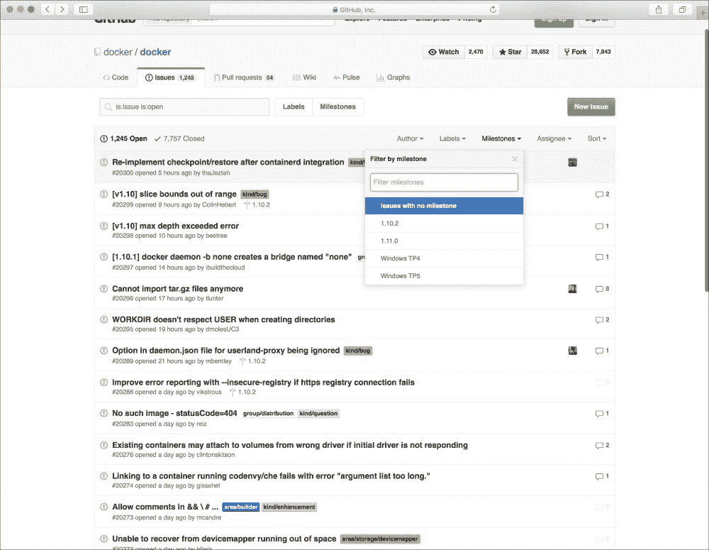
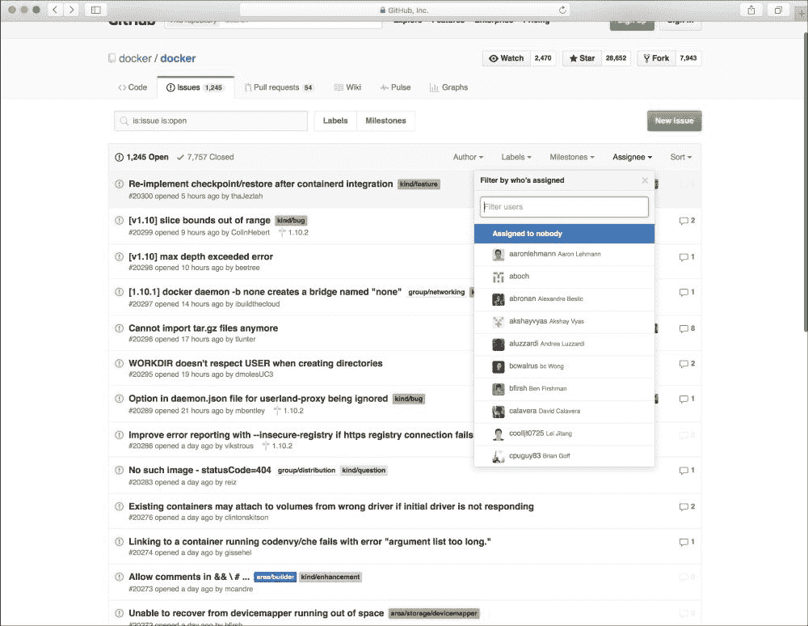
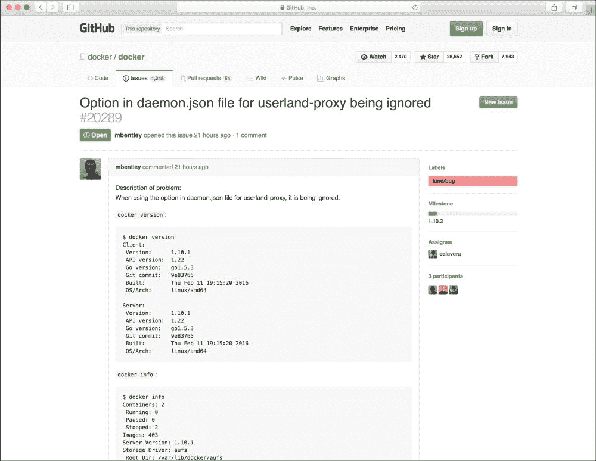

# 八、保持安全

在本章中，我们将了解与 Docker 相关的安全性。您可以通过什么方式来帮助了解您现在可能运行的 Docker 工具版本的最新安全问题？您如何在任何安全问题面前保持领先地位，并在面临威胁时保持您的环境安全？在本章中，我们将探讨多种方法，让您能够及时了解出现的任何安全问题，以及尽快获取信息的最佳方法。您将学习如何帮助实施将安全性放在首要位置的想法，并订阅电子邮件列表等内容，这些列表不仅包括 Docker，还包括与您使用 Linux 运行的环境相关的项目。其他项目还在继续关注 GitHub 等与 Docker 安全相关的问题，关注**互联网中继聊天** ( **IRC** )房间，并关注 CVE 等网站。

在本章中，我们将涵盖以下主题:

*   保持安全
    *   电子邮件列表选项
    *   GitHub 问题
    *   救援委会议室
    *   CVE 网站
*   其他感兴趣的领域

# 跟上安全

在本节中，我们将了解您可以获取或更新与 Docker 产品中可能出现的安全问题相关的信息的多种方式。虽然这不是您可以用来跟踪问题的完整工具列表，但这是一个很好的开始，包含了最常用的项目。这些项目包括电子邮件分发列表、针对 Docker 的 GitHub 问题跟踪、针对现有多种 Docker 产品的 IRC 聊天室、CVE 网站，以及与 Docker 产品相关的其他感兴趣的领域，例如 Linux 内核漏洞和您可以用来降低风险的其他项目。

## 电子邮件列表选项

Docker 运营两个邮件列表，用户可以注册成为其中的一部分。这些邮件列表提供了收集关于其他人正在处理的问题或项目的信息以及激发你的想法为你的环境做同样事情的方法。您还可以使用它们来帮助 Docker 社区覆盖您在使用各种 Docker 产品甚至与 Docker 产品相关的其他产品时遇到的问题。

### 两个电子邮件列表如下:

*   Docker-dev
*   Docker-用户

Docker-dev 邮件列表主要面向什么？你猜对了，是面向开发者的！这些人要么对开发人员类型角色和其他人正在开发的东西感兴趣，要么自己正在为可能集成到各种 Docker 产品中的东西开发代码。这可能是之类的东西，比如围绕 Docker Swarm 创建一个网络界面。这份名单将是你想张贴你的问题。该列表由其他开发人员组成，甚至可能包括那些在 Docker 本身工作的开发人员，他们可能能够帮助您解决您遇到的任何问题。

另一个列表，Docker-user 列表，面向各种 Docker 产品或服务的用户，并对如何使用产品/服务或如何将第三方产品与 Docker 集成有疑问。这可能包括如何将 **Heroku** 与 Docker 集成或在云中使用 Docker。如果你是 Docker 的用户，那么这个列表就是适合你的。如果你有先进的经验，或者你有经验或者以前处理过的事情，你也可以对这个列表有所贡献。

没有规则说你不能两者兼得。如果你想两全其美，你可以同时注册两个网站，测量每个网站的流量，然后根据你的兴趣所在，决定只上一个网站。您也可以选择不加入列表，只在每个列表的谷歌群组页面上跟随它们。

Docker-dev 列表的谷歌组页面是[https://groups.google.com/forum/#!forum/docker-dev](https://groups.google.com/forum/#!forum/docker-dev)，而 Docker-user 列表的谷歌组页面是[https://groups.google.com/forum/#!forum/docker-user](https://groups.google.com/forum/#!forum/docker-user)。

别忘了，你也可以在这些列表中搜索，看看你的问题是否已经得到了回答。因为这本书是关于安全性的，所以不要忘记你可以使用这两个邮件列表来讨论与安全性相关的项目——无论它们是与开发相关的还是与用户相关的。

## GitHub 问题

跟上安全相关问题的另一种方法是关注 GitHub 问题。由于 Docker 核心和其他各种 Docker 的代码，如 **机器、****合成**，以及所有其他代码都存储在 GitHub 上，因此它提供了一个区域。到底什么是 GitHub 问题，我为什么要关心它们，这可能是你现在正在问自己的问题。GitHub Issues 是 GitHub 使用的一个 bug 跟踪系统。通过跟踪这些问题，您可以查看其他人正在经历的问题，并在您自己的环境中超越它们，或者它可以在您的环境中解决问题，因为您知道其他人也有同样的问题，而且不仅仅是您的问题。你可以停止拉扯你剩下的头发。

由于每个 GitHub 存储库都有自己的问题部分，我们不需要查看每一个问题部分，但是我相信查看其中一个存储库的问题部分是值得的，这样您就可以知道您到底在查看什么，以便帮助解读所有内容。

以下截图(可在[https://github.com/docker/docker/issues](https://github.com/docker/docker/issues)找到)显示了 Docker 核心软件代码当前存在的所有问题:

从这个屏幕上，我们不仅可以看到有多少期是开放的，还可以知道有多少期是关闭的。这些问题曾经是一个问题，已经为它们找到了解决方案，现在它们已经关闭。关闭的是出于历史目的，以便能够回到过去，看看可能已经提供了什么解决方案来解决问题。

在下面的截图中，我们可以根据作者过滤问题，也就是提交问题的人:

在下面的截图中，我们还可以根据标签过滤问题，这些标签可能包括 **api** 、**内核**、**appamor**、 **selinux** 、 **aufs** 等等:

在下面的截图中，我们看到我们也可以按里程碑进行过滤:

里程碑本质上是标签，帮助基于为特定目的修复问题来对问题进行排序。它们也可以用来计划即将到来的发布。正如我们在这里看到的，其中一些包括 **Windows TP4** 和 **Windows TP5** 。

最后，我们可以根据受让人过滤问题，即被分配修复或解决问题的人，如下图截图所示:

正如我们所看到的，我们有很多方法可以过滤问题，但是一个问题实际上看起来像什么，它包含什么？让我们在下一节看一下。

在下面的截图中，我们可以看到实际问题的样子:

我们可以看到的一些信息是问题的标题和唯一的问题号。然后我们可以看到这个特定的问题是开放的，报告这个问题的人，以及开放了多长时间。我们可以然后看看对这个问题有多少评论，然后对这个问题本身进行一个大的解释。在右侧，我们可以看到该问题有哪些标签，它的里程碑是什么，它被分配给谁，以及有多少参与者参与了该问题。那些参与其中的人以某种方式对这个问题发表了评论。

在上一张图片的问题底部的最后一张图片中，我们可以看到问题的时间线，例如它被分配给谁和什么时候，以及它何时被分配了标签和任何附加注释。

## 救援委会议室

首先要了解的是到底什么是 IRC。如果你回想一下过去的日子，当我们有美国在线的时候，我们可能都有某种形式的 IRC 房间，并且有你可以根据你的位置或话题加入的聊天室。IRC 的运作方式与相同，即有一个服务器供客户端(如您自己)连接。这些房间通常基于人们可以聚在一起讨论的共同话题、产品或服务。您可以作为一个小组聊天，但也可以与您所在房间或频道的其他人进行私人聊天。

Docker 利用 IRC 来讨论其产品。这不仅允许产品的最终用户参与讨论，而且在 Docker 的情况下，大多数实际为 Docker 工作并处理这些产品的人往往每天都在这些房间里，并且会就您可能看到的问题或您有疑问的问题与您进行讨论。

使用 IRC，有多个服务器可以用来连接到托管频道。Docker 使用[http://freenode.net](http://freenode.net)服务器(如果您使用第三方客户端连接到 IRC，您将使用该服务器；但是，你也可以使用[http://webchat.freenode.net](http://webchat.freenode.net)，然后他们所有的产品渠道都是**#Docker**、**#Docker-开发**、**#Docker-群体**、**#Docker-撰写**、**#Docker-机器**。所有频道都以井号(#)开头，后跟频道名称。在这些渠道中，每个产品都有讨论。除了这些渠道，还有其他渠道可以讨论 Docker 相关的话题。在前一章中，我们讨论了造船厂项目，该项目允许您在 Docker Swarm 环境上覆盖一个图形用户界面。如果你对这个特定的产品有疑问，你可以加入那个产品的渠道，那就是**#船厂**。你也可以加入其他渠道，每天都有更多的机会。要获得频道列表，您需要连接到您的 IRC 客户端并发出命令。遵循给定的链接，了解如何做到这一点:

[http://irc.netsplit.de/channels/?net=freenode](http://irc.netsplit.de/channels/?net=freenode)

聊天档案也是为每个频道保存的，因此，你也可以搜索它们，以了解是否围绕你可能正在经历的问题或议题进行讨论。例如，如果您想查看 **#docker** 频道的日志，您可以在这里找到它们:

[https://bot bot . me/freenode/docker/](https://botbot.me/freenode/docker/)

您可以在以下网站搜索其他频道档案:

[https://botbot.me](https://botbot.me)

## CVE 网站

在[第 5 章](5.html#10DJ41-1dd319b8496b413ab834c68b79a4b65a "Chapter 5. Monitoring and Reporting Docker Security Incidents")、*监控和报告Docker安全事件*中，我们介绍了 CVE 和Docker CVE。下面列出了一些关于他们的记忆:

*   CVEs 可以在[https://cve.mitre.org/index.html](https://cve.mitre.org/index.html)找到
*   Docker相关的可以在 https://www.docker.com/docker-cve-database T2 找到
*   要搜索 CVE，请使用以下网址:[https://cve.mitre.org/index.html](https://cve.mitre.org/index.html)
*   如果您从前面的链接打开这个 CVE，您会看到它收集了一些信息，如下所示:
    *   CVE ID
    *   描述
    *   参考
    *   创建日期条目
    *   阶段
    *   投票
    *   评论
    *   被提议的

# 其他感兴趣的领域

关于安全性，您应该记住一些感兴趣的领域。正如我们在本书中讨论的那样，Linux 内核是 Docker 生态系统的关键部分。由于这个原因，保持内核尽可能的最新是非常重要的。关于更新，保持您正在使用的 Docker 产品也是最新的也很重要。大多数更新包括安全更新，因此，它们应该在发布新产品更新时更新。

当你想推广你的产品时，推特已经成为社交热点，Docker 也是如此。Docker 出于不同目的运营了几个帐户，它们如下所示。根据您使用的 Docker 的不同，遵循其中的一个或全部是明智的，如下列表所示:

*   **@docker**
*   @ dock status
*   @ dock warm
*   @ docermchin

Twitter 还利用标签，根据标签将推文组合在一起。对于 docker 来说，也是一样的，他们使用#docker hashtag，你可以在 Twitter 上搜索它来收集所有谈论 Docker 的推文。

我们最不想讨论的是堆栈溢出。Stack Overflow 是一个问答网站，使用投票来推广提供的答案，以帮助您以最快的方式获得最佳答案。堆栈溢出利用了一种类似于推特的方法来标记问题，这样你就可以搜索特定主题的所有问题。以下是可用于将所有 Docker 问题收集到一个搜索中的链接:

[http://stackoverflow.com/questions/tagged/docker](http://stackoverflow.com/questions/tagged/docker)

当您访问该网址时，您将看到一个问题列表，以及每个问题有多少票、答案数量、浏览量，以及其中一些问题上的绿色复选标记。被检查的答案是被提问者标记为接受的答案，这意味着这是最好的答案。监控 Docker 问题的一些人是那些为 Docker 工作的人，他们在幕后工作并提供最佳答案，因此，这是一个提出您可能有的任何问题的好地方。

# 总结

在本章中，我们研究了如何跟上安全相关的问题，这些问题不仅与您现在或不久的将来可能运行的 Docker 产品相关，而且还与安全问题(如内核问题)相关。由于 Docker 主机上的所有 Docker 容器都依赖于内核，因此内核非常重要。我们查看了您可以注册的多个邮件列表，以这种方式获得通知。加入 IRC 聊天室，关注 GitHub 问题，了解任何与安全相关的问题或任何目前不工作的问题，都可能会影响您的环境。在部署任何东西时，始终将安全性放在首位是非常重要的，虽然 Docker 本身是安全的，但总有人会利用任何给定的漏洞，因此，请尽可能保持您所有环境的安全和最新。