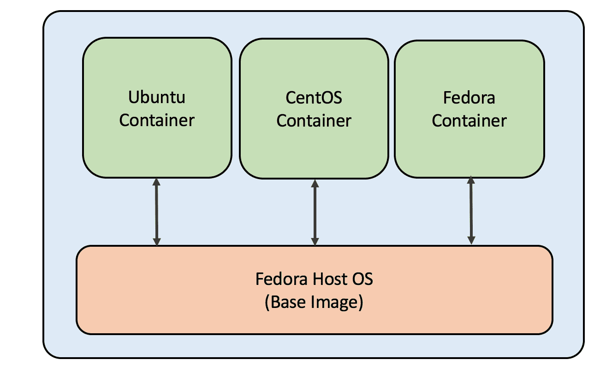
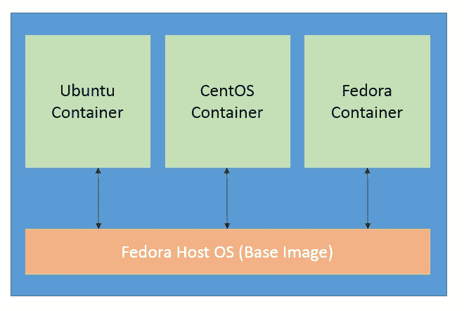
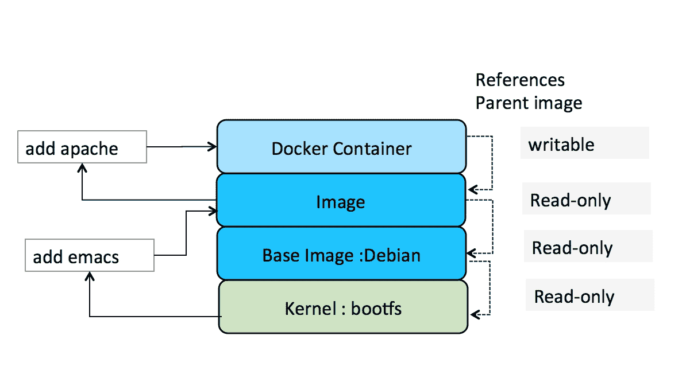
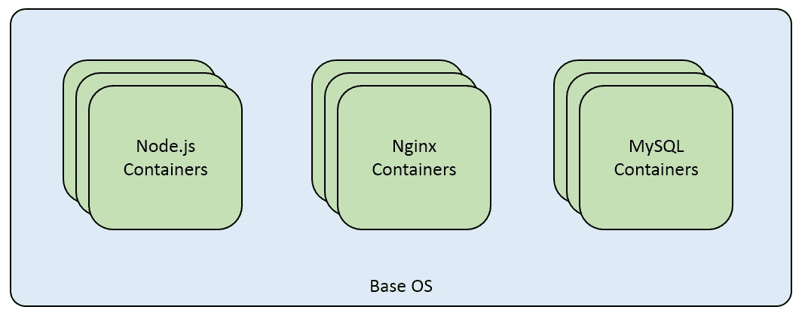
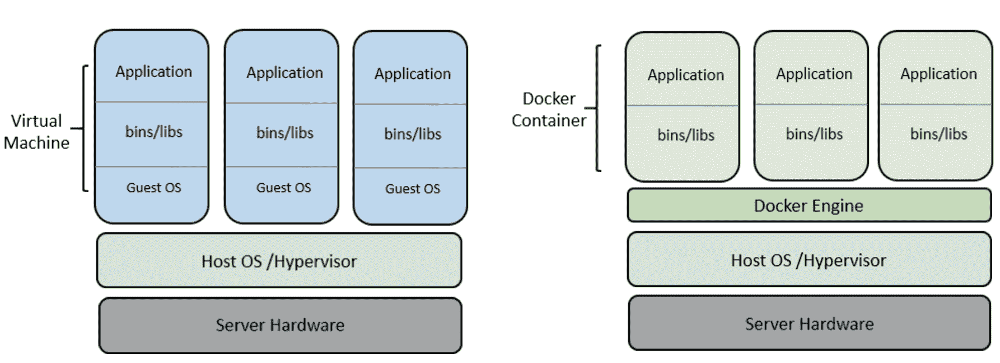

# 第一章。理解容器场景和 Docker 概述

Docker 是最近最成功的开源项目之一，它提供了作为轻量级容器的任何应用程序的打包、运输和运行。我们实际上可以将 Docker 容器与提供标准、一致的方式来运输任何应用程序的运输容器进行比较。Docker 是一个相当新的项目，在本书的帮助下，很容易解决 Docker 用户在安装和使用 Docker 容器时面临的一些常见问题。

在本章中，重点将放在以下主题上:

*   解码容器
*   潜入Docker
*   Docker 容器的优势
*   Docker生命周期
*   Docker 设计模式
*   单内核

# 解码容器

容器化是虚拟机的替代方案，它涉及应用程序的封装，并为其提供自己的操作环境。容器的基本基础是 **Linux 容器** ( **LXC** ，这是一个 Linux 内核包含特性的用户空间界面。借助强大的应用编程接口和简单的工具，它允许 Linux 用户创建和管理应用程序容器。LXC 容器介于`chroot`和成熟的虚拟机之间。容器化与传统虚拟机管理程序的另一个关键区别是，容器共享运行主机的操作系统所使用的 Linux 内核，因此在同一台机器上运行的多个容器使用相同的 Linux 内核。与虚拟机相比，它具有速度快、性能开销几乎为零的优势。

容器的主要用例在下面几节中列出。

## 操作系统容器

操作系统容器可以很容易地想象成一个**虚拟机** ( **虚拟机**)，但是与虚拟机不同的是，它们共享主机操作系统的内核，但提供用户空间隔离。与虚拟机类似，专用资源可以分配给容器，我们可以安装、配置和运行不同的应用程序、库等，就像您在任何虚拟机上运行一样。在可伸缩性测试中，操作系统容器很有帮助，在可伸缩性测试中，可以使用不同风格的发行版轻松部署一组容器，这与部署虚拟机相比要便宜得多。容器是由模板或映像创建的，这些模板或映像决定了容器的结构和内容。它允许您创建一个具有相同环境、相同包版本和所有容器配置的容器，这些容器主要用于开发环境设置。

有各种容器技术，如 LXC、OpenVZ、Docker 和 BSD 监狱，适用于操作系统容器:



基于操作系统的容器

## 应用容器

应用程序容器被设计为在包中运行单个服务，而之前解释过的操作系统容器可以支持多个进程。Docker 和 Rocket 推出后，应用程序容器吸引了很多人。

每当启动一个容器时，它都会运行一个进程。这个进程运行一个应用程序进程，但是在操作系统容器的情况下，它在同一个操作系统上运行多个服务。容器通常采用分层方法，如 Docker 容器，这有助于减少重复和增加重用。容器可以从所有组件共有的基本映像开始，然后我们可以继续在文件系统中添加特定于组件的层。分层文件系统有助于回滚更改，因为如果需要，我们可以简单地切换到旧的层。Dockerfile 中指定的`run`命令为容器添加了一个新层。

应用程序容器的主要目的是将应用程序的不同组件打包在不同的容器中。应用程序的不同组件被分别打包在容器中，然后在应用程序接口和服务的帮助下进行交互。分布式多组件系统部署是微服务架构的基本实现。在前面的方法中，开发人员可以根据自己的需求自由打包应用程序，而 IT 团队可以在多个平台上部署容器，以便横向和纵向扩展系统:

### 注

虚拟机管理程序是一个**虚拟机监视器** ( **VMM** )，用于允许多个操作系统运行并共享主机的硬件资源。每个虚拟机被称为来宾机。



Docker 层

以下简单示例解释了应用程序容器和操作系统容器之间的区别:

让我们考虑 web 三层架构的例子。我们有一个数据库层如 **MySQL** 或 **Nginx** 用于负载平衡，应用层为 **Node.js** :



操作系统容器

在操作系统容器的情况下，我们可以默认选择 Ubuntu 作为基本容器，并使用 Dockerfile 安装服务 MySQL、nginx 和 Node.js。这种类型的打包对于测试或开发设置来说是很好的，在测试或开发设置中，所有服务都打包在一起，并且可以在开发人员之间运送和共享。但是，在生产中部署这种体系结构不能用操作系统容器来完成，因为没有考虑数据的可扩展性和隔离。应用程序容器有助于满足这一用例，因为我们可以通过部署更多特定于应用程序的容器来扩展所需的组件，它还有助于满足负载平衡和恢复用例。对于前面的三层体系结构，每个服务都将被打包到单独的容器中，以便实现体系结构部署用例:


应用程序容器按比例增加

操作系统和应用程序容器之间的主要区别是:

<colgroup><col> <col></colgroup> 
| **操作系统容器** | **应用容器** |
| 意味着在同一个操作系统容器上运行多个服务 | 旨在运行单一服务 |
| 本质上，没有分层文件系统 | 分层文件系统 |
| 例如:LXC 监狱、开放监狱、BSD 监狱 | 例如:火箭的Docker |

## 潜入Docker

Docker 是近年来引起极大兴趣的容器实现。它巧妙地将各种 Linux 内核特性和服务(如名称空间、cgroups、SELlinux、AppArmor 配置文件等)与 Union 文件系统(如 AUFS 和 BTRFS)捆绑在一起，以制作模块化映像。这些映像为应用程序提供高度可配置的虚拟化环境，并遵循一次写入，随处运行的原则。一个应用程序可以像运行一个进程一样简单，也可以让高度可扩展的分布式进程协同工作。

Docker 凭借其卓越的性能和可普遍复制的体系结构，在行业中获得了巨大的吸引力，同时为现代应用程序开发提供了以下四大基石:

*   自治
*   分散
*   平行
*   隔离

此外，大规模适配 Thoughtworks 的微服务架构或大量小应用程序(T2、LOSA、T3)进一步为 Docker 技术带来了潜力。因此，像谷歌、VMware 和微软这样的大公司已经将 Docker 移植到他们的基础设施中，并且随着无数 Docker 初创公司的推出，即 Tutum、Flocker、Giantswarm 等的推出，这一势头仍在继续。

由于 Docker 容器可以在任何地方复制它们的行为，无论是您的开发机器、裸机服务器、虚拟机还是数据中心，应用程序设计人员可以将注意力集中在开发上，而操作语义则留给 DevOps。这使得团队工作流模块化、高效且高效。Docker 不要与 VM 混淆，尽管它们都是虚拟化技术。Docker 共享一个操作系统，同时为在容器中运行的应用程序提供足够的隔离和安全级别，它后来完全抽象出操作系统，并提供强大的隔离和安全保证。但是，与虚拟机相比，Docker 的资源占用很少，因此在经济性和性能方面更受青睐。然而，它仍然不能完全取代虚拟机，容器的使用是对虚拟机技术的补充:



虚拟机和 Docker 架构

## Docker容器的优势

以下是在微服务架构中使用 Docker 容器的一些优势:

*   **快速应用程序部署**:在最小的运行时间内，容器可以快速部署，因为只有应用程序被打包，所以容器的大小减少了。
*   **可移植性**:一个应用程序及其操作环境(依赖项)可以捆绑在一起，成为一个独立于 OS 版本或部署模型的 Docker 容器。Docker 容器可以很容易地转移到运行 Docker 容器的另一台机器上，并在没有任何兼容性问题的情况下执行。Windows 支持也将成为未来 Docker 版本的一部分。
*   **易于共享**:预构建的容器映像可以在公共存储库以及托管的私有存储库的帮助下轻松共享，供内部使用。
*   **轻量级占用空间**:即使是 Docker 映像也非常小，在容器的帮助下部署新应用程序的占用空间极小。
*   **可重用性**:Docker 容器的连续版本可以轻松构建，也可以在需要时轻松回滚到以前的版本。这使得它们明显很轻，因为来自先前存在的层的组件可以被重用。

## Docker生命周期

以下是 Docker 容器生命周期中涉及的一些基本步骤:

1.  Build the Docker image with the help of Dockerfile which contains all the commands required to be packaged. It can run in the following way:

    ```
    Docker build

    ```

    标签名称可以通过以下方式添加:

    ```
    Docker build -t username/my-imagename .

    ```

    如果 Dockerfile 存在于不同的路径，则可以通过提供`-f`标志来执行 Docker `build`命令:

    ```
    Docker build -t username/my-imagename -f /path/Dockerfile

    ```

2.  映像创建后，为了展开容器`Docker run`可以使用。可以借助`Docker ps`命令检查正在运行的容器，该命令列出了当前活动的容器。还有两个命令需要讨论:
    *   `Docker pause`:这个命令使用 cgroups 冰柜来暂停一个容器中运行的所有进程。在内部，它使用信号停止信号。只要需要，使用此命令可以轻松暂停和恢复进程。
    *   `Docker start`:此命令用于启动一个或多个停止的容器。
3.  容器使用完毕后，可以停止或杀死；`Docker stop:`命令将通过发送 SIGTERM 命令，然后发送 SIGKILL 命令，优雅地停止正在运行的容器。在这种情况下，仍然可以使用`Docker ps -a`命令列出容器。`Docker kill`将通过向容器内运行的主进程发送 SIGKILL 来杀死正在运行的容器。
4.  If there are some changes made to the container while it is running, which are likely to be preserved, a container can be converted back to an image by using the `Docker commit` after the container has been stopped:

    

    Docker生命周期

## Docker 设计模式

这里列出了八个 Docker 设计模式和例子。Dockerfile 是我们定义 Docker 映像的基础结构，它包含组装映像的所有命令。使用`Docker build`命令，我们可以创建一个自动构建，它执行前面提到的所有命令行指令来创建一个映像:

```
$ Docker build
Sending build context to Docker daemon 6.51 MB
...

```

这里列出的设计模式有助于创建在卷中持续存在的 Docker 映像，并提供各种其他灵活性，以便可以随时轻松地重新创建或替换它们。

### 基础影像共享

对于创建基于 web 的应用程序或博客，我们可以创建一个可以共享的基础映像，并帮助轻松部署应用程序。这种模式有助于将所有需要的服务打包到一个基本映像上，这样这个 web 应用程序博客映像就可以在任何地方重用:

```
    FROM debian:wheezy 
    RUN apt-get update 
    RUN apt-get -y install ruby ruby-dev build-essential git 
    # For debugging 
    RUN apt-get install -y gdb strace 
    # Set up my user 
    RUN useradd -u 1000 -ms /bin/bash vkohli 
       RUN gem install -n /usr/bin bundler 
    RUN gem install -n /usr/bin rake 
    WORKDIR /home/vkohli/ 
    ENV HOME /home/vkohli 
    VOLUME ["/home"] 
    USER vkohli 
    EXPOSE 8080 

```

前面的 Dockerfile 显示了创建基于应用程序的映像的标准方式。

### 注

Docker 映像是一个压缩文件，它是所有配置参数以及基础映像(操作系统内核)中所做更改的快照。

它在 Debian 基础映像上安装了一些特定的工具(Ruby 工具 rake 和 bundler)。它创建一个新用户，将其添加到容器映像中，并通过从主机挂载`"/home"`目录来指定工作目录，这将在下一节中详细解释。

### 共享卷

在主机级别共享卷允许其他容器获取它们需要的共享内容。这有助于更快地重建 Docker 映像，或者在添加、修改或删除依赖项时。例如，如果我们正在创建前面提到的博客的主页部署，则唯一需要共享的目录是通过 Dockerfile 与该 web 应用容器共享的`/home/vkohli/src/repos/homepage`目录，方式如下:

```
  FROM vkohli/devbase 
          WORKDIR /home/vkohli/src/repos/homepage 
          ENTRYPOINT bin/homepage web 

```

为了创建博客的开发版本，我们可以共享文件夹`/home/vkohli/src/repos/blog`，所有相关的开发人员文件都可以驻留在该文件夹中。为了创建开发版本映像，我们可以从预先创建的`devbase`中获取基础映像:

```
FROM vkohli/devbase 
WORKDIR / 
USER root 
# For Graphivz integration 
RUN apt-get update 
RUN apt-get -y install graphviz xsltproc imagemagick 
       USER vkohli 
         WORKDIR /home/vkohli/src/repos/blog 
         ENTRYPOINT bundle exec rackup -p 8080 

```

### 开发工具容器

出于开发的目的，我们在开发和生产环境中有独立的依赖关系，它们很容易在某个时候混合在一起。容器可以通过单独打包来区分依赖关系。如下面的代码所示，我们可以从基础映像中派生开发工具容器映像，并在其上安装开发依赖项，甚至允许`ssh`连接，以便我们可以处理代码:

```
FROM vkohli/devbase 
RUN apt-get update 
RUN apt-get -y install openssh-server emacs23-nox htop screen 

# For debugging 
RUN apt-get -y install sudo wget curl telnet tcpdump 
# For 32-bit experiments 
RUN apt-get -y install gcc-multilib  
# Man pages and "most" viewer: 
RUN apt-get install -y man most 
RUN mkdir /var/run/sshd 
ENTRYPOINT /usr/sbin/sshd -D 
VOLUME ["/home"] 
EXPOSE 22 
EXPOSE 8080 

```

从前面的代码中可以看出，安装了开发过程中需要的基础工具`wget`、`curl`、`tcpdump`。甚至安装了允许`ssh`连接到开发容器的 SSHD 服务。

### 测试环境容器

在不同的环境中测试代码总是会简化过程，并有助于孤立地发现更多的错误。我们可以在一个单独的容器中创建一个 Ruby 环境来生成一个新的 Ruby shell，并使用它来测试代码库:

```
FROM vkohli/devbase 
RUN apt-get update 
RUN apt-get -y install ruby1.8 git ruby1.8-dev 

```

在列出的 Dockerfile 中，我们使用基础映像作为`devbase`，只需一个命令`docker run`的帮助，就可以通过使用从这个 Dockerfile 创建的映像来测试代码，轻松创建一个新的环境。

### 构建容器

我们在应用程序中涉及的构建步骤有时会很昂贵。为了克服这一点，我们可以创建一个单独的构建容器，它可以使用构建过程中所需的依赖关系。以下 Dockerfile 可用于运行单独的构建过程:

```
FROM sampleapp 
RUN apt-get update 
RUN apt-get install -y build-essential [assorted dev packages for libraries] 
VOLUME ["/build"] 
WORKDIR /build 
CMD ["bundler", "install","--path","vendor","--standalone"] 

```

`/build`目录是可以用来提供编译后的二进制文件的共享目录，也可以在容器中挂载`/build/source`目录来提供更新后的依赖关系。因此，通过使用构建容器，我们可以在单独的容器中分离构建过程和最终的打包部分。它仍然通过将前面的过程分解成独立的容器来封装过程和依赖关系。

### 安装容器

该容器的目的是将安装步骤打包在不同的容器中。基本上，这是为了在生产环境中提供容器的部署。

将安装脚本打包到 Docker 映像中的示例 Docker 文件如下所示:

```
ADD installer /installer 
CMD /installer.sh 

```

`installer.sh`可以包含在生产环境中部署容器的特定安装命令，还可以为代理设置提供 DNS 条目，以便部署内聚环境。

### 盒装服务容器

为了在一个容器中部署完整的应用程序，我们可以捆绑多个服务来提供完整的部署容器。在这种情况下，我们将 web 应用程序、API 服务和数据库捆绑在一个容器中。它有助于减轻各种独立容器相互连接的痛苦:

```
services: 
  web: 
    git_url: git@github.com:vkohli/sampleapp.git 
    git_branch: test 
    command: rackup -p 3000 
    build_command: rake db:migrate 
    deploy_command: rake db:migrate 
    log_folder: /usr/src/app/log 
    ports: ["3000:80:443", "4000"] 
    volumes: ["/tmp:/tmp/mnt_folder"] 
    health: default 
  api: 
    image: quay.io/john/node 
    command: node test.js 
    ports: ["1337:8080"] 
    requires: ["web"] 
databases: 
  - "mysql" 
  - "redis" 

```

### 基础设施容器

正如我们在开发环境中谈到的容器使用，有一个大的类别丢失了-基础设施服务的容器使用，如代理设置，它提供了一个内聚的环境，以便提供对应用程序的访问。在下面提到的 Dockerfile 示例中，我们可以看到`haproxy`已安装，并提供了指向其配置文件的链接:

```
FROM debian:wheezy 
ADD wheezy-backports.list /etc/apt/sources.list.d/ 
RUN apt-get update 
RUN apt-get -y install haproxy 
ADD haproxy.cfg /etc/haproxy/haproxy.cfg 
CMD ["haproxy", "-db", "-f", "/etc/haproxy/haproxy.cfg"] 
EXPOSE 80 
EXPOSE 443 

```

`haproxy.cfg`文件是负责认证用户的配置文件:

```
backend test 
    acl authok http_auth(adminusers) 
    http-request auth realm vkohli if !authok 
    server s1 192.168.0.44:8084 

```

# 单核

Unikernels 将源代码编译成一个定制的操作系统，该系统只包含应用程序逻辑所需的功能，生成一个专用的单地址空间机器映像，从而消除不必要的代码。Unikernels 是使用*库操作系统*构建的，与传统操作系统相比，它具有以下优势:

*   **快速启动时间**:unikers 使资源调配高度动态化，可以在不到一秒钟的时间内启动
*   **占用空间小** : Unikernel 的代码库比传统的操作系统小，并且非常容易管理
*   **安全性提升**:由于没有部署不必要的代码，攻击面大幅减少
*   **细粒度优化**:unikers 是使用编译工具链构建的，并针对要使用的设备驱动程序和应用程序逻辑进行了优化

Unikernels 与微服务架构非常匹配，因为源代码和生成的二进制文件都可以很容易地进行版本控制，并且足够紧凑，可以重新构建。而另一方面，不允许修改虚拟机，只能对源代码进行更改，这既耗时又费力。例如，如果应用程序不需要磁盘访问和显示工具。Unikernels 可以帮助从内核中删除这个不必要的设备驱动程序和显示功能。因此，生产系统变得极简，仅打包应用程序代码、运行时环境和操作系统设施，这是不可变应用程序部署的基本概念，其中如果生产服务器中需要任何应用程序更改，则构建新映像:


从传统容器到基于 Unikernel 的容器的转变

容器和 Unikernels 是最适合彼此的。最近，Unikernel 系统已经成为 Docker 的一部分，这两种技术的协作将很快出现在 Docker 的下一个版本中。正如上图中所解释的，第一个图显示了打包一个支持多个 Docker 容器的虚拟机的传统方式。下一步显示了一个 1:1 的映射(每个虚拟机一个容器)，它允许每个应用程序是独立的，并提供更好的资源使用，但是为每个容器创建一个单独的虚拟机会增加开销。在最后一步中，我们可以看到 Unikernels 与当前现有 Docker 工具和生态系统的协作，其中容器将获得特定于其需求的内核低库环境。

在 Docker 工具链中采用 unikers 将加速 unikers 的进步，它将被广泛用作和理解为打包模型和运行时框架，使 unikers 成为另一种类型的容器。在为 Docker 开发人员进行 unikers 抽象之后，我们将能够选择使用传统的 Docker 容器或 Unikernel 容器来创建生产环境。

# 总结

在本章中，我们借助于应用程序和基于操作系统的容器研究了基本的容器化概念。本章中解释的它们之间的差异将明显帮助开发人员选择完全适合他们系统的容器化方法。我们已经介绍了 Docker 技术、它的优势以及 Docker 容器的生命周期。本章中解释的八种 Docker 设计模式清楚地展示了在生产环境中实现 Docker 容器的方法。在这一章的最后，介绍了 Unikernels 的概念，这是容器化领域未来的发展方向。在下一章中，我们将从 Docker 安装故障排除问题及其深层解决方案开始。