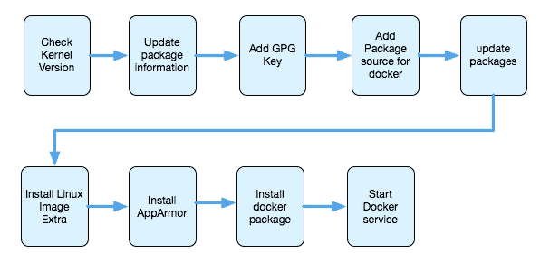
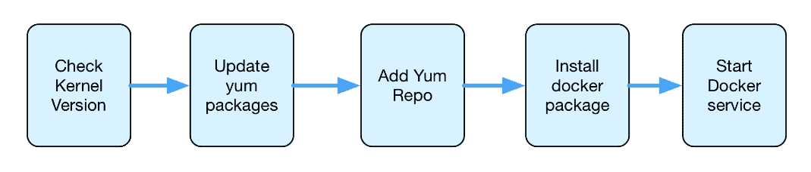
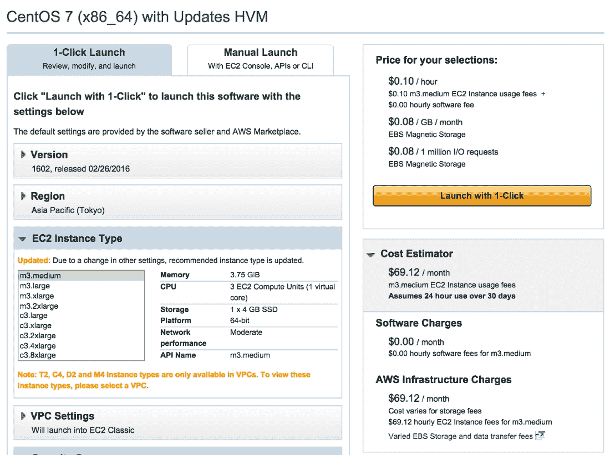
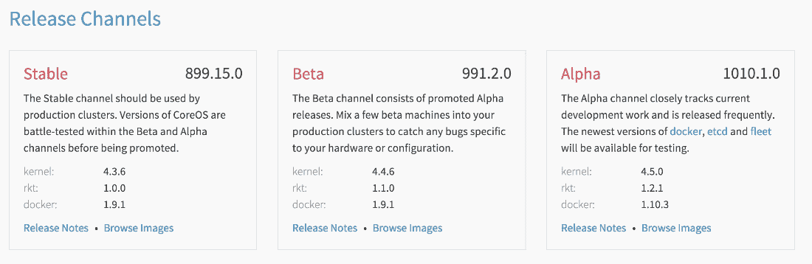
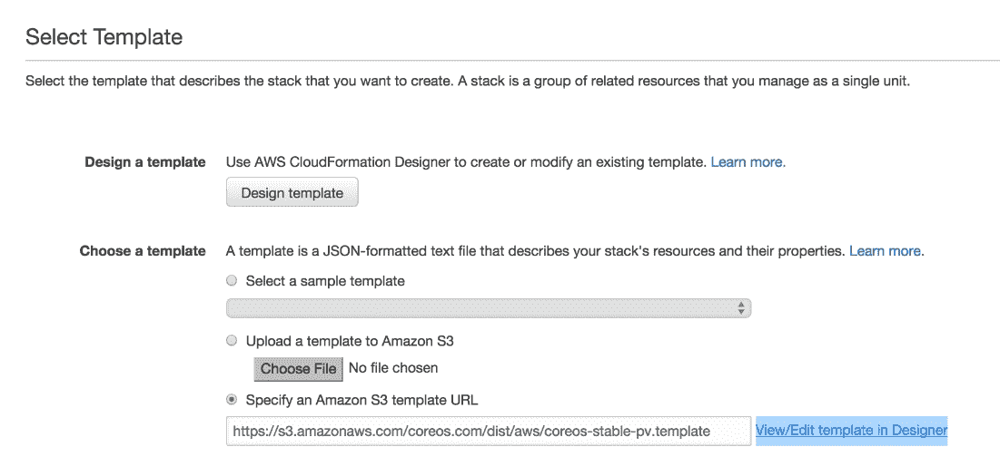
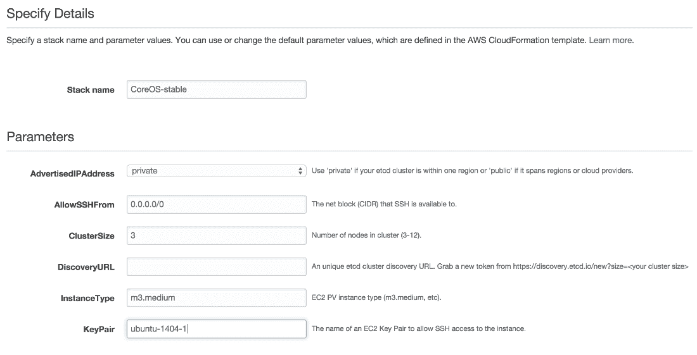
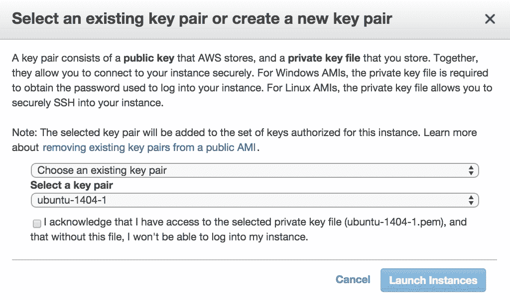

# 第二章。码头工人安装

在大多数操作系统中，Docker 的安装都非常顺利，出错的可能性很小。所有的 Linux、云、Windows 和 Mac OS X 环境都支持 Docker 引擎安装。如果不支持 Linux 版本，那么可以使用二进制文件安装 Docker Engine。Docker 二进制安装主要面向想要在各种操作系统上试用 Docker 的黑客。它通常包括检查运行时依赖关系、内核依赖关系，以及使用 Docker 平台特定的二进制文件，以便继续安装。

Docker 工具箱是一个安装程序，可以用来在你的 Windows 或 Mac 机器上快速安装和设置 Docker 环境。Docker 工具箱还安装了:

*   **Docker 客户端**:它通过与 Docker 守护进程通信来执行命令，如构建和运行，以及运送容器
*   **Docker Machine** :是用于在虚拟主机上安装 Docker Engine，并借助 Docker Machine 命令进行管理的工具
*   **Docker Compose** :是一个用来定义和运行多容器 Docker 应用程序的工具
*   **Kitematic** :运行在 Mac OS X 和 Windows 操作系统上的 Docker GUI

带有工具箱的 Docker 以及各种支持的操作系统的安装非常简单，但是我们已经列出了潜在的缺陷和涉及的故障排除步骤。

在本章中，我们将探讨如何在各种 Linux 发行版上安装 Docker，例如:

*   人的本质
*   Red Hat Linux
*   CentOS
*   韩国人
*   一种男式软呢帽
*   SUSE Linux

所有上述操作系统都可以部署在裸机上，但是我们在某些情况下使用了 AWS 进行部署，因为这是生产环境的理想情况。此外，在 AWS 中启动和运行环境会更快。我们已经在本章的相应章节中解释了相同的步骤，这将帮助您排除故障并加快在 AWS 上的部署。

# 在 Ubuntu 上安装坞站

让我们开始在 Ubuntu 14.04 LTS 64 位上安装 Docker。我们可以使用 AWS AMI 来创建我们的设置。借助以下链接，可以在 AMI 上直接启动映像:

[http://thecloudmarket.com/image/ami-a21529cc-Ubuntu-images-hvm-SSD-Ubuntu-trusty-14-04-amd64-server-2016 01 14-5](http://thecloudmarket.com/image/ami-a21529cc--ubuntu-images-hvm-ssd-ubuntu-trusty-14-04-amd64-server-20160114-5)

下图说明了在 Ubuntu 14.04 LTS 上安装 Docker 所需的安装步骤:



## 先决条件

无论 Ubuntu 版本如何，Docker 都需要 64 位安装。内核最低必须是 3.10。

让我们使用以下命令来检查我们的内核版本:

```
$ uname -r

```

输出是 3.13.x 的内核版本，这很好:

```
3.13.0-74-generic

```

## 更新包信息

执行以下步骤来更新 APT 存储库并安装必要的证书:

1.  Docker 的 APT 存储库包含 Docker 1.7.x 或更高版本。要设置 APT 使用新存储库中的包:

    ```
     $ sudo apt-get update 

    ```

2.  运行以下命令，确保 APT 使用 HTTPS 方法，并且安装了 CA 证书:

    ```
     $ sudo apt-get install apt-transport-https ca-certificates 

    ```

`apt-transport-https`包使我们能够使用`/etc/apt/sources.list`中的`deb https://foo distro main`行，这样使用`libapt-pkg`库的包管理器就可以访问可通过 HTTPS 访问的源中的元数据和包。

`ca-certificates`是 CA 证书的容器 PEM 文件，它允许基于 SSL 的应用程序检查 SSL 连接的真实性。

## 添加新的 GPG 键

**GNU 隐私卫士**(被称为 **GPG** 或 **GnuPG)** 是一款符合 OpenPGP (RFC4880)标准的免费加密软件:

```
$ sudo apt-key adv --keyserver hkp://p80.pool.sks-keyservers.net:80 --recv-keys 58118E89F3A912897C070ADBF76221572C52609D 

```

输出将类似于下面的列表:

```
Executing: gpg --ignore-time-conflict --no-options --no-default-keyring --homedir /tmp/tmp.SaGDv5OvNN --no-auto-check-trustdb --trust-model always --keyring /etc/apt/trusted.gpg --primary-keyring /etc/apt/trusted.gpg --keyserver hkp://p80.pool.sks-keyservers.net:80 --recv-keys 58118E89F3A912897C070ADBF76221572C52609D 
gpg: requesting key 2C52609D from hkp server p80.pool.sks-keyservers.net 
gpg: key 2C52609D: public key "Docker Release Tool (releasedocker) <docker@docker.com>" imported 
gpg: Total number processed: 1 
gpg:               imported: 1  (RSA: 1)

```

## 故障排除

如果发现`sks-keyservers`不可用，可以尝试以下命令:

```
$ sudo apt-key adv --keyserver hkp://pgp.mit.edu:80 --recv-keys 58118E89F3A912897C070ADBF76221572C52609D 

```

## 为 Docker 添加新的包源

可以通过以下方式将 Docker 存储库添加到 APT 存储库中:

1.  用一个新的源作为 Docker 存储库来更新`/etc/apt/sources.list.d`。
2.  打开`/etc/apt/sources.list.d/docker.list`文件，用以下条目更新:

    ```
     deb https://apt.dockerproject.org/repo ubuntu-trusty main

    ```

## 更新 Ubuntu 包

添加 Docker 存储库后的 Ubuntu 包可以更新，如下所示:

```
$ sudo apt-get update

```

## 额外安装 linux 映像

对于 Ubuntu Trusty，建议安装`linux-image-extra`内核包；`linux-image-extra`包允许使用 AUFS 存储驱动程序:

```
$ sudo apt-get install linux-image-extra-$(uname -r) 

```

输出将类似于下面的列表:

```
Reading package lists... Done 
Building dependency tree        
Reading state information... Done 
The following extra packages will be installed: 
  crda iw libnl-3-200 libnl-genl-3-200 wireless-regdb 
The following NEW packages will be installed: 
  crda iw libnl-3-200 libnl-genl-3-200 linux-image-extra-3.13.0-74-generic 
  wireless-regdb 
0 upgraded, 6 newly installed, 0 to remove and 70 not upgraded. 
Need to get 36.9 MB of archives. 
After this operation, 152 MB of additional disk space will be used. 
Do you want to continue? [Y/n] Y 
Get:1 http://ap-northeast-1.ec2.archive.ubuntu.com/ubuntu/ trusty/main libnl-3-200 amd64 3.2.21-1 [44 ..
Updating /boot/grub/menu.lst ... done 
run-parts: executing /etc/kernel/postinst.d/zz-update-grub 3.13.0-74-generic /boot/vmlinuz-3.13.0-74-generic 
Generating grub configuration file ... 
Found linux image: /boot/vmlinuz-3.13.0-74-generic 
Found initrd image: /boot/initrd.img-3.13.0-74-generic 
done 
Processing triggers for libc-bin (2.19-0ubuntu6.6) ...

```

## 可选-安装设备

如果尚未安装，请使用以下命令安装 AppArmor:

```
$ apt-get install apparmor

```

输出将类似于下面的列表:

```
sudo: unable to resolve host ip-172-30-0-227 
Reading package lists... Done 
Building dependency tree        
Reading state information... Done 
apparmor is already the newest version. 
0 upgraded, 0 newly installed, 0 to remove and 70 not upgraded.

```

## 码头工人安装

让我们开始使用官方 APT 包在 Ubuntu 上安装 Docker 引擎:

1.  更新 APT 包索引:

    ```
     $ sudo apt-get update

    ```

2.  安装码头工人引擎:

    ```
     $ sudo apt-get install docker-engine 

    ```

3.  启动坞站守护程序:

    ```
     $ sudo service docker start 

    ```

4.  确认 Docker 安装正确:

    ```
     $ sudo docker run hello-world 

    ```

5.  这就是输出的样子:

    ```
     Latest: Pulling from library/hello-world 
            03f4658f8b78: Pull complete  
            a3ed95caeb02: Pull complete  
            Digest: sha256:8be990ef2aeb16dbcb9271ddfe2610fa6658d13f6dfb8b
            c72074cc1ca36966a7 
            Status: Downloaded newer image for hello-world:latest 
            Hello from Docker. 
            This message shows that your installation appears to be working 
            correctly.

    ```

# 在红帽 Linux 上安装 Docker

红帽企业版 Linux 7.x 支持 Docker。本节提供了使用 Docker 管理的发行包和安装机制安装 Docker 的概述。使用这些包可以确保您能够获得 Docker 的最新版本。



## 检查内核版本

可以在以下命令的帮助下检查 Linux 内核版本:

```
$ uname -r

```

在我们的例子中，输出是内核版本 3.10.x，它将正常工作:

```
3.10.0-327.el7.x86 _64

```

## 更新百胜包

可以使用以下命令更新 YUM 存储库:

```
$ sudo yum update

```

给出了输出列表；确保在最后显示`Complete!`，如下:

```
Loaded plugins: amazon-id, rhui-lb, search-disabled-repos 
rhui-REGION-client-config-server-7       | 2.9 kB   
.... 
Running transaction check 
Running transaction test 
Transaction test succeeded 
Running transaction 
  Installing : linux-firmware-20150904-43.git6ebf5d5.el7.noarch      1/138  
  Updating   : tzdata-2016c-1.el7.noarch                             2/138  
  ....                              
Complete! 

```

## 添加 YUM 存储库

让我们将 Docker 存储库添加到 YUM 存储库列表中:

```
$ sudo tee /etc/yum.repos.d/docker.repo <<-EOF 
[dockerrepo] 
name=Docker Repository 
baseurl=https://yum.dockerproject.org/repo/main/centos/7 
enabled=1 
gpgcheck=1 
gpgkey=https://yum.dockerproject.org/gpg 
EOF

```

## 安装码头工人包

可以使用 YUM 存储库安装 Docker 引擎，如下所示:

```
$ sudo yum install docker-engine

```

## 启动码头工人服务

Docker 服务可以在以下命令的帮助下启动:

```
$ sudo service docker start
Redirecting to /bin/systemctl start docker.service

```

## 测试码头工人安装

借助以下命令列出 Docker 引擎中的所有进程可以验证 Docker 服务的安装是否成功:

```
$ sudo docker ps -a

```

以下是前面命令的输出:

```
CONTAINER   ID   IMAGE   COMMAND   CREATED   STATUS   PORTS   NAMES

```

检查 Docker 版本，确保它是最新的:

```
$ docker --version
Docker version 1.11.0, build 4dc5990

```

## 检查安装参数

让我们运行 Docker 信息来查看默认安装参数:

```
$ sudo docker info

```

这里给出了输出列表；注意`Storage Driver`是`devicemapper`:

```
Containers: 0 
 Running: 0 
 Paused: 0 
 Stopped: 0 
Images: 0 
Server Version: 1.11.0 
Storage Driver: devicemapper 
 Pool Name: docker-202:2-33659684-pool 
 Pool Blocksize: 65.54 kB 
 Base Device Size: 10.74 GB 
 Backing Filesystem: xfs 
 Data file: /dev/loop0 
 Metadata file: /dev/loop1 
... 
Cgroup Driver: cgroupfs 
Plugins:  
 Volume: local 
 Network: null host bridge 
Kernel Version: 3.10.0-327.el7.x86_64 
Operating System: Red Hat Enterprise Linux Server 7.2 (Maipo) 
OSType: linux 
Architecture: x86_64 
CPUs: 1 
Total Memory: 991.7 MiB 
Name: ip-172-30-0-16.ap-northeast-1.compute.internal 
ID: VW2U:FFSB:A2VP:DL5I:QEUF:JY6D:4SSC:LG75:IPKU:HTOK:63HD:7X5H 
Docker Root Dir: /var/lib/docker 
Debug mode (client): false 
Debug mode (server): false 
Registry: https://index.docker.io/v1/

```

## 故障排除提示

确保您使用的是红帽 Linux 的最新版本，以便能够部署 Docker 1.11。另一件需要记住的重要事情是内核版本必须是 3.10 或更高版本。安装的其余部分相当平淡无奇。

# 在 AWS 上部署 CentOS 虚拟机，运行 Docker 容器

我们使用 AWS 作为一个环境，从方便的角度展示 Docker 安装。如果一个操作系统需要测试其 Docker 版本的支持，AWS 是部署和测试它最简单快捷的方法。

如果您没有使用 AWS 作为环境，可以跳过在 AWS 上旋转虚拟机的步骤。

在本节中，我们将了解如何在 AWS 上部署 CentOS 虚拟机，以快速启动和运行环境，并部署 Docker 容器。CentOS 类似于红帽的发行版，使用了和 YUM 一样的打包工具。我们将使用 CentOS 7.x，Docker 正式支持该版本:

首先，让我们在 AWS 上启动一个基于 CentOS 的虚拟机:


我们将使用**1-点击启动**和预先存在的密钥空气启动。默认情况下，SSH 处于启用状态:



实例启动后，从 AWS EC2 控制台获取公共 IP 地址。

SSH 进入实例，并按照以下步骤进行安装:

```
$ ssh -i "ubuntu-1404-1.pem" centos@54.238.154.134

```


## 检查内核版本

可以使用以下命令检查 Linux 操作系统的内核版本:

```
$ uname -r

```

在我们的例子中，输出是内核版本 3.10.x，它将正常工作:

```
3.10.0-327.10.1.el7.x86_64

```

注意它与红帽内核版本 3.10.0-327.el7.x86_64 有多相似。

## 更新百胜包

YUM 包和存储库可以更新，如下所示:

```
$ sudo yum update 
Output listing is given, make sure it shows complete at the end 

Loaded plugins: fastestmirror 
base                                                     | 3.6 kB     00:00      
extras                                                   | 3.4 kB     00:00      
updates                                                  | 3.4 kB     00:00      
(1/4): base/7/x86_64/group_gz                            | 155 kB   00:00      
(2/4): extras/7/x86_64/primary_db                        | 117 kB   00:00      
(3/4): updates/7/x86_64/primary_db                       | 4.1 MB   00:00      
(4/4): base/7/x86_64/primary_db                          | 5.3 MB   00:00      
Determining fastest mirrors 
 * base: ftp.riken.jp 
 * extras: ftp.riken.jp 
 * updates: ftp.riken.jp 
Resolving Dependencies 
--> Running transaction check 
---> Package bind-libs-lite.x86_64 32:9.9.4-29.el7_2.2 will be updated 
---> Package bind-libs-lite.x86_64 32:9.9.4-29.el7_2.3 will be an update 
---> Package bind-license.noarch 32:9.9.4-29.el7_2.2 will be updated 
---> Package bind-license.noarch 32:9.9.4-29.el7_2.3 will be an update 
.... 
  teamd.x86_64 0:1.17-6.el7_2                                                    
  tuned.noarch 0:2.5.1-4.el7_2.3                                                 
  tzdata.noarch 0:2016c-1.el7                                                    
  util-linux.x86_64 0:2.23.2-26.el7_2.2                                          
Complete!

```

## 添加 YUM 存储库

让我们将 Docker 存储库添加到 YUM 存储库中:

```
$ sudo tee /etc/yum.repos.d/docker.repo <<-EOF 
[dockerrepo] 
name=Docker Repository 
baseurl=https://yum.dockerproject.org/repo/main/centos/7 
enabled=1 
gpgcheck=1 
gpgkey=https://yum.dockerproject.org/gpg 
EOF

```

## 安装码头工人包

以下命令可用于使用 YUM 存储库安装 Docker 引擎:

```
$ sudo yum install docker-engine

```

## 启动码头工人服务

Docker 服务可以通过以下方式启动:

```
$ sudo service docker start 
Redirecting to /bin/systemctl start docker.service

```

## 测试码头工人安装

```
$ sudo docker ps -a

```

输出:

```
CONTAINER ID IMAGE COMMAND CREATED STATUS PORTS NAMES 

```

检查 Docker 版本，确保它是最新的:

```
$ docker --version
Docker version 1.11.0, build 4dc5990

```

## 检查安装参数

让我们运行 Docker 信息来查看默认安装参数:

```
$ sudo docker info

```

这里列出了输出；注意`Storage Driver`是`devicemapper`:

```
Server Version: 1.11.0 
Storage Driver: devicemapper 
 ... 
Kernel Version: 3.10.0-327.10.1.el7.x86_64 
Operating System: CentOS Linux 7 (Core) 
OSType: linux 
Architecture: x86_64 
CPUs: 1 
Total Memory: 991.7 MiB 
Name: ip-172-30-0-236 
ID: EG2K:G4ZR:YHJ4:APYL:WV3S:EODM:MHKT:UVPE:A2BE:NONM:A7E2:LNED 
Docker Root Dir: /var/lib/docker 
Registry: https://index.docker.io/v1/

```

# 在韩文上安装坞站

CoreOS 是为云构建的轻量级操作系统。它预装了 Docker，比最新版本晚了几个版本。因为它预建了 Docker，所以几乎不需要故障排除。我们只需要确保选择了正确版本的 CoreOS。

CoreOS 在各种平台上运行，包括 float、Amazon EC2、QEMU/KVM、VMware 和 OpenStack 以及定制硬件。CoreOS 使用 fleet 和 etcd(键值数据存储)来管理集装箱集群。

## CoreOS 的安装通道

在我们的案例中，我们将使用稳定的**释放通道**:



首先，我们将使用云信息模板在 AWS 上安装 CoreOS。您可以在以下链接找到此模板:

[https://S3 . Amazon ws . com/coreos . com/dist/AWS/coreos-stable-PV . template](https://s3.amazonaws.com/coreos.com/dist/aws/coreos-stable-pv.template)中

该模板提供以下参数:

*   实例类型
*   集群大小
*   发现 URL
*   公布的 IP 地址
*   允许 SSH 从
*   Keypair(密钥对)

这些参数可以在默认模板中设置，如下所示:

```
{ 
  "Parameters": { 
    "InstanceType": { 
      "Description": "EC2 PV instance type (m3.medium, etc).", 
      "Type": "String", 
      "Default": "m3.medium", 
      "ConstraintDescription": "Must be a valid EC2 PV instance type." 
    }, 
    "ClusterSize": { 
      "Default": "3", 
      "MinValue": "3", 
      "MaxValue": "12", 
      "Description": "Number of nodes in cluster (3-12).", 
      "Type": "Number" 
    }, 
    "DiscoveryURL": { 
      "Description": "An unique etcd cluster discovery URL. Grab a new token from https://discovery.etcd.io/new?size=<your cluster size>", 
      "Type": "String" 
    }, 
    "AdvertisedIPAddress": { 
      "Description": "Use 'private' if your etcd cluster is within one region or 'public' if it spans regions or cloud providers.", 
      "Default": "private", 
      "AllowedValues": [ 
        "private", 
        "public" 
      ], 
      "Type": "String" 
    }, 
    "AllowSSHFrom": { 
      "Description": "The net block (CIDR) that SSH is available to.", 
      "Default": "0.0.0.0/0", 
      "Type": "String" 
    }, 
    "KeyPair": { 
      "Description": "The name of an EC2 Key Pair to allow SSH access to the instance.", 
      "Type": "String" 
    } 
  } 
} 

```

以下步骤将在截图的帮助下提供在 AWS 上安装 CoreOS 的完整步骤:

1.  Select the S3 template to launch:

    

2.  Specify the **Stack name**, **KeyPair**, and cluster 3:

    

## 故障排除

以下是一些故障排除提示和指南，在之前的安装过程中应遵循这些提示和指南:

*   **栈名**不能重复
*   **集群大小**不能小于 3，最大值应为 12
*   **实例类型**推荐为`m3.medium`
*   **KeyPair** 应该存在；如果没有，集群将不会启动

SSH 进入实例并检查 Docker 版本:

```
core@ip-10-184-155-153 ~ $ docker --version 
Docker version 1.9.1, build 9894698

```

# 在 Fedora 上安装 Docker

Fedora 版本 22 和 23 支持 Docker。以下是在 Fedora 23 上安装 Docker 需要执行的步骤。它可以部署在裸机上或作为虚拟机。

## 检查 Linux 内核版本

Docker 需要 64 位安装，与 Fedora 版本无关。此外，内核版本至少应该是 3.10。使用以下命令继续安装之前，请检查内核版本:

```
$ uname -r
4.4.7-300.fc23.x86_64
Switch to root user
[os@osboxes ~]# su -
Password:
[root@vkohli ~]#

```

## 与 DNF 一起安装

使用以下命令更新现有的 DNF 软件包:

```
$ sudo dnf update 

```

## 添加到 YUM 存储库中

让我们将 Docker 存储库添加到 YUM 存储库中:

```
$ sudo tee /etc/yum.repos.d/docker.repo <<-'EOF' 
> [dockerrepo] 
> name=Docker Repository 
> baseurl=https://yum.dockerproject.org/repo/main/fedora/$releasever/ 
> enabled=1 
> gpgcheck=1 
> gpgkey=https://yum.dockerproject.org/gpg 
> EOF 
[dockerrepo] 
name=Docker Repository 
baseurl=https://yum.dockerproject.org/repo/main/fedora/$releasever/ 
enabled=1 
gpgcheck=1 
gpgkey=https://yum.dockerproject.org/gpg

```

## 安装码头工人包

可以使用 DNF 软件包安装 Docker 引擎:

```
$ sudo dnf install docker-engine

```

输出将类似于下面的列表(此列表被截断):

```
Docker Repository                                32 kB/s | 7.8 kB     00:00 
Last metadata expiration check: 0:00:01 ago on Thu Apr 21 15:45:25 2016\. 
Dependencies resolved. 
Install  7 Packages 
... 
Running transaction test 
Transaction test succeeded. 
Running transaction 
  Installing: python-IPy-0.81-13.fc23.noarch                                                                     .... 
Installed: 
... 
Complete!

```

使用`systemctl`启动 Docker 服务:

```
$ sudo systemctl start docker 

```

使用 Docker hello-world 示例进行验证，以检查 Docker 是否安装成功:

```
[root@osboxes ~]# docker run hello-world 

```

输出将类似于下面的列表:

```
Unable to find image 'hello-world:last' locally 
latest: Pulling from library/hello-world 
03f4658f8b78: Pull complete 
a3ed95caeb02: Pull complete 
Digest: sha256:8be990ef2aeb16dbcb9271ddfe2610fa6658d13f6dfb8bc72074cc1ca36966a7 
Status: Downloaded newer image for hello-world:latest 

Hello from Docker. 
This message shows that your installation appears to be working correctly.

```

为了生成此消息，Docker 采取了以下步骤:

1.  Docker 客户端联系了 Docker 守护程序。
2.  码头工人守护程序从码头工人中心提取`hello-world`映像。
3.  Docker 守护程序根据该映像创建了一个新的容器，该容器运行产生您当前正在读取的输出的可执行文件。
4.  Docker 守护程序将该输出流式传输到 Docker 客户端，后者将其发送到您的终端。

要尝试更有野心的东西，可以使用以下命令运行 Ubuntu 容器:

```
$ docker run -it ubuntu bash

```

使用免费的 Docker Hub 帐户[https://hub.docker.com](https://hub.docker.com)共享图像、自动化工作流等。

更多示例和想法，请访问[https://docs.docker.com/userguide/md64-server-20160114.5(ami-a 21529 cc)](https://docs.docker.com/engine/userguide/)。

# 用脚本安装 Docker

更新您的 DNF 套餐，如下所示:

```
$ sudo dnf update

```

## 运行 Docker 安装脚本

Docker 安装也可以通过执行 shell 脚本并从 Docker 官方网站获取脚本来快速简单地完成:

```
$ curl -fsSL https://get.docker.com/ | sh
+ sh -c 'sleep 3; dnf -y -q install docker-engine'

```

启动停靠守护进程:

```
$ sudo systemctl start docker

```

码头工人运行`hello-world`:

```
$ sudo docker run hello-world

```

要创建 Docker 组并添加用户，请按照上述步骤操作，如下所示:

```
$ sudo groupadd docker 
$ sudo usermod -aG docker your_username

```

注销并以用户身份登录，以确保您的用户创建成功:

```
$ docker run hello-world

```

要卸载 Docker，请执行以下步骤:

```
# sudo dnf -y remove docker-engine.x86_64

```

前面命令的截断输出如下所示:

```
Dependencies resolved. 
Transaction Summary 
================================================================ 
Remove  7 Packages 
Installed size: 57 M 
Running transaction check 
Transaction check succeeded. 
Running transaction test 
Transaction test succeeded. 
Running transaction 
... 
Complete! 
[root@osboxes ~]# rm -rf /var/lib/docker

```

# 在 SUSE Linux 上安装坞站

在本节中，我们将在 SUSE Linux 企业服务器 12 SP1 x86_64 (64 位)上安装 Docker。我们还将了解在安装过程中遇到的一些问题。

## 在 AWS 上启动 SUSE Linux 虚拟机

选择适当的 AMI 并从 EC2 控制台启动实例:


下一步显示以下参数；查看并启动它们:


我们选择了一个现有的密钥对来 SSH 到实例中:



虚拟机启动后，从终端登录虚拟机:

```
$ ssh -i "ubuntu-1404-1.pem" ec2-user@54.199.222.91

```

这里列出了截断的输出:

```
The authenticity of host '54.199.222.91 (54.199.222.91)' can't be established. 
... 
Management and Config: https://www.suse.com/suse-in-the-cloud-basics 
Documentation: http://www.suse.com/documentation/sles12/ 
Forum: https://forums.suse.com/forumdisplay.php?93-SUSE-Public-Cloud 
Have a lot of fun...  
ec2-user@ip-172-30-0-104:~>

```

既然我们已经启动了虚拟机，让我们专注于安装 docker。下图概述了在 SUSE Linux 上安装 docker 的步骤:


## 检查 Linux 内核版本

内核版本至少应该是 3.10。使用以下命令，在继续安装之前检查内核版本:

```
$ uname -r 

```

## 添加容器-模块

在安装 docker 之前，需要在本地包中更新以下容器模块。您可以在以下链接中找到有关容器模块的更多详细信息:

[https://www . SuSE . com/support/update/公告/2015/SuSE-ru-20151158-1 . html](https://www.suse.com/support/update/announcement/2015/suse-ru-20151158-1.html)

执行以下命令:

```
ec2-user@ip-172-30-0-104:~> sudo SUSEConnect -p sle-module-containers/12/x86_64 -r ''

```

输出将类似于以下内容:

```
Registered sle-module-containers 12 x86_64 
To server: https://smt-ec2.susecloud.net 
ec2-user@ip-172-30-0-104:~>

```

## 安装码头工人

执行以下命令:

```
ec2-user@ip-172-30-0-104:~> sudo zypper in Docker

```

这里列出了截断的输出:

```
... 
 (2/2) Installing: docker-1.10.3-66.1 ...........................................................[done] 
Additional rpm output: 
creating group docker... 
Updating /etc/sysconfig/docker...

```

## 启动码头工人服务

可以启动 Docker 服务，如下所示:

```
ec2-user@ip-172-30-0-104:~> sudo systemctl start docker

```

## 检查码头工人安装

执行 Docker 运行，如下所示，以测试安装:

```
ec2-user@ip-172-30-0-104:~> sudo docker run hello-world

```

输出将类似于以下内容:

```
Unable to find image 'hello-world:latest' locally 
latest: Pulling from library/hello-world 
4276590986f6: Pull complete  
a3ed95caeb02: Pull complete  
Digest: sha256:4f32210e234b4ad5cac92efacc0a3d602b02476c754f13d517e1ada048e5a8ba 
Status: Downloaded newer image for hello-world:latest 
Hello from Docker. 
This message shows that your installation appears to be working correctly. 
.... 
For more examples and ideas, visit: 
 https://docs.docker.com/engine/userguide/ 
ec2-user@ip-172-30-0-104:~> 

```

## 故障排除

请注意，SUSE Linux 11 上的 Docker 安装并不是一个流畅的体验，因为 SUSE Connect 不可用。

# 总结

在本章中，我们介绍了如何在各种 Linux 发行版上安装 Docker 的步骤——Ubuntu、CoreOS、CentOS、红帽 Linux、Fedora 和 SUSE Linux。我们注意到了整个 Linux 的步骤和常见先决条件的相似之处，而需要下载 Docker 模块的实际远程存储库和 Docker 模块的包管理对于每个 Linux 操作系统都是不同的。在下一章中，我们将探讨映像构建的关键任务，理解基础映像和分层映像，并探讨它的故障排除方面。