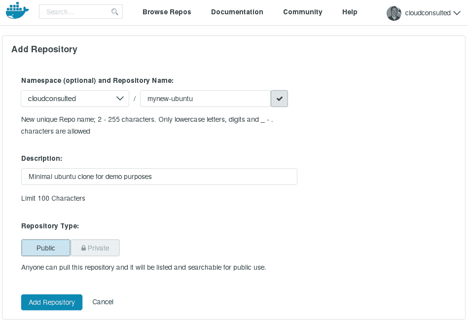
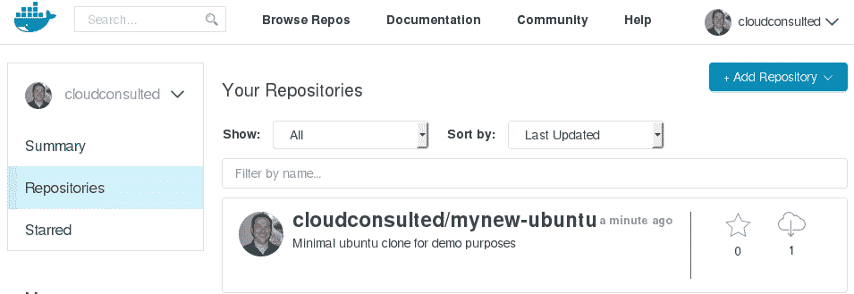
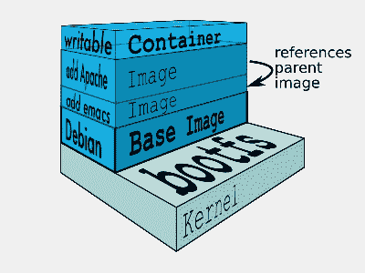

# 第三章。建筑基础和分层映像

在本章中，我们将学习为生产就绪容器构建基础和分层映像。正如我们所看到的，Docker 容器为我们提供了理想的环境，我们可以在其中构建、测试、自动化和部署。这些精确环境的可复制性提供了当前可用的基于脚本的部署系统无法轻易复制的更高程度的效率和信心。然后，开发人员在本地构建、测试和调试的映像可以直接推送到登台和生产环境中，因为测试环境几乎是应用程序代码运行的镜像。

映像是容器的字面基础组件，定义了要部署什么样的 Linux，以及要包含什么样的默认工具并使容器内运行的代码可用。因此，映像构建是应用程序容器化生命周期中最关键的任务之一；正确构建您的映像对于容器化应用程序的有效、可重复和安全的功能至关重要。

容器映像由应用程序容器的一组运行时变量组成。理想情况下，容器映像应该尽可能少，只提供所需的功能，因为这有助于高效处理容器映像，显著减少从注册表上传和下载映像的时间，并且在主机上占用的空间最小。

我们的重点、意图和方向是为您的 Docker 容器构建、调试和自动化映像。

我们将在本章中讨论以下主题:

*   构建容器映像
*   从头开始构建基础映像
*   Docker 注册表中的官方基本映像
*   从 Dockerfiles 构建分层映像
*   通过测试调试映像
*   通过测试自动构建映像

# 构建容器映像

当这本书试图对 Docker 进行故障排除时，减少我们必须首先进行故障排除的错误的机会难道不是有益的吗？对我们来说幸运的是，Docker 社区(以及整个开源社区)提供了一个健康的基础(或*根*)映像注册表，这大大减少了错误并提供了更多可重复的过程。搜索 **Docker 注册表**，我们可以找到大量不断增长的容器映像的官方和自动构建状态。Docker 官方存储库([https://docs.docker.com/docker-hub/official_repos/)](https://docs.docker.com/docker-hub/official_repos/)是由 Docker Inc .支持的精心组织的映像集合-允许您验证特定映像的来源和内容的自动化存储库也存在。

本章的主要主旨和主题是基本的 Docker 基础知识；虽然对于有经验的容器用户来说，它们可能看起来微不足道，但是遵循一些最佳实践和标准化水平，除了增强我们的故障排除能力之外，还能很好地帮助我们避免故障点。

## Docker登记处的官方图片

标准化是可重复过程的主要组成部分。因此，无论何时何地，对于不同的 Linux 发行版(例如，CentOS、Debian、Fedora、RHEL、Ubuntu 和其他发行版)或特定的用例(例如，WordPress 应用程序)，都应该选择在 **Docker Hub** 中提供的标准基础映像。这样的基础映像源自它们各自的 Linux 平台映像，并且是专门为在容器中使用而构建的。此外，标准化的基础映像得到了良好的维护和频繁更新，以解决安全咨询和关键的错误修复。

这些基本映像由 Docker Inc .构建、验证和支持，并且很容易通过它们的单个单词名称(例如，`centos`)来识别。此外，Docker 社区的用户成员还提供和维护预构建的映像来解决某些用例。这样的用户映像用创建它们的 Docker Hub 用户名的前缀表示，并以映像名称作为后缀(例如，`tutum/centos`)。


对我们非常有利的是，这些标准的基本映像仍然是现成的，并且可以在 Docker 注册表上公开获得；只需使用`docker search`和`docker pull`终端命令即可搜索和检索映像。这些将下载任何尚未位于 Docker 主机上的映像。Docker Registry 在提供官方基础映像方面变得越来越强大，人们可以直接使用这些映像，或者至少作为一个现成的起点来满足您的容器建造需求。

### 注

虽然本书假设您熟悉 Docker Hub/Registry 和 GitHub/Bitbucket，但我们将把这些内容的初步介绍作为您高效构建容器映像的第一条参考线。您可以在[https://registry.hub.docker.com/](https://registry.hub.docker.com/)访问 Docker images 的官方注册表。


可以从您的 Docker Hub 帐户或直接从终端搜索 Docker 注册表，如下所示:

```
$ sudo docker search centos

```

标志可以应用于您的搜索标准，以过滤星级、自动构建等映像。要从终端使用注册表中的官方`centos`映像:

*   `$ sudo docker pull centos`:这将把`centos`映像下载到你的主机上。
*   `$ sudo docker run centos`:这将首先在您的主机上查找这个本地化的映像，如果没有找到，它将把映像下载到主机上。映像的运行参数将在其 Dockerfile 中定义。

### 用户存储库

此外，正如我们已经看到的，我们不仅仅局限于官方 Docker 映像的存储库。事实上，大量的社区用户(无论是个人还是企业)已经准备好了为满足特定需求而构建的映像。例如，创建一个`ubuntu`映像，在运行于 Apache、MySql 和 PHP 上的容器内运行`joomla`内容管理系统。

这里，我们有一个用户存储库，只有这样一个映像(`namespace/repository name`):


### 注

**试试看:**从Docker的Docker登记处练习一个映像`pull`和`run`。

`$ sudo docker pull cloudconsulted/joomla`

为一个容器提取我们的基础映像，`$ sudo docker run -d -p 80:80 cloudconsulted/joomla`运行我们的容器映像，并将主机的端口`80`映射到容器的端口`80`。

将您的浏览器指向`http://localhost`，您将拥有新 Joomla 网站的构建页面！

## 建立我们自己的基础映像

然而，有时我们需要创建自定义映像来适应我们自己的开发和部署环境。如果您的用例要求使用非标准的基本映像，您将需要滚动自己的映像。与任何方法一样，事先进行适当的规划是必要的。在构建一个映像之前，您应该花足够的时间来充分理解容器要处理的用例。不太需要一个不能运行预期应用程序的容器。其他考虑因素可能包括您在映像中包含的库或二进制文件是否可重用，等等。一旦你觉得你完成了，再次回顾你的需求和要求，过滤掉不必要的部分；我们不想无缘无故地让我们的容器膨胀。

使用 Docker 注册表，您可能会发现自动构建。这些构建是从 GitHub/Bitbucket 的存储库中提取的，因此可以分叉并根据您自己的规范进行修改。然后，您新分叉的存储库可以与您的新映像同步到 Docker 注册表，然后可以根据您的容器的需要进行提取和运行。

### 注

**试一试**:从下面的库中取出 ubuntu 最小映像，放到 Dockerfile 目录中，创建自己的映像:

`$ sudo docker pull cloudconsulted/ubuntu-dockerbase` `$ mkdir dockerbuilder` `$ cd dockerbuilder`

打开编辑器(vi/vim 或 nano)并创建新的 Dockerfile:

`$ sudo nano Dockerfile`

我们将在稍后讨论分层和自动化映像构建时深入研究如何创建好的 Dockerfiles。现在，我们只想创建我们自己的新基础映像，只是象征性地完成创建 Dockerfile 的过程和位置。为了简单起见，我们在这里只调用我们要从中构建新映像的基础映像:

```
FROM cloudconsulted/ubuntu-dockerbase:latest 

```

保存并关闭此 Dockerfile。我们现在在本地建立我们的新形象:

```
$ sudo docker build -t mynew-ubuntu

```

让我们检查以确保我们的新映像已列出:

```
$ sudo docker images

```

请注意我们的 **mynew-ubuntu** 的**映像标识**，因为我们很快就会需要它:

在 Docker Hub 用户名下创建一个新的公共/私有存储库。我在`<namespace><reponame>`下添加新的仓库为`cloudconsulted/mynew-ubuntu`:



接下来，返回终端，这样我们就可以标记我们的新映像，并将其推送到我们的`<namespace>`下的新 Docker Hub 存储库:

```
$ sudo docker tag 1d4bf9f2c9c0 cloudconsulted/mynew-ubuntu:latest

```

确保我们的新映像在映像列表中正确标记为`<namespace><repository>`:

```
$ sudo docker images

```

此外，我们会发现我们新创建的映像被标记为将其推送到我们的 Docker Hub 存储库。

现在，让我们将映像推送到我们的 Docker Hub 存储库中:

```
$ sudo docker push cloudconsulted/mynew-ubuntu

```

然后，检查集线器中的新映像:



基本上有两种方法来构建您自己的 Docker 映像:

*   通过 bash shell 手动交互式构建层，以安装必要的应用程序
*   通过 Dockerfile 实现自动化，该文件使用所有必要的应用程序构建映像

### 使用暂存库构建映像

为 Docker 构建自己的容器映像高度依赖于您打算打包哪个 Linux 发行版。有了这样的差异，以及通过 Docker Registry 已经提供给我们的映像的流行和不断增长的注册，我们不会花太多时间在这样的手动方法上。

在这里，我们可以再次查看 Docker 注册表，为我们提供最少的映像来使用。从一个空的 TAR 文件创建了一个`scratch`存储库，只需通过`docker pull`即可使用。像以前一样，根据你的参数制作你的 Dockerfile，你就有了你的新映像，从头开始。

通过使用可用的工具，例如 **supermin** (Fedora 系统)或**Debian 系统** (Debian 系统)，可以进一步简化这个过程。例如，使用这样的工具，Ubuntu 基础映像的构建过程可以简单如下:

```
$ sudo debootstrap raring raring > /dev/null 
$ sudo tar -c raring -c . |  docker import - raring a29c15f1bf7a 
$ sudo docker run raring cat /etc/lsb-release 
DISTRIB_ID=Ubuntu 
DISTRIB_RELEASE=14.04 
DISTRIB_CODENAME=raring 
DISTRIB_DESCRIPTION="Ubuntu 14.04" 

```

## 构建分层映像

Docker 的一个核心概念和特征是分层映像。Docker 最重要的特性之一是**映像分层**和映像内容的管理。容器映像的分层方法非常有效，因为您可以引用映像中的内容，识别分层映像中的层。这在构建多个映像时非常强大，使用 Docker 注册表来推和拉映像。



[Image Copyright Docker，Inc.]

### 使用 Dockerfiles 构建分层映像

分层映像主要使用 **Dockerfile** 构建。本质上，Dockerfile 是一个脚本，它按照 Docker 守护程序执行容器的顺序，从源( *base* 或 *root* 映像中自动构建容器，一步一步，层层推进。这些是在文件中登记的连续命令(指令)和参数，它们在基础映像上执行一组被禁止的操作，每个命令组成一个新的层，以便构建一个新的层。这不仅有助于组织我们的映像构建，而且通过简化从始至终大大增强了部署。Docker 文件中的脚本可以通过多种方式呈现给 Docker 守护程序，以便为我们的容器构建新的映像。

#### Docker文件施工

Dockerfile 的第一个命令通常是`FROM`命令。`FROM`指定要拉伸的基础映像。该基础映像可以位于私有注册表中的公共 Docker 注册表([https://www.docker.com/](https://www.docker.com/))中，甚至可以是来自主机的本地化 Docker 映像。

Docker 映像中的附加层根据 Dockerfile 中定义的指令进行填充。Dockerfiles 有非常方便的指令。Dockerfile 中定义的每个新指令在分层映像中构成一个**层**。通过`RUN`指令，我们可以指定要运行的命令，命令的结果作为映像中的附加层。

### 类型

强烈建议对映像中执行的操作进行逻辑分组，并将层数保持在最低。例如，当试图安装应用程序的依赖项时，可以在一个`RUN`指令中安装所有的依赖项，而不是每个依赖项使用 *N* 个指令。

我们将在后面的部分*自动化映像构建*中更仔细地检查 Dockerfiles 的自动化方面。现在，我们需要确保我们掌握了 Dockerfile 本身的概念和构造。让我们具体看一下可以使用的命令的简单列表。正如我们之前看到的，我们的 Dockerfile 应该创建在包含我们现有代码(和/或其他依赖项、脚本等)的工作目录中。

### 类型

**注意:**避免使用根[ `/` ]目录作为源存储库的根目录。`docker build`命令使用包含您的 Dockerfile 的目录作为构建上下文(包括其所有子目录)。在构建映像之前，构建上下文将被发送到 Docker 守护程序，这意味着如果您使用`/`作为源存储库，硬盘的全部内容将被发送到守护程序(并因此发送到运行守护程序的机器)。在大多数情况下，最好将每个 Dockerfile 放在一个空目录中。然后，只将构建 Dockerfile 所需的文件添加到目录中。为了提高构建的性能，可以将`.dockerignore`文件添加到上下文目录中，以正确排除文件和目录。

#### Dockerfile 命令和语法

虽然过于简单，但 Dockerfile 命令的顺序和语法非常重要。适当关注这里的细节和最佳实践不仅有助于确保成功的自动化部署，而且有助于任何故障排除工作。

让我们描述一些基本命令，并用一个工作的 Dockerfile 直接说明它们；我们之前的`joomla`映像是从 Dockerfile 构建基本分层映像的一个很好的例子。

### 注

我们的示例 joomla 基础映像位于公共 Docker 索引中，通过

`cloudconsulted/joomla`.

**出发地**

一个合适的 Dockerfile 从定义一个映像`FROM`开始，构建过程从这个映像开始。该指令指定要使用的基本映像。它应该是 Dockerfile 中的第一条指令，也是通过 Dockerfile 构建映像的必备指令。您可以指定本地映像、Docker 公共注册表中的映像或私有注册表中的映像。

**通用构造**

```
FROM <image> 
FROM <image>:<tag> 
FROM <image>@<digest> 

```

`<tag>`和`<digest>`可选；如果不指定，默认为`latest`。

**来自我们的 Joomla 映像的示例文档文件**

这里，我们定义了用于容器的基本映像:

```
# Image for container base 
FROM ubuntu 

```

**MAINTAINER**

该行指定所建映像的*作者*。这是 Dockerfile 中的可选指令；但是，应该用作者的姓名和/或电子邮件地址来指定该说明。`MAINTAINER`细节可以放在 Dockerfile 中您喜欢的任何地方，只要它总是发布您的`FROM`命令，因为它们不构成任何执行，而是一个定义的值(也就是说，只是一些附加信息)。

**通用构造**

```
MAINTAINER <name><email> 

```

**来自我们的 Joomla 映像的示例文档文件**

在这里，我们定义这个容器和映像的作者:

```
# Add name of image author 
MAINTAINER John Wooten <jwooten@cloudconsulted.com> 

```

**ENV**

该指令在 Dockerfile 中设置环境变量。环境变量集可以在后续指令中使用。

**通用构造**

```
ENV <key> <value> 

```

前面的代码用`<value>`设置了一个环境变量`<key>`。

```
ENV <key1>=<value1> <key2>=<value2> 

```

前面的指令设置了两个环境变量。使用环境变量的键和值之间的`=`符号，并用空格分隔两个环境键值，以定义多个环境变量:

```
ENV key1="env value with space" 

```

对环境变量中有空格的值使用引号。

以下是关于`ENV`指令需要记住的几点:

*   使用一条指令定义多个环境变量
*   从映像创建容器时，环境变量可用
*   可以使用`docker inspect <image>`从映像中查看环境变量
*   通过将`--env <key>=<value>`选项传递给`docker run`命令，可以在运行时更改环境变量的值

**来自我们的 Joomla 映像的示例文档文件**

在这里，我们为 Joomla 和 Docker 映像设置了在没有交互式终端的情况下运行的环境变量:

```
# Set the environment variables 
ENV DEBIAN_FRONTEND noninteractive 
ENV JOOMLA_VERSION 3.4.1 

```

**运行**

该指令允许您运行命令并生成图层。`RUN`指令的输出将是为正在处理的映像构建的层。传递给`RUN`指令的命令在该指令之前构建的层上运行；一个人需要处理订单。

**通用构造**

```
RUN <command> 

```

`<command>`以 shell - `/bin/sh -c` shell 形式执行。

```
RUN ["executable", "parameter1", "parameter2"] 

```

在这种特殊的形式中，您以可执行的形式指定`executable`和`parameters`。确保在命令中传递可执行文件的绝对路径。这对于基本映像没有`/bin/sh`的情况很有用。您可以指定一个可执行文件，它可能是您在基础映像中的唯一可执行文件，并使用它在上面构建层。

如果不想使用`/bin/sh`外壳，这也很有用。考虑一下:

```
RUN ["/bin/bash", "-c", "echo True!"] 
RUN <command1>;<command2> 

```

实际上，这是一种特殊形式的示例，您可以指定多个由`;`分隔的命令。`RUN`指令一起执行这些命令，并为所有指定的命令构建一个单层。

**来自我们的 Joomla 映像的示例文档文件**

在这里，我们更新包管理器并安装所需的依赖项:

```
# Update package manager and install required dependencies 
RUN apt-get update && DEBIAN_FRONTEND=noninteractive apt-get install -y \ 
    mysql-server \ 
    apache2 \ 
    php5 \ 
    php5-imap \ 
    php5-mcrypt \ 
    php5-gd \ 
    php5-curl \ 
    php5-apcu \ 
    php5-mysqlnd \ 
    supervisor 

```

请注意，我们已经有目的地编写了新的软件包，以便按照初始安装命令添加它们自己的 apt-get 安装行。

这样做是为了，如果我们需要添加或删除一个包，我们可以这样做，而不需要重新安装 Dockerfile 中的所有其他包。显然，如果需要的话，这可以节省大量的构建时间。

### 注

**Docker 缓存:** Docker 将首先对照主机的映像缓存检查之前构建的任何匹配图层。如果找到，将跳过 Dockerfile 中的给定构建步骤，从缓存中利用前一层。因此，最好的做法是单独登记每个 Dockerfile 的`apt-get -y install`命令。

正如我们已经讨论过的，Docker 文件中的`RUN`命令将在 Docker 容器的上下文和文件系统下执行任何给定的命令，并产生一个带有任何结果文件系统更改的新映像层。我们首先运行`apt-get update`来确保软件包的存储库和 PPAs 被更新。然后，在单独的调用中，我们指示包管理器安装 MySQL、Apache、PHP 和 Supervisor。`-y`标志跳过交互确认。

安装了所有必要的依赖项来运行我们的服务，我们应该整理一下，给我们一个更干净的 Docker 映像:

```
# Clean up any files used by apt-get 
RUN apt-get clean && rm -rf /var/lib/apt/lists/* /tmp/* /var/tmp/* 

```

**添加**

此信息用于将文件和目录从本地文件系统或文件从远程网址复制到映像中。必须在`ADD`指令中指定来源和目的地。

**通用构造**

```
ADD  <source_file>  <destination_directory> 

```

这里`<source_file>`的路径是相对于构建上下文的。此外，`<destination_directory>`的路径可以是绝对的，也可以是相对于`WORKDIR`的:

```
ADD  <file1> <file2> <file3> <destination_directory> 

```

多个文件，例如`<file1>`、`<file2>`、`<file3>`，被复制到`<destination_directory>`中。请注意，这些源文件的路径应该相对于构建上下文，如下所示:

```
ADD <source_directory> <destination_directory> 

```

`<source_directory>`的内容与文件系统元数据一起被复制到`<destination_directory>`中；目录本身不会被复制:

```
ADD text_* /text_files
```

构建上下文目录中所有以`text_`开头的文件都被复制到容器映像中的`/text_files`目录中:

```
ADD ["filename with space",...,  "<dest>"] 

```

带空格的文件名可以用引号指定；在这种情况下，需要使用 JSON 数组来指定 ADD 指令。

以下是关于`ADD`指令需要记住的几点:

*   复制到容器映像中的所有新文件和目录都有 UID 和 GID 作为`0`
*   如果源文件是远程网址，目标文件将拥有`600`权限
*   在`ADD`指令的源中引用的所有本地文件应该在构建上下文目录或其子目录中
*   如果本地源文件是受支持的 tar 归档文件，那么它将被解包为一个目录
*   如果指定了多个源文件，目标必须是一个目录，并以结尾斜线`/`结束
*   如果目标不存在，将根据需要与路径中的所有父目录一起创建

**来自我们的 Joomla 映像的示例文档文件**

在这里，我们将`joomla`下载到 Apache web 根目录:

```
# Download joomla and put it default apache web root 
ADD https://github.com/joomla/joomla-cms/releases/download/$JOOMLA_VERSION/Joomla_$JOOMLA_VERSION-Stable-Full_Package.tar.gz /tmp/joomla/ 
RUN tar -zxvf /tmp/joomla/Joomla_$JOOMLA_VERSION-Stable-Full_Package.tar.gz -C /tmp/joomla/ 
RUN rm -rf /var/www/html/* 
RUN cp -r /tmp/joomla/* /var/www/html/ 

# Put default htaccess in place 
RUN mv /var/www/html/htaccess.txt /var/www/html/.htaccess 

RUN chown -R www-data:www-data /var/www 

# Expose HTTP and MySQL 
EXPOSE 80 3306 

```

**复制**

`COPY`命令指定位于输入路径的文件应该从与 Dockerfile 相同的目录复制到容器内部的输出路径。

**CMD**

`CMD`指令有三种形式——外壳形式(作为`ENTRYPOINT`的默认参数)和首选的可执行形式。`CMD`的主要目的是为正在执行的容器提供默认值。这些默认值可以包括或省略一个可执行文件，后者也必须指定一个`ENTRYPOINT`指令。如果用户为 Docker `run`指定参数，那么它们将覆盖`CMD`中指定的默认值。如果您希望您的容器每次都运行相同的可执行文件，那么您应该考虑将`ENTRYPOINT`与`CMD`结合使用。

以下是需要记住的几点:

*   不要将`CMD`与`RUN`混淆- `RUN`将实际执行命令并提交结果，而`CMD`在构建期间不执行命令，而是为映像指定预期的命令
*   一个 Dockerfile 只能执行一个`CMD`；如果你登记了多个，只有最后一个`CMD`会被执行

**来自我们的 Joomla 映像的示例文档文件**

在这里，我们设置了 Apache 来启动它:

```
# Use supervisord to start apache / mysql 
COPY supervisord.conf /etc/supervisor/conf.d/supervisord.conf 
CMD ["/usr/bin/supervisord", "-n"] 

```

以下是我们完成的 Joomla Dockerfile 的内容:

```
FROM ubuntu 
MAINTAINER John Wooten <jwooten@cloudconsulted.com> 

ENV DEBIAN_FRONTEND noninteractive 
ENV JOOMLA_VERSION 3.4.1 

RUN apt-get update && DEBIAN_FRONTEND=noninteractive apt-get install -y \ 
    mysql-server \ 
    apache2 \ 
    php5 \ 
    php5-imap \ 
    php5-mcrypt \ 
    php5-gd \ 
    php5-curl \ 
    php5-apcu \ 
    php5-mysqlnd \ 
    supervisor 

# Clean up any files used by apt-get 
RUN apt-get clean && rm -rf /var/lib/apt/lists/* /tmp/* /var/tmp/* 

# Download joomla and put it default apache web root 
ADD https://github.com/joomla/joomla-cms/releases/download/$JOOMLA_VERSION/Joomla_$JOOMLA_VERSION-Stable-Full_Package.tar.gz /tmp/joomla/ 
RUN tar -zxvf /tmp/joomla/Joomla_$JOOMLA_VERSION-Stable-Full_Package.tar.gz -C /tmp/joomla/ 
RUN rm -rf /var/www/html/* 
RUN cp -r /tmp/joomla/* /var/www/html/ 

# Put default htaccess in place 
RUN mv /var/www/html/htaccess.txt /var/www/html/.htaccess 

RUN chown -R www-data:www-data /var/www 

# Expose HTTP and MySQL 
EXPOSE 80 3306 

# Use supervisord to start apache / mysql 
COPY supervisord.conf /etc/supervisor/conf.d/supervisord.conf 
CMD ["/usr/bin/supervisord", "-n"] 

```

其他常见的 Dockerfile 命令如下: **ENTRYPOINT**

一个`ENTRYPOINT`允许你配置一个将作为可执行文件运行的容器。从 Docker 的文档中，我们将使用提供的示例；以下内容将以其默认内容开始`nginx`，监听端口`80`:

```
docker run -i -t --rm -p 80:80 nginx 

```

对`docker run <image>`的命令行参数将以可执行形式`ENTRYPOINT`附加在所有元素之后，并将覆盖使用`CMD`指定的所有元素。这允许将参数传递到入口点，即`docker run <image> -d`将把`-d`参数传递到入口点。您可以使用`docker run --entrypoint`标志覆盖`ENTRYPOINT`指令。

标签

该指令指定映像的元数据。稍后可以使用`docker inspect <image>`命令检查该映像元数据。这里的想法是在映像元数据中添加关于映像的信息，以便于检索。为了从映像中获取元数据，不需要从映像中创建容器(或者将映像安装在本地文件系统上)，Docker 将 metdata 数据与每个 Docker 映像相关联，并且它有一个预定义的结构；使用`LABEL`，可以添加描述映像的附加关联元数据。

映像的标签是键值对。以下是在 Dockerfile 中使用`LABEL`的示例:

```
LABEL <key>=<value>  <key>=<value>  <key>=<value> 

```

该指令将向映像添加三个标签。此外，请注意，它将创建一个新的层，因为所有标签都添加在单个`LABEL`指令中:

```
LABEL  "key"="value with spaces" 

```

如果标签值有空格，请在标签中使用引号:

```
LABEL LongDescription="This label value extends over new \ 
line." 

```

如果标签值很长，请使用反斜杠将标签值扩展到新行。

```
LABEL key1=value1 
LABEL key2=value2 

```

一个映像的多个标签可以通过**行尾** ( **EOL** )分隔来定义。请注意，在这种情况下，将为两个不同的`LABEL`指令创建两个映像层。

关于`LABEL`说明的注意事项:

*   标签按照 Dockerfile 中的描述和`FROM`指令中指定的基础映像中的标签一起整理
*   如果标签中的`key`重复，后面的标签将覆盖前面定义的键的值。
*   尝试在单个`LABEL`指令中指定所有标签，以产生高效的映像，从而避免不必要的映像层数
*   要查看构建映像的标签，请使用`docker inspect <image>`命令

**工作台**

该指令用于设置 Dockerfile 中后续`RUN`、`ADD`、`COPY`、`CMD`、`ENTRYPOINT`指令的工作目录。

在 Dockerfile 中定义一个工作目录，容器中引用的所有后续相对路径都将相对于指定的工作目录。

以下是使用`WORKDIR`指令的例子:

```
WORKDIR /opt/myapp 

```

前面的指令指定`/opt/myapp`作为后续指令的工作目录，如下:

```
WORKDIR /opt/ 
WORKDIR myapp 
RUN pwd 

```

前面的指令定义了工作目录两次。注意第二个`WORKDIR`将相对于第一个`WORKDIR`。`pwd`命令的结果将是`/opt/myapp`:

```
ENV SOURCEDIR /opt/src 
WORKDIR $SOURCEDIR/myapp 

```

工作目录可以解析前面定义的环境变量。在本例中，`WORKDIR`指令可以评估`SOURCEDIR`环境变量，结果工作目录将是`/opt/src/myapp`。

**用户**

这将设置用户运行任何后续的`RUN`、`CMD`和`ENTRYPOINT`指令。这还会在创建容器并从映像运行时设置用户。

以下指令为映像和容器设置用户`myappuser`:

```
USER myappuser 

```

关于`USER`说明的注意事项:

*   可以使用容器的`docker run`命令中的`--user=name|uid[:<group|gid>]`覆盖用户

# 映像测试和调试

虽然我们可以称赞容器的好处，但故障排除和有效监控它们目前存在一些复杂性。因为根据设计，容器是孤立运行的，所以它们产生的环境可能是多云的。有效的故障排除通常需要外壳进入容器本身，再加上安装额外的 Linux 工具来仔细阅读信息的复杂性，这是调查难度的两倍。

通常，用于对我们的容器和映像进行有意义的故障排除的可用工具、方法和途径需要在每个容器中安装额外的包。这将导致以下结果:

*   直接连接或附着到容器上的要求，这并不总是一件小事
*   一次检查一个容器的限制

加剧这些困难，用这些工具给我们的容器增加不必要的膨胀是我们最初在计划中试图避免的事情；极简主义是我们最初在使用容器时寻找的优势之一。接下来让我们看看如何通过一些基本命令合理地收集容器映像上的有用信息，以及调查允许我们从外部监控和排除容器故障的紧急应用程序。

## 用于故障排除的 Docker 详细信息

现在您已经有了运行 Docker 的映像(不考虑构建方法)，让我们做一些测试，以确保一切都与我们的构建相一致。虽然这些看起来可能是常规和平凡的，但运行以下任何一项或全部作为自上而下的故障排除方法是一个很好的做法。

这里的前两个命令简单得可笑，看起来太普通了，但是将提供基础级别的细节，以此开始任何下游故障排除工作- `$ docker version`和`$ docker info`。

## Docker 版本

让我们确保首先识别我们正在运行的 Docker、Go 和 Git 版本:

```
$ sudo docker version

```

## Docker信息

此外，我们应该了解我们的主机操作系统和内核版本，以及存储、执行和日志驱动程序。了解这些可以帮助我们从*自上而下*的角度进行故障排除:

```
$ sudo docker info

```

## Debian/Ubuntu 故障排除注意事项

从`$ sudo docker info`命令，您可能会收到以下一个或两个警告:

```
WARNING: No memory limit support 
WARNING: No swap limit support

```

您需要向内核添加以下命令行参数，以便启用内存和交换记帐:

```
cgroup_enable=memory swapaccount=1

```

对于这些 Debian 或 Ubuntu 系统，如果使用默认的 GRUB 引导加载程序，可以通过编辑`/etc/default/grub`和扩展`GRUB_CMDLINE_LINUX`来添加那些参数。找到以下行:

```
GRUB_CMDLINE_LINUX="" 

```

然后，将其替换为以下内容:

```
GRUB_CMDLINE_LINUX="cgroup_enable=memory swapaccount=1" 

```

然后，运行`update-grub`并重启主机。

## 列出已安装的 Docker 映像

我们还需要确保容器实例已经在本地安装了您的映像。SSH 进入 docker 主机并执行`docker images`命令。您应该会看到您的 docker 映像列表，如下所示:

```
$ sudo docker images

```

*如果我的形象没有出现怎么办？*检查代理日志，确保您的容器实例能够通过卷曲注册表并打印出可用的标签来联系您的 docker 注册表:

```
curl [need to add in path to registry!]

```

### 注

**什么$ sudo docker images 告诉我们:**我们的容器映像已成功安装在主机上。

## 手动启动 Docker 映像

现在我们知道我们的映像安装在主机上，我们需要知道 Docker 守护程序是否可以访问它。一种确保您的映像可以在容器实例上运行的简单测试方法是尝试从命令行运行您的映像。这里还有一个额外的好处:我们现在有机会额外检查应用程序日志，以便进一步排除故障。

让我们看看下面的例子:

```
$ sudo docker run -it [need to add in path to registry/latest bin!]

```

### 注

**什么$ sudo docker 运行< imagename >告诉我们:**我们的容器映像可以从 docker 守护程序访问，并且还提供了可访问的输出日志，用于进一步的故障排除。

*如果我的映像不运行怎么办？*检查任何运行的容器。如果目标容器没有在主机上运行，则可能存在阻止其启动的问题:

```
$ sudo docker ps

```

当容器无法启动时，它不会记录任何内容。容器启动过程的日志输出位于主机上的`/var/log/containers`中。在这里，你会发现遵循`<service>_start_errors.log`命名惯例的文件。在这些日志中，您可以找到由我们的`RUN`命令生成的任何输出，并且是解决您的容器无法启动的原因的建议起点。

### 类型

**TIP:**log spout([https://github.com/gliderlabs/logspout](https://github.com/gliderlabs/logspout))是一个在 Docker 内部运行的 Docker 容器的日志路由器。Logsprout 连接到主机上的所有容器，然后将它们的日志路由到您想要的任何地方。

虽然我们也可以在尝试故障排除时仔细阅读`/var/log/messages`输出，但是我们还可以寻求一些其他途径，尽管会更加耗费人力。

## 从缓存中检查文件系统状态

正如我们已经讨论过的，在 Dockerfiles 中的每个成功的`RUN`命令之后，Docker 会缓存整个文件系统状态。我们可以利用这个缓存来检查失败的`RUN`命令之前的最新状态。

要完成任务:

*   除了任何和后续的`RUN`命令外，访问 Dockerfile 并注释掉失败的`RUN`命令
*   重新保存文件
*   重新执行`$ sudo docker build`和`$ sudo docker run`

## 映像层标识作为调试容器

每当 Docker 成功执行来自 Dockerfile 的`RUN`命令时，映像文件系统中的一个新层就会被提交。方便的是，您可以使用这些图层标识作为映像来启动一个新的容器。

以下面的 Dockerfile 为例:

```
FROM centos 
RUN echo 'trouble' > /tmp/trouble.txt 
RUN echo 'shoot' >> /tmp/shoot.txt 

```

如果我们从这个 Dockerfile 构建:

```
$ docker build -force-rm -t so26220957 .

```

我们将得到类似如下的输出:

```
Sending build context to Docker daemon 3.584 kB 
Sending build context to Docker daemon 
Step 0 : FROM ubuntu 
   ---> b750fe79269d 
Step 1 : RUN echo 'trouble' > /tmp/trouble.txt 
   ---> Running in d37d756f6e55 
   ---> de1d48805de2 
Removing intermediate container d37d756f6e55 
Step 2 : RUN echo 'bar' >> /tmp/shoot.txt 
Removing intermediate container a180fdacd268 
Successfully built 40fd00ee38e1

```

然后我们可以使用前面的映像图层标识从`b750fe79269d`、`de1d48805de2`和`40fd00ee38e1`开始新的容器:

```
$ docker run -rm b750fe79269d cat /tmp/trouble.txt 
cat: /tmp/trouble.txt No such file or directory 
$ docker run -rm de1d48805de2 cat /tmp/trouble.txt 
trouble 
$ docker run -rm 40fd00ee38e1 cat /tmp/trouble.txt 
trouble 
shoot

```

### 注

我们使用`--rm`来移除所有的调试容器，因为没有理由在后期运行时使用它们。

*如果我的容器构建失败了会发生什么？*由于没有在失败的构建上创建映像，因此我们没有用于标识的容器的散列。相反，我们可以记录前一层的 ID，并运行一个带有该 ID 外壳的容器:

```
$ sudo docker run --rm -it <id_last_working_layer> bash -il

```

进入容器后，执行失败的命令，试图重现问题，修复命令并进行测试，最后用修复的命令更新 Dockerfile。

您可能还想启动一个 shell 并探索文件系统、尝试命令等等:

```
$ docker run -rm -it de1d48805de2 bash -il 
root@ecd3ab97cad4:/# ls -l /tmp 
total 4 
-rw-r-r-- 1 root root 4 Jul 3 12:14 trouble.txt 
root@ecd3ab97cad4:/# cat /tmp/trouble.txt 
trouble 
root@ecd3ab97cad4:/#

```

## 附加示例

最后一个例子是注释掉下面的 Dockerfile，包括违规的行。然后，我们能够手动运行容器和 docker 命令，并以正常方式查看日志。在本例中，Dockerfile:

```
RUN trouble 
RUN shoot 
RUN debug 

```

此外，失败是在拍摄，然后评论如下:

```
RUN trouble 
# RUN shoot 
# RUN debug 

```

然后，构建并运行:

```
$ docker build -t trouble . 
$ docker run -it trouble bash 
container# shoot 
...grep logs...

```

## 检查失败的容器进程

即使您的容器从命令行成功运行，检查任何失败的容器进程、不再运行的容器以及检查我们的容器配置也是有益的。

运行以下命令检查失败或不再运行的容器，并注意`CONTAINER ID`检查给定容器的配置:

```
$ sudo docker ps -a

```

注意容器的**状态**。如果您的任何容器，**状态**显示除`0`以外的退出代码，则可能是容器的配置有问题。举例来说，错误的命令会导致退出代码为`127`。有了这些信息，您可以对任务定义`CMD`字段进行故障排除以进行调试。

尽管有些受限，但我们可以进一步检查容器，了解更多故障排除细节:

```
$ sudo docker inspect <containerId>

```

最后，让我们也分析一下容器的应用程序日志。此处输出容器启动失败的错误消息:

```
$ sudo docker logs <containerId>

```

## 其他潜在有用的资源

`$ sudo docker` top 给了我们一个在容器内部运行的进程列表。

当您需要比`top`提供的更多一点的细节时，可以使用`$ sudo docker htop`以一种方便的、光标控制的方式。`htop`启动比`top`快，可以纵横滚动列表查看所有进程，完成命令行，不需要输入进程号就可以终止进程，也不需要输入优先级值就可以接收进程。

到本书付印时，对容器和映像进行故障排除的机制可能已经有了显著的改进。除了肯定会带来额外选择的市场力量之外，Docker 社区正把更多的焦点放在*预定义的*报告和监控解决方案上。

## 使用 sysdig 进行调试

如同任何更新的技术一样，它们固有的一些初始复杂性会被及时调试，并且开发更新的工具和应用程序来增强它们的使用。正如我们已经讨论过的，容器现在肯定属于这一类。虽然我们在 Docker 注册表中看到了官方标准化映像可用性的提高，但我们现在也看到了帮助我们有效管理、监控和排除容器故障的新兴工具。


Sysdig 为容器提供应用程序监控[Image 版权所有 2014 Draios，Inc.]

**Sysdig**([http://www.sysdig.org/](http://www.sysdig.org/)[)](http://www.sysdig.org/)就是这样一个工具。作为一个面向容器化环境的系统级探索和故障排除可见性的 *au courant* 应用程序，`sysdig`的美妙之处在于我们能够从外部访问容器数据(尽管`sysdig`实际上也可以安装在容器内部)。从最高层面来看，`sysdig`给我们的容器管理带来的是:

*   能够访问和审查每个容器中的流程(包括内部和外部 PID)
*   能够深入到特定容器中
*   能够轻松过滤用于流程审查和分析的容器集

Sysdig 提供有关 CPU 使用、I/O、日志、网络、性能、安全性和系统状态的数据。重复一遍，这一切都可以从外部完成，不需要在我们的容器中安装任何东西。

我们将继续并有价值地使用本书中的`sysdig`来监控和排除与我们的容器相关的特定过程，但是现在我们将提供几个例子来排除我们的基本容器过程和日志。

让我们通过把它安装在我们的主机上来挖掘`sysdig`，展示它能为我们和我们的容器做什么！

### 单步安装

`sysdig`的安装可以通过以 root 身份执行以下命令或使用`sudo`一步完成:

```
curl -s https://s3.amazonaws.com/download.draios.com/stable/install-sysdig | sudo bash

```

### 注

**注:** `sysdig`目前原生包含在最新的 Debian 和 Ubuntu 版本中；但是，建议更新/运行最新软件包的安装。

### 高级安装

根据`sysdig` wiki，高级安装方法可能对脚本部署或容器化环境有用。也很容易；RHEL 和 Debian 系统采用了先进的安装方法。

### 什么是凿子？

首先，我们应该了解一下它的一些说法，特别是**凿子**。在`sysdig`中，凿子是分析`sysdig`事件流以执行有用动作的小脚本(用 Lua 编写)。事件被有效地带到用户级别，用上下文丰富，然后脚本可以应用到它们。凿子在实时系统上运行良好，但也可以与跟踪文件一起用于离线分析。你可以同时运行任意多个凿子。例如:

`topcontainers_error`凿子会根据错误的数量向我们显示最上面的容器。

有关 sysdig 凿子的列表:

`$ sysdig -cl`(使用`-i`标志获取特定凿子的详细信息)

**单容器流程分析**

使用`topprocs_cpu`凿子的例子，我们可以应用过滤器:

```
$ sudo sysdig -pc -c topprocs_cpu container.name=zany_torvalds

```

以下是示例结果:

```
CPU%          Process       container.name   
------------------------------------------ 
02.49%        bash          zany_torvalds 
37.06%        curl          zany_torvalds 
0.82%         sleep         zany_torvalds

```

与使用`$ sudo docker top`(和类似的)不同，我们可以准确地确定我们希望看到哪些容器的流程；例如，以下示例向我们展示了仅来自`wordpress`容器的流程:

```
$ sudo sysdig -pc -c topprocs_cpu container.name contains wordpress 

CPU%           Process         container.name   
-------------------------------------------------- 
5.38%          apache2         wordpress3 
4.37%          apache2         wordpress2 
6.89%          apache2         wordpress4 
7.96%          apache2         wordpress1

```

**其他有用的系统凿子&语法**

*   `topprocs_cpu`按 CPU 使用率显示顶级进程
*   `topcontainers_file`按 R+W 磁盘字节显示顶级容器
*   `topcontainers_net`按网络输入/输出显示顶部容器
*   `lscontainers`将列出正在运行的容器
*   `$ sudo sysdig -pc -cspy_logs`每屏分析所有日志
*   `$ sudo sysdig -pc -cspy_logs container.name=zany_torvalds`打印容器的日志`zany_torvalds`

## 故障排除-一个开放的社区在等着你

总的来说，你可能面临的大多数问题可能已经被其他人经历过，在某个地方和某个时间之前。Docker 和开源社区、IRC 渠道和各种搜索引擎可以提供高度可访问的结果信息，并可能为您提供复杂情况和条件的答案。充分利用开源社区(特别是 Docker 社区)来获得您想要的答案。就像任何新兴技术一样，一开始，我们都在一起学习！

# 自动化映像构建

有很多方法可以让我们构建容器映像的过程自动化；太多了，无法在一本书中合理地提供方法的完整披露。在本书后面的章节中，我们将更深入地研究一系列自动化选项和工具。在这个特殊的例子中，我们只是使用我们的 Dockerfile 来谈论自动化。我们已经一般性地讨论了 Dockerfiles 可以用于自动化我们的映像构建，所以让我们具体来看一下 docker files 自动化。

## 单元测试部署

在构建过程中，Docker 允许我们运行任何命令。让我们利用这一点，在构建我们的映像时启用单元测试。这些单元测试有助于在我们将生产映像推向试运行或部署之前识别出其中的问题，并且将至少部分地按照我们预期的方式验证映像的功能。如果单元测试成功运行，我们有一定程度的信心，相信我们的服务有一个有效的运行时环境。这也意味着，如果测试失败，我们的构建将会失败，从而有效地将一个不工作的映像排除在生产之外。

使用我们之前的`cloudconsulted/joomla`存储库映像，我们将建立一个自动化构建的示例工作流，并进行测试。 **PHPUnit** 是我们将使用的，因为它被 Joomla 正式使用！项目的开发团队，因为它可以方便地对我们的整个堆栈运行单元测试 Joomla 代码、Apache、MySQL 和 PHP。

进入`cloudconsulted/joomla`(在我们的例子中为`dockerbuilder`)的 Dockerfile 目录，并按如下方式进行更新。

执行以下命令安装 PHPUnit:

```
[# install composer to a specific directory 
curl -sS https://getcomposer.org/installer | php -- --install-dir=bin 
# use composer to install phpunit 
composer global require "phpunit/phpunit=4.1.*"]

```

还可以通过执行以下命令来安装 PHPUnit:

```
[# install phpunit 
wget https://phar.phpunit.de/phpunit.phar 
chmod +x phpunit.phar 
mv phpunit.phar /usr/local/bin/phpunit 
# might also need to put the phpunit executable placed here? test this: 
cp /usr/local/bin/phpunit /usr/bin/phpunit]

```

现在，让我们用`phpunit:`运行我们的单元测试

```
# discover and run any tests within the source code 
RUN phpunit 

```

我们还需要确保我们对映像中的资产进行单元测试:

```
# copy unit tests to assets 
COPY test /root/test 

```

最后，让我们打扫一下房子。为了确保我们的生产代码不能(意外地或以其他方式)依赖于测试代码，一旦单元测试完成，我们应该删除那些测试文件:

```
# clean up test files 
RUN rm -rf test 

```

我们对 Dockerfile 的全部更新包括:

```
wget https://phar.phpunit.de/phpunit.phar 
chmod +x phpunit.phar 
mv phpunit.phar /usr/local/bin/phpunit 

RUN phpunit   
COPY test /root/test 
RUN rm -rf test 

```

现在，我们有了一个脚本化的 Dockerfile，每次我们构建这个映像时，它都会完全测试我们的 Joomla 代码、Apache、MySQL 和 PHP 依赖项，作为构建过程的字面部分。结果是经过测试的、可再现的生产环境！

## 自动化测试部署

随着我们对为部署生产可行映像信心的增强，这一构建过程仍然需要开发人员或 DevOps 工程师在每次生产推进之前重建映像。相反，我们将依赖于 Docker 和 GitHub 存储库中的自动化构建。

我们的 GitHub 和 Docker Hub 存储库将用于自动化我们的构建。通过在 GitHub 上维护我们的 Docker 文件、依赖项、相关脚本等，任何推送或提交更新存储库文件的操作都会自动强制将更新推送至同步的 Docker Hub 存储库。我们在 Docker Hub 上拉取的生产映像会自动更新任何新的构建信息。

Docker Clouds 是完成应用程序生命周期的最新产品之一，它提供了带有构建和测试工具的托管注册服务。Docker Cloud 扩展了 Tutum 的功能，并带来了与 Docker Hub 更紧密的集成。借助 Docker Cloud 系统，管理员只需点击几下鼠标，就可以在云中部署和扩展应用程序。持续交付与构建、测试和部署工作流集成并自动化的代码。它还提供了整个基础设施容器的可见性，并访问编程 RESTful APIs 以获得一个开发人员友好的 CLI 工具。因此，Docker Cloud 可以用于自动化构建过程和测试部署。

以下是 Docker 云的重要特性:

*   允许构建 Docker 映像，也允许将云存储库链接到源代码，以便简化映像构建过程
*   它允许链接您的基础架构和云服务，以自动调配新节点
*   一旦构建了映像，它就可以用于部署服务，并且可以与 Docker Cloud 的服务和微服务集合相链接
*   测试模式下的集群管理可用于在 Docker cloud 内创建集群，或使用 Docker ID 将现有集群注册到 Docker cloud

# 总结

Docker 和 Dockerfiles 在整个应用程序开发周期中提供了可重复的过程，为开发人员和 DevOps 工程师提供了一个独特的工具——生产就绪部署，注入了测试映像的信心和自动化的便利性。这为最需要的人提供了高水平的授权，并带来了经过测试和生产就绪的映像构建的持续交付，我们可以完全自动化该构建，并将其扩展到我们的云中。

在本章中，我们了解到生产就绪型应用程序容器化中的一项关键任务是映像构建。构建基础映像和分层映像以及避免故障排除区域是我们讨论的主要主题。在构建基础映像时，我们看到 Docker 注册表提供了大量经过验证的映像，我们可以自由地将其用于可重复的过程。我们还从零开始手动搜索建筑映像。接下来，我们探索了用 Dockerfile 构建分层映像，并详细登记了 Dockerfile 命令。最后，一个示例工作流说明了自动映像构建，以及映像和容器的烘焙测试。自始至终，我们都强调了故障排除领域和选项的方法和途径。

为应用程序容器构建简洁的 Docker 映像对于应用程序的功能和可维护性至关重要。既然我们已经了解了构建基础和分层映像以及解决这些问题的基本方法，我们将期待构建真正的应用程序映像。在我们的下一章中，我们将学习使用一组合适的映像来规划和构建多层应用程序。