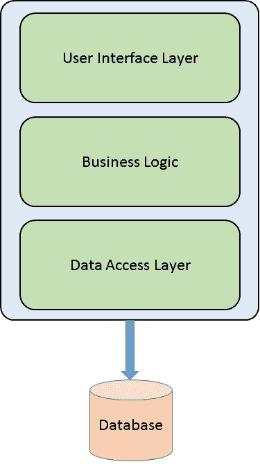
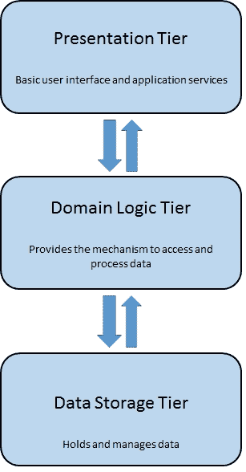
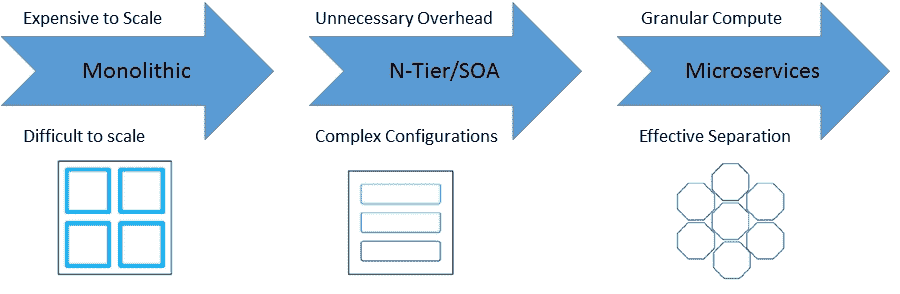
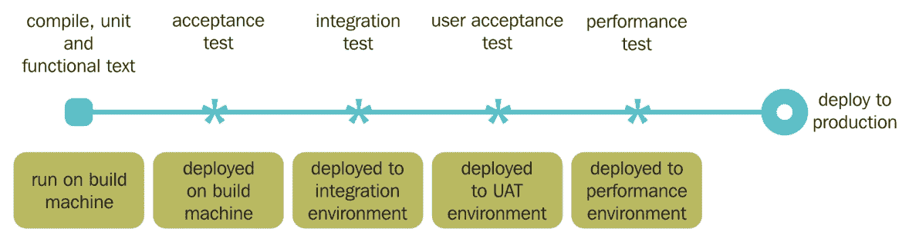

# 第四章。设计微服务和多层应用

让我们详细介绍一下我们在上一章中看到和了解到的关于更高级的微服务和 N 层应用程序的开发和部署。本章将介绍这些设计方法的底层架构，并解决构建这些类型的应用程序时面临的典型问题。我们将在本章中讨论以下主题:

*   整体建筑模式
*   n 层应用程序架构
*   构建、测试和自动化 N 层应用程序
*   微服务架构模式
*   构建、测试和自动化微服务
*   将多层应用程序分离成多个映像
*   让不同的应用程序层工作

如今，作为服务构建的现代软件正在引起应用程序设计方式的转变。今天的应用程序不是使用 web 框架来调用服务和生成网页，而是通过消费和生成 API 来构建的。业务应用程序的开发和部署已经发生了很大的变化，有些变化非常显著，有些变化是通过对过去设计方法的修改或扩展实现的，这取决于您的观点。存在几种体系结构设计方法，它们可以通过为企业构建的应用程序、网络和云来区分。

尤其是在过去几年中，发展趋势充斥着诸如**微服务架构** ( **MSA** )这样的术语，它们适用于作为独立可部署服务套件的特定应用程序设计和开发方式。微服务架构风格的迅速崛起显然是当今部署发展中不可辩驳的力量；从单片架构到 N 层应用和微服务，已经有了相当大的转变，但这其中到底有多少是炒作，又有多少可以磨练？

# 炒作还是狂妄

在我们开始深入故障排除之前，我们应该提供现代应用程序以及 N 层和微服务架构风格的基本上下文概述。了解这些架构风格的优点和局限性将有助于我们规划潜在的故障排除领域，以及我们如何避免它们。容器非常适合这两种架构方法，我们将分别讨论每一种方法，以给出它们应有的结果。

在所有这些噪音中，我们有时会忘记，要在这些域中部署系统，仍然需要在工作的分布式应用程序中创建服务并组合多个服务。在这里，重要的是理解术语应用的现代含义。应用程序现在主要被构造为异步消息流或同步请求调用(如果不是两者都有)，用于形成由这些连接联合的组件或服务的集合。参与的服务高度分布在不同的机器和不同的云(私有、公共和混合)中。

至于架构风格，我们不会过多地比较自己，也不会过于详细地讨论微服务实际上是什么，以及它们与**面向服务架构** ( **SOA** )是否有任何不同——在其他地方肯定有很多论坛和相关的辩论供您选择。设计原则至少可以追溯到 Unix，因此我们不会在本书中提供任何权威的观点，即当前的微服务趋势要么在概念上是单一的，要么是完全巧妙的。相反，我们将提出实现这种体系结构方法的主要考虑因素，以及为现代应用程序获得的好处。

用例仍然驱动和支配架构方法(或者，在我看来，应该如此)，因此在所有主要架构风格之间进行某种程度的比较分析是有价值的:**单体**、 **N 层**和**微服务**。

# 单片架构

单片基本上是一个包含所有服务和依赖项的部署单元，使它们易于开发、易于测试、相对易于部署，并且最初易于扩展。然而，这种风格不能满足大多数现代企业应用程序(N 层)和大规模 web 开发的必要需求，当然也不能满足部署到云中的(微服务)应用程序的需求。变更周期是紧密耦合的——所做的任何变更，即使是对应用程序的最小部分，都需要对整个整体进行大规模的重建和重新部署。随着整体的成熟，任何扩展的尝试都需要扩展整个应用程序，而不是单个部分，这特别需要更多的资源，变得非常可怕，如果不是不可能的话。在这一点上，一个单一的应用程序已经变得过于复杂，被越来越难以破译的大量代码所占据，以至于像 bug 修复或实现新特性这样的关键业务项目变得太耗费时间而无法尝试。随着代码库变得不可理解，期望所做的任何更改都可能是不正确的才是合理的。应用程序规模的迅速增长不仅减缓了开发速度，还阻碍了持续开发；要更新整块的任何部分，必须重新部署整个应用程序。



整体建筑模式

单片的其他问题比比皆是，资源无法满足更好的需求，例如，中央处理器或内存需求。由于所有模块都在运行相同的进程，任何错误都可能导致整个进程停止。最后，采用更新的框架或语言变得更加困难，这为采用新技术制造了巨大的障碍——你可能会被项目开始时所做的任何技术选择所困扰。不用说，你的需求可能从一开始就发生了相当大的变化。使用过时的非生产性技术使得留住和引进新人才变得更加困难。该应用程序现在已经变得非常难以扩展并且不可靠，使得应用程序的敏捷开发和交付变得不可能。一块巨石最初的轻松和简单很快成为它自己的致命弱点。

由于这些单体架构基本上是一个无所不用其极的部署单元，因此出现了 N 层和微服务架构来满足现代化应用程序(主要是基于云和移动的应用程序)的专业服务需求。

# N 层应用架构

为了理解 N 层应用程序及其与微服务解耦的潜力，我们将把它与单片风格进行比较，因为 N 层应用程序的开发和微服务的激增都是为了解决我们在单片架构方法中发现的过时条件下发现的许多问题。

N 层应用架构，也称为**分布式应用**或**多层**，提供了一个开发人员可以创建灵活和可重用应用的模型。由于应用程序被分成多个层，开发人员可以选择修改或添加一个或多个特定的层，而不需要像单片系统那样对整个应用程序进行必要的返工。多层应用程序是在多个层中开发和分布的任何应用程序。它在逻辑上将不同的应用特定层和操作层分开。层数因业务和应用需求而异，但三层是最常用的架构。多层应用程序用于将企业应用程序分成两个或多个组件，这些组件可以分别开发、测试和部署。

n 层应用程序本质上是 SOA，试图解决过时的单一设计架构的一些问题。正如我们在前面几章中看到的，Docker 容器是 N 层应用程序开发的完美匹配。



n 层应用程序架构

一个普通的 N 层应用程序由三层组成:一个 **PRESENTATION TIER** (提供基本的用户界面和应用服务访问) **DOMAIN LOGIC TIER** (提供用于访问和处理数据的机制)和一个 **DATA STORAGE TIER** (保存和管理静态数据)。

### 注

虽然层和层的概念经常互换使用，但一个相当普遍的观点是，它们实际上是有区别的。这种观点认为*层*是组成软件解决方案的元素的逻辑结构化机制，而*层*是系统基础设施的物理结构化机制。除非在我们的书中特别指出，我们将交替使用层和层。

在 N 层应用程序中分离各个层的最简单方法是为您希望包含在应用程序中的每个层创建离散的项目。例如，表示层可能是 Windows 窗体应用程序，而数据访问逻辑可能是位于中间层的类库。此外，表示层可能通过服务与中间层的数据访问逻辑进行通信。将应用程序组件分成不同的层增加了应用程序的可维护性和可伸缩性。它通过更容易地采用新技术来做到这一点，新技术可以应用于单个层，而不需要重新设计整个解决方案。此外，N 层应用程序通常将敏感信息存储在中间层，中间层与表示层保持隔离。

大概 N 层应用开发最常见的例子就是网站；这方面的一个例子可以在我们上一章使用的`cloudconsulted/joomla`映像中看到，Joomla、Apache、MySQL 和 PHP 都是*将*分层为单个容器中的层。

对我们来说，简单地递归使用我们的`cloudconsulted/joomla`映像(从前面开始)已经足够容易了，但是让我们构建一个经典的三层 web 应用程序来展示一些其他的应用程序潜力，并为我们的开发团队引入另一个单元测试工具。

## 构建三层网络应用

让我们借助以下容器来开发和部署一个真实世界的三层 web 应用程序:

NGINX > Ruby on Rails > PostgreSQL:

NGINX Docker 容器(Dockerfile)，如下所示:

```
## AngularJS Container build  
FROM nginx:latest 

# Download packages 
RUN apt-get update 
RUN apt-get install -y curl   \ 
                   git    \ 
                   ruby \ 
                   ruby-dev \     
                   build-essential 

# Copy angular files 
COPY . /usr/share/nginx 

# Installation 
RUN curl -sL https://deb.nodesource.com/setup | bash - 
RUN apt-get install -y nodejs \ 
                  rubygems 
RUN apt-get clean 
WORKDIR /usr/share/nginx 
RUN npm install npm -g 
RUN npm install -g bower 
RUN npm install  -g grunt-cli 
RUN gem install sass 
RUN gem install compass 
RUN npm cache clean 
RUN npm install 
RUN bower -allow-root install -g 

# Building 
RUN grunt build 

# Open port and start nginx 
EXPOSE 80 
CMD ["/usr/sbin/nginx", "-g", "daemon off;"]

```

Rails 上的 Rails Docker 容器(Dockerfile)，如图所示:

```
## Ruby-on-Rails Container build 
FROM rails:onbuild 

# Create and migrate DB 
RUN bundle exec rake db:create 
RUN bundle exec rake db:migrate 

# Start rails server 
CMD ["bundle", "exec", "rails", "server", "-b", "0.0.0.0"]

```

PostgreSQL Docker 容器，如图所示:

```
 ## PostgreSQL Containers build 
# cloudconsulted/postgres is a Postgres setup that accepts remote connections from Docker IP (172.17.0.1/16).  We can therefore make use of this image directory so there is no need to create a new Docker file here. 

```

前面的 Dockerfiles 可用于部署三层 web 应用程序，并帮助我们开始使用微服务。

# 微服务架构

为了开始解释微服务架构风格，再次与单片进行比较将是有益的，就像我们对 N 层所做的那样。您可能还记得，单个应用程序是作为单个单元构建的。此外，回想一下，单体企业应用程序通常围绕三个主要层构建:客户端用户界面(由在用户机器上的浏览器中运行的 HTML 页面和 JavaScript 组成)、数据库(由插入到公共且通常是关系型数据库管理系统中的许多表组成)和服务器端应用程序(处理 HTTP 请求、执行域逻辑、从数据库中检索和更新数据，以及选择和填充要发送到浏览器的 HTML 视图)。单片企业应用程序的这个经典版本是一个单一的逻辑可执行文件。对系统的任何更改都涉及构建和部署服务器端应用程序的新版本，底层技术的更改可能并不谨慎。

## 通往现代性的道路

微服务代表了现代云和现代应用程序开发的融合，围绕以下内容构建:

*   组件化服务
*   围绕业务能力的组织
*   产品，而不是项目
*   智能端点和哑管道
*   分散治理和数据管理
*   基础设施自动化

在这里，单片一般侧重于**企业服务总线** ( **ESB** )用来集成单片应用，现代应用设计是 API 驱动的。这些现代应用程序在各个方面都包含 API:在前端用于连接富客户端，在后端用于与内部系统集成，在侧面允许其他应用程序访问其内部数据和流程。许多开发人员发现，与其利用更复杂的传统企业机制，还不如利用同样的轻量级应用编程接口服务，这些服务已被证明对前端、后端和应用程序到应用程序的场景具有弹性、可伸缩性和敏捷性。同样引人注目的是，容器，尤其是在微服务架构方法中，减轻了开发人员被排除在架构决策之外的长期问题，同时仍然实现了可重复性的好处。使用预先批准的容器配置。

### 微服务架构模式

在这里，我们说明了我们已经将应用程序分成了更小的、互连的服务(即微服务)，实现了应用程序的每个功能领域，而不是一个单一的、巨大的单个应用程序。这使我们能够直接部署，以满足特定用例或特定设备或用户的需求/或者/微服务方法，简而言之，规定不是拥有一个所有开发人员都接触的庞大代码库，这通常变得难以管理，而是有许多由小型敏捷团队管理的更小的代码库。这些代码库相互之间唯一的依赖是它们的 API:


微服务架构模式

### 注

围绕微服务的一个常见讨论是关于这是否只是 SOA 的争论。在这一点上存在一些有效性，因为微服务风格确实分享了 SOA 的一些优点。实际上，SOA 意味着许多不同的东西。因此，我们提交并将试图表明，虽然共享的相似性确实存在，但是 SOA 仍然与这里呈现的微服务架构风格有很大不同。

### 微服务的共同特征

虽然我们不会尝试微服务架构风格的正式定义，但是我们肯定可以使用一些共同的特征来识别它。微服务通常围绕业务能力和优先级进行设计，包括多个组件服务，这些服务可以独立自动化部署，而不会影响应用程序、智能端点以及对语言和数据的分散控制。

为了提供一些基础，如果不是共同点的话，接下来是一个大纲，它可以被看作是符合*微服务*标签的架构的共同特征。应该理解的是，并不是所有的微服务架构都会在任何时候都表现出所有的特性。然而，由于我们确实期望大多数微服务体系结构会表现出这些特性中的大部分，所以让我们列出它们:

*   自主的
*   无国籍的
*   异步的
*   单一责任
*   松散耦合
*   可互换的

### 微服务的优势

我们刚刚列出的微服务的共同特征也有助于详细说明它们的优势。我们无意过多赘述这个问题，但至少让我们讨论一下主要的优点:

*   **微服务实现了一定程度的模块化**:这在实践中很难通过单一架构来实现。微服务的优势在于，单个服务的开发速度更快，更容易理解，也更容易维护。
*   **微服务使每个服务能够独立开发**:这是由专门关注该服务的团队完成的。微服务的优势是赋予开发人员选择最适合或更有意义的技术的自由，只要该服务遵守应用编程接口合同。默认情况下，这也意味着开发人员不再被项目开始时或开始新项目时可能过时的技术所困。不仅存在使用当前技术的选项，而且在相对较小的服务规模下，使用更相关和更可靠的技术重写旧服务现在也是可行的。
*   **微服务使每个服务都可以连续部署**:开发人员不需要协调本地化到他们服务的变更的部署。微服务的优势在于持续部署——一旦成功测试了变更，就会立即进行部署。
*   **微服务使每个服务能够独立扩展**:您只需要部署满足容量和可用性限制所需的每个服务的实例。此外，我们还可以简洁地匹配硬件以满足服务的资源需求(例如，针对 CPU 和内存密集型服务的计算或内存优化硬件)。微服务的优势不仅在于匹配容量和可用性，还在于利用针对服务优化的用户特定硬件。

所有这些优点都是非常有利的，但是接下来让我们详细说明一下可伸缩性。正如我们所看到的单片架构，虽然容易初始化扩展，但随着时间的推移，它在执行上肯定有缺陷；瓶颈比比皆是，最终，it 的扩展方法完全站不住脚。幸运的是，微服务作为一种架构风格，在扩展方面非常出色。一本经典的书《可伸缩性的艺术》([http://theartofscalability.com/](http://theartofscalability.com/))展示了一个非常有用的三维可伸缩性模型，它位于*比例立方体*([http://microservices.io/articles/scalecube.html](http://theartofscalability.com/))。

### 可扩展性方面的微服务

在所提供的模型中，沿着 X 轴扩展(即 Monolothic)，我们可以看到常见的水平复制方法，通过在负载平衡器后面运行应用程序的多个克隆副本来扩展该应用程序。这将提高应用程序的容量和可用性。


可扩展性方面的微服务

沿着 Z 轴移动进行扩展(即 N 层/SOA)，每个服务器运行相同的代码副本(类似于 X 轴)。这里的区别在于，每个服务器只负责数据的一个严格子集(也就是说，通过拆分成相似的东西来进行数据分区或扩展)。因此，系统的给定组件负责将给定的请求路由到适当的服务器。

### 注

**分片**是一种常用的路由标准，其中请求的属性用于将请求路由到特定的服务器(例如，行的主键或客户的身份)。

正如 X 轴扩展一样，Z 轴扩展有助于提高应用程序的容量和可用性。然而，正如我们在本章中了解到的，单片或 N 层方法(X 轴和 Y 轴扩展)都不能解决我们不断增加的开发和应用复杂性的固有问题。为了有效地处理这些问题，我们需要应用 Y 轴伸缩(即微服务)。

缩放的第三个维度(Y 轴)涉及功能分解，或者通过拆分成不同的东西来缩放。在应用层，Y 轴扩展将把一个单一的应用程序分割成独立的服务集，其中每个服务实现一组相关的功能(例如，客户管理、订单管理等)。在本章的后面，我们将直接研究服务的分解。

我们通常可以看到的是同时利用缩放立方体的所有三个轴的应用程序。y 轴扩展将应用分解成微服务；在运行时，X 轴缩放在负载平衡器后面执行每个服务的多个实例，以增强输出和可用性，一些应用程序可能会另外使用 Z 轴缩放来划分服务。

### 微服务的缺点

通过了解微服务的一些缺点，让我们在此进行全面的尽职调查:

*   **部署基于微服务的应用程序要复杂得多**:与单体应用程序相比，微服务应用程序通常由大量服务组成。事实上，我们在部署它们时有更大的复杂性。
*   **微服务的管理和编排要复杂得多**:大量服务中的每个服务都将有多个运行时实例。需要配置、部署、扩展和监控的移动部件数量呈指数级增长。因此，任何成功的微服务部署都需要开发人员对部署方法进行更精细的控制，并结合高水平的自动化。
*   **测试微服务应用程序要复杂得多**:为微服务应用程序编写测试类不仅需要启动该服务，还需要启动其依赖服务。

一旦了解，我们就可以制定策略和设计来减轻这些缺点，并更好地规划故障排除领域。

### 设计微服务的考虑因素

我们回顾了从单一交付到多层再到容器化微服务的突破，并了解到每种服务都有自己的应用功能。每个架构都有自己的有效程度；这些架构的适当设计策略和应用对于您的部署成功是必要的。了解了单块式、N 层式和微服务的基本原则后，我们可以更好地根据每个用例从战略上实施最适合的体系结构。



从单声道到微型

微服务架构模式是复杂的、不断发展的应用程序的更好选择，尽管存在缺陷和实现挑战。为了将微服务用于现代云和 web 应用程序设计和部署，我们如何最好地利用微服务的优势，同时减轻潜在的缺点？

无论是开发新的应用程序还是更新旧的应用程序，微服务都必须考虑这些因素:

*   构建和维护高度可用的分布式系统是复杂的
*   更多的活动部件意味着需要跟踪更多的组件
*   松散耦合的服务意味着需要采取措施来保持数据的一致性
*   分布式异步进程会造成网络延迟和更多的应用编程接口流量
*   测试和监控单个服务具有挑战性

#### 减轻劣势

这可能是整本书提供的最简单的说明；然而，我们一次又一次地目睹了显而易见的事情，要么被完全忽视，要么被忽视，要么被低估。我们在此提出的意见是，尽管存在相对较少但已知的缺点，但存在解决几乎所有这些问题的现有和不断发展的机制；人们强烈期望容器市场将为当前问题发展出大量可行的解决方案。

同样，让我们从最基本的元素开始，作为成功的微服务应用程序的基础，这些应用程序需要较少的故障排除:

*   **获得全部所有权**:如果没有获得全部所有权，并且知道最终的成功直接取决于你和你的团队，那么你的项目及其产生的应用程序将会受到影响。承诺、奉献和坚持会带来丰厚的回报。
*   **形成完整的理解**:完全理解业务目标是什么，以及哪些技术可以最好地应用于实现这些目标，更不用说*如何*和*为什么*使用它们了。永远在学习！
*   **追求详尽、协调的规划**:战略规划，与其他应用涉众一起规划，针对失败进行规划，然后再规划一些；衡量你的结果并修改计划，连续重新评估计划。永远在衡量，永远在计划！
*   **利用当前技术**:在当今的技术气候下，利用好最稳定、功能最强的工具和应用势在必行；所以，找到他们。
*   **随着应用**进化:你必须像你正在使用的容器技术一样敏捷和适应性强；改变必须是你详尽的、协调的计划中被接受的一部分！

太好了。我们知道，我们不仅必须承认，而且必须积极参与我们的应用程序项目过程的最基本的元素。我们也知道并理解微服务架构方法的优点和缺点，这些优点有可能远远超过任何缺点。除了前面五个强大的项目之外，我们如何减轻这些缺点，以利用微服务为我们带来的好处？

## 管理微服务

此时，你可能会问自己“那么，Docker 在这场对话中处于什么位置？”我们的第一个半开玩笑的回答是，它确实非常适合！

Docker 非常适合微服务，因为它将容器隔离到一个流程或服务中。单个服务或流程的这种有意的容器化使得管理和更新这些服务变得非常简单。因此，Docker 之上的下一波浪潮导致了专门用于管理更复杂场景的框架的出现也就不足为奇了，包括如下:

*   如何管理集群中的单个服务？
*   如何跨主机管理服务中的多个实例？
*   如何在部署和管理层面协调多个服务？

正如在一个成熟的容器市场中所预期的那样，我们看到随着开源项目出现了额外的补充工具，例如 Kubernetes、MaestroNG 和 Mesos 等等，所有这些都是为了解决 Docker 容器化应用程序的管理、编排和自动化需求而出现的。例如，Kubernetes 是一个专门为微服务构建的项目，与 Docker 配合得非常好。Kubernetes 的关键特性直接迎合了微服务体系结构中非常必要的特性——通过 Docker 轻松部署新服务、服务的独立扩展、终端客户端对故障的透明性，以及简单的、基于名称的服务端点发现。此外，Docker 自己的原生项目——Machine、Swarm、Compose 和 Orca，虽然在撰写本文时仍处于测试阶段，但看起来非常有希望——很可能很快会被添加到 Docker 核心内核中。

由于我们稍后将把示例和讨论献给 Kubernetes、其他第三方应用程序，并把整整一章献给 Docker Machine、Swarm 和 Compose，让我们在这里看一个例子，利用我们之前使用的服务(NGINX、Node.js)以及 Redis 和 Docker Compose。

### 真实世界的例子

nginx > node . js > redis >复合Docker

```
# Directly create and run the Redis image 
docker run -d -name redis -p 6379:6379 redis 

## Node Container 
# Set the base image to Ubuntu 
FROM ubuntu 

# File Author / Maintainer 
MAINTAINER John Wooten @CONSULTED <jwooten@cloudconsulted.com> 

# Install Node.js and other dependencies 
RUN apt-get update && \ 
        apt-get -y install curl && \ 
        curl -sL https://deb.nodesource.com/setup | sudo bash - && \ 
        apt-get -y install python build-essential nodejs 

# Install nodemon 
RUN npm install -g nodemon 

# Provides cached layer for node_modules 
ADD package.json /tmp/package.json 
RUN cd /tmp && npm install 
RUN mkdir -p /src && cp -a /tmp/node_modules /src/ 

# Define working directory 
WORKDIR /src 
ADD . /src 

# Expose portability 
EXPOSE 8080 

# Run app using nodemon 
CMD ["nodemon", "/src/index.js"] 

## Nginx Containers build 
# Set nginx base image 
FROM nginx 

# File Author / Maintainer 
MAINTAINER John Wooten @CONSULTED <jwooten@cloudconsulted.com> 

# Copy custom configuration file from the current directory 
COPY nginx.conf /etc/nginx/nginx.conf 

## Docker Compose 
nginx: 
build: ./nginx 
links: 
 - node1:node1 
 - node2:node2 
 - node3:node3 
ports: 
- "80:80" 
node1: 
build: ./node 
links: 
 - redis 
ports: 
 - "8080" 
node2: 
build: ./node 
links: 
 - redis 
ports: 
- "8080" 
node3: 
build: ./node 
links: 
 - redis 
ports: 
- "8080" 
redis: 
image: redis 
ports: 
 - "6379"

```

我们将在[第 10 章](10.html "Chapter 10. Docker Deployment in a Public Cloud - AWS and Azure")、*Docker机器、作曲和群集*中更深入地研究Docker作曲。此外，我们还需要实现一个服务发现机制(在后面的章节中讨论)，该机制使服务能够发现它需要与之通信的任何其他服务的位置(主机和端口)。

## 自动化测试和部署

我们希望尽可能多地相信我们的应用程序正在工作；这从自动化测试开始，以促进我们的自动化部署。不用说，我们的自动化测试是至关重要的。将工作软件*升级到*管道意味着我们可以自动部署到每个新环境。

目前微服务的测试仍然相对复杂；正如我们已经讨论过的，服务的测试类除了它所依赖的任何服务之外，还需要启动该服务。我们至少需要为这些服务配置存根。所有这些都是可以做到的，但是让我们看看如何降低它的复杂性。

### 自动化测试

从战略上来说，我们需要规划我们的设计流程，包括测试，以验证我们的应用程序部署到生产中。以下是我们希望通过自动化测试实现的工作流程示例:



上图展示了一个 DevOps 管道，从代码编译开始，到集成测试、性能测试，最后是应用程序在生产环境中的部署。

#### 为失败而设计

为了成功，我们必须接受失败是非常真实的可能性。事实上，我们确实应该有目的地将失败插入到我们的应用程序设计流程中，以测试当它们发生时，我们如何成功地处理它们。生产中的这种自动化测试最初需要钢铁般的神经；然而，我们可以通过重复和熟悉来获得自我修复的自动化。失败是必然的；因此，我们必须计划和测试我们的自动化，以减轻这种确定性的损害。

成功的应用程序设计包括内置容错功能；作为将服务用作组件的结果，微服务尤其如此。由于服务可能随时出现故障，因此能够快速检测到故障并在可能的情况下自动恢复服务非常重要。对我们的应用程序进行实时监控是整个微服务应用程序的关键重点，它为实际发生的问题或显示潜在错误或问题的问题提供了早期预警系统。这在开发团队中提供了更早的响应来跟踪和调查；因为在微服务架构中有这样的编排和事件协作，我们跟踪紧急行为的能力变得相当重要。

因此，微服务团队应该设计为包括每个单独服务的监控和日志设置的一些最小值:具有上/下状态的仪表板、关于断路器状态的元数据、当前吞吐量和延迟以及各种操作和业务相关指标。

在我们的应用程序构建结束时，如果我们的组件没有干净地组成，我们只完成了将复杂性从组件内部转移到它们之间的连接。这使得事情进入更难定义和更难控制的领域。最终，我们应该考虑到失败的不可避免性来获得成功。

#### 单元测试的停靠单元

为了增强我们的单元测试能力，我们还将安装和使用 **Dockunit** 来交付我们的单元测试。对于单元测试，我们有很多选择。在过去混合和匹配不同的工具来完成单元测试的过程中，我发现通过在我的开发工具包中将 Dockunit 部署为一个*库存和标准的*应用程序，我可以用这个工具满足几乎任何单元测试需求。为了不太重复，让我们继续使用 Dockunit 设置自动化测试。

Dockunit 需求是 Node.js、npm 和 Docker。

如果尚未安装，请安装 npm (我们将假设安装 Docker 和 Node.js):

```
npm install -g dockunit

```

现在我们可以使用 Dockunit 轻松测试我们的 Node.js 应用程序。这只是通过`Dockunit.json`文件完成的；下面是一个使用`mocha`在 Node.js 0.10.x 和 0.12.0 中测试应用程序的示例:

```
{ 
  "containers": [ 
    { 
      "prettyName": "Node 0.10.x", 
      "image": "google/nodejs:latest", 
      "beforeScripts": [ 
        "npm install -g mocha" 
      ], 
      "testCommand": "mocha" 
    }, 
    { 
      "prettyName": "Node 0.12", 
      "image": "tlovett1/nodejs:0.12", 
      "beforeScripts": [ 
        "npm install -g mocha" 
      ], 
      "testCommand": "mocha" 
    } 
  ] 
} 

```

前面的代码片段展示了在 docker 容器中对应用程序进行单元测试是多么容易。

### 自动化部署

实现自动化的一种方法是使用现成的 PaaS(例如，Cloud Foundry 或 Tutum 等)。平台即服务为开发人员提供了一种部署和管理其微服务的简单方法。它将他们与采购和配置信息技术资源等问题隔离开来。同时，配置平台即服务的系统和网络专业人员可以确保符合最佳实践和公司政策。

另一种自动化微服务部署的方法是开发本质上属于您自己的 PaaS。一个典型的出发点是将集群解决方案(如 Mesos 或 Kubernetes)与技术(如 Docker)结合使用。在本书的后面，我们将回顾基于软件的应用程序交付方法，如 NGINX，它可以轻松地在微服务级别处理缓存、访问控制、API 计量和监控，从而帮助解决这个问题。

## 将 N 层应用程序解耦为多个映像

分解应用程序提高了可部署性和可扩展性，并简化了新技术的采用。为了达到这个抽象级别，应用程序必须与基础设施完全分离。应用程序容器(如 Docker)提供了一种将应用程序组件与基础架构分离的方法。在这个级别上，每个应用程序服务必须是弹性的(也就是说，它可以独立于其他服务上下扩展)和弹性的(也就是说，它有多个实例，并且可以经受住实例故障)。应用程序还应该设计成一个服务中的故障不会级联到其他服务。

我们说得太多了，做得还不够。让我们看看我们真正需要的是什么——如何建造它！我们可以很容易地在这里使用我们的`cloudconsulted/wordpress`映像来展示我们解耦到独立容器中的一个例子:一个用于 WordPress、PHP 和 MySQL。相反，让我们探索其他应用程序，继续展示我们可以用 Docker 实现的应用程序部署的能力和潜力；对于这个例子，一个简单的 LEMP 堆栈

### 构建 N 层网络应用

LEMP 堆栈(nginx > mysql > php)

为了简化，我们将把这个 LEMP 堆栈分成两个容器:一个用于 MySQL，另一个用于 NGINX 和 PHP，每个容器都利用一个 Ubuntu 库:

```
# LEMP stack decoupled as separate docker container s 
FROM ubuntu:14.04 
MAINTAINER John Wooten @CONSULTED <jwooten@cloudconsulted.com> 

RUN apt-get update 
RUN apt-get -y upgrade 

# seed database password 
COPY mysqlpwdseed /root/mysqlpwdseed 
RUN debconf-set-selections /root/mysqlpwdseed 

RUN apt-get -y install mysql-server 

RUN sed -i -e"s/^bind-address\s*=\s*127.0.0.1/bind-address = 0.0.0.0/" /etc/mysql/my.cnf 

RUN /usr/sbin/mysqld & \ 
    sleep 10s &&\ 
    echo "GRANT ALL ON *.* TO admin@'%' IDENTIFIED BY 'secret' WITH GRANT OPTION; FLUSH PRIVILEGES" | mysql -u root --password=secret &&\ 
    echo "create database test" | mysql -u root --password=secret 

# persistence: http://txt.fliglio.com/2013/11/creating-a-mysql-docker-container/ 

EXPOSE 3306 

CMD ["/usr/bin/mysqld_safe"]

```

第二个容器将安装和容纳 NGINX 和 PHP:

```
# LEMP stack decoupled as separate docker container s 
FROM ubuntu:14.04 
MAINTAINER John Wooten @CONSULTED <jwooten@cloudconsulted.com> 

## install nginx 
RUN apt-get update 
RUN apt-get -y upgrade 
RUN apt-get -y install nginx 
RUN echo "daemon off;" >> /etc/nginx/nginx.conf 
RUN mv /etc/nginx/sites-available/default /etc/nginx/sites-available/default.bak 
COPY default /etc/nginx/sites-available/default 

## install PHP 
RUN apt-get -y install php5-fpm php5-mysql 
RUN sed -i s/\;cgi\.fix_pathinfo\s*\=\s*1/cgi.fix_pathinfo\=0/ /etc/php5/fpm/php.ini 

# prepare php test scripts 
RUN echo "<?php phpinfo(); ?>" > /usr/share/nginx/html/info.php 
ADD wall.php /usr/share/nginx/html/wall.php 

# add volumes for debug and file manipulation 
VOLUME ["/var/log/", "/usr/share/nginx/html/"] 

EXPOSE 80 

CMD service php5-fpm start && nginx

```

## 让不同的应用程序层工作

从我们的实际生产示例中，我们已经看到了几种不同的方法，可以让不同的应用层协同工作。由于关于使可互操作的层在应用程序中可行的讨论都依赖于正在部署的应用程序层，我们可以继续*无限期地*讨论如何做到这一点；一个例子引向另一个例子，等等。相反，我们将在[第 06 章](06.html "Chapter 6. Making Containers Work")、*让容器工作*中更深入地研究这一领域。

# 总结

容器是现代微服务架构的载体；当与微服务和 N 层架构风格相结合时，容器的使用并没有提供一些狂野和富有想象力的优势，而是提供了可行的生产就绪解决方案。在许多方面，使用容器来实现微服务架构是一种演进，与过去 20 年在 web 开发中观察到的演进并无不同。这种发展在很大程度上是由更好地利用计算资源的需要和维护日益复杂的基于网络的应用程序的需要所推动的。对于现代应用程序开发来说，Docker 是名副其实的强有力的武器。

正如我们所看到的，使用带有 Docker 容器的微服务架构满足了这两种需求。我们探索了从开发到测试无缝设计的示例环境，消除了手动和容易出错的资源调配和配置需求。在这样做的过程中，我们简要介绍了如何测试、自动化、部署和管理微服务应用程序，但是容器在分布式系统中的使用远远超出了微服务。在所有分布式系统中，容器越来越成为“一等公民”，在接下来的章节中，我们将讨论 Docker Compose 和 Kubernetes 等工具对于管理基于容器的计算是如何必不可少的。