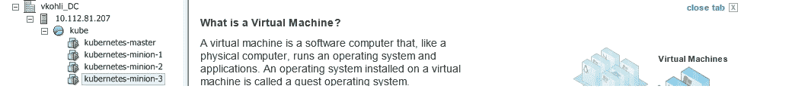
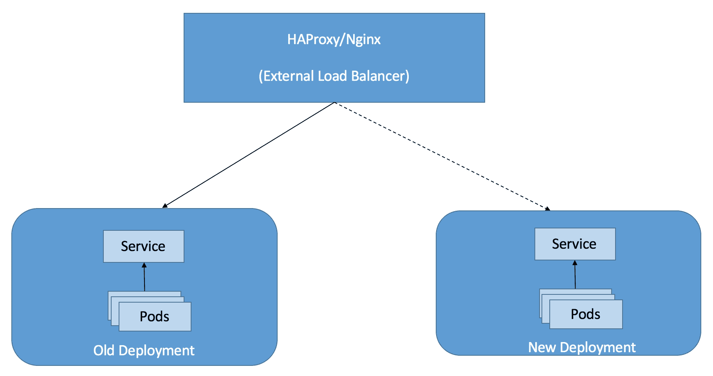
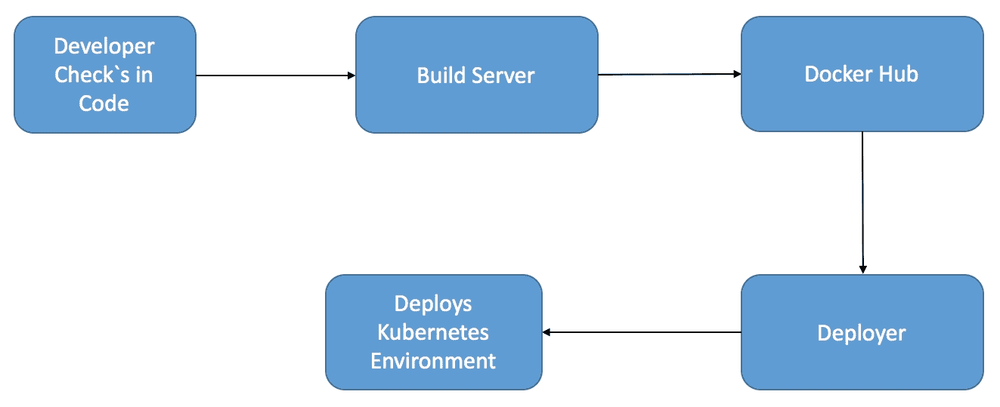

# 八、使用 Kubernetes 管理Docker容器

在前一章中，我们了解了 Docker 网络以及如何解决网络问题。在本章中，我们将介绍 Kubernetes。

Kubernetes 是一个容器集群管理工具。目前，它支持 Docker 和 Rocket。它是谷歌的一个开源项目，于 2014 年 6 月在谷歌输入/输出上推出。它支持在各种云提供商上部署，如 GCE、Azure、AWS、vSphere 和裸机。Kubernetes 管理器是精简的、可移植的、可扩展的和自我修复的。

在本章中，我们将介绍以下内容:

*   《Kubernetes的概论》
*   在裸机上部署 Kubernetes
*   在 Minikube 上部署 Kubernetes
*   在 AWS 和 vSphere 上部署 Kubernetes
*   部署吊舱
*   在生产环境中部署 Kubernetes
*   调试立方问题

Kubernetes 有以下各种重要成分:

*   **节点**:这是一个物理或虚拟机，是 Kubernetes 集群的一部分，运行 Kubernetes 和 Docker 服务，可以在其上调度 pods。
*   **Master** :这维护了 Kubernetes 的服务器运行时的运行时状态。它是配置和管理 Kubernetes 组件的所有客户端调用的入口点。
*   **Kubectl** :这是用来与 Kubernetes 集群交互的命令行工具，提供对 Kubernetes APIs 的主访问。通过它，用户可以部署、删除和列出 pods。
*   **Pod** :这是 Kubernetes 中最小的调度单元。它是共享卷且没有端口冲突的 Docker 容器的集合。它可以通过定义一个简单的 JSON 文件来创建。
*   **复制控制器**:这管理吊舱的生命周期，并通过根据需要创建或杀死吊舱来确保指定数量的吊舱在任何给定时间运行。
*   **Label**: Labels are used to identify and organize pods and services based on key-value pairs:

    

    库比涅斯特大师/minion flow

# 在裸机上部署 Kubernetes

Kubernetes 可以部署在裸机 Fedora 或 Ubuntu 机器上。甚至 Fedora 和 Ubuntu 虚拟机也可以部署在 vSphere、工作站或 VirtualBox 中。在接下来的教程中，我们将看到 Kubernetes 在单个 Fedora 24 机器上的部署，该机器将充当主节点，以及部署`k8s`吊舱的节点:

1.  启用 Kubernetes 测试 YUM 存储库:

    ```
     yum -y install --enablerepo=updates-testing kubernetes

    ```

2.  安装`etcd``iptables-services`:

    ```
     yum -y install etcd iptables-services

    ```

3.  在`/etcd/hosts`中，设置 Fedora 主节点和 Fedora 节点:

    ```
     echo "192.168.121.9  fed-master 
            192.168.121.65  fed-node" >> /etc/hosts

    ```

4.  禁用防火墙和`iptables-services` :

    ```
     systemctl disable iptables-services firewalld 
            systemctl stop iptables-services firewalld 

    ```

5.  编辑`/etcd/kubernetes/config`文件:

    ```
     # Comma separated list of nodes in the etcd cluster
            KUBE_MASTER="--master=http://fed-master:8080"
            # logging to stderr means we get it in the systemd journal
            KUBE_LOGTOSTDERR="--logtostderr=true"
            # journal message level, 0 is debug
            KUBE_LOG_LEVEL="--v=0"
            # Should this cluster be allowed to run privileged docker 
            containers
            KUBE_ALLOW_PRIV="--allow-privileged=false"

    ```

6.  编辑`/etc/kubernetes/apiserver`文件的内容:

    ```
     # The address on the local server to listen to. 
            KUBE_API_ADDRESS="--address=0.0.0.0" 

            # Comma separated list of nodes in the etcd cluster 
            KUBE_ETCD_SERVERS="--etcd-servers=http://127.0.0.1:2379" 

            # Address range to use for services         
            KUBE_SERVICE_ADDRESSES="--service-cluster-ip-
            range=10.254.0.0/16" 

            # Add your own! 
            KUBE_API_ARGS=""

    ```

7.  由于 Fedora 24 使用 etcd 2.0，

    ```
     ETCD_LISTEN_CLIENT_URLS="http://0.0.0.0:2379" 

    ```

    ，为了监听端口`2379`，文件`/etc/etcd/etcd.conf`应该有以下未注释的行
8.  **Kubernetes 节点设置可以在不同的主机上完成，但是我们将在当前机器上设置它们，以便在同一台机器上配置 Kubernetes 主节点和节点:**
9.  **编辑文件`/etcd/kubernetes/kubelet`如下:**

    ```
     ### 
            # Kubernetes kubelet (node) config 

            # The address for the info server to serve on (set to 0.0.0.0 
            or "" for 
            all interfaces) 
            KUBELET_ADDRESS="--address=0.0.0.0" 

            # You may leave this blank to use the actual hostname 
            KUBELET_HOSTNAME="--hostname-override=fed-node" 

            # location of the api-server 
            KUBELET_API_SERVER="--api-servers=http://fed-master:8080" 

            # Add your own! 
            #KUBELET_ARGS=""

    ```

10.  创建一个 shell 脚本来启动同一台机器上的所有 Kubernetes 主服务和节点服务:

    ```
     $ nano start-k8s.sh 
            for SERVICES in etcd kube-apiserver kube-controller-manager 
            kube-scheduler 
            kube-proxy kubelet docker; do  
                systemctl restart $SERVICES 
                systemctl enable $SERVICES 
                systemctl status $SERVICES  
            done

    ```

11.  创建一个`node.json`文件，在 Kubernetes 机器上进行配置:

    ```
            { 
                "apiVersion": "v1", 
                "kind": "Node", 
                "metadata": { 
                    "name": "fed-node", 
                    "labels":{ "name": "fed-node-label"} 
                }, 
                "spec": { 
                    "externalID": "fed-node" 
                } 
            } 

    ```

12.  使用以下命令创建节点对象:

    ```
     $ kubectl create -f ./node.json 

            $ kubectl get nodes 
            NAME               LABELS                  STATUS 
            fed-node           name=fed-node-label     Unknown 

    ```

13.  一段时间后，节点应该准备好部署吊舱:

    ```
     kubectl get nodes 
            NAME                LABELS                  STATUS 
            fed-node            name=fed-node-label     Ready

    ```

# 对 Kubernetes Fedora 手动设置进行故障排除

如果 kube-apiserver 无法启动，可能是由于服务帐户准入控制，需要一个服务帐户和一个令牌才能安排 pods。它由控制器自动生成。默认情况下，API 服务器使用 TLS 服务密钥，但是由于我们不是通过 HTTPS 发送，也没有 TLS 服务器密钥，因此我们可以向 API 服务器提供相同的密钥文件，以便 API 服务器验证生成的服务帐户令牌。

使用以下方法生成密钥并将其添加到`k8s`簇:

```
 openssl genrsa -out /tmp/serviceaccount.key 2048

```

要启动应用编程接口服务器，请在`/etc/kubernetes/apiserver`文件的末尾添加以下选项:

```
 KUBE_API_ARGS="--
         service_account_key_file=/tmp/serviceaccount.key"

```

`/etc/kubernetes/kube-controller-manager`在文件末尾添加以下选项:

```
 KUBE_CONTROLLER_MANAGER_ARGS=" -
 service_account_private_key_file
        =/tmp/serviceaccount.key"

```

使用`start_k8s.sh` shell 脚本重新启动集群。

# 使用 Minikube 部署 Kubernetes

Minikube 还在开发中；它是一个工具，可以轻松地在本地运行 Kubernetes，针对底层 OS (MAC/Linux)进行了优化。它在虚拟机中运行单节点 Kubernetes 集群。Minikube 帮助开发人员学习 Kubernetes，轻松进行日常开发和测试。

以下设置将介绍 Mac OS X 上的 Minikube 设置，因为在 Mac 上部署 Kubernetes 的指南很少:

1.  下载 Minikube 二进制文件:

    ```
     $ curl -Lo minikube 
    https://storage.googleapis.com/minikube/releases/v0.12.2/minikube-darwin-amd64
     % Total % Received % Xferd Average Speed Time Time Time Current
     Dload Upload Total Spent Left Speed
     100 79.7M 100 79.7M 0 0 1857k 0 0:00:43 0:00:43 --:--:-- 1863k

    ```

2.  授予二进制文件的执行权限:

    ```
    $ chmod +x minikube 

    ```

3.  将 Minikube 二进制文件移动到`/usr/local/bin`以便将其添加到路径中，并且可以直接在终端上执行:

    ```
     $ sudo mv minikube /usr/local/bin

    ```

4.  After this, we'll require the `kubectl` client binary to run commands against the single-node Kubernetes cluster, for Mac OS X:

    ```
    $ curl -Lo kubectl https://storage.googleapis.com/kubernetes-release/release/v1.3.0/bin/darwin/amd64/kubectl && chmod +x kubectl && sudo mv kubectl /usr/local/bin/

            https://storage.googleapis.com/kubernetes-release/release/v1.3.0/bin/darwin/amd64/kubectl && chmod +x kubectl && sudo mv kubectl /usr/local/bin/
              % Total % Received % Xferd Average Speed Time Time Time Current
                                         Dload Upload Total Spent Left Speed
            100 53.2M 100 53.2M 0 0 709k 0 0:01:16 0:01:16 --:--:-- 1723k 

    ```

    kubectl 现已配置为与集群一起使用。

5.  设置 Minikube 在本地部署虚拟机并配置 Kubernetes 集群:

    ```
     $ minikube start

            Starting local Kubernetes cluster...

            Downloading Minikube ISO

            36.00 MB / 36.00 MB

    		[==============================================] 
            100.00% 0s

    ```

6.  我们可以设置 kubectl 来使用一个 Minikube 上下文，如果需要的话，可以稍后切换:

    ```
     $ kubectl config use-context minikube 
            switched to context "minikube".

    ```

7.  我们将能够列出 Kubernetes 集群的节点:

    ```
     $ kubectl get nodes

            NAME       STATUS    AGE
            minikube   Ready     39m 

    ```

8.  创建一个`hello-minikube` pod 并将其作为服务公开:

    ```
     $ kubectl run hello-minikube --
              image=gcr.io/google_containers/echoserver:1.4 --port=8080

            deployment "hello-minikube" created

            $ kubectl expose deployment hello-minikube --type=NodePort

            service "hello-minikube" exposed 

    ```

9.  我们可以使用以下命令获得`hello-minikube`吊舱状态:

    ```
     $  kubectl get pod
         NAME                           READY   STATUS    RESTARTS   AGE          hello-minikube-3015430129-otr7u   1/1    running       0          36s
            vkohli-m01:~ vkohli$ curl $(minikube service hello-minikube --url)
            CLIENT VALUES:
            client_address=172.17.0.1
            command=GET
            real path=/
            query=nil
            request_version=1.1
            request_uri=http://192.168.99.100:8080/

            SERVER VALUES:
            server_version=nginx: 1.10.0 - lua: 10001

            HEADERS RECEIVED:
            accept=*/*
            host=192.168.99.100:30167
            user-agent=curl/7.43.0 

    ```

10.  We can open the Kubernetes dashboard using the following command and view details of the deployed pod:

    ```
     $ minikube dashboard

            Opening kubernetes dashboard in default browser... 

    ```

    

    Kubernetes ui showcasing hello-miniku pod

# 在 AWS 上部署 Kubernetes

让我们开始在 AWS 上部署 Kubernetes 集群，这可以通过使用 Kubernetes 代码库中已经存在的配置文件来完成。

1.  登录 AWS 控制台([http://aws.amazon.com/console/](http://aws.amazon.com/console/))
2.  打开 IAM 控制台([https://console.aws.amazon.com/iam/home?#home](https://console.aws.amazon.com/iam/home?))
3.  选择 IAM 用户名，选择**安全凭证**选项卡，然后单击**创建访问密钥**选项。
4.  创建密钥后，下载它们并将其保存在安全的地方。下载的 CSV 文件将包含访问密钥 ID 和秘密访问密钥，用于配置 AWS CLI。
5.  安装并配置 AWS 命令行界面。在本例中，我们使用以下命令在 Linux 上安装了 AWS CLI:

    ```
    $ sudo pip install awscli

    ```

6.  要配置 AWS-CLI，请使用以下命令:

    ```
    $ aws configure
    AWS Access Key ID [None]: XXXXXXXXXXXXXXXXXXXXXXXXXXXXXXXX
    AWS Secret Access Key [None]: YYYYYYYYYYYYYYYYYYYYYYYYYYYY
    Default region name [None]: us-east-1
    Default output format [None]: text

    ```

7.  配置完 AWS CLI 后，我们将创建一个配置文件，并为其附加一个角色，使其能够完全访问 S3 和 EC2。

    ```
    $ aws iam create-instance-profile --instance-profile-name Kube

    ```

8.  The role can be attached above the profile, which will have complete EC2 and S3 access, as shown in the following screenshot. The role can be created separately using the console or AWS CLI with the JSON file, which will define the permissions the role can have:

    ```
    $ aws iam create-role --role-name Test-Role --assume-role-policy-
              document /root/kubernetes/Test-Role-Trust-Policy.json

    ```

    

    在 Kubernetes 部署期间在 AWS 中附加策略

9.  创建角色后，可以使用以下命令将其附加到策略中:

    ```
    $ aws iam add-role-to-instance-profile --role-name Test-Role --
              instance-profile-name Kube

    ```

10.  该脚本使用默认配置文件；我们可以更改如下:

    ```
    $ export AWS_DEFAULT_PROFILE=Kube

    ```

11.  可以使用一个命令轻松部署 Kubernetes 集群，如下所示；

    ```
    $ export KUBERNETES_PROVIDER=aws; wget -q -O - https://get.k8s.io | bash
    Downloading kubernetes release v1.1.1 to /home/vkohli/kubernetes.tar.gz
    --2015-11-22 10:39:18--  https://storage.googleapis.com/kubernetes-
            release/release/v1.1.1/kubernetes.tar.gz
    Resolving storage.googleapis.com (storage.googleapis.com)... 
            216.58.220.48, 2404:6800:4007:805::2010
    Connecting to storage.googleapis.com 
            (storage.googleapis.com)|216.58.220.48|:443... connected.
    HTTP request sent, awaiting response... 200 OK
    Length: 191385739 (183M) [application/x-tar]
    Saving to: 'kubernetes.tar.gz'
    100%[======================================>] 191,385,739 1002KB/s   
            in 3m 7s
    2015-11-22 10:42:25 (1002 KB/s) - 'kubernetes.tar.gz' saved 
            [191385739/191385739]
    Unpacking kubernetes release v1.1.1
    Creating a kubernetes on aws...
    ... Starting cluster using provider: aws
    ... calling verify-prereqs
    ... calling kube-up
    Starting cluster using os distro: vivid
    Uploading to Amazon S3
    Creating kubernetes-staging-e458a611546dc9dc0f2a2ff2322e724a
    make_bucket: s3://kubernetes-staging-e458a611546dc9dc0f2a2ff2322e724a/
    +++ Staging server tars to S3 Storage: kubernetes-staging-
            e458a611546dc9dc0f2a2ff2322e724a/devel
    upload: ../../../tmp/kubernetes.6B8Fmm/s3/kubernetes-salt.tar.gz to 
            s3://kubernetes-staging-e458a611546dc9dc0f2a2ff2322e724a/devel/kubernetes-
            salt.tar.gz
    Completed 1 of 19 part(s) with 1 file(s) remaining

    ```

12.  前面的命令将使用`config-default.sh`脚本调用`kube-up.sh`并依次调用`utils.sh`，该脚本包含具有四个节点的`k8s`集群的基本配置，如下所示:

    ```
    ZONE=${KUBE_AWS_ZONE:-us-west-2a}
    MASTER_SIZE=${MASTER_SIZE:-t2.micro}
    MINION_SIZE=${MINION_SIZE:-t2.micro}
    NUM_MINIONS=${NUM_MINIONS:-4}
    AWS_S3_REGION=${AWS_S3_REGION:-us-east-1}

    ```

13.  实例在 Ubuntu 上运行。这个过程需要 5 到 10 分钟，之后会列出主服务器和从属服务器的 IP 地址，并可以用来访问 Kubernetes 集群。

# 在虚拟空间部署Kubernetes

Kubernetes 可以在`govc`的帮助下安装在 vs sphere 上(一个建立在 govmomi 之上的 vSphere CLI):

1.  在开始设置之前，我们必须安装 golang，这可以通过以下方式在 Linux 机器上完成:

    ```
     $ wget https://storage.googleapis.com/golang/go1.7.3.linux- 
     amd64.tar.gz

            $ tar -C /usr/local -xzf go1.7.3.linux-amd64.tar.gz

            $ go

            Go is a tool for managing Go source code.
            Usage:
              go command [arguments] 

    ```

2.  设置开始路径:

    ```
    $ export GOPATH=/usr/local/go
    $ export PATH=$PATH:$GOPATH/bin

    ```

3.  Download the pre-built Debian VMDK, which will be used to create the Kubernetes cluster on vSphere:

    ```
            $ curl --remote-name-all https://storage.googleapis.com/
            govmomi/vmdk/2016-01-08/kube.vmdk.gz{,.md5}
     % Total    % Received % Xferd  Average Speed   Time    Time     Time  
            Current
     Dload  Upload   Total   Spent    Left  
            Speed
            100  663M  100  663M   0   0  14.4M      0  0:00:45  0:00:45 --:--:-- 
            17.4M
            100    47  100    47   0   0     70      0 --:--:-- --:--:-- --:--:--   
            0
            $ md5sum -c kube.vmdk.gz.md5
            kube.vmdk.gz: OK
            $ gzip -d kube.vmdk.gz

    ```

# Kubernetes 设置故障排除

我们需要设置适当的环境变量来远程连接到 ESX 服务器，以部署 Kubernetes 集群。应设置以下环境变量，以便在虚拟空间上进行 Kubernetes 设置:

```
export GOVC_URL='https://[USERNAME]:[PASSWORD]@[ESXI-HOSTNAME-IP]/sdk'
export GOVC_DATASTORE='[DATASTORE-NAME]'
export GOVC_DATACENTER='[DATACENTER-NAME]'
#username & password used to login to the deployed kube VM
export GOVC_RESOURCE_POOL='*/Resources'
export GOVC_GUEST_LOGIN='kube:kube' 
export GOVC_INSECURE=true

```

### 注

在本教程中，请使用 ESX 和 vSphere 版本 5.5。

将`kube.vmdk`上传到 ESX 数据存储。VMDK 将存储在`kube`目录中，该目录将通过以下命令创建:

```
 $ govc datastore.import kube.vmdk kube

```

将 Kubernetes 提供者设置为 vSphere，并将 Kubernetes 集群部署在 ESX。这将包含一个 Kubernetes 主服务器和四个 Kubernetes 从数据存储中上传的扩展的`kube.vmdk`中派生的迷你服务器:

```
$ cd kubernetes
$ KUBERNETES_PROVIDER=vsphere cluster/kube-up.sh

```

这将显示四个虚拟机的 IP 地址列表。如果您当前正在开发 Kubernetes，您可以使用这种集群部署机制以下列方式测试新代码:

```
$ cd kubernetes
$ make release
$ KUBERNETES_PROVIDER=vsphere cluster/kube-up.sh

```

可以使用以下命令关闭集群:

```
$ cluster/kube-down.sh

```



部署在虚拟空间上的 Kubernetes 主节点/节点

# 立方吊舱部署

现在，在下面的示例中，我们将部署两个 NGINX 复制 pod(RC-pod)，并通过服务公开它们。要了解 Kubernetes 网络，请参考下图了解更多详细信息。在这里，应用可以通过虚拟 IP 地址公开，而要代理的请求(pod(负载平衡器)的副本)由服务处理:


库本内斯与 OVS 大桥联网

1.  在 Kubernetes 主文件中，创建一个新文件夹:

    ```
    $ mkdir nginx_kube_example
    $ cd nginx_kube_example

    ```

2.  在您选择的编辑器中创建 YAML 文件，该文件将用于部署 NGINX 吊舱:

    ```
    $ vi nginx_pod.yaml
    apiVersion: v1
    kind: ReplicationController
    metadata:
     name: nginx
    spec:
     replicas: 2
     selector:
     app: nginx
     template:
     metadata:
     name: nginx
     labels:
     app: nginx
     spec:
     containers:
     - name: nginx
     image: nginx
     ports:
     - containerPort: 80

    ```

3.  使用`kubectl:`

    ```
    $ kubectl create -f nginx_pod.yaml

    ```

    创建 NGINX 吊舱
4.  在前面的 pod 创建过程中，我们已经创建了 NGINX pod 的两个副本，其详细信息如下所示:

    ```
    $ kubectl get pods
    NAME          READY     REASON    RESTARTS   AGE
    nginx-karne   1/1       Running   0          14s
    nginx-mo5ug   1/1       Running   0          14s
    $ kubectl get rc
    CONTROLLER   CONTAINER(S)   IMAGE(S)   SELECTOR    REPLICAS
    nginx        nginx          nginx      app=nginx   2

    ```

5.  The container on the deployed minion can be listed as follows:

    ```
            $ docker ps
            CONTAINER ID        IMAGE                                   COMMAND
            CREATED             STATUS              PORTS               NAMES
            1d3f9cedff1d        nginx:latest                            "nginx -g 
            'daemon of   41 seconds ago      Up 40 seconds
            k8s_nginx.6171169d_nginx-karne_default_5d5bc813-3166-11e5-8256-
            ecf4bb2bbd90_886ddf56
            0b2b03b05a8d        nginx:latest                            "nginx -g 
            'daemon of   41 seconds ago      Up 40 seconds

    ```

6.  使用 YAML 文件部署 NGINX 服务，以便在主机端口`82` :

    ```
    $ vi nginx_service.yaml
    apiVersion: v1
    kind: Service
    metadata:
     labels:
     name: nginxservice
     name: nginxservice
    spec:
     ports:
     # The port that this service should serve on.
     - port: 82
     # Label keys and values that must match in order to receive traffic for 
            this service.
     selector:
     app: nginx
     type: LoadBalancer

    ```

    上公开 NGINX pod
7.  使用`kubectl:`

    ```
    $kubectl create -f nginx_service.yaml
    services/nginxservice

    ```

    创建 NGINX 服务
8.  NGINX 服务可以列举如下:

    ```
            $ kubectl get services
            NAME           LABELS                                   SELECTOR    IP(S)
            PORT(S)
            kubernetes     component=apiserver,provider=kubernetes  <none>      
            192.168.3.1    443/TCP
            nginxservice   name=nginxservice                        app=nginx   
            192.168.3.43   82/TCP

    ```

9.  现在通过服务可以访问 NGINX 服务器测试页面，网址如下:`http://192.168.3.43:82`

# 在生产环境中部署 Kubernetes

在本节中，我们将介绍一些重要的要点和概念，这些要点和概念可用于在生产中部署 Kubernetes。

*   **Exposing Kubernetes services**: Once we deploy the Kubernetes pods, we expose them using services. The Kubernetes service is an abstraction, which defines a set of pods and a policy to expose them as a microservice. The service gets its own IP address, but the catch is that this address only exists within the Kubernetes cluster, which means the service is not exposed to the Internet. It's possible to expose the service directly on the host machine port, but once we expose the service on the host machine, we get into port conflicts. It also voids Kubernetes benefits and makes it harder to scale the deployed service:

    

    通过外部负载平衡器公开的 Kubernetes 服务

    一种解决方案是添加一个外部负载平衡器，如 HAProxy 或 NGINX。这为每个 Kubernetes 服务配置了一个后端，并将流量代理到单个 pods。与 AWS 部署类似，Kubernetes 集群可以部署在 VPN 内部，AWS 外部负载平衡器可以用于公开每个 Kubernetes 服务:

*   **Support upgrade scenarios in Kubernetes**: In the case of an upgrade scenario, we need to have zero downtime. Kubernetes' external load balancer helps to achieve this functionality in cases of service deployment through Kubernetes. We can start a replica cluster running the new version of the service, and the older cluster version will serve the live requests. As and when the new service is ready, the load balancer can be configured to switch load to the new version. By using this approach, we can support a zero-runtime upgrade scenario for enterprise products:

    

    Kubernetes 部署中支持的升级方案

*   **Make the Kubernetes-based application deployment automatic**: With the help of a deployer, we can automate the process of testing, as well as deploying the Docker containers in production. In order to do so, we need to have a build pipeline and deployer, which pushes the Docker image to a registry such as Docker Hub after successful build. Then, the deployer will take care of deploying the test environment and invoke the test scripts. After successful testing, the deployer can also take care of deploying the service in the Kubernetes production environment:

    

    Kubernetes 应用部署管道

*   **了解资源限制**:了解启动 Kubernetes 集群时的资源限制，配置每个 pod 上的资源请求和 CPU/内存限制。大多数容器在生产环境中由于缺乏资源或内存不足而崩溃。容器应该经过良好的测试，并且应该为生产环境中的 pod 分配适当的资源，以便成功部署微服务。
*   **监控库本内斯集群**:库本内斯集群应该借助日志记录进行持续监控。日志记录工具，如 Graylog、Logcheck 或 Logwatch，应该与 Apache Kafka 一起使用，Apache Kafka 是一个从容器中收集日志并将其导向日志记录工具的消息传递系统。在卡夫卡的帮助下，很容易索引日志，以及处理巨大的流。Kubernetes 复制品完美无缺。如果有任何 pod 崩溃，Kubernetes 服务会重新启动它们，并根据配置保持副本数量始终正常运行。用户喜欢了解的一个方面是失败背后的真正原因。Kubernetes 指标和应用指标可以发布到时间序列存储，如 InfluxDB，它可以用来跟踪应用错误，并测量负载、吞吐量和其他统计数据，以执行故障后分析。
*   **Kubernetes 中的持久存储** : Kubernetes 有卷的概念，可以处理持久数据。我们希望在 Kubernetes 的生产部署中使用持久性存储，因为容器在重新启动时会丢失数据。卷由多种实现支持，例如主机、NFS 或使用云提供商卷服务。Kubernetes 还提供了两个 API 来处理持久存储:
*   **持久卷(PV)** :这是一种在集群中调配的资源，其行为就像节点是集群资源一样。Pods 根据需要从持久卷请求资源(CPU 和内存)。它通常由管理员提供。
*   **持久卷认领(PVC)** :一个 PVC 消耗 PV 资源。它是用户对存储的请求，类似于 pod。pod 可以根据需要请求不同级别的资源(CPU 和内存)。

# 调试不可解问题

在本节中，我们将讨论一些 Kubernetes 故障排除问题:

1.  The first step to debug the Kubernetes cluster is to list the number of nodes, using the following command:

    ```
    $ kubetl get nodes

    ```

    此外，验证所有节点都处于就绪状态。

2.  查看日志，找出部署的 Kubernetes 集群中的问题

    ```
     master:
     var/log/kube-apiserver.log - API Server, responsible for serving the API
            /var/log/kube-scheduler.log - Scheduler, responsible for making scheduling 
        decisions
            /var/log/kube-controller-manager.log - Controller that manages replication 
        controllers
     Worker nodes: 
     /var/log/kubelet.log - Kubelet, responsible for running containers on the 
        node
            /var/log/kube-proxy.log - Kube Proxy, responsible for service load 
        balancing 

    ```

3.  If the pod stays in the pending state, use the following command:

    ```
    $ cluster/kubectl.sh describe pod podname

    ```

    这将列出事件，并可能描述最后发生在吊舱上的事情。

4.  要查看所有集群事件，请使用以下命令:

    ```
    $ cluster/kubectl.sh get events

    ```

如果`kubectl`命令行无法到达`apiserver`进程，请确保设置了`Kubernetes_master`或`Kube_Master_IP`。确保`apiserver`进程在主数据库中运行，并检查其日志:

*   如果您能够创建复制控制器，但看不到面板:如果复制控制器没有创建面板，请检查控制器是否正在运行并查看日志。
*   如果`kubectl`永远挂起或吊舱处于等待状态:
    *   检查主机是否被分配到 pod，如果没有，则当前正在为它们安排一些任务。
    *   检查 kubelet 是否指向豆荚的`etcd`中的正确位置，以及`apiserver`是否使用了奴才的相同名称或 IP。
    *   如果出现问题，请检查 Docker 守护程序是否正在运行。此外，检查 Docker 日志，确保防火墙没有阻止从 Docker Hub 获取映像。
*   `apiserver`流程报告:
*   同步容器时出错:`Get http://:10250/podInfo?podID=foo: dial tcp :10250:` **连接被拒绝**:
    *   这意味着吊舱还没有被安排
    *   检查调度程序日志，查看它是否正常运行
    *   无法连接到容器
    *   尝试在服务端口或吊舱的 IP 地址远程登录到迷你主机
*   使用以下命令检查容器是否在 Docker 中创建:

    ```
     $ sudo docker ps -a

    ```

*   如果您没有看到容器，问题将出在 pod 配置、映像、Docker 或 kubelet 上。如果您看到容器每 10 秒钟创建一次，那么问题出在容器创建上，或者容器的过程失败了。
*   X.509 证书已过期或尚未生效。

检查客户端和服务器上的当前时间是否匹配。使用`ntpdate`进行一次性时钟同步。

# 总结

在本章中，我们学习了在 Kubernetes 的帮助下管理 Docker 容器。Kubernetes 在 Docker 编排工具中有不同的视角，其中每个 pod 将获得一个唯一的 IP 地址，pod 之间的通信可以在服务的帮助下进行。我们已经介绍了许多部署场景，以及在裸机、AWS、vSphere 或使用 Minikube 上部署 Kubernetes 时的故障排除问题。我们还研究了有效部署 Kubernetes 吊舱和调试 Kubernetes 问题。最后一部分帮助在生产环境中部署 Kubernetes，该环境具有负载平衡器、Kubernetes 服务、监控工具和持久存储。在下一章中，我们将介绍 Docker 卷以及如何在生产环境中有效地使用它们。