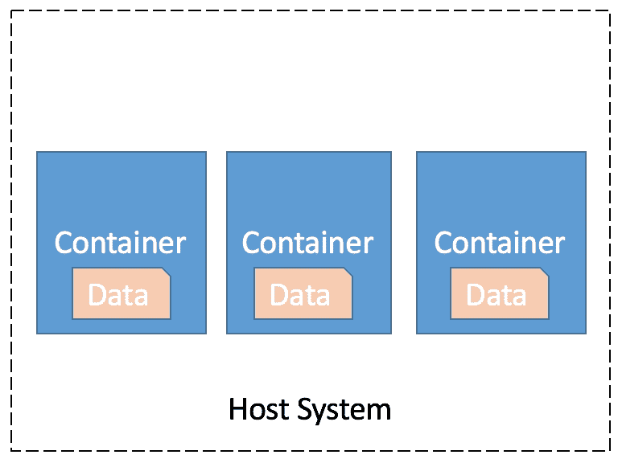
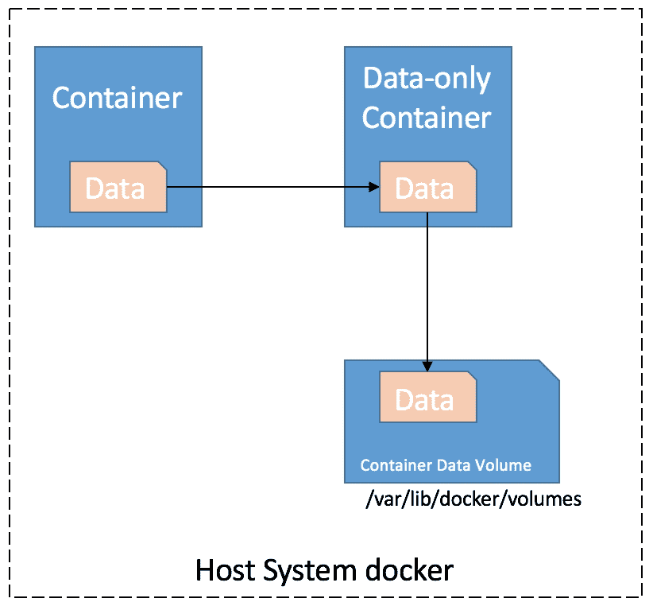
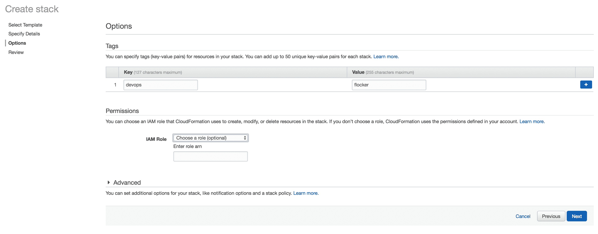
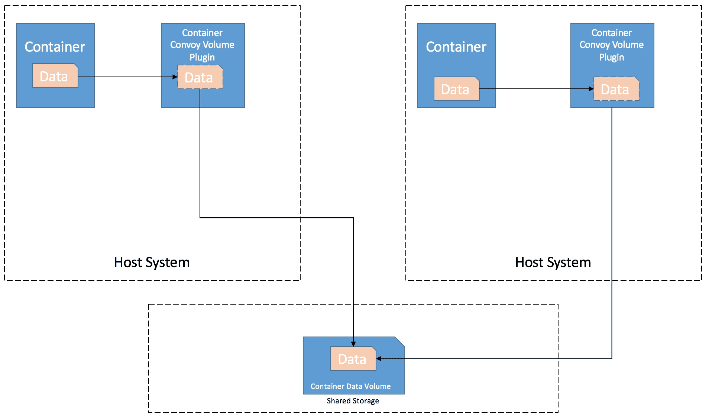
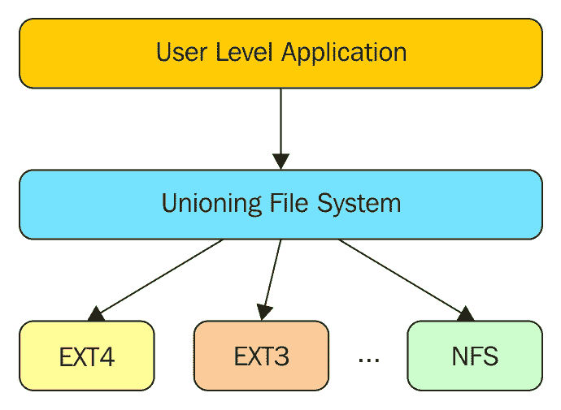

# 九、挂载卷

本章介绍了数据卷和存储驱动程序的概念，这些概念在 Docker 中广泛用于管理持久或共享数据。我们还将深入研究 Docker 支持的各种存储驱动程序，以及与之相关的基本管理命令。Docker 数据卷的三个主要用例如下:

*   删除容器后保持数据的持久性
*   在主机和 Docker 容器之间共享数据
*   跨 Docker 容器共享数据

为了理解 Docker 卷，我们需要理解 Docker 文件系统如何工作。Docker 映像存储为一系列只读层。当容器启动时，只读映像会在顶部添加一个读写层。如果当前文件需要修改，它将从只读层复制到读写层，并在读写层应用更改。读写层中文件的版本隐藏了底层文件，但不会破坏它。因此，当 Docker 容器被删除时，重新启动映像将启动具有新读写层的新容器，所有更改都将丢失。只读层之上的读写层组合被称为**联合文件系统** ( **UFS** )。为了保存数据并能够与主机和其他容器共享数据，Docker 提出了卷的概念。基本上，卷是存在于 UFS 之外的目录，表现为主机文件系统上的普通目录或文件。

Docker 卷的一些重要特性如下:

*   创建容器时，可以初始化卷
*   数据卷可以在其他数据容器之间重用和共享
*   即使删除了容器，数据卷也会保留数据
*   绕过 UFS，直接对数据量进行更改

在本章中，我们将介绍以下内容:

*   纯数据容器
*   托管由共享存储备份的映射卷
*   Docker 存储驱动器性能

# 通过了解 Docker 卷避免故障排除

在本节中，我们将研究处理数据和 Docker 容器的四种方法，这将有助于我们理解和实现前面提到的 Docker 卷的用例。

# 在 Docker 容器中存储数据的默认案例

在这种情况下，数据只在 Docker 容器中可见，而不来自主机系统。如果容器关闭或 Docker 主机死亡，数据将丢失。这种情况主要适用于打包在 Docker 容器中的服务，并且当它们返回时不依赖于持久数据:

```
$ docker run -it ubuntu:14.04 
root@358b511effb0:/# cd /tmp/ 
root@358b511effb0:/tmp# cat > hello.txt 
hii 
root@358b511effb0:/tmp# ls 
hello.txt 

```

如前例所示，`hello.txt`文件只存在于容器中，一旦容器死亡，该文件将不会被保存:



存储在 Docker 容器中的数据

# 纯数据容器

数据可以存储在 Docker UFS 之外的纯数据容器中。数据将在纯数据容器装载命名空间中可见。由于数据被保存在容器之外，所以即使在容器被删除后，数据仍然保留。如果任何其他容器想要连接到这个只包含数据的容器，只需使用`--volumes-from`选项抓取容器并将其应用到当前容器。让我们试试数据量容器:



使用纯数据容器

## 创建纯数据容器

```
$ docker create -v /tmp --name ubuntuvolume Ubuntu:14.04

```

在前面的命令中，我们创建了一个 Ubuntu 容器并附加了`/tmp`。它是一个基于 Ubuntu 映像的纯数据容器，存在于`/tmp`目录中。如果新的 Ubuntu 容器需要将一些数据写入我们的纯数据容器的`/tmp`目录，这可以通过`--volumes-from`选项来实现。现在，我们写入新容器的`/tmp`目录的任何内容都将保存在 Ubuntu 数据容器的`/tmp`卷中:

```
$ docker create -v /tmp --name ubuntuvolume ubuntu:14.04 
d694752455f7351e95d1563ed921257654a1867c467a2813ae25e7d99c067234

```

在容器-1 中使用数据量容器:

```
$ docker run -t -i --volumes-from ubuntuvolume ubuntu:14.04 /bin/bash 
root@127eba0504cd:/# echo "testing data container" > /tmp/hello 
root@127eba0504cd:/# exit 
exit 

```

使用容器-2 中的数据量容器来获取容器-1 共享的数据:

```
$ docker run -t -i --volumes-from ubuntuvolume ubuntu:14.04 /bin/bash 
root@5dd8152155de:/# cd tmp/ 
root@5dd8152155de:/tmp# ls 
hello 
root@5dd8152155de:/tmp# cat hello 
testing data container 

```

我们可以看到，容器-2 在`/tmp`空间中获取容器-1 写入的数据。这些示例演示了纯数据容器的基本用法。

## 在主机和 Docker 容器之间共享数据

这是一个常见的用例，需要在主机和 Docker 容器之间共享文件。在这个场景中，我们不需要创建一个数据容器；我们可以简单地运行任何 Docker 映像的容器，并简单地用主机系统目录中的内容覆盖其中一个目录。

让我们考虑一个例子，我们希望从主机系统访问 Docker NGINX 的日志。目前，它们在主机外部不可用，但这可以通过简单地将容器内部的`/var/log/nginx`映射到主机系统上的目录来实现。在这种情况下，我们将使用主机系统中的共享卷运行 NGINX 映像的副本，如下所示:


在主机和 Docker 容器之间共享数据

在主机系统中创建`serverlogs`目录:

```
$ mkdir /home/serverlogs

```

运行 NGINX 容器并将`/home/serverlogs`映射到 Docker 容器内的`/var/log/nginx`目录:

```
$ docker run -d -v /home/serverlogs:/var/log/nginx -p 5000:80 nginx 
Unable to find image 'nginx:latest' locally 
latest: Pulling from library/nginx 
5040bd298390: Pull complete 
...

```

从主机系统访问`http://localhost:5000`，发布这个，会生成日志，可以在主机系统的`/home/serverlogs`目录下访问，映射到 Docker 容器内的`/var/log/nginx`，如下图:

```
$ cd serverlogs/ 
$ ls 
access.log  error.log 
$ cat access.log  
172.17.42.1 - - [20/Jan/2017:14:57:41 +0000] "GET / HTTP/1.1" 200 612 "-" "Mozilla/5.0 (X11; Ubuntu; Linux x86_64; rv:50.0) Gecko/20100101 Firefox/50.0" "-" 

```

# 共享存储备份的主机映射卷

Docker 卷插件允许我们挂载一个共享存储后端。这样做的主要优点是，在主机出现故障的情况下，用户永远不会遭受数据丢失，因为它由共享存储支持。在前面的方法中，如果我们迁移容器，卷不会被迁移。可以借助外部 Docker 卷插件**Flocker****Convy**来实现，这些插件使卷可移植，并有助于在带有卷的主机之间轻松迁移容器，同时保护数据，因为它不依赖于主机文件系统。

## 絮凝剂

Flocker 被广泛用于运行需要持久存储的容器化有状态服务和应用。Docker 提供了卷管理的一个非常基本的视图，但是 Flocker 通过提供卷的持久性、故障转移和高可用性来增强它。Flocker 可以使用 Docker Swarm 和 compose 手动部署，如果备份的存储必须用于生产设置，也可以借助 CloudFormation 模板在 AWS 上轻松设置。

借助以下步骤，可以在 AWS 上轻松部署 Flocker:

1.  登录您的 AWS 帐户，并在亚马逊 EC2 中创建一个密钥对。
2.  从 AWS 主页选择**云信息**。
3.  借助 AWS S3 存储中的模板，可以使用以下链接启动弗洛克云形成栈:`https://s3.amazonaws.com/installer.downloads.clusterhq.com/flocker-cluster.cloudformation.json`
4.  Select create stack; then select the second option and specify the Amazon S3 template URL:

    

5.  On the next screen, specify the **Stack name**, **AmazonAccessKeyID**, and **AmazonSecretAccessKey** for the account:

    

6.  Provide the key-value pairs to tag this Flocker stack, and provide the **IAM Role** for this stack if required:

    

7.  Review the details and launch the Flocker cloud formation stack:

    

8.  一旦从 outputs 选项卡完成栈部署，获取客户端节点和控制节点的 IP 地址。使用在 Flocker 栈部署开始时生成的键值对将 SSH 引入客户端节点。

设置以下参数:

```
$ export FLOCKER_CERTS_PATH=/etc/flocker 
$ export FLOCKER_USER=user1 
$ export FLOCKER_CONTROL_SERVICE=<ControlNodeIP> # not ClientNodeIP! 
$ export DOCKER_TLS_VERIFY=1 
$ export DOCKER_HOST=tcp://<ControlNodeIP>:2376 
$ flockerctl status # should list two servers (nodes) running 
$ flockerctl ls # should display no datasets yet 
$ docker info |grep Nodes # should output "Nodes: 2"

```

如果 Flocker `status`和`ls`命令成功运行，这意味着 Docker Swarm 和 Flocker 已经在 AWS 上成功设置。

Flocker 卷可以轻松设置，并允许您创建一个容器，该容器将在容器或容器主机的生命周期之外持续存在:

```
$ docker run --volume-driver flocker -v flocker-volume:/cont-dir --name=testing-container 

```

将创建一个外部存储块并将其装载到我们的主机上，容器目录将绑定到它。如果容器被删除或主机崩溃，数据仍然是安全的。可以使用相同的命令在第二个主机中启动备用容器，我们将能够访问共享存储。前面的教程是在 AWS 上为一个生产用例设置 Flocker，但是我们也可以在 Docker Swarm 设置的帮助下在本地测试 Flocker。让我们考虑一个用例，其中您有两个 Docker Swarm 节点和一个 Flocker 客户端节点。

## 在弗洛克客户端节点中

创建一个`docker-compose.yml`文件并定义容器`redis`和`clusterhq/flask`。提供相应的配置 Docker 映像、名称、端口和数据卷:

```
$ nano docker-compose.yml
web: 
  image: clusterhq/flask 
  links: 
   - "redis:redis" 
  ports: 
   - "80:80" 
redis: 
  image: redis:latest 
  ports: 
   - "6379:6379" 
  volumes: ["/data"]

```

创建一个名为`flocker-deploy.yml`的文件，在这里我们将定义两个将部署在相同节点上的容器-`node-1`；将`node-2`留为空白，从蜂群群集开始:

```
$ nano flocker-deploy.yml
"version": 1 
"nodes": 
  "node-1": ["web", "redis"] 
  "node-2": []

```

使用前面的`.yml`文件部署容器；我们只需要运行以下命令就可以做到这一点:

```
$ flocker-deploy control-service flocker-deploy.yml docker-compose.yml 

```

群集配置已更新。更改可能需要一段时间才能生效，尤其是在需要提取 Docker 映像的情况下。

可以观察到两个容器都在`node-1`中运行。设置完成后，我们可以在`http://node-1`上访问应用。它将显示此网页的访问次数:

```
"Hello... I have been seen 8 times" 

```

重新创建部署文件，以便将容器移动到`node-2`:

```
$ nano flocker-deply-alt.yml 
"version": 1\. 
"nodes": 
  "node-1": ["web"] 
  "node-2": ["redis"] 

```

现在，我们将把容器从`node-1`迁移到`node-2`，我们将看到 Flocker 将自动处理卷管理。当它出现在`node-2`时，它会将现有的卷插入 Redis 容器:

```
$ flocker-deploy control-service flocker-deploy-alt.yml docker-compose.yml

```

群集配置已更新。更改可能需要一段时间才能生效，尤其是在需要提取 Docker 映像的情况下。

我们可以 SSH 到`node-2`中，列出正在运行的 Redis 容器。尝试访问`http://node2`上的应用；我们将能够看到计数仍然保持在`node-1`中，并且随着从`node-2`访问应用而增加`1`:

```
"Hello... I have been seen 9 times" 

```

这个例子展示了我们如何轻松地将 Flocker 集群中的容器及其数据卷从一个节点迁移到另一个节点。

## 车队 Docker 卷插件

护航是另一个 Docker 卷插件，广泛用于提供存储后端。它是用 Go 编写的，主要优点是可以在独立模式下部署。护航将作为 Docker 卷扩展运行，并将表现得像一个中间容器。“护卫队”的初始实施利用了 Linux 设备，并为卷提供了以下四种 Docker 存储功能:

*   精简配置的卷
*   跨主机恢复卷
*   拍摄卷的快照
*   Back up the volumes to external object stores such as **Amazon EBS**, **Virtual File System** (**VFS**), and **Network File System** (**NFS**):

    

    使用护航卷插件

在下面的示例中，我们将运行一个本地护航设备映射器驱动程序，并展示在两个容器之间使用护航卷插件来共享数据:

1.  验证 Docker 版本是否高于 1.8。
2.  通过本地下载插件 tar 文件并提取它来安装护航插件:

    ```
     $ wget https://github.com/rancher/convoy/releases/download
            /v0.5.0/convoy.tar.gz 
            $ tar xvf convoy.tar.gz 
            convoy/ 
            convoy/convoy-pdata_tools 
            convoy/convoy 
            convoy/SHA1SUMS 
            $ sudo cp convoy/convoy convoy/convoy-pdata_tools /usr/local/bin/ 
            $ sudo mkdir -p /etc/docker/plugins/ 
            $ sudo bash -c 'echo "unix:///var/run/convoy/convoy.sock" > 
            /etc/docker/plugins/convoy.spec'

    ```

3.  我们可以继续使用文件备份循环设备，该设备充当伪设备，并使文件可作为块设备访问，以便演示护航设备映射器驱动程序:

    ```
     $ truncate -s 100G data.vol 
            $ truncate -s 1G metadata.vol 
            $ sudo losetup /dev/loop5 data.vol 
            $ sudo losetup /dev/loop6 metadata.vol

    ```

4.  一旦数据和元数据设备被设置，启动护卫插件守护程序:

    ```
     sudo convoy daemon --drivers devicemapper --driver-opts 
            dm.datadev=/dev/loop5 --driver-opts dm.metadatadev=/dev/loop6

    ```

5.  在前面的终端中，护卫守护进程将开始运行；打开下一个终端实例并创建一个`busybox` Docker 容器，该容器使用安装在容器内`/sample`目录下的护航卷【T1:

    ```
     $ sudo docker run -it -v test_volume:/sample --volume-driver=convoy 
            busybox 
            Unable to find image 'busybox:latest' locally 
            latest: Pulling from library/busybox 
            4b0bc1c4050b: Pull complete   
            Digest: sha256:817a12c32a39bbe394944ba49de563e085f1d3c5266eb8
            e9723256bc4448680e 
            Status: Downloaded newer image for busybox:latest

    ```

6.  在挂载的目录下创建一个示例文件:

    ```
     / # cd sample/ 
            / # cat > test 
            testing 
            /sample # exit

    ```

7.  使用卷驱动程序作为护航来启动不同的容器，并挂载相同的护航卷:

    ```
     $ sudo docker run -it -v test_volume:/sample --volume-driver=convoy --
            name=new-container busybox 

    ```

8.  当我们进行`ls`时，我们将能够看到在前面的容器中创建的文件:

    ```
     / # cd sample/ 
            /sample # ls 
            lost+found  test 
            /sample # exit

    ```

因此，前面的示例显示了护航如何允许驻留在相同或不同主机上的容器之间共享卷。

基本上，卷驱动程序应该用于持久数据，如 WordPress MySQL DB:

```
$ docker run --name wordpressdb --volume-driver=convoy -v test_volume:/var/lib/mysql -e MYSQL_ROOT_PASSWORD=password -e MYSQL_DATABASE=wordpress -d mysql:5.7 
1e7908c60ceb3b286c8fe6a183765c1b81d8132ddda24a6ba8f182f55afa2167 

$ docker run -e WORDPRESS_DB_PASSWORD=password -d --name wordpress --link wordpressdb:mysql  wordpress 
0ef9a9bdad448a6068f33a8d88391b6f30688ec4d3341201b1ddc9c2e641f263

```

在前面的例子中，我们已经使用护航卷驱动程序启动了 MySQL 数据库，以便在主机出现故障时提供持久性。然后，我们在 WordPress Docker 容器中链接了 MySQL 数据库。

# Docker 存储驱动程序性能

在本节中，我们将研究 Docker 支持的文件系统的性能方面和比较。可插拔存储驱动程序体系结构和插入卷的灵活性是容器化环境和生产用例的最佳方法。Docker 支持 aufs、btrfs、devicemapper、vfs、zfs 和 overlayfs 文件系统。

## UFS 基础

如前所述，Docker 使用 UFS 是为了获得只读的分层方法。

Docker 使用 UFS 将几个这样的层组合成一个映像。本节将深入探讨 Docker 支持的 UFS 和存储驱动程序的基础知识。

UFS 递归地将几个目录合并到一个虚拟视图中。UFS 的基本愿望是有一个只读文件系统和一些可写的覆盖。这给人一种错觉，即文件系统具有读写访问权限，即使它是只读的。UFS 使用写时复制来支持这一功能。此外，UFS 对目录而不是驱动器进行操作。

底层文件系统并不重要。UFS 可以组合来自不同底层文件系统的目录。组合不同的底层文件系统是可能的，因为 UFS 拦截了绑定到这些文件系统的操作。下图显示 UFS 位于用户应用和文件系统之间。UFS 的例子有联合金融服务、另一个联合金融服务(AUFS)等等:



分支机构的 UFS 和底层文件系统

### UFS -术语

UFS 的分支机构是合并的文件系统。分支可以有不同的访问权限，如只读、读写等。ufs 是可堆叠的文件系统。还可以为分支分配首选项，这些首选项决定了在文件系统上执行操作的顺序。如果在多个分支中存在具有相同文件名的目录，则目录的内容在 UFS 看起来是合并的，但是对这些目录中的文件的操作被重定向到相应的文件系统。

UFS 允许我们在只读文件系统上创建一个可写层，并创建新的文件/目录。它还允许更新现有文件。通过将文件复制到可写层，然后进行更改，可以更新现有文件。只读文件系统中的文件保持原样，但 UFS 创建的虚拟视图将显示更新的文件。将文件复制到可写层进行更新的现象称为复制。

有了备份，删除文件就变得复杂了。当试图删除一个文件时，我们必须从下往上删除所有的副本。这可能会导致只读图层出现错误，无法删除文件。在这种情况下，文件将从可写层中移除，但仍存在于下面的只读层中。

### UFS -议题

UFS 最明显的问题是对底层文件系统的支持。由于 UFS 包装了必要的分支及其文件系统，文件系统支持必须添加到 UFS 源代码中。底层文件系统不会改变，但是 UFS 必须为它们中的每一个增加支持。

删除文件后产生的空白也会导致很多问题。首先也是最重要的是，它们污染了文件系统名称空间。这可以通过在一个子目录中添加空白来减少，但这需要特殊处理。此外，由于出现空白，`rmdir`性能会下降。即使一个目录看起来是空的，它也可能包含许多空白，因此`rmdir`不能删除该目录。

复制在 UFS 是一个很好的功能，但它也有缺点。它降低了第一次更新的性能，因为它必须将完整的文件和目录层次复制到可写层。此外，目录复制的时间需要决定。有两种选择:在更新时复制整个目录层次结构，或者在目录打开时进行。这两种技术各有利弊。

#### 上

东盟自由贸易区是另一个 uFS。自动文件系统是从 uFS 文件系统分叉出来的。这引起了开发商的注意，现在已经远远领先于 UFS。事实上，UFS 现在正在遵循开发水下机器人时做出的一些设计决定。像任何 UFS 一样，自动文件系统创建现有的文件系统，并在其上覆盖一个统一的视图。

AuFS 支持前面章节中提到的所有 uFS 特性。你需要在 Ubuntu 上安装`aufs-tools`包才能使用 AuFS 命令。关于自动导航系统及其命令的更多信息可以在自动导航系统手册页上找到。

#### 设备映射器

**设备映射器**是一个 Linux 内核组件；它提供了一种将物理块设备映射到虚拟块设备的机制。这些映射的设备可以用作逻辑卷。设备映射器提供了一种创建此类映射的通用方法。

设备映射器维护一个定义设备映射的表。该表指定了如何映射设备的每个逻辑扇区范围。该表包含以下参数的行:

*   `start`
*   `length`
*   `mapping`
*   `mapping_parameters`

第一行的`start`值始终为零。对于其他行，开始加上前一行的长度应等于当前行的`start`值。设备映射器的大小总是以 512 字节的扇区来指定。有不同类型的映射目标，如线性、条带、镜像、快照、快照源等。

## Docker 如何使用设备映射器

Docker 使用设备映射器的精简资源调配和快照功能。这些功能允许许多虚拟设备存储在同一个数据卷上。两个独立的设备用于数据和元数据。数据设备用于池本身，元数据设备包含有关卷、快照、存储池中的数据块以及每个快照的数据块之间的映射的信息。因此，Docker 创建了一个大数据块设备，并在其上创建了一个精简池。然后，它会创建一个基块设备。每个映像和容器都是由这个基本设备的快照形成的。

### 偏置

**BTRFS** 是一个 Linux 文件系统，有可能取代当前默认的 Linux 文件系统 EXT3/EXT4。BTRFS(也称为**黄油文件系统**)基本上是一个写时复制文件系统。**写时复制** ( **CoW** )意味着它从不更新数据。相反，它会为存储在磁盘其他地方的那部分数据创建一个新的副本，保持旧的部分不变。任何对文件系统有一定了解的人都会明白，CoW 需要更多的空间，因为它也存储数据的旧副本。此外，它还有碎片化的问题。那么，如何将 CoW 文件系统用作默认的 Linux 文件系统呢？那不会降低性能吗？没必要提存储空间的问题。让我们深入了解 BTRFS，了解它为何如此受欢迎。

BTRFS 的主要设计目标是开发一个通用文件系统，该文件系统可以在任何用例和工作负载下运行良好。大多数文件系统对于特定的文件系统基准测试来说表现良好，而对于其他场景来说性能并不是很好。除此之外，BTRFS 还支持快照、克隆和 RAID(0、1、5、6、10 级)。这比以前任何人从文件系统中预料的都要多。人们可以理解设计的复杂性，因为 Linux 文件系统部署在各种设备上，从计算机和智能手机到小型嵌入式设备。BTRFS 布局用 B 树表示，更像是 B 树的森林。这些是写时复制友好的 B 树。由于 CoW 文件系统需要更多一点的磁盘空间，一般来说，BTRFS 有一个非常复杂的空间回收机制。它有一个垃圾收集器，利用引用计数来回收未使用的磁盘空间。对于数据完整性，BTRFS 使用校验和。

通过将`--storage-driver`选项传递到`dockerd`命令行，或者在`/etc/default/docker`文件中设置`DOCKER_OPTS`选项，可以选择存储驱动程序:

```
$ dockerd --storage-driver=devicemapper &

```

我们考虑了前面三个广泛使用的 Docker 文件系统，以便使用微基准工具对下面的 Docker 命令进行性能分析；`fio`是用于分析文件系统细节的工具，例如随机写入:

*   `commit`: This is used to create a Docker image out of a running container:

    

    描述提交包含单个大型文件的大型容器所需时间的图表

*   `build`: This is used to build an image from using a Dockerfile which contains a set of steps to be followed to create an image from scratch containing a single large file:

    

    描述在不同文件系统上构建容器所需时间的图表

*   `rm`: This is used to remove a stopped container:

    

    图表描述了使用 rm 命令移除保存数千个文件的容器所需的时间

*   `rmi`: This is used to remove an image:

    

    图表描述了使用 rmi 命令删除包含单个大文件的大容器所需的时间

从前面的测试中，我们可以清楚地看到，对于 Docker 命令，AuFS 和 BTRFS 的性能非常好，但是 BTRFS 容器执行许多小的写操作会导致 BTRFS 块的使用不佳。这最终会导致 Docker 主机出现空间不足的情况并停止工作。使用 BTRFS 存储驱动程序密切监视 BTRFS 文件系统上的可用空间。此外，由于 BTRFS 日志记录技术，顺序写入会受到影响，性能会减半。

设备映射器的性能很差，因为每次容器更新现有数据时，存储驱动程序都会执行 CoW 操作。拷贝是从映像快照到容器的快照，可能会对容器性能产生显著影响。

对于容器密度起重要作用的 PaaS 和其他类似用例，AuFS 看起来是一个不错的选择。AuFS 在运行之间高效地共享映像，实现了快速的容器启动时间和最少的磁盘空间使用。它还非常高效地使用系统页面缓存。重叠文件系统是一种类似于自动文件系统的现代文件系统，但设计更简单，速度可能更快。但是目前，OverlayFS 还不够成熟，无法在生产环境中使用。在不久的将来，它可能会成为自主金融机构的继承者。没有一个驱动程序非常适合每个用例。用户应该根据用例并考虑应用所需的稳定性来选择存储驱动程序，或者继续使用发行版 Docker 包安装的默认驱动程序。如果主机系统是 RHEL 或其变体，设备映射器是默认存储驱动程序。对于 Ubuntu，AuFS 是默认的驱动程序。

# 总结

在本章中，我们深入探讨了与 Docker 相关的数据量和存储驱动程序概念。我们讨论了在这四种方法的帮助下对数据量进行故障排除，以及它们的优缺点。将数据存储在 Docker 容器中的第一种情况是最基本的情况，但是不能提供在生产环境中管理和处理数据的灵活性。第二种和第三种情况是使用纯数据容器或直接在主机上存储数据。这些情况有助于提供可靠性，但仍取决于主机的可用性。第四种情况是使用第三方卷插件，如 Flocker 或 curvest，通过将数据存储在单独的块中来解决所有上述问题，并提供数据的可靠性，即使容器从一个主机传输到另一个主机或容器死亡。在最后一节中，我们讨论了 Docker 存储驱动程序和 Docker 提供的插件架构，以使用所需的文件系统，如 AuFS、BTRFS、设备映射器、vfs、zfs 和 OverlayFS。我们深入研究了 AuFS、BTRFS 和设备映射器，它们是广泛使用的文件系统。从我们使用基本 Docker 命令进行的各种测试来看，AuFS 和 BTRFS 提供了比设备映射器更好的性能。用户应该根据他们的应用用例和 Docker 守护程序主机系统选择 Docker 存储驱动程序。

在下一章中，我们将讨论公共云中的 Docker 部署、AWS 和 Azure 以及故障排除问题。