# 第十章。公共云中的 Docker 部署- AWS 和 Azure

在本章中，我们将在公共云 AWS 和 Azure 上进行 Docker 部署。AWS 在 2014 年底推出了**弹性计算云** ( **EC2** )容器服务。在推出时，该公司强调容器集群管理的管理任务，并基于亚马逊过去发布的服务调用高级应用编程接口。AWS 最近发布了 AWS Beta 版的 Docker，用户可以在 AWS 和 Azure 上快速设置和配置 Docker 1.13 集群模式。在这项新服务的帮助下，我们获得了以下功能:

*   它确保团队能够将应用从开发人员的笔记本电脑无缝地移动到 Dockerised 暂存和生产环境中
*   它有助于与底层 AWS 和 Azure 基础架构深度集成，利用主机环境，并向使用公共云的管理员展示熟悉的界面
*   它部署平台并轻松地跨各种平台迁移，在这些平台上可以简单高效地移动 Dockerised 应用
*   它确保应用在所选平台、硬件、基础设施和操作系统上以最新、最好的 Docker 版本完美运行

在本章的后半部分，我们将介绍 Azure 容器服务，它使创建、配置和管理虚拟机集群变得简单，这些虚拟机集群为运行容器应用提供支持。它允许我们使用微软 Azure 部署和管理容器应用。它还支持各种 Docker 编排工具，如 DC/操作系统、Docker Swarm 或 Kubernetes(根据用户选择)。

在本章中，我们将涵盖以下主题:

*   **亚马逊 EC2 容器服务** ( **亚马逊** **ECS** )架构
*   AWS ECS 部署故障排除
*   更新 ECS 群集中的 Docker 容器
*   微软 Azure 容器服务的体系结构
*   Microsoft Azure 容器服务故障排除
*   AWS 和 Azure 的 Docker 测试版

# 亚马逊 ECS 的架构

亚马逊 ECS 的核心架构是集群管理器，这是一个后端服务，处理集群协调和状态管理的任务。调度程序管理器位于集群管理器之上。它们彼此解耦，允许客户构建自己的调度程序。资源池包括由容器划分的中央处理器、内存和亚马逊 EC2 实例的网络资源。Amazon ECS 通过运行在每个 EC2 实例上的开源 Amazon ECS 容器代理来协调集群，并根据调度程序的请求执行启动、停止和监控容器的工作。为了管理一个单一的真实来源:EC2 实例、在其上运行的任务以及所利用的容器和资源。我们需要将状态存储在某个地方，这是在集群管理器键/值存储中完成的。为了强大和可扩展，这个密钥/值存储需要持久、可用，并防止网络分区和硬件故障。为了实现这个键/值存储的并发控制，需要维护一个基于事务日志的数据存储来记录每个条目的变化。Amazon ECS 集群管理器已经打开了一组 API，允许用户访问存储在键/值存储中的所有集群状态信息。通过`list`命令，客户可以检索正在管理的集群、正在运行的任务和 EC2 实例。`describe`命令可以帮助检索特定 EC2 实例及其可用资源的详细信息。Amazon ECS 架构提供了一个高度可扩展、可用且低延迟的容器管理解决方案。它得到全面管理，并提供运营效率，允许客户构建和部署应用，而不用考虑集群的管理或扩展:

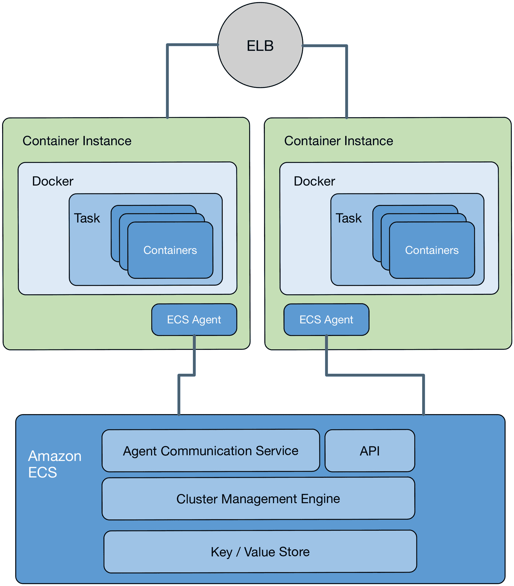

亚马逊 ECS 架构

# 故障排除- AWS ECS 部署

EC2 实例可以手动部署，可以在其上配置 Docker，但 ECS 是由 ECS 管理的一组 EC2 实例。ECS 将负责跨集群中的各种主机部署 Docker 容器，并与其他 AWS 基础架构服务集成。

在本节中，我们将介绍在 AWS 上设置 ECS 的一些基本步骤，这将有助于排除和绕过基本配置错误:

*   创建 ECS 集群
*   创建 ELB 负载平衡器
*   在 ECS 集群中运行 Docker 容器
*   更新 ECS 群集中的 Docker 容器

1.  Launch the **EC2 Container Service** listed under **Compute** from the AWS Console:

    

2.  Click on the **Get Started** button:

    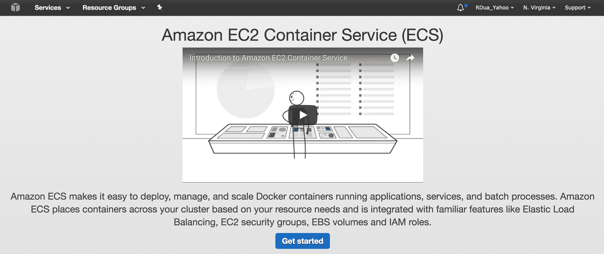

3.  On the next screen, select both options: deploy a sample application, create, and manage a private repository. A private repository is created for the EC2 service and secured by AWS. It requires an AWS login to push images:

    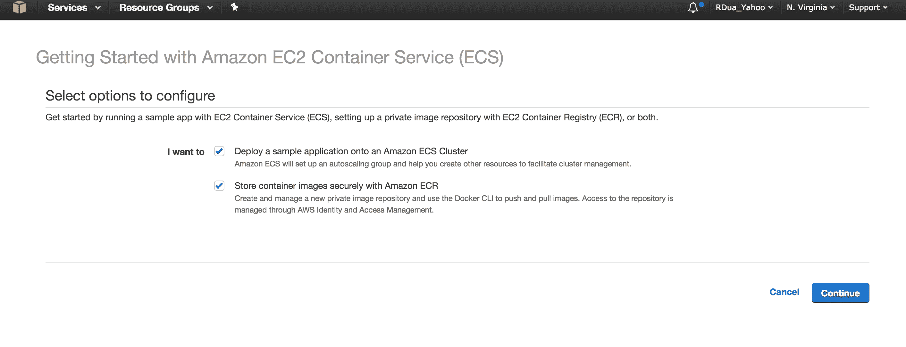

4.  Provide the repository name, and we'll be able to see the repository address where container images need to be pushed being generated:

    

5.  The next screen shows some of the basic Docker and AWS CLI commands to push the container images to the private repository, as the following shows:

    在`pip`包管理器的帮助下安装 AWS 命令行界面:

    ```
     $ pip install awscl

    ```

    使用`aws configure`命令并提供一个自动气象站访问密钥 ID 和自动气象站秘密访问密钥来登录:

    ```
     $ aws configure 
            AWS Access Key ID [None]:  
            AWS Secret Access Key [None]: 
            Default region name [None]:  
            Default output format [None]:

    ```

    获取`docker login`命令，向专用 AWS 注册表验证本地 Docker 客户端:

    ```
     $ aws ecr get-login --region us-east-1 
            docker login -u AWS -p 
            Key...

    ```

    使用作为前面命令的输出生成的链接，该命令将配置 Docker 客户端与部署在 AWS 中的私有存储库一起工作:

    ```
     $ docker login -u AWS -p Key... 
            Flag --email has been deprecated, will be removed in 1.13\. 
            Login Succeeded 

    ```

    现在，我们将使用 AWS 私有存储库名称标记 nginx 基本容器映像，以便将其推送到私有存储库:

    ```
     $ docker images 
            REPOSITORY  TAG     IMAGE ID      CREATED     SIZE 
            nginx       latest  19146d5729dc  6 days ago  181.6 MB 

            $ docker tag nginx:latest private-repo.amazonaws.com/sample:latest 

            $ docker push private-repo.amazonaws.com/sample:latest 
            The push refers to a repository [private-repo.amazonaws.com/sample] 
            e03d01018b72: Pushed  
            ee3b1534c826: Pushing [==>] 2.674 MB/58.56 MB 
            b6ca02dfe5e6: Pushing [>] 1.064 MB/123.1 MB  
            ... Image successfully pushed

    ```

6.  将映像推送到私有 Docker 存储库后，我们将创建一个任务定义，定义如下:
    *   要运行的 Docker 映像
    *   要分配的资源(中央处理器、内存和其他)
    *   要装载的卷
    *   要链接在一起的Docker容器
    *   启动时应该运行的命令容器
    *   要为容器设置的环境变量
    *   任务应该用于权限的 IAM 角色
    *   特权Docker容器与否
    *   给 Docker 容器的标签
    *   The port mapping and network, and Docker networking mode to be used for the containers:

        

7.  Advanced container configuration gives us the option to declare the **CPU units**, **Entry point**, privileged container or not, and so on:

    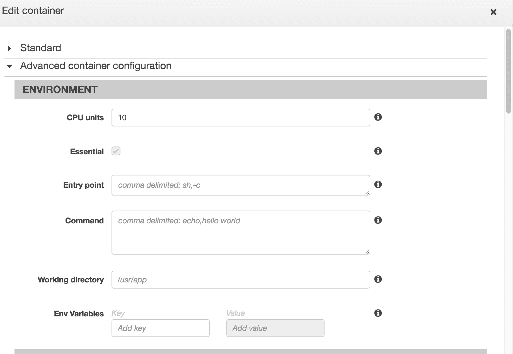

8.  In the next step, we'll be declaring the service useful for a task that runs continuously, such as a web service.

    这允许我们在 ECS 集群中同时运行和维护指定数量(期望数量)的任务定义。如果任何任务失败，Amazon ECS 服务调度程序会启动另一个实例，并在服务中维护所需数量的任务。

    我们可以选择在负载平衡器后面运行我们服务中所需的任务数。Amazon ECS 允许我们配置弹性负载平衡，以便在服务中定义的任务之间分配流量。负载平衡器可以配置为应用负载平衡器，它可以将请求路由到一个或多个端口，并在应用层做出决定(HTTP/HTTPS)。典型的负载平衡器在传输层(TCP/SSL)或应用层(HTTP/HTTPS)做出决策。它需要负载平衡器端口和容器实例端口之间的固定关系:

    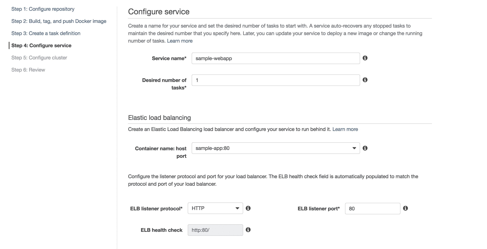

9.  In the next step, configure the cluster, which is a logical grouping of EC2 instances. By default, we'll be defining `t2.micro` as an EC2 instance type and the current number of instances as `1`:

    

10.  Review the configuration and deploy the ECS cluster. After the cluster is created, click on the **View Service** button to see details about the service:

    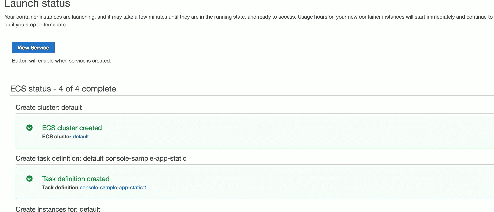

11.  Click on the EC2 container load balancer to get the publicly accessible service URL:

    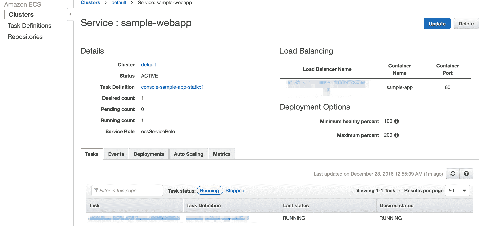

12.  In the description of the load balancer, DNS name is the URL to access the service from the Internet:

    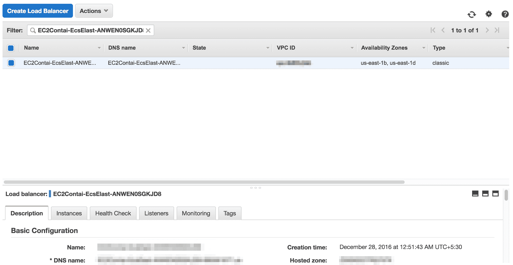

13.  The Welcome to nginx page can be seen as we access the load balancer public URL:

    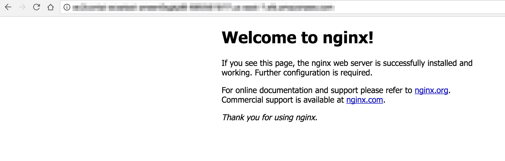

# 更新 ECS 集群中的 Docker 容器

我们让 Docker 容器在 ECS 集群中运行，所以现在，让我们浏览一下容器和服务都需要更新的场景。通常，这发生在持续交付模型中，其中我们有两个生产环境；蓝色环境是该服务的旧版本，目前正在运行，以处理用户的请求。新的发布环境被称为绿色环境，处于最后阶段，当我们从旧版本切换到新版本时，它将处理未来来自用户的请求。

蓝绿色部署有助于快速回滚。如果我们在最新的绿色环境中遇到任何问题，我们可以将路由器切换到蓝色环境。现在，由于绿色环境正在运行并处理所有请求，蓝色环境可以用作下一个部署的最后测试步骤的准备环境。借助 ECS 中的**任务定义**，可以轻松实现这种场景:


蓝绿色部署环境

1.  The new revision can be created by selecting the ECS task created and clicking on the **Create new Task Definition** button:

    

2.  In the new definition of the task, we can attach a new container or click on the container definition and update it. *Advanced container configuration* can also be used to set up the *Environment Variables*:

    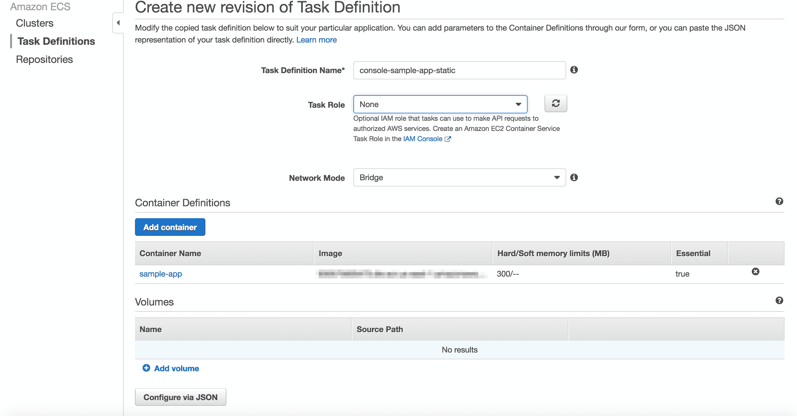

3.  After creating the latest task, click on **Actions** and then click on **Update Service**:

    

4.  The **console-sample-app-static:2** will update the **console-sample-app-static:1** and various options, including number of tasks and auto scaling options, are provided on the next screen:

    

将启动自动扩展组，包括 AMI、实例类型、安全组以及用于启动 ECS 实例的所有其他详细信息。使用扩展策略，我们可以扩展集群实例和服务，并在需求减少时安全地缩减它们。可用性区域感知 ECS 调度程序管理、分发和扩展集群，从而使体系结构高度可用。

# 微软 Azure 容器服务架构

Azure 是当今市场上增长最快的基础设施服务之一。它支持按需扩展以及在 Azure 云服务的帮助下创建混合环境和大数据的能力。Azure 容器服务提供开源容器集群和编排解决方案的部署。在 Azure 容器服务的帮助下，我们可以部署基于 DC/操作系统(马拉松)、Kubernetes 和 Swarm 的容器集群。Azure 门户提供了简单的用户界面和命令行界面支持来实现这一部署。

微软 Azure 正式成为第一个支持主流容器编排引擎的公有云。甚至 Azure 容器服务引擎也在 GitHub([https://github.com/Azure/acs-engine](https://github.com/Azure/acs-engine))上开源。

这一步使开发人员能够理解体系结构，并直接在 vSphere Hypervisor、KVM 或 HyperV 上运行多个编排引擎。 **Azure 资源管理器** ( **ARM** )模板为通过 ACS APIs 部署的集群提供了基础。ACS 引擎内置于 Go 中，使用户能够组合不同的配置，并构建可用于部署集群的最终模板。

Azure 容器引擎具有以下功能:

*   您选择的管弦乐队，如 DC/操作系统、Kubernetes斯或 Swarm
*   多个代理池(可用性集和虚拟机集)
*   多达 1，200 的 Docker Swarm集大小:
*   支持自定义 vNET

Azure 容器服务主要是以 DC/操作系统作为关键组件之一构建的，其实现经过优化，便于在微软 Azure 上创建和使用。ACS 体系结构有三个基本组件:用于管理虚拟机运行状况的 Azure Compute、用于容器运行状况管理的 Mesos 和用于 Docker API 管理的 Swarm:

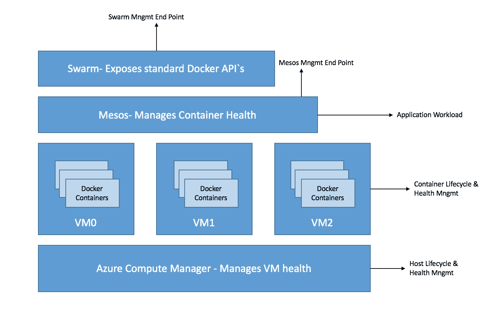

Microsoft Azure 容器架构

# 故障排除-微软 Azure 容器服务

在本节中，我们将了解如何部署 Docker Swarm 集群，并在 Microsoft Azure 中提供编排器配置的详细信息:

1.  We need to create an RSA key, which will be requested in the deployment steps. The key will be required to log in to the deployed machines post installation:

    ```
     $ ssh-keygen

    ```

    一旦生成，就可以在`~/root/id_rsa`中找到密钥

2.  Click on the **New** button in your Azure account portal:

    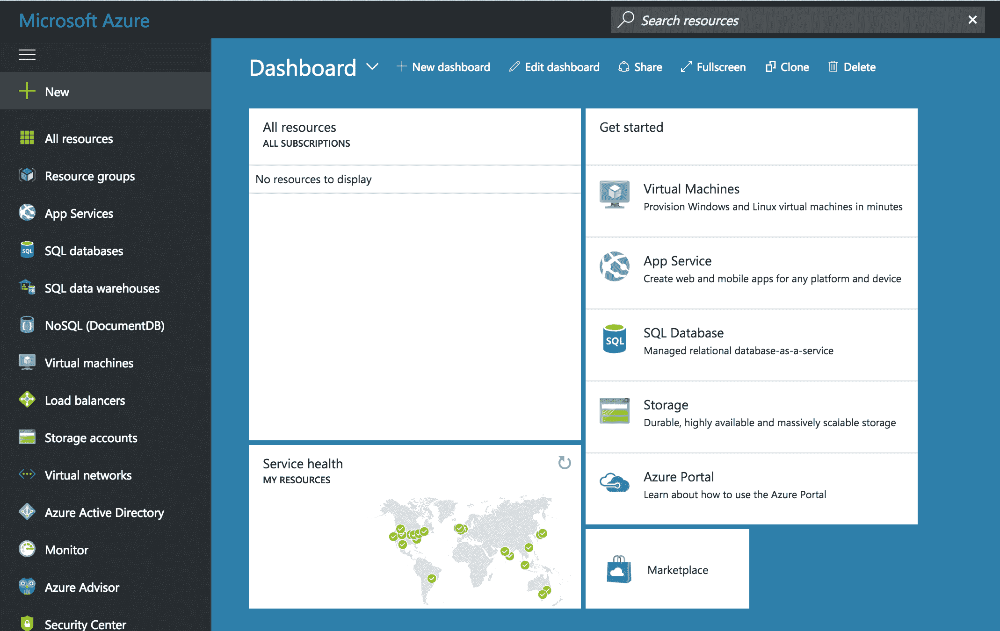

3.  Search for the **Azure Container Service** and select it:

    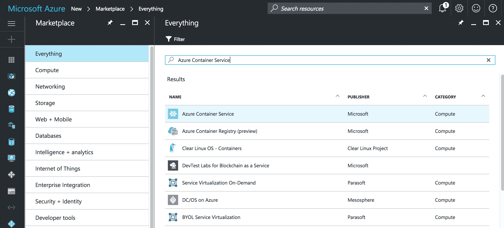

4.  After this step, select **Resource Manager** as the deployment model and click on the **Create** button:

    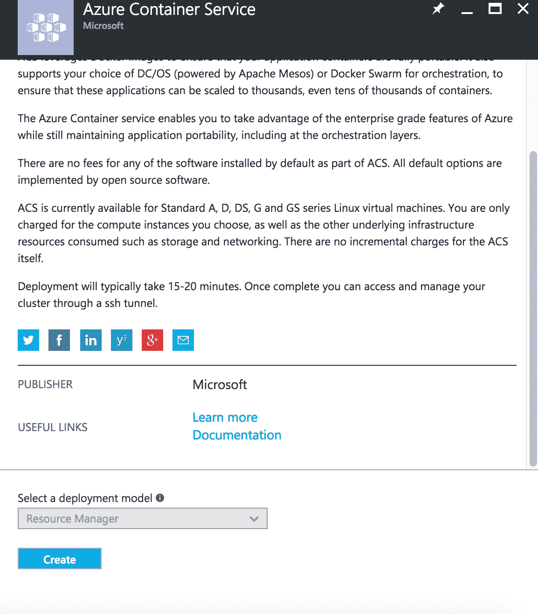

5.  Configure the basics settings page, the following details are required: **User name**, which will be administrator for the virtual machines deployed in the Docker Swarm cluster; the second field is to provide the **SSH public key** we created in the step 1; and create a new resource group by specifying the name in the **Resource Group** field:

    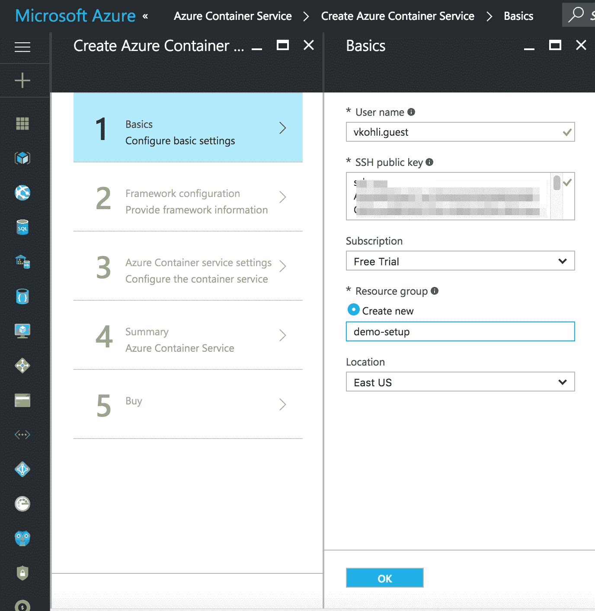

6.  Select the **Orchestrator configuration** as **Swarm**, **DC/OS**, or **Kubernetes**, as required:

    

7.  In the next step, provide the orchestrator configuration, **Agent count**, and **Master count** for this deployment. Also, the DNS prefix can be provided as `dockerswarm` or as required:

    

8.  Check the **Summary**, and once validation is passed click on **OK**. On the next screen, click on the **Purchase** button to go ahead with the deployment:

    

9.  Once the deployment has started, the status can be seen on the Azure primary **Dashboard**:

    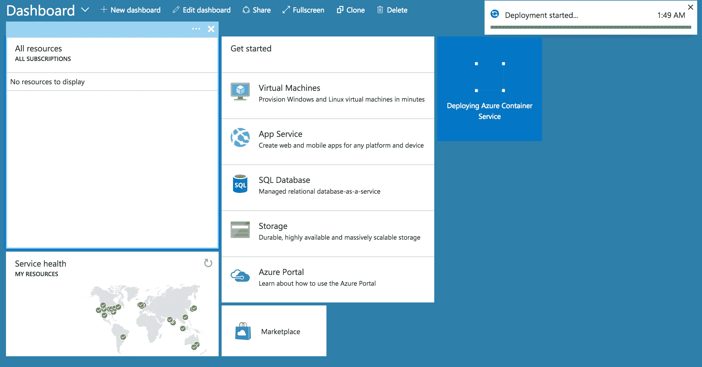

10.  Once the Docker Swarm cluster is created, click on the swarm-master from the Docker Swarm resources shown on the dashboard:

    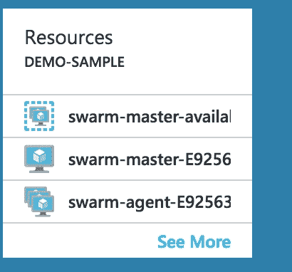

11.  In the **Essentials** section of the swarm-master, you'll be able to find the DNS entry, as shown in the following screenshot:

    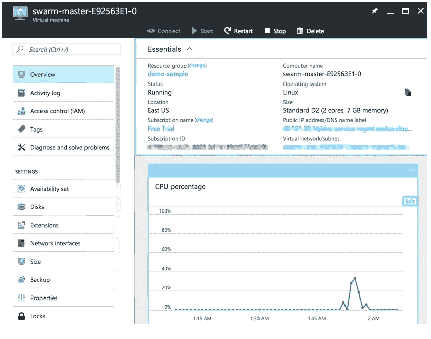

以下是通过 SSH 连接到群主服务器的命令:

```
ssh <DNS_FROM_FIELD> -A -p 2200 -i <PUB_FILE_LOCATION>

```

一旦连接到主服务器，就可以执行基本的 Docker Swarm 命令，并且可以在微软 Azure 上部署的 Swarm 集群上完成容器部署。

# AWS 和 Azure 的 Docker Beta 版

随着这项服务的最新发布，Docker 通过与两个云平台的基础设施服务紧密集成，使得在 AWS 和 Azure 上部署 Docker 引擎变得非常简单。这允许开发人员捆绑他们的代码并将其部署在生产机器中，而不管环境如何。目前，这项服务处于测试版，但是我们已经介绍了 AWS Docker 部署的基本教程。该服务还允许您在这些环境中轻松升级 Docker 版本。这些服务中甚至启用了 Swarm 模式，这为单个 Docker 引擎提供了自修复和自组织的 Swarm 模式。它们也分布在可用性区域。

与前面的方法相比，AWS 和 Azure 的 Docker Beta 版提供了以下改进:

*   将 SSH 密钥用于 IaaS 帐户，用于访问控制
*   在系统中调配应用时，轻松调配基础架构负载平衡和动态更新
*   安全 Docker 设置可以在安全组和虚拟网络的帮助下完成

AWS 的 Docker 使用*云信息*模板并创建以下对象:

*   启用自动缩放的 EC2 实例
*   IAM 配置文件
*   DynamoDB 表
*   VPC、子网和安全组
*   英国文学学士（bachelor of english literature）

部署和访问部署的实例需要 AWS 区域的 SSH 密钥。也可以使用 AWS 命令行界面使用云信息模板完成安装，但是在本教程中，我们将介绍基于 AWS 控制台的方法:

1.  登录控制台，选择云信息，点击**创建堆栈**。
2.  **Specify the Amazon S3 template URL** as `https://docker-for-aws.s3.amazonaws.com/aws/beta/aws-v1.13.0-rc4-beta14.json`, as follows:

    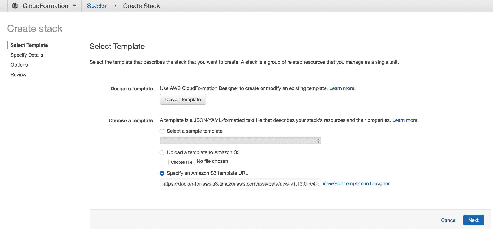

3.  On the next screen, specify the stack details, stating the number of Swarm managers and nodes needing to be deployed. The AWS generated SSH key to be used can also be specified:

    

4.  On the next screen, we'll have the option to provide tags as well as IAM permission roles:

    

5.  Review the details and launch the stack:

    

6.  The stack will get listed with the status **CREATE_IN_PROGRESS**. Wait till the stack gets fully deployed:

    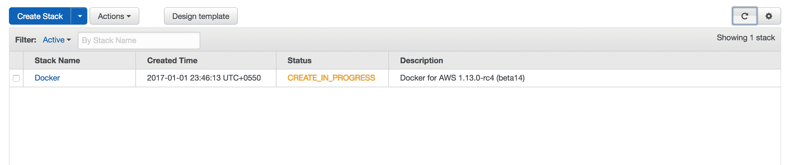

7.  Post deployment, the stack will have the status **CREATE_COMPLETE**. Click on it and the deployed environment details will be listed:

    

AWS 生成的 SSH 密钥可用于 SSH 到管理器节点并管理已部署的 Docker Swarm 实例:

```
$ ssh -i <path-to-ssh-key> docker@<ssh-host> 
Welcome to Docker!

```

`docker info`命令将提供关于蜂群的信息。可以使用以下命令列出群节点:

```
$ docker info  
Containers: 5 
 Running: 4 
 Paused: 0 
 Stopped: 1 
Images: 5 
Server Version: 1.13.0-rc4 
Storage Driver: overlay2 
 Backing Filesystem: extfs 

$ docker node ls 
ID                           HOSTNAME                       STATUS  AVAILABILITY  MANAGER STATUS 
koewopxooyp5ftf6tn5wypjtd    ip-172-31-37-122.ec2.internal  Ready   Active         
qs9swn3uv67v4vhahxrp4q24g    ip-172-31-2-43.ec2.internal    Ready   Active         
ubkzv527rlr08fjjgvweu0k6t *  ip-172-31-1-137.ec2.internal   Ready   Active        Leader

```

SSH 连接也可以直接连接到 leader 节点，并且可以部署一个基本的 Docker 容器:

```
$ ssh docker@ip-172-31-37-122.ec2.internal 

$ docker run hello-world 
Unable to find image 'hello-world:latest' locally 
latest: Pulling from library/hello-world 
c04b14da8d14: Pull complete  
Digest: sha256:0256e8a36e2070f7bf2d0b0763dbabdd67798512411de4cdcf9431a1feb60fd9 
Status: Downloaded newer image for hello-world:latest 

Hello from Docker! 

```

可以为前面部署的容器创建服务，如下所示:

```
$ docker service create --replicas 1 --name helloworld alpine ping docker.com
xo7byk0wyx5gim9y7etn3o6kz 
$ docker service ls
ID            NAME        MODE        REPLICAS   IMAGE
xo7byk0wyx5g  helloworld  replicated  1/1        alpine:latest 
$ docker service inspect --pretty helloworld
ID:           xo7byk0wyx5gim9y7etn3o6kz
Name:         helloworld
Service Mode: Replicated

```

该服务可以在 Swarm 集群中进行扩展，并按如下方式删除:

```
$ docker service scale helloworld=5 
helloworld scaled to 5 

$ docker service ps helloworld 
ID            NAME          IMAGE          NODE                           DESIRED STATE  CURRENT STATE               ERROR  PORTS 
9qu8q4equobn  helloworld.1  alpine:latest  ip-172-31-37-122.ec2.internal  Running        Running about a minute ago          
tus2snjwqmxm  helloworld.2  alpine:latest  ip-172-31-37-122.ec2.internal  Running        Running 6 seconds ago               
cxnilnwa09tl  helloworld.3  alpine:latest  ip-172-31-2-43.ec2.internal    Running        Running 6 seconds ago               
cegnn648i6b2  helloworld.4  alpine:latest  ip-172-31-1-137.ec2.internal   Running        Running 6 seconds ago               
sisoxrpxxbx5  helloworld.5  alpine:latest  ip-172-31-1-137.ec2.internal   Running        Running 6 seconds ago               

$ docker service rm helloworld 
helloworld

```

# 总结

在本章中，我们已经介绍了公共云上的 Docker 部署微软 Azure 和 AWS。两家云提供商都为客户提供了有竞争力的容器服务。本章有助于解释 AWS EC2 和微软 Azure 容器服务架构的详细架构。它还涵盖了容器集群的所有部署步骤的安装和故障排除。本章已经介绍了蓝绿色部署场景以及如何在 AWS EC2 中支持它，这在现代 SaaS 应用中是非常必要的。最后，我们已经介绍了针对 AWS 和 Azure 的 Docker Beta 版，它是最近推出的，提供了容器从开发环境到生产环境的简单迁移，因为它们是相同的。基于容器的应用可以通过 Docker Beta 轻松部署和扩展，因为这项服务与云提供商的 IaaS 非常好地结合在一起。